# Spring Boot REST Design Patterns — Visual Reference

A visual, step-by-step reference for design patterns commonly used in REST applications with Spring Boot.

Focus areas:

- REST application structure
- Layered architecture
- DTO / Mapper pattern
- Repository pattern
- Service pattern
- Read-heavy systems
- Write-heavy systems
- CQRS
- Saga
- Outbox pattern
- Caching
- Retry / Circuit Breaker
- Idempotency
- Rate limiting
- Pagination
- Event-driven REST systems
- Testing patterns

---

## Clickable Index

### Basics

1. [Big Picture](#1-big-picture)
2. [Project Setup](#2-project-setup)
3. [Common REST Layers](#3-common-rest-layers)
4. [Sample Domain](#4-sample-domain)

### Core REST Patterns

5. [Controller Pattern](#5-controller-pattern)
6. [DTO Pattern](#6-dto-pattern)
7. [Mapper Pattern](#7-mapper-pattern)
8. [Service Pattern](#8-service-pattern)
9. [Repository Pattern](#9-repository-pattern)
10. [Exception Handler Pattern](#10-exception-handler-pattern)
11. [Validation Pattern](#11-validation-pattern)

### Read-Heavy System Patterns

12. [Read-Heavy Architecture](#12-read-heavy-architecture)
13. [Pagination Pattern](#13-pagination-pattern)
14. [Cache-Aside Pattern](#14-cache-aside-pattern)
15. [Redis Cache Setup](#15-redis-cache-setup)
16. [Database Indexing Pattern](#16-database-indexing-pattern)
17. [Read Replica Pattern](#17-read-replica-pattern)

### Write-Heavy System Patterns

18. [Write-Heavy Architecture](#18-write-heavy-architecture)
19. [Command Pattern](#19-command-pattern)
20. [Idempotency Pattern](#20-idempotency-pattern)
21. [Async Write Pattern](#21-async-write-pattern)
22. [Transactional Outbox Pattern](#22-transactional-outbox-pattern)
23. [Bulk Write Pattern](#23-bulk-write-pattern)

### Advanced Distributed Patterns

24. [CQRS Pattern](#24-cqrs-pattern)
25. [Saga Pattern](#25-saga-pattern)
26. [Choreography Saga](#26-choreography-saga)
27. [Orchestration Saga](#27-orchestration-saga)
28. [Event-Driven Pattern](#28-event-driven-pattern)
29. [Retry Pattern](#29-retry-pattern)
30. [Circuit Breaker Pattern](#30-circuit-breaker-pattern)
31. [Rate Limiting Pattern](#31-rate-limiting-pattern)

### Production Patterns

32. [API Versioning Pattern](#32-api-versioning-pattern)
33. [Security Placement Pattern](#33-security-placement-pattern)
34. [Observability Pattern](#34-observability-pattern)
35. [Testing Pattern](#35-testing-pattern)
36. [Pattern Selection Cheat Sheet](#36-pattern-selection-cheat-sheet)

---

# 1. Big Picture

REST applications usually receive HTTP requests, validate input, run business logic, store or fetch data, and return responses.

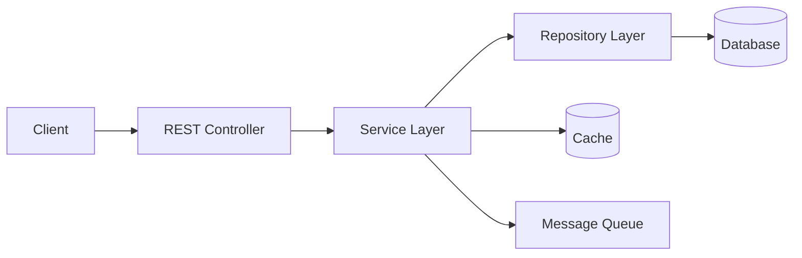

Simple rule:

```text
Controller = HTTP
Service = Business logic
Repository = Database
DTO = API shape
Entity = Database shape
```

---

# 2. Project Setup

## Maven dependencies

```xml
<dependencies>
    <dependency>
        <groupId>org.springframework.boot</groupId>
        <artifactId>spring-boot-starter-web</artifactId>
    </dependency>

    <dependency>
        <groupId>org.springframework.boot</groupId>
        <artifactId>spring-boot-starter-data-jpa</artifactId>
    </dependency>

    <dependency>
        <groupId>org.springframework.boot</groupId>
        <artifactId>spring-boot-starter-validation</artifactId>
    </dependency>

    <dependency>
        <groupId>org.postgresql</groupId>
        <artifactId>postgresql</artifactId>
        <scope>runtime</scope>
    </dependency>

    <dependency>
        <groupId>org.springframework.boot</groupId>
        <artifactId>spring-boot-starter-test</artifactId>
        <scope>test</scope>
    </dependency>
</dependencies>
```

## Basic package structure

```text
com.example.orders
├── api
│   ├── OrderController.java
│   └── dto
├── service
├── repository
├── domain
├── mapper
├── config
└── exception
```

Visual:

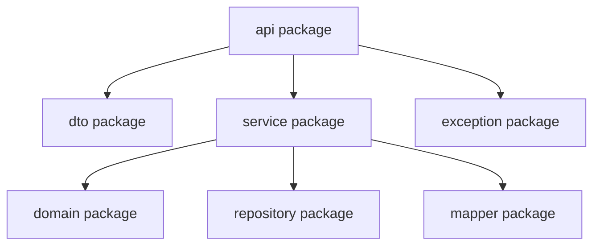

---

# 3. Common REST Layers

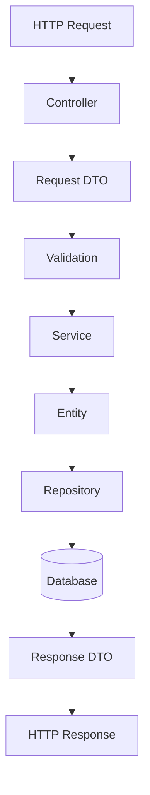

Layer responsibility:

| Layer | Job |
|---|---|
| Controller | Receives HTTP request |
| DTO | Carries API data |
| Service | Business rules |
| Repository | Database access |
| Entity | Database model |
| Mapper | Converts DTO to Entity |

---

# 4. Sample Domain

We will use an order system.

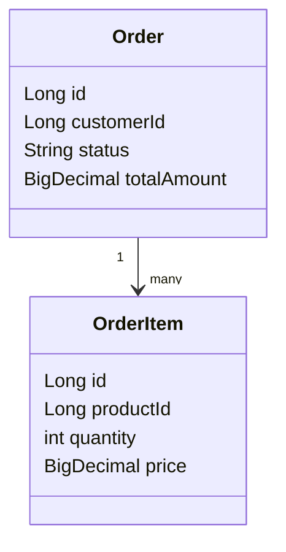

Entity:

```java
@Entity
@Table(name = "orders")
public class Order {

    @Id
    @GeneratedValue(strategy = GenerationType.IDENTITY)
    private Long id;

    private Long customerId;
    private String status;
    private BigDecimal totalAmount;

    protected Order() {
    }

    public Order(Long customerId, BigDecimal totalAmount) {
        this.customerId = customerId;
        this.totalAmount = totalAmount;
        this.status = "CREATED";
    }

    public Long getId() {
        return id;
    }

    public Long getCustomerId() {
        return customerId;
    }

    public String getStatus() {
        return status;
    }

    public BigDecimal getTotalAmount() {
        return totalAmount;
    }
}
```

---

# 5. Controller Pattern

Controller handles only HTTP concerns.

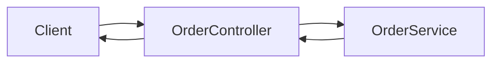

```java
@RestController
@RequestMapping("/api/orders")
public class OrderController {

    private final OrderService orderService;

    public OrderController(OrderService orderService) {
        this.orderService = orderService;
    }

    @PostMapping
    public ResponseEntity<OrderResponse> create(@Valid @RequestBody CreateOrderRequest request) {
        OrderResponse response = orderService.createOrder(request);
        return ResponseEntity.status(HttpStatus.CREATED).body(response);
    }

    @GetMapping("/{id}")
    public OrderResponse findById(@PathVariable Long id) {
        return orderService.findById(id);
    }
}
```

Do not put business logic in controller.

---

# 6. DTO Pattern

DTO separates API model from database model.

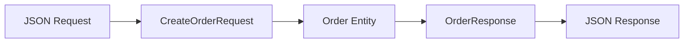

```java
public record CreateOrderRequest(
        @NotNull Long customerId,
        @NotNull BigDecimal totalAmount
) {
}
```

```java
public record OrderResponse(
        Long id,
        Long customerId,
        String status,
        BigDecimal totalAmount
) {
}
```

Use DTO when:

- You do not want to expose database fields
- Request and response shapes are different
- You want validation near API boundary

---

# 7. Mapper Pattern

Mapper converts between DTO and Entity.

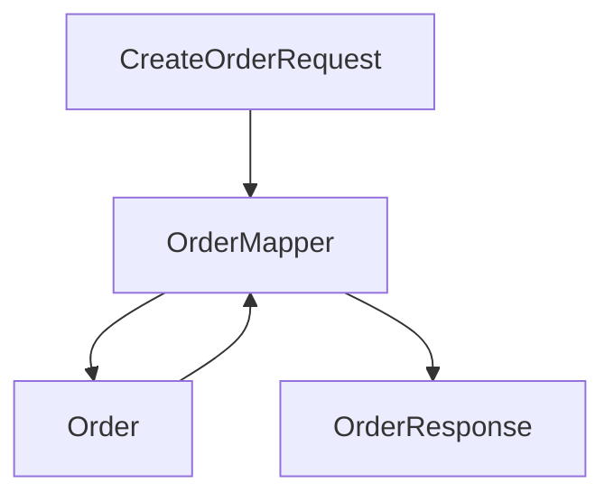

```java
@Component
public class OrderMapper {

    public Order toEntity(CreateOrderRequest request) {
        return new Order(request.customerId(), request.totalAmount());
    }

    public OrderResponse toResponse(Order order) {
        return new OrderResponse(
                order.getId(),
                order.getCustomerId(),
                order.getStatus(),
                order.getTotalAmount()
        );
    }
}
```

---

# 8. Service Pattern

Service contains business logic.

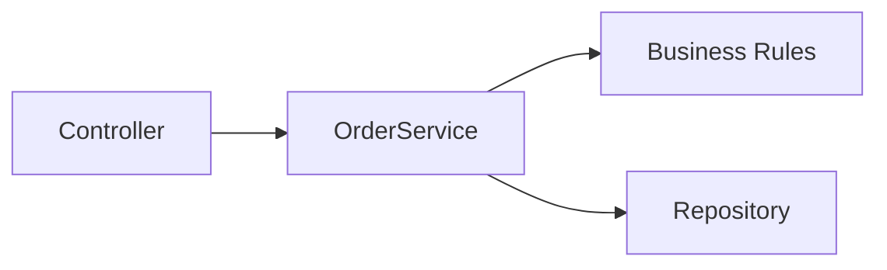

```java
@Service
public class OrderService {

    private final OrderRepository orderRepository;
    private final OrderMapper orderMapper;

    public OrderService(OrderRepository orderRepository, OrderMapper orderMapper) {
        this.orderRepository = orderRepository;
        this.orderMapper = orderMapper;
    }

    @Transactional
    public OrderResponse createOrder(CreateOrderRequest request) {
        Order order = orderMapper.toEntity(request);
        Order saved = orderRepository.save(order);
        return orderMapper.toResponse(saved);
    }

    @Transactional(readOnly = true)
    public OrderResponse findById(Long id) {
        Order order = orderRepository.findById(id)
                .orElseThrow(() -> new ResourceNotFoundException("Order not found"));
        return orderMapper.toResponse(order);
    }
}
```

---

# 9. Repository Pattern

Repository hides database details.

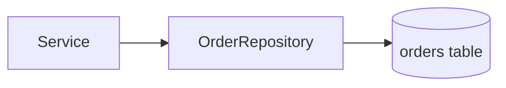

```java
public interface OrderRepository extends JpaRepository<Order, Long> {

    Page<Order> findByCustomerId(Long customerId, Pageable pageable);

    List<Order> findByStatus(String status);
}
```

---

# 10. Exception Handler Pattern

Centralize error responses.

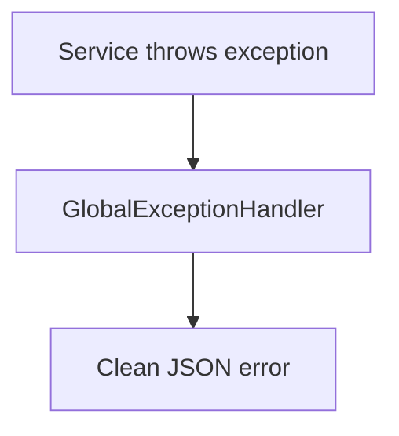

```java
@ResponseStatus(HttpStatus.NOT_FOUND)
public class ResourceNotFoundException extends RuntimeException {
    public ResourceNotFoundException(String message) {
        super(message);
    }
}
```

```java
@RestControllerAdvice
public class GlobalExceptionHandler {

    @ExceptionHandler(ResourceNotFoundException.class)
    public ResponseEntity<Map<String, String>> handleNotFound(ResourceNotFoundException ex) {
        return ResponseEntity.status(HttpStatus.NOT_FOUND)
                .body(Map.of("error", ex.getMessage()));
    }
}
```

---

# 11. Validation Pattern

Validate request before service logic.

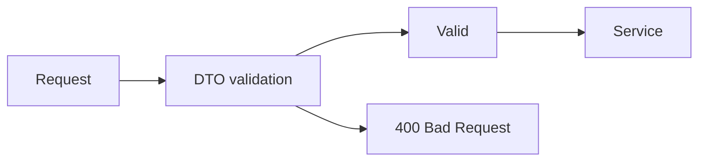

```java
public record CreateCustomerRequest(
        @NotBlank String name,
        @Email String email
) {
}
```

```java
@PostMapping("/customers")
public ResponseEntity<Void> createCustomer(@Valid @RequestBody CreateCustomerRequest request) {
    customerService.create(request);
    return ResponseEntity.status(HttpStatus.CREATED).build();
}
```

---

# 12. Read-Heavy Architecture

Read-heavy means many users read data more than they write data.

Examples:

- Product catalog
- News feed
- Profile pages
- Search pages
- Dashboard APIs

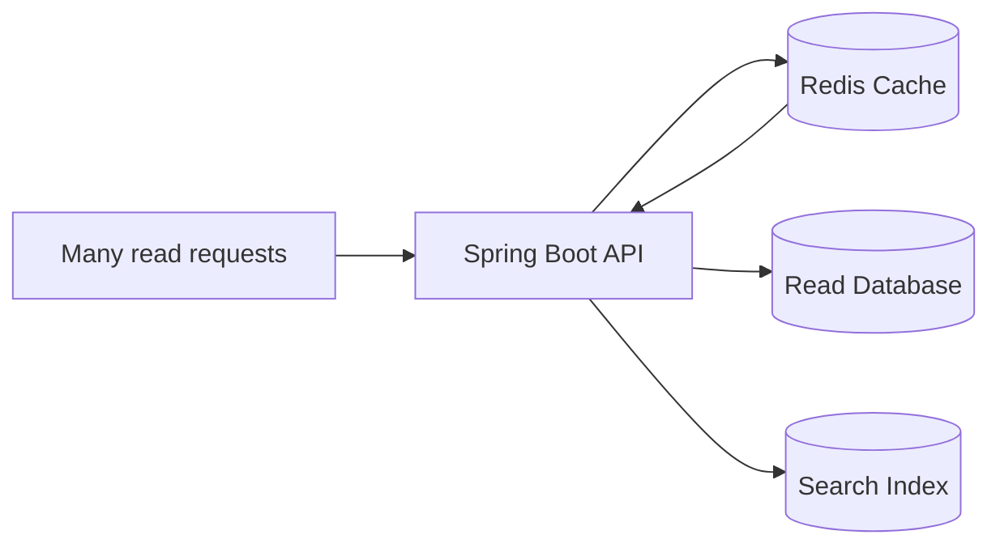

Goal:

```text
Reduce database pressure.
Return data fast.
Use cache, pagination, indexes, and read replicas.
```

---

# 13. Pagination Pattern

Never return unlimited rows.

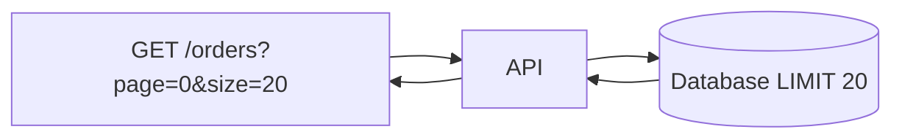

```java
@GetMapping
public Page<OrderResponse> findOrders(
        @RequestParam Long customerId,
        Pageable pageable
) {
    return orderService.findByCustomer(customerId, pageable);
}
```

```java
@Transactional(readOnly = true)
public Page<OrderResponse> findByCustomer(Long customerId, Pageable pageable) {
    return orderRepository.findByCustomerId(customerId, pageable)
            .map(orderMapper::toResponse);
}
```

Request example:

```http
GET /api/orders?customerId=10&page=0&size=20&sort=id,desc
```

---

# 14. Cache-Aside Pattern

Application checks cache first. If missing, it reads database and stores result in cache.

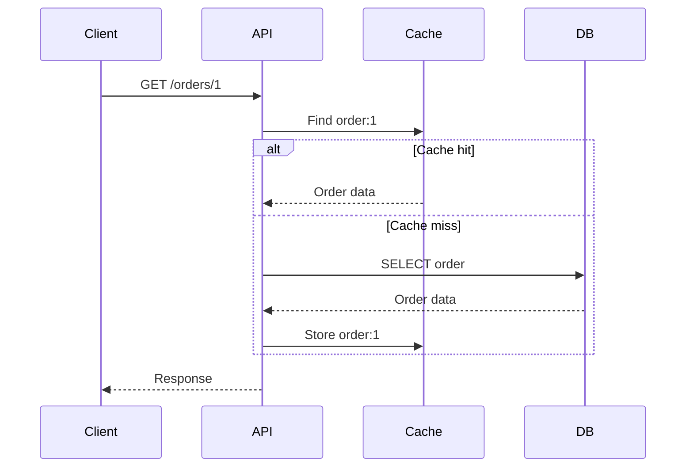

Use when:

- Data is read often
- Slightly stale data is acceptable
- You want faster reads

---

# 15. Redis Cache Setup

## Dependency

```xml
<dependency>
    <groupId>org.springframework.boot</groupId>
    <artifactId>spring-boot-starter-cache</artifactId>
</dependency>

<dependency>
    <groupId>org.springframework.boot</groupId>
    <artifactId>spring-boot-starter-data-redis</artifactId>
</dependency>
```

## application.yml

```yaml
spring:
  cache:
    type: redis
  data:
    redis:
      host: localhost
      port: 6379
```

## Enable cache

```java
@Configuration
@EnableCaching
public class CacheConfig {
}
```

## Use cache

```java
@Cacheable(value = "orders", key = "#id")
@Transactional(readOnly = true)
public OrderResponse findById(Long id) {
    Order order = orderRepository.findById(id)
            .orElseThrow(() -> new ResourceNotFoundException("Order not found"));
    return orderMapper.toResponse(order);
}
```

## Evict cache after update

```java
@CacheEvict(value = "orders", key = "#id")
@Transactional
public void cancelOrder(Long id) {
    Order order = orderRepository.findById(id)
            .orElseThrow(() -> new ResourceNotFoundException("Order not found"));
    order.cancel();
}
```

---

# 16. Database Indexing Pattern

Indexes make frequent queries faster.

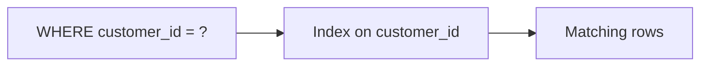

Entity index:

```java
@Entity
@Table(
    name = "orders",
    indexes = {
        @Index(name = "idx_orders_customer_id", columnList = "customerId"),
        @Index(name = "idx_orders_status", columnList = "status")
    }
)
public class Order {
    @Id
    @GeneratedValue(strategy = GenerationType.IDENTITY)
    private Long id;

    private Long customerId;
    private String status;
}
```

Use indexes for:

- Columns used in WHERE
- Columns used in JOIN
- Columns used in ORDER BY

Avoid too many indexes in write-heavy systems because every write must update indexes.

---

# 17. Read Replica Pattern

Use primary database for writes and replica database for reads.

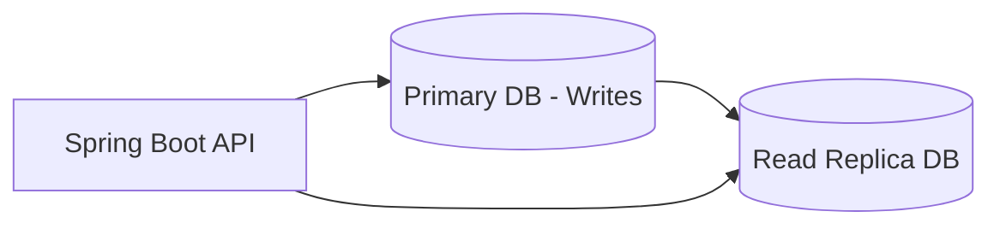

Use when:

- Read traffic is very high
- Database CPU is high because of SELECT queries
- Reports and dashboards slow down normal APIs

Important:

```text
Read replicas can be slightly delayed.
Do not read immediately after write if strong consistency is required.
```

---

# 18. Write-Heavy Architecture

Write-heavy means the system receives many create/update events.

Examples:

- Payment events
- Click tracking
- Chat messages
- IoT telemetry
- Order placement
- Audit logs

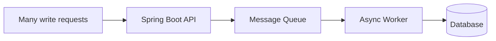

Goal:

```text
Accept writes quickly.
Avoid duplicate writes.
Handle failures safely.
Process async when possible.
```

---

# 19. Command Pattern

Command object represents a write action.

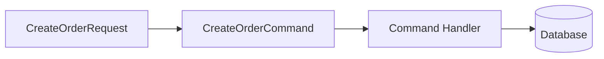

```java
public record CreateOrderCommand(
        Long customerId,
        BigDecimal totalAmount
) {
}
```

```java
@Service
public class CreateOrderHandler {

    private final OrderRepository orderRepository;

    public CreateOrderHandler(OrderRepository orderRepository) {
        this.orderRepository = orderRepository;
    }

    @Transactional
    public Long handle(CreateOrderCommand command) {
        Order order = new Order(command.customerId(), command.totalAmount());
        return orderRepository.save(order).getId();
    }
}
```

Controller:

```java
@PostMapping
public ResponseEntity<Long> create(@Valid @RequestBody CreateOrderRequest request) {
    CreateOrderCommand command = new CreateOrderCommand(
            request.customerId(),
            request.totalAmount()
    );
    Long orderId = createOrderHandler.handle(command);
    return ResponseEntity.status(HttpStatus.CREATED).body(orderId);
}
```

---

# 20. Idempotency Pattern

Idempotency prevents duplicate writes when client retries.

Example problem:

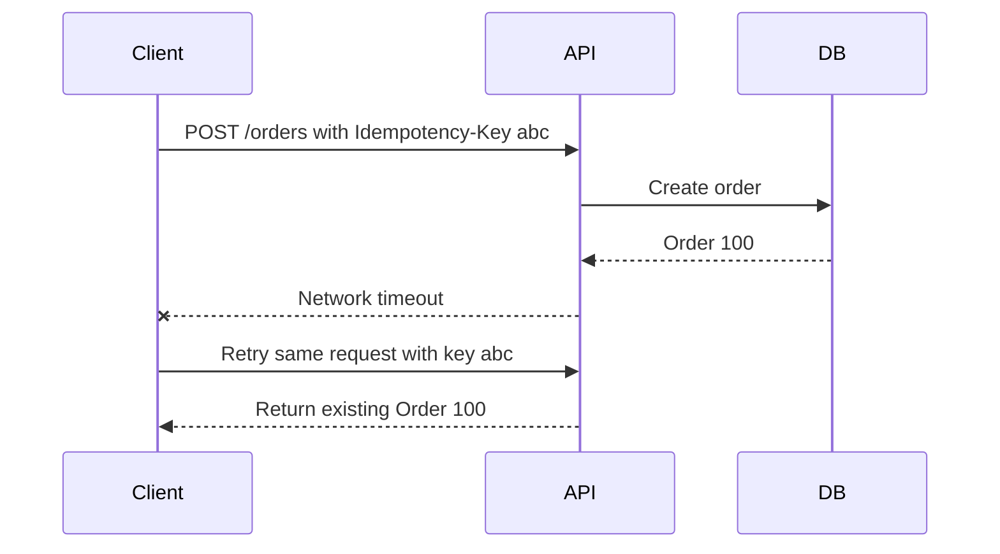

Table:

```java
@Entity
@Table(name = "idempotency_keys")
public class IdempotencyKey {

    @Id
    private String keyValue;

    private Long resourceId;
    private String resourceType;

    protected IdempotencyKey() {
    }

    public IdempotencyKey(String keyValue, Long resourceId, String resourceType) {
        this.keyValue = keyValue;
        this.resourceId = resourceId;
        this.resourceType = resourceType;
    }
}
```

Repository:

```java
public interface IdempotencyKeyRepository extends JpaRepository<IdempotencyKey, String> {
}
```

Service:

```java
@Transactional
public Long createOrder(CreateOrderRequest request, String idempotencyKey) {
    Optional<IdempotencyKey> existing = idempotencyKeyRepository.findById(idempotencyKey);

    if (existing.isPresent()) {
        return existing.get().getResourceId();
    }

    Order order = orderRepository.save(new Order(request.customerId(), request.totalAmount()));

    idempotencyKeyRepository.save(
            new IdempotencyKey(idempotencyKey, order.getId(), "ORDER")
    );

    return order.getId();
}
```

Controller:

```java
@PostMapping
public ResponseEntity<Long> create(
        @RequestHeader("Idempotency-Key") String idempotencyKey,
        @Valid @RequestBody CreateOrderRequest request
) {
    Long id = orderService.createOrder(request, idempotencyKey);
    return ResponseEntity.status(HttpStatus.CREATED).body(id);
}
```

---

# 21. Async Write Pattern

API accepts request quickly and processes later.

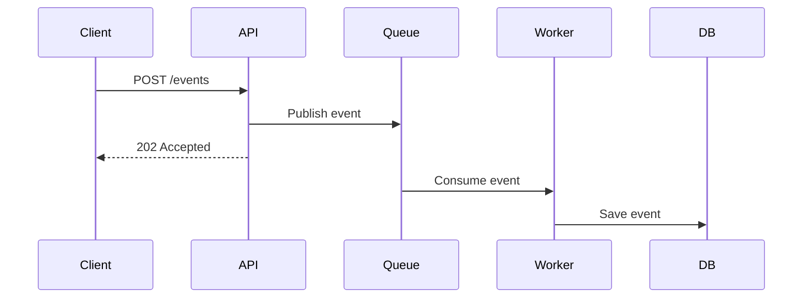

Controller:

```java
@PostMapping("/events")
public ResponseEntity<Void> receiveEvent(@RequestBody UserEvent event) {
    eventPublisher.publish(event);
    return ResponseEntity.accepted().build();
}
```

Publisher example:

```java
@Component
public class EventPublisher {

    private final ApplicationEventPublisher publisher;

    public EventPublisher(ApplicationEventPublisher publisher) {
        this.publisher = publisher;
    }

    public void publish(UserEvent event) {
        publisher.publishEvent(event);
    }
}
```

Listener:

```java
@Component
public class UserEventListener {

    @Async
    @EventListener
    public void handle(UserEvent event) {
        System.out.println("Process event: " + event.type());
    }
}
```

Enable async:

```java
@Configuration
@EnableAsync
public class AsyncConfig {
}
```

---

# 22. Transactional Outbox Pattern

Outbox safely stores events in the same transaction as the business write.

Problem:

```text
Database write succeeds, but message publish fails.
System becomes inconsistent.
```

Solution:

```mermaid
sequenceDiagram
    participant API
    participant DB
    participant Scheduler
    participant Broker

    API->>DB: Save order and outbox event in one transaction
    Scheduler->>DB: Read unpublished outbox events
    Scheduler->>Broker: Publish event
    Scheduler->>DB: Mark event as published
```

Outbox entity:

```java
@Entity
@Table(name = "outbox_events")
public class OutboxEvent {

    @Id
    @GeneratedValue(strategy = GenerationType.IDENTITY)
    private Long id;

    private String aggregateType;
    private Long aggregateId;
    private String eventType;

    @Column(length = 4000)
    private String payload;

    private boolean published;

    protected OutboxEvent() {
    }

    public OutboxEvent(String aggregateType, Long aggregateId, String eventType, String payload) {
        this.aggregateType = aggregateType;
        this.aggregateId = aggregateId;
        this.eventType = eventType;
        this.payload = payload;
        this.published = false;
    }

    public void markPublished() {
        this.published = true;
    }
}
```

Write order and event together:

```java
@Transactional
public Long createOrder(CreateOrderRequest request) {
    Order order = orderRepository.save(new Order(request.customerId(), request.totalAmount()));

    outboxRepository.save(new OutboxEvent(
            "ORDER",
            order.getId(),
            "ORDER_CREATED",
            "{\"orderId\":" + order.getId() + "}"
    ));

    return order.getId();
}
```

Publisher:

```java
@Component
public class OutboxPublisher {

    private final OutboxRepository outboxRepository;

    public OutboxPublisher(OutboxRepository outboxRepository) {
        this.outboxRepository = outboxRepository;
    }

    @Scheduled(fixedDelay = 5000)
    @Transactional
    public void publishPendingEvents() {
        List<OutboxEvent> events = outboxRepository.findTop50ByPublishedFalseOrderByIdAsc();

        for (OutboxEvent event : events) {
            System.out.println("Publish event: " + event);
            event.markPublished();
        }
    }
}
```

---

# 23. Bulk Write Pattern

Batch multiple records instead of writing one by one.

```mermaid
flowchart LR
    Request["1000 records"] --> API["API"]
    API --> Batch["Batch save"]
    Batch --> DB[("Database")]
```

```java
@PostMapping("/bulk")
public ResponseEntity<Void> createBulk(@RequestBody List<CreateOrderRequest> requests) {
    orderService.createBulk(requests);
    return ResponseEntity.accepted().build();
}
```

```java
@Transactional
public void createBulk(List<CreateOrderRequest> requests) {
    List<Order> orders = requests.stream()
            .map(request -> new Order(request.customerId(), request.totalAmount()))
            .toList();

    orderRepository.saveAll(orders);
}
```

application.yml:

```yaml
spring:
  jpa:
    properties:
      hibernate:
        jdbc:
          batch_size: 50
        order_inserts: true
        order_updates: true
```

---

# 24. CQRS Pattern

CQRS means separate write model from read model.

```text
Command Query Responsibility Segregation
```

```mermaid
flowchart TD
    Client["Client"] --> CommandAPI["Command API"]
    Client --> QueryAPI["Query API"]

    CommandAPI --> WriteDB[("Write DB")]
    WriteDB --> Event["Event"]
    Event --> Projection["Projection Worker"]
    Projection --> ReadDB[("Read DB")]

    QueryAPI --> ReadDB
```

Use CQRS when:

- Reads and writes have different performance needs
- Read response shape is very different from write entity
- You need dashboards, feeds, reports, or search views

Do not use CQRS for simple CRUD unless needed.

---

# 25. Saga Pattern

Saga manages a business transaction across multiple services.

Example: order checkout.

```mermaid
flowchart LR
    Order["Create Order"] --> Payment["Reserve Payment"]
    Payment --> Inventory["Reserve Inventory"]
    Inventory --> Shipping["Create Shipment"]
    Shipping --> Done["Order Confirmed"]
```

If one step fails, run compensation.

```mermaid
flowchart LR
    PaymentFail["Payment failed"] --> CancelOrder["Cancel Order"]
    InventoryFail["Inventory failed"] --> RefundPayment["Refund Payment"]
    ShippingFail["Shipping failed"] --> ReleaseInventory["Release Inventory"]
```

Use Saga when:

- Multiple services own their own databases
- Distributed transaction is not practical
- Failure needs compensation

---

# 26. Choreography Saga

Each service listens to events and reacts.

```mermaid
sequenceDiagram
    participant OrderService
    participant EventBus
    participant PaymentService
    participant InventoryService

    OrderService->>EventBus: OrderCreated
    EventBus->>PaymentService: OrderCreated
    PaymentService->>EventBus: PaymentReserved
    EventBus->>InventoryService: PaymentReserved
    InventoryService->>EventBus: InventoryReserved
```

Small event object:

```java
public record OrderCreatedEvent(
        Long orderId,
        Long customerId,
        BigDecimal amount
) {
}
```

Event listener:

```java
@Component
public class PaymentEventHandler {

    @EventListener
    public void on(OrderCreatedEvent event) {
        System.out.println("Reserve payment for order " + event.orderId());
    }
}
```

Good for:

- Simple flows
- Loose coupling
- Event-driven systems

Risk:

- Flow becomes hard to understand when many services are involved

---

# 27. Orchestration Saga

A central orchestrator controls the process.

```mermaid
sequenceDiagram
    participant Orchestrator
    participant OrderService
    participant PaymentService
    participant InventoryService

    Orchestrator->>OrderService: Create order
    Orchestrator->>PaymentService: Reserve payment
    Orchestrator->>InventoryService: Reserve inventory
    InventoryService-->>Orchestrator: Failed
    Orchestrator->>PaymentService: Refund payment
    Orchestrator->>OrderService: Cancel order
```

Orchestrator example:

```java
@Service
public class CheckoutSagaOrchestrator {

    private final OrderClient orderClient;
    private final PaymentClient paymentClient;
    private final InventoryClient inventoryClient;

    public CheckoutSagaOrchestrator(
            OrderClient orderClient,
            PaymentClient paymentClient,
            InventoryClient inventoryClient
    ) {
        this.orderClient = orderClient;
        this.paymentClient = paymentClient;
        this.inventoryClient = inventoryClient;
    }

    public void checkout(CheckoutRequest request) {
        Long orderId = orderClient.createOrder(request);

        try {
            paymentClient.reserve(orderId, request.amount());
            inventoryClient.reserve(orderId, request.productId());
            orderClient.confirm(orderId);
        } catch (Exception ex) {
            paymentClient.refund(orderId);
            orderClient.cancel(orderId);
        }
    }
}
```

Good for:

- Complex workflows
- Easy visibility
- Central control

Risk:

- Orchestrator can become too powerful

---

# 28. Event-Driven Pattern

REST API writes data and publishes events for other systems.

```mermaid
flowchart LR
    REST["REST API"] --> DB[("Database")]
    REST --> EventBus["Event Bus"]
    EventBus --> Email["Email Service"]
    EventBus --> Analytics["Analytics Service"]
    EventBus --> Notification["Notification Service"]
```

Simple Spring event:

```java
public record OrderCreatedEvent(Long orderId) {
}
```

```java
@Service
public class OrderService {

    private final ApplicationEventPublisher eventPublisher;

    public OrderService(ApplicationEventPublisher eventPublisher) {
        this.eventPublisher = eventPublisher;
    }

    public void createOrder() {
        Long orderId = 1L;
        eventPublisher.publishEvent(new OrderCreatedEvent(orderId));
    }
}
```

```java
@Component
public class EmailNotificationListener {

    @EventListener
    public void on(OrderCreatedEvent event) {
        System.out.println("Send email for order " + event.orderId());
    }
}
```

For production, use a durable broker such as Kafka, RabbitMQ, or cloud messaging.

---

# 29. Retry Pattern

Retry temporary failures.

```mermaid
flowchart TD
    Call["Call external API"] --> Success{"Success?"}
    Success -->|"Yes"| Done["Done"]
    Success -->|"No"| Retry["Retry with delay"]
    Retry --> Call
```

Dependency:

```xml
<dependency>
    <groupId>org.springframework.retry</groupId>
    <artifactId>spring-retry</artifactId>
</dependency>
```

Enable retry:

```java
@Configuration
@EnableRetry
public class RetryConfig {
}
```

Use retry:

```java
@Service
public class PaymentClient {

    @Retryable(maxAttempts = 3)
    public void reservePayment(Long orderId) {
        System.out.println("Calling payment service for order " + orderId);
    }

    @Recover
    public void recover(Exception ex, Long orderId) {
        System.out.println("Payment failed after retries for order " + orderId);
    }
}
```

Use retry only for temporary failures, not validation errors.

---

# 30. Circuit Breaker Pattern

Circuit breaker stops calling a failing service for a while.

```mermaid
stateDiagram-v2
    [*] --> Closed
    Closed --> Open: Too many failures
    Open --> HalfOpen: Wait time passed
    HalfOpen --> Closed: Test call succeeds
    HalfOpen --> Open: Test call fails
```

Concept:

```text
Closed = calls allowed
Open = calls blocked
Half-open = test few calls
```

Example with Resilience4j:

```xml
<dependency>
    <groupId>org.springframework.boot</groupId>
    <artifactId>spring-boot-starter-aop</artifactId>
</dependency>

<dependency>
    <groupId>io.github.resilience4j</groupId>
    <artifactId>resilience4j-spring-boot3</artifactId>
</dependency>
```

```java
@Service
public class InventoryClient {

    @CircuitBreaker(name = "inventory", fallbackMethod = "fallback")
    public String checkStock(Long productId) {
        return "IN_STOCK";
    }

    public String fallback(Long productId, Exception ex) {
        return "UNKNOWN";
    }
}
```

---

# 31. Rate Limiting Pattern

Rate limiting protects APIs from too many requests.

```mermaid
flowchart LR
    Client["Client"] --> Limit["Rate limiter"]
    Limit -->|"Allowed"| API["API"]
    Limit -->|"Blocked"| TooMany["429 Too Many Requests"]
```

Simple in-memory example:

```java
@Component
public class SimpleRateLimiter {

    private final Map<String, AtomicInteger> counters = new ConcurrentHashMap<>();

    public boolean allow(String clientId) {
        int count = counters
                .computeIfAbsent(clientId, key -> new AtomicInteger(0))
                .incrementAndGet();

        return count <= 100;
    }
}
```

Filter:

```java
@Component
public class RateLimitFilter extends OncePerRequestFilter {

    private final SimpleRateLimiter rateLimiter;

    public RateLimitFilter(SimpleRateLimiter rateLimiter) {
        this.rateLimiter = rateLimiter;
    }

    @Override
    protected void doFilterInternal(
            HttpServletRequest request,
            HttpServletResponse response,
            FilterChain filterChain
    ) throws ServletException, IOException {
        String clientId = request.getRemoteAddr();

        if (!rateLimiter.allow(clientId)) {
            response.setStatus(429);
            response.getWriter().write("Too many requests");
            return;
        }

        filterChain.doFilter(request, response);
    }
}
```

Production options:

- Redis-based limiter
- API Gateway rate limiting
- Bucket4j
- Cloud provider gateway limits

---

# 32. API Versioning Pattern

Version APIs when breaking changes happen.

```mermaid
flowchart LR
    Client1["Old client"] --> V1["/api/v1/orders"]
    Client2["New client"] --> V2["/api/v2/orders"]
```

```java
@RestController
@RequestMapping("/api/v1/orders")
public class OrderV1Controller {
}
```

```java
@RestController
@RequestMapping("/api/v2/orders")
public class OrderV2Controller {
}
```

Common options:

| Type | Example |
|---|---|
| URI versioning | `/api/v1/orders` |
| Header versioning | `X-API-Version: 1` |
| Media type versioning | `application/vnd.company.v1+json` |

For learning and most teams, URI versioning is easiest.

---

# 33. Security Placement Pattern

Security should happen before controller logic.

```mermaid
flowchart LR
    Request["Request"] --> Security["Spring Security Filter Chain"]
    Security --> Controller["Controller"]
    Controller --> Service["Service"]
    Service --> MethodSecurity["Method Security"]
```

Example:

```java
@Configuration
@EnableWebSecurity
@EnableMethodSecurity
public class SecurityConfig {

    @Bean
    SecurityFilterChain securityFilterChain(HttpSecurity http) throws Exception {
        return http
                .csrf(csrf -> csrf.disable())
                .authorizeHttpRequests(auth -> auth
                        .requestMatchers("/api/public/**").permitAll()
                        .requestMatchers("/api/admin/**").hasRole("ADMIN")
                        .anyRequest().authenticated()
                )
                .httpBasic(Customizer.withDefaults())
                .build();
    }
}
```

Method-level rule:

```java
@PreAuthorize("hasRole('ADMIN')")
public void deleteOrder(Long id) {
    orderRepository.deleteById(id);
}
```

---

# 34. Observability Pattern

Make the system visible using logs, metrics, and traces.

```mermaid
flowchart LR
    API["Spring Boot API"] --> Logs["Logs"]
    API --> Metrics["Metrics"]
    API --> Traces["Traces"]
    Logs --> Dashboard["Dashboard"]
    Metrics --> Dashboard
    Traces --> Dashboard
```

Dependency:

```xml
<dependency>
    <groupId>org.springframework.boot</groupId>
    <artifactId>spring-boot-starter-actuator</artifactId>
</dependency>
```

application.yml:

```yaml
management:
  endpoints:
    web:
      exposure:
        include: health,info,metrics,prometheus
```

Controller log:

```java
private static final Logger log = LoggerFactory.getLogger(OrderController.class);

@GetMapping("/{id}")
public OrderResponse findById(@PathVariable Long id) {
    log.info("Finding order id={}", id);
    return orderService.findById(id);
}
```

---

# 35. Testing Pattern

Test each layer separately.

```mermaid
flowchart TD
    Unit["Unit Tests"] --> Service["Service tests"]
    Slice["Slice Tests"] --> Controller["Controller tests"]
    Integration["Integration Tests"] --> DB["Database tests"]
    E2E["End-to-End Tests"] --> Full["Full application"]
```

Service test:

```java
@ExtendWith(MockitoExtension.class)
class OrderServiceTest {

    @Mock
    OrderRepository orderRepository;

    @Mock
    OrderMapper orderMapper;

    @InjectMocks
    OrderService orderService;

    @Test
    void shouldCreateOrder() {
        CreateOrderRequest request = new CreateOrderRequest(1L, BigDecimal.TEN);
        Order order = new Order(1L, BigDecimal.TEN);

        when(orderMapper.toEntity(request)).thenReturn(order);
        when(orderRepository.save(order)).thenReturn(order);
        when(orderMapper.toResponse(order))
                .thenReturn(new OrderResponse(1L, 1L, "CREATED", BigDecimal.TEN));

        OrderResponse response = orderService.createOrder(request);

        assertEquals("CREATED", response.status());
    }
}
```

Controller test:

```java
@WebMvcTest(OrderController.class)
class OrderControllerTest {

    @Autowired
    MockMvc mockMvc;

    @MockBean
    OrderService orderService;

    @Test
    void shouldReturnOrder() throws Exception {
        when(orderService.findById(1L))
                .thenReturn(new OrderResponse(1L, 10L, "CREATED", BigDecimal.TEN));

        mockMvc.perform(get("/api/orders/1"))
                .andExpect(status().isOk())
                .andExpect(jsonPath("$.status").value("CREATED"));
    }
}
```

---

# 36. Pattern Selection Cheat Sheet

| Problem | Pattern |
|---|---|
| Too much logic in controller | Service Pattern |
| Entity exposed directly in API | DTO Pattern |
| DTO conversion repeated everywhere | Mapper Pattern |
| Many repeated database queries | Cache-Aside Pattern |
| API returns huge lists | Pagination Pattern |
| Duplicate POST requests | Idempotency Pattern |
| Database write succeeds but event publish fails | Outbox Pattern |
| Reads and writes need different models | CQRS Pattern |
| Multi-service transaction | Saga Pattern |
| External service fails sometimes | Retry Pattern |
| External service is down often | Circuit Breaker Pattern |
| Too many requests from clients | Rate Limiting Pattern |
| Need faster read scaling | Read Replica Pattern |
| Need background processing | Async Write Pattern |
| Need production visibility | Observability Pattern |

---

# Final Learning Path

```mermaid
flowchart TD
    A["Start with Layered REST"] --> B["Add DTO and Mapper"]
    B --> C["Add Validation and Exception Handler"]
    C --> D["Add Pagination"]
    D --> E["Add Cache for Read Heavy APIs"]
    E --> F["Add Idempotency for Write Heavy APIs"]
    F --> G["Add Outbox for Reliable Events"]
    G --> H["Add CQRS when reads and writes differ"]
    H --> I["Add Saga for distributed workflows"]
    I --> J["Add Retry, Circuit Breaker, Rate Limiting"]
    J --> K["Add Tests and Observability"]
```

Recommended order:

1. Build simple CRUD REST API
2. Add DTOs and validation
3. Add service and repository tests
4. Add pagination
5. Add Redis cache
6. Add idempotency for POST APIs
7. Add outbox event table
8. Add async event publisher
9. Add CQRS only when needed
10. Add Saga only for multi-service workflows
11. Add retry, circuit breaker, and rate limiting
12. Add logs, metrics, tracing, and dashboards

