# Scale From Zero To Millions Of Users

## FAANG System Design + Implementation Notes

These notes summarize how to evolve a system from a single server to a highly scalable architecture that can support millions of users. They are optimized for system design interviews and implementation planning.

---

## 1. Single Server Setup

At the beginning, everything runs on one server:

- Web application
- API server
- Database
- Cache
- Static files
- Background jobs

### Simple Diagram

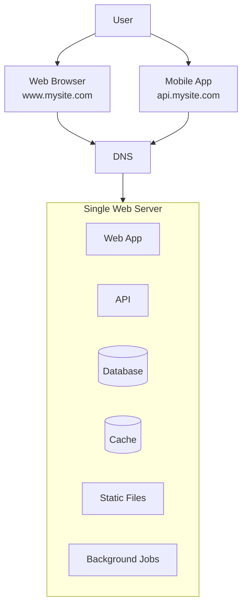

### Request Flow

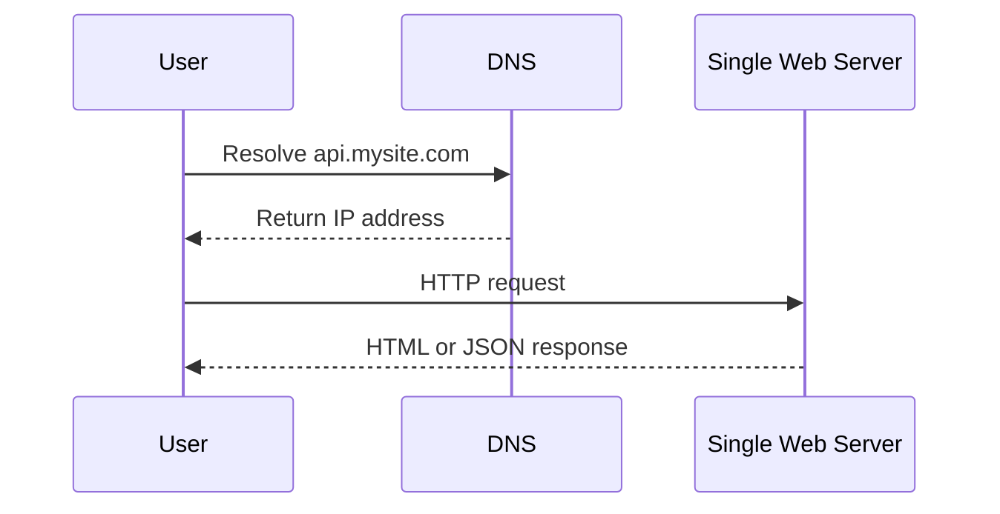

### Interview Notes

- DNS is usually managed by a third-party provider.
- Web clients receive HTML, CSS, JavaScript, and assets.
- Mobile clients usually communicate through HTTP APIs.
- JSON is commonly used for API responses.
- Single server is simple but has no scalability or availability guarantees.

### Implementation Notes

- Start with a monolith if the product is early-stage.
- Keep code modular so it can later be split into services.
- Use environment variables for configuration.
- Add basic logging from day one.

---

## 2. Separate Web Tier and Database Tier

As traffic grows, move the database to a separate server.

### Simple Diagram

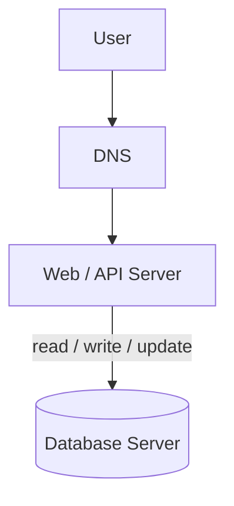

### Why Separate Them?

- Web tier and data tier can scale independently.
- Database resources are isolated from application traffic.
- Better security and operational control.

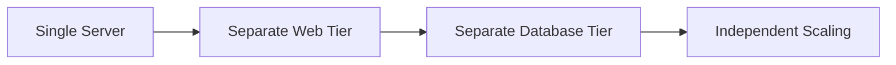

---

## 3. Choosing the Database

### Relational Database / SQL

Examples:

- MySQL
- PostgreSQL
- Oracle

Best for:

- Structured data
- Strong consistency
- Transactions
- Joins
- Financial or relational data models

### NoSQL Database

Examples:

- DynamoDB
- Cassandra
- MongoDB
- CouchDB
- HBase
- Neo4j

Best for:

- Very large scale
- Low latency access
- Semi-structured or unstructured data
- Key-value access patterns
- Flexible schema

### Database Choice Diagram

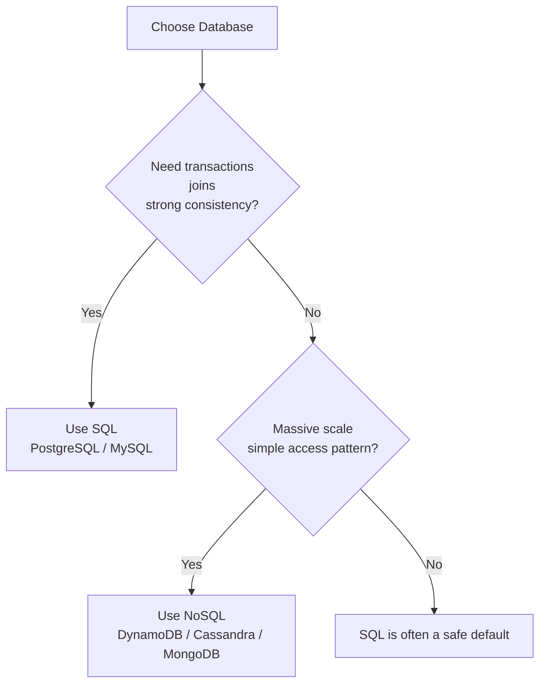

### FAANG Interview Rule of Thumb

Use SQL when:

- Data is relational.
- You need transactions.
- Query patterns are complex.

Use NoSQL when:

- Data volume is massive.
- Access pattern is simple and predictable.
- You need horizontal scalability.
- Low latency is more important than complex joins.

---

## 4. Vertical Scaling vs Horizontal Scaling

### Vertical Scaling

Scale up by adding more resources to one server.

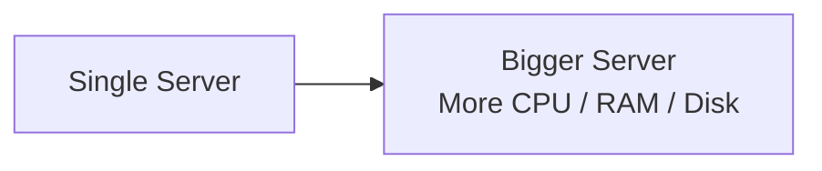

Pros:

- Simple
- Easy to manage initially
- No distributed system complexity

Cons:

- Hardware limit
- Expensive
- Single point of failure
- No true redundancy

### Horizontal Scaling

Scale out by adding more servers.

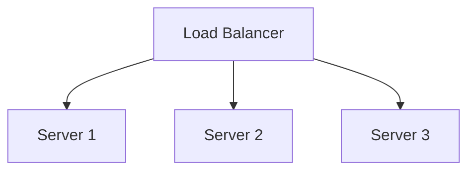

Pros:

- Better availability
- Easier to scale traffic
- Failure isolation
- Common approach for large systems

Cons:

- More operational complexity
- Requires load balancing
- Requires stateless services or shared state

### Interview Answer

For early systems, vertical scaling is acceptable. For large-scale systems, prefer horizontal scaling because it provides better availability, redundancy, and elasticity.

---

## 5. Load Balancer

A load balancer distributes incoming traffic across multiple servers.

### Simple Diagram

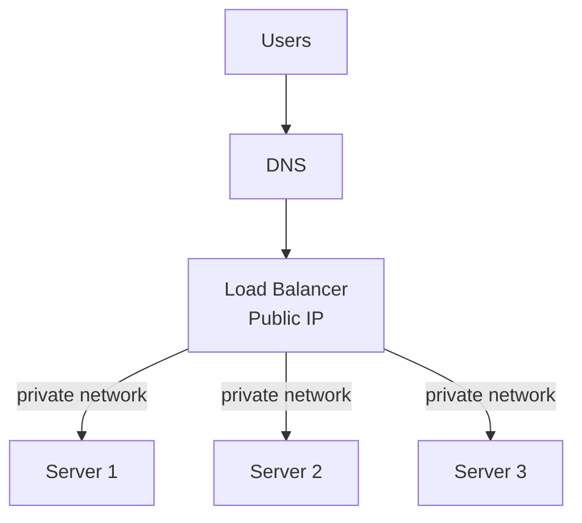

### Benefits

- Prevents one server from being overloaded.
- Improves availability.
- Enables horizontal scaling.
- Removes direct public access to web servers.
- Routes traffic only to healthy servers.

### Failure Handling

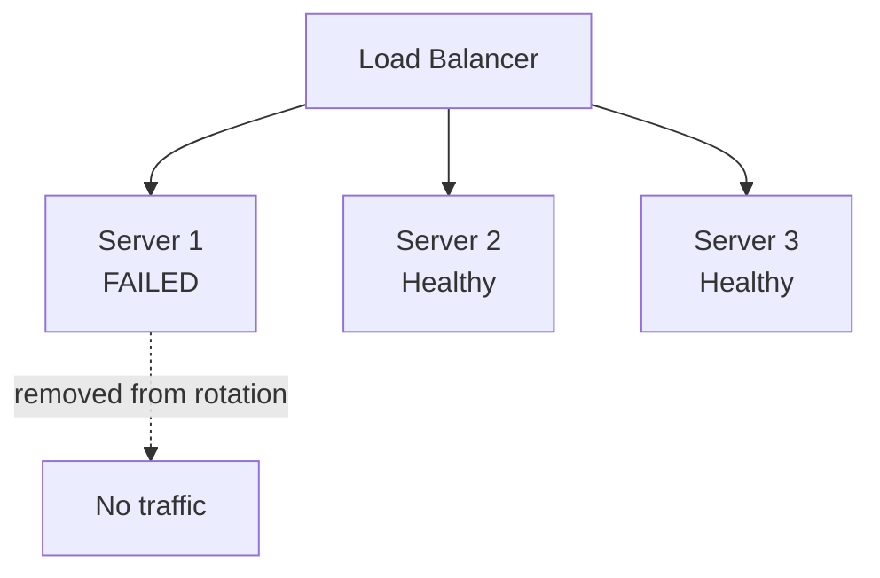

### Implementation Notes

- Use health checks.
- Keep web servers stateless.
- Use private IPs between load balancer and web servers.
- Use autoscaling groups when deployed on cloud platforms.

### FAANG Talking Points

Mention:

- Layer 4 vs Layer 7 load balancing
- Health checks
- TLS termination
- Round-robin, least connections, weighted routing
- Sticky sessions only when unavoidable

---

## 6. Database Replication

Replication copies data from one database server to another.

Common pattern:

- Master/Primary handles writes.
- Slaves/Replicas handle reads.

### Simple Diagram

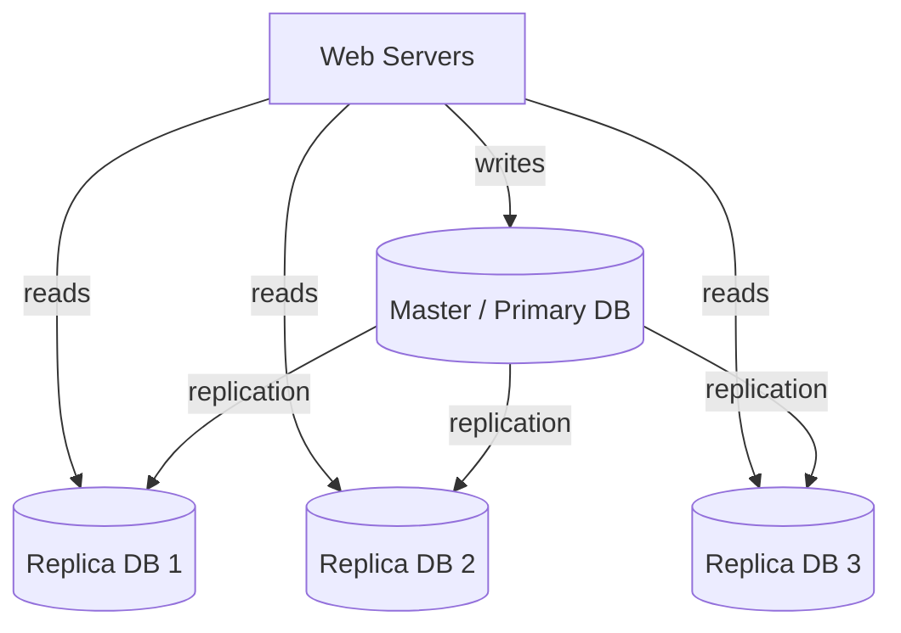

### Benefits

- Better read performance
- High availability
- Data redundancy
- Disaster recovery support

### Failure Scenarios

#### Replica Failure

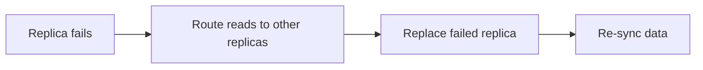

#### Master Failure

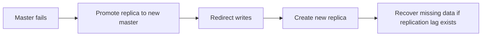

### Interview Notes

- Most applications have more reads than writes.
- Replication lag can cause stale reads.
- Promotion of a new master is not always trivial.
- Multi-master replication is more complex and can introduce conflicts.

---

## 7. Load Balancer + Database Replication Architecture

### Simple Diagram

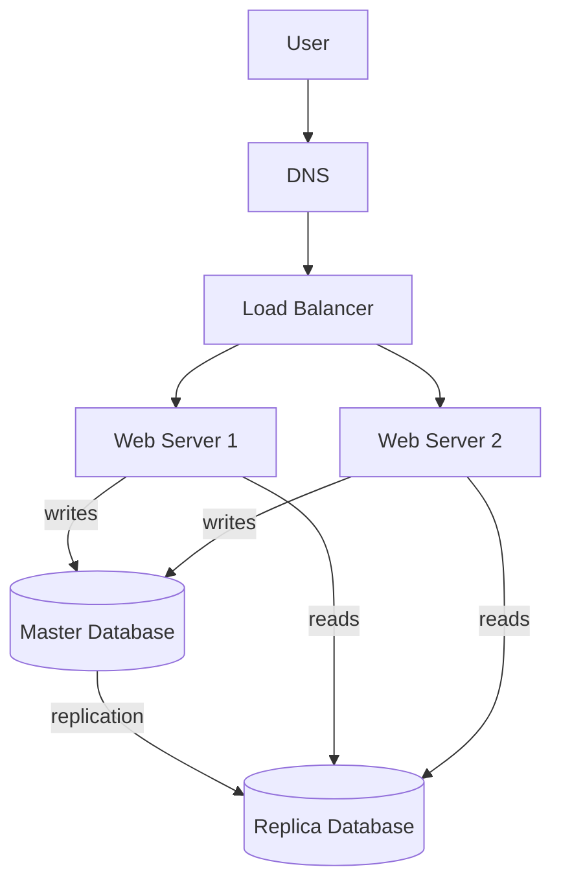

### Request Flow

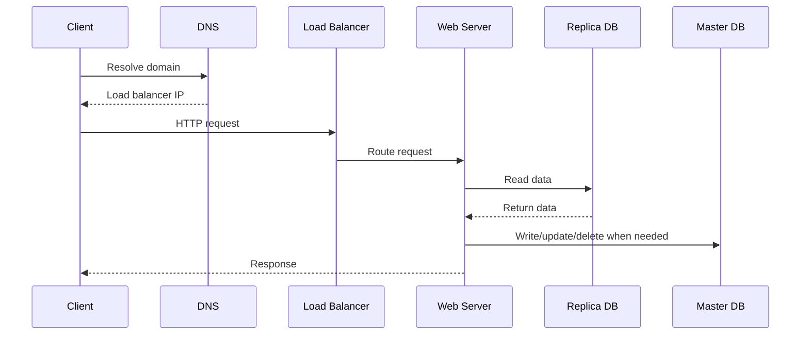

---

## 8. Cache Layer

Cache stores frequently accessed or expensive-to-compute data in memory.

Examples:

- Redis
- Memcached

### Simple Diagram

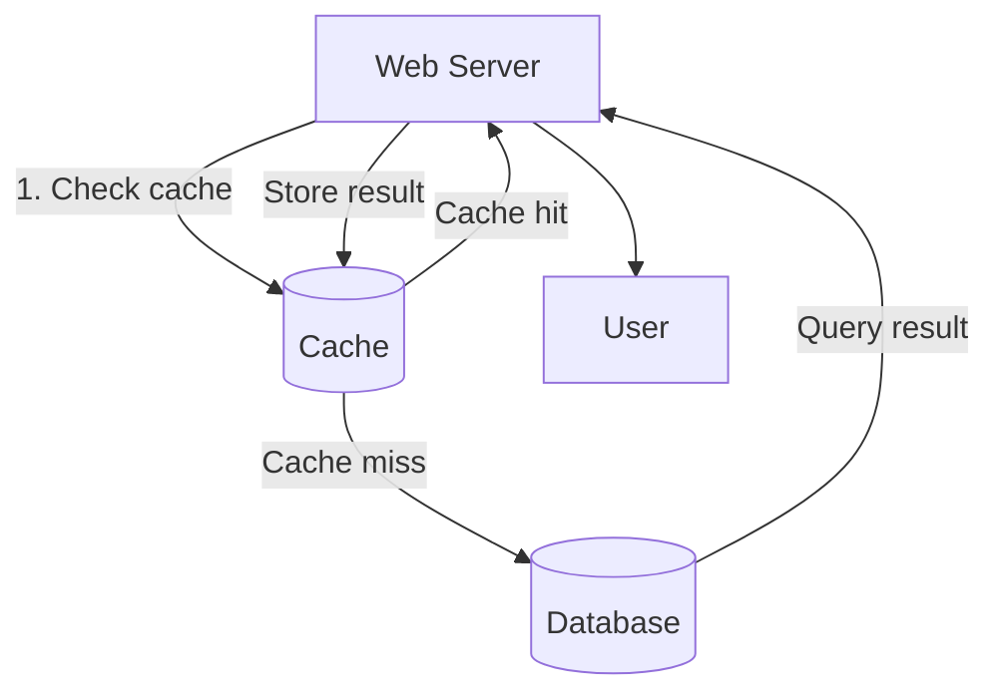

### Read-Through Cache Flow

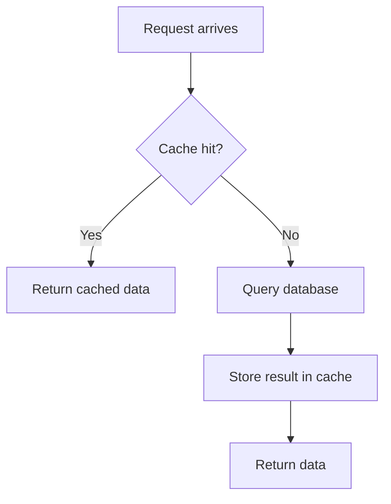

### Cache Example

```python
SECONDS = 1
cache.set("myKey", "hi there", 3600 * SECONDS)
cache.get("myKey")
```

### When to Use Cache

Use cache when:

- Data is read frequently.
- Data is modified infrequently.
- Query computation is expensive.
- Low latency is required.

Avoid cache when:

- Data changes constantly.
- Strong consistency is required.
- Data must be durable.

### Cache Considerations

#### Expiration Policy

- Use TTL to remove stale data.
- Too short TTL causes frequent DB hits.
- Too long TTL may return stale data.

#### Consistency

- Cache and database can become inconsistent.
- Cache invalidation is difficult.
- Common techniques: write-through, write-around, write-back, cache-aside.

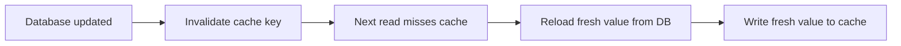

#### Failure Handling

- Avoid a single cache server as a single point of failure.
- Use multiple cache nodes.
- Overprovision memory.
- Handle cache misses gracefully.

#### Eviction Policy

Common policies:

- LRU: least recently used
- LFU: least frequently used
- FIFO: first in first out

### FAANG Talking Points

Mention:

- Cache hit ratio
- Cache invalidation
- TTL
- Hot keys
- Cache stampede
- Distributed cache
- Write-through vs cache-aside

---

## 9. Content Delivery Network - CDN

A CDN serves static content from geographically distributed edge servers.

Static content includes:

- Images
- Videos
- CSS
- JavaScript
- Fonts
- Static downloads

### Simple Diagram

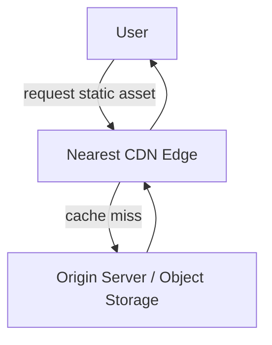

### CDN Workflow

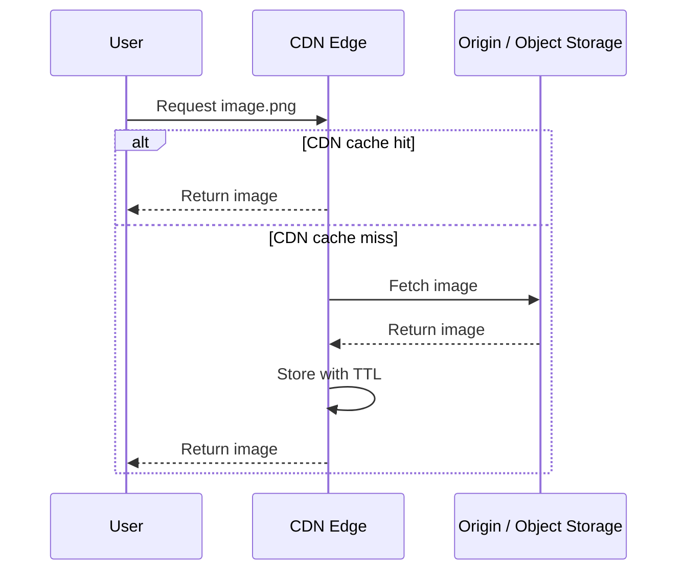

### Benefits

- Lower latency
- Reduced origin load
- Better global performance
- Improved static asset delivery

### CDN Considerations

- Cost for data transfer
- Cache expiry and TTL
- CDN fallback strategy
- File invalidation
- Asset versioning

### Asset Versioning Example

```text
image.png?v=2
app.bundle.js?v=2026-04-26
```

### FAANG Talking Points

Mention:

- Edge locations
- Origin server
- Cache invalidation
- TTL
- Signed URLs for private content
- CDN fallback
- Static vs dynamic content caching

---

## 10. Architecture With CDN and Cache

### Simple Diagram

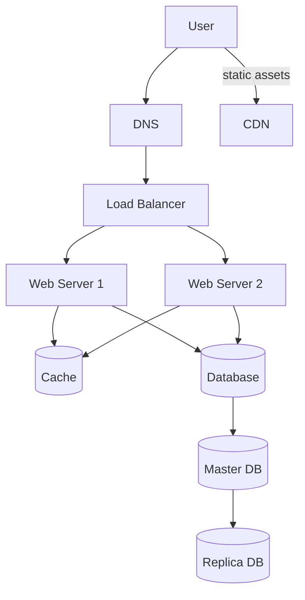

### Improvements

- Static assets are served from CDN.
- Dynamic data is accelerated using cache.
- Database load is reduced.
- Web tier is horizontally scalable.

---

## 11. Stateful vs Stateless Web Tier

### Stateful Architecture

A stateful server stores client-specific data locally.

```mermaid
flowchart TB
    UA[User A] --> S1[Server 1<br/>User A session]
    UB[User B] --> S2[Server 2<br/>User B session]
    UC[User C] --> S3[Server 3<br/>User C session]
```

Problem:

```text
If User A request goes to Server 2, authentication may fail.
```

### Issues With Stateful Servers

- Requires sticky sessions.
- Harder to add or remove servers.
- Harder to recover from server failure.
- Limits horizontal scaling.

---

### Stateless Architecture

Web servers do not store client state locally.

```mermaid
flowchart TB
    UA[User A] --> LB[Load Balancer]
    UB[User B] --> LB
    UC[User C] --> LB
    LB --> W1[Any Web Server 1]
    LB --> W2[Any Web Server 2]
    LB --> W3[Any Web Server 3]
    W1 --> S[(Shared Session Store<br/>Redis / DB / NoSQL)]
    W2 --> S
    W3 --> S
```

### Benefits

- Any request can go to any server.
- Easier autoscaling.
- Better fault tolerance.
- Simpler load balancing.

### Implementation Notes

Store session/state in:

- Redis
- Database
- NoSQL store
- Distributed session store
- JWT, when appropriate

### FAANG Talking Points

Mention:

- Stateless APIs
- Externalized sessions
- Horizontal scaling
- Autoscaling
- Sticky sessions as a tradeoff
- JWT vs server-side session store

---

## 12. Autoscaling

Autoscaling automatically adds or removes servers based on traffic or resource usage.

### Simple Diagram

```mermaid
flowchart LR
    A[Traffic increases] --> B[Autoscaling Policy]
    B --> C[Add More Web Servers]
    C --> D[Load Balancer routes to new servers]
```

### Common Scaling Signals

- CPU usage
- Memory usage
- Request count
- Latency
- Queue depth
- Error rate

```mermaid
flowchart TB
    Signals[Scaling Signals] --> CPU[CPU]
    Signals --> MEM[Memory]
    Signals --> REQ[Request Count]
    Signals --> LAT[Latency]
    Signals --> Q[Queue Depth]
    Signals --> ERR[Error Rate]
```

### Implementation Notes

- Use stateless web servers.
- Use health checks.
- Use load balancer integration.
- Set minimum, desired, and maximum instance counts.
- Avoid aggressive scaling to prevent instability.

---

## 13. Multiple Data Centers

For global users, use multiple data centers or regions.

### Simple Diagram

```mermaid
flowchart TB
    Users[Global Users] --> GTM[GeoDNS / Global Traffic Manager]
    GTM --> DC1[Data Center 1<br/>US-East]
    GTM --> DC2[Data Center 2<br/>US-West]

    subgraph Region1[Data Center 1: US-East]
        W1[Web]
        C1[(Cache)]
        D1[(DB)]
        W1 --> C1
        W1 --> D1
    end

    subgraph Region2[Data Center 2: US-West]
        W2[Web]
        C2[(Cache)]
        D2[(DB)]
        W2 --> C2
        W2 --> D2
    end

    D1 <-->|cross-region replication| D2
```

### Normal Operation

```text
Users are routed to the closest healthy data center.
```

### Failover Operation

```mermaid
flowchart LR
    A[DC2 fails] --> B[GeoDNS marks DC2 unhealthy]
    B --> C[100% traffic routes to DC1]
```

### Challenges

#### Traffic Redirection

- Use GeoDNS or global load balancing.
- Route users based on location and health.

#### Data Synchronization

- Replicate data across data centers.
- Handle replication lag.
- Decide between active-active and active-passive.

#### Deployment Consistency

- Automate deployment.
- Test from different regions.
- Keep configuration consistent.

### FAANG Talking Points

Mention:

- Multi-region deployment
- GeoDNS
- Active-active vs active-passive
- Disaster recovery
- RPO and RTO
- Data consistency tradeoffs
- Latency vs correctness

---

## 14. Message Queue

A message queue enables asynchronous communication between services.

Examples:

- Kafka
- RabbitMQ
- Amazon SQS
- Google Pub/Sub
- Azure Service Bus

### Simple Diagram

```mermaid
flowchart LR
    P[Producer] -->|publish message| Q[Message Queue]
    Q -->|consume message| C[Consumer / Worker]
```

### Why Use a Queue?

- Decouples services
- Handles traffic spikes
- Improves reliability
- Enables asynchronous processing
- Allows producers and consumers to scale independently

### Photo Processing Example

```mermaid
flowchart LR
    W[Web Servers] -->|publish photo processing job| Q[Message Queue]
    Q -->|consume jobs| Workers[Photo Processing Workers]
    Workers --> O[(Object Storage)]
    Workers --> N[(NoSQL / Database)]
```

### Queue-Based Autoscaling

```mermaid
flowchart LR
    Q[Queue Depth Increases] --> A[Autoscaling Policy]
    A --> W[Add More Workers]
    W --> P[Process Backlog Faster]
```

### Implementation Notes

- Use retries for failed jobs.
- Use dead-letter queues.
- Make consumers idempotent.
- Monitor queue depth.
- Scale workers based on queue size.

### FAANG Talking Points

Mention:

- At-least-once delivery
- At-most-once delivery
- Exactly-once semantics as difficult/expensive
- Idempotency
- Retry policy
- Dead-letter queue
- Backpressure
- Queue depth based autoscaling

---

## 15. Logging, Metrics, Monitoring, and Automation

At large scale, observability and automation are mandatory.

### Observability Pipeline

```mermaid
flowchart TB
    App[Applications / Services] --> Logs[Centralized Logs]
    App --> Metrics[Metrics]
    App --> Traces[Distributed Traces]
    Logs --> Dash[Dashboards]
    Metrics --> Dash
    Traces --> Dash
    Metrics --> Alerts[Alerts]
    Logs --> Alerts
```

### Logging

Use centralized logging to collect logs from all servers.

Examples:

- ELK stack
- Splunk
- CloudWatch Logs
- Datadog Logs

Track:

- Errors
- Exceptions
- Request logs
- Audit logs
- Security events

### Metrics

Important metrics:

#### Host-Level Metrics

- CPU
- Memory
- Disk I/O
- Network I/O

#### Service-Level Metrics

- Request rate
- Latency
- Error rate
- Saturation
- Queue depth

#### Business Metrics

- Daily active users
- Retention
- Revenue
- Conversion rate

### Monitoring

Monitor:

- Availability
- Latency
- Error rate
- Database health
- Cache hit ratio
- Queue lag

### Automation

Automate:

- Build
- Test
- Deployment
- Rollback
- Infrastructure provisioning
- Scaling

### Deployment Flow

```mermaid
flowchart LR
    Code[Code Commit] --> Build[Build]
    Build --> Test[Test]
    Test --> Deploy[Deploy]
    Deploy --> Monitor[Monitor]
    Monitor -->|bad metrics| Rollback[Rollback]
```

### FAANG Talking Points

Mention:

- SLIs, SLOs, and SLAs
- Alerting thresholds
- Dashboards
- Distributed tracing
- CI/CD
- Canary deployment
- Blue-green deployment
- Rollbacks

---

## 16. Database Scaling

There are two main approaches:

- Vertical scaling
- Horizontal scaling / sharding

```mermaid
flowchart TB
    DBScaling[Database Scaling] --> V[Vertical Scaling]
    DBScaling --> H[Horizontal Scaling / Sharding]
    V --> V1[Bigger machine]
    H --> H1[Split data across shards]
```

---

## 17. Database Vertical Scaling

Add more CPU, RAM, disk, or IOPS to one database server.

### Simple Diagram

```mermaid
flowchart LR
    Small[Small DB Server] --> Big[Bigger DB Server<br/>More CPU / RAM / Disk]
```

### Pros

- Simple
- No application-level partitioning
- Easier joins and transactions

### Cons

- Hardware limits
- Expensive
- Single point of failure
- Not enough for very large user bases

---

## 18. Database Horizontal Scaling / Sharding

Sharding splits a large database into smaller databases called shards.

### Simple Diagram

```mermaid
flowchart TB
    K[user_id % 4] --> S0[Shard 0<br/>users 0, 4, 8...]
    K --> S1[Shard 1<br/>users 1, 5, 9...]
    K --> S2[Shard 2<br/>users 2, 6, 10...]
    K --> S3[Shard 3<br/>users 3, 7, 11...]
```

### Example Sharding Function

```text
shard_id = user_id % number_of_shards
```

### Sharding Key

A sharding key determines where data is stored.

Good sharding key properties:

- High cardinality
- Even distribution
- Frequently used in queries
- Avoids hotspots

Examples:

- user_id
- tenant_id
- region_id
- organization_id

### Sharding Benefits

- Handles large data volume
- Distributes load
- Improves write scalability
- Reduces data size per machine

### Sharding Challenges

#### Resharding

Needed when:

- A shard becomes too large.
- Data distribution becomes uneven.
- Number of shards changes.

Solution:

- Use consistent hashing.
- Use virtual shards.
- Rebalance data gradually.

```mermaid
flowchart LR
    A[Shard too large] --> B[Add new shard]
    B --> C[Move virtual shards gradually]
    C --> D[Update routing metadata]
    D --> E[Traffic uses new distribution]
```

#### Celebrity / Hotspot Problem

Problem:

```text
A popular user causes one shard to receive too much traffic.
```

Solutions:

- Split hot users into separate shards.
- Add caching.
- Use read replicas.
- Partition celebrity data further.

```mermaid
flowchart TB
    Hot[Celebrity User / Hot Key] --> Cache[Cache]
    Hot --> Replica[Read Replicas]
    Hot --> Split[Split hot user's data]
```

#### Joins Across Shards

Problem:

```text
Cross-shard joins are expensive.
```

Solutions:

- Denormalize data.
- Query by shard key.
- Use application-level joins only when needed.
- Use search/indexing systems for global queries.

### FAANG Talking Points

Mention:

- Sharding key selection
- Consistent hashing
- Hot partitions
- Cross-shard transactions
- Denormalization
- Data rebalancing
- Read/write patterns

---

## 19. Full Scalable Architecture

### Simple End-to-End Diagram

```mermaid
flowchart TB
    Users[Users] --> DNS[DNS / GeoDNS]
    Users --> CDN[CDN<br/>Static Assets]
    DNS --> GLB[Global Load Balancer]
    GLB --> DC1[Data Center 1]
    GLB --> DC2[Data Center 2]

    subgraph Region1[Data Center 1]
        LB1[Load Balancer]
        W1[Web Server 1]
        W2[Web Server 2]
        Cache1[(Cache)]
        Queue1[Message Queue]
        Workers1[Workers]
        DB1[(Sharded Databases)]
        Rep1[(Replicas)]
        Obj1[(NoSQL / Object Storage)]
        LB1 --> W1
        LB1 --> W2
        W1 --> Cache1
        W2 --> Cache1
        W1 --> Queue1
        W2 --> Queue1
        Queue1 --> Workers1
        W1 --> DB1
        W2 --> DB1
        DB1 --> Rep1
        Workers1 --> Obj1
    end

    subgraph Region2[Data Center 2]
        LB2[Load Balancer]
        W3[Web Server 3]
        W4[Web Server 4]
        Cache2[(Cache)]
        Queue2[Message Queue]
        Workers2[Workers]
        DB2[(Sharded Databases)]
        Rep2[(Replicas)]
        Obj2[(NoSQL / Object Storage)]
        LB2 --> W3
        LB2 --> W4
        W3 --> Cache2
        W4 --> Cache2
        W3 --> Queue2
        W4 --> Queue2
        Queue2 --> Workers2
        W3 --> DB2
        W4 --> DB2
        DB2 --> Rep2
        Workers2 --> Obj2
    end

    DB1 <-->|replication / sync| DB2
    OBS[Observability<br/>Logs + Metrics + Monitoring + Alerts + CI/CD]
    Region1 --> OBS
    Region2 --> OBS
```

---

## 20. Final Scaling Summary

To scale from zero to millions of users:

1. Start with a simple single-server architecture.
2. Separate web tier and database tier.
3. Add a load balancer.
4. Add multiple web servers.
5. Add database replication.
6. Add cache layer.
7. Move static assets to CDN.
8. Make the web tier stateless.
9. Add autoscaling.
10. Support multiple data centers.
11. Use message queues for asynchronous work.
12. Add logging, metrics, monitoring, and automation.
13. Scale the database using sharding.
14. Split large systems into smaller services when needed.

```mermaid
flowchart LR
    A[Single Server] --> B[Separate DB]
    B --> C[Load Balancer]
    C --> D[Multiple Web Servers]
    D --> E[DB Replication]
    E --> F[Cache]
    F --> G[CDN]
    G --> H[Stateless Web Tier]
    H --> I[Autoscaling]
    I --> J[Multi-Region]
    J --> K[Message Queue + Workers]
    K --> L[Sharding]
    L --> M[Observability + Automation]
```

---

## 21. FAANG Interview Checklist

When answering a system design question, cover these areas:

### Functional Requirements

- What should the system do?
- Who are the users?
- What are the main APIs?

### Non-Functional Requirements

- Scale
- Latency
- Availability
- Consistency
- Durability
- Security
- Cost

### Capacity Estimation

Mention estimates for:

- Daily active users
- Requests per second
- Reads vs writes
- Storage growth
- Bandwidth
- Cache size

### API Design

Example:

```http
GET /users/{user_id}
POST /users
PUT /users/{user_id}
DELETE /users/{user_id}
```

### Data Model

Mention:

- Tables or collections
- Primary keys
- Indexes
- Sharding key
- Relationships

### High-Level Design

Include:

- Clients
- DNS
- CDN
- Load balancer
- Web servers
- Cache
- Database
- Queue
- Workers
- Monitoring

### Deep Dives

Be ready to discuss:

- Cache invalidation
- Database replication
- Sharding
- Hot keys
- Failure handling
- Rate limiting
- Consistency model
- Multi-region strategy

### Bottlenecks

Identify likely bottlenecks:

- Database writes
- Hot cache keys
- Queue backlog
- Network latency
- Cross-region replication
- Large fanout reads/writes

### Tradeoffs

Always explain tradeoffs:

```text
SQL gives transactions and joins, but may be harder to scale horizontally.
NoSQL scales well, but may sacrifice joins and strong consistency.
Cache improves latency, but introduces consistency challenges.
Multi-region improves availability, but increases data synchronization complexity.
```

### Interview Checklist Mind Map

```mermaid
mindmap
  root((System Design Answer))
    Requirements
      Functional
      Non-functional
    Estimation
      QPS
      Storage
      Bandwidth
      Cache
    API
      REST
      Pagination
      Auth
    Data
      Schema
      Indexes
      Sharding key
    Architecture
      DNS
      CDN
      Load balancer
      Web tier
      Cache
      DB
      Queue
    Deep Dive
      Replication
      Sharding
      Cache invalidation
      Multi-region
      Failure handling
    Production
      Metrics
      Logs
      Traces
      Alerts
      CI/CD
```

---

## 22. Common Interview Phrases

Use these phrases during interviews:

- “I will keep the web tier stateless so we can scale horizontally.”
- “I will use a load balancer to distribute traffic and improve availability.”
- “I will use read replicas because read traffic is usually higher than write traffic.”
- “I will add cache for frequently accessed and rarely updated data.”
- “I will use CDN for static assets to reduce latency and origin load.”
- “I will use a message queue to decouple slow asynchronous processing.”
- “I will choose the sharding key carefully to avoid hot partitions.”
- “I will add monitoring, logging, alerts, and automation for production readiness.”
- “This introduces a tradeoff between consistency, availability, latency, and operational complexity.”

---

## 23. Common Pitfalls

Avoid these mistakes in interviews:

- Making every component distributed too early.
- Ignoring database bottlenecks.
- Forgetting cache invalidation.
- Forgetting failure handling.
- Forgetting monitoring and alerts.
- Using sticky sessions without explaining the tradeoff.
- Choosing a poor sharding key.
- Ignoring hot keys and celebrity users.
- Ignoring deployment and rollback strategy.
- Ignoring cost.

```mermaid
flowchart TB
    Pitfalls[Common Pitfalls] --> P1[Over-engineering too early]
    Pitfalls --> P2[Ignoring DB bottlenecks]
    Pitfalls --> P3[Forgetting cache invalidation]
    Pitfalls --> P4[No failure handling]
    Pitfalls --> P5[No monitoring]
    Pitfalls --> P6[Poor sharding key]
    Pitfalls --> P7[Ignoring hot keys]
    Pitfalls --> P8[No rollback plan]
    Pitfalls --> P9[Ignoring cost]
```

---

## 24. Implementation Roadmap

### Phase 1: MVP

```text
Single server + SQL database + basic logging
```

### Phase 2: Early Growth

```text
Separate web server and database
Add load balancer
Add multiple web servers
```

### Phase 3: Performance

```text
Add Redis/Memcached cache
Move static assets to CDN
Add database read replicas
```

### Phase 4: Reliability

```text
Make web tier stateless
Add autoscaling
Add centralized logging and monitoring
Add backups and failover
```

### Phase 5: Large Scale

```text
Add message queues
Add workers
Shard database
Add NoSQL where appropriate
Support multi-region or multi-data-center deployment
```

### Phase 6: Production Maturity

```text
CI/CD
Canary deployment
Blue-green deployment
Distributed tracing
SLO-based alerting
Disaster recovery testing
Cost optimization
```

### Roadmap Diagram

```mermaid
flowchart LR
    P1[Phase 1<br/>MVP<br/>Single server + SQL] --> P2[Phase 2<br/>Early Growth<br/>Separate DB + LB]
    P2 --> P3[Phase 3<br/>Performance<br/>Cache + CDN + Replicas]
    P3 --> P4[Phase 4<br/>Reliability<br/>Stateless + Autoscaling + Monitoring]
    P4 --> P5[Phase 5<br/>Large Scale<br/>Queues + Workers + Sharding]
    P5 --> P6[Phase 6<br/>Production Maturity<br/>CI/CD + Tracing + DR + Cost]
```

---

## 25. One-Minute Interview Summary

A scalable architecture starts simple with one server. As traffic grows, separate the web and database tiers, add a load balancer, and run multiple stateless web servers. Use database replication to improve read scalability and availability. Add cache for frequently accessed data and CDN for static assets. For global users, use multiple data centers with GeoDNS and replication. Use message queues to decouple slow tasks and workers. As data grows, shard the database and move suitable workloads to NoSQL. Finally, production systems require logging, metrics, monitoring, alerting, automation, and reliable deployment pipelines.

---

## 26. Final Golden Rules

```text
Keep web tier stateless.
Build redundancy at every layer.
Cache aggressively but carefully.
Use CDN for static assets.
Use queues for asynchronous work.
Scale reads with replicas.
Scale writes with sharding.
Choose sharding keys carefully.
Design for failure.
Monitor everything.
Automate deployments.
Explain tradeoffs clearly.
```

### Golden Rules Mind Map

```mermaid
mindmap
  root((Golden Rules))
    Stateless web tier
    Redundancy
    Cache carefully
    CDN for static assets
    Queues for async work
    Replicas for reads
    Sharding for writes
    Good shard key
    Design for failure
    Monitor everything
    Automate deployments
    Explain tradeoffs
```
