# 15 — Design YouTube

> Goal: design a scalable video sharing and streaming platform that supports video upload, processing/transcoding, and smooth playback across mobile, web, and smart TV.

---

# Step 0 — What are we designing?

YouTube looks simple:

```text
Creator uploads video
Viewer clicks play
```

But internally it needs:

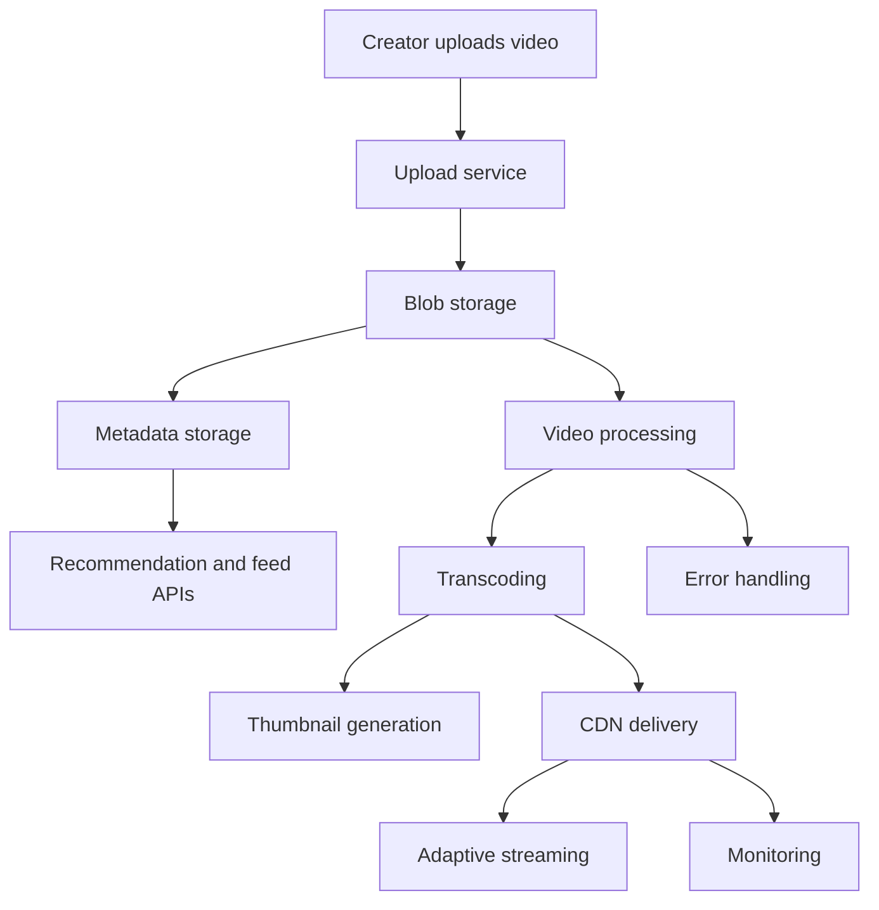

For this interview, focus on:

```text
1. Upload video fast
2. Process/transcode video
3. Stream video smoothly
4. Change video quality
5. High availability and scalability
6. Low infrastructure cost
```

---

# Step 1 — Clarify Requirements

## Functional Requirements

- Users can upload videos.
- Users can watch videos.
- Support mobile apps, web browsers, and smart TVs.
- Support many input formats and resolutions.
- Support video quality selection.
- Support adaptive streaming.
- Store metadata.
- Encrypt/protect videos.
- Max video size: 1GB.
- Use cloud services where possible.

## Non-functional Requirements

- High availability.
- Smooth playback.
- Low startup latency.
- Scalable upload and playback.
- Durable storage.
- Reliable processing pipeline.
- Cost-efficient CDN usage.
- Global users.

## Out of Scope

- Comments.
- Likes.
- Subscriptions.
- Recommendations.
- Ads.
- Live streaming.
- Copyright detection details.

Interview line:

> I will focus on upload, transcoding, metadata, storage, CDN streaming, and failure handling.

---

# Step 2 — Back-of-the-envelope Estimation

Assumptions:

```text
DAU = 5 million
Each user watches = 5 videos/day
10% users upload = 1 video/day
Average video size = 300MB
```

## Upload Storage

```text
5M * 10% * 300MB = 150TB/day
```

## Video Views

```text
5M users * 5 videos/day = 25M video views/day
```

## CDN Cost Rough Estimate

If each watched video is around:

```text
300MB = 0.3GB
```

Daily outbound data:

```text
25M * 0.3GB = 7.5M GB/day
```

If CDN cost is:

```text
$0.02 / GB
```

Daily CDN cost:

```text
7.5M GB * $0.02 = $150,000/day
```

Interview line:

> CDN cost dominates, so we need popularity-aware caching and regional distribution strategies.

---

# Step 3 — High-Level Architecture

At a high level:

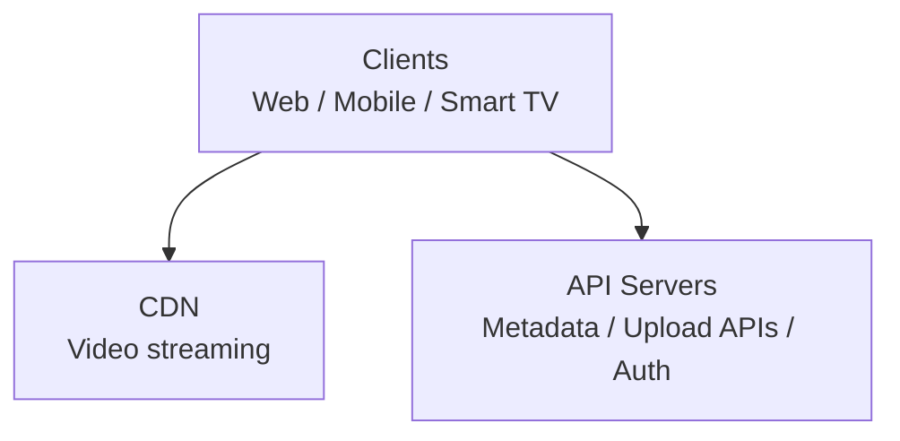

Responsibilities:

```text
CDN:
- Serve video segments close to users.

API Servers:
- Generate upload URLs.
- Store metadata.
- Start processing jobs.
- Return playback metadata.
- Handle user/account operations.
```

---

# Step 4 — Video Upload Flow

Video upload has two parallel paths:

```text
1. Upload actual video file.
2. Update video metadata.
```

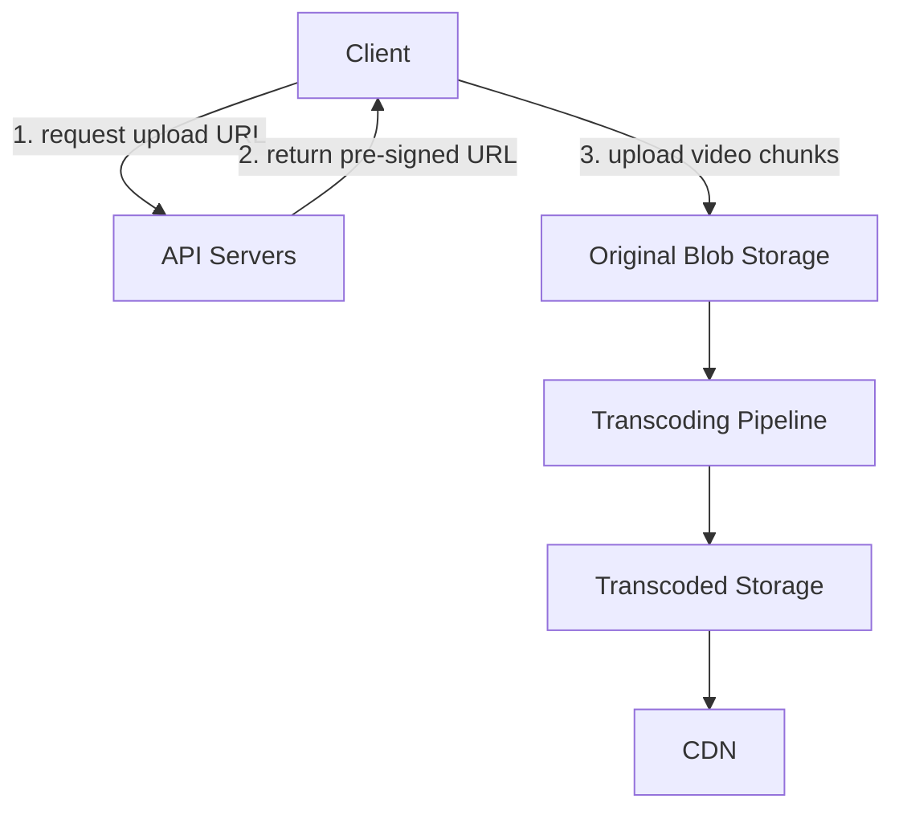

Metadata path:

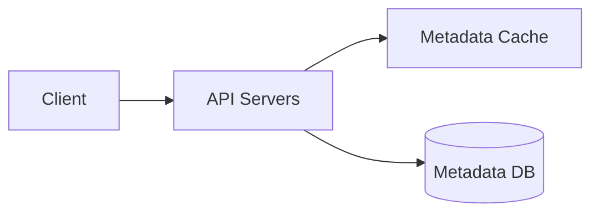

---

# Step 5 — Main Components

## Client

Supported clients:

```text
mobile app
web browser
smart TV
```

Client can:

```text
upload video
watch video
choose quality
resume upload
send metadata
```

---

## Load Balancer

Distributes API traffic.

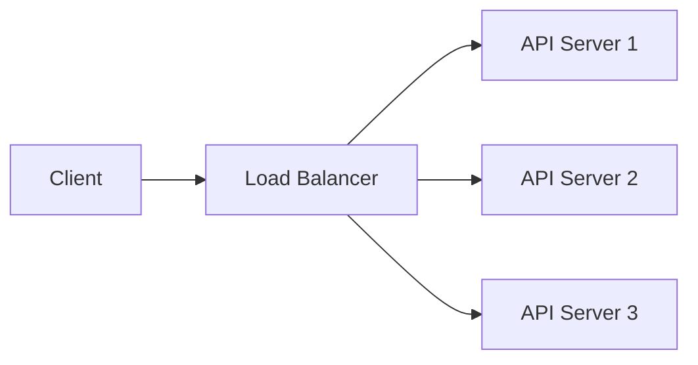

---

## API Servers

Stateless servers.

Responsibilities:

```text
authenticate user
generate pre-signed upload URL
save video metadata
start processing pipeline
return playback manifest URL
update video status
```

---

## Metadata DB

Stores video metadata.

Example:

```text
video_id
user_id
title
description
upload_status
processing_status
duration
size
available_resolutions
manifest_url
created_at
```

Use:

```text
replication
sharding
backup
```

---

## Metadata Cache

Caches hot video/user metadata.

```text
video_id -> metadata
user_id -> channel/user info
```

---

## Original Storage

Blob storage for original uploaded videos.

Examples:

```text
S3
GCS
Azure Blob Storage
```

---

## Transcoding Servers

Convert uploaded video into multiple formats/resolutions.

Examples:

```text
360p
480p
720p
1080p
4K
```

---

## Transcoded Storage

Stores processed output:

```text
video segments
audio segments
manifests
thumbnails
watermarked videos
```

---

## CDN

Caches and serves video segments globally.

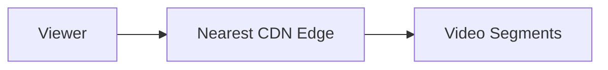

---

# Step 6 — Upload Flow Detailed

```text
1. Client calls POST /videos/upload.
2. API server authenticates user.
3. API server creates video metadata record with status = UPLOADING.
4. API server returns pre-signed upload URL.
5. Client uploads video chunks directly to blob storage.
6. Storage emits upload-complete event.
7. Processing pipeline starts.
8. Transcoding produces multiple renditions.
9. Completion handler updates metadata status = READY.
10. CDN pulls/caches transcoded files.
11. Client can stream video.
```

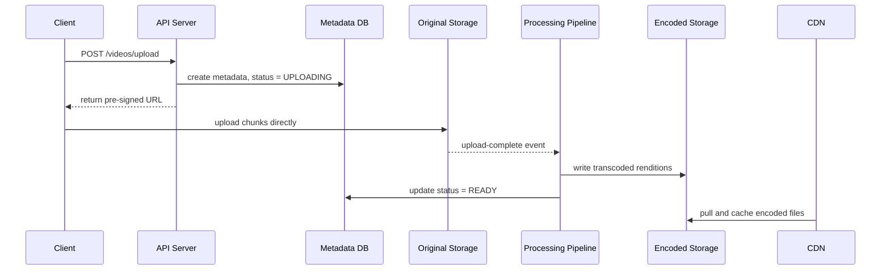

---

# Step 7 — Why Pre-signed Upload URL?

Without pre-signed URL:

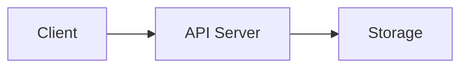

Problem:

```text
API servers become bottleneck for huge files.
```

With pre-signed URL:

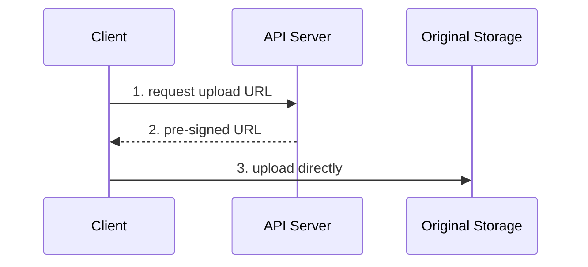

Benefits:

```text
secure
fast
reduces API server load
supports direct upload to regional storage
```

---

# Step 8 — Chunked / Resumable Upload

Uploading a 1GB video as one file is risky.

Better:

```text
Split into chunks.
Upload chunks in parallel.
Retry failed chunks.
Resume from failed chunk.
```

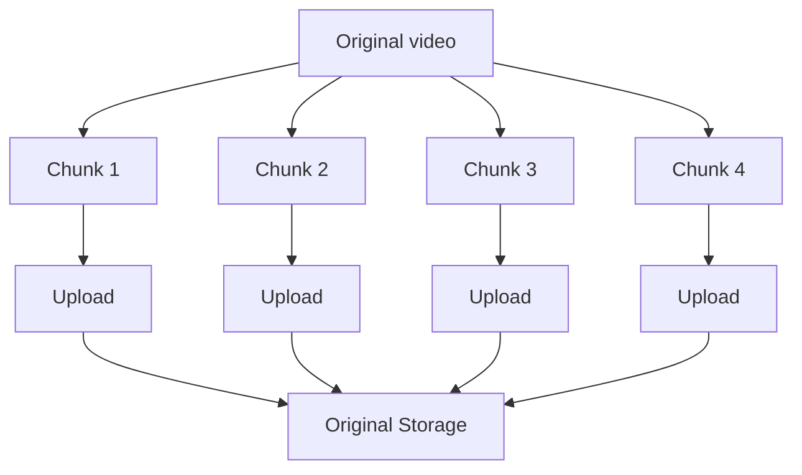

Benefits:

```text
faster upload
resumable upload
parallel upload
better reliability
```

---

# Step 9 — Video Streaming Flow

Videos are streamed from CDN.

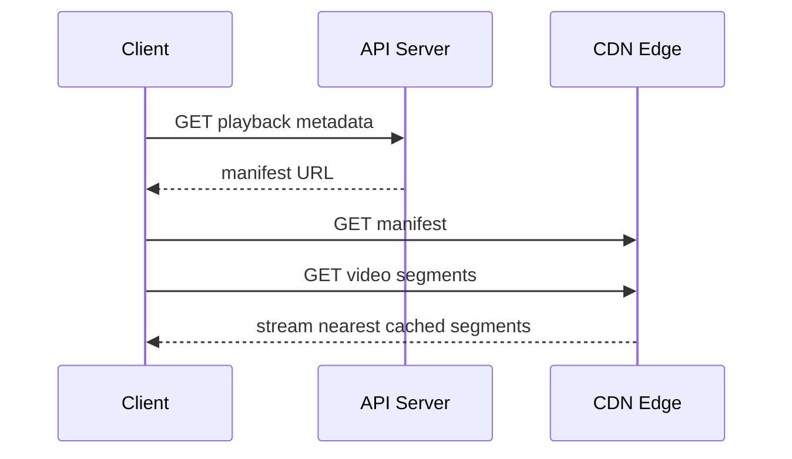

---

# Step 10 — Streaming Protocols

Common protocols:

```text
HLS
MPEG-DASH
Smooth Streaming
HDS
```

For system design, key point:

```text
Videos are split into small segments.
Client downloads segments gradually.
Client can switch quality depending on network.
```

Manifest example:

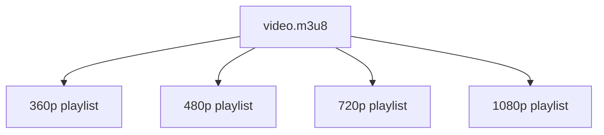

---

# Step 11 — Adaptive Bitrate Streaming

The client changes quality based on network speed.

```text
Fast network  -> 1080p
Medium network -> 720p
Slow network  -> 360p
```

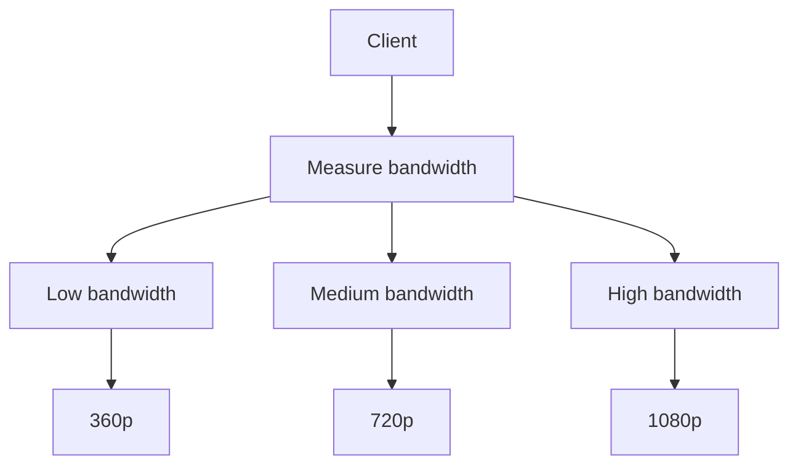

Benefits:

```text
less buffering
smooth playback
better user experience
```

---

# Step 12 — Video Transcoding

Raw uploaded video may not play well everywhere.

Transcoding converts video into:

```text
different resolutions
different bitrates
different codecs
different containers
segments for streaming
```

Example output:

```text
video_360p.mp4
video_480p.mp4
video_720p.mp4
video_1080p.mp4
manifest.m3u8
thumbnail.jpg
```

Why needed?

```text
device compatibility
bandwidth adaptation
storage optimization
smooth playback
```

---

# Step 13 — Transcoding DAG Model

A video processing pipeline can be represented as a DAG.

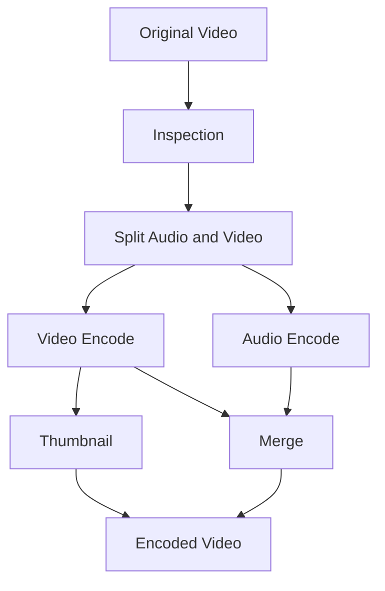

DAG benefits:

```text
parallel processing
flexible workflows
retries per task
supports thumbnails/watermark/inspection
```

---

# Step 14 — Transcoding Architecture

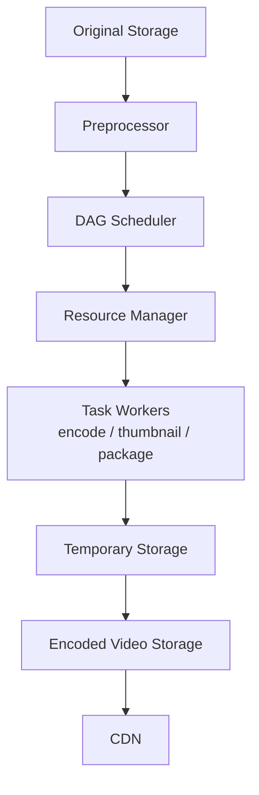

---

# Step 15 — Transcoding Components

## Preprocessor

Responsibilities:

```text
split video into GOP/chunks
validate video
extract metadata
generate DAG
write temporary data
```

GOP:

```text
Group of Pictures
independently playable chunk of frames
```

---

## DAG Scheduler

Turns DAG into executable stages.

Example:

```text
Stage 1:
- extract video
- extract audio
- extract metadata

Stage 2:
- encode video
- encode audio
- generate thumbnail

Stage 3:
- merge
- package
```

---

## Resource Manager

Manages:

```text
task queue
worker queue
running queue
task assignment
```

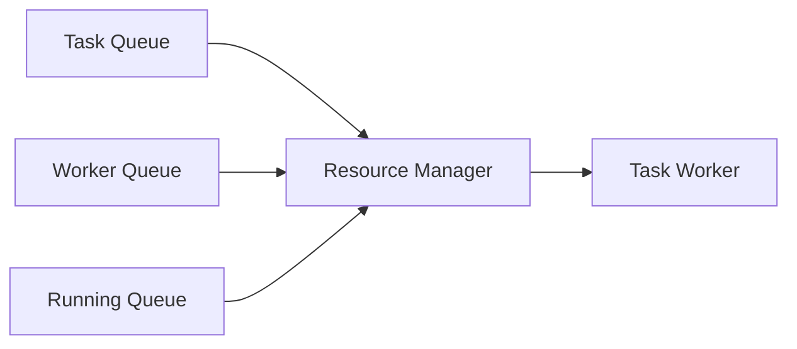

---

## Task Workers

Different workers do different jobs:

```text
Encoder worker
Thumbnail worker
Watermark worker
Merger worker
Inspection worker
```

---

## Temporary Storage

Stores intermediate files:

```text
video chunks
audio chunks
metadata
partial encoded files
```

Data is deleted after processing completes.

---

# Step 16 — Parallelism with Queues

Without queues:

```text
download -> encode -> upload -> CDN
```

Each step blocks the next.

With queues:

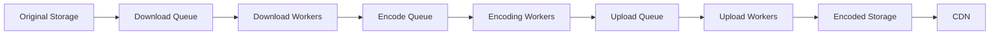

Benefits:

```text
parallelism
isolation
retry
backpressure handling
autoscaling workers
```

---

# Step 17 — Metadata Design

## Video Metadata Table

```sql
CREATE TABLE videos (
    video_id BIGINT PRIMARY KEY,
    user_id BIGINT,
    title VARCHAR(255),
    description TEXT,
    upload_status VARCHAR(32),
    processing_status VARCHAR(32),
    original_url TEXT,
    manifest_url TEXT,
    thumbnail_url TEXT,
    duration_seconds INT,
    size_bytes BIGINT,
    created_at TIMESTAMP,
    updated_at TIMESTAMP
);
```

## Video Rendition Table

```sql
CREATE TABLE video_renditions (
    video_id BIGINT,
    resolution VARCHAR(32),
    bitrate INT,
    codec VARCHAR(32),
    storage_url TEXT,
    status VARCHAR(32),
    PRIMARY KEY(video_id, resolution)
);
```

Statuses:

```text
UPLOADING
UPLOADED
PROCESSING
READY
FAILED
BLOCKED
DELETED
```

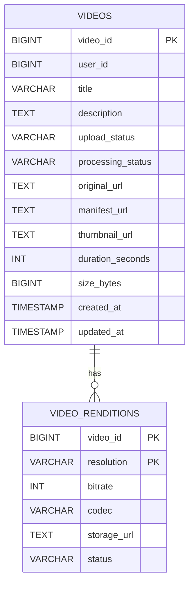

---

# Step 18 — CDN Cost Optimization

CDN is expensive.

## Long-tail Observation

```text
Few videos are very popular.
Most videos have low traffic.
```

Strategies:

```text
1. Serve popular videos from CDN.
2. Serve rarely watched videos from origin/video servers.
3. Cache regionally popular videos only in relevant regions.
4. Encode fewer renditions for unpopular videos.
5. Use on-demand transcoding for rare videos.
6. Use your own CDN or ISP partnerships at massive scale.
```

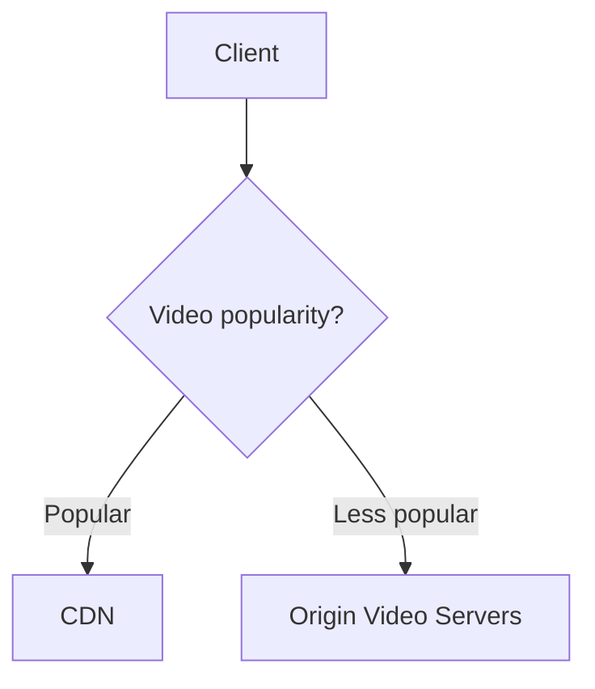

---

# Step 19 — Security and Video Protection

## Upload Security

Use:

```text
pre-signed URLs
short expiration time
file size limit
content-type validation
virus/malware scan
auth checks
```

## Playback Security

Use:

```text
signed CDN URLs
token authentication
DRM
AES encryption
watermarking
```

## Copyright / Policy

Videos can be removed due to:

```text
copyright
adult content
violence
illegal content
policy violation
user reports
```

---

# Step 20 — Error Handling

## Recoverable Errors

Retry:

```text
chunk upload failure
transcoding failure
worker crash
temporary storage error
queue timeout
```

## Non-recoverable Errors

Fail fast:

```text
malformed video
unsupported format
virus detected
policy violation
corrupted file
```

## Component Error Playbook

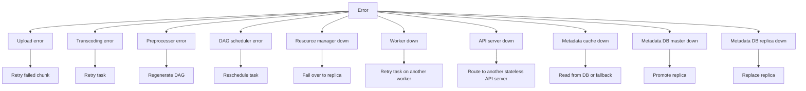

---

# Step 21 — Final Upload Architecture

```mermaid
flowchart TD
    Client[Client] -->|POST upload| API[API Servers]
    API -->|create video metadata| DB[(Metadata DB)]
    API -->|return pre-signed URL| Client
    Client -->|upload chunks directly| OS[Original Blob Storage]
    OS -->|upload complete event| PP[Preprocessor]
    PP --> DAG[DAG Scheduler]
    DAG --> RM[Resource Manager]
    RM --> TW[Task Workers]
    TW --> ES[Encoded Storage]
    ES --> CDN[CDN]
    TW -->|metadata status = READY| DB
```

---

# Step 22 — Final Streaming Architecture

```mermaid
sequenceDiagram
    participant C as Client
    participant API as API Server
    participant MC as Metadata Cache / DB
    participant CDN as CDN

    C->>API: GET playback metadata
    API->>MC: fetch metadata
    MC-->>API: manifest URL + signed CDN URL
    API-->>C: playback response
    C->>CDN: GET manifest
    C->>CDN: GET video segments
    CDN-->>C: playback stream
```

---

# Step 23 — End-to-End Final Architecture

```mermaid
flowchart TD
    Clients[Clients<br/>Web / Mobile / Smart TV]
    API[API Servers<br/>stateless]
    CDN[CDN<br/>video stream]
    Meta[Metadata<br/>Cache / DB]
    Original[Original<br/>Storage]
    Queues[Processing<br/>Queues]
    Workers[Transcoding<br/>Workers]
    Encoded[Encoded<br/>Storage]

    Clients --> API
    Clients --> CDN
    API --> Meta
    API --> Original
    Original --> Queues
    Queues --> Workers
    Workers --> Encoded
    Encoded --> CDN
    CDN --> Clients
```

---

# Step 24 — Java Code: Video Metadata Model

```java
import java.time.Instant;

enum VideoStatus {
    UPLOADING,
    UPLOADED,
    PROCESSING,
    READY,
    FAILED,
    DELETED
}

public record VideoMetadata(
        long videoId,
        long userId,
        String title,
        String originalUrl,
        String manifestUrl,
        String thumbnailUrl,
        VideoStatus status,
        long sizeBytes,
        int durationSeconds,
        Instant createdAt
) {}
```

---

# Step 25 — Java Code: Rendition Model

```java
public record VideoRendition(
        long videoId,
        String resolution,   // 360p, 720p, 1080p
        int bitrateKbps,
        String codec,
        String storageUrl,
        VideoStatus status
) {}
```

---

# Step 26 — Java Code: Pre-signed URL Service

Simplified reference version.

```java
import java.time.Instant;
import java.util.UUID;

public class PresignedUrlService {
    public String generateUploadUrl(long userId, long videoId, String fileName) {
        String token = UUID.randomUUID().toString();
        long expiresAt = Instant.now().plusSeconds(15 * 60).toEpochMilli();

        return "https://blob-storage.example.com/upload/"
                + videoId
                + "/"
                + fileName
                + "?userId=" + userId
                + "&token=" + token
                + "&expiresAt=" + expiresAt;
    }

    public static void main(String[] args) {
        PresignedUrlService service = new PresignedUrlService();
        System.out.println(service.generateUploadUrl(101, 999, "video.mp4"));
    }
}
```

---

# Step 27 — Java Code: Upload API Service

```java
import java.time.Instant;
import java.util.Map;
import java.util.concurrent.ConcurrentHashMap;
import java.util.concurrent.atomic.AtomicLong;

public class VideoUploadService {
    private final AtomicLong idGenerator = new AtomicLong(1000);
    private final PresignedUrlService presignedUrlService = new PresignedUrlService();
    private final Map<Long, VideoMetadata> metadataStore = new ConcurrentHashMap<>();

    public String startUpload(long userId, String title, String fileName, long sizeBytes) {
        if (sizeBytes > 1_000_000_000L) {
            throw new IllegalArgumentException("Max video size is 1GB");
        }

        long videoId = idGenerator.incrementAndGet();

        VideoMetadata metadata = new VideoMetadata(
                videoId,
                userId,
                title,
                null,
                null,
                null,
                VideoStatus.UPLOADING,
                sizeBytes,
                0,
                Instant.now()
        );

        metadataStore.put(videoId, metadata);

        return presignedUrlService.generateUploadUrl(userId, videoId, fileName);
    }

    public VideoMetadata getMetadata(long videoId) {
        return metadataStore.get(videoId);
    }
}
```

---

# Step 28 — Java Code: Transcoding Job Model

```java
public record TranscodingJob(
        long videoId,
        String inputUrl,
        String outputPrefix,
        String targetResolution,
        int targetBitrateKbps,
        int retryCount
) {}
```

---

# Step 29 — Java Code: Simple Transcoding Queue

```java
import java.util.Queue;
import java.util.concurrent.ConcurrentLinkedQueue;

public class TranscodingQueue {
    private final Queue<TranscodingJob> queue = new ConcurrentLinkedQueue<>();

    public void publish(TranscodingJob job) {
        queue.offer(job);
    }

    public TranscodingJob poll() {
        return queue.poll();
    }

    public boolean isEmpty() {
        return queue.isEmpty();
    }
}
```

---

# Step 30 — Java Code: Transcoding Worker with Retry

```java
public class TranscodingWorker {
    private final TranscodingQueue retryQueue;
    private final int maxRetries = 3;

    public TranscodingWorker(TranscodingQueue retryQueue) {
        this.retryQueue = retryQueue;
    }

    public void process(TranscodingJob job) {
        try {
            transcode(job);
            System.out.println("Transcoded video "
                    + job.videoId()
                    + " to "
                    + job.targetResolution());
        } catch (Exception e) {
            if (job.retryCount() < maxRetries) {
                TranscodingJob retryJob = new TranscodingJob(
                        job.videoId(),
                        job.inputUrl(),
                        job.outputPrefix(),
                        job.targetResolution(),
                        job.targetBitrateKbps(),
                        job.retryCount() + 1
                );

                retryQueue.publish(retryJob);
                System.out.println("Retry transcoding video " + job.videoId());
            } else {
                System.out.println("Failed permanently: " + job.videoId());
            }
        }
    }

    private void transcode(TranscodingJob job) {
        // Production: invoke FFmpeg or cloud transcoder.
        // Example:
        // ffmpeg -i input.mp4 -s 1280x720 -b:v 2500k output_720p.mp4
        if (job.inputUrl() == null || job.inputUrl().isBlank()) {
            throw new RuntimeException("Missing input URL");
        }
    }
}
```

---

# Step 31 — Java Code: Playback Manifest

```java
import java.util.List;

public record PlaybackManifest(
        long videoId,
        List<StreamOption> streams
) {}

public record StreamOption(
        String resolution,
        int bitrateKbps,
        String manifestUrl
) {}
```

---

# Step 32 — Java Code: Playback Service

```java
import java.util.List;

public class PlaybackService {
    public PlaybackManifest getPlaybackManifest(long videoId) {
        // Production:
        // 1. verify user access
        // 2. fetch video metadata
        // 3. generate signed CDN URLs
        // 4. return adaptive streaming manifest options

        return new PlaybackManifest(
                videoId,
                List.of(
                        new StreamOption("360p", 800, signedCdnUrl(videoId, "360p")),
                        new StreamOption("720p", 2500, signedCdnUrl(videoId, "720p")),
                        new StreamOption("1080p", 5000, signedCdnUrl(videoId, "1080p"))
                )
        );
    }

    private String signedCdnUrl(long videoId, String resolution) {
        return "https://cdn.example.com/videos/"
                + videoId
                + "/"
                + resolution
                + "/manifest.m3u8"
                + "?signature=demo";
    }

    public static void main(String[] args) {
        PlaybackService service = new PlaybackService();
        System.out.println(service.getPlaybackManifest(999));
    }
}
```

---

# Step 33 — Java Code: Chunk Upload Tracker

```java
import java.util.Set;
import java.util.concurrent.ConcurrentHashMap;

public class ChunkUploadTracker {
    private final int totalChunks;
    private final Set<Integer> uploadedChunks = ConcurrentHashMap.newKeySet();

    public ChunkUploadTracker(int totalChunks) {
        this.totalChunks = totalChunks;
    }

    public void markUploaded(int chunkNumber) {
        if (chunkNumber < 1 || chunkNumber > totalChunks) {
            throw new IllegalArgumentException("Invalid chunk number");
        }
        uploadedChunks.add(chunkNumber);
    }

    public boolean isUploadComplete() {
        return uploadedChunks.size() == totalChunks;
    }

    public int uploadedCount() {
        return uploadedChunks.size();
    }
}
```

---

# Step 34 — Scaling Strategy

## API Tier

```text
Stateless.
Scale horizontally behind load balancer.
```

## Blob Storage

```text
Use cloud object storage.
Replicate across availability zones.
```

## Metadata DB

```text
Shard by video_id or user_id.
Replicate for reads.
Cache hot metadata.
```

## Transcoding

```text
Queue-based.
Autoscale workers based on queue depth.
Parallelize by chunks/resolutions.
```

## CDN

```text
Cache popular content at edge.
Use regional caching.
Use signed URLs.
```

```mermaid
flowchart TD
    LB[Load Balancer] --> API[Stateless API Tier]
    API --> Cache[Metadata Cache]
    API --> DB[(Sharded Metadata DB)]
    API --> Blob[Blob Storage<br/>multi-AZ replication]
    Blob --> Queue[Processing Queues]
    Queue --> Workers[Autoscaled Transcoding Workers]
    Workers --> Encoded[Encoded Storage]
    Encoded --> CDN[CDN Edge Cache]
```

---

# Step 35 — Failure Scenarios

## Upload fails

```text
Retry failed chunks.
Resume upload from last successful chunk.
```

## Transcoding worker dies

```text
Task timeout.
Return task to queue.
Another worker retries.
```

## CDN miss

```text
CDN pulls from encoded storage.
Then caches at edge.
```

## Metadata DB unavailable

```text
Serve stale metadata from cache if safe.
Fail over to replica.
```

## Bad video file

```text
Mark video as FAILED.
Notify creator.
Do not process further.
```

```mermaid
flowchart TD
    Failure[Failure] --> Upload[Upload fails]
    Failure --> Worker[Transcoding worker dies]
    Failure --> Miss[CDN miss]
    Failure --> DB[Metadata DB unavailable]
    Failure --> Bad[Bad video file]

    Upload --> UploadFix[Retry failed chunks and resume]
    Worker --> WorkerFix[Timeout task and retry on another worker]
    Miss --> MissFix[Pull from encoded storage and cache]
    DB --> DBFix[Use safe stale cache or fail over]
    Bad --> BadFix[Mark FAILED and notify creator]
```

---

# Step 36 — FAANG Talking Points

1. Use pre-signed URLs so clients upload directly to blob storage.
2. Use chunked/resumable upload for large videos.
3. Store original videos separately from transcoded videos.
4. Use asynchronous processing pipeline.
5. Use queues between processing stages.
6. Use DAG model for flexible transcoding workflows.
7. Generate multiple resolutions and bitrates.
8. Use HLS/DASH for adaptive streaming.
9. Serve video from CDN, not API servers.
10. Cache popular videos in CDN.
11. Serve long-tail videos from origin or encode on demand.
12. Use metadata cache for hot metadata.
13. Use signed CDN URLs and DRM/encryption for protection.
14. Retry recoverable transcoding failures.
15. Keep API servers stateless and horizontally scalable.
16. Use completion queue/handler to update video readiness.
17. Analyze viewing patterns to reduce CDN cost.
18. For live streaming, latency requirements are stricter.

---

# Step 37 — One-Minute Interview Summary

> I would design YouTube with clients, stateless API servers, blob storage, a video processing pipeline, metadata storage, and CDN delivery. For uploads, the client first requests a pre-signed URL from API servers, then uploads video chunks directly to original blob storage. An upload-complete event triggers an asynchronous transcoding pipeline. The pipeline uses a DAG model with preprocessors, schedulers, resource managers, and task workers to generate multiple renditions, thumbnails, and streaming manifests. Outputs are stored in encoded storage and distributed through CDN. For playback, the client asks the API server for metadata and a signed manifest URL, then streams video segments from the nearest CDN edge using HLS or DASH. The system uses queues for parallelism and retries, metadata cache for performance, CDN popularity-based caching for cost, and encryption/signed URLs/DRM for protection.

---

# Quick Revision

```mermaid
flowchart TD
    Upload[Upload<br/>Client to API to pre-signed URL to Blob Storage to Processing Queue to Transcoding to Encoded Storage to CDN]
    Streaming[Streaming<br/>Client to API for manifest to CDN for segments to adaptive playback]
    Core[Core Components<br/>API servers / Metadata DB-cache / Original storage / Workers / Encoded storage / CDN]
    Opt[Optimizations<br/>chunked upload / parallel transcoding / DAG / queues / CDN / on-demand encoding]
    Phrase[Best phrase<br/>API servers should not stream videos; videos should be streamed directly from CDN]

    Upload --> Core
    Streaming --> Core
    Core --> Opt
    Opt --> Phrase
```

```text
Upload:
Client -> API -> pre-signed URL -> Blob Storage -> Processing Queue -> Transcoding -> Encoded Storage -> CDN

Streaming:
Client -> API for manifest -> CDN for segments -> adaptive playback

Core components:
API servers
Metadata DB/cache
Original storage
Transcoding workers
Encoded storage
CDN

Optimizations:
chunked upload
parallel transcoding
DAG pipeline
queues between stages
CDN for popular videos
on-demand encoding for rare videos

Best phrase:
API servers should not stream videos; videos should be streamed directly from CDN.
```
