# Design Google Drive — Visual System Design Notes

> Goal: Build a cloud file storage and sync system like Google Drive, Dropbox, OneDrive, or iCloud.
>
> Focus features: upload, download, sync, file revisions, sharing, notifications, encryption, high availability.

---

## 1. Requirements

### Functional Requirements

```text
┌──────────────────────────────────────────────┐
│ Google Drive Core Features                   │
├──────────────────────────────────────────────┤
│ 1. Upload files                              │
│ 2. Download files                            │
│ 3. Sync files across devices                 │
│ 4. View file revisions                       │
│ 5. Share files                               │
│ 6. Notify users when files change            │
└──────────────────────────────────────────────┘
```

### Non-Functional Requirements

```text
┌───────────────────────┬────────────────────────────────────────────┐
│ Requirement           │ Why It Matters                             │
├───────────────────────┼────────────────────────────────────────────┤
│ Reliability           │ Data loss is unacceptable                   │
│ Fast sync             │ Users expect changes quickly                │
│ Low bandwidth usage   │ Important for mobile and slow networks      │
│ Scalability           │ Must support millions of users              │
│ High availability     │ System should work even during failures     │
│ Security              │ Files must be encrypted at rest and in flow  │
└───────────────────────┴────────────────────────────────────────────┘
```

---

## 2. Back-of-the-Envelope Estimation

Assumptions:

```text
Signed-up users:       50 million
Daily active users:    10 million
Free storage/user:     10 GB
Uploads/user/day:      2 files
Average file size:     500 KB
Read/write ratio:      1:1
Max file size:         10 GB
```

Calculations:

```text
Total allocated storage
= 50 million users × 10 GB
= 500 PB

Upload QPS
= 10 million DAU × 2 uploads / 86,400 seconds
≈ 240 QPS

Peak upload QPS
= 240 × 2
≈ 480 QPS
```

---

## 3. Start Simple: Single Server Design

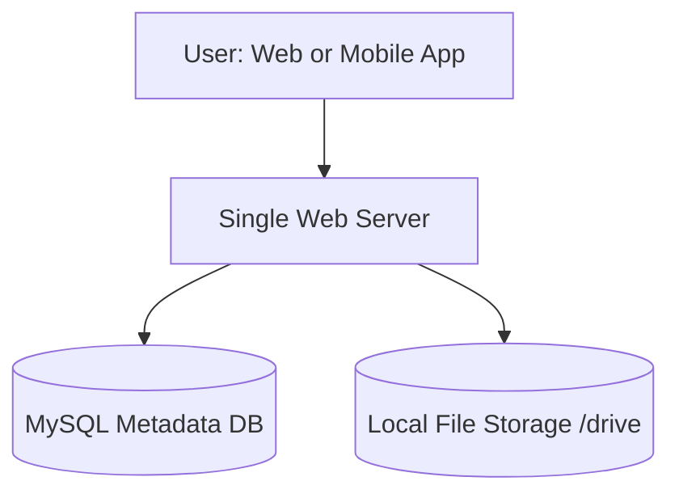

### Local Storage Layout

```text
/drive
├── user1
│   ├── recipes
│   └── chicken_soup.txt
├── user2
│   ├── football.mov
│   └── sports.txt
└── user3
    └── best_pic_ever.png
```

### Problem With This Design

```text
┌────────────────────────────────────┐
│ Single Server Problems             │
├────────────────────────────────────┤
│ Storage eventually runs out         │
│ Server is a single point of failure │
│ Hard to scale upload/download load  │
│ Local disk failure can lose data    │
└────────────────────────────────────┘
```

---

## 4. Basic APIs

### Upload File

```http
POST /files/upload?uploadType=resumable
Authorization: Bearer <token>
Content-Type: application/octet-stream
```

Supported upload types:

```text
┌───────────────────┬────────────────────────────────────┐
│ Upload Type       │ Use Case                           │
├───────────────────┼────────────────────────────────────┤
│ Simple upload     │ Small files                         │
│ Resumable upload  │ Large files or unstable networks    │
└───────────────────┴────────────────────────────────────┘
```

### Download File

```http
GET /files/download?path=/recipes/soup/best_soup.txt
Authorization: Bearer <token>
```

### List File Revisions

```http
GET /files/list_revisions?path=/recipes/soup/best_soup.txt&limit=20
Authorization: Bearer <token>
```

---

## 5. Move Away From Single Server

First improvement: shard storage by user.

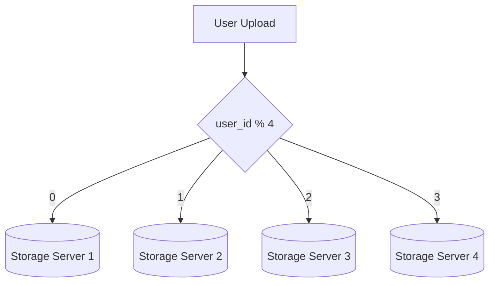

Problem: storage servers can still fail.

Better improvement: use cloud object storage such as S3-like storage.

```text
┌───────────────────────┐       replicated to        ┌───────────────────────┐
│ Region A              │ ─────────────────────────▶ │ Region B              │
│ ┌───────────────────┐ │                            │ ┌───────────────────┐ │
│ │ File Bucket       │ │                            │ │ File Bucket       │ │
│ └───────────────────┘ │                            │ └───────────────────┘ │
└───────────────────────┘                            └───────────────────────┘
```

---

## 6. Improved High-Level Design

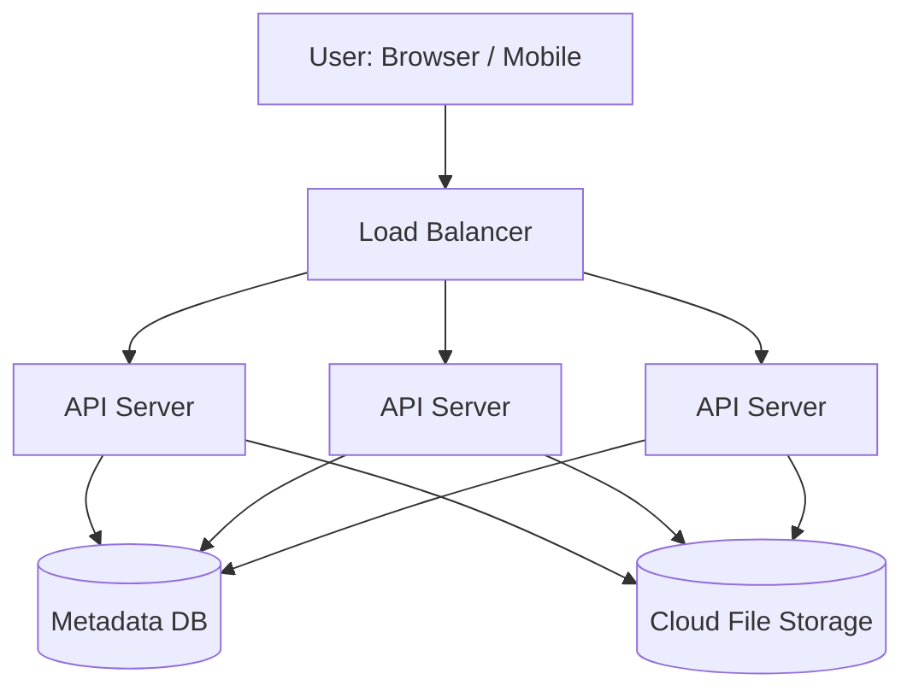

### Responsibilities

```text
┌───────────────────┬────────────────────────────────────────────┐
│ Component         │ Responsibility                             │
├───────────────────┼────────────────────────────────────────────┤
│ Load Balancer     │ Distributes traffic to API servers          │
│ API Servers       │ Auth, metadata, sharing, revisions          │
│ Metadata DB       │ Stores users, files, versions, blocks       │
│ Cloud Storage     │ Stores actual encrypted file blocks         │
└───────────────────┴────────────────────────────────────────────┘
```

---

## 7. Final High-Level Google Drive Architecture

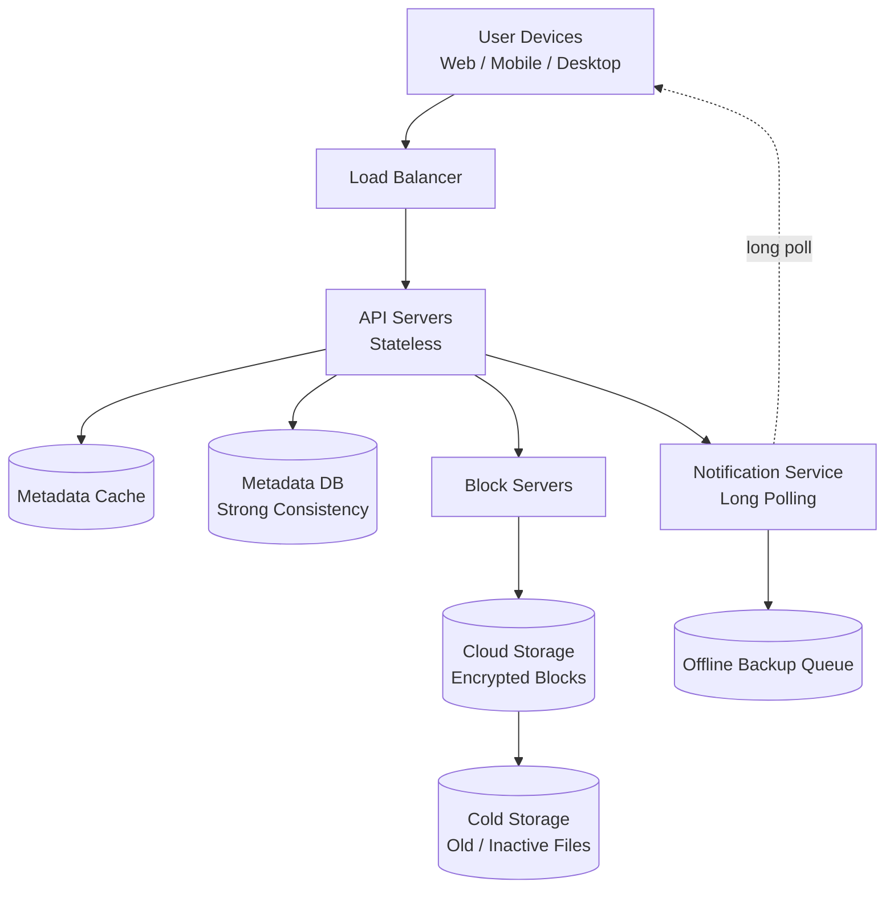

### Component Map

```text
┌─────────────────────┐
│ Client              │
│ Web / Mobile / App  │
└──────────┬──────────┘
           │
           ▼
┌─────────────────────┐
│ Load Balancer       │
└──────────┬──────────┘
           │
           ▼
┌─────────────────────┐
│ API Servers         │
│ Auth, metadata, ACL │
└─────┬───────┬───────┘
      │       │
      ▼       ▼
┌─────────┐ ┌────────────────┐
│ Metadata│ │ Block Servers  │
│ DB/Cache│ │ chunk/compress │
└─────────┘ │ encrypt/hash   │
            └───────┬────────┘
                    ▼
            ┌────────────────┐
            │ Cloud Storage  │
            │ encrypted data │
            └────────────────┘
```

---

## 8. Block Server Design

Block servers reduce bandwidth and centralize heavy processing.

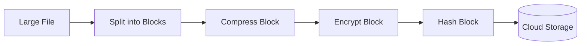

### Why Use Blocks?

```text
┌──────────────────────┬──────────────────────────────────────────┐
│ Technique            │ Benefit                                  │
├──────────────────────┼──────────────────────────────────────────┤
│ Chunking             │ Upload/download only parts of a file      │
│ Delta sync           │ Send only changed blocks                  │
│ Compression          │ Reduce network and storage size           │
│ Encryption           │ Protect data at rest                      │
│ Hashing              │ Deduplicate identical blocks              │
└──────────────────────┴──────────────────────────────────────────┘
```

### Delta Sync Visual

```text
Original file blocks:
┌───────┬───────┬───────┬───────┬───────┐
│ B1    │ B2    │ B3    │ B4    │ B5    │
└───────┴───────┴───────┴───────┴───────┘

Modified file blocks:
┌───────┬───────┬───────┬───────┬───────┐
│ B1    │ B2*   │ B3    │ B4    │ B5*   │
└───────┴───────┴───────┴───────┴───────┘

Only changed blocks uploaded:
┌───────┬───────┐
│ B2*   │ B5*   │
└───────┴───────┘
```

---

## 9. Java Example: Split File Into Blocks

```java
import java.io.IOException;
import java.nio.file.Files;
import java.nio.file.Path;
import java.security.MessageDigest;
import java.util.ArrayList;
import java.util.HexFormat;
import java.util.List;

public class FileChunker {
    private static final int BLOCK_SIZE = 4 * 1024 * 1024; // 4 MB

    public static List<Block> splitIntoBlocks(Path filePath) throws Exception {
        byte[] fileBytes = Files.readAllBytes(filePath);
        List<Block> blocks = new ArrayList<>();

        int blockOrder = 0;
        for (int offset = 0; offset < fileBytes.length; offset += BLOCK_SIZE) {
            int end = Math.min(offset + BLOCK_SIZE, fileBytes.length);
            byte[] blockBytes = new byte[end - offset];
            System.arraycopy(fileBytes, offset, blockBytes, 0, blockBytes.length);

            String hash = sha256(blockBytes);
            blocks.add(new Block(blockOrder++, hash, blockBytes.length));
        }

        return blocks;
    }

    private static String sha256(byte[] data) throws Exception {
        MessageDigest digest = MessageDigest.getInstance("SHA-256");
        return HexFormat.of().formatHex(digest.digest(data));
    }

    record Block(int order, String hash, int sizeBytes) {}
}
```

### What This Code Represents

```text
File
 │
 ▼
Split into 4 MB blocks
 │
 ▼
Generate SHA-256 hash per block
 │
 ▼
Store block metadata:
┌────────────┬────────────┬────────────┐
│ blockOrder │ blockHash  │ blockSize  │
└────────────┴────────────┴────────────┘
```

---

## 10. Metadata Database Schema

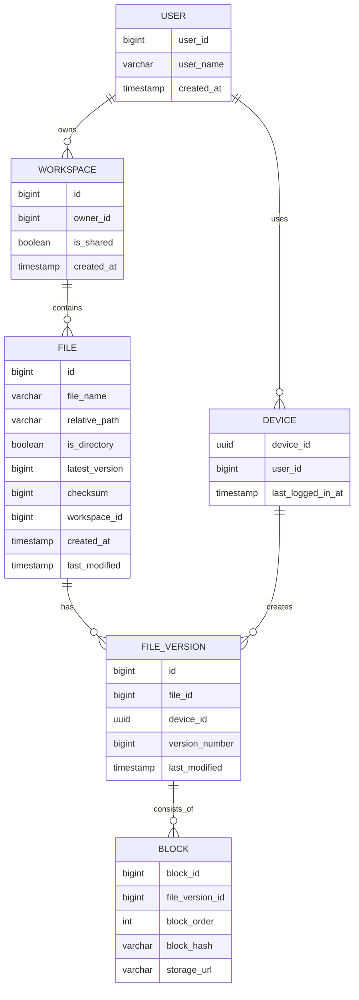

### Important Metadata Rule

```text
┌────────────────────────────────────────────────────────────┐
│ Metadata DB stores file metadata only.                     │
│ Actual file content is stored as encrypted blocks in cloud. │
└────────────────────────────────────────────────────────────┘
```

---

## 11. Upload Flow

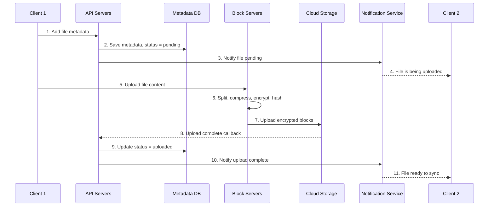

### Upload Status State Machine

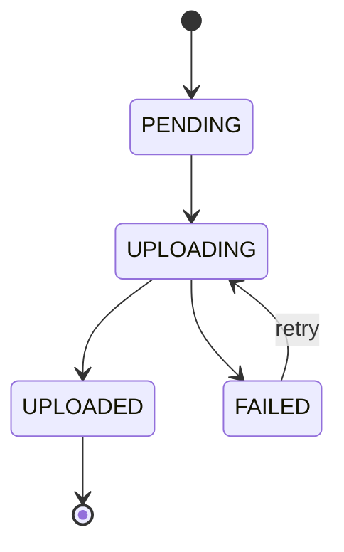

---

## 12. Java Example: Upload Status Enum

```java
public enum UploadStatus {
    PENDING,
    UPLOADING,
    UPLOADED,
    FAILED
}

class FileMetadata {
    private final long fileId;
    private final String fileName;
    private UploadStatus status;

    public FileMetadata(long fileId, String fileName) {
        this.fileId = fileId;
        this.fileName = fileName;
        this.status = UploadStatus.PENDING;
    }

    public void markUploading() {
        this.status = UploadStatus.UPLOADING;
    }

    public void markUploaded() {
        this.status = UploadStatus.UPLOADED;
    }

    public void markFailed() {
        this.status = UploadStatus.FAILED;
    }
}
```

---

## 13. Download Flow

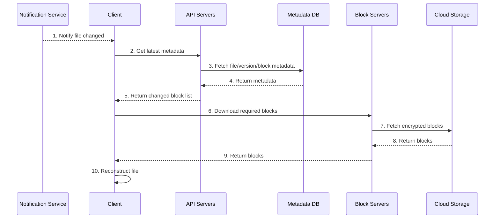

### Download Visual

```text
Client receives metadata:
┌──────────────┬──────────────┬──────────────┐
│ block_order  │ block_hash   │ storage_url  │
└──────────────┴──────────────┴──────────────┘
         │
         ▼
Download blocks in order
         │
         ▼
Decrypt + decompress
         │
         ▼
Rebuild original file
```

---

## 14. Java Example: Reconstruct File From Blocks

```java
import java.io.ByteArrayOutputStream;
import java.util.Comparator;
import java.util.List;

public class FileReconstructor {

    public static byte[] reconstruct(List<FileBlock> blocks) throws Exception {
        blocks.sort(Comparator.comparingInt(FileBlock::order));

        ByteArrayOutputStream output = new ByteArrayOutputStream();

        for (FileBlock block : blocks) {
            byte[] decrypted = decrypt(block.data());
            byte[] decompressed = decompress(decrypted);
            output.write(decompressed);
        }

        return output.toByteArray();
    }

    private static byte[] decrypt(byte[] encryptedData) {
        // Placeholder: use AES-GCM or another secure encryption method in production.
        return encryptedData;
    }

    private static byte[] decompress(byte[] compressedData) {
        // Placeholder: use gzip, zstd, etc. depending on file type.
        return compressedData;
    }

    record FileBlock(int order, byte[] data) {}
}
```

---

## 15. Sync Conflict Handling

Conflict example: two users update the same file at almost the same time.

```text
Timeline

User 1 edit ───────▶ System processes first ───────▶ Accepted
User 2 edit ───────▶ System processes later ───────▶ Conflict
```

Conflict resolution strategy:

```text
┌─────────────────────────────────────────────────────────────┐
│ First processed version wins.                               │
│ Later version becomes a conflicted copy.                    │
└─────────────────────────────────────────────────────────────┘
```

Visual:

```text
Before conflict:
┌───────────────────────────────┐
│ SystemDesignInterview.docx    │
└───────────────────────────────┘

After conflict:
┌─────────────────────────────────────────────────────┐
│ SystemDesignInterview.docx                          │
│ SystemDesignInterview_user2_conflicted_2026_04_27   │
└─────────────────────────────────────────────────────┘
```

---

## 16. Java Example: Conflict Detection

```java
class ConflictResolver {

    public SaveResult saveFile(long fileId, long clientBaseVersion, long serverLatestVersion) {
        if (clientBaseVersion == serverLatestVersion) {
            return SaveResult.accepted("Saved as latest version");
        }

        return SaveResult.conflict(
            "Server has a newer version. Save this upload as a conflicted copy."
        );
    }

    record SaveResult(boolean success, boolean conflict, String message) {
        static SaveResult accepted(String message) {
            return new SaveResult(true, false, message);
        }

        static SaveResult conflict(String message) {
            return new SaveResult(false, true, message);
        }
    }
}
```

### Version-Based Conflict Rule

```text
Client says: "I edited version 7"
Server says: "Latest version is 7"
Result: accept upload as version 8

Client says: "I edited version 7"
Server says: "Latest version is 8"
Result: conflict, create conflicted copy
```

---

## 17. Notification Service

For Google Drive-like sync, clients need to know when a file changed somewhere else.

### Long Polling Design

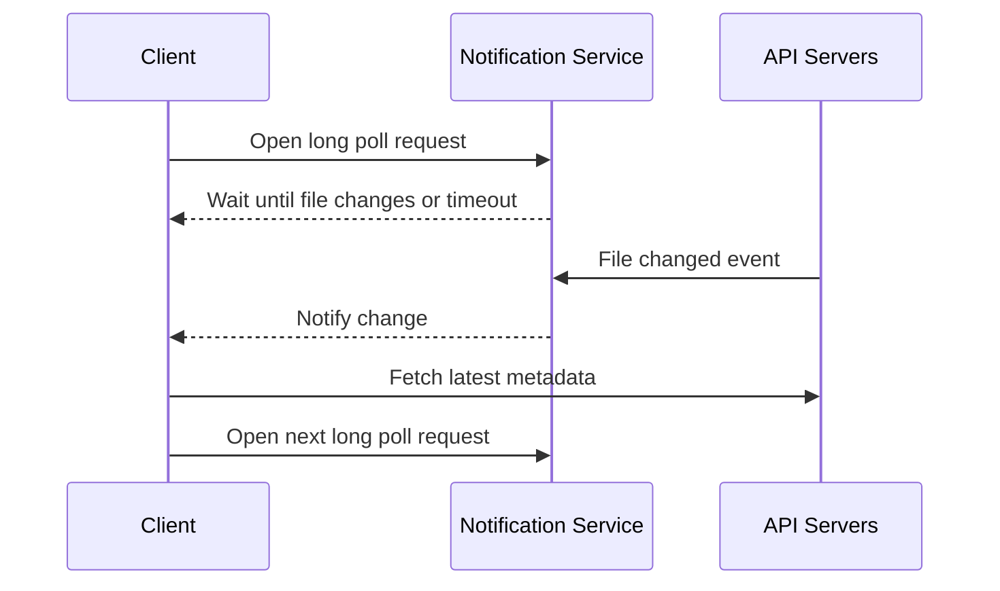

### Long Polling vs WebSocket

```text
┌────────────────┬─────────────────────────────┬────────────────────────────┐
│ Option         │ Good For                    │ Google Drive Fit?          │
├────────────────┼─────────────────────────────┼────────────────────────────┤
│ Long polling   │ Infrequent server events     │ Good fit                   │
│ WebSocket      │ Real-time bidirectional apps │ More useful for chat/games  │
└────────────────┴─────────────────────────────┴────────────────────────────┘
```

---

## 18. Strong Consistency

A storage sync system should not show different file states to different clients.

```text
┌───────────────────────────────────────────────────────────┐
│ Strong consistency goal                                   │
├───────────────────────────────────────────────────────────┤
│ If client A sees file version 10, client B should not see │
│ stale version 9 after the metadata update is committed.   │
└───────────────────────────────────────────────────────────┘
```

### Cache Rule

```text
Database write happens
        │
        ▼
Invalidate metadata cache
        │
        ▼
Next read fetches fresh metadata from DB
        │
        ▼
Cache is repopulated with latest data
```

---

## 19. Storage Space Optimizations

```text
┌──────────────────────────────┬──────────────────────────────────────┐
│ Optimization                 │ Explanation                          │
├──────────────────────────────┼──────────────────────────────────────┤
│ Block deduplication          │ Same block hash means reuse block     │
│ Limit version history        │ Keep only N versions                  │
│ Smart version retention      │ Keep more recent/important versions   │
│ Cold storage                 │ Move inactive data to cheaper storage │
│ Delta sync                   │ Upload only modified blocks           │
│ Compression                  │ Reduce block size                     │
└──────────────────────────────┴──────────────────────────────────────┘
```

### Deduplication Visual

```text
File A blocks:  A1  A2  A3
File B blocks:  B1  A2  B3

A2 has same hash in both files.
Store A2 once, reference it twice.

┌──────────────┐
│ Block Store  │
├──────────────┤
│ hash_A1      │
│ hash_A2      │ ◀── used by File A and File B
│ hash_A3      │
│ hash_B1      │
│ hash_B3      │
└──────────────┘
```

---

## 20. Failure Handling

```text
┌──────────────────────────┬────────────────────────────────────────────┐
│ Failure                  │ Handling Strategy                          │
├──────────────────────────┼────────────────────────────────────────────┤
│ Load balancer failure    │ Active-passive LB with heartbeat           │
│ API server failure       │ Stateless API; route to another server     │
│ Block server failure     │ Retry unfinished jobs on another server    │
│ Cloud storage failure    │ Multi-region replication                   │
│ Metadata cache failure   │ Use replicas; replace failed node          │
│ Metadata DB master down  │ Promote replica to new master              │
│ Metadata DB replica down │ Read from another replica                  │
│ Notification failure     │ Clients reconnect to another server        │
│ Queue failure            │ Replicated queue and consumer resubscribe  │
└──────────────────────────┴────────────────────────────────────────────┘
```

### Failure Resilience Visual

```text
                 ┌──────────────────────┐
                 │ Load Balancer Active │
                 └──────────┬───────────┘
                            │ heartbeat
                 ┌──────────▼───────────┐
                 │ Load Balancer Backup │
                 └──────────────────────┘

If active fails, backup becomes active.
```

---

## 21. Alternative Design: Client Uploads Directly to Cloud Storage

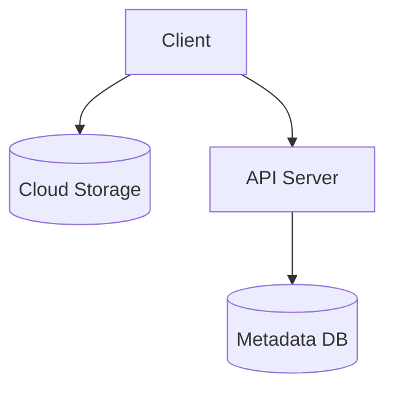

### Pros and Cons

```text
┌──────────────────────┬─────────────────────────────────────────────┐
│ Pros                 │ Cons                                        │
├──────────────────────┼─────────────────────────────────────────────┤
│ Faster upload path   │ Must implement chunk/compress/encrypt logic │
│ Less backend traffic │ on Web, iOS, Android, Desktop               │
│                      │ Client code can be tampered with            │
└──────────────────────┴─────────────────────────────────────────────┘
```

Reason to prefer block servers:

```text
┌────────────────────────────────────────────────────────────┐
│ Centralized block servers keep chunking, compression,      │
│ encryption, hashing, and deduplication consistent.         │
└────────────────────────────────────────────────────────────┘
```

---

## 22. Interview Summary

```text
┌──────────────────────────────────────────────────────────────┐
│ Google Drive Design Summary                                  │
├──────────────────────────────────────────────────────────────┤
│ 1. Store metadata in a strongly consistent metadata DB.       │
│ 2. Store actual content as encrypted blocks in cloud storage. │
│ 3. Use block servers for chunking, compression, encryption.   │
│ 4. Use delta sync to reduce bandwidth.                       │
│ 5. Use notification service with long polling.                │
│ 6. Use offline queue for clients that are disconnected.       │
│ 7. Use version history and conflict copies for sync conflicts.│
│ 8. Use replication, sharding, caching, and retries.           │
└──────────────────────────────────────────────────────────────┘
```

---

## 23. Quick Mental Model

```text
Google Drive = Metadata System + Block Storage System + Sync System

┌──────────────────┐     ┌──────────────────┐     ┌──────────────────┐
│ Metadata System  │     │ Block Storage    │     │ Sync System      │
├──────────────────┤     ├──────────────────┤     ├──────────────────┤
│ users            │     │ chunks           │     │ notifications    │
│ files            │     │ compression      │     │ long polling     │
│ versions         │     │ encryption       │     │ offline queue    │
│ sharing ACLs     │     │ deduplication    │     │ conflict handling│
└──────────────────┘     └──────────────────┘     └──────────────────┘
```

---

## 24. Key Terms

```text
┌────────────────────┬───────────────────────────────────────────────┐
│ Term               │ Meaning                                       │
├────────────────────┼───────────────────────────────────────────────┤
│ Block              │ Small piece of a file                         │
│ Delta sync         │ Sync only changed blocks                      │
│ Metadata           │ Information about files, not file content     │
│ Revision           │ Historical version of a file                  │
│ Long polling       │ Client waits for server-side change event     │
│ Cold storage       │ Cheap storage for rarely accessed data        │
│ Deduplication      │ Store identical blocks only once              │
│ Strong consistency │ All clients see latest committed metadata     │
└────────────────────┴───────────────────────────────────────────────┘
```

