# Proximity Service — Spring Boot + PostgreSQL/PostGIS Visual Notes

> Goal: design and implement a proximity service that returns nearby businesses such as restaurants, hotels, gas stations, theaters, and museums based on user latitude, longitude, and radius.

---

# 1. Problem Scope

## Functional Requirements

- Return nearby businesses for a given latitude, longitude, and radius.
- Support user-selected radius: `0.5 km`, `1 km`, `2 km`, `5 km`, `20 km`.
- Business owners can add, update, or delete businesses.
- Business updates do not need to appear in real time.
- Customers can view business details.
- Search results should be paginated.

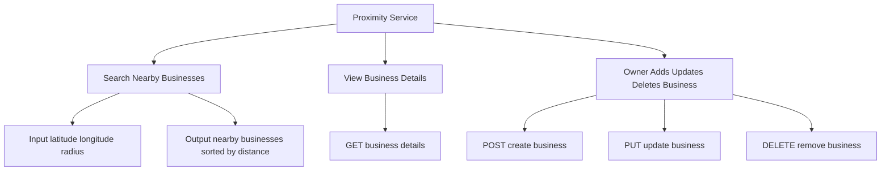

---

## Non-Functional Requirements

| Requirement | Notes |
|---|---|
| Low latency | Nearby search should return quickly |
| High availability | Service should survive node failures |
| Scalability | Handle traffic spikes in dense areas |
| Privacy | User location is sensitive |
| Read-heavy | Searches and business detail views dominate writes |
| Eventual update visibility | Business writes can become visible later |

---

# 2. Back-of-the-Envelope Estimation

Assumptions:

```text
DAU = 100 million
Searches per user per day = 5
Seconds per day ≈ 100,000
```

Search QPS:

```text
100M * 5 / 100,000 = 5,000 QPS
```

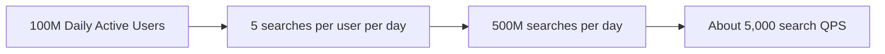

---

# 3. Why PostGIS?

In the book-style design, geohash, quadtree, and S2 are common options.

For a practical Spring Boot implementation, **PostgreSQL + PostGIS** is a strong choice because it provides built-in spatial indexing and distance queries.

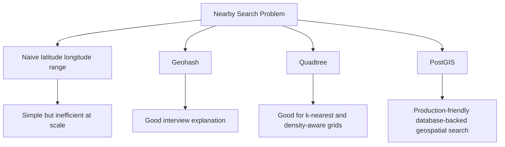

## PostGIS Core Idea

PostGIS stores a point as a spatial value and indexes it with a GiST index.

```text
business location = POINT(longitude latitude)
```

Then we query:

```text
Find all businesses whose location is within radius meters of user point.
```

---

# 4. High-Level Architecture

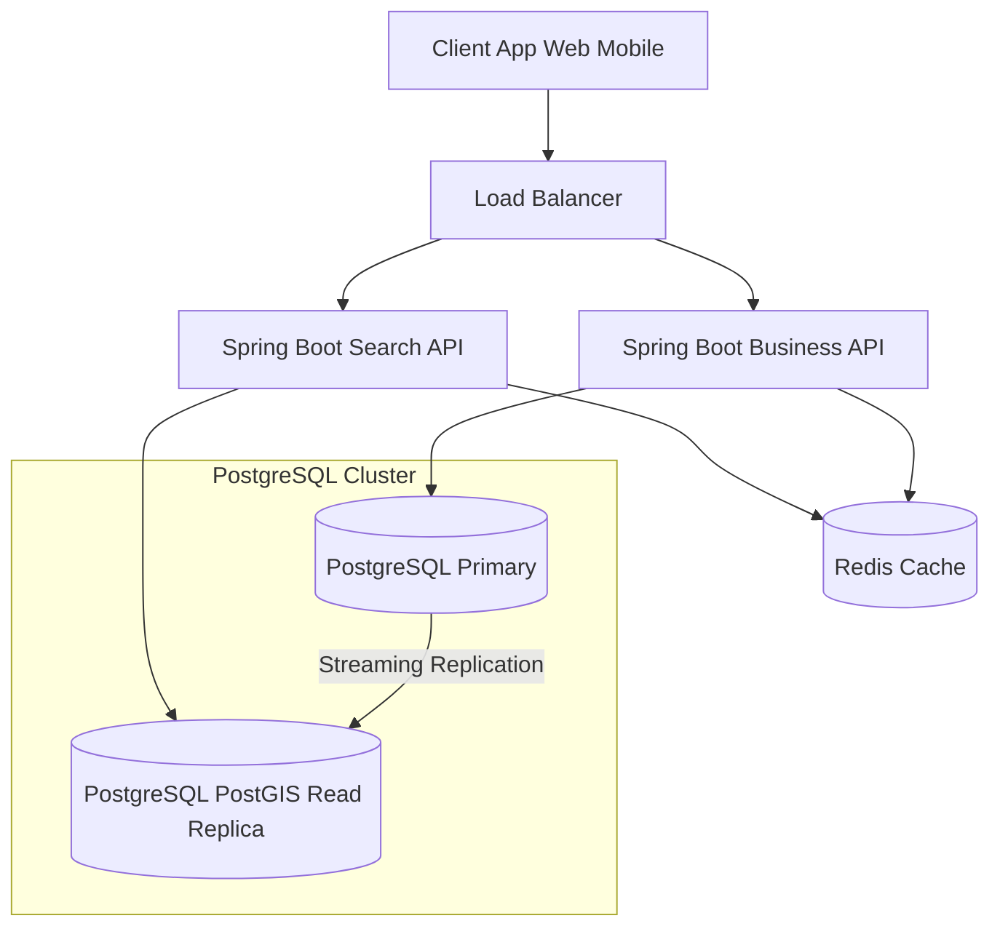

## Component Responsibilities

| Component | Responsibility |
|---|---|
| Client | Sends location, radius, filters, pagination |
| Load Balancer | Routes traffic to Spring Boot services |
| Search API | Executes nearby search using PostGIS |
| Business API | Handles business CRUD |
| Redis | Optional cache for popular searches and business details |
| PostgreSQL Primary | Handles writes |
| PostgreSQL Read Replicas | Handle read-heavy nearby queries |
| PostGIS | Provides geospatial data types, functions, and indexes |

---

# 5. API Design

## Nearby Search API

```http
GET /v1/search/nearby?latitude=37.776720&longitude=-122.416730&radiusMeters=500&page=0&size=20
```

## Business APIs

```http
GET    /v1/businesses/{id}
POST   /v1/businesses
PUT    /v1/businesses/{id}
DELETE /v1/businesses/{id}
```

## Nearby Search Response

```json
{
  "total": 2,
  "businesses": [
    {
      "id": 101,
      "name": "Taco Palace",
      "category": "Restaurant",
      "distanceMeters": 240.8,
      "rating": 4.5
    },
    {
      "id": 102,
      "name": "Coffee Box",
      "category": "Cafe",
      "distanceMeters": 410.2,
      "rating": 4.2
    }
  ]
}
```

---

# 6. Data Model with PostGIS

## Business Table

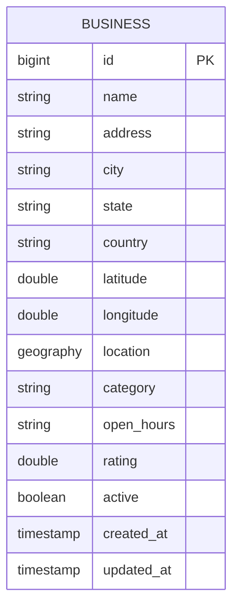

## SQL Schema

```sql
CREATE EXTENSION IF NOT EXISTS postgis;

CREATE TABLE businesses (
    id BIGSERIAL PRIMARY KEY,
    name VARCHAR(255) NOT NULL,
    address TEXT,
    city VARCHAR(100),
    state VARCHAR(100),
    country VARCHAR(100),
    latitude DOUBLE PRECISION NOT NULL,
    longitude DOUBLE PRECISION NOT NULL,
    location GEOGRAPHY(POINT, 4326) NOT NULL,
    category VARCHAR(100),
    open_hours TEXT,
    rating DOUBLE PRECISION DEFAULT 0,
    active BOOLEAN DEFAULT TRUE,
    created_at TIMESTAMP DEFAULT NOW(),
    updated_at TIMESTAMP DEFAULT NOW()
);

CREATE INDEX idx_businesses_location
ON businesses
USING GIST (location);

CREATE INDEX idx_businesses_category
ON businesses(category);

CREATE INDEX idx_businesses_active
ON businesses(active);
```

## Why `GEOGRAPHY` instead of `GEOMETRY`?

| Type | Use Case |
|---|---|
| `GEOGRAPHY` | Earth distance in meters, good for latitude/longitude search |
| `GEOMETRY` | Planar coordinates, faster for projected local maps |

For this service, `GEOGRAPHY(POINT, 4326)` is convenient because `ST_DWithin` and `ST_Distance` work in meters.

---

# 7. Nearby Search Query with PostGIS

## Core SQL

```sql
SELECT
    id,
    name,
    category,
    rating,
    latitude,
    longitude,
    ST_Distance(
        location,
        ST_MakePoint(:longitude, :latitude)::geography
    ) AS distance_meters
FROM businesses
WHERE active = TRUE
  AND ST_DWithin(
        location,
        ST_MakePoint(:longitude, :latitude)::geography,
        :radiusMeters
      )
ORDER BY distance_meters ASC
LIMIT :limit OFFSET :offset;
```

## Query Flow

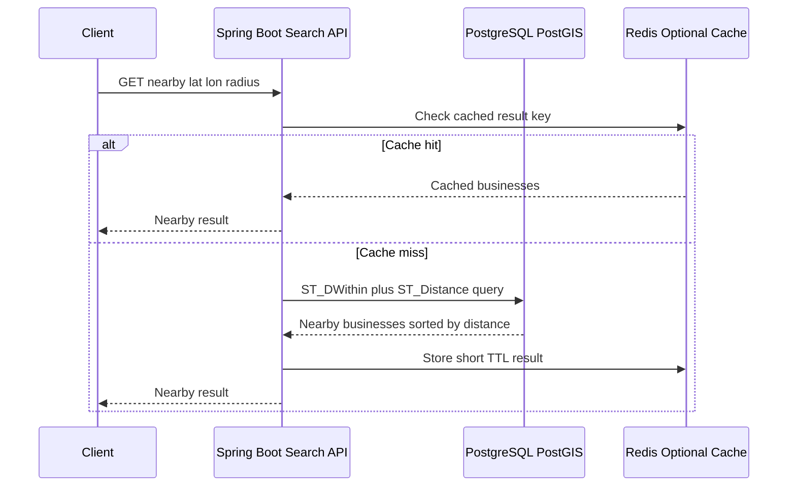

---

# 8. PostGIS Search Visual

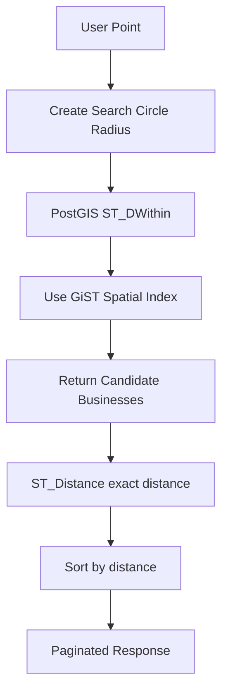

---

# 9. Spring Boot Project Structure

```text
src/main/java/com/example/proximity
  ├── ProximityApplication.java
  ├── controller
  │   ├── SearchController.java
  │   └── BusinessController.java
  ├── service
  │   ├── NearbySearchService.java
  │   └── BusinessService.java
  ├── repository
  │   └── BusinessRepository.java
  ├── dto
  │   ├── NearbyBusinessResponse.java
  │   ├── NearbySearchResponse.java
  │   └── CreateBusinessRequest.java
  └── entity
      └── Business.java
```

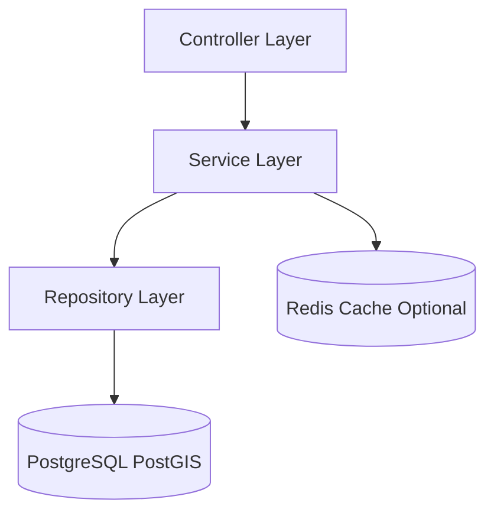

---

# 10. Maven Dependencies

```xml
<dependencies>
    <dependency>
        <groupId>org.springframework.boot</groupId>
        <artifactId>spring-boot-starter-web</artifactId>
    </dependency>

    <dependency>
        <groupId>org.springframework.boot</groupId>
        <artifactId>spring-boot-starter-data-jpa</artifactId>
    </dependency>

    <dependency>
        <groupId>org.postgresql</groupId>
        <artifactId>postgresql</artifactId>
        <scope>runtime</scope>
    </dependency>

    <dependency>
        <groupId>org.hibernate.orm</groupId>
        <artifactId>hibernate-spatial</artifactId>
    </dependency>

    <dependency>
        <groupId>org.locationtech.jts</groupId>
        <artifactId>jts-core</artifactId>
    </dependency>

    <dependency>
        <groupId>org.springframework.boot</groupId>
        <artifactId>spring-boot-starter-data-redis</artifactId>
    </dependency>
</dependencies>
```

---

# 11. application.yml

```yaml
spring:
  datasource:
    url: jdbc:postgresql://localhost:5432/proximity_db
    username: postgres
    password: postgres
  jpa:
    hibernate:
      ddl-auto: validate
    properties:
      hibernate:
        dialect: org.hibernate.spatial.dialect.postgis.PostgisPG10Dialect
    show-sql: true
  data:
    redis:
      host: localhost
      port: 6379
```

---

# 12. Java Entity

```java
package com.example.proximity.entity;

import jakarta.persistence.*;
import org.locationtech.jts.geom.Point;
import java.time.Instant;

@Entity
@Table(name = "businesses")
public class Business {

    @Id
    @GeneratedValue(strategy = GenerationType.IDENTITY)
    private Long id;

    private String name;
    private String address;
    private String city;
    private String state;
    private String country;

    private Double latitude;
    private Double longitude;

    @Column(columnDefinition = "geography(Point,4326)")
    private Point location;

    private String category;
    private String openHours;
    private Double rating;
    private Boolean active;
    private Instant createdAt;
    private Instant updatedAt;

    public Long getId() { return id; }
    public String getName() { return name; }
    public String getCategory() { return category; }
    public Double getRating() { return rating; }
    public Double getLatitude() { return latitude; }
    public Double getLongitude() { return longitude; }

    public void setName(String name) { this.name = name; }
    public void setAddress(String address) { this.address = address; }
    public void setCity(String city) { this.city = city; }
    public void setState(String state) { this.state = state; }
    public void setCountry(String country) { this.country = country; }
    public void setLatitude(Double latitude) { this.latitude = latitude; }
    public void setLongitude(Double longitude) { this.longitude = longitude; }
    public void setLocation(Point location) { this.location = location; }
    public void setCategory(String category) { this.category = category; }
    public void setOpenHours(String openHours) { this.openHours = openHours; }
    public void setRating(Double rating) { this.rating = rating; }
    public void setActive(Boolean active) { this.active = active; }
    public void setCreatedAt(Instant createdAt) { this.createdAt = createdAt; }
    public void setUpdatedAt(Instant updatedAt) { this.updatedAt = updatedAt; }
}
```

---

# 13. DTOs

```java
package com.example.proximity.dto;

public record NearbyBusinessResponse(
        Long id,
        String name,
        String category,
        Double rating,
        Double latitude,
        Double longitude,
        Double distanceMeters
) {}
```

```java
package com.example.proximity.dto;

import java.util.List;

public record NearbySearchResponse(
        int total,
        List<NearbyBusinessResponse> businesses
) {}
```

```java
package com.example.proximity.dto;

public record CreateBusinessRequest(
        String name,
        String address,
        String city,
        String state,
        String country,
        double latitude,
        double longitude,
        String category,
        String openHours,
        double rating
) {}
```

---

# 14. Repository with Native PostGIS Query

```java
package com.example.proximity.repository;

import com.example.proximity.entity.Business;
import org.springframework.data.jpa.repository.JpaRepository;
import org.springframework.data.jpa.repository.Query;
import org.springframework.data.repository.query.Param;

import java.util.List;

public interface BusinessRepository extends JpaRepository<Business, Long> {

    @Query(value = """
        SELECT
            id,
            name,
            category,
            rating,
            latitude,
            longitude,
            ST_Distance(
                location,
                ST_MakePoint(:longitude, :latitude)::geography
            ) AS distance_meters
        FROM businesses
        WHERE active = TRUE
          AND (:category IS NULL OR category = :category)
          AND ST_DWithin(
                location,
                ST_MakePoint(:longitude, :latitude)::geography,
                :radiusMeters
              )
        ORDER BY distance_meters ASC
        LIMIT :limit OFFSET :offset
        """, nativeQuery = true)
    List<Object[]> findNearbyRaw(
            @Param("latitude") double latitude,
            @Param("longitude") double longitude,
            @Param("radiusMeters") double radiusMeters,
            @Param("category") String category,
            @Param("limit") int limit,
            @Param("offset") int offset
    );
}
```

---

# 15. Nearby Search Service

```java
package com.example.proximity.service;

import com.example.proximity.dto.NearbyBusinessResponse;
import com.example.proximity.dto.NearbySearchResponse;
import com.example.proximity.repository.BusinessRepository;
import org.springframework.stereotype.Service;

import java.math.BigDecimal;
import java.util.List;

@Service
public class NearbySearchService {

    private final BusinessRepository businessRepository;

    public NearbySearchService(BusinessRepository businessRepository) {
        this.businessRepository = businessRepository;
    }

    public NearbySearchResponse searchNearby(
            double latitude,
            double longitude,
            double radiusMeters,
            String category,
            int page,
            int size
    ) {
        validate(latitude, longitude, radiusMeters, page, size);

        int offset = page * size;

        List<NearbyBusinessResponse> businesses = businessRepository
                .findNearbyRaw(latitude, longitude, radiusMeters, category, size, offset)
                .stream()
                .map(this::mapRow)
                .toList();

        return new NearbySearchResponse(businesses.size(), businesses);
    }

    private NearbyBusinessResponse mapRow(Object[] row) {
        return new NearbyBusinessResponse(
                ((Number) row[0]).longValue(),
                (String) row[1],
                (String) row[2],
                toDouble(row[3]),
                toDouble(row[4]),
                toDouble(row[5]),
                toDouble(row[6])
        );
    }

    private Double toDouble(Object value) {
        if (value == null) return null;
        if (value instanceof BigDecimal bd) return bd.doubleValue();
        return ((Number) value).doubleValue();
    }

    private void validate(double latitude, double longitude, double radiusMeters, int page, int size) {
        if (latitude < -90 || latitude > 90) {
            throw new IllegalArgumentException("Invalid latitude");
        }
        if (longitude < -180 || longitude > 180) {
            throw new IllegalArgumentException("Invalid longitude");
        }
        if (radiusMeters <= 0 || radiusMeters > 20_000) {
            throw new IllegalArgumentException("Radius must be between 1 and 20,000 meters");
        }
        if (page < 0 || size <= 0 || size > 100) {
            throw new IllegalArgumentException("Invalid pagination");
        }
    }
}
```

---

# 16. Search Controller

```java
package com.example.proximity.controller;

import com.example.proximity.dto.NearbySearchResponse;
import com.example.proximity.service.NearbySearchService;
import org.springframework.web.bind.annotation.*;

@RestController
@RequestMapping("/v1/search")
public class SearchController {

    private final NearbySearchService nearbySearchService;

    public SearchController(NearbySearchService nearbySearchService) {
        this.nearbySearchService = nearbySearchService;
    }

    @GetMapping("/nearby")
    public NearbySearchResponse nearby(
            @RequestParam double latitude,
            @RequestParam double longitude,
            @RequestParam(defaultValue = "5000") double radiusMeters,
            @RequestParam(required = false) String category,
            @RequestParam(defaultValue = "0") int page,
            @RequestParam(defaultValue = "20") int size
    ) {
        return nearbySearchService.searchNearby(
                latitude,
                longitude,
                radiusMeters,
                category,
                page,
                size
        );
    }
}
```

---

# 17. Creating a Business with a PostGIS Point

```java
package com.example.proximity.service;

import com.example.proximity.dto.CreateBusinessRequest;
import com.example.proximity.entity.Business;
import com.example.proximity.repository.BusinessRepository;
import org.locationtech.jts.geom.Coordinate;
import org.locationtech.jts.geom.GeometryFactory;
import org.locationtech.jts.geom.Point;
import org.locationtech.jts.geom.PrecisionModel;
import org.springframework.stereotype.Service;

import java.time.Instant;

@Service
public class BusinessService {

    private static final int SRID_WGS84 = 4326;

    private final BusinessRepository businessRepository;
    private final GeometryFactory geometryFactory = new GeometryFactory(
            new PrecisionModel(),
            SRID_WGS84
    );

    public BusinessService(BusinessRepository businessRepository) {
        this.businessRepository = businessRepository;
    }

    public Long createBusiness(CreateBusinessRequest request) {
        Business business = new Business();
        business.setName(request.name());
        business.setAddress(request.address());
        business.setCity(request.city());
        business.setState(request.state());
        business.setCountry(request.country());
        business.setLatitude(request.latitude());
        business.setLongitude(request.longitude());
        business.setCategory(request.category());
        business.setOpenHours(request.openHours());
        business.setRating(request.rating());
        business.setActive(true);
        business.setCreatedAt(Instant.now());
        business.setUpdatedAt(Instant.now());

        Point point = geometryFactory.createPoint(
                new Coordinate(request.longitude(), request.latitude())
        );
        point.setSRID(SRID_WGS84);
        business.setLocation(point);

        return businessRepository.save(business).getId();
    }
}
```

---

# 18. Business Controller

```java
package com.example.proximity.controller;

import com.example.proximity.dto.CreateBusinessRequest;
import com.example.proximity.service.BusinessService;
import org.springframework.web.bind.annotation.*;

@RestController
@RequestMapping("/v1/businesses")
public class BusinessController {

    private final BusinessService businessService;

    public BusinessController(BusinessService businessService) {
        this.businessService = businessService;
    }

    @PostMapping
    public Long create(@RequestBody CreateBusinessRequest request) {
        return businessService.createBusiness(request);
    }
}
```

---

# 19. Optional Redis Cache Strategy

PostGIS may be fast enough with a good GiST index and read replicas. Add Redis only after benchmarking.

## Cache Types

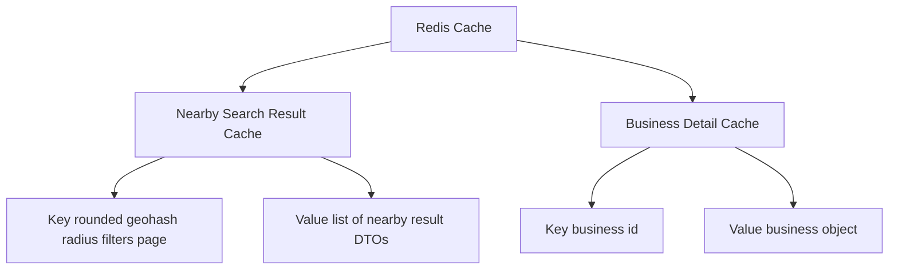

## Cache Key Example

```text
nearby:latBucket:377767:lonBucket:-1224167:r:500:cat:restaurant:p:0:s:20
```

Do not use raw GPS coordinates directly because GPS is noisy and tiny movement creates too many cache keys.

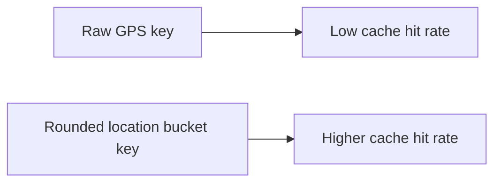

---

# 20. Query Option: Quadtree

PostGIS is the recommended practical implementation here, but quadtree is still useful as an interview option or for an in-memory search accelerator.

A quadtree recursively divides the world into four quadrants until each leaf has at most a configured number of businesses.

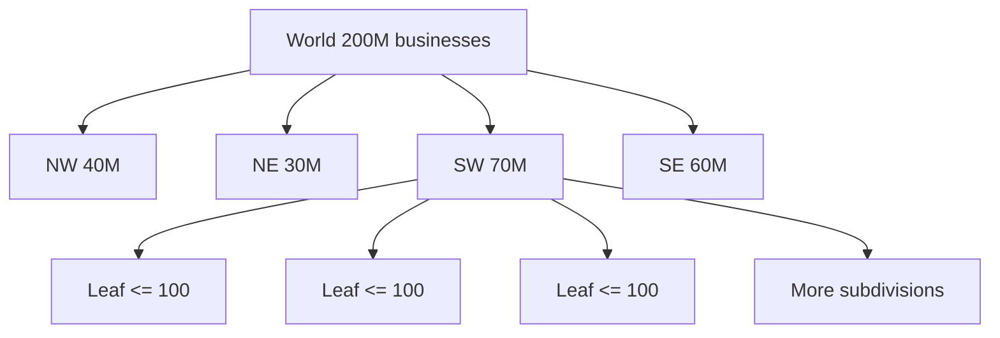

## Quadtree Query Flow

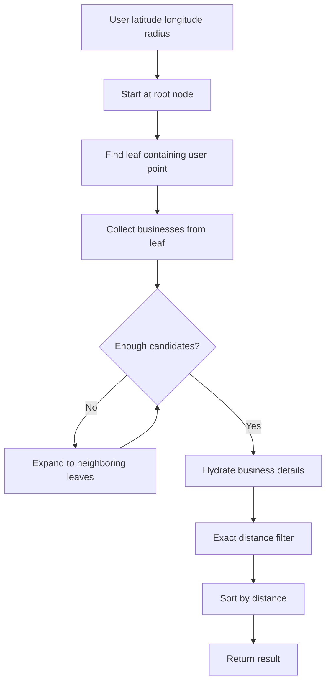

## Quadtree Java Skeleton

```java
import java.util.ArrayList;
import java.util.List;

class BoundingBox {
    double minLat;
    double maxLat;
    double minLon;
    double maxLon;

    boolean contains(double lat, double lon) {
        return lat >= minLat && lat <= maxLat
            && lon >= minLon && lon <= maxLon;
    }

    boolean intersectsCircle(double lat, double lon, double radiusMeters) {
        // Simplified placeholder.
        // Production should calculate shortest distance from point to box.
        return true;
    }
}

class BusinessPoint {
    long businessId;
    double latitude;
    double longitude;

    BusinessPoint(long businessId, double latitude, double longitude) {
        this.businessId = businessId;
        this.latitude = latitude;
        this.longitude = longitude;
    }
}

class QuadTreeNode {
    private static final int MAX_POINTS = 100;

    BoundingBox box;
    List<BusinessPoint> points = new ArrayList<>();
    QuadTreeNode[] children;

    QuadTreeNode(BoundingBox box) {
        this.box = box;
    }

    boolean isLeaf() {
        return children == null;
    }

    void insert(BusinessPoint point) {
        if (!box.contains(point.latitude, point.longitude)) {
            return;
        }

        if (isLeaf() && points.size() < MAX_POINTS) {
            points.add(point);
            return;
        }

        if (isLeaf()) {
            subdivide();
            for (BusinessPoint existing : points) {
                insertIntoChild(existing);
            }
            points.clear();
        }

        insertIntoChild(point);
    }

    void query(double lat, double lon, double radiusMeters, List<Long> resultIds) {
        if (!box.intersectsCircle(lat, lon, radiusMeters)) {
            return;
        }

        if (isLeaf()) {
            for (BusinessPoint point : points) {
                double distance = DistanceUtil.distanceMeters(
                        lat, lon, point.latitude, point.longitude
                );
                if (distance <= radiusMeters) {
                    resultIds.add(point.businessId);
                }
            }
            return;
        }

        for (QuadTreeNode child : children) {
            child.query(lat, lon, radiusMeters, resultIds);
        }
    }

    private void insertIntoChild(BusinessPoint point) {
        for (QuadTreeNode child : children) {
            child.insert(point);
        }
    }

    private void subdivide() {
        children = new QuadTreeNode[4];
        // Create NW, NE, SW, SE bounding boxes here.
    }
}
```

## Quadtree vs PostGIS

| Topic | PostGIS | Quadtree |
|---|---|---|
| Implementation | Easier with database support | More custom code |
| Index | GiST/SP-GiST database index | In-memory tree |
| Updates | Normal DB writes | Harder; may need rebuild or locking |
| Radius search | Excellent | Good |
| k-nearest search | Good with KNN operators | Natural fit |
| Operations | DB backups, replicas, monitoring | App-level rollout/rebuild concerns |
| Best use | Practical Spring Boot backend | Interview deep dive or special accelerator |

---

# 21. Scaling the Database

## Read-Heavy Pattern

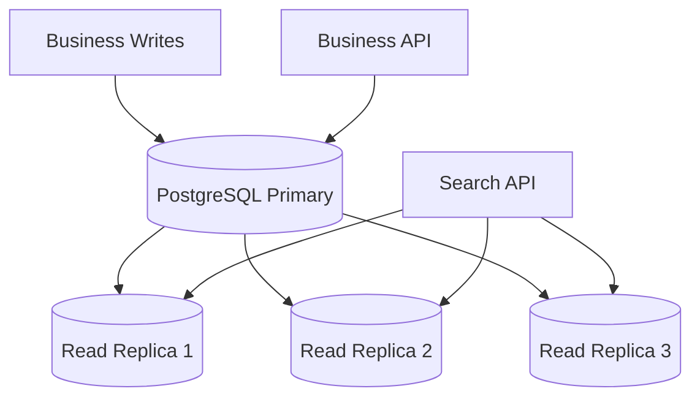

## Scaling Notes

- Use read replicas for search traffic.
- Keep writes on primary.
- Use connection pooling with HikariCP/PgBouncer.
- Partition by region/country if the table becomes very large.
- Keep spatial indexes healthy with `VACUUM`, `ANALYZE`, and monitoring.
- If global, deploy regional databases and route users to nearest region.

---

# 22. Filtering Results

Common filters:

- Category: restaurant, cafe, hotel, gas station.
- Open now.
- Rating above 4.0.
- Price level.
- City or country.


## SQL Example with Category and Rating

```sql
SELECT
    id,
    name,
    category,
    rating,
    ST_Distance(location, ST_MakePoint(:lon, :lat)::geography) AS distance_meters
FROM businesses
WHERE active = TRUE
  AND category = :category
  AND rating >= :minRating
  AND ST_DWithin(location, ST_MakePoint(:lon, :lat)::geography, :radiusMeters)
ORDER BY distance_meters ASC
LIMIT :limit OFFSET :offset;
```

---

# 23. Multi-Region Deployment

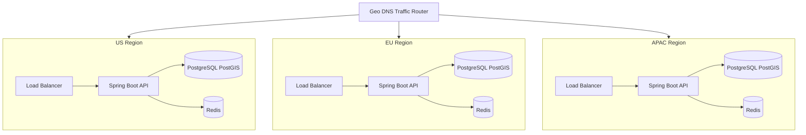

Benefits:

- Lower latency.
- Better availability.
- Regional compliance.
- Easier traffic isolation.

---

# 24. Failure Handling

| Failure | Handling |
|---|---|
| Spring Boot search node fails | Stateless; load balancer routes to another node |
| Redis fails | Fallback to PostGIS query |
| PostgreSQL read replica fails | Remove from pool and route to healthy replica |
| PostgreSQL primary fails | Promote replica or use managed failover |
| Spatial index bloats | Reindex during maintenance window |
| Region outage | Geo DNS routes to another region |
| Cache stale | Use TTL and invalidate on business updates |

---

# 25. End-to-End Nearby Search Flow

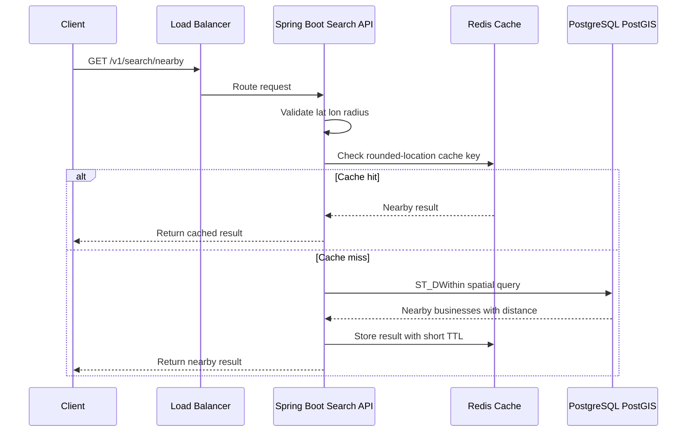

---

# 26. Final Architecture Summary

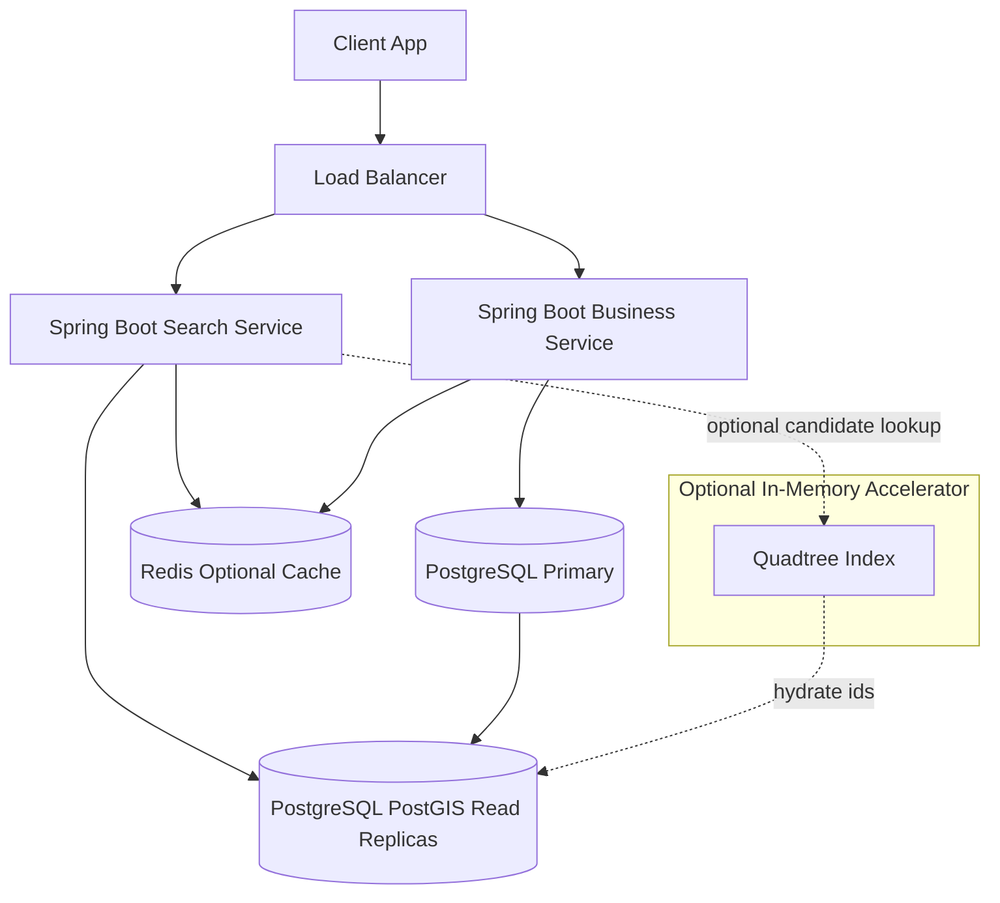

---

# 27. Interview Talking Points

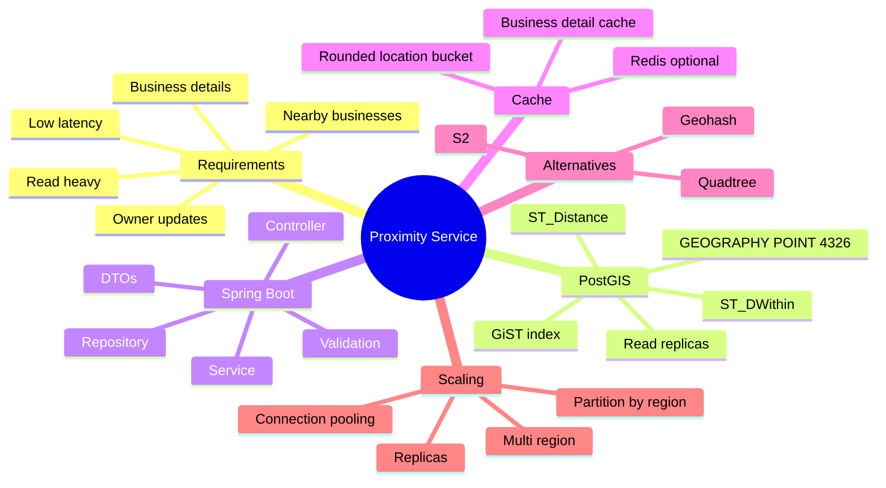

---

# 28. Quick Memory Hook

```text
Client lat/lon/radius
        ↓
Spring Boot Search API
        ↓
PostGIS ST_DWithin radius query
        ↓
GiST spatial index
        ↓
ST_Distance exact distance
        ↓
Sort + paginate
        ↓
Return nearby businesses
```

Best interview phrase:

> For a practical Spring Boot implementation, I would use PostgreSQL with PostGIS. I would store each business as a `GEOGRAPHY(POINT, 4326)`, create a GiST index, use `ST_DWithin` for radius filtering, use `ST_Distance` for ranking, and scale reads through replicas and optional Redis caching.

---

# 29. Minimal cURL Test

```bash
curl "http://localhost:8080/v1/search/nearby?latitude=37.776720&longitude=-122.416730&radiusMeters=500&category=Restaurant&page=0&size=20"
```

---

# 30. Minimal Docker Compose for Local Testing

```yaml
version: "3.9"

services:
  postgres:
    image: postgis/postgis:16-3.4
    container_name: proximity-postgis
    ports:
      - "5432:5432"
    environment:
      POSTGRES_DB: proximity_db
      POSTGRES_USER: postgres
      POSTGRES_PASSWORD: postgres

  redis:
    image: redis:7
    container_name: proximity-redis
    ports:
      - "6379:6379"
```

---

# 31. Summary

This design keeps the interview concepts but uses a production-friendly implementation path:

- Use **Spring Boot** for APIs.
- Use **PostgreSQL + PostGIS** for geospatial search.
- Use `ST_DWithin` to filter businesses within radius.
- Use `ST_Distance` to rank by distance.
- Use a GiST index on the `location` column.
- Use read replicas for search scale.
- Use Redis only when benchmarking shows it helps.
- Keep quadtree as an optional in-memory candidate lookup or interview discussion.
