# 18 — Design Nearby Friends

> Visual system-design notes for a scalable **Nearby Friends** feature, with Mermaid architecture diagrams and small Java reference snippets.

---

# Step 0 — What are we designing?

Nearby Friends is an opt-in mobile feature where a user grants location permission and sees friends who are geographically close.

Core idea:

```text
User reports current location
Backend finds active friends nearby
Backend pushes friend-location updates in near real time
Mobile client renders nearby friends list
```

Unlike a proximity service for businesses, user locations are dynamic and change frequently.

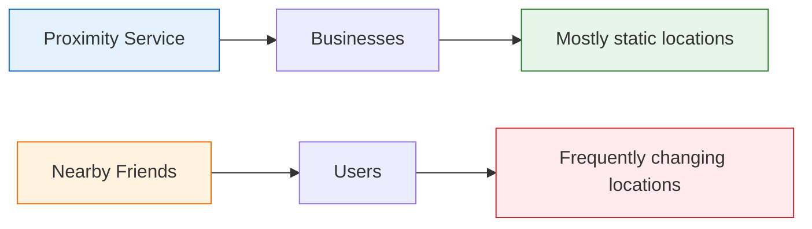

---

# Step 1 — Clarify Requirements

## Functional Requirements

- Users can see nearby friends on mobile.
- Each nearby friend entry shows:
  - friend profile
  - distance
  - last updated timestamp
- Nearby friends are within a configurable radius, for example **5 miles**.
- Nearby friend lists are updated every few seconds.
- Users report their location periodically.
- Inactive friends disappear after a timeout, for example **10 minutes**.
- Location history is stored for analytics or machine learning.

## Non-functional Requirements

- Low latency location updates.
- Reliable overall system.
- Occasional location update loss is acceptable.
- Eventual consistency is acceptable.
- Scalable to millions of concurrent users.
- Efficient message routing to friends.
- Battery and mobile network usage should be considered.

## Out of Scope

- GDPR / CCPA details.
- Exact privacy-policy implementation.
- Travel distance calculation.
- Offline friend display.
- Map UI details.
- Friend recommendation.

Interview line:

> I will focus on real-time location update delivery, active-user location cache, friend fanout, WebSocket connections, Redis Pub/Sub routing, and scalability.

---

# Step 2 — Back-of-the-envelope Estimation

Assumptions:

```text
Total users = 1 billion
Nearby Friends adoption = 10%
DAU = 100 million
Concurrent users = 10% of DAU = 10 million
Location refresh interval = 30 seconds
Average friends per user = 400
Search radius = 5 miles
```

## Location Update QPS

```text
10 million concurrent users / 30 seconds
= ~334,000 location updates/sec
```

## Fanout Estimate

If each user has 400 friends and about 10% are online and nearby:

```text
334K updates/sec * 400 friends * 10%
= ~14 million forwarded updates/sec
```

Interview line:

> The hardest part is not accepting location updates; it is efficiently routing each update to relevant active friends.

---

# Step 3 — Why Peer-to-Peer Does Not Work

Conceptually, every nearby friend could connect directly to every other nearby friend.

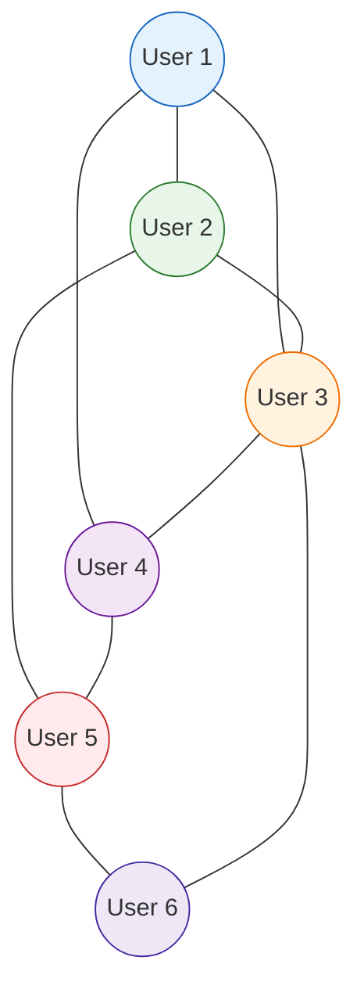

Problems:

```text
mobile connections are flaky
battery usage is high
N-to-N connections explode
hard to enforce privacy and permissions
hard to manage offline users
```

So we use a shared backend.

---

# Step 4 — Shared Backend Idea

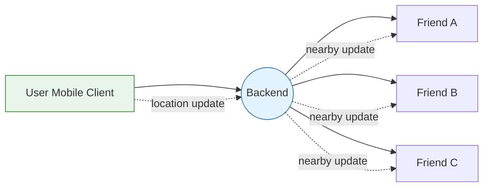

Backend responsibilities:

```text
1. Receive location updates from active users.
2. Store latest location in cache.
3. Store historical location in database.
4. Find active friends who should receive the update.
5. Push updates only when friend is within radius.
```

---

# Step 5 — High-Level Architecture

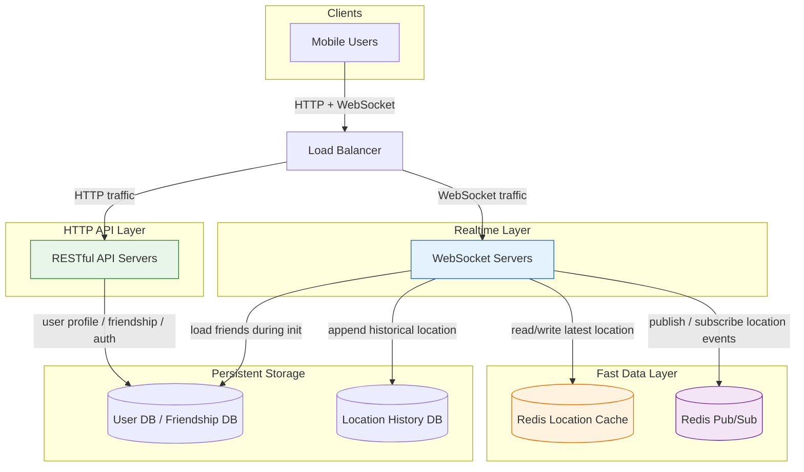

---

# Step 6 — Main Components

## Mobile Client

The mobile client:

```text
opens WebSocket connection
sends periodic location updates
receives nearby friend updates
shows distance and timestamp
handles friend add/remove callbacks
```

---

## Load Balancer

Routes:

```text
HTTP requests -> API servers
WebSocket connections -> WebSocket servers
```

For WebSocket servers, draining is important during deploy or scale-down.

---

## RESTful API Servers

Stateless servers for regular app operations:

```text
authentication
profile update
add/remove friend
friendship management
settings / opt-in state
```

---

## WebSocket Servers

Stateful servers for real-time location updates.

Responsibilities:

```text
maintain persistent client connection
receive location updates
update location cache
write location history
publish location to user's channel
subscribe to friends' channels
compute distance before forwarding
push nearby updates to client
```

---

## Redis Location Cache

Stores only the latest active location.

```text
key   = user_id
value = latitude, longitude, timestamp
TTL   = inactivity timeout, for example 10 minutes
```

When TTL expires, the user is considered inactive.

---

## Location History DB

Stores historical location events.

Example schema:

```text
user_id
latitude
longitude
timestamp
```

Good candidates:

```text
Cassandra
DynamoDB
Bigtable
sharded relational DB
```

---

## Redis Pub/Sub

Acts as a lightweight routing layer.

```text
Each user has a channel.
Friends subscribe to that user's channel.
When user location changes, backend publishes to user's channel.
Subscribers receive the update.
```

---

# Step 7 — Redis Pub/Sub Mental Model

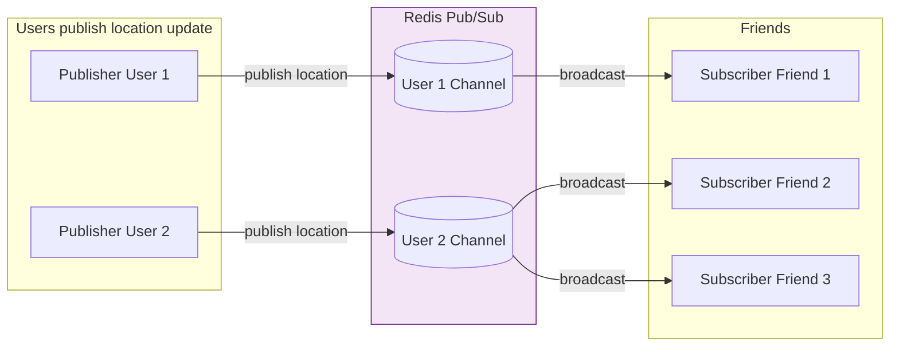

---

# Step 8 — Periodic Location Update Flow

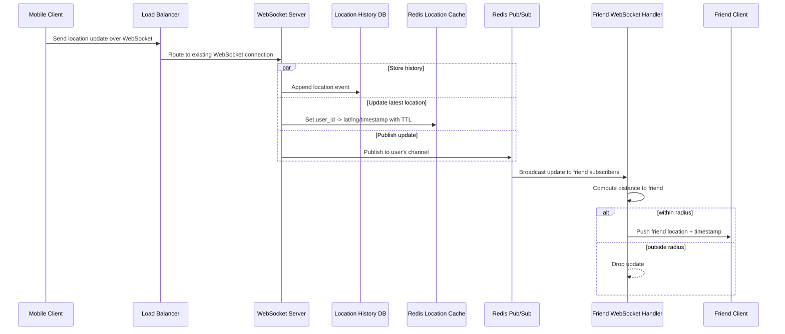

---

# Step 9 — Concrete Example

Assumptions:

```text
User 1's friends = User 2, User 3, User 4
User 5's friends = User 4, User 6
```

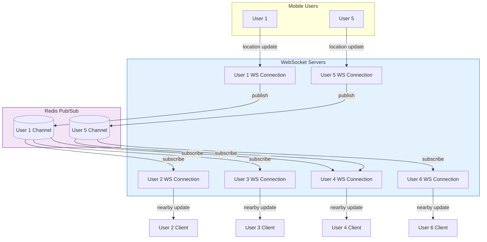

---

# Step 10 — WebSocket APIs

## 1. Periodic Location Update

Client sends:

```json
{
  "type": "LOCATION_UPDATE",
  "latitude": 37.7749,
  "longitude": -122.4194,
  "timestamp": 1710000000
}
```

Server response:

```text
No response required.
```

---

## 2. Client Receives Friend Location Update

Server sends:

```json
{
  "type": "FRIEND_LOCATION_UPDATE",
  "friendId": 12345,
  "latitude": 37.7751,
  "longitude": -122.4189,
  "distanceMiles": 0.4,
  "timestamp": 1710000005
}
```

---

## 3. WebSocket Initialization

Client sends initial location:

```json
{
  "type": "INIT",
  "latitude": 37.7749,
  "longitude": -122.4194,
  "timestamp": 1710000000
}
```

Server returns nearby active friends:

```json
{
  "type": "INIT_RESULT",
  "nearbyFriends": [
    {
      "friendId": 101,
      "name": "Alice",
      "distanceMiles": 0.8,
      "lastUpdated": 1710000000
    }
  ]
}
```

---

## 4. Subscribe to New Friend

```json
{
  "type": "SUBSCRIBE_FRIEND",
  "friendId": 777
}
```

---

## 5. Unsubscribe Removed Friend

```json
{
  "type": "UNSUBSCRIBE_FRIEND",
  "friendId": 777
}
```

---

# Step 11 — Client Initialization Flow

When the mobile app starts Nearby Friends:

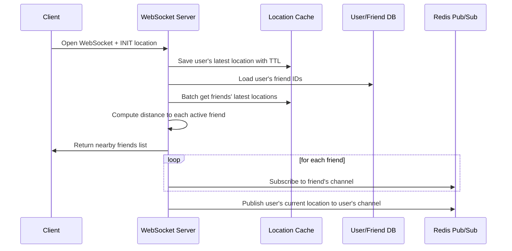

Important optimization:

```text
Subscribe to all friends' channels, active or inactive.
Inactive friends publish no events, so they consume almost no CPU.
```

---

# Step 12 — Data Model

## Location Cache

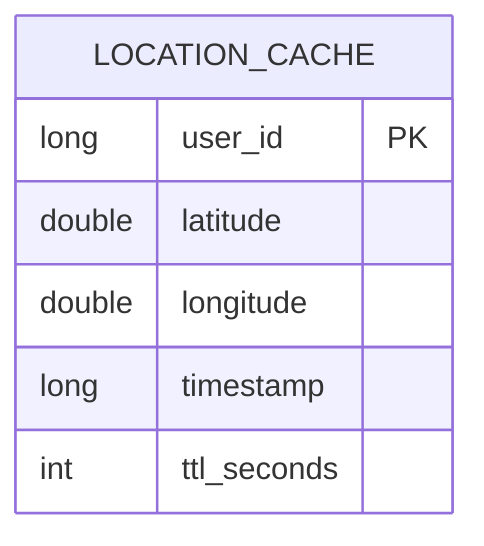

Example:

```text
key: user_id
value: { latitude, longitude, timestamp }
TTL: 10 minutes
```

---

## Location History DB

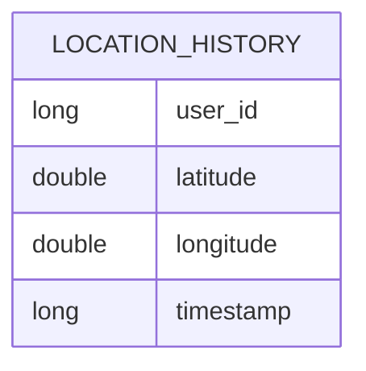

Shard key:

```text
user_id
```

Why:

```text
even distribution
simple lookup by user
high write throughput
operationally manageable
```

---

## Friendship Data

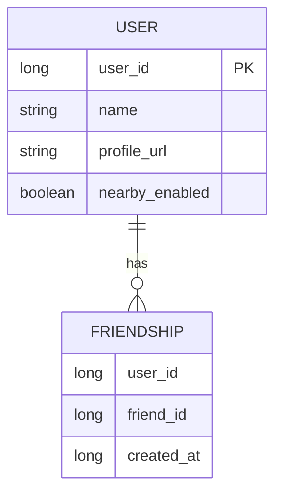

---

# Step 13 — Scaling API Servers

RESTful API servers are stateless.

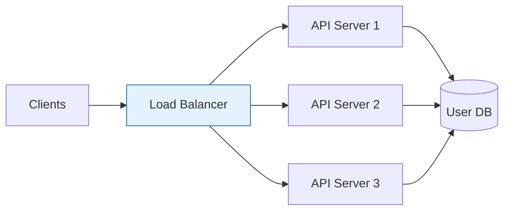

Scale by:

```text
horizontal autoscaling
CPU / memory / request-rate based scaling
multiple availability zones
stateless deployment
```

---

# Step 14 — Scaling WebSocket Servers

WebSocket servers are stateful because each connection lives on one server.

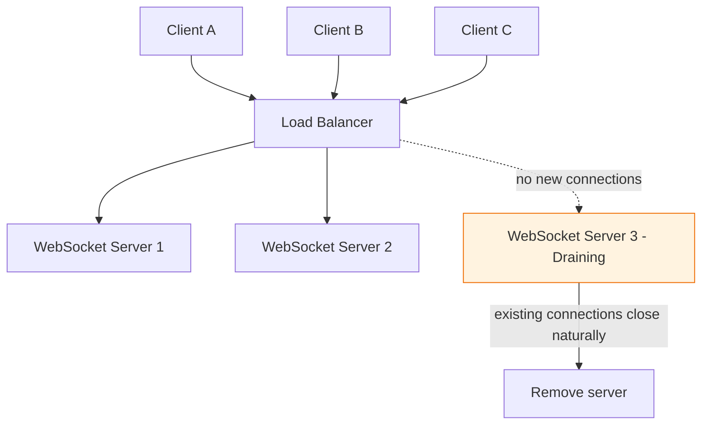

Operational rule:

```text
Before removing a WebSocket server, mark it as draining.
Do not send new connections to it.
Wait for existing connections to close.
Then remove it safely.
```

---

# Step 15 — Scaling Location Cache

At peak:

```text
10 million active users
334K writes/sec
latest location per active user only
```

One Redis server may hold the data, but QPS can be high.

Solution: shard by user ID.

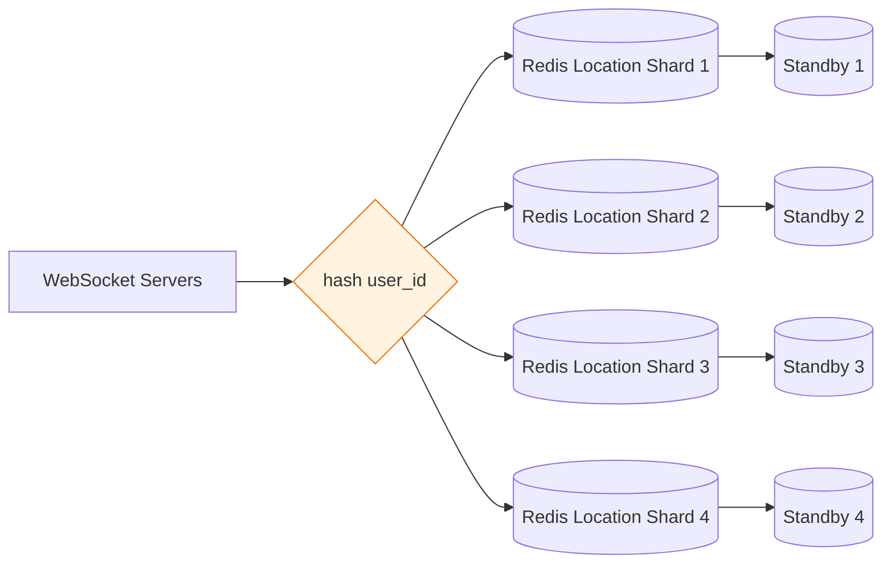

Benefits:

```text
spreads write load
simple lookup
fast failover with standby nodes
TTL removes inactive users automatically
```

---

# Step 16 — Scaling Redis Pub/Sub

Redis Pub/Sub routes location updates from one user to friends.

Potential bottleneck:

```text
CPU / network for subscriber pushes
not memory
```

Estimated forwarded updates:

```text
~14 million subscriber pushes/sec
```

Solution: distributed Redis Pub/Sub cluster with consistent hashing.

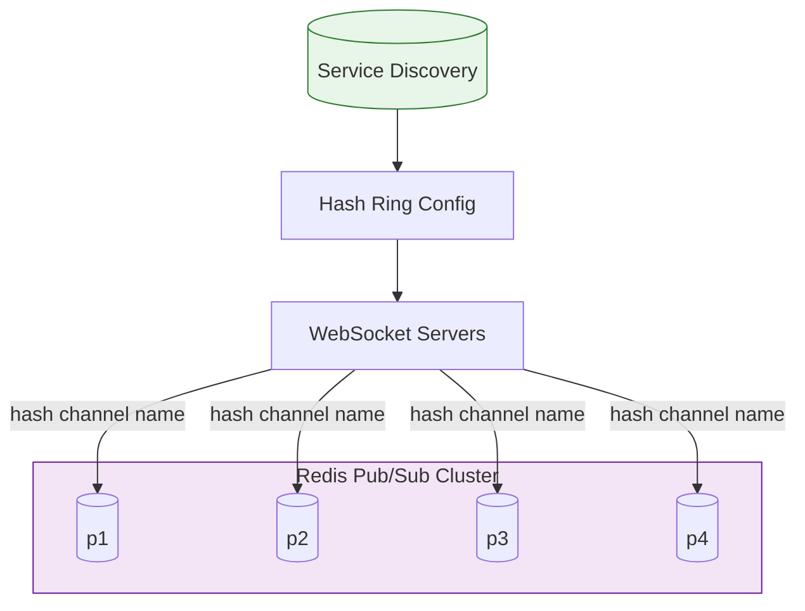

---

# Step 17 — Consistent Hashing for Pub/Sub Channels

Each user channel is assigned to a Redis Pub/Sub server.

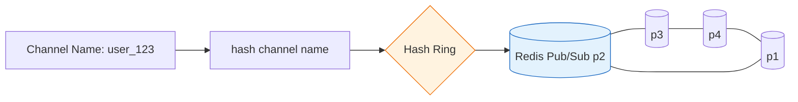

The WebSocket server keeps a local cached copy of the hash ring.

Service discovery stores the source of truth:

```text
Key: /config/pub_sub_ring
Value: ["p1", "p2", "p3", "p4"]
```

---

# Step 18 — Publish to Correct Pub/Sub Server

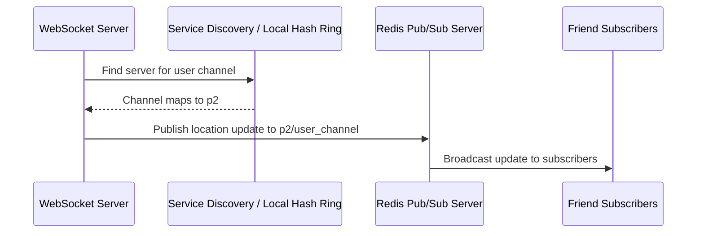

---

# Step 19 — Replacing a Pub/Sub Server

If `p1` dies, replace it with `p1_new`.

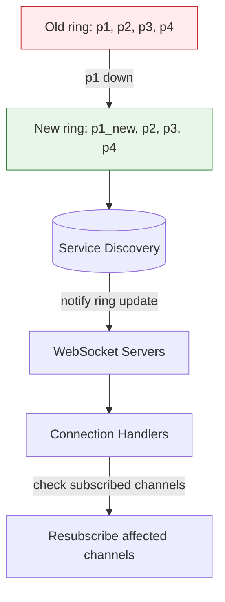

Important:

```text
Only channels on failed server need resubscription.
This is less risky than resizing the whole cluster.
```

---

# Step 20 — Adding or Removing Friends

When a friend is added:

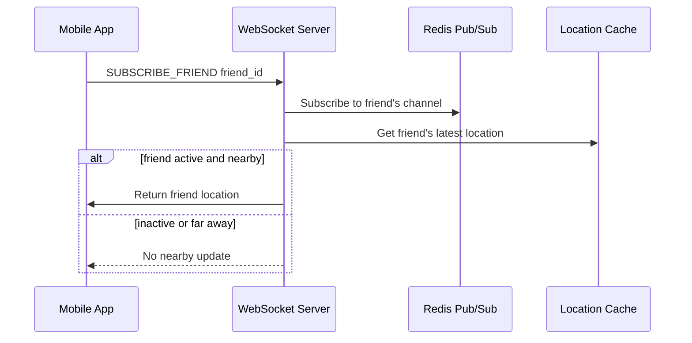

When a friend is removed:

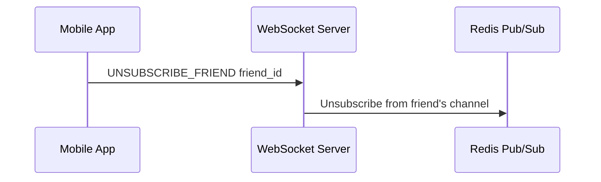

---

# Step 21 — Users With Many Friends

A user with thousands of friends may cause higher fanout.

Why it is manageable:

```text
friend count has a hard cap
friendships are bidirectional, not follower-style
subscribers are spread across many WebSocket servers
publisher channels are spread across many pub/sub servers
```

```mermaid
flowchart TB
    U[Whale User Location Update]
    C[(Whale User Channel)]

    U --> C

    C --> WS1[WebSocket Server 1]
    C --> WS2[WebSocket Server 2]
    C --> WS3[WebSocket Server 3]
    C --> WS4[WebSocket Server 4]

    WS1 --> F1[Friend Group 1]
    WS2 --> F2[Friend Group 2]
    WS3 --> F3[Friend Group 3]
    WS4 --> F4[Friend Group 4]

    style C fill:#f3e5f5,stroke:#6a1b9a
```

---

# Step 22 — Nearby Random Person Extension

If we want nearby random opted-in people, not just friends, use geohash channels.

```mermaid
flowchart LR
    subgraph Map[Map Area]
        G1[Geohash Grid A]
        G2[Geohash Grid B]
        G3[Geohash Grid C]
        G4[Geohash Grid D]
    end

    subgraph Redis[Redis Pub/Sub]
        C1[(Channel: Grid A)]
        C2[(Channel: Grid B)]
        C3[(Channel: Grid C)]
        C4[(Channel: Grid D)]
    end

    G1 --> C1
    G2 --> C2
    G3 --> C3
    G4 --> C4

    style Redis fill:#f3e5f5,stroke:#6a1b9a
```

A user subscribes to:

```text
current geohash grid
8 neighboring geohash grids
```

```mermaid
flowchart TB
    A[Neighbor NW] --- B[Neighbor N] --- C[Neighbor NE]
    D[Neighbor W] --- E[Current Grid] --- F[Neighbor E]
    G[Neighbor SW] --- H[Neighbor S] --- I[Neighbor SE]

    A --- D --- G
    B --- E --- H
    C --- F --- I

    style E fill:#e3f2fd,stroke:#1565c0
    style A fill:#e8f5e9,stroke:#2e7d32
    style B fill:#e8f5e9,stroke:#2e7d32
    style C fill:#e8f5e9,stroke:#2e7d32
    style D fill:#e8f5e9,stroke:#2e7d32
    style F fill:#e8f5e9,stroke:#2e7d32
    style G fill:#e8f5e9,stroke:#2e7d32
    style H fill:#e8f5e9,stroke:#2e7d32
    style I fill:#e8f5e9,stroke:#2e7d32
```

---

# Step 23 — Alternative: Erlang / Elixir

Redis Pub/Sub can be replaced by a distributed Erlang/Elixir system.

Why Erlang fits:

```text
very lightweight processes
millions of processes per server possible
built for distributed systems
native supervision and fault tolerance
excellent for connection-heavy real-time systems
```

Conceptual model:

```mermaid
flowchart TB
    subgraph BEAM[Erlang / Elixir Cluster]
        P1[User 1 Process]
        P2[User 2 Process]
        P3[User 3 Process]
        P4[User 4 Process]
    end

    WS[WebSocket Service] --> P1
    WS --> P2
    WS --> P3
    WS --> P4

    P1 -->|friend update| P2
    P1 -->|friend update| P3
    P1 -->|friend update| P4

    style BEAM fill:#ede7f6,stroke:#4527a0
```

Tradeoff:

```text
Technically strong option, but Erlang/Elixir expertise may be harder to hire for.
```

---

# Step 24 — Final Architecture

```mermaid
flowchart TB
    subgraph ClientLayer[Client Layer]
        C[Mobile Clients]
    end

    LB[Load Balancer]

    subgraph ApiLayer[Stateless API Layer]
        API1[API Server]
        API2[API Server]
    end

    subgraph WsLayer[Stateful WebSocket Layer]
        WS1[WebSocket Server]
        WS2[WebSocket Server]
        WS3[WebSocket Server]
    end

    subgraph DataLayer[Data Layer]
        UDB[(User / Friendship DB)]
        HDB[(Location History DB)]
        LC[(Sharded Redis Location Cache)]
    end

    subgraph RoutingLayer[Realtime Routing Layer]
        SD[(Service Discovery)]
        PS1[(Redis Pub/Sub p1)]
        PS2[(Redis Pub/Sub p2)]
        PS3[(Redis Pub/Sub p3)]
    end

    C -->|HTTP + WebSocket| LB
    LB -->|HTTP| API1
    LB -->|HTTP| API2
    LB -->|WebSocket| WS1
    LB -->|WebSocket| WS2
    LB -->|WebSocket| WS3

    API1 --> UDB
    API2 --> UDB

    WS1 --> UDB
    WS2 --> UDB
    WS3 --> UDB

    WS1 --> HDB
    WS2 --> HDB
    WS3 --> HDB

    WS1 --> LC
    WS2 --> LC
    WS3 --> LC

    SD -->|hash ring config| WS1
    SD -->|hash ring config| WS2
    SD -->|hash ring config| WS3

    WS1 --> PS1
    WS1 --> PS2
    WS2 --> PS2
    WS2 --> PS3
    WS3 --> PS1
    WS3 --> PS3

    PS1 --> WS1
    PS2 --> WS2
    PS3 --> WS3

    style WsLayer fill:#e3f2fd,stroke:#1565c0
    style RoutingLayer fill:#f3e5f5,stroke:#6a1b9a
    style DataLayer fill:#fff3e0,stroke:#ef6c00
```

---

# Step 25 — Java Code: Location Model

```java
import java.time.Instant;

public record Location(
        long userId,
        double latitude,
        double longitude,
        Instant timestamp
) {}
```

---

# Step 26 — Java Code: Distance Calculator

Uses the Haversine formula to estimate straight-line distance.

```java
public class DistanceCalculator {
    private static final double EARTH_RADIUS_MILES = 3958.8;

    public double distanceMiles(Location a, Location b) {
        double lat1 = Math.toRadians(a.latitude());
        double lat2 = Math.toRadians(b.latitude());
        double dLat = Math.toRadians(b.latitude() - a.latitude());
        double dLon = Math.toRadians(b.longitude() - a.longitude());

        double x = Math.sin(dLat / 2) * Math.sin(dLat / 2)
                + Math.cos(lat1) * Math.cos(lat2)
                * Math.sin(dLon / 2) * Math.sin(dLon / 2);

        double c = 2 * Math.atan2(Math.sqrt(x), Math.sqrt(1 - x));
        return EARTH_RADIUS_MILES * c;
    }
}
```

---

# Step 27 — Java Code: Location Cache Interface

```java
import java.util.Optional;

public interface LocationCache {
    void put(Location location, long ttlSeconds);
    Optional<Location> get(long userId);
    void remove(long userId);
}
```

---

# Step 28 — Java Code: In-Memory Location Cache Demo

This is only for learning. Production would use Redis with TTL.

```java
import java.time.Instant;
import java.util.Map;
import java.util.Optional;
import java.util.concurrent.ConcurrentHashMap;

public class InMemoryLocationCache implements LocationCache {
    private static class Entry {
        private final Location location;
        private final Instant expiresAt;

        private Entry(Location location, long ttlSeconds) {
            this.location = location;
            this.expiresAt = Instant.now().plusSeconds(ttlSeconds);
        }
    }

    private final Map<Long, Entry> store = new ConcurrentHashMap<>();

    @Override
    public void put(Location location, long ttlSeconds) {
        store.put(location.userId(), new Entry(location, ttlSeconds));
    }

    @Override
    public Optional<Location> get(long userId) {
        Entry entry = store.get(userId);
        if (entry == null) return Optional.empty();

        if (Instant.now().isAfter(entry.expiresAt)) {
            store.remove(userId);
            return Optional.empty();
        }

        return Optional.of(entry.location);
    }

    @Override
    public void remove(long userId) {
        store.remove(userId);
    }
}
```

---

# Step 29 — Java Code: Friend Service

```java
import java.util.List;

public interface FriendService {
    List<Long> getFriendIds(long userId);
}
```

Simple demo implementation:

```java
import java.util.List;
import java.util.Map;

public class StaticFriendService implements FriendService {
    private final Map<Long, List<Long>> friendships;

    public StaticFriendService(Map<Long, List<Long>> friendships) {
        this.friendships = friendships;
    }

    @Override
    public List<Long> getFriendIds(long userId) {
        return friendships.getOrDefault(userId, List.of());
    }
}
```

---

# Step 30 — Java Code: Nearby Friend DTO

```java
import java.time.Instant;

public record NearbyFriend(
        long friendId,
        double distanceMiles,
        Instant lastUpdatedAt
) {}
```

---

# Step 31 — Java Code: Nearby Friends Service

```java
import java.util.ArrayList;
import java.util.Comparator;
import java.util.List;
import java.util.Optional;

public class NearbyFriendsService {
    private final LocationCache locationCache;
    private final FriendService friendService;
    private final DistanceCalculator distanceCalculator;
    private final double nearbyRadiusMiles;

    public NearbyFriendsService(
            LocationCache locationCache,
            FriendService friendService,
            DistanceCalculator distanceCalculator,
            double nearbyRadiusMiles
    ) {
        this.locationCache = locationCache;
        this.friendService = friendService;
        this.distanceCalculator = distanceCalculator;
        this.nearbyRadiusMiles = nearbyRadiusMiles;
    }

    public List<NearbyFriend> findNearbyFriends(Location myLocation) {
        List<NearbyFriend> result = new ArrayList<>();

        for (long friendId : friendService.getFriendIds(myLocation.userId())) {
            Optional<Location> friendLocationOpt = locationCache.get(friendId);
            if (friendLocationOpt.isEmpty()) continue;

            Location friendLocation = friendLocationOpt.get();
            double distance = distanceCalculator.distanceMiles(myLocation, friendLocation);

            if (distance <= nearbyRadiusMiles) {
                result.add(new NearbyFriend(
                        friendId,
                        distance,
                        friendLocation.timestamp()
                ));
            }
        }

        result.sort(Comparator.comparingDouble(NearbyFriend::distanceMiles));
        return result;
    }
}
```

---

# Step 32 — Java Code: Pub/Sub Interface

```java
import java.util.function.Consumer;

public interface LocationPubSub {
    void publish(long userId, Location location);
    void subscribe(long userId, Consumer<Location> handler);
    void unsubscribe(long userId);
}
```

---

# Step 33 — Java Code: In-Memory Pub/Sub Demo

This simulates Redis Pub/Sub for learning.

```java
import java.util.List;
import java.util.Map;
import java.util.concurrent.ConcurrentHashMap;
import java.util.concurrent.CopyOnWriteArrayList;
import java.util.function.Consumer;

public class InMemoryLocationPubSub implements LocationPubSub {
    private final Map<Long, List<Consumer<Location>>> subscribers = new ConcurrentHashMap<>();

    @Override
    public void publish(long userId, Location location) {
        List<Consumer<Location>> handlers = subscribers.getOrDefault(userId, List.of());
        for (Consumer<Location> handler : handlers) {
            handler.accept(location);
        }
    }

    @Override
    public void subscribe(long userId, Consumer<Location> handler) {
        subscribers
                .computeIfAbsent(userId, ignored -> new CopyOnWriteArrayList<>())
                .add(handler);
    }

    @Override
    public void unsubscribe(long userId) {
        subscribers.remove(userId);
    }
}
```

---

# Step 34 — Java Code: WebSocket Handler Skeleton

```java
import java.util.List;

public class NearbyFriendsWebSocketHandler {
    private static final long LOCATION_TTL_SECONDS = 10 * 60;

    private final long userId;
    private final LocationCache locationCache;
    private final FriendService friendService;
    private final LocationPubSub pubSub;
    private final DistanceCalculator distanceCalculator;
    private final double radiusMiles;

    private Location myLatestLocation;

    public NearbyFriendsWebSocketHandler(
            long userId,
            LocationCache locationCache,
            FriendService friendService,
            LocationPubSub pubSub,
            DistanceCalculator distanceCalculator,
            double radiusMiles
    ) {
        this.userId = userId;
        this.locationCache = locationCache;
        this.friendService = friendService;
        this.pubSub = pubSub;
        this.distanceCalculator = distanceCalculator;
        this.radiusMiles = radiusMiles;
    }

    public void initialize(Location initialLocation) {
        this.myLatestLocation = initialLocation;
        locationCache.put(initialLocation, LOCATION_TTL_SECONDS);

        List<Long> friendIds = friendService.getFriendIds(userId);
        for (long friendId : friendIds) {
            pubSub.subscribe(friendId, this::onFriendLocationUpdate);
        }

        pubSub.publish(userId, initialLocation);
    }

    public void onMyLocationUpdate(Location newLocation) {
        this.myLatestLocation = newLocation;

        locationCache.put(newLocation, LOCATION_TTL_SECONDS);

        // Production: also append to location history DB asynchronously.
        pubSub.publish(userId, newLocation);
    }

    private void onFriendLocationUpdate(Location friendLocation) {
        if (myLatestLocation == null) return;

        double distance = distanceCalculator.distanceMiles(myLatestLocation, friendLocation);
        if (distance <= radiusMiles) {
            sendToClient(new NearbyFriend(
                    friendLocation.userId(),
                    distance,
                    friendLocation.timestamp()
            ));
        }
    }

    private void sendToClient(NearbyFriend nearbyFriend) {
        // Production: serialize as JSON and send through WebSocket session.
        System.out.println("Nearby friend update: " + nearbyFriend);
    }
}
```

---

# Step 35 — Java Code: Demo

```java
import java.time.Instant;
import java.util.List;
import java.util.Map;

public class NearbyFriendsDemo {
    public static void main(String[] args) {
        LocationCache cache = new InMemoryLocationCache();
        LocationPubSub pubSub = new InMemoryLocationPubSub();
        DistanceCalculator distanceCalculator = new DistanceCalculator();

        FriendService friendService = new StaticFriendService(Map.of(
                1L, List.of(2L, 3L),
                2L, List.of(1L),
                3L, List.of(1L)
        ));

        NearbyFriendsWebSocketHandler user1Handler = new NearbyFriendsWebSocketHandler(
                1L, cache, friendService, pubSub, distanceCalculator, 5.0
        );

        NearbyFriendsWebSocketHandler user2Handler = new NearbyFriendsWebSocketHandler(
                2L, cache, friendService, pubSub, distanceCalculator, 5.0
        );

        user1Handler.initialize(new Location(
                1L, 37.7749, -122.4194, Instant.now()
        ));

        user2Handler.initialize(new Location(
                2L, 37.7750, -122.4180, Instant.now()
        ));

        user2Handler.onMyLocationUpdate(new Location(
                2L, 37.7760, -122.4170, Instant.now()
        ));
    }
}
```

---

# Step 36 — Failure Handling

## WebSocket server down

```text
client reconnects
load balancer routes to another server
server reinitializes subscriptions
client may miss a few updates
```

## Redis location cache down

```text
promote standby if available
otherwise replace with empty cache
cache warms as new updates arrive
temporary missing friends are acceptable
```

## Redis Pub/Sub server down

```text
operator or automation replaces failed node
service discovery updates hash ring
WebSocket servers resubscribe affected channels
some updates may be missed briefly
```

## Location history DB slow

```text
write asynchronously
buffer in queue if needed
nearby friend feature should not block on history write
```

## Friend service unavailable

```text
existing subscriptions continue
new initialization may fail or degrade
use cached friend list if available
```

---

# Step 37 — Design Tradeoffs

## Why WebSocket?

```text
Nearby friends need near real-time server push.
WebSocket supports bidirectional persistent communication.
```

## Why Redis for latest location?

```text
only latest active location matters
TTL automatically removes inactive users
fast read/write
location cache can tolerate loss
```

## Why Redis Pub/Sub?

```text
lightweight channels
simple fanout
messages do not need durability
active friend updates are transient
```

## Why eventual consistency is okay?

```text
location changes frequently
few seconds delay is acceptable
occasional missed point is acceptable
next update arrives soon
```

---

# Step 38 — One-Minute Interview Summary

> I would design Nearby Friends using mobile clients connected to stateful WebSocket servers behind a load balancer. Clients send location updates every 30 seconds. WebSocket servers write the latest location into a sharded Redis cache with TTL, append historical locations asynchronously to a history database, and publish each update to the user's Redis Pub/Sub channel. Each active user's WebSocket handler subscribes to their friends' channels. When a friend update arrives, the handler computes distance against the user's latest location and pushes the update only if the friend is within the configured radius. API servers handle normal user and friendship operations. To scale, I would shard the location cache by user ID and distribute Pub/Sub channels across a Redis Pub/Sub cluster using consistent hashing and service discovery. Occasional missed updates are acceptable because the system is eventually consistent and updates arrive periodically.

---

# Quick Revision

```text
Core problem:
Efficiently route dynamic user location updates to active nearby friends.

Main components:
Mobile client
Load balancer
REST API servers
WebSocket servers
Redis location cache
Redis Pub/Sub
User/Friend DB
Location history DB
Service discovery

Update flow:
Client -> WebSocket -> location cache + history DB + pub/sub -> friend handlers -> distance filter -> friend clients

Scaling:
API servers are stateless.
WebSocket servers are stateful and need draining.
Location cache is sharded by user_id.
Pub/Sub channels are distributed by consistent hashing.

Best phrase:
Do not query all friends repeatedly; subscribe to friend location streams and filter updates by distance.
```
