# 19 — Design Google Maps: Visual System Design Notes

> Goal: design a simplified Google Maps backend that supports **location updates**, **navigation / ETA**, and **map rendering** for mobile users.

---

# 1. Problem Scope

Google Maps looks simple to users:

```text
Open app -> search destination -> start navigation -> see map + route + ETA
```

But internally it needs:

```text
location ingestion
map tiles
routing tiles
geocoding
route planning
shortest path service
traffic estimation
ETA prediction
adaptive rerouting
CDN delivery
offline processing pipelines
```

In this design, focus on:

```text
1. User location updates
2. Navigation service
3. ETA service
4. Map rendering
5. Traffic-aware routing
6. Scalability and availability
```

Out of scope:

```text
business places
photos
reviews
ads
street view
multi-stop optimization deep dive
```

---

# 2. Functional Requirements

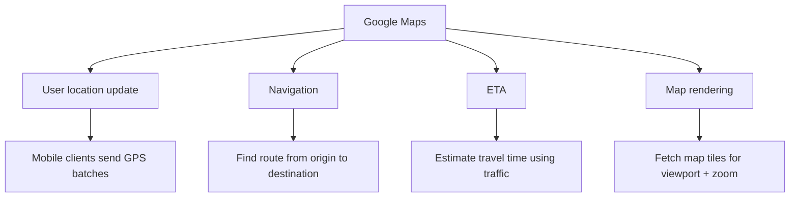

Functional requirements:

- Users can send location updates.
- Users can request directions between origin and destination.
- System returns route, distance, and ETA.
- System supports different travel modes.
- System renders map tiles smoothly on mobile.
- System considers live traffic for ETA.
- System can reroute users when traffic changes.

---

# 3. Non-Functional Requirements

| Requirement | Why It Matters |
|---|---|
| Accuracy | Wrong directions are unacceptable |
| Smooth navigation | Map should pan/zoom without jank |
| Low latency | Route and tile responses should be fast |
| Low mobile data usage | Important for mobile users |
| Low battery usage | GPS/network are expensive on phones |
| High availability | Navigation should not go down |
| Scalability | System supports very high global traffic |

Interview line:

> I will focus on location ingestion, routing/ETA, map tile delivery, and adaptive rerouting.

---

# 4. Map Basics

## 4.1 Latitude and Longitude

```text
Latitude  = north/south position
Longitude = east/west position
```

Example:

```text
Google HQ ≈ 37.423021, -122.083739
```

---

## 4.2 Map Projection

The Earth is 3D, but screens are 2D.

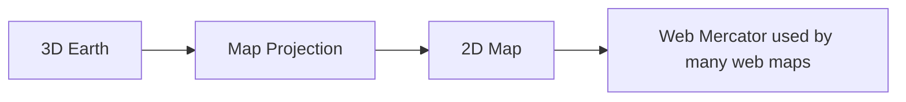

Important idea:

```text
Any projection distorts something: shape, area, distance, or direction.
```

---

## 4.3 Geocoding

Geocoding converts address text to coordinates.

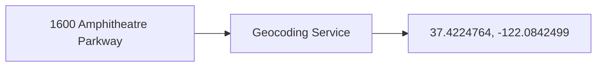

Reverse geocoding does the opposite:

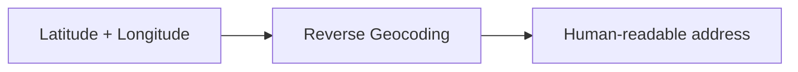

---

## 4.4 Map Tiles

Instead of downloading the whole world map, the client downloads small tiles.

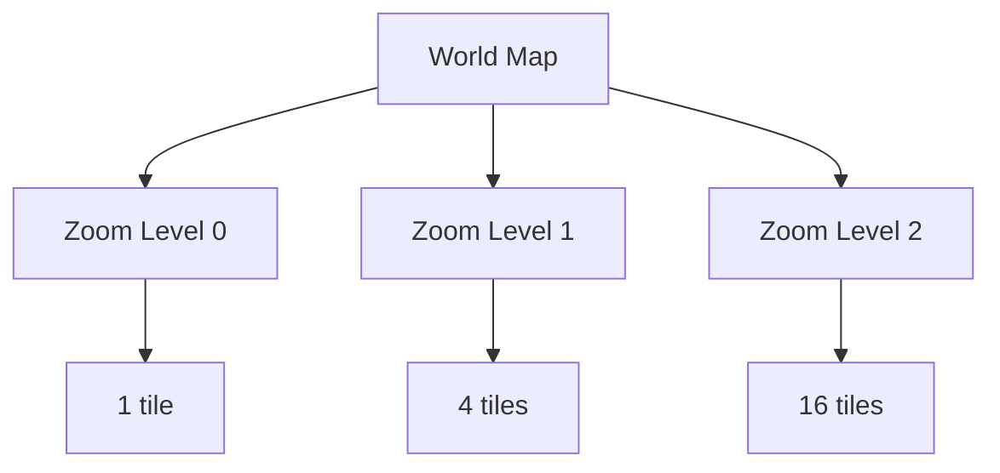

At each zoom level:

```text
number of tiles = 4^zoom
```

Tile example:

```text
https://cdn.map-provider.com/tiles/{zoom}/{x}/{y}.png
```

---

# 5. Back-of-the-Envelope Estimation

Assumptions:

```text
DAU = 1 billion
Navigation usage = 35 minutes/user/week
Total navigation = 5 billion minutes/day
Location updates batched every 15 seconds
Peak QPS = 5x average
```

## 5.1 Location Update QPS

Simple every-second GPS update:

```text
5B minutes/day * 60 = 300B updates/day
300B / 100,000 sec ≈ 3M QPS
```

Batch every 15 seconds:

```text
3M / 15 ≈ 200K QPS average
Peak ≈ 1M QPS
```

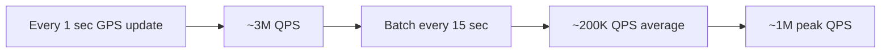

---

## 5.2 Map Tile Storage

At zoom level 21:

```text
~4.4 trillion tiles
100 KB per tile
raw upper estimate ≈ 440 PB
```

After compression/sparse natural areas:

```text
highest zoom ≈ 50 PB
all zoom levels ≈ 67 PB
round estimate ≈ 100 PB
```

Interview line:

> Map tiles are huge and static, so they should be precomputed, stored in object storage, and served through CDN.

---

# 6. High-Level Architecture

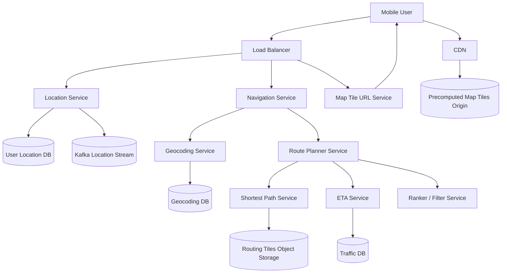

Main components:

| Component | Responsibility |
|---|---|
| Location Service | Receive batched GPS updates |
| Kafka | Stream location data to downstream systems |
| Navigation Service | Entry point for directions |
| Geocoding Service | Convert addresses to lat/lng |
| Route Planner | Coordinates shortest path, ETA, ranking |
| Shortest Path Service | Finds candidate routes using routing tiles |
| ETA Service | Predicts travel time using traffic data |
| Map Tile URL Service | Returns tile URLs for viewport/zoom |
| CDN | Serves map tiles close to users |

---

# 7. Location Service

The client records GPS frequently but sends updates in batches.

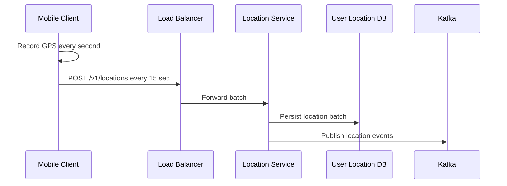

API:

```http
POST /v1/locations
```

Payload:

```json
{
  "userId": 101,
  "locations": [
    {"lat": 37.77, "lng": -122.41, "timestamp": 1710000010},
    {"lat": 37.78, "lng": -122.42, "timestamp": 1710000025}
  ],
  "mode": "DRIVING"
}
```

Why batching helps:

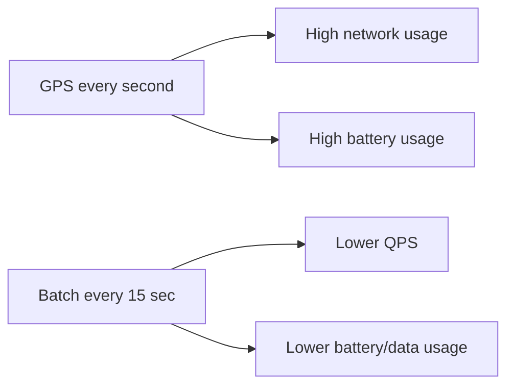

---

# 8. Location Data Model

A write-heavy database like Cassandra is a good fit.

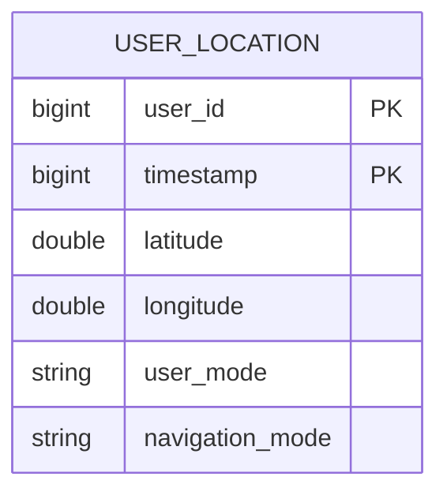

Access pattern:

```text
partition key: user_id
clustering key: timestamp
```

Benefits:

```text
- fast writes
- horizontally scalable
- efficient lookup of a user's location history
- availability preferred over strict consistency
```

---

# 9. Location Stream Consumers

Location data is useful beyond navigation.

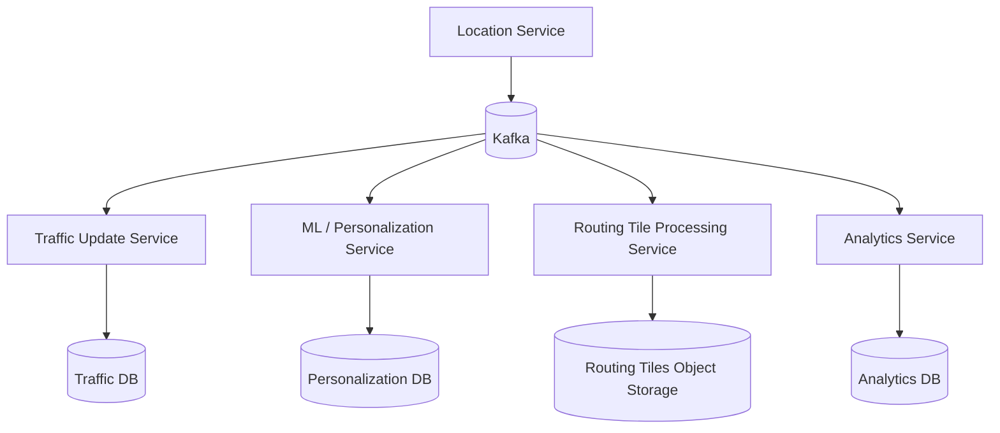

Use cases:

- Detect traffic speed.
- Detect road closures.
- Detect new roads.
- Improve ETA prediction.
- Improve personalization.
- Support analytics.

---

# 10. Map Rendering

## 10.1 Bad Option: Generate Tiles Dynamically

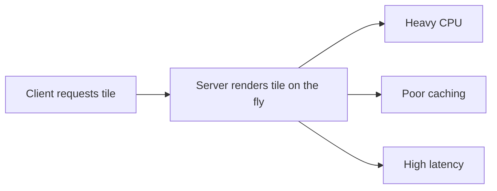

Why bad:

```text
too much server load
hard to cache
slow response
expensive at global scale
```

---

## 10.2 Better Option: Precomputed Tiles + CDN

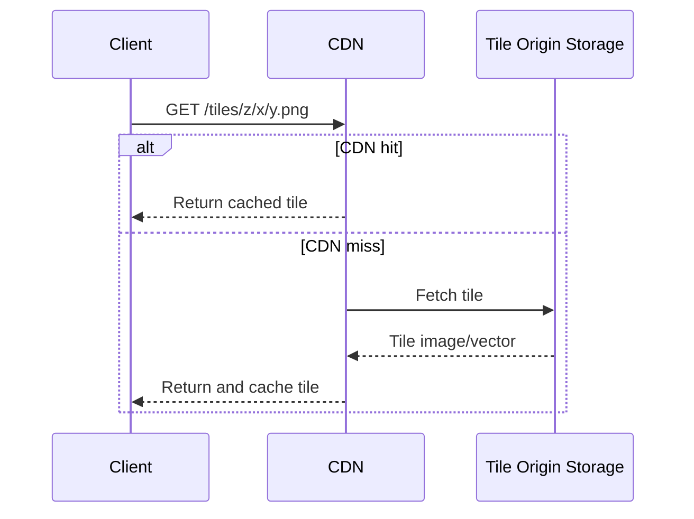

Why good:

```text
static tiles are cacheable
CDN lowers latency
origin load is reduced
client downloads only needed tiles
```

---

## 10.3 Tile URL Service Option

Instead of hardcoding tile URL calculation in every mobile app, use a service.

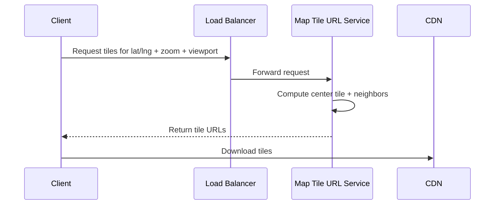

Tradeoff:

| Client-side tile calculation | Tile URL service |
|---|---|
| Lower server dependency | More operational flexibility |
| Less latency | Easier to change tile scheme |
| Harder to update mobile apps | Adds one API call |

---

# 11. Raster Tiles vs Vector Tiles

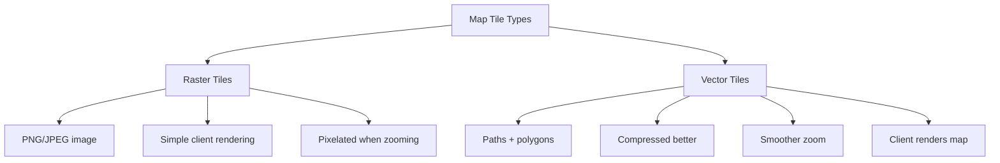

Interview line:

> Raster tiles are simpler, but vector tiles reduce bandwidth and provide smoother zooming.

---

# 12. Routing Tiles

Road data is transformed into graph tiles.

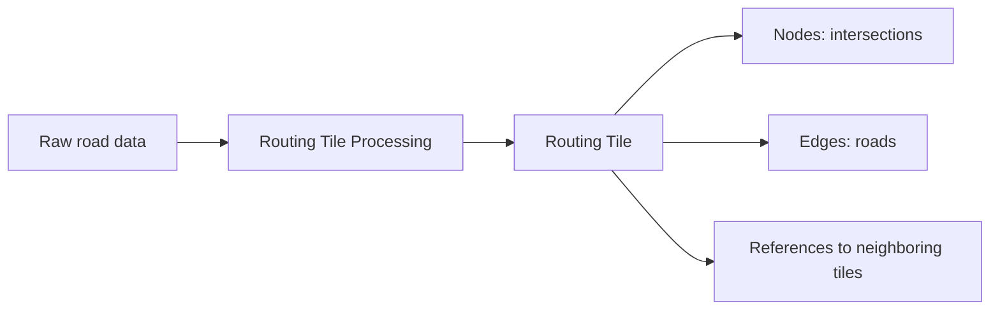

Routing tile example:

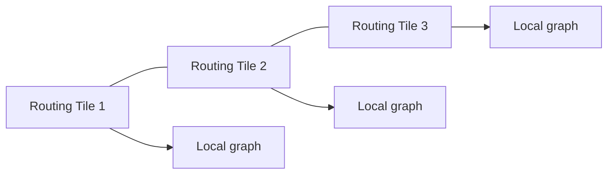

Why routing tiles:

```text
Entire world graph is too large.
Routing algorithms load only needed tiles.
Memory usage becomes manageable.
```

---

# 13. Hierarchical Routing Tiles

Different route distances need different graph detail.

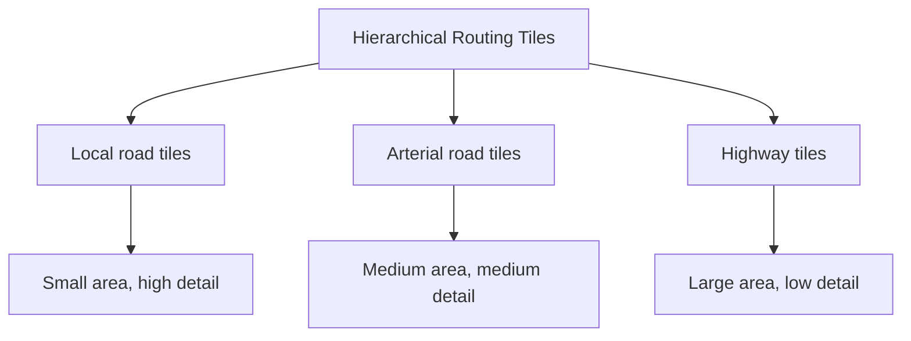

Example:

```text
Short trip: local roads only
Long trip: local roads -> highway tiles -> local roads
```

---

# 14. Navigation Service

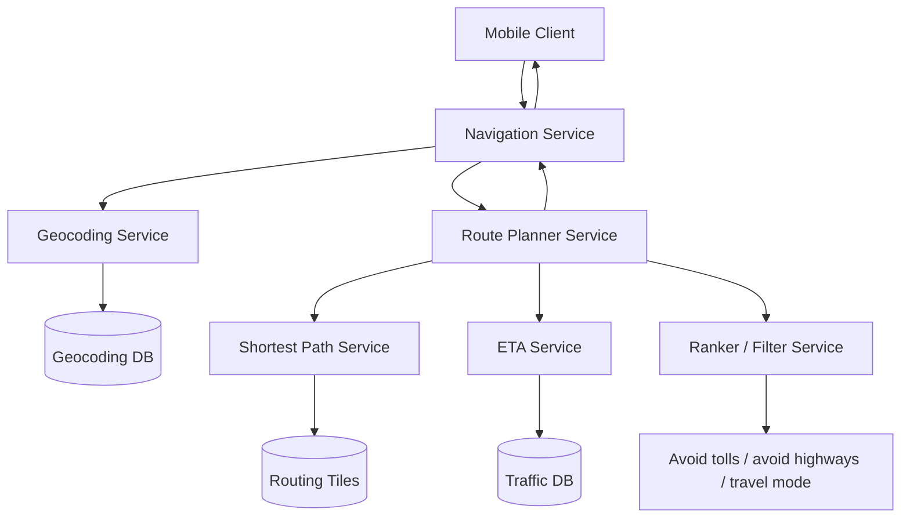

Navigation API:

```http
GET /v1/nav?origin=1355+Market+Street,SF&destination=Disneyland&mode=DRIVING
```

Response includes:

```text
route polyline
distance
duration / ETA
turn-by-turn instructions
start location
end location
travel mode
```

---

# 15. Route Planning Flow

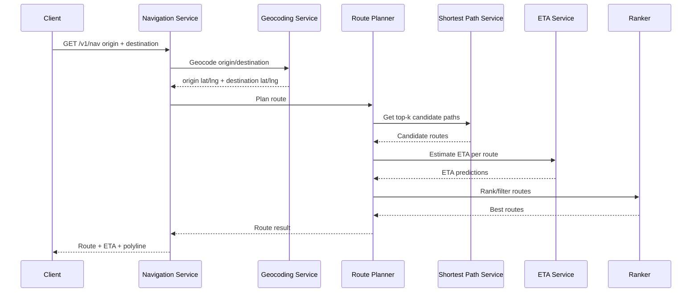

---

# 16. Shortest Path Service

Most routing algorithms are variations of:

```text
Dijkstra
A*
Contraction hierarchies
Bidirectional search
```

Simple conceptual flow:

```mermaid
flowchart TB
    A[Origin lat/lng] --> B[Find origin routing tile]
    C[Destination lat/lng] --> D[Find destination routing tile]
    B --> E[Load origin tile graph]
    D --> F[Load destination tile graph]
    E --> G[A* / Dijkstra search]
    F --> G
    G --> H[Load neighboring tiles as needed]
    H --> I[Return top-k candidate paths]
```

Important point:

> The shortest-path service should not load the entire world graph into memory.

---

# 17. ETA Service

ETA is not just distance divided by speed.

It considers:

```text
current traffic
historical traffic
road type
time of day
weather/events if available
travel mode
turn penalties
traffic prediction 10-20 minutes ahead
```

```mermaid
flowchart LR
    A[Candidate Route] --> ETA[ETA Service]
    B[Live Traffic DB] --> ETA
    C[Historical Traffic] --> ETA
    D[Road Metadata] --> ETA
    E[ML Model] --> ETA
    ETA --> F[Predicted travel time]
```

---

# 18. Adaptive ETA and Rerouting

Traffic changes during navigation.

Server must find affected active users and push updates.

Naive table:

```text
user_1 -> r1, r2, r3, r4
user_2 -> r4, r6, r9
user_3 -> r2, r8, r9
```

If traffic changes in `r2`, scanning all users is expensive.

Better index:

```mermaid
flowchart TB
    A[Traffic incident in routing tile r2] --> B[Lookup active routes containing r2]
    B --> C[Find affected users]
    C --> D[Recompute ETA]
    D --> E[Push reroute or ETA update]
```

Possible active route index:

```text
routing_tile_id -> active navigation session IDs
```

Example:

```text
r2 -> [session_1, session_3, session_9]
r4 -> [session_1, session_2]
```

---

# 19. Rerouting Push Protocol

Options:

| Protocol | Fit |
|---|---|
| Mobile push notification | Not ideal for frequent route updates |
| Long polling | Works but less efficient |
| SSE | Good one-way server push |
| WebSocket | Best if bidirectional real-time communication is useful |

Recommended:

```text
WebSocket for active navigation sessions
```

```mermaid
sequenceDiagram
    participant Traffic as Traffic Update Service
    participant Reroute as Adaptive Rerouting Service
    participant WS as WebSocket Gateway
    participant Client as Mobile Client

    Traffic->>Reroute: Traffic changed in tile r2
    Reroute->>Reroute: Find affected active sessions
    Reroute->>Reroute: Recompute ETA / alternate route
    Reroute->>WS: Push update
    WS-->>Client: New ETA or reroute suggestion
```

---

# 20. Final Architecture

```mermaid
flowchart TB
    Client[Mobile Client] --> LB[Load Balancer]

    LB --> Loc[Location Service]
    LB --> Nav[Navigation Service]
    LB --> TileURL[Map Tile URL Service]
    LB --> WS[WebSocket Gateway]

    Loc --> LocationDB[(User Location DB)]
    Loc --> Kafka[(Kafka Location Stream)]

    Kafka --> TrafficUpdate[Traffic Update Service]
    Kafka --> RoutingTileProc[Routing Tile Processing Service]
    Kafka --> Analytics[Analytics / ML]

    TrafficUpdate --> TrafficDB[(Traffic DB)]
    RoutingTileProc --> RoutingTiles[(Routing Tiles Object Storage)]

    Nav --> Geocode[Geocoding Service]
    Geocode --> GeocodeDB[(Geocoding DB)]
    Nav --> Planner[Route Planner]

    Planner --> Shortest[Shortest Path Service]
    Planner --> ETA[ETA Service]
    Planner --> Ranker[Ranker / Filters]

    Shortest --> RoutingTiles
    ETA --> TrafficDB

    TrafficDB --> Reroute[Adaptive ETA / Rerouting]
    Reroute --> ActiveRoutes[(Active Route Index)]
    Reroute --> WS

    TileURL --> Client
    Client --> CDN[CDN]
    CDN --> TileOrigin[(Precomputed Map Tiles Origin)]
```

---

# 21. Java Reference Code

## 21.1 Location Point Model

```java
import java.time.Instant;

public record LocationPoint(
        double latitude,
        double longitude,
        Instant timestamp
) {}
```

---

## 21.2 Location Batch Request

```java
import java.util.List;

public record LocationBatchRequest(
        long userId,
        String userMode,
        String navigationMode,
        List<LocationPoint> locations
) {}
```

---

## 21.3 Location Service Skeleton

```java
public class LocationService {
    private final LocationRepository locationRepository;
    private final LocationEventPublisher eventPublisher;

    public LocationService(
            LocationRepository locationRepository,
            LocationEventPublisher eventPublisher
    ) {
        this.locationRepository = locationRepository;
        this.eventPublisher = eventPublisher;
    }

    public void saveBatch(LocationBatchRequest request) {
        // 1. Persist batch to write-heavy location DB.
        locationRepository.saveAll(request.userId(), request.locations());

        // 2. Publish events to Kafka for traffic/routing/analytics consumers.
        for (LocationPoint point : request.locations()) {
            eventPublisher.publish(request.userId(), point);
        }
    }
}
```

---

## 21.4 Location Repository Interface

```java
import java.util.List;

public interface LocationRepository {
    void saveAll(long userId, List<LocationPoint> points);
}
```

---

## 21.5 Location Event Publisher Interface

```java
public interface LocationEventPublisher {
    void publish(long userId, LocationPoint point);
}
```

---

## 21.6 Tile Coordinate Model

```java
public record TileCoordinate(
        int zoom,
        int x,
        int y
) {}
```

---

## 21.7 Tile URL Service

```java
import java.util.ArrayList;
import java.util.List;

public class MapTileUrlService {
    private final String cdnBaseUrl;

    public MapTileUrlService(String cdnBaseUrl) {
        this.cdnBaseUrl = cdnBaseUrl;
    }

    public List<String> getTileUrls(double lat, double lon, int zoom) {
        TileCoordinate center = latLonToTile(lat, lon, zoom);
        List<String> urls = new ArrayList<>();

        // Return center tile plus 8 surrounding tiles.
        for (int dx = -1; dx <= 1; dx++) {
            for (int dy = -1; dy <= 1; dy++) {
                TileCoordinate tile = new TileCoordinate(
                        zoom,
                        center.x() + dx,
                        center.y() + dy
                );
                urls.add(toUrl(tile));
            }
        }
        return urls;
    }

    private String toUrl(TileCoordinate tile) {
        return cdnBaseUrl + "/tiles/"
                + tile.zoom() + "/"
                + tile.x() + "/"
                + tile.y() + ".png";
    }

    // Web Mercator tile approximation.
    private TileCoordinate latLonToTile(double lat, double lon, int zoom) {
        int n = 1 << zoom;
        int x = (int) Math.floor((lon + 180.0) / 360.0 * n);

        double latRad = Math.toRadians(lat);
        int y = (int) Math.floor(
                (1.0 - Math.log(Math.tan(latRad) + 1.0 / Math.cos(latRad)) / Math.PI)
                        / 2.0 * n
        );

        return new TileCoordinate(zoom, x, y);
    }
}
```

---

## 21.8 Navigation Request and Response

```java
public record NavigationRequest(
        String origin,
        String destination,
        TravelMode travelMode
) {}

public enum TravelMode {
    DRIVING,
    WALKING,
    CYCLING,
    TRANSIT
}

public record NavigationResponse(
        double distanceMeters,
        long durationSeconds,
        String encodedPolyline,
        String instructionSummary
) {}
```

---

## 21.9 Route Planner Skeleton

```java
import java.util.Comparator;
import java.util.List;

public class RoutePlannerService {
    private final ShortestPathService shortestPathService;
    private final EtaService etaService;

    public RoutePlannerService(
            ShortestPathService shortestPathService,
            EtaService etaService
    ) {
        this.shortestPathService = shortestPathService;
        this.etaService = etaService;
    }

    public RouteCandidate planRoute(
            LocationPoint origin,
            LocationPoint destination,
            TravelMode mode
    ) {
        List<RouteCandidate> candidates = shortestPathService.findTopKRoutes(
                origin,
                destination,
                mode,
                3
        );

        for (RouteCandidate route : candidates) {
            long eta = etaService.estimateSeconds(route, mode);
            route.setEtaSeconds(eta);
        }

        return candidates.stream()
                .min(Comparator.comparingLong(RouteCandidate::getEtaSeconds))
                .orElseThrow(() -> new IllegalStateException("No route found"));
    }
}
```

---

## 21.10 Route Candidate Model

```java
import java.util.List;

public class RouteCandidate {
    private final List<String> routingTileIds;
    private final String encodedPolyline;
    private final double distanceMeters;
    private long etaSeconds;

    public RouteCandidate(
            List<String> routingTileIds,
            String encodedPolyline,
            double distanceMeters
    ) {
        this.routingTileIds = routingTileIds;
        this.encodedPolyline = encodedPolyline;
        this.distanceMeters = distanceMeters;
    }

    public List<String> getRoutingTileIds() {
        return routingTileIds;
    }

    public String getEncodedPolyline() {
        return encodedPolyline;
    }

    public double getDistanceMeters() {
        return distanceMeters;
    }

    public long getEtaSeconds() {
        return etaSeconds;
    }

    public void setEtaSeconds(long etaSeconds) {
        this.etaSeconds = etaSeconds;
    }
}
```

---

## 21.11 Shortest Path Service Interface

```java
import java.util.List;

public interface ShortestPathService {
    List<RouteCandidate> findTopKRoutes(
            LocationPoint origin,
            LocationPoint destination,
            TravelMode mode,
            int k
    );
}
```

---

## 21.12 ETA Service Skeleton

```java
public class EtaService {
    private final TrafficRepository trafficRepository;

    public EtaService(TrafficRepository trafficRepository) {
        this.trafficRepository = trafficRepository;
    }

    public long estimateSeconds(RouteCandidate route, TravelMode mode) {
        double totalSeconds = 0;

        for (String tileId : route.getRoutingTileIds()) {
            double speedMetersPerSecond = trafficRepository.averageSpeed(tileId, mode);
            double estimatedDistanceInTile = route.getDistanceMeters()
                    / Math.max(1, route.getRoutingTileIds().size());

            totalSeconds += estimatedDistanceInTile / Math.max(speedMetersPerSecond, 1.0);
        }

        return Math.round(totalSeconds);
    }
}
```

---

## 21.13 Traffic Repository Interface

```java
public interface TrafficRepository {
    double averageSpeed(String routingTileId, TravelMode mode);
}
```

---

## 21.14 Active Route Index for Rerouting

```java
import java.util.*;
import java.util.concurrent.ConcurrentHashMap;

public class ActiveRouteIndex {
    private final Map<String, Set<String>> tileToSessionIds = new ConcurrentHashMap<>();

    public void addRoute(String sessionId, List<String> routingTileIds) {
        for (String tileId : routingTileIds) {
            tileToSessionIds
                    .computeIfAbsent(tileId, ignored -> ConcurrentHashMap.newKeySet())
                    .add(sessionId);
        }
    }

    public Set<String> findAffectedSessions(String changedRoutingTileId) {
        return tileToSessionIds.getOrDefault(changedRoutingTileId, Set.of());
    }

    public void removeRoute(String sessionId, List<String> routingTileIds) {
        for (String tileId : routingTileIds) {
            Set<String> sessions = tileToSessionIds.get(tileId);
            if (sessions != null) {
                sessions.remove(sessionId);
            }
        }
    }
}
```

---

# 22. Failure Handling

| Failure | Handling |
|---|---|
| Location service fails | Stateless; load balancer routes around it |
| Location DB write fails | Retry / buffer / degrade temporarily |
| Kafka unavailable | Buffer short-term or write to fallback log |
| CDN miss | Fetch from origin and cache |
| Tile origin unavailable | CDN serves cached tiles where possible |
| Routing tile missing | Fallback to older tile version |
| ETA service fails | Return route with degraded ETA estimate |
| Traffic DB stale | Use historical traffic fallback |
| WebSocket disconnects | Client reconnects and requests latest route state |

---

# 23. Interview Talking Points

```mermaid
mindmap
  root((Google Maps))
    Location Updates
      Batch GPS updates
      Write-heavy DB
      Kafka stream
      Traffic processing
    Map Rendering
      Precomputed tiles
      CDN
      Raster tiles
      Vector tiles
      Tile URL service
    Navigation
      Geocoding
      Routing tiles
      Shortest path
      ETA service
      Ranker filters
    Deep Dive
      Hierarchical routing tiles
      Adaptive rerouting
      Active route index
      WebSocket updates
```

---

# 24. Quick Memory Hook

```text
Location:
Client batches GPS -> Location Service -> Location DB + Kafka

Map rendering:
Client asks tile URLs -> CDN serves precomputed tiles

Navigation:
Address -> Geocoding -> Routing tiles -> Shortest path -> ETA -> Ranked route

Rerouting:
Traffic change -> affected route sessions -> recompute ETA -> push via WebSocket
```

---

# 25. One-Minute Interview Summary

> I would design Google Maps with three major paths. First, mobile clients batch GPS updates and send them to a location service, which stores them in a write-heavy location database and publishes them to Kafka. Kafka feeds traffic, analytics, ML, and routing-tile update pipelines. Second, map rendering is handled with precomputed raster or vector tiles stored in object storage and served through CDN. The client fetches only the tiles needed for its viewport and zoom level. Third, navigation uses a geocoding service to convert addresses to coordinates, then a route planner loads routing tiles and runs shortest-path algorithms to get candidate routes. An ETA service uses live and historical traffic to estimate travel time, and a ranker returns the best routes. For active navigation, an adaptive rerouting service indexes active sessions by routing tiles and pushes ETA or route changes through WebSockets.

---

# 26. Best Interview Phrase

```text
Do not model the entire world road network as one graph.
Break it into routing tiles and load only the tiles needed for a route search.
```
