# Distributed Message Queue — Detailed Visual System Design Notes

> Goal: design a distributed message queue / event-streaming style system that supports high throughput, durable storage, configurable delivery semantics, ordering within partitions, repeated consumption, and two-week retention.

---

# 1. Why Message Queues Matter

Modern systems are usually split into many independent services. A message queue sits between services so producers and consumers do not need to know each other directly.

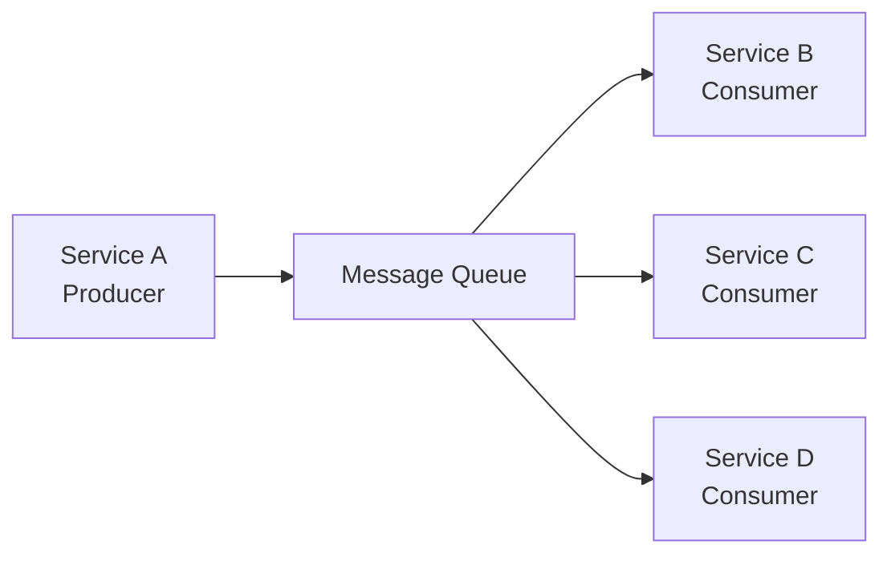

## Main Benefits

| Benefit | Explanation |
|---|---|
| Decoupling | Producers and consumers evolve independently |
| Scalability | Producers and consumers scale separately |
| Availability | If a consumer is down, producer can still write |
| Performance | Producer can write asynchronously |
| Buffering | Queue absorbs traffic spikes |
| Replay | Historical messages can be consumed again if retained |

---

# 2. Message Queue vs Event Streaming Platform

Traditional message queues and event streaming systems overlap, but their priorities differ.

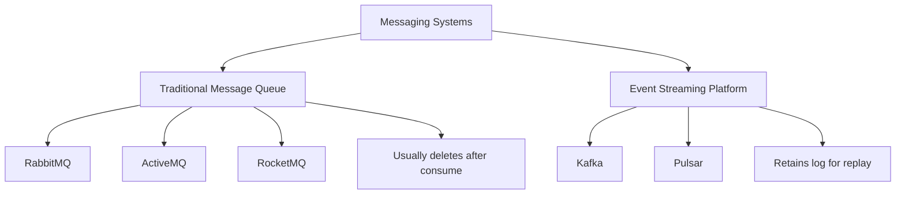

## Traditional Queue

```text
Message consumed successfully
        ↓
Message removed
```

## Event Streaming

```text
Message consumed
        ↓
Message remains until retention expires
        ↓
Other consumers can replay it
```

For this design, we build a queue with event-streaming features:

```text
durable log
repeated consumption
topic partitions
consumer groups
offset tracking
two-week retention
```

---

# 3. Requirements

## Functional Requirements

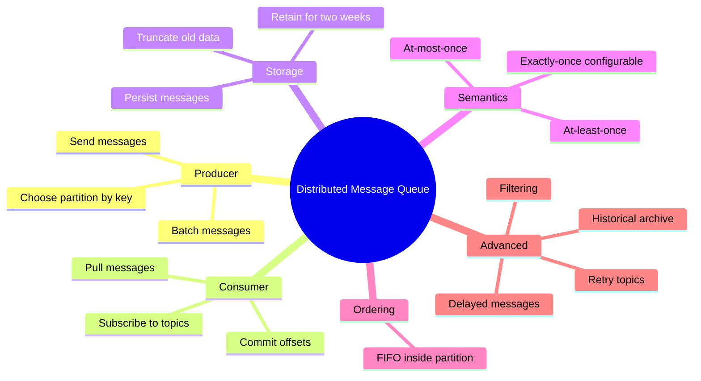

## Non-Functional Requirements

| Requirement | Meaning |
|---|---|
| High throughput | Support large ingestion volume |
| Low latency | Tunable for real-time use cases |
| Durable | Messages persisted to disk |
| Replicated | Data copied across brokers |
| Scalable | Add brokers, partitions, producers, consumers |
| Fault tolerant | Broker/consumer failure recovery |
| Ordered | Preserve order inside a partition |

---

# 4. Basic Producer–Queue–Consumer Model

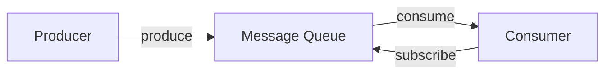

## Concept

```text
Producer writes message.
Queue stores message.
Consumer reads message.
```

The queue decouples write speed from read speed.

---

# 5. Messaging Models

## 5.1 Point-to-Point Model

One message is consumed by only one consumer.

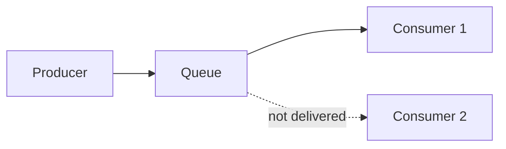

Use cases:

```text
job queues
task execution
email sending workers
background processing
```

## 5.2 Publish-Subscribe Model

One message can be consumed by multiple independent consumer groups.

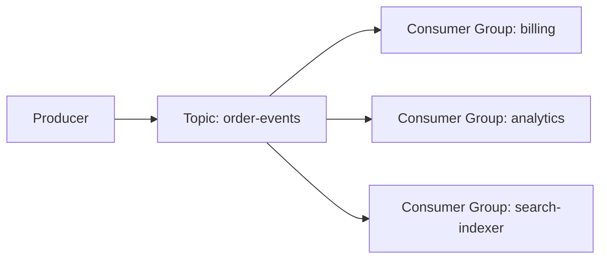

Use cases:

```text
event-driven architecture
analytics pipelines
activity streams
audit logs
```

---

# 6. Topics, Partitions, Brokers

## Topic

A topic is a named stream/category of messages.

```text
order-events
payment-events
clickstream
logs
metrics
```

## Partition

A partition is a shard of a topic. It is an append-only ordered log.

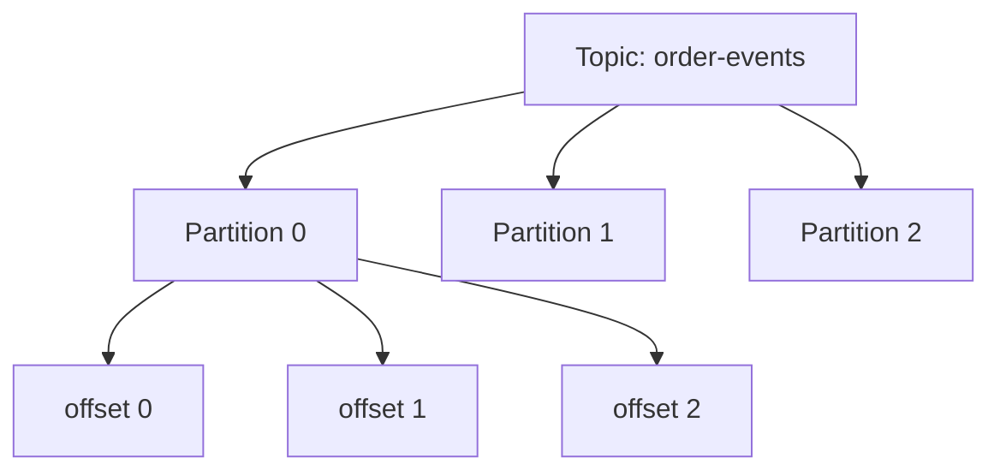

## Broker

A broker is a server that stores partitions and handles read/write requests.

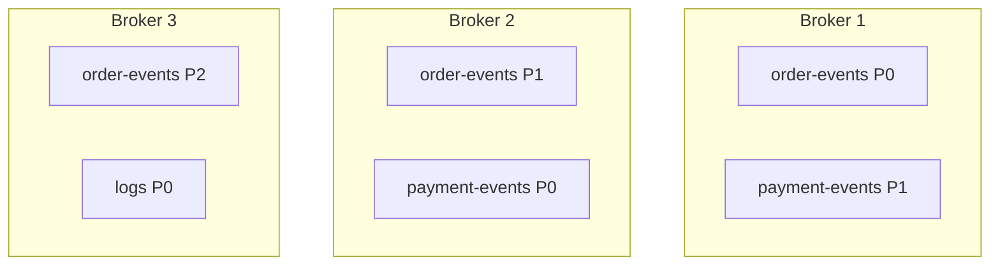

---

# 7. Ordering Rule

Ordering is guaranteed only inside one partition.

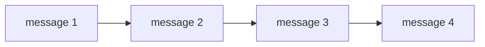

If all messages with the same business key go to the same partition, ordering is preserved for that key.

```text
same user_id → same partition
same order_id → same partition
same account_id → same partition
```

---

# 8. Partition Selection

Producer chooses a partition using a key.

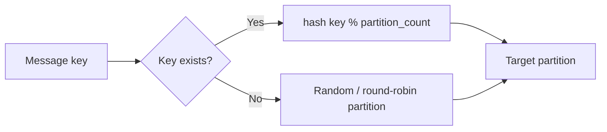

## Java: Partition Selector

```java
import java.nio.charset.StandardCharsets;
import java.util.concurrent.ThreadLocalRandom;

public class PartitionSelector {

    public int selectPartition(String key, int partitionCount) {
        if (partitionCount <= 0) {
            throw new IllegalArgumentException("partitionCount must be positive");
        }

        if (key == null || key.isBlank()) {
            return ThreadLocalRandom.current().nextInt(partitionCount);
        }

        int hash = key.hashCode() & Integer.MAX_VALUE;
        return hash % partitionCount;
    }

    public static void main(String[] args) {
        PartitionSelector selector = new PartitionSelector();

        System.out.println(selector.selectPartition("user-101", 8));
        System.out.println(selector.selectPartition("user-101", 8));
        System.out.println(selector.selectPartition(null, 8));
    }
}
```

---

# 9. Consumer Groups

A consumer group is a set of consumers working together.

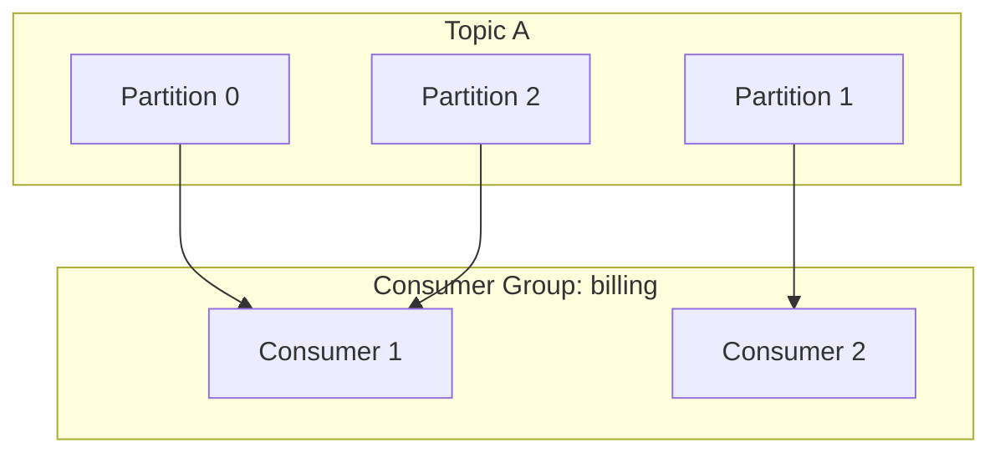

## Important Rule

Within the same consumer group:

```text
one partition can be assigned to only one consumer
```

This preserves ordering inside the partition.

## Consumer Count vs Partition Count

| Situation | Result |
|---|---|
| Consumers < partitions | Some consumers read multiple partitions |
| Consumers = partitions | One consumer per partition |
| Consumers > partitions | Extra consumers stay idle |

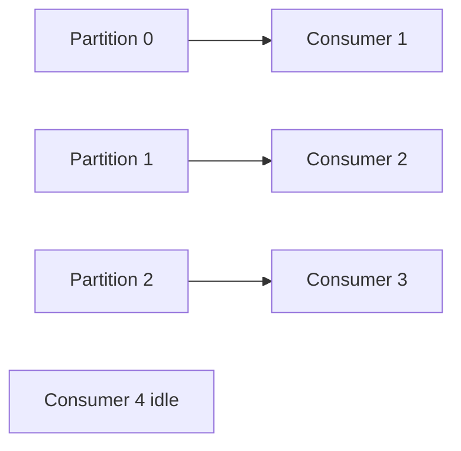

---

# 10. High-Level Architecture

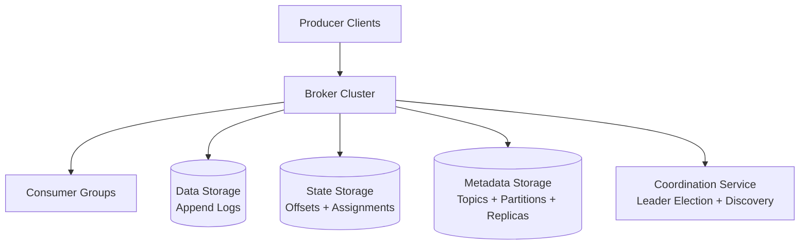

## Component Responsibilities

| Component | Responsibility |
|---|---|
| Producer client | Buffers, batches, chooses partition, sends messages |
| Broker | Stores partitions, serves produce/fetch requests |
| Consumer | Pulls messages and commits offsets |
| Consumer group coordinator | Handles membership and rebalancing |
| Metadata storage | Stores topic configs and replica plans |
| State storage | Stores committed offsets |
| Coordination service | Broker discovery and controller election |

---

# 11. Data Storage: Why WAL?

Message queue storage pattern:

```text
append-heavy
read-heavy
no in-place update
mostly sequential I/O
retention-based delete
```

A database is flexible but expensive for this pattern.

A write-ahead log is ideal because it appends sequentially.

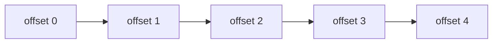

## WAL Benefits

| Benefit | Why |
|---|---|
| Sequential writes | Fast disk I/O |
| OS page cache friendly | Hot log pages stay in memory |
| Simple retention | Delete old segment files |
| Replay support | Consumers read from offsets |
| No mutation | Messages are immutable |

---

# 12. Segment Files

A partition is split into segment files.

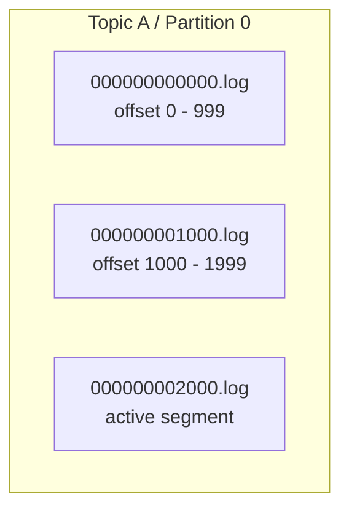

Only the active segment receives writes.

Old segments serve reads and can be deleted after retention.

## Folder Layout

```text
/data/
  topic-A/
    partition-0/
      000000000000.log
      000000001000.log
      000000002000.log
      000000000000.index
      000000001000.index
      000000002000.index
    partition-1/
      000000000000.log
      000000001000.log
```

---

# 13. Java: Message Model

```java
import java.time.Instant;
import java.util.List;

public record QueueMessage(
        byte[] key,
        byte[] value,
        String topic,
        int partition,
        long offset,
        long timestampMillis,
        int sizeBytes,
        int crc,
        List<String> tags
) {
    public static QueueMessage create(
            byte[] key,
            byte[] value,
            String topic,
            int partition,
            long offset,
            int crc,
            List<String> tags
    ) {
        return new QueueMessage(
                key,
                value,
                topic,
                partition,
                offset,
                Instant.now().toEpochMilli(),
                value == null ? 0 : value.length,
                crc,
                tags == null ? List.of() : tags
        );
    }
}
```

---

# 14. Java: Append-Only Segment Writer

This is a simplified reference version. Production systems use binary formats, indexes, checksums, page cache, fsync policies, batching, and recovery logic.

```java
import java.io.IOException;
import java.nio.ByteBuffer;
import java.nio.channels.FileChannel;
import java.nio.file.*;
import java.util.concurrent.atomic.AtomicLong;

import static java.nio.file.StandardOpenOption.*;

public class SegmentWriter implements AutoCloseable {
    private final FileChannel channel;
    private final AtomicLong nextOffset;

    public SegmentWriter(Path file, long baseOffset) throws IOException {
        Files.createDirectories(file.getParent());
        this.channel = FileChannel.open(file, CREATE, WRITE, APPEND);
        this.nextOffset = new AtomicLong(baseOffset);
    }

    public synchronized long append(byte[] payload) throws IOException {
        long offset = nextOffset.getAndIncrement();

        ByteBuffer buffer = ByteBuffer.allocate(Long.BYTES + Integer.BYTES + payload.length);
        buffer.putLong(offset);
        buffer.putInt(payload.length);
        buffer.put(payload);
        buffer.flip();

        while (buffer.hasRemaining()) {
            channel.write(buffer);
        }

        return offset;
    }

    public void flush() throws IOException {
        channel.force(false);
    }

    @Override
    public void close() throws IOException {
        channel.close();
    }
}
```

---

# 15. Producer Flow

## Better Design: Routing and Buffering in Producer Client

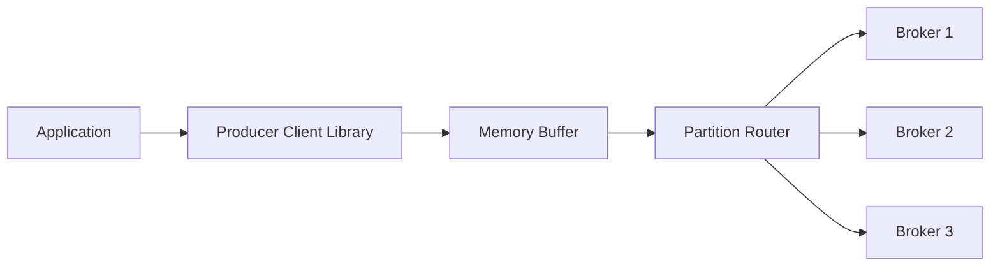

## Produce Sequence

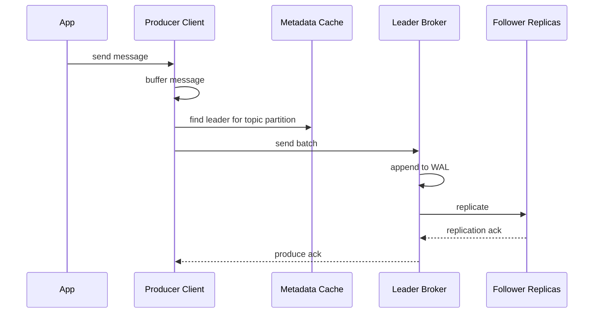

## Why Producer-Side Buffering?

| Benefit | Explanation |
|---|---|
| Fewer network calls | Send batch instead of single messages |
| Higher throughput | Larger sequential disk writes |
| Lower broker overhead | Fewer requests to process |
| Tunable latency | Smaller batch for low latency, bigger batch for throughput |

---

# 16. Java: Buffered Producer

```java
import java.nio.charset.StandardCharsets;
import java.util.ArrayList;
import java.util.List;

public class BufferedProducer {
    private final int maxBatchSize;
    private final BrokerClient brokerClient;
    private final PartitionSelector partitionSelector;
    private final List<QueueMessage> buffer = new ArrayList<>();

    public BufferedProducer(int maxBatchSize, BrokerClient brokerClient) {
        this.maxBatchSize = maxBatchSize;
        this.brokerClient = brokerClient;
        this.partitionSelector = new PartitionSelector();
    }

    public synchronized void send(String topic, String key, String value, int partitionCount) {
        int partition = partitionSelector.selectPartition(key, partitionCount);

        QueueMessage message = QueueMessage.create(
                key == null ? null : key.getBytes(StandardCharsets.UTF_8),
                value.getBytes(StandardCharsets.UTF_8),
                topic,
                partition,
                -1,
                0,
                List.of()
        );

        buffer.add(message);

        if (buffer.size() >= maxBatchSize) {
            flush();
        }
    }

    public synchronized void flush() {
        if (buffer.isEmpty()) return;

        brokerClient.sendBatch(List.copyOf(buffer));
        buffer.clear();
    }
}

interface BrokerClient {
    void sendBatch(List<QueueMessage> messages);
}
```

---

# 17. Batch Size Tradeoff

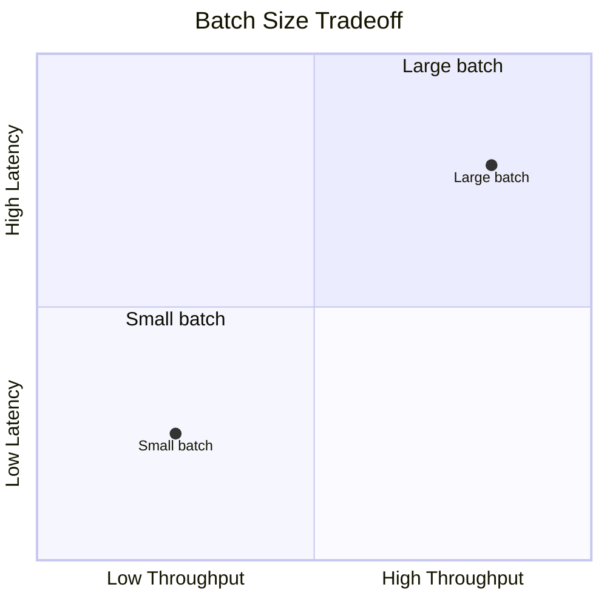

## Mental Model

```text
Small batch → low latency, lower throughput
Large batch → high throughput, higher latency
```

---

# 18. Consumer Pull Model

Most distributed queues prefer pull.

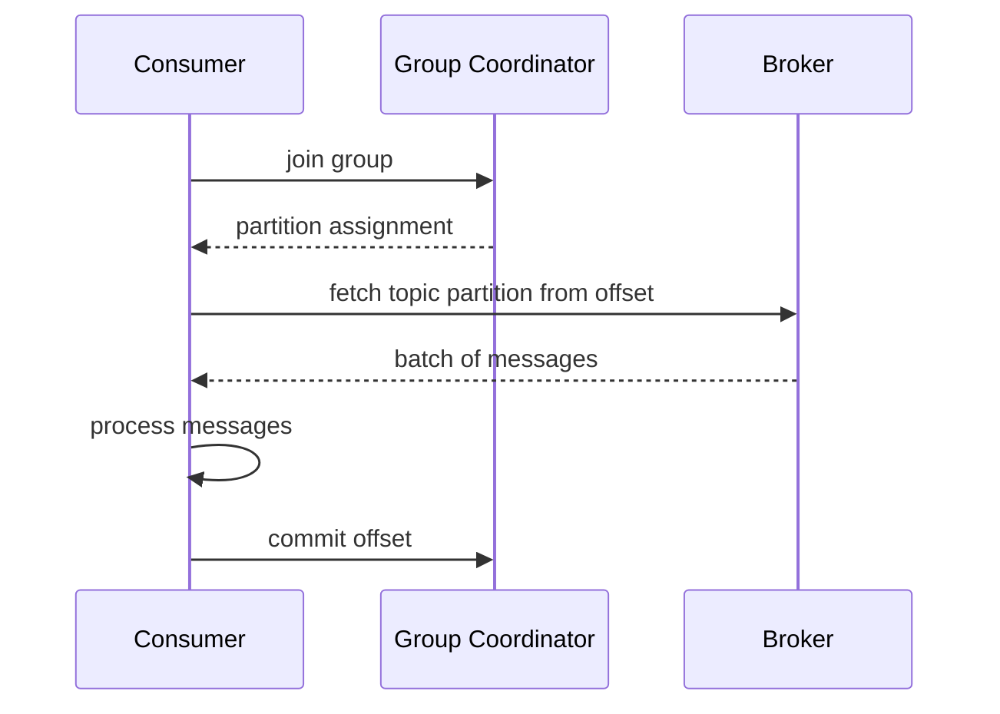

## Pull vs Push

| Model | Pros | Cons |
|---|---|---|
| Push | Low latency | Can overwhelm slow consumers |
| Pull | Consumer controls rate, good batching | Needs long polling to avoid empty fetch waste |

---

# 19. Java: Consumer Poll Loop

```java
import java.util.List;

public class PullConsumer {
    private final String groupId;
    private final String topic;
    private final BrokerFetchClient broker;
    private final OffsetStore offsetStore;

    public PullConsumer(String groupId, String topic, BrokerFetchClient broker, OffsetStore offsetStore) {
        this.groupId = groupId;
        this.topic = topic;
        this.broker = broker;
        this.offsetStore = offsetStore;
    }

    public void pollLoop(int partition) {
        while (true) {
            long offset = offsetStore.getCommittedOffset(groupId, topic, partition) + 1;

            List<QueueMessage> messages = broker.fetch(topic, partition, offset, 100);

            for (QueueMessage message : messages) {
                process(message);
                offsetStore.commit(groupId, topic, partition, message.offset());
            }

            if (messages.isEmpty()) {
                sleep(500);
            }
        }
    }

    private void process(QueueMessage message) {
        System.out.println("Consumed offset " + message.offset());
    }

    private void sleep(long millis) {
        try {
            Thread.sleep(millis);
        } catch (InterruptedException e) {
            Thread.currentThread().interrupt();
        }
    }
}

interface BrokerFetchClient {
    List<QueueMessage> fetch(String topic, int partition, long offset, int maxMessages);
}

interface OffsetStore {
    long getCommittedOffset(String groupId, String topic, int partition);
    void commit(String groupId, String topic, int partition, long offset);
}
```

---

# 20. Consumer Rebalancing

Rebalancing happens when:

```text
consumer joins
consumer leaves
consumer crashes
partition count changes
```

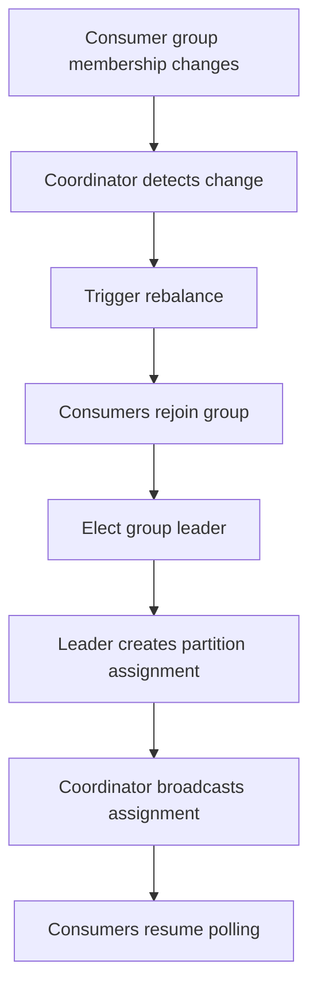

---

# 21. Rebalance: New Consumer Joins

```mermaid
sequenceDiagram
    participant A as Consumer A
    participant B as Consumer B
    participant C as Coordinator

    A->>C: heartbeat
    C-->>A: ok

    B->>C: JoinGroup
    C-->>B: group is rebalancing

    A->>C: heartbeat
    C-->>A: rejoin required

    A->>C: JoinGroup
    B->>C: JoinGroup

    C-->>B: elected leader
    C-->>A: follower

    B->>C: assignment plan
    C-->>A: partitions 1 and 3
    C-->>B: partitions 2 and 4
```

---

# 22. Rebalance: Consumer Leaves

```mermaid
sequenceDiagram
    participant A as Consumer A
    participant B as Consumer B
    participant C as Coordinator

    A->>C: heartbeat
    B->>C: heartbeat
    C-->>A: ok
    C-->>B: ok

    A->>C: LeaveGroup
    C-->>A: goodbye

    B->>C: heartbeat
    C-->>B: rejoin required

    B->>C: JoinGroup
    C-->>B: leader
    B->>C: new assignment plan
    C-->>B: all partitions
```

---

# 23. Rebalance: Consumer Crashes

```mermaid
sequenceDiagram
    participant A as Consumer A
    participant B as Consumer B
    participant C as Coordinator

    A->>C: heartbeat
    B->>C: heartbeat
    C-->>A: ok
    C-->>B: ok

    Note over A,C: Consumer A crashes, no heartbeat

    C->>C: heartbeat timeout
    B->>C: heartbeat
    C-->>B: rejoin required

    B->>C: JoinGroup
    C-->>B: leader
    B->>C: new assignment plan
    C-->>B: reassigned partitions
```

---

# 24. State Storage

State storage keeps consumer progress.

```mermaid
erDiagram
    CONSUMER_OFFSET {
        string group_id
        string topic
        int partition
        long committed_offset
        timestamp updated_at
    }
```

## Example

```text
group billing, topic order-events, partition 0 → offset 1205
group analytics, topic order-events, partition 0 → offset 900
```

Each consumer group has its own offset.

---

# 25. Metadata Storage

Metadata storage keeps cluster configuration.

```mermaid
erDiagram
    TOPIC {
        string name
        int partition_count
        int replication_factor
        string retention_policy
    }

    PARTITION_REPLICA {
        string topic
        int partition
        int broker_id
        boolean leader
        boolean in_sync
    }

    TOPIC ||--o{ PARTITION_REPLICA : has
```

Metadata examples:

```text
topic config
partition count
replication factor
retention period
leader replica
follower replicas
ISR list
```

---

# 26. Coordination Service

ZooKeeper/etcd-style coordination supports:

```text
broker discovery
leader election
cluster membership
controller election
metadata change notification
```

```mermaid
flowchart TB
    Coord[Coordination Service] --> A[Broker discovery]
    Coord --> B[Controller election]
    Coord --> C[Metadata watch]
    Coord --> D[Cluster membership]
    Coord --> E[Failure detection]
```

---

# 27. Replication

Each partition has multiple replicas.

```mermaid
flowchart LR
    Producer --> Leader[Leader Replica]
    Leader --> F1[Follower Replica 1]
    Leader --> F2[Follower Replica 2]
```

## Replica Roles

| Role | Responsibility |
|---|---|
| Leader | Handles producer writes and consumer reads |
| Follower | Pulls data from leader |
| Controller | Chooses leaders and replica placement |

---

# 28. In-Sync Replicas (ISR)

ISR means replicas that are close enough to the leader.

```mermaid
flowchart TB
    L[Leader<br/>offset 15] --> R2[Replica 2<br/>offset 15<br/>ISR]
    L --> R3[Replica 3<br/>offset 14<br/>ISR]
    L -. lag too high .-> R4[Replica 4<br/>offset 11<br/>Not ISR]

    C[Committed offset = 13]
```

## Why ISR Exists

ISR balances:

```text
durability
latency
availability
```

If we wait for every replica, one slow replica can slow the whole partition.

---

# 29. ACK Modes

## ACK = 0

Producer does not wait for broker acknowledgement.

```mermaid
sequenceDiagram
    participant P as Producer
    participant L as Leader Broker

    P->>L: send message
    Note over P,L: no ack, no retry
```

Best for:

```text
metrics
logs
loss-tolerant telemetry
```

## ACK = 1

Producer waits for leader write only.

```mermaid
sequenceDiagram
    participant P as Producer
    participant L as Leader
    participant F as Follower

    P->>L: send message
    L->>L: append to WAL
    L-->>P: ack
    L->>F: replicate async
```

Best for:

```text
low latency systems
some data loss acceptable
```

## ACK = ALL

Producer waits for all required ISR replicas.

```mermaid
sequenceDiagram
    participant P as Producer
    participant L as Leader
    participant F1 as Follower 1
    participant F2 as Follower 2

    P->>L: send message
    L->>L: append to WAL
    L->>F1: replicate
    L->>F2: replicate
    F1-->>L: ack
    F2-->>L: ack
    L-->>P: ack
```

Best for:

```text
payments
orders
critical events
```

---

# 30. Delivery Semantics

## 30.1 At-Most-Once

```mermaid
flowchart LR
    P[Producer<br/>ack=0 no retry] --> Q[Queue]
    Q --> C[Consumer<br/>commit before process]
```

Meaning:

```text
No duplicates.
Messages may be lost.
```

## 30.2 At-Least-Once

```mermaid
flowchart LR
    P[Producer<br/>retry until ack] --> Q[Queue]
    Q --> C[Consumer<br/>process then commit]
    C -. crash before commit .-> Q
```

Meaning:

```text
No loss.
Duplicates possible.
Consumer should be idempotent.
```

## 30.3 Exactly-Once

```mermaid
flowchart LR
    P[Idempotent Producer] --> Q[Transactional Queue]
    Q --> C[Transactional Consumer]
    C --> D[Idempotent Sink / Transactional Sink]
```

Meaning:

```text
No loss.
No duplicates.
Highest complexity.
```

---

# 31. Java: Idempotent Consumer Pattern

At-least-once delivery often requires consumer-side deduplication.

```java
import java.util.HashSet;
import java.util.Set;

public class IdempotentOrderConsumer {
    private final Set<String> processedMessageIds = new HashSet<>();

    public void consume(String messageId, String payload) {
        if (processedMessageIds.contains(messageId)) {
            System.out.println("Duplicate ignored: " + messageId);
            return;
        }

        processBusinessLogic(payload);
        processedMessageIds.add(messageId);
    }

    private void processBusinessLogic(String payload) {
        System.out.println("Processing payload: " + payload);
    }
}
```

Production version:

```text
processed message IDs should be stored in a durable database
use unique constraint on message_id
commit offset after successful business transaction
```

---

# 32. Broker Failure Recovery

If a broker crashes, leaders must move and missing replicas must be recreated.

```mermaid
flowchart TB
    A[Broker failure detected] --> B[Controller updates metadata]
    B --> C[Elect new leaders from ISR]
    C --> D[Route producers to new leaders]
    D --> E[Create replacement replicas]
    E --> F[New replicas catch up]
    F --> G[ISR restored]
```

## Failure Example

```mermaid
flowchart LR
    B1[Broker 1<br/>Topic A P0 leader]
    B2[Broker 2<br/>Topic A P0 follower]
    B3[Broker 3<br/>Topic A P0 follower<br/>FAILED]
    B4[Broker 4<br/>New follower]

    B1 --> B2
    B1 --> B4
```

---

# 33. Adding a Broker Safely

```mermaid
flowchart TB
    A[Add Broker 4] --> B[Controller updates replica plan]
    B --> C[Broker 4 creates new follower replica]
    C --> D[Broker 4 catches up from leader]
    D --> E[Remove old extra replica if needed]
    E --> F[Cluster balanced]
```

Key idea:

```text
Add new replica first.
Wait until it catches up.
Then remove old replica.
```

This avoids data loss.

---

# 34. Scaling Partitions

## Increasing Partitions

```mermaid
flowchart TB
    A[Topic has 2 partitions] --> B[Add partition 3]
    B --> C[Old messages stay in old partitions]
    C --> D[New messages distributed across 3 partitions]
    D --> E[Consumer group rebalances]
```

Easy because old data does not need migration.

## Decreasing Partitions

```mermaid
flowchart TB
    A[Partition 3 decommissioned] --> B[Producers stop writing to partition 3]
    B --> C[Consumers may still read old data]
    C --> D[Wait until retention expires]
    D --> E[Delete partition data]
    E --> F[Rebalance consumers]
```

Harder because old data must remain until retention expires.

---

# 35. Retention and Truncation

Messages are retained by:

```text
time
size
both
```

```mermaid
flowchart LR
    S1[Old Segment<br/>expired] --> D[Delete]
    S2[Recent Segment] --> K[Keep]
    S3[Active Segment] --> W[Write]
```

Example:

```text
retention = 14 days
segment older than 14 days → delete
```

---

# 36. Message Filtering by Tags

Filtering should use metadata, not payload.

```mermaid
flowchart LR
    C[Consumer subscribes<br/>tag = refund] --> B[Broker]
    B --> F[Tag Filter]
    F --> M1[refund message]
    F -. drop .-> M2[shipment message]
```

## Java: Tag Filter

```java
import java.util.List;
import java.util.Set;

public class TagFilter {

    public boolean matches(QueueMessage message, Set<String> subscribedTags) {
        if (subscribedTags == null || subscribedTags.isEmpty()) {
            return true;
        }

        List<String> messageTags = message.tags();
        for (String tag : messageTags) {
            if (subscribedTags.contains(tag)) {
                return true;
            }
        }
        return false;
    }
}
```

---

# 37. Delayed Messages

Delayed messages are not delivered immediately.

```mermaid
flowchart LR
    Producer --> D[Delay Storage]
    D -->|time reached| T[Real Topic]
    T --> Consumer
```

Use cases:

```text
close unpaid order after 30 minutes
retry failed operation after 5 minutes
send scheduled notification
```

## Delay Queue Options

| Option | Explanation |
|---|---|
| Delay levels | Predefined delays like 1s, 5s, 1m, 30m |
| Time wheel | Efficient scheduler for many delayed messages |
| Delayed topic | Store delayed messages in internal topics |

---

# 38. Java: Simple Delay Scheduler

```java
import java.time.Instant;
import java.util.PriorityQueue;

record DelayedMessage(
        QueueMessage message,
        long deliverAtMillis
) {}

public class DelayScheduler {
    private final PriorityQueue<DelayedMessage> queue =
            new PriorityQueue<>((a, b) -> Long.compare(a.deliverAtMillis(), b.deliverAtMillis()));

    public void schedule(QueueMessage message, long delayMillis) {
        queue.offer(new DelayedMessage(
                message,
                Instant.now().toEpochMilli() + delayMillis
        ));
    }

    public QueueMessage pollReady() {
        DelayedMessage next = queue.peek();

        if (next == null) {
            return null;
        }

        if (next.deliverAtMillis() <= Instant.now().toEpochMilli()) {
            return queue.poll().message();
        }

        return null;
    }
}
```

---

# 39. Retry Topics

Failed messages should not block the main topic.

```mermaid
flowchart LR
    Main[Main Topic] --> Consumer
    Consumer -->|failed| Retry[Retry Topic]
    Retry -->|delay| Consumer
    Consumer -->|failed too many times| DLQ[Dead Letter Queue]
```

## Retry Strategy

```text
main topic
  ↓
consumer fails
  ↓
retry topic with delay
  ↓
consumer retries
  ↓
dead letter queue after max attempts
```

---

# 40. Historical Archive

If retention is only two weeks, old messages may be archived.

```mermaid
flowchart LR
    Broker[Broker Segments] -->|retention expires| Archive[Object Storage / HDFS]
    Archive --> Replay[Historical Replay Job]
```

Use cases:

```text
compliance
audit
offline analytics
consumer recovery after long outage
```

---

# 41. Protocol Design

A queue protocol should support:

```text
produce
fetch
commit offset
heartbeat
join group
leave group
sync group
metadata request
leader update
```

```mermaid
flowchart TB
    Protocol[Message Queue Protocol] --> Produce[Produce Request]
    Protocol --> Fetch[Fetch Request]
    Protocol --> Commit[Offset Commit]
    Protocol --> Heartbeat[Heartbeat]
    Protocol --> Group[Join / Sync / Leave Group]
    Protocol --> Metadata[Metadata Request]
```

---

# 42. Small End-to-End Java Demo

This is a tiny in-memory simulation to understand the concept. It is not distributed and not production-ready.

```java
import java.util.*;
import java.util.concurrent.ConcurrentHashMap;

class InMemoryPartition {
    private final List<String> log = new ArrayList<>();

    public synchronized long append(String value) {
        log.add(value);
        return log.size() - 1;
    }

    public synchronized List<String> fetch(long offset, int max) {
        List<String> result = new ArrayList<>();

        for (long i = offset; i < log.size() && result.size() < max; i++) {
            result.add(log.get((int) i));
        }

        return result;
    }
}

class InMemoryTopic {
    private final List<InMemoryPartition> partitions;

    InMemoryTopic(int partitionCount) {
        partitions = new ArrayList<>();
        for (int i = 0; i < partitionCount; i++) {
            partitions.add(new InMemoryPartition());
        }
    }

    public long publish(String key, String value) {
        int partition = Math.abs(key.hashCode()) % partitions.size();
        return partitions.get(partition).append(value);
    }

    public List<String> consume(int partition, long offset, int max) {
        return partitions.get(partition).fetch(offset, max);
    }
}

public class MiniQueueDemo {
    public static void main(String[] args) {
        InMemoryTopic topic = new InMemoryTopic(3);

        topic.publish("user-1", "order-created");
        topic.publish("user-1", "order-paid");
        topic.publish("user-2", "order-cancelled");

        System.out.println(topic.consume(0, 0, 10));
        System.out.println(topic.consume(1, 0, 10));
        System.out.println(topic.consume(2, 0, 10));
    }
}
```

---

# 43. Final Architecture

```mermaid
flowchart TB
    subgraph Clients
        P1[Producer 1]
        P2[Producer 2]
        C1[Consumer Group A]
        C2[Consumer Group B]
    end

    subgraph BrokerCluster[Broker Cluster]
        B1[Broker 1]
        B2[Broker 2]
        B3[Broker 3]
        B4[Broker 4]
    end

    subgraph Storage[Broker Local Storage]
        WAL[Append-only WAL Segments]
        IDX[Index Files]
    end

    subgraph ControlPlane[Control Plane]
        META[(Metadata Store)]
        STATE[(Offset / State Store)]
        COORD[Coordination Service]
    end

    P1 --> B1
    P2 --> B2

    B1 --> WAL
    B2 --> WAL
    B3 --> WAL
    B4 --> WAL

    B1 <--> COORD
    B2 <--> COORD
    B3 <--> COORD
    B4 <--> COORD

    COORD --> META
    COORD --> STATE

    B1 --> C1
    B2 --> C1
    B3 --> C2
    B4 --> C2
```

---

# 44. Interview Talking Points

```mermaid
mindmap
  root((Distributed Message Queue))
    Core
      Producers
      Brokers
      Consumers
      Topics
      Partitions
    Storage
      WAL
      Segments
      Sequential IO
      Retention
    Consumers
      Pull model
      Consumer groups
      Offsets
      Rebalance
    Reliability
      Replication
      ISR
      ACK modes
      Broker failover
    Semantics
      At-most-once
      At-least-once
      Exactly-once
    Advanced
      Filtering
      Delayed messages
      Retry topics
      DLQ
      Historical archive
```

---

# 45. One-Minute Summary

> I would design the distributed message queue using topics, partitions, brokers, and consumer groups. Producers use a client library that buffers messages, chooses a partition using the message key, and sends batches to the leader broker. Each partition is stored as an append-only WAL split into segment files, which gives high sequential disk throughput and easy retention cleanup. Consumers use a pull model, fetch messages from a committed offset, process them, and commit progress to state storage. A coordinator handles consumer group membership and rebalancing. Brokers replicate partition data using leader-follower replication, and in-sync replicas plus ACK settings let users trade latency for durability. The system supports delivery semantics such as at-most-once, at-least-once, and exactly-once with different producer and consumer commit strategies. Advanced features include tag filtering, delayed messages, retry topics, dead-letter queues, and historical archival.

---

# 46. Quick Revision

```text
Topic = named stream
Partition = ordered append-only log
Offset = message position
Broker = stores partitions
Producer = writes batches
Consumer = pulls batches
Consumer group = parallel consumption
WAL = fast durable storage
ISR = replicas caught up with leader
ACK=0 = fastest, possible loss
ACK=1 = leader persisted
ACK=all = strongest durability
At-most-once = may lose
At-least-once = may duplicate
Exactly-once = complex, transactional/idempotent
```
