# 16 — Design a Metrics Monitoring and Alerting System

> Goal: design an internal large-scale metrics monitoring and alerting system similar to Prometheus, Datadog, Grafana, InfluxDB, or CloudWatch.

---

## 0. What are we designing?

A monitoring system collects infrastructure and service metrics, stores them as time-series data, powers dashboards, and sends alerts when something goes wrong.

Examples of metrics:

```text
cpu.usage
memory.used
disk.free
http.requests.count
http.error.count
queue.message.count
service.instance.count
```

Core capabilities:

```text
Collect -> Transmit -> Store -> Query -> Visualize -> Alert
```

Mermaid overview:

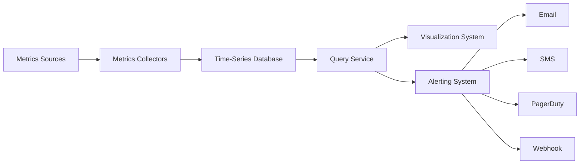

---

## 1. Requirements

### Functional Requirements

- Collect operational metrics from servers, databases, caches, queues, and services.
- Store metrics as time-series data.
- Support dashboards and graph queries.
- Support alert rules.
- Send alerts through email, SMS, PagerDuty, and webhooks.
- Support 1-year retention.
- Support downsampling.

### Non-functional Requirements

- Scalable ingestion.
- Low query latency.
- Reliable alerting.
- Highly available ingestion pipeline.
- Flexible enough to add new metric sources.
- Tolerate partial failures.

### Out of Scope

- Log monitoring.
- Distributed tracing.
- Business metrics.
- Full custom visualization engine.

---

## 2. Scale and Assumptions

Given:

```text
100M DAU company
1,000 server pools
100 machines per pool
100 metrics per machine
```

Total active metric streams:

```text
1,000 * 100 * 100 = 10,000,000 metrics
```

Retention:

```text
Raw data:        7 days
1-min rollup:   30 days
1-hour rollup:  1 year
```

Interview line:

> The system is write-heavy because metrics are constantly ingested, while reads are bursty from dashboards and alert checks.

---

## 3. Time-Series Data Model

A metric data point has:

```text
metric_name
labels/tags
timestamp
value
```

Example:

```text
metric_name: cpu.load
labels:      host=i631, env=prod, region=us-west
timestamp:   1613707265
value:       0.29
```

Line protocol style:

```text
cpu.load,host=i631,env=prod,region=us-west value=0.29 1613707265
http.error.count,service=checkout,env=prod value=12 1613707265
```

Mermaid data model:

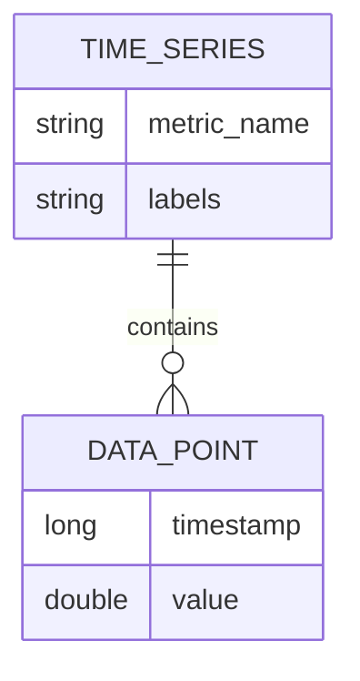

Important concept:

```text
metric_name + labels uniquely identify a time series.
```

---

## 4. Why Time-Series DB?

A normal SQL database is not ideal because:

```text
constant heavy writes
huge number of time-series points
label-based querying
range queries over time
downsampling
compression
retention policies
rolling aggregates
```

Use a time-series database:

```text
Prometheus
InfluxDB
OpenTSDB
M3DB
VictoriaMetrics
Amazon Timestream
```

Interview line:

> I would not build the storage engine from scratch. I would use a production-grade time-series database.

---

## 5. High-Level Architecture

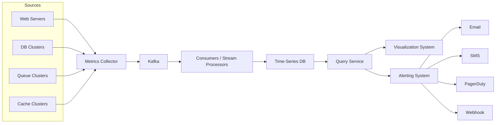

Main components:

```text
Metrics sources      -> machines/services exposing metrics
Collectors           -> pull or receive metrics
Kafka                -> durable buffer
Consumers            -> process and write data
Time-series DB       -> store metrics
Query service        -> query abstraction/cache
Visualization        -> dashboards
Alerting system      -> rule evaluation and notification
```

---

## 6. Metrics Collection: Pull Model

In pull model, collectors periodically fetch metrics from service endpoints.

```text
Collector -> Service /metrics endpoint
```

Mermaid:

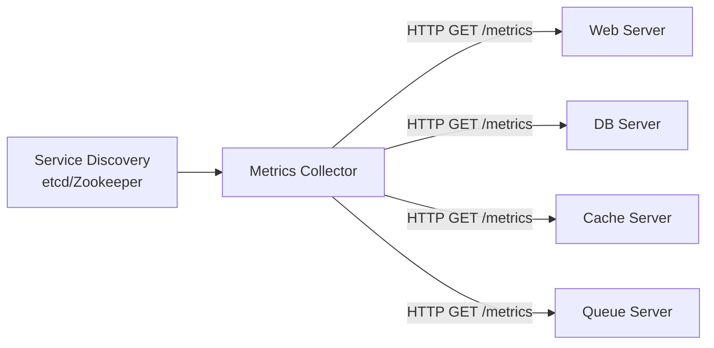

Flow:

```text
1. Service registers with service discovery.
2. Collector discovers targets.
3. Collector periodically calls /metrics.
4. Service returns metrics.
5. Collector sends metrics to ingestion pipeline.
```

Pros:

```text
easy debugging
easy health checking
collector controls scrape interval
authentic targets via service discovery
```

Cons:

```text
harder with firewalls
short-lived jobs may disappear before being scraped
collector must reach all targets
```

---

## 7. Metrics Collection: Push Model

In push model, agents push metrics to collectors.

```text
Agent -> Collector
```

Mermaid:

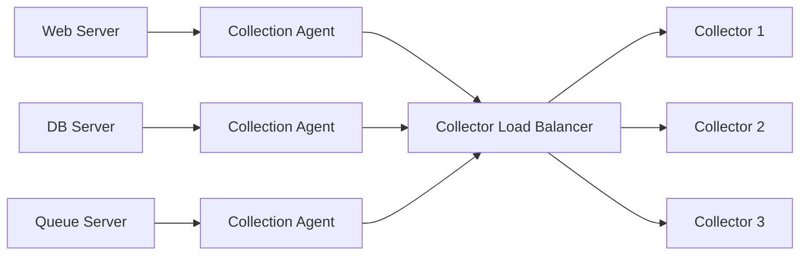

Pros:

```text
works better across complex networks
good for short-lived jobs
can aggregate locally
simple source-to-collector flow
```

Cons:

```text
collector may receive unauthenticated data if not protected
harder health checking
agent buffer may lose data if machine dies
```

---

## 8. Pull vs Push Interview Comparison

| Area | Pull | Push |
|---|---|---|
| Debugging | Easy with `/metrics` | Harder |
| Health check | Natural | Less direct |
| Short-lived jobs | Weak unless using push gateway | Strong |
| Firewall/multi-region | Harder | Easier |
| Collector control | Strong | Weaker |
| Source auth | Easier | Needs authentication |
| Examples | Prometheus | CloudWatch, Graphite |

Interview answer:

> A large company may support both: pull for long-running services and push for short-lived/serverless jobs.

---

## 9. Scaling Collectors

A single collector cannot scrape everything.

Use multiple collectors and assign targets using consistent hashing.

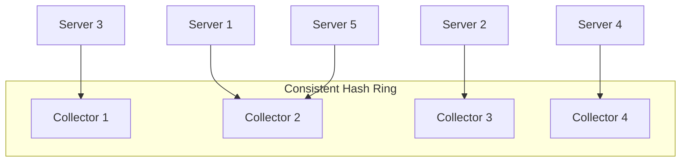

Why?

```text
avoid duplicate scraping
balance target ownership
easy collector add/remove
```

---

## 10. Why Add Kafka?

Without Kafka:

```text
Collector -> Time-Series DB
```

Problem:

```text
If TSDB is slow/down, metrics may be lost.
```

With Kafka:

```text
Collector -> Kafka -> Consumers -> Time-Series DB
```

Mermaid:

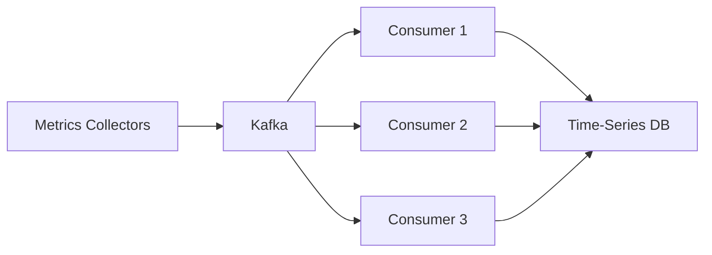

Benefits:

```text
durable buffer
decouples collectors from storage
absorbs traffic spikes
allows retries
supports stream processing
```

Interview line:

> Kafka protects ingestion from temporary storage failures and gives us backpressure handling.

---

## 11. Kafka Partitioning Strategy

Partition by:

```text
metric name
service name
host
region
tenant/team
```

Example:

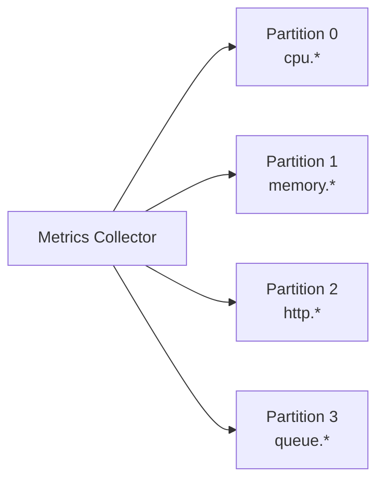

Good partitioning helps:

```text
parallel consumers
ordered processing per key
metric-level aggregation
priority processing
```

---

## 12. Where Aggregation Happens

### Agent-side aggregation

```text
agent aggregates counter every minute before sending
```

Pros:

```text
reduces network traffic
simple counters work well
```

Cons:

```text
less raw detail
agent complexity
```

### Stream aggregation

```text
Kafka -> Flink/Spark/Storm -> TSDB
```

Pros:

```text
reduces write volume
supports rollups
```

Cons:

```text
late events are hard
less raw precision if raw data is dropped
```

### Query-side aggregation

```text
raw data stored
aggregate at query time
```

Pros:

```text
maximum flexibility
no data loss
```

Cons:

```text
slower queries
high TSDB load
```

Recommended:

```text
Store raw recent data.
Downsample older data.
Use stream or scheduled jobs for rollups.
```

---

## 13. Storage and Retention

Retention policy:

```text
Raw metrics:      7 days
1-minute rollup:  30 days
1-hour rollup:    1 year
```

Mermaid:

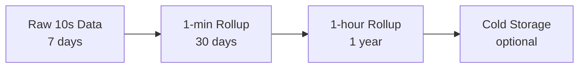

Example downsampling:

Raw 10-second data:

```text
19:00:00 cpu=10
19:00:10 cpu=16
19:00:20 cpu=20
```

30-second rollup:

```text
19:00:00 cpu_avg=(10+16+20)/3 = 15.33
```

---

## 14. Compression

Time-series data compresses well because timestamps and values change gradually.

Example:

```text
Original timestamps:
1610087371
1610087381
1610087391
1610087400
1610087411
```

Store delta:

```text
base = 1610087371
deltas = 10, 10, 9, 11
```

Benefits:

```text
less disk usage
faster scanning
better cache efficiency
```

---

## 15. Query Service

Query service sits between dashboards/alerts and TSDB.

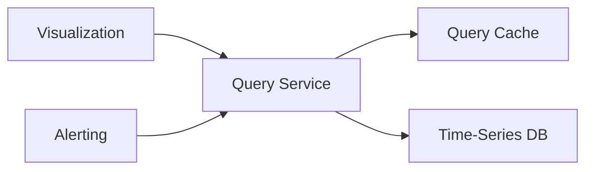

Responsibilities:

```text
validate queries
auth/access control
hide TSDB details
cache common dashboard queries
query fanout if TSDB is sharded
rate limit expensive queries
```

Interview note:

> If the TSDB and Grafana already provide good query capabilities, this service can be a thin wrapper or omitted.

---

## 16. Alerting System

Alert rules are usually defined as config files.

Example YAML-style rule:

```yaml
- name: instance_down
  rules:
    - alert: instance_down
      expr: up == 0
      for: 5m
      labels:
        severity: page
```

Alert states:

```text
inactive
pending
firing
resolved
```

---

## 17. Alerting Architecture

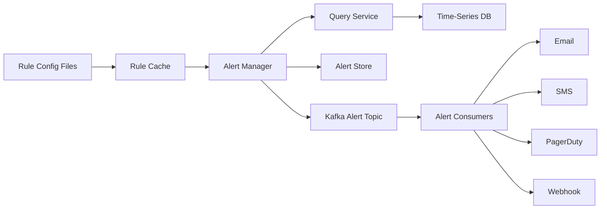

Flow:

```text
1. Load alert rules to cache.
2. Alert manager fetches rules.
3. Alert manager queries metrics periodically.
4. If threshold is violated for configured duration, alert becomes firing.
5. Alert state is saved.
6. Alert event is published to Kafka.
7. Alert consumers send notification.
```

---

## 18. Alert Dedupe and Merge

Without dedupe:

```text
Instance 1 disk > 90%
Instance 1 disk > 90%
Instance 1 disk > 90%
```

With dedupe:

```text
1 alert: Instance 1 disk > 90%
```

Mermaid:

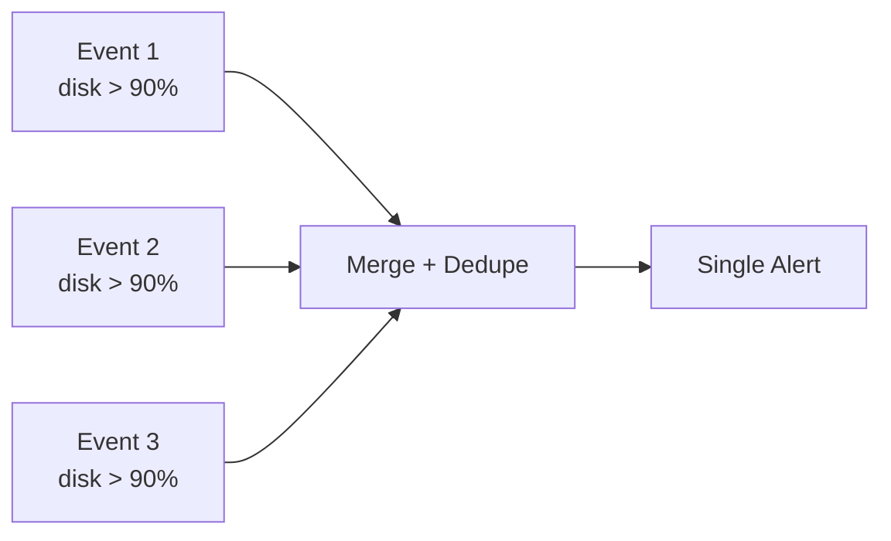

Alert manager responsibilities:

```text
filter
merge
dedupe
silence
route
retry
escalate
resolve
```

---

## 19. Visualization System

Use Grafana-like dashboards.

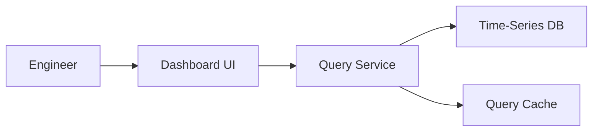

Dashboard examples:

```text
CPU usage by host
Memory usage by service
HTTP requests per second
Error rate by region
Queue depth
P95 latency
```

Interview line:

> In a real company, I would likely buy/use Grafana instead of building visualization from scratch.

---

## 20. Final Architecture

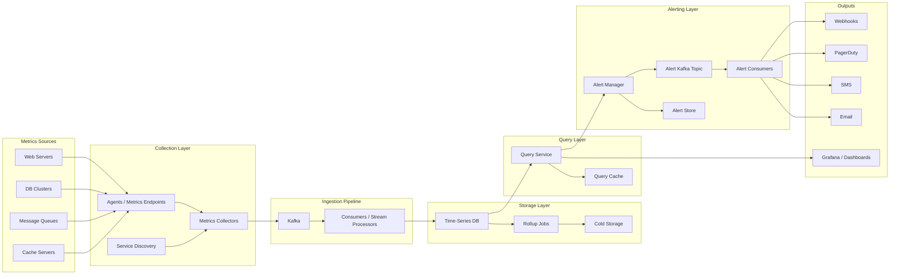

---

## 21. End-to-End Ingestion Flow

```text
1. Service exposes metrics or agent collects local metrics.
2. Collector discovers target through service discovery.
3. Collector pulls or receives pushed metrics.
4. Collector validates and normalizes data.
5. Collector writes metric points to Kafka.
6. Consumers read Kafka partitions.
7. Consumers optionally aggregate/enrich.
8. Consumers write to time-series DB.
9. Rollup jobs downsample old data.
10. Cold storage stores rarely accessed old data.
```

---

## 22. End-to-End Alert Flow

```text
1. Engineer defines alert rule.
2. Alert manager loads rule.
3. Alert manager periodically queries query service.
4. Query service reads from TSDB/cache.
5. Alert manager evaluates condition.
6. If violation lasts for configured duration, alert fires.
7. Alert store records state.
8. Alert event goes to Kafka.
9. Alert consumer sends notification.
10. Alert is deduped/merged to avoid noise.
```

---

## 23. Failure Handling

### Collector failure

```text
Use collector replicas.
Rebalance targets through consistent hashing.
```

### Kafka unavailable

```text
Collectors buffer briefly.
Alert ingestion lag.
Autoscale/recover Kafka.
```

### TSDB unavailable

```text
Kafka retains data.
Consumers retry.
Dashboards may show stale data.
```

### Query service down

```text
Use replicas behind load balancer.
Dashboards fail over.
```

### Alert consumer failure

```text
Kafka retains alert events.
Another consumer retries.
```

### Notification provider failure

```text
Retry.
Route to backup channel.
Escalate if still failing.
```

---

## 24. Java Code — Metric Data Model

```java
import java.time.Instant;
import java.util.Map;

public record MetricPoint(
        String metricName,
        Map<String, String> labels,
        Instant timestamp,
        double value
) {
    public String seriesKey() {
        return metricName + labels.toString();
    }
}
```

---

## 25. Java Code — Line Protocol Parser

```java
import java.time.Instant;
import java.util.HashMap;
import java.util.Map;

public class LineProtocolParser {
    public MetricPoint parse(String line) {
        // Example:
        // cpu.load,host=i631,env=prod value=0.29 1613707265

        String[] parts = line.split(" ");
        String metricAndLabels = parts[0];
        String valuePart = parts[1];
        String timestampPart = parts[2];

        String[] metricParts = metricAndLabels.split(",");
        String metricName = metricParts[0];

        Map<String, String> labels = new HashMap<>();
        for (int i = 1; i < metricParts.length; i++) {
            String[] kv = metricParts[i].split("=");
            labels.put(kv[0], kv[1]);
        }

        double value = Double.parseDouble(valuePart.split("=")[1]);
        Instant timestamp = Instant.ofEpochSecond(Long.parseLong(timestampPart));

        return new MetricPoint(metricName, labels, timestamp, value);
    }
}
```

---

## 26. Java Code — Agent-side Aggregator

```java
import java.time.Instant;
import java.util.Map;

public class MetricAggregator {
    private double sum = 0;
    private int count = 0;

    public void add(double value) {
        sum += value;
        count++;
    }

    public MetricPoint flushAverage(String metricName, String host) {
        if (count == 0) {
            return null;
        }

        double avg = sum / count;
        sum = 0;
        count = 0;

        return new MetricPoint(
                metricName,
                Map.of("host", host),
                Instant.now(),
                avg
        );
    }
}
```

---

## 27. Java Code — Downsampler

```java
import java.time.Instant;
import java.util.ArrayList;
import java.util.Comparator;
import java.util.List;

public class Downsampler {
    public List<MetricPoint> downsampleAverage(
            List<MetricPoint> points,
            long bucketSeconds
    ) {
        points = points.stream()
                .sorted(Comparator.comparing(MetricPoint::timestamp))
                .toList();

        List<MetricPoint> result = new ArrayList<>();

        long currentBucket = -1;
        double sum = 0;
        int count = 0;
        MetricPoint sample = null;

        for (MetricPoint point : points) {
            long bucket = point.timestamp().getEpochSecond() / bucketSeconds;

            if (currentBucket != -1 && bucket != currentBucket) {
                result.add(new MetricPoint(
                        sample.metricName(),
                        sample.labels(),
                        Instant.ofEpochSecond(currentBucket * bucketSeconds),
                        sum / count
                ));
                sum = 0;
                count = 0;
            }

            currentBucket = bucket;
            sample = point;
            sum += point.value();
            count++;
        }

        if (count > 0 && sample != null) {
            result.add(new MetricPoint(
                    sample.metricName(),
                    sample.labels(),
                    Instant.ofEpochSecond(currentBucket * bucketSeconds),
                    sum / count
            ));
        }

        return result;
    }
}
```

---

## 28. Java Code — Alert Rule Model

```java
import java.time.Duration;

public record AlertRule(
        String name,
        String metricName,
        String labelKey,
        String labelValue,
        String operator,
        double threshold,
        Duration duration,
        String severity
) {}
```

Example:

```java
AlertRule cpuHigh = new AlertRule(
        "high_cpu",
        "cpu.usage",
        "service",
        "checkout",
        ">",
        90.0,
        Duration.ofMinutes(5),
        "page"
);
```

---

## 29. Java Code — Alert Evaluator

```java
public class AlertEvaluator {
    public boolean violates(AlertRule rule, double value) {
        return switch (rule.operator()) {
            case ">" -> value > rule.threshold();
            case ">=" -> value >= rule.threshold();
            case "<" -> value < rule.threshold();
            case "<=" -> value <= rule.threshold();
            case "==" -> value == rule.threshold();
            default -> throw new IllegalArgumentException("Unknown operator");
        };
    }
}
```

---

## 30. Java Code — Alert Dedupe Store

```java
import java.time.Instant;
import java.util.Map;
import java.util.concurrent.ConcurrentHashMap;

enum AlertState {
    INACTIVE,
    PENDING,
    FIRING,
    RESOLVED
}

class AlertRecord {
    AlertState state;
    Instant lastUpdatedAt;

    AlertRecord(AlertState state) {
        this.state = state;
        this.lastUpdatedAt = Instant.now();
    }
}

public class AlertDedupeStore {
    private final Map<String, AlertRecord> alerts = new ConcurrentHashMap<>();

    public boolean shouldNotify(String alertKey) {
        AlertRecord existing = alerts.get(alertKey);

        if (existing != null && existing.state == AlertState.FIRING) {
            return false;
        }

        alerts.put(alertKey, new AlertRecord(AlertState.FIRING));
        return true;
    }

    public void resolve(String alertKey) {
        alerts.put(alertKey, new AlertRecord(AlertState.RESOLVED));
    }
}
```

---

## 31. Java Code — Simple Alert Manager

```java
public class SimpleAlertManager {
    private final AlertEvaluator evaluator = new AlertEvaluator();
    private final AlertDedupeStore dedupeStore = new AlertDedupeStore();

    public void evaluate(AlertRule rule, MetricPoint latestPoint) {
        boolean violated = evaluator.violates(rule, latestPoint.value());

        String alertKey = rule.name()
                + ":"
                + latestPoint.metricName()
                + ":"
                + latestPoint.labels();

        if (violated && dedupeStore.shouldNotify(alertKey)) {
            sendNotification(rule, latestPoint);
        }

        if (!violated) {
            dedupeStore.resolve(alertKey);
        }
    }

    private void sendNotification(AlertRule rule, MetricPoint point) {
        System.out.println("ALERT: " + rule.name());
        System.out.println("Metric: " + point.metricName());
        System.out.println("Value: " + point.value());
        System.out.println("Severity: " + rule.severity());
    }
}
```

---

## 32. Java Code — Simple Collector Interface

```java
import java.util.List;
import java.util.Map;
import java.time.Instant;

interface MetricsCollector {
    List<MetricPoint> collect();
}

class CpuMetricsCollector implements MetricsCollector {
    @Override
    public List<MetricPoint> collect() {
        MetricPoint point = new MetricPoint(
                "cpu.usage",
                Map.of("host", "host-a", "env", "prod"),
                Instant.now(),
                Math.random() * 100
        );

        return List.of(point);
    }
}
```

---

## 33. Scaling Strategy

### Ingestion

```text
Collectors are horizontally scalable.
Kafka absorbs spikes.
Consumers scale by partitions.
```

### Storage

```text
Use distributed TSDB.
Shard by metric name + labels.
Compress and downsample.
```

### Query

```text
Cache common dashboard queries.
Rate limit expensive queries.
Precompute common rollups.
```

### Alerting

```text
Partition rules by team/service.
Store alert state.
Dedupe and merge alerts.
Use Kafka for alert events.
```

---

## 34. Common Metrics to Mention

```text
Infrastructure:
- CPU usage
- memory usage
- disk usage
- network bytes
- process count

Service:
- QPS
- error rate
- latency p50/p95/p99
- active connections
- request timeout count

Queue:
- queue depth
- message age
- consumer lag

Database:
- query latency
- connection count
- replication lag
- cache hit ratio
```

---

## 35. FAANG Talking Points

1. Metrics are time-series data.
2. Use a time-series DB instead of MySQL.
3. Support both pull and push collection models.
4. Use service discovery for pull targets.
5. Use consistent hashing to assign targets to collectors.
6. Use Kafka to decouple collectors from storage.
7. Kafka prevents data loss when TSDB is temporarily unavailable.
8. Partition Kafka by metric name or labels.
9. Use downsampling for long-term retention.
10. Use compression/delta encoding to reduce storage.
11. Use query cache for dashboards.
12. Use alert state store to avoid duplicate alerts.
13. Alert manager should dedupe, merge, silence, and route alerts.
14. Use Grafana-like external visualization instead of building from scratch.
15. Raw recent data is queried most often, so optimize hot storage.
16. Collection can tolerate small metric loss, but alerting should be reliable.
17. Use at-least-once alert delivery.
18. Avoid high-cardinality labels like request_id/user_id.

---

## 36. One-Minute Interview Summary

> I would design the monitoring system around time-series data. Metrics sources expose or push metrics to collectors. For pull-based collection, collectors discover targets through service discovery and scrape `/metrics`; for push-based collection, agents send metrics to a collector load balancer. Collectors normalize metrics and write them to Kafka, which decouples ingestion from storage and prevents data loss during TSDB outages. Consumers process Kafka data and write to a distributed time-series database. Recent raw data is retained for 7 days, then downsampled to 1-minute and 1-hour rollups for longer retention. Query service provides a thin abstraction and cache for dashboards and alerts. The alert manager periodically evaluates rules, stores alert state, dedupes and merges alerts, then sends events through Kafka to alert consumers for email, SMS, PagerDuty, or webhooks. Grafana-like dashboards handle visualization.

---

## 37. Quick Revision

```text
Core flow:
Sources -> Collectors -> Kafka -> Consumers -> TSDB -> Query -> Dashboard/Alerts

Data model:
metric name + labels + timestamp + value

Collection:
Pull = collector scrapes /metrics
Push = agent sends metrics

Storage:
Use TSDB
Raw 7 days
1-min rollup 30 days
1-hour rollup 1 year

Alerting:
Rules -> Query -> Evaluate -> Alert Store -> Kafka -> Consumers -> Notification

Best phrase:
The system is write-heavy with bursty reads, so Kafka plus a time-series database is a strong fit.
```
