# 22 — Ad Click Event Aggregation

> Goal: design a large-scale ad click aggregation system like Facebook/Google Ads reporting, where click events are counted, ranked, filtered, and used for billing/reporting.

---

## 0. What are we designing?

An ad click aggregation system receives billions of click events, aggregates them by time windows, supports reporting queries, and handles late/duplicate events.

Core use cases:

```text
1. Count clicks for ad_id in the last M minutes.
2. Return top N most clicked ads in the last M minutes.
3. Support filters by country, IP, user_id, etc.
4. Store raw events for replay/reconciliation.
5. Store aggregated data for fast dashboard queries.
```

High-level mental model:

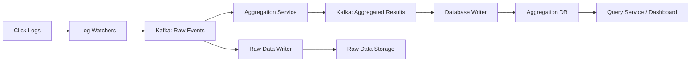

---

## 1. Requirements

### Functional Requirements

- Aggregate click count for a given `ad_id` in the last `M` minutes.
- Return top `N` most clicked ads in the last `M` minutes.
- Support filtering by:
  - `ip`,
  - `user_id`,
  - `country`,
  - campaign-related dimensions if needed.
- Store raw events for replay and debugging.
- Store aggregated results for fast reads.

### Non-functional Requirements

- Correctness is critical because results affect billing.
- Handle duplicate events.
- Handle late-arriving events.
- Robust against partial failures.
- End-to-end latency: a few minutes.
- Horizontally scalable.
- Reprocessing should be possible.

---

## 2. Scale Estimation

Given:

```text
1 billion ad click events/day
2 million ads
Peak QPS = 5x average
Event size = 0.1 KB
```

Calculations:

```text
Average QPS = 1B / 100,000 sec ≈ 10,000 QPS
Peak QPS    = 10,000 * 5 = 50,000 QPS

Daily storage = 1B * 0.1 KB = 100 GB/day
Monthly raw storage ≈ 3 TB/month
```

Interview line:

> This is a write-heavy streaming aggregation system with strict correctness requirements.

---

## 3. API Design

### API 1 — Get click count for one ad

```http
GET /v1/ads/{ad_id}/aggregated_count?from=202101010000&to=202101010010&filter=001
```

Response:

```json
{
  "ad_id": "ad001",
  "count": 12345
}
```

---

### API 2 — Get top N ads

```http
GET /v1/ads/popular_ads?count=100&window=1&filter=001
```

Response:

```json
{
  "ad_ids": ["ad123", "ad991", "ad402"]
}
```

---

## 4. Raw Event Data Model

Raw event:

```text
ad_id
click_timestamp
user_id
ip
country
event_id
```

Example:

```text
ad001, 2021-01-01 00:00:01, user1, 207.148.22.22, USA, evt-abc-001
```

Table:

| ad_id | click_timestamp | user_id | ip | country | event_id |
|---|---|---|---|---|---|
| ad001 | 2021-01-01 00:00:01 | user1 | 207.148.22.22 | USA | evt1 |
| ad001 | 2021-01-01 00:00:02 | user1 | 207.148.22.22 | USA | evt2 |
| ad002 | 2021-01-01 00:00:02 | user2 | 209.153.56.11 | USA | evt3 |

Important:

```text
event_id is useful for deduplication.
```

---

## 5. Aggregated Data Model

Per-minute click count:

| ad_id | click_minute | count |
|---|---:|---:|
| ad001 | 202101010000 | 5 |
| ad001 | 202101010001 | 7 |

With filters/dimensions:

| ad_id | click_minute | filter_id | count |
|---|---:|---:|---:|
| ad001 | 202101010000 | US | 2 |
| ad001 | 202101010000 | CA | 3 |
| ad001 | 202101010001 | US | 1 |

Top ads table:

| window_size | update_time_minute | most_clicked_ads |
|---:|---:|---|
| 1 | 202101010001 | `[ad1, ad7, ad13]` |
| 5 | 202101010005 | `[ad9, ad1, ad4]` |

---

## 6. Store Raw and Aggregated Data

### Raw data

Pros:

```text
full fidelity
debugging
replay
recalculation
fraud analysis
ML training
```

Cons:

```text
large storage
slow queries
```

### Aggregated data

Pros:

```text
small
fast query
dashboard friendly
```

Cons:

```text
derived data
can be wrong if aggregation bug exists
```

Recommendation:

```text
Store both.
Raw data = source of truth.
Aggregated data = serving/query layer.
```

---

## 7. Database Choice

### Raw Data

Options:

```text
Cassandra
S3 + Parquet/ORC/Avro
HDFS
Bigtable
```

For interview:

```text
Use Cassandra or S3/Parquet.
```

### Aggregated Data

Options:

```text
Cassandra
ClickHouse
Druid
Pinot
Bigtable
Time-series DB
```

For interview:

```text
Use Cassandra for simple scalable writes/reads, or ClickHouse/Druid for OLAP-style queries.
```

---

## 8. High-Level Architecture

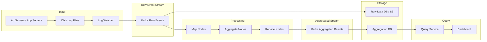

---

## 9. Why Kafka?

Kafka decouples producers and consumers.

Without Kafka:

```text
Log Watcher -> Aggregation Service
```

Problem:

```text
If aggregation service is slow/down, log watcher backs up or loses data.
```

With Kafka:

```text
Log Watcher -> Kafka -> Aggregation Service
```

Benefits:

```text
durable buffer
consumer replay
backpressure handling
horizontal scaling
fault tolerance
stream ordering per partition
```

---

## 10. Message Queue Contents

### First Kafka topic: raw events

```text
ad_id
click_timestamp
user_id
ip
country
event_id
```

### Second Kafka topic: aggregated results

Per-minute count:

```text
ad_id
click_minute
filter_id
count
```

Top N:

```text
window_size
update_time_minute
most_clicked_ads
```

---

## 11. Aggregation Service: Map/Aggregate/Reduce

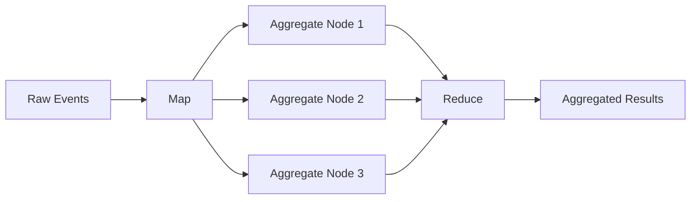

### Map node

Responsibilities:

```text
parse event
validate event
normalize fields
filter invalid data
route by ad_id or dimension
```

Example routing:

```text
ad_id % number_of_aggregate_nodes
```

---

### Aggregate node

Responsibilities:

```text
count clicks by ad_id per minute
maintain per-window in-memory state
maintain local top N heap
emit partial results
```

---

### Reduce node

Responsibilities:

```text
merge partial counts
merge local top N lists
produce global top N
write final aggregate result
```

---

## 12. Use Case 1 — Count Clicks Per Ad

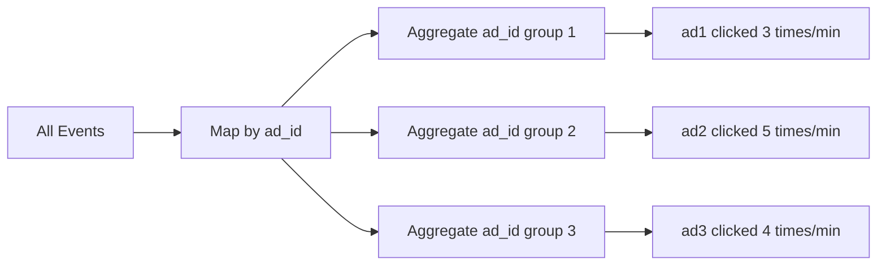

Logic:

```text
1. Partition events by ad_id.
2. Count events in 1-minute tumbling window.
3. Store ad_id + minute + count.
```

---

## 13. Use Case 2 — Top N Ads

Each aggregate node keeps local top N.

Then reduce node merges them.

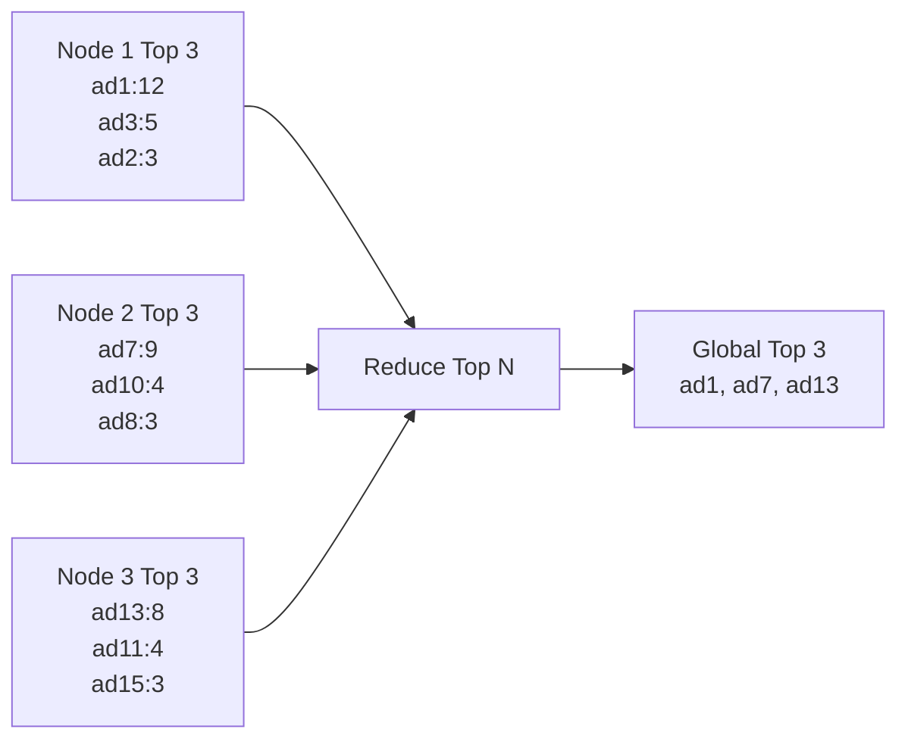

Use min-heap:

```text
Maintain heap of size N.
If new count > heap min, replace.
```

---

## 14. Use Case 3 — Filtering

Filter examples:

```text
country = USA
ip = 123.1.2.3
user_id = user123
```

Pre-aggregate by dimensions.

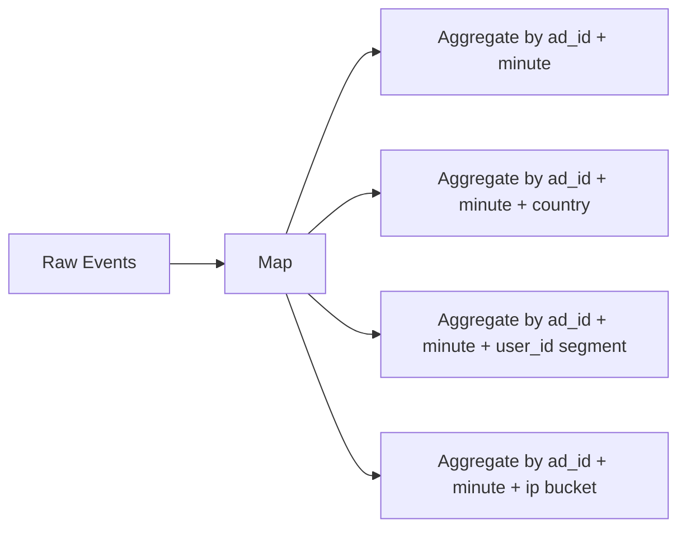

This is similar to star schema:

```text
fact: click event count
dimensions: country, ip, user_id, device, campaign
```

Tradeoff:

```text
More dimensions = faster filtered queries but more storage.
```

---

## 15. Stream Processing vs Batch Processing

### Streaming

```text
process events continuously
near real-time
used for dashboards and billing estimates
```

### Batch

```text
process bounded historical data
used for replay and reconciliation
```

---

## 16. Kappa Architecture

Use one streaming pipeline for both real-time and replay.

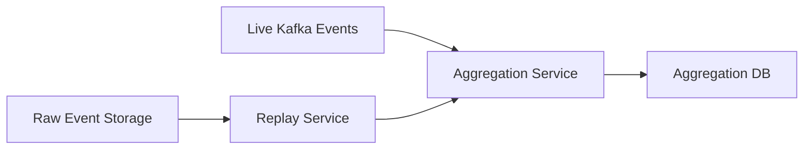

Why Kappa?

```text
single processing codepath
historical replay uses same aggregation logic
fewer inconsistencies than lambda architecture
```

---

## 17. Recalculation Flow

Used when aggregation bug is found.

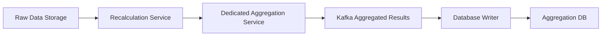

Important:

```text
Use dedicated aggregation cluster so replay does not impact live traffic.
```

---

## 18. Event Time vs Processing Time

### Event time

```text
Time when click happened.
```

Pros:

```text
more accurate business result
```

Cons:

```text
client clock can be wrong
events can arrive late
```

---

### Processing time

```text
Time when aggregation server processes event.
```

Pros:

```text
server clock is more trustworthy
simpler
```

Cons:

```text
late events go into wrong window
```

Recommendation:

```text
Use event time with watermark.
```

---

## 19. Tumbling Window

Used for per-minute click counts.

```mermaid
gantt
    title 1-Minute Tumbling Windows
    dateFormat mm
    axisFormat %M

    section Windows
    Window 1 : 00, 1m
    Window 2 : 01, 1m
    Window 3 : 02, 1m
    Window 4 : 03, 1m
```

Meaning:

```text
Non-overlapping fixed windows.
Each event belongs to exactly one window.
```

Example:

```text
00:00:00 - 00:00:59 -> count minute 0
00:01:00 - 00:01:59 -> count minute 1
```

---

## 20. Sliding Window

Used for top N ads in last M minutes.

```mermaid
gantt
    title 3-Minute Sliding Window, Run Every Minute
    dateFormat mm
    axisFormat %M

    section Sliding
    Window A: 00, 3m
    Window B: 01, 3m
    Window C: 02, 3m
```

Meaning:

```text
Overlapping windows.
Used for "top ads in the last M minutes".
```

---

## 21. Watermark for Late Events

A watermark extends the wait time for a window.

```text
Window:    00:00 - 00:01
Watermark: wait extra 15 seconds
Close at:  00:01:15
```

Visual:

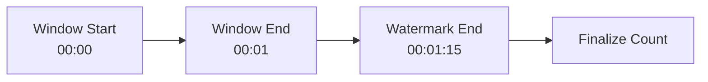

Tradeoff:

```text
Long watermark = more accurate but higher latency.
Short watermark = lower latency but may miss late events.
```

Interview line:

> Use watermark for slightly late events and end-of-day reconciliation for very late events.

---

## 22. Delivery Guarantees

Kafka-style guarantees:

| Guarantee | Meaning | Fit? |
|---|---|---|
| At-most once | May lose events | Bad for billing |
| At-least once | No loss, possible duplicates | Needs dedupe |
| Exactly once | No loss, no duplicates logically | Best but complex |

Recommendation:

```text
Aim for exactly-once processing semantics.
At minimum, use at-least-once plus idempotent writes and dedupe.
```

---

## 23. Deduplication

Duplicates can happen because:

```text
client retries
log watcher retries
aggregator crashes before committing offset
network timeout
downstream ack lost
```

Solution tools:

```text
event_id
Kafka offset tracking
idempotent writes
transactional producer
dedupe store
windowed dedupe cache
```

Visual:

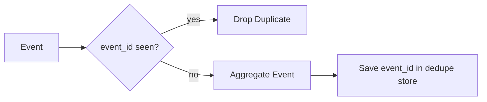

---

## 24. Exactly-Once Challenge

Problem:

```text
1. Aggregator reads offset 100-110.
2. Aggregator writes aggregated result downstream.
3. Aggregator crashes before committing offset.
4. New aggregator reads 100-110 again.
5. Duplicate aggregation occurs.
```

Better approach:

```text
Commit result and offset atomically.
```

Mermaid:

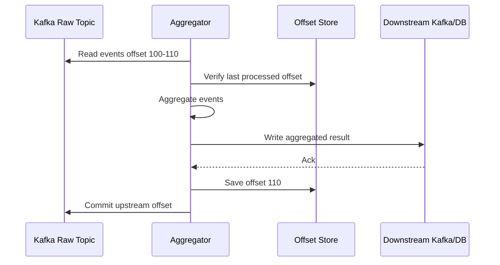

Interview note:

> True exactly-once across multiple systems is hard. Use Kafka transactions or idempotent downstream writes where possible.

---

## 25. Scaling Kafka

### Producers

```text
Scale log watchers horizontally.
```

### Consumers

```text
Use consumer groups.
Add consumers to process more partitions.
```

### Partitions

```text
Partition by ad_id so all events for the same ad are ordered.
```

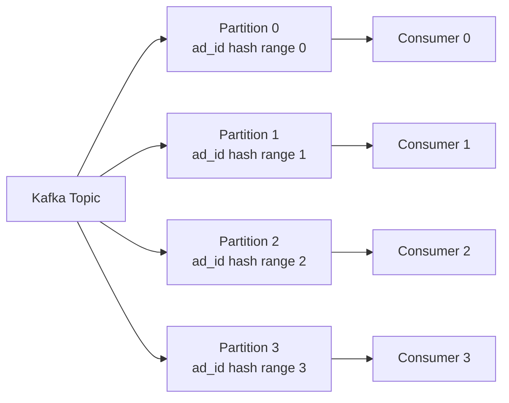

Best practice:

```text
Pre-allocate enough partitions.
Changing partition count may change ad_id routing.
```

---

## 26. Topic Sharding

Split topics by:

```text
region
business type
platform
traffic type
```

Examples:

```text
topic_ads_na
topic_ads_europe
topic_ads_asia

topic_web_ads
topic_mobile_ads
topic_video_ads
```

Pros:

```text
higher throughput
smaller consumer groups
faster rebalancing
isolation by region/business
```

Cons:

```text
more operational complexity
more topics to monitor
```

---

## 27. Scaling Aggregation Service

Option 1: multi-thread by ad_id.

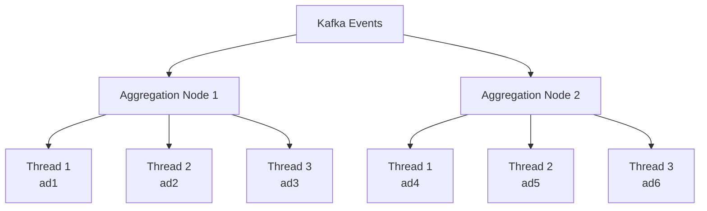

Option 2: use a compute resource manager.

```text
YARN
Kubernetes
Flink cluster
Spark Streaming
```

Interview line:

> For production, I would likely use Flink/Spark/Kafka Streams instead of writing my own distributed aggregation engine.

---

## 28. Hotspot Problem

Some ads receive far more clicks than others.

Problem:

```text
partition by ad_id can overload one partition or aggregator
```

Solutions:

```text
split hot ad_id into subkeys
allocate extra aggregation nodes
global-local aggregation
dynamic load detection
resource manager
```

Visual:

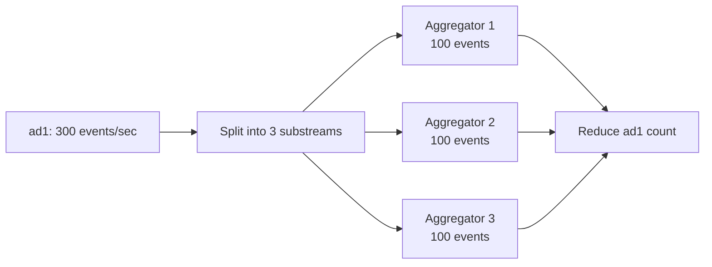

---

## 29. Scaling Database

For aggregated data:

```text
Cassandra with partition key:
(ad_id, click_minute)
```

For filtered aggregation:

```text
(ad_id, filter_id, click_minute)
```

For top N:

```text
(window_size, update_time_minute)
```

Use:

```text
replication
consistent hashing
virtual nodes
time-based TTL
compaction
```

---

## 30. Fault Tolerance

### Aggregation node fails

Problem:

```text
in-memory counts are lost
```

Solution:

```text
periodic snapshots + Kafka replay
```

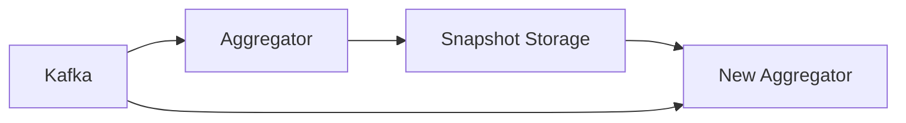

Recovery:

```text
1. Start new aggregator.
2. Load latest snapshot.
3. Replay Kafka events after snapshot offset.
4. Resume processing.
```

---

## 31. Snapshot Contents

Snapshot must store more than offset.

Example:

```text
partition_id
last_processed_offset
window_start
window_end
ad_id -> count
top_N_heap_state
dedupe_cache_state
watermark_state
```

Visual:

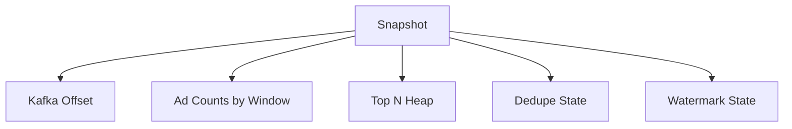

---

## 32. Monitoring the Aggregation System

Monitor:

```text
Kafka consumer lag
aggregation latency
event-time delay
processing-time delay
watermark delay
DB write latency
duplicate event rate
dropped event count
late event count
hot partition detection
CPU/memory/JVM GC
```

Important latency metrics:

```text
event_created_at -> log_watched_at
log_watched_at -> kafka_written_at
kafka_written_at -> aggregated_at
aggregated_at -> db_written_at
db_written_at -> dashboard_visible_at
```

---

## 33. Reconciliation

Real-time aggregation may have small inaccuracies due to late events or failures.

Use batch reconciliation:

```text
1. At end of day, read raw events.
2. Sort/group by event time.
3. Recompute click counts.
4. Compare with real-time aggregation.
5. Correct mismatches.
```

Visual:

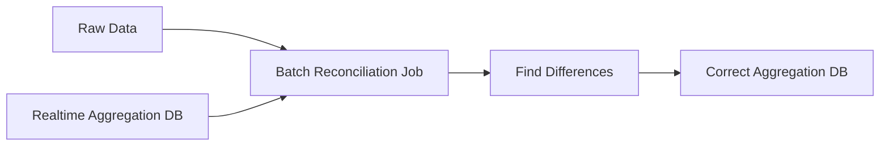

Interview line:

> Real-time results are fast; reconciliation makes them correct.

---

## 34. Final Design

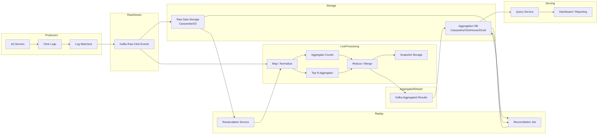

---

## 35. Java Code — Raw Event Model

```java
import java.time.Instant;

public record AdClickEvent(
        String eventId,
        String adId,
        Instant clickTimestamp,
        String userId,
        String ip,
        String country
) {}
```

---

## 36. Java Code — Aggregate Key

```java
import java.time.Instant;
import java.time.ZoneOffset;
import java.time.format.DateTimeFormatter;

public record AggregateKey(
        String adId,
        String minuteBucket,
        String filterId
) {
    private static final DateTimeFormatter FORMATTER =
            DateTimeFormatter.ofPattern("yyyyMMddHHmm")
                    .withZone(ZoneOffset.UTC);

    public static AggregateKey from(AdClickEvent event, String filterId) {
        String minute = FORMATTER.format(event.clickTimestamp());
        return new AggregateKey(event.adId(), minute, filterId);
    }
}
```

---

## 37. Java Code — Simple Per-Minute Aggregator

```java
import java.util.Map;
import java.util.concurrent.ConcurrentHashMap;

public class ClickCountAggregator {
    private final Map<AggregateKey, Long> counts = new ConcurrentHashMap<>();

    public void process(AdClickEvent event) {
        String filterId = event.country(); // simple filter by country
        AggregateKey key = AggregateKey.from(event, filterId);

        counts.merge(key, 1L, Long::sum);
    }

    public long getCount(AggregateKey key) {
        return counts.getOrDefault(key, 0L);
    }

    public Map<AggregateKey, Long> snapshot() {
        return Map.copyOf(counts);
    }
}
```

---

## 38. Java Code — Dedupe Cache

```java
import java.time.Instant;
import java.util.Map;
import java.util.concurrent.ConcurrentHashMap;

public class EventDedupeCache {
    private final Map<String, Instant> seen = new ConcurrentHashMap<>();

    public boolean isDuplicate(String eventId) {
        return seen.containsKey(eventId);
    }

    public void markSeen(String eventId) {
        seen.put(eventId, Instant.now());
    }

    public boolean shouldProcess(AdClickEvent event) {
        if (isDuplicate(event.eventId())) {
            return false;
        }

        markSeen(event.eventId());
        return true;
    }
}
```

Interview note:

```text
In production, use Redis/Cassandra/Bloom filter/windowed state store.
An in-memory map is only for learning.
```

---

## 39. Java Code — Top N Ads with Min Heap

```java
import java.util.*;

public class TopNAds {
    public List<Map.Entry<String, Long>> topN(Map<String, Long> adCounts, int n) {
        PriorityQueue<Map.Entry<String, Long>> minHeap =
                new PriorityQueue<>(Comparator.comparingLong(Map.Entry::getValue));

        for (Map.Entry<String, Long> entry : adCounts.entrySet()) {
            minHeap.offer(entry);

            if (minHeap.size() > n) {
                minHeap.poll();
            }
        }

        List<Map.Entry<String, Long>> result = new ArrayList<>(minHeap);
        result.sort((a, b) -> Long.compare(b.getValue(), a.getValue()));

        return result;
    }

    public static void main(String[] args) {
        Map<String, Long> counts = Map.of(
                "ad1", 12L,
                "ad7", 9L,
                "ad13", 8L,
                "ad2", 3L
        );

        TopNAds service = new TopNAds();
        System.out.println(service.topN(counts, 3));
    }
}
```

---

## 40. Java Code — Watermark Decision

```java
import java.time.Duration;
import java.time.Instant;

public class WatermarkPolicy {
    private final Duration allowedLateness;

    public WatermarkPolicy(Duration allowedLateness) {
        this.allowedLateness = allowedLateness;
    }

    public boolean isTooLate(AdClickEvent event, Instant currentProcessingTime) {
        Instant latestAllowedEventTime = currentProcessingTime.minus(allowedLateness);
        return event.clickTimestamp().isBefore(latestAllowedEventTime);
    }

    public static void main(String[] args) {
        WatermarkPolicy policy = new WatermarkPolicy(Duration.ofSeconds(15));

        AdClickEvent event = new AdClickEvent(
                "evt1",
                "ad001",
                Instant.now().minusSeconds(10),
                "user1",
                "127.0.0.1",
                "USA"
        );

        System.out.println(policy.isTooLate(event, Instant.now())); // false
    }
}
```

---

## 41. Java Code — End-to-End Toy Processor

```java
public class AdClickProcessor {
    private final EventDedupeCache dedupeCache = new EventDedupeCache();
    private final ClickCountAggregator aggregator = new ClickCountAggregator();

    public void handle(AdClickEvent event) {
        if (!dedupeCache.shouldProcess(event)) {
            System.out.println("Duplicate event ignored: " + event.eventId());
            return;
        }

        aggregator.process(event);
        System.out.println("Processed event: " + event.eventId());
    }

    public ClickCountAggregator aggregator() {
        return aggregator;
    }
}
```

---

## 42. Java Code — Consistent Partitioning by ad_id

```java
public class AdPartitioner {
    private final int partitions;

    public AdPartitioner(int partitions) {
        this.partitions = partitions;
    }

    public int partition(String adId) {
        return Math.abs(adId.hashCode()) % partitions;
    }

    public static void main(String[] args) {
        AdPartitioner partitioner = new AdPartitioner(16);

        System.out.println(partitioner.partition("ad001"));
        System.out.println(partitioner.partition("ad999"));
    }
}
```

---

## 43. Production Improvements over Toy Java

The Java code above is for interview learning only.

Production would use:

```text
Kafka / Pulsar
Flink / Spark Streaming / Kafka Streams
RocksDB state backend
Redis/Cassandra/Bloom filter for dedupe
Cassandra/ClickHouse/Druid/Pinot for serving
S3/HDFS for raw storage
Airflow/Spark for reconciliation
Kubernetes/YARN for resource management
```

---

## 44. FAANG Interview Talking Points

1. This is a streaming aggregation system.
2. Raw data is source of truth.
3. Aggregated data is serving layer.
4. Kafka decouples ingestion and processing.
5. Use Map/Aggregate/Reduce model for scalable aggregation.
6. Use tumbling windows for per-minute counts.
7. Use sliding windows for top N over last M minutes.
8. Use event time because billing accuracy matters.
9. Use watermark to handle slightly late events.
10. Use reconciliation for very late events or correction.
11. Exactly-once semantics are hard across systems.
12. Use idempotent writes, event IDs, transactional processing, and offset management.
13. Partition Kafka by `ad_id`.
14. Pre-allocate Kafka partitions to avoid routing changes.
15. Hot ads can create hotspots.
16. Mitigate hotspots with subkeys and global-local aggregation.
17. Snapshot aggregator state for fast recovery.
18. Monitor Kafka lag, late events, duplicate rate, and aggregation latency.
19. Use batch replay when bugs are found.
20. OLAP databases like ClickHouse/Druid/Pinot are good for serving analytics.

---

## 45. One-Minute Interview Summary

> I would design ad click aggregation as a near-real-time streaming system. Log watchers push raw click events into Kafka. The raw Kafka stream is stored in raw storage and consumed by an aggregation service. The aggregation service uses Map/Aggregate/Reduce: map normalizes and partitions by `ad_id`, aggregate nodes count clicks in one-minute tumbling windows and maintain local top N, and reduce nodes merge partial results into global counts and top ads. Aggregated results are written to another Kafka topic and then to an aggregation database for dashboard queries. Raw data is kept for replay and reconciliation. Since billing correctness matters, I would use event time with watermarking, dedupe using event IDs, idempotent writes, and as close to exactly-once semantics as possible. The system scales by increasing Kafka partitions, consumers, aggregation nodes, and DB shards. Hot ads are handled with sub-partitioning and global-local aggregation. Aggregation state is snapshotted so failed nodes can recover by loading snapshots and replaying Kafka events.

---

## 46. Quick Revision

```text
Problem:
Aggregate ad clicks for billing/reporting.

Scale:
1B clicks/day, 10K avg QPS, 50K peak QPS, 100GB/day raw data.

Core pipeline:
Logs -> Log Watcher -> Kafka Raw -> Aggregation -> Kafka Aggregated -> DB -> Dashboard

Storage:
Raw data for replay.
Aggregated data for fast queries.

Windows:
Tumbling = per-minute counts.
Sliding = top N over last M minutes.

Time:
Use event time + watermark.

Correctness:
dedupe event_id
idempotent writes
offset management
exactly-once if possible
reconciliation for final correctness

Scaling:
Kafka partitions
consumer groups
aggregation nodes
DB shards
hotspot splitting

Best phrase:
Real-time gives low latency; reconciliation gives correctness.
```
