# 23 — Hotel Reservation System

> Goal: design a hotel reservation system for a hotel chain such as Marriott.  
> Same design ideas apply to Airbnb, flight reservations, movie ticket booking, and event ticket booking.

---

## 1. Problem Scope

We design a system that supports:

```text
1. View hotel details.
2. View room type details.
3. Check availability for a date range.
4. Reserve rooms.
5. Cancel reservations.
6. Admins can add/update/remove hotel and room data.
7. Support 10% overbooking.
8. Dynamic room prices per day.
```

Out of scope:

```text
hotel search ranking
recommendations
loyalty program
reviews
third-party travel agency integrations
```

---

## 2. Requirements

### Functional Requirements

- Users can view hotel information.
- Users can view room type information.
- Users can reserve rooms by room type.
- Users can cancel reservations.
- Users pay in full during booking.
- Admins can manage hotel, room, room type, and rate data.
- System supports 10% overbooking.

### Non-functional Requirements

- High concurrency during peak seasons or big events.
- Moderate latency is acceptable for reservation flow.
- Strong consistency for inventory and reservation creation.
- High availability for read-heavy hotel browsing.
- Idempotent reservation API to prevent duplicate booking.
- Scalable across hotels and regions.

---

## 3. Back-of-the-envelope Estimation

Given:

```text
5,000 hotels
1,000,000 rooms total
70% occupancy
Average stay duration = 3 days
```

Daily reservations:

```text
(1,000,000 * 0.7) / 3 ≈ 233,333 ≈ 240,000 reservations/day
```

Reservation TPS:

```text
240,000 / 100,000 seconds/day ≈ 3 TPS
```

Booking funnel:

```text
View hotel/room detail page: QPS ≈ 300
View booking page:           QPS ≈ 30
Reserve rooms:               TPS ≈ 3
```

Visual funnel:

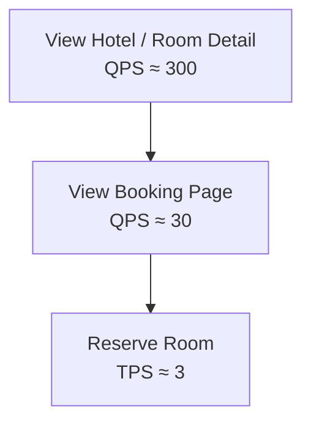
```mermaid
flowchart TB
    A[View Hotel / Room Detail<br/>QPS ≈ 300] --> B[View Booking Page<br/>QPS ≈ 30]
    B --> C[Reserve Room<br/>TPS ≈ 3]
```

Interview line:

> The system is read-heavy, but the reservation path requires strong consistency.

---

## 4. Core Design Idea

A hotel guest usually reserves a **room type**, not a specific room number.

Example:

```text
User books: King Room
Hotel assigns: Room 803 at check-in
```

So the inventory is tracked by:

```text
hotel_id + room_type_id + date
```

Not by:

```text
specific room_id
```

This is very important.

---

## 5. High-Level Architecture

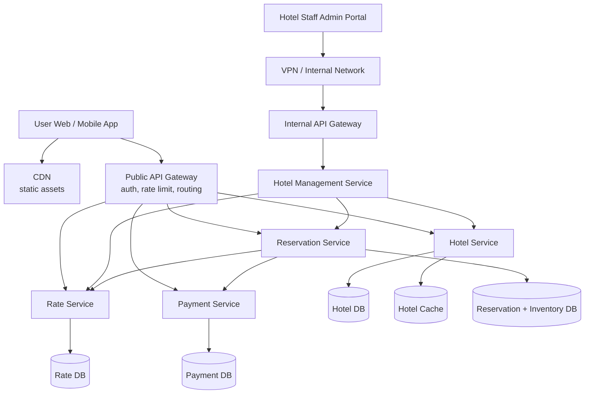
```mermaid
flowchart TB
    USER[User Web / Mobile App] --> CDN[CDN<br/>static assets]
    USER --> GW[Public API Gateway<br/>auth, rate limit, routing]

    ADMIN[Hotel Staff Admin Portal] --> VPN[VPN / Internal Network]
    VPN --> IGW[Internal API Gateway]

    GW --> HOTEL[Hotel Service]
    GW --> RATE[Rate Service]
    GW --> RES[Reservation Service]
    GW --> PAY[Payment Service]

    IGW --> HMS[Hotel Management Service]
    HMS --> HOTEL
    HMS --> RATE
    HMS --> RES

    HOTEL --> HDB[(Hotel DB)]
    HOTEL --> HCACHE[(Hotel Cache)]

    RATE --> RDB[(Rate DB)]

    RES --> RESDB[(Reservation + Inventory DB)]

    PAY --> PDB[(Payment DB)]

    RES --> RATE
    RES --> PAY
```

Main components:

| Component | Responsibility |
|---|---|
| CDN | Cache static assets |
| API Gateway | Auth, routing, rate limiting |
| Hotel Service | Hotel and room type details |
| Rate Service | Dynamic daily room prices |
| Reservation Service | Reservation and inventory management |
| Payment Service | Payment authorization/capture |
| Hotel Management Service | Internal admin operations |
| Reservation DB | Source of truth for booking and inventory |

---

## 6. API Design

### Hotel APIs

```http
GET    /v1/hotels/{hotelId}
POST   /v1/hotels
PUT    /v1/hotels/{hotelId}
DELETE /v1/hotels/{hotelId}
```

---

### Room APIs

```http
GET    /v1/hotels/{hotelId}/rooms/{roomId}
POST   /v1/hotels/{hotelId}/rooms
PUT    /v1/hotels/{hotelId}/rooms/{roomId}
DELETE /v1/hotels/{hotelId}/rooms/{roomId}
```

---

### Reservation APIs

```http
GET    /v1/reservations
GET    /v1/reservations/{reservationId}
POST   /v1/reservations
DELETE /v1/reservations/{reservationId}
```

---

## 7. Create Reservation API

```http
POST /v1/reservations
Content-Type: application/json
```

Request:

```json
{
  "reservationId": "13422445",
  "hotelId": "245",
  "roomTypeId": "KING",
  "roomCount": 3,
  "startDate": "2021-04-28",
  "endDate": "2021-04-30",
  "guestId": "guest-123"
}
```

Important:

```text
reservationId is used as the idempotency key.
```

Response:

```json
{
  "reservationId": "13422445",
  "status": "PENDING_PAYMENT",
  "totalAmount": 799.50
}
```

---

## 8. Reservation Status State Machine

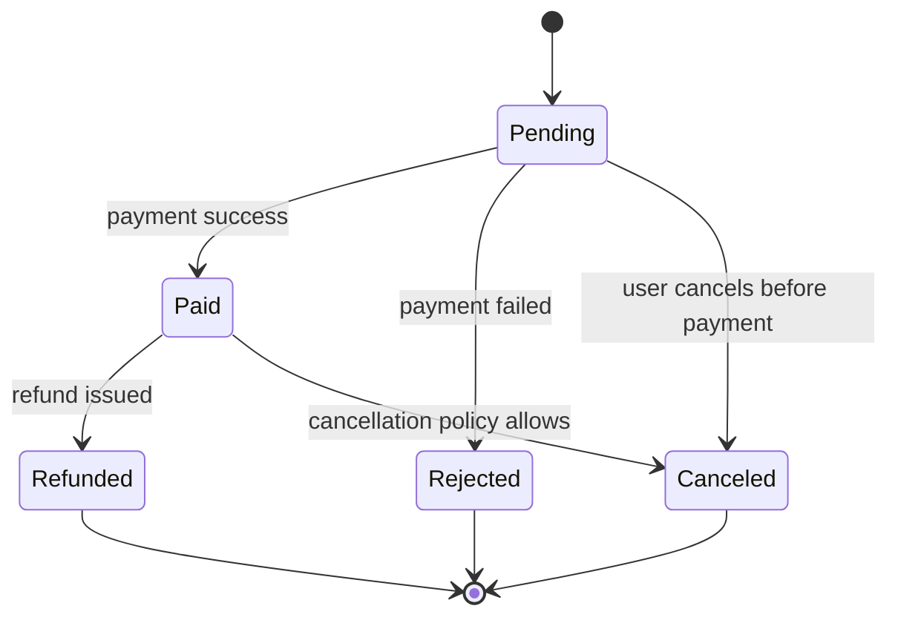
```mermaid
stateDiagram-v2
    [*] --> Pending
    Pending --> Paid: payment success
    Pending --> Rejected: payment failed
    Pending --> Canceled: user cancels before payment
    Paid --> Refunded: refund issued
    Paid --> Canceled: cancellation policy allows
    Refunded --> [*]
    Rejected --> [*]
    Canceled --> [*]
```

Common statuses:

```text
PENDING
PENDING_PAYMENT
PAID
REJECTED
CANCELED
REFUNDED
```

---

## 9. Data Model

### Core Tables

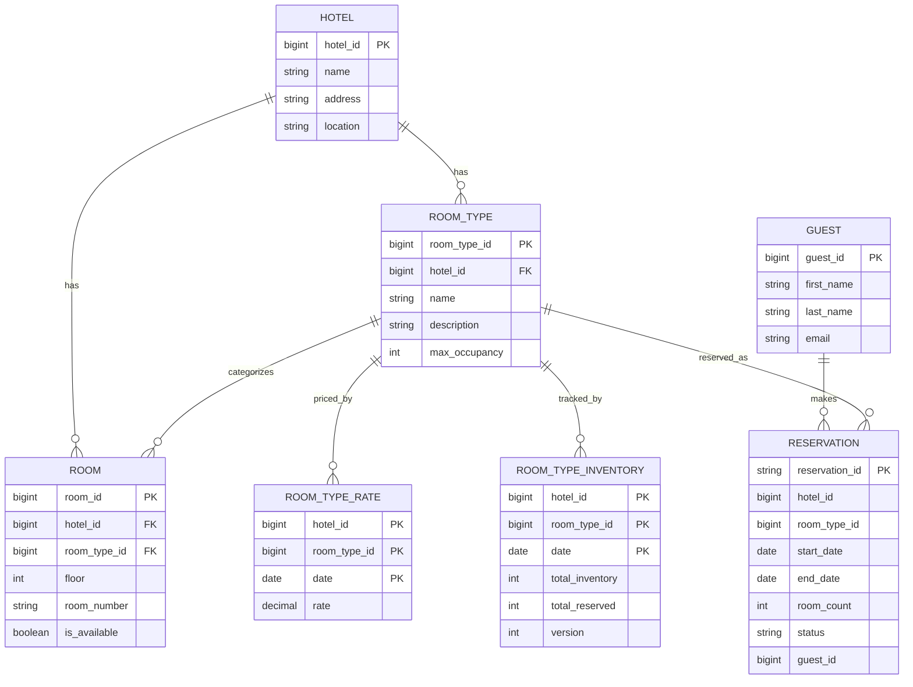
```mermaid
erDiagram
    HOTEL ||--o{ ROOM : has
    HOTEL ||--o{ ROOM_TYPE : has
    ROOM_TYPE ||--o{ ROOM : categorizes
    ROOM_TYPE ||--o{ ROOM_TYPE_RATE : priced_by
    ROOM_TYPE ||--o{ ROOM_TYPE_INVENTORY : tracked_by
    GUEST ||--o{ RESERVATION : makes
    ROOM_TYPE ||--o{ RESERVATION : reserved_as

    HOTEL {
        bigint hotel_id PK
        string name
        string address
        string location
    }

    ROOM_TYPE {
        bigint room_type_id PK
        bigint hotel_id FK
        string name
        string description
        int max_occupancy
    }

    ROOM {
        bigint room_id PK
        bigint hotel_id FK
        bigint room_type_id FK
        int floor
        string room_number
        boolean is_available
    }

    ROOM_TYPE_RATE {
        bigint hotel_id PK
        bigint room_type_id PK
        date date PK
        decimal rate
    }

    ROOM_TYPE_INVENTORY {
        bigint hotel_id PK
        bigint room_type_id PK
        date date PK
        int total_inventory
        int total_reserved
        int version
    }

    GUEST {
        bigint guest_id PK
        string first_name
        string last_name
        string email
    }

    RESERVATION {
        string reservation_id PK
        bigint hotel_id
        bigint room_type_id
        date start_date
        date end_date
        int room_count
        string status
        bigint guest_id
    }
```

---

## 10. Important Table: `room_type_inventory`

This table tracks room availability per room type per date.

| hotel_id | room_type_id | date | total_inventory | total_reserved |
|---:|---:|---|---:|---:|
| 211 | 1001 | 2021-06-01 | 100 | 80 |
| 211 | 1001 | 2021-06-02 | 100 | 82 |
| 211 | 1001 | 2021-06-03 | 100 | 86 |
| 211 | 1002 | 2021-06-01 | 200 | 16 |

Composite primary key:

```text
(hotel_id, room_type_id, date)
```

Why one row per date?

```text
Easy availability checks across date ranges.
Easy daily price/inventory management.
Easy cancellation updates.
```

---

## 11. Inventory Storage Estimate

Given:

```text
5,000 hotels
20 room types per hotel
2 years of future inventory
365 days/year
```

Rows:

```text
5,000 * 20 * 2 * 365 = 73,000,000 rows
```

73 million rows is manageable for a relational database, especially with indexing and partitioning.

---

## 12. Check Availability

SQL:

```sql
SELECT date, total_inventory, total_reserved
FROM room_type_inventory
WHERE hotel_id = :hotelId
  AND room_type_id = :roomTypeId
  AND date >= :startDate
  AND date < :endDate;
```

For every row:

```text
total_reserved + requested_rooms <= total_inventory
```

With 10% overbooking:

```text
total_reserved + requested_rooms <= total_inventory * 1.10
```

Important:

```text
Use endDate as exclusive.
If user stays Apr 28 to Apr 30, they occupy Apr 28 and Apr 29 nights.
```

---

## 13. Reservation Flow

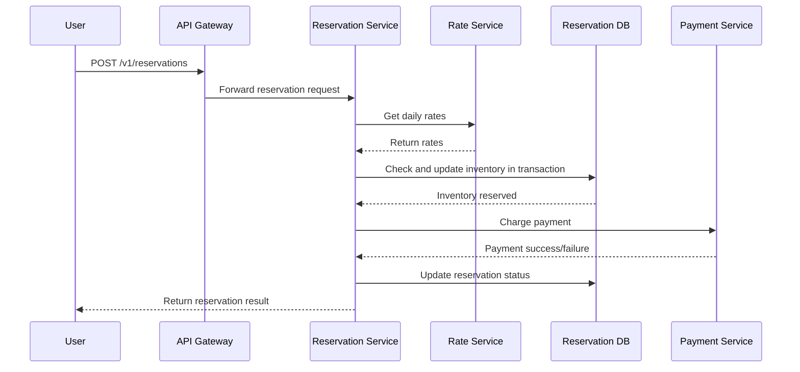
```mermaid
sequenceDiagram
    participant U as User
    participant API as API Gateway
    participant R as Reservation Service
    participant Rate as Rate Service
    participant DB as Reservation DB
    participant P as Payment Service

    U->>API: POST /v1/reservations
    API->>R: Forward reservation request
    R->>Rate: Get daily rates
    Rate-->>R: Return rates
    R->>DB: Check and update inventory in transaction
    DB-->>R: Inventory reserved
    R->>P: Charge payment
    P-->>R: Payment success/failure
    R->>DB: Update reservation status
    R-->>U: Return reservation result
```

---

## 14. Booking Transaction Flow

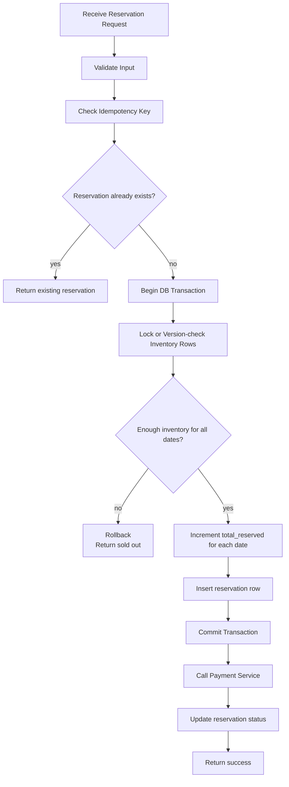
```mermaid
flowchart TB
    A[Receive Reservation Request] --> B[Validate Input]
    B --> C[Check Idempotency Key]
    C --> D{Reservation already exists?}

    D -->|yes| E[Return existing reservation]
    D -->|no| F[Begin DB Transaction]

    F --> G[Lock or Version-check Inventory Rows]
    G --> H{Enough inventory for all dates?}

    H -->|no| I[Rollback<br/>Return sold out]
    H -->|yes| J[Increment total_reserved for each date]

    J --> K[Insert reservation row]
    K --> L[Commit Transaction]
    L --> M[Call Payment Service]
    M --> N[Update reservation status]
    N --> O[Return success]
```

---

## 15. Double Booking Problem

Two major cases:

```text
1. Same user clicks "Book" multiple times.
2. Multiple users book the last available room at the same time.
```

---

## 16. Prevent Duplicate Reservation by Same User

Use idempotency key.

```text
reservation_id = idempotency key
```

Visual:

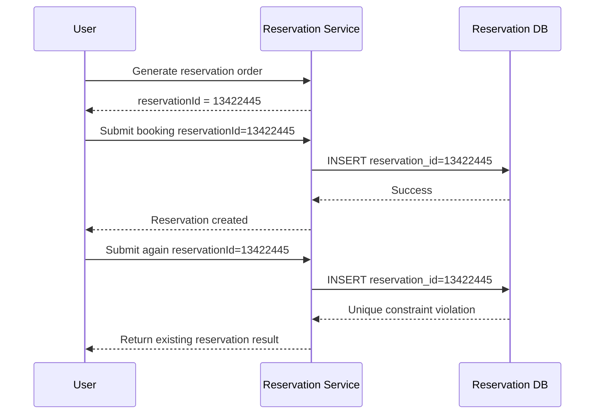
```mermaid
sequenceDiagram
    participant U as User
    participant R as Reservation Service
    participant DB as Reservation DB

    U->>R: Generate reservation order
    R-->>U: reservationId = 13422445

    U->>R: Submit booking reservationId=13422445
    R->>DB: INSERT reservation_id=13422445
    DB-->>R: Success
    R-->>U: Reservation created

    U->>R: Submit again reservationId=13422445
    R->>DB: INSERT reservation_id=13422445
    DB-->>R: Unique constraint violation
    R-->>U: Return existing reservation result
```

Database rule:

```sql
reservation_id VARCHAR(64) PRIMARY KEY
```

Interview line:

> Client-side button disabling helps UX, but server-side idempotency is required.

---

## 17. Race Condition: Last Room

Bad scenario:

```text
total_inventory = 100
total_reserved = 99
only 1 room left
User A and User B both see 1 room available
Both book successfully
```

Visual:

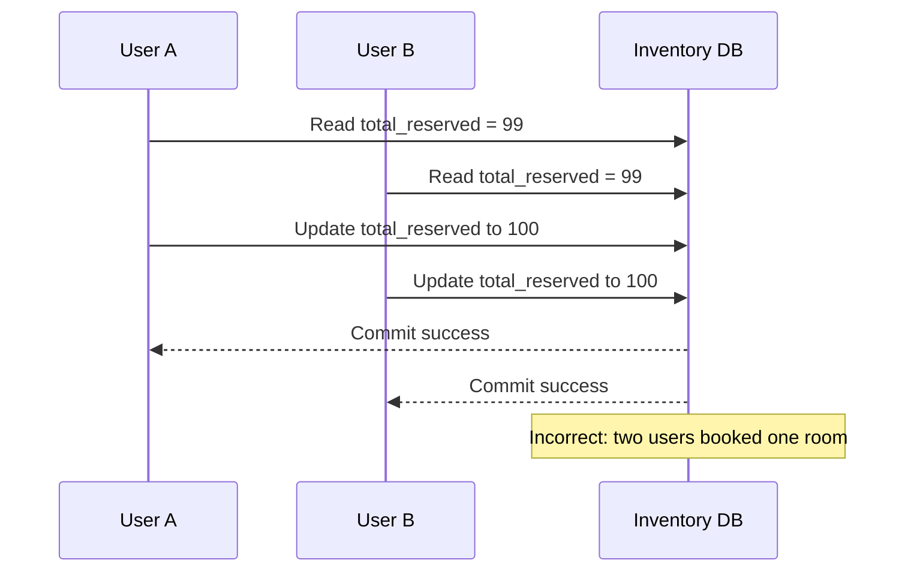
```mermaid
sequenceDiagram
    participant A as User A
    participant B as User B
    participant DB as Inventory DB

    A->>DB: Read total_reserved = 99
    B->>DB: Read total_reserved = 99

    A->>DB: Update total_reserved to 100
    B->>DB: Update total_reserved to 100

    DB-->>A: Commit success
    DB-->>B: Commit success

    Note over DB: Incorrect: two users booked one room
```

Need concurrency control.

---

## 18. Option 1 — Pessimistic Locking

Use row lock:

```sql
SELECT date, total_inventory, total_reserved
FROM room_type_inventory
WHERE hotel_id = :hotelId
  AND room_type_id = :roomTypeId
  AND date >= :startDate
  AND date < :endDate
FOR UPDATE;
```

Visual:

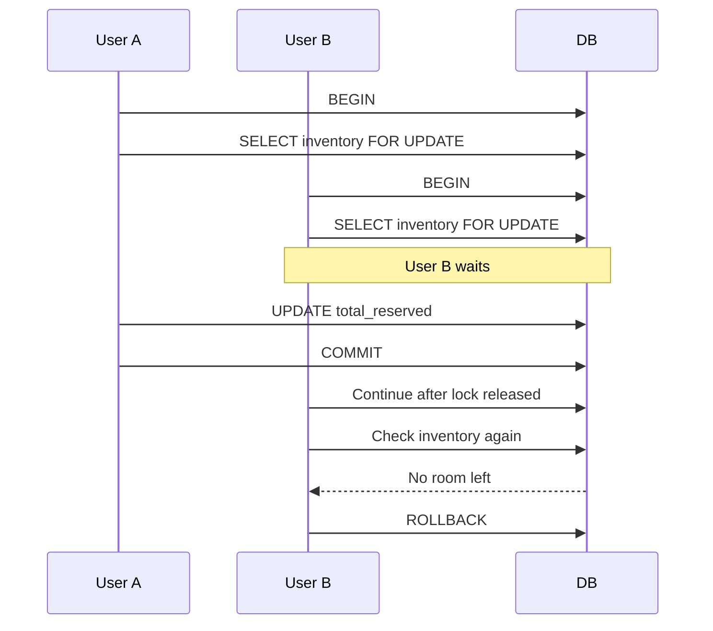
```mermaid
sequenceDiagram
    participant A as User A
    participant B as User B
    participant DB as DB

    A->>DB: BEGIN
    A->>DB: SELECT inventory FOR UPDATE
    B->>DB: BEGIN
    B->>DB: SELECT inventory FOR UPDATE
    Note over B,DB: User B waits

    A->>DB: UPDATE total_reserved
    A->>DB: COMMIT

    B->>DB: Continue after lock released
    B->>DB: Check inventory again
    DB-->>B: No room left
    B->>DB: ROLLBACK
```

Pros:

```text
simple
prevents conflict
good when contention is high
```

Cons:

```text
locks reduce throughput
deadlock risk
bad for long transactions
```

Recommendation:

```text
Use carefully; keep transaction short.
```

---

## 19. Option 2 — Optimistic Locking

Add `version` column to inventory table.

```sql
ALTER TABLE room_type_inventory ADD COLUMN version INT NOT NULL DEFAULT 0;
```

Update with version check:

```sql
UPDATE room_type_inventory
SET total_reserved = total_reserved + :roomCount,
    version = version + 1
WHERE hotel_id = :hotelId
  AND room_type_id = :roomTypeId
  AND date = :date
  AND version = :oldVersion
  AND total_reserved + :roomCount <= total_inventory * 1.10;
```

If affected rows = 0:

```text
retry or return sold out
```

Visual:

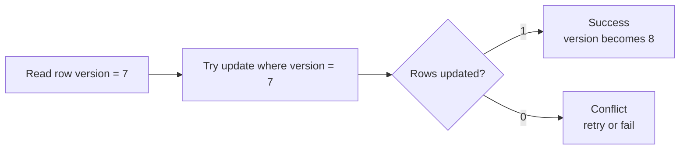
```mermaid
flowchart LR
    A[Read row version = 7] --> B[Try update where version = 7]
    B --> C{Rows updated?}
    C -->|1| D[Success<br/>version becomes 8]
    C -->|0| E[Conflict<br/>retry or fail]
```

Pros:

```text
no DB lock
good when conflicts are rare
```

Cons:

```text
many retries under high contention
bad UX if many users compete for last room
```

Recommendation:

```text
Good default for hotel reservations because average booking TPS is low.
```

---

## 20. Option 3 — Database Constraint

Add constraint:

```sql
ALTER TABLE room_type_inventory
ADD CONSTRAINT check_room_count
CHECK (total_inventory - total_reserved >= 0);
```

For 10% overbooking, this exact check depends on DB support for expressions. You may store:

```text
max_reservable = floor(total_inventory * 1.10)
```

Then constrain:

```sql
CHECK (total_reserved <= max_reservable)
```

Pros:

```text
simple
database enforces safety
```

Cons:

```text
failures happen at commit time
not all DBs support constraints equally
harder to version-control than app logic
```

---

## 21. Best Practical Approach

For this system:

```text
Use relational DB transaction.
Use reservation_id as idempotency key.
Use optimistic locking or conditional update for inventory.
Use DB constraints as final safety guard.
```

Best SQL style:

```sql
UPDATE room_type_inventory
SET total_reserved = total_reserved + :roomCount
WHERE hotel_id = :hotelId
  AND room_type_id = :roomTypeId
  AND date >= :startDate
  AND date < :endDate
  AND total_reserved + :roomCount <= total_inventory * 1.10;
```

Then verify:

```text
updated row count == number of nights
```

If not:

```text
rollback
```

---

## 22. Payment Flow

Two possible flows:

### Option A — Reserve inventory first, then payment

```text
1. Reserve inventory temporarily.
2. Charge payment.
3. Mark reservation paid.
4. If payment fails, release inventory.
```

Pros:

```text
prevents user from paying for unavailable room
```

Cons:

```text
inventory can be held by unpaid reservations
```

---

### Option B — Payment first, then reserve inventory

Pros:

```text
no unpaid inventory hold
```

Cons:

```text
user may pay, then room becomes unavailable
refund needed
```

Recommendation:

```text
Reserve inventory with short TTL, then charge payment.
```

Visual:

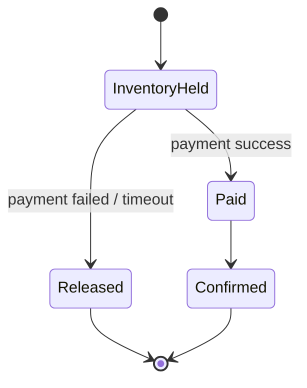
```mermaid
stateDiagram-v2
    [*] --> InventoryHeld
    InventoryHeld --> Paid: payment success
    InventoryHeld --> Released: payment failed / timeout
    Paid --> Confirmed
    Released --> [*]
    Confirmed --> [*]
```

---

## 23. Inventory Hold with Expiration

During checkout, hold rooms for a short time.

Example:

```text
Hold expires in 10 minutes.
```

Flow:

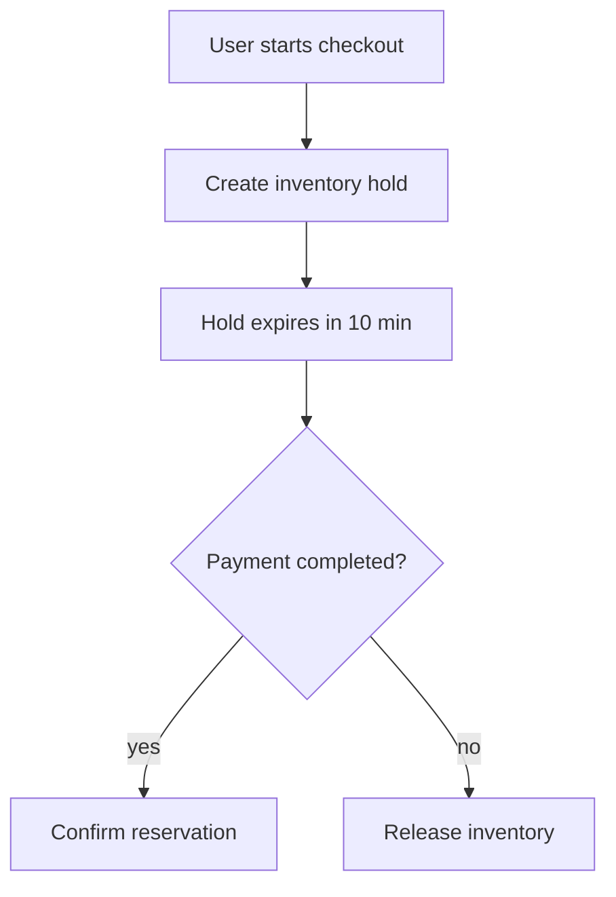
```mermaid
flowchart TB
    A[User starts checkout] --> B[Create inventory hold]
    B --> C[Hold expires in 10 min]
    C --> D{Payment completed?}
    D -->|yes| E[Confirm reservation]
    D -->|no| F[Release inventory]
```

This reduces the chance that payment succeeds but room reservation fails.

---

## 24. Cache Layer for Inventory Reads

Most users check availability but do not book.

Use Redis cache for availability reads.

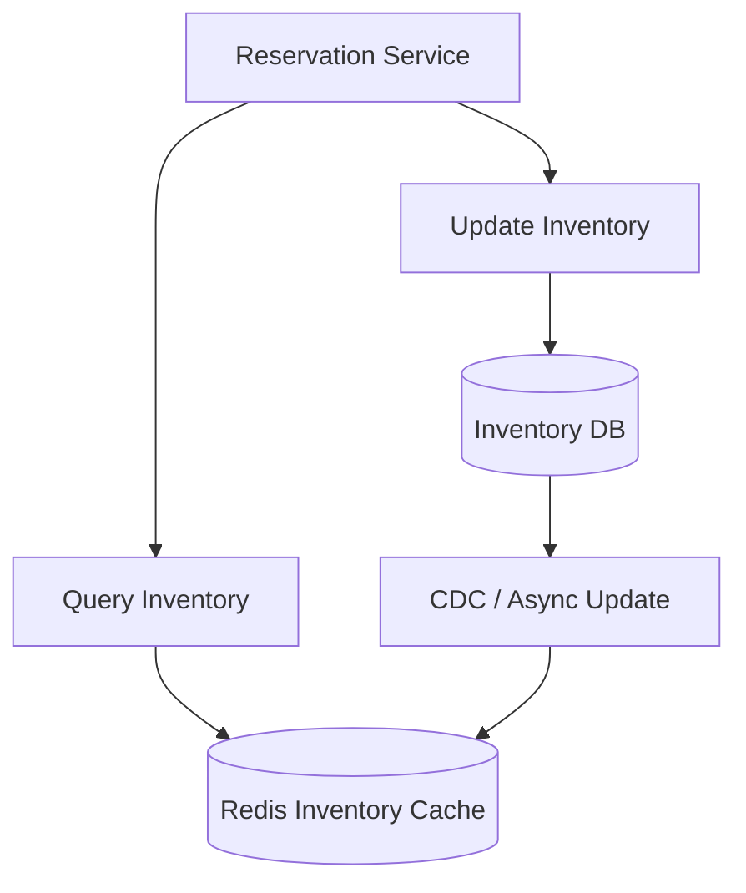
```mermaid
flowchart TB
    R[Reservation Service] --> Q[Query Inventory]
    Q --> C[(Redis Inventory Cache)]

    R --> U[Update Inventory]
    U --> DB[(Inventory DB)]
    DB --> CDC[CDC / Async Update]
    CDC --> C
```

Cache key:

```text
hotelId:roomTypeId:date
```

Example:

```text
245:KING:2021-04-28 -> available_count = 12
```

Important:

```text
Cache is not source of truth.
DB must re-check inventory during booking.
```

---

## 25. Cache Consistency

Write path:

```text
1. Update DB first.
2. Update cache asynchronously using CDC or app event.
3. During booking, always validate inventory in DB.
```

Possible inconsistency:

```text
Cache says room available.
DB says sold out.
```

Result:

```text
User sees availability but booking fails.
This is acceptable if rare.
```

Why acceptable?

```text
Correctness is protected by DB.
Cache only improves read performance.
```

---

## 26. Database Sharding

Most queries include `hotel_id`.

Shard by:

```text
hash(hotel_id) % number_of_shards
```

Visual:

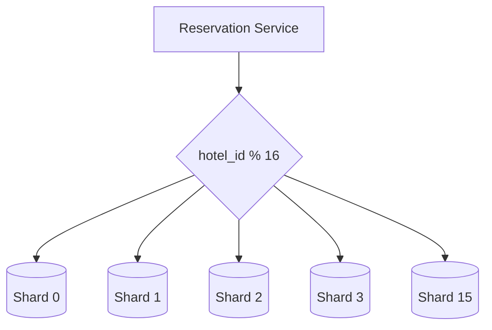
```mermaid
flowchart TB
    R[Reservation Service] --> ROUTE{hotel_id % 16}
    ROUTE --> S0[(Shard 0)]
    ROUTE --> S1[(Shard 1)]
    ROUTE --> S2[(Shard 2)]
    ROUTE --> S3[(Shard 3)]
    ROUTE --> SN[(Shard 15)]
```

Example:

```text
30,000 QPS / 16 shards = 1,875 QPS per shard
```

Why hotel_id?

```text
availability checks are hotel-specific
reservation creation is hotel-specific
admin operations are hotel-specific
```

---

## 27. Archiving Old Reservations

Current and future reservations are hot.

Historical reservations are cold.

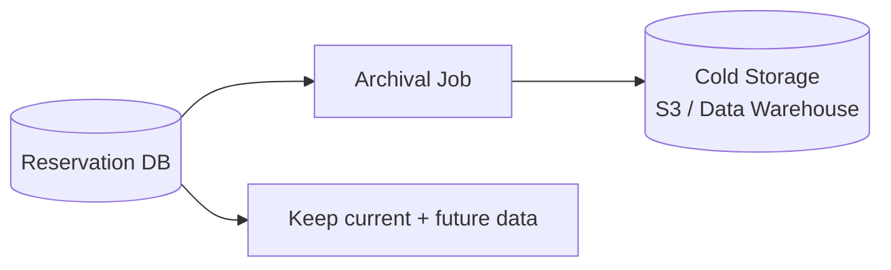
```mermaid
flowchart LR
    RDB[(Reservation DB)] --> ARCHIVE[Archival Job]
    ARCHIVE --> COLD[(Cold Storage<br/>S3 / Data Warehouse)]
    RDB --> HOT[Keep current + future data]
```

Policy:

```text
Keep active/current reservations in OLTP DB.
Move old reservations to cold storage or analytics DB.
```

---

## 28. Microservice Data Consistency

Two possible designs:

### Pragmatic Design

Reservation and inventory tables are in the same relational DB.

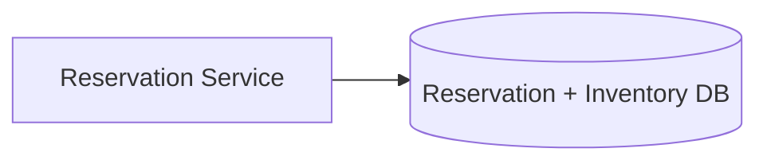
```mermaid
flowchart LR
    RES[Reservation Service] --> DB[(Reservation + Inventory DB)]
```

Pros:

```text
simple ACID transaction
easier to prevent double booking
recommended for interview
```

---

### Pure Microservice Design

Reservation and inventory have separate DBs.

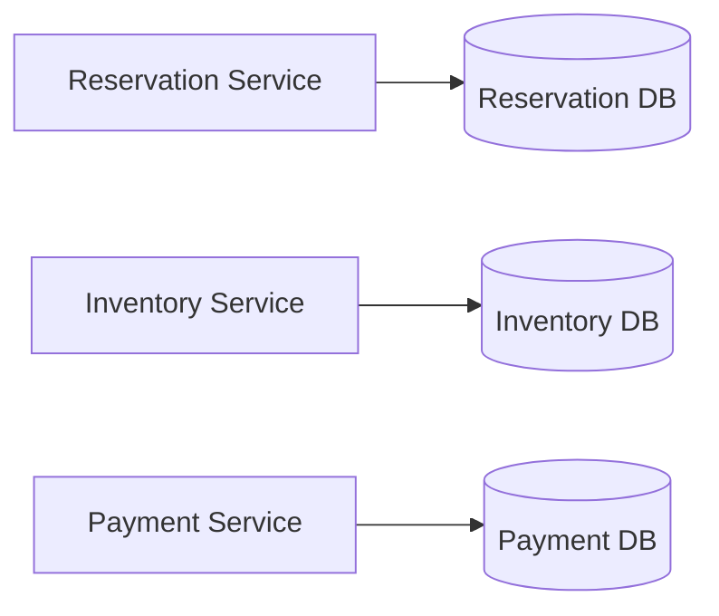
```mermaid
flowchart LR
    RES[Reservation Service] --> RDB[(Reservation DB)]
    INV[Inventory Service] --> IDB[(Inventory DB)]
    PAY[Payment Service] --> PDB[(Payment DB)]
```

Problem:

```text
One logical transaction spans multiple services.
A normal DB transaction cannot cover all services.
```

---

## 29. Saga Pattern

Use Saga if reservation, inventory, and payment are separate services.

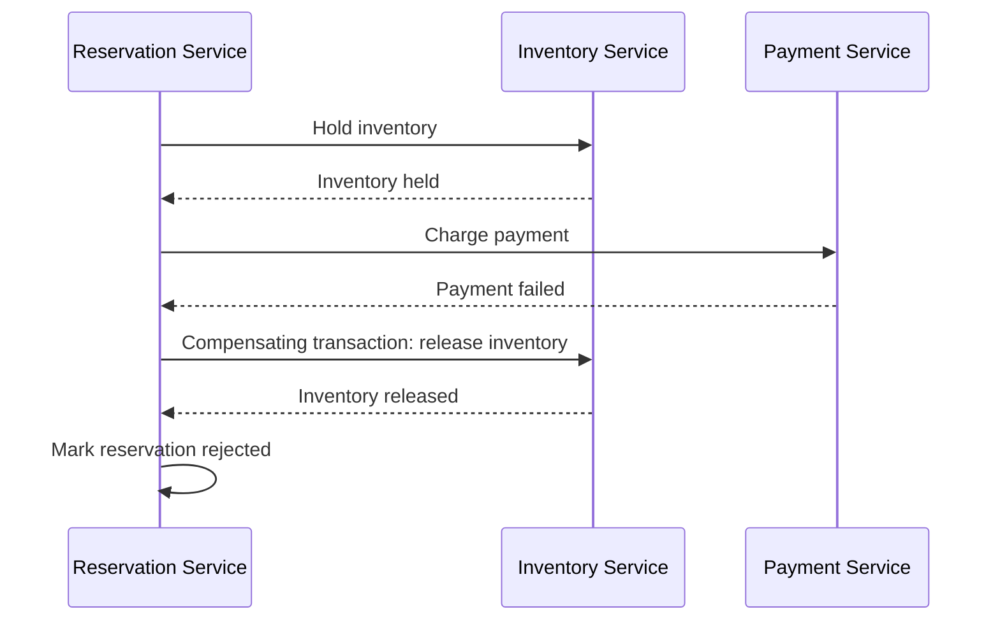
```mermaid
sequenceDiagram
    participant R as Reservation Service
    participant I as Inventory Service
    participant P as Payment Service

    R->>I: Hold inventory
    I-->>R: Inventory held

    R->>P: Charge payment
    P-->>R: Payment failed

    R->>I: Compensating transaction: release inventory
    I-->>R: Inventory released

    R->>R: Mark reservation rejected
```

Saga idea:

```text
Each step is a local transaction.
If a step fails, run compensating transactions.
```

Pros:

```text
works with microservices
high availability
```

Cons:

```text
eventual consistency
complex failure handling
harder reasoning
```

---

## 30. Two-Phase Commit

2PC guarantees atomic commit across services/databases.

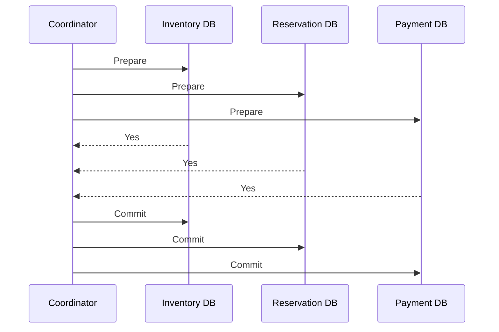
```mermaid
sequenceDiagram
    participant C as Coordinator
    participant I as Inventory DB
    participant R as Reservation DB
    participant P as Payment DB

    C->>I: Prepare
    C->>R: Prepare
    C->>P: Prepare

    I-->>C: Yes
    R-->>C: Yes
    P-->>C: Yes

    C->>I: Commit
    C->>R: Commit
    C->>P: Commit
```

Pros:

```text
strong consistency
```

Cons:

```text
blocking
slow
bad availability during failures
```

Recommendation:

```text
Avoid 2PC unless strong consistency across DBs is absolutely required.
```

---

## 31. Final Architecture

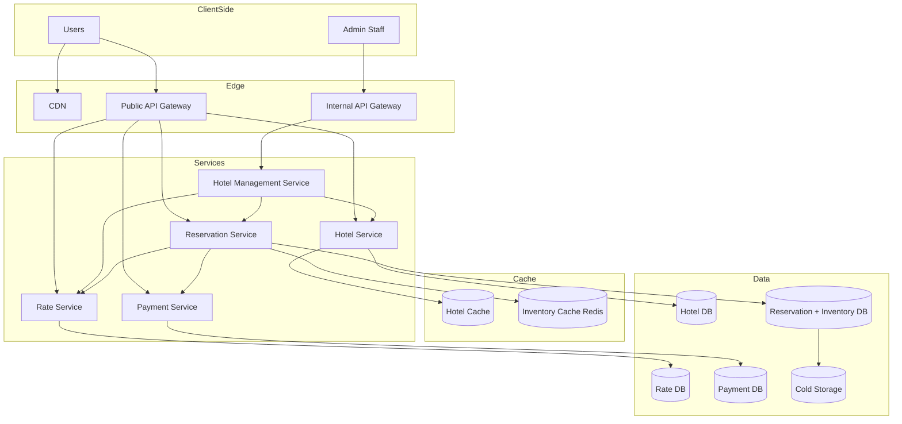
```mermaid
flowchart TB
    subgraph ClientSide
        U[Users]
        A[Admin Staff]
    end

    subgraph Edge
        CDN[CDN]
        PUB[Public API Gateway]
        INT[Internal API Gateway]
    end

    subgraph Services
        HOTEL[Hotel Service]
        RATE[Rate Service]
        RES[Reservation Service]
        PAY[Payment Service]
        MGMT[Hotel Management Service]
    end

    subgraph Cache
        HC[(Hotel Cache)]
        IC[(Inventory Cache Redis)]
    end

    subgraph Data
        HDB[(Hotel DB)]
        RDB[(Rate DB)]
        RESDB[(Reservation + Inventory DB)]
        PDB[(Payment DB)]
        COLD[(Cold Storage)]
    end

    U --> CDN
    U --> PUB
    A --> INT

    PUB --> HOTEL
    PUB --> RATE
    PUB --> RES
    PUB --> PAY

    INT --> MGMT
    MGMT --> HOTEL
    MGMT --> RATE
    MGMT --> RES

    HOTEL --> HC
    HOTEL --> HDB

    RATE --> RDB

    RES --> IC
    RES --> RESDB
    RES --> RATE
    RES --> PAY

    PAY --> PDB

    RESDB --> COLD
```

---

## 32. Java Code — Reservation Request

```java
import java.time.LocalDate;

public record ReservationRequest(
        String reservationId,
        long hotelId,
        long roomTypeId,
        int roomCount,
        LocalDate startDate,
        LocalDate endDate,
        long guestId
) {
    public ReservationRequest {
        if (!endDate.isAfter(startDate)) {
            throw new IllegalArgumentException("endDate must be after startDate");
        }
        if (roomCount <= 0) {
            throw new IllegalArgumentException("roomCount must be positive");
        }
    }
}
```

---

## 33. Java Code — Inventory Row

```java
import java.time.LocalDate;

public class InventoryRow {
    private final long hotelId;
    private final long roomTypeId;
    private final LocalDate date;
    private final int totalInventory;
    private int totalReserved;
    private int version;

    public InventoryRow(
            long hotelId,
            long roomTypeId,
            LocalDate date,
            int totalInventory,
            int totalReserved,
            int version
    ) {
        this.hotelId = hotelId;
        this.roomTypeId = roomTypeId;
        this.date = date;
        this.totalInventory = totalInventory;
        this.totalReserved = totalReserved;
        this.version = version;
    }

    public boolean canReserve(int roomCount, double overbookingMultiplier) {
        int maxReservable = (int) Math.floor(totalInventory * overbookingMultiplier);
        return totalReserved + roomCount <= maxReservable;
    }

    public void reserve(int roomCount) {
        this.totalReserved += roomCount;
        this.version += 1;
    }

    public LocalDate date() {
        return date;
    }

    public int version() {
        return version;
    }

    public int totalReserved() {
        return totalReserved;
    }
}
```

---

## 34. Java Code — Availability Check

```java
import java.time.LocalDate;
import java.util.List;

public class InventoryService {
    private static final double OVERBOOKING_MULTIPLIER = 1.10;

    public boolean hasAvailability(
            List<InventoryRow> rows,
            LocalDate startDate,
            LocalDate endDate,
            int roomCount
    ) {
        long nights = startDate.datesUntil(endDate).count();

        if (rows.size() != nights) {
            return false;
        }

        for (InventoryRow row : rows) {
            if (!row.canReserve(roomCount, OVERBOOKING_MULTIPLIER)) {
                return false;
            }
        }

        return true;
    }
}
```

---

## 35. Java Code — Idempotency Store

```java
import java.util.Map;
import java.util.concurrent.ConcurrentHashMap;

public class IdempotencyStore {
    private final Map<String, ReservationResult> store = new ConcurrentHashMap<>();

    public boolean exists(String reservationId) {
        return store.containsKey(reservationId);
    }

    public ReservationResult get(String reservationId) {
        return store.get(reservationId);
    }

    public void save(String reservationId, ReservationResult result) {
        store.putIfAbsent(reservationId, result);
    }
}

record ReservationResult(
        String reservationId,
        String status,
        String message
) {}
```

Production note:

```text
Use DB unique constraint or Redis SETNX with TTL.
In-memory map is only for learning.
```

---

## 36. Java Code — Simple Reservation Service

```java
import java.time.LocalDate;
import java.util.List;

public class ReservationService {
    private final InventoryService inventoryService = new InventoryService();
    private final IdempotencyStore idempotencyStore = new IdempotencyStore();

    public ReservationResult reserve(
            ReservationRequest request,
            List<InventoryRow> inventoryRows
    ) {
        // 1. Idempotency check
        if (idempotencyStore.exists(request.reservationId())) {
            return idempotencyStore.get(request.reservationId());
        }

        // 2. Check availability
        boolean available = inventoryService.hasAvailability(
                inventoryRows,
                request.startDate(),
                request.endDate(),
                request.roomCount()
        );

        if (!available) {
            ReservationResult result = new ReservationResult(
                    request.reservationId(),
                    "REJECTED",
                    "No rooms available"
            );
            idempotencyStore.save(request.reservationId(), result);
            return result;
        }

        // 3. Reserve inventory
        // In production this must happen inside a DB transaction.
        for (InventoryRow row : inventoryRows) {
            row.reserve(request.roomCount());
        }

        // 4. Save reservation
        ReservationResult result = new ReservationResult(
                request.reservationId(),
                "PENDING_PAYMENT",
                "Inventory reserved. Awaiting payment."
        );

        idempotencyStore.save(request.reservationId(), result);
        return result;
    }

    public static void main(String[] args) {
        LocalDate start = LocalDate.of(2021, 4, 28);
        LocalDate end = LocalDate.of(2021, 4, 30);

        List<InventoryRow> rows = List.of(
                new InventoryRow(245, 1001, start, 100, 99, 1),
                new InventoryRow(245, 1001, start.plusDays(1), 100, 98, 1)
        );

        ReservationRequest request = new ReservationRequest(
                "res-123",
                245,
                1001,
                1,
                start,
                end,
                9001
        );

        ReservationService service = new ReservationService();

        System.out.println(service.reserve(request, rows));
        System.out.println(service.reserve(request, rows)); // same result due to idempotency
    }
}
```

---

## 37. Java Code — Shard Router

```java
public class HotelShardRouter {
    private final int shardCount;

    public HotelShardRouter(int shardCount) {
        this.shardCount = shardCount;
    }

    public int shardForHotel(long hotelId) {
        return Math.floorMod(Long.hashCode(hotelId), shardCount);
    }

    public static void main(String[] args) {
        HotelShardRouter router = new HotelShardRouter(16);

        System.out.println("Hotel 245 -> shard " + router.shardForHotel(245));
        System.out.println("Hotel 999 -> shard " + router.shardForHotel(999));
    }
}
```

---

## 38. Production SQL — Safe Inventory Update

For each date, update only if capacity exists.

```sql
UPDATE room_type_inventory
SET total_reserved = total_reserved + :roomCount,
    version = version + 1
WHERE hotel_id = :hotelId
  AND room_type_id = :roomTypeId
  AND date = :date
  AND total_reserved + :roomCount <= FLOOR(total_inventory * 1.10);
```

Application rule:

```text
Run this for every night in one transaction.
If updated rows != number of nights, rollback.
```

Pseudo-transaction:

```sql
BEGIN;

-- for each date in [startDate, endDate)
UPDATE room_type_inventory
SET total_reserved = total_reserved + :roomCount
WHERE hotel_id = :hotelId
  AND room_type_id = :roomTypeId
  AND date = :date
  AND total_reserved + :roomCount <= FLOOR(total_inventory * 1.10);

-- verify all dates updated

INSERT INTO reservation (
    reservation_id,
    hotel_id,
    room_type_id,
    start_date,
    end_date,
    room_count,
    status,
    guest_id
) VALUES (
    :reservationId,
    :hotelId,
    :roomTypeId,
    :startDate,
    :endDate,
    :roomCount,
    'PENDING_PAYMENT',
    :guestId
);

COMMIT;
```

---

## 39. Common Failure Cases

| Failure | Handling |
|---|---|
| User double-clicks book | Idempotency key |
| Payment fails | Release inventory / mark rejected |
| Reservation DB write fails | Rollback transaction |
| Cache stale | DB final validation |
| Inventory service down | Retry / fail gracefully |
| Payment timeout | Pending state + async reconciliation |
| Admin changes inventory | Update DB + invalidate/update cache |
| Hot hotel during event | Shard, cache, queue, rate limit |

---

## 40. FAANG Interview Talking Points

1. Users reserve room types, not specific room IDs.
2. Inventory is tracked by `(hotel_id, room_type_id, date)`.
3. Reservation flow needs strong consistency.
4. Use relational DB because ACID matters.
5. Use `reservation_id` as idempotency key.
6. Use optimistic locking or conditional update to avoid double booking.
7. Use database constraint as final safety guard.
8. Use 10% overbooking by increasing max reservable inventory.
9. Cache hotel details and inventory reads.
10. Cache is not source of truth.
11. DB validates inventory before booking.
12. Shard reservation/inventory DB by `hotel_id`.
13. Archive old reservation history.
14. Keep reservation and inventory in same DB for simpler ACID transaction.
15. If using pure microservices, use Saga for eventual consistency.
16. Avoid 2PC unless absolutely required.
17. Hold inventory temporarily while payment is processed.
18. Use TTL for unpaid holds.
19. Use CDN for static hotel images and assets.
20. Use admin/internal APIs protected by VPN/auth.

---

## 41. One-Minute Interview Summary

> I would design the hotel reservation system as a read-heavy service with a strongly consistent reservation path. Users reserve a room type, not a physical room, so inventory is stored by `(hotel_id, room_type_id, date)`. Hotel and room information can be cached because it changes rarely. Reservation creation uses a relational database transaction to check and update inventory rows for every date in the stay, then inserts a reservation record. To prevent duplicate submissions, the reservation API accepts a `reservation_id` as an idempotency key. To prevent double booking, I would use conditional updates with optimistic locking or row-level locks, plus a database constraint as a safety guard. The system supports 10% overbooking by allowing reservations up to `1.1 * total_inventory`. For scale, shard by `hotel_id`, cache inventory reads in Redis, and keep the database as the source of truth. If services are fully separated, use Saga for eventual consistency, but for this problem I would keep reservation and inventory in the same DB for simpler ACID guarantees.

---

## 42. Quick Revision

```text
Core entity:
hotel_id + room_type_id + date

Important table:
room_type_inventory

Availability:
total_reserved + requested <= total_inventory * 1.10

Reservation consistency:
DB transaction + idempotency key

Duplicate click:
reservation_id unique constraint

Race condition:
optimistic locking / conditional update / SELECT FOR UPDATE

Read scaling:
CDN + hotel cache + inventory cache

Write scaling:
shard by hotel_id

Cache rule:
cache can be stale, DB is source of truth

Microservice consistency:
same DB for reservation+inventory is pragmatic
Saga if fully separated

Best phrase:
Hotel booking is read-heavy, but reservation creation must be strongly consistent.
```
