# 🚀 Production-Grade Spring Boot Application Template

> A complete reusable framework for creating new high-load Spring Boot applications with PostgreSQL, Redis, Kafka, Nginx, Docker, Kubernetes, observability, external configuration, async processing, resilience, and deployment automation.

---

## 0. What This Template Gives You

This template is designed to help you create a new application fast while still following production-grade patterns.

### Included

| Area | Included |
|---|---|
| API | Spring Boot REST API |
| Database | PostgreSQL |
| Cache | Redis |
| Async | Kafka producer and consumer |
| Load Balancer | Nginx |
| Local Runtime | Docker Compose |
| Cloud Runtime | Kubernetes manifests |
| Config | Environment variables, ConfigMap, Secret |
| Observability | Actuator, Prometheus metrics, Grafana-ready |
| Reliability | Health checks, readiness, liveness |
| Scalability | Horizontal Pod Autoscaler |
| CI/CD | GitHub Actions example |
| Testing | Unit, integration, Testcontainers-ready layout |
| Security baseline | CORS, validation, no hardcoded secrets |
| Expert patterns | Retry, DLQ concept, rate limiting, circuit breaker extension points |

---

# 1. Final Architecture

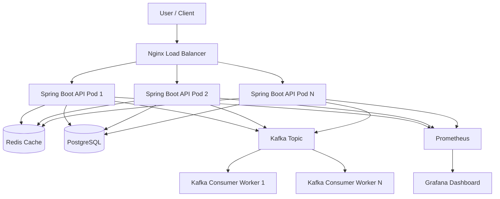
```mermaid
flowchart TD
    U[User / Client] --> NGINX[Nginx Load Balancer]

    NGINX --> API1[Spring Boot API Pod 1]
    NGINX --> API2[Spring Boot API Pod 2]
    NGINX --> API3[Spring Boot API Pod N]

    API1 --> REDIS[(Redis Cache)]
    API2 --> REDIS
    API3 --> REDIS

    API1 --> PG[(PostgreSQL)]
    API2 --> PG
    API3 --> PG

    API1 --> KAFKA[Kafka Topic]
    API2 --> KAFKA
    API3 --> KAFKA

    KAFKA --> WORKER1[Kafka Consumer Worker 1]
    KAFKA --> WORKER2[Kafka Consumer Worker N]

    API1 --> PROM[Prometheus]
    API2 --> PROM
    API3 --> PROM

    PROM --> GRAF[Grafana Dashboard]
```

---

# 2. Request Flow

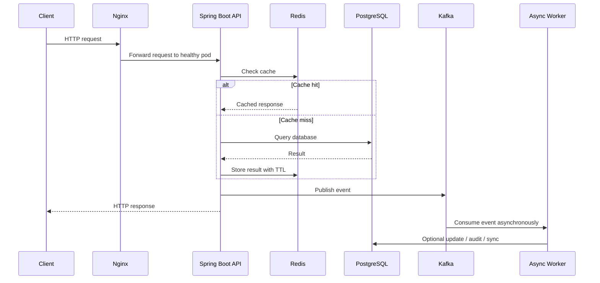
```mermaid
sequenceDiagram
    participant Client
    participant Nginx
    participant API as Spring Boot API
    participant Redis
    participant DB as PostgreSQL
    participant Kafka
    participant Worker as Async Worker

    Client->>Nginx: HTTP request
    Nginx->>API: Forward request to healthy pod
    API->>Redis: Check cache
    alt Cache hit
        Redis-->>API: Cached response
    else Cache miss
        API->>DB: Query database
        DB-->>API: Result
        API->>Redis: Store result with TTL
    end
    API->>Kafka: Publish event
    API-->>Client: HTTP response
    Kafka->>Worker: Consume event asynchronously
    Worker->>DB: Optional update / audit / sync
```

---

# 3. Repository Structure

```text
production-spring-template/
├── .github/
│   └── workflows/
│       └── ci.yml
├── docker/
│   ├── nginx/
│   │   └── nginx.conf
│   └── prometheus/
│       └── prometheus.yml
├── k8s/
│   ├── namespace.yaml
│   ├── configmap.yaml
│   ├── secret.example.yaml
│   ├── postgres.yaml
│   ├── redis.yaml
│   ├── kafka.yaml
│   ├── app-deployment.yaml
│   ├── app-service.yaml
│   ├── nginx-configmap.yaml
│   ├── nginx-deployment.yaml
│   ├── nginx-service.yaml
│   ├── hpa.yaml
│   └── prometheus-service-monitor.example.yaml
├── scripts/
│   ├── build.sh
│   ├── run-local.sh
│   ├── deploy-k8s.sh
│   └── load-test-k6.js
├── src/
│   ├── main/
│   │   ├── java/com/company/app/
│   │   │   ├── Application.java
│   │   │   ├── common/
│   │   │   │   ├── ApiResponse.java
│   │   │   │   ├── GlobalExceptionHandler.java
│   │   │   │   └── NotFoundException.java
│   │   │   ├── config/
│   │   │   │   ├── AsyncConfig.java
│   │   │   │   ├── CacheConfig.java
│   │   │   │   ├── CorsConfig.java
│   │   │   │   ├── KafkaConfig.java
│   │   │   │   └── WebConfig.java
│   │   │   ├── product/
│   │   │   │   ├── Product.java
│   │   │   │   ├── ProductController.java
│   │   │   │   ├── ProductCreateRequest.java
│   │   │   │   ├── ProductResponse.java
│   │   │   │   ├── ProductRepository.java
│   │   │   │   ├── ProductService.java
│   │   │   │   └── ProductMapper.java
│   │   │   ├── events/
│   │   │   │   ├── ProductCreatedEvent.java
│   │   │   │   ├── EventProducer.java
│   │   │   │   └── ProductEventConsumer.java
│   │   │   └── health/
│   │   │       └── ReadinessController.java
│   │   └── resources/
│   │       ├── application.yml
│   │       ├── application-dev.yml
│   │       ├── application-prod.yml
│   │       └── db/migration/
│   │           └── V1__init.sql
│   └── test/
│       └── java/com/company/app/
│           ├── ProductServiceTest.java
│           └── ProductIntegrationTest.java
├── .dockerignore
├── .env.example
├── Dockerfile
├── docker-compose.yml
├── pom.xml
└── README.md
```

---

# 4. Tech Decisions

| Need | Choice | Why |
|---|---|---|
| Main framework | Spring Boot | Mature, production-ready |
| Java version | Java 21 | LTS, modern performance |
| Database | PostgreSQL | Reliable relational DB |
| Cache | Redis | Fast lookup cache |
| Async | Kafka | Durable event streaming |
| Load balancing | Nginx | Simple and battle-tested |
| Deployment | Kubernetes | Scaling and orchestration |
| Metrics | Actuator + Prometheus | Standard observability stack |
| DB migration | Flyway | Repeatable schema changes |
| Validation | Jakarta Validation | Safer API input |
| Testing | JUnit + Testcontainers | Production-like integration tests |

---

# 5. Maven Configuration

## `pom.xml`

```xml
<project xmlns="http://maven.apache.org/POM/4.0.0"
         xmlns:xsi="http://www.w3.org/2001/XMLSchema-instance"
         xsi:schemaLocation="http://maven.apache.org/POM/4.0.0 https://maven.apache.org/xsd/maven-4.0.0.xsd">

    <modelVersion>4.0.0</modelVersion>

    <groupId>com.company</groupId>
    <artifactId>production-spring-template</artifactId>
    <version>1.0.0</version>
    <name>production-spring-template</name>

    <properties>
        <java.version>21</java.version>
        <spring.boot.version>3.5.14</spring.boot.version>
    </properties>

    <parent>
        <groupId>org.springframework.boot</groupId>
        <artifactId>spring-boot-starter-parent</artifactId>
        <version>3.5.14</version>
        <relativePath/>
    </parent>

    <dependencies>
        <!-- Web API -->
        <dependency>
            <groupId>org.springframework.boot</groupId>
            <artifactId>spring-boot-starter-web</artifactId>
        </dependency>

        <!-- Validation -->
        <dependency>
            <groupId>org.springframework.boot</groupId>
            <artifactId>spring-boot-starter-validation</artifactId>
        </dependency>

        <!-- Database -->
        <dependency>
            <groupId>org.springframework.boot</groupId>
            <artifactId>spring-boot-starter-data-jpa</artifactId>
        </dependency>
        <dependency>
            <groupId>org.postgresql</groupId>
            <artifactId>postgresql</artifactId>
            <scope>runtime</scope>
        </dependency>

        <!-- Flyway migrations -->
        <dependency>
            <groupId>org.flywaydb</groupId>
            <artifactId>flyway-core</artifactId>
        </dependency>
        <dependency>
            <groupId>org.flywaydb</groupId>
            <artifactId>flyway-database-postgresql</artifactId>
        </dependency>

        <!-- Redis -->
        <dependency>
            <groupId>org.springframework.boot</groupId>
            <artifactId>spring-boot-starter-data-redis</artifactId>
        </dependency>

        <!-- Kafka -->
        <dependency>
            <groupId>org.springframework.kafka</groupId>
            <artifactId>spring-kafka</artifactId>
        </dependency>

        <!-- Observability -->
        <dependency>
            <groupId>org.springframework.boot</groupId>
            <artifactId>spring-boot-starter-actuator</artifactId>
        </dependency>
        <dependency>
            <groupId>io.micrometer</groupId>
            <artifactId>micrometer-registry-prometheus</artifactId>
        </dependency>

        <!-- Optional resilience extension -->
        <dependency>
            <groupId>io.github.resilience4j</groupId>
            <artifactId>resilience4j-spring-boot3</artifactId>
            <version>2.3.0</version>
        </dependency>

        <!-- Test -->
        <dependency>
            <groupId>org.springframework.boot</groupId>
            <artifactId>spring-boot-starter-test</artifactId>
            <scope>test</scope>
        </dependency>
        <dependency>
            <groupId>org.springframework.kafka</groupId>
            <artifactId>spring-kafka-test</artifactId>
            <scope>test</scope>
        </dependency>
        <dependency>
            <groupId>org.testcontainers</groupId>
            <artifactId>postgresql</artifactId>
            <scope>test</scope>
        </dependency>
        <dependency>
            <groupId>org.testcontainers</groupId>
            <artifactId>kafka</artifactId>
            <scope>test</scope>
        </dependency>
    </dependencies>

    <build>
        <plugins>
            <!-- Build container image if needed -->
            <plugin>
                <groupId>org.springframework.boot</groupId>
                <artifactId>spring-boot-maven-plugin</artifactId>
            </plugin>

            <!-- Fail build on old Java -->
            <plugin>
                <groupId>org.apache.maven.plugins</groupId>
                <artifactId>maven-enforcer-plugin</artifactId>
                <version>3.5.0</version>
                <executions>
                    <execution>
                        <id>enforce-java</id>
                        <goals>
                            <goal>enforce</goal>
                        </goals>
                        <configuration>
                            <rules>
                                <requireJavaVersion>
                                    <version>[21,)</version>
                                </requireJavaVersion>
                            </rules>
                        </configuration>
                    </execution>
                </executions>
            </plugin>
        </plugins>
    </build>

</project>
```

---

# 6. Application Configuration

## `src/main/resources/application.yml`

```yaml
server:
  port: ${SERVER_PORT:8080}
  shutdown: graceful
  tomcat:
    threads:
      max: ${TOMCAT_MAX_THREADS:300}
      min-spare: ${TOMCAT_MIN_THREADS:50}
    accept-count: ${TOMCAT_ACCEPT_COUNT:1000}
    max-connections: ${TOMCAT_MAX_CONNECTIONS:10000}

spring:
  application:
    name: ${APP_NAME:production-spring-template}

  lifecycle:
    timeout-per-shutdown-phase: 30s

  datasource:
    url: jdbc:postgresql://${POSTGRES_HOST:localhost}:${POSTGRES_PORT:5432}/${POSTGRES_DB:appdb}
    username: ${POSTGRES_USER:appuser}
    password: ${POSTGRES_PASSWORD:apppassword}
    hikari:
      maximum-pool-size: ${DB_POOL_MAX:30}
      minimum-idle: ${DB_POOL_MIN:5}
      connection-timeout: 3000
      idle-timeout: 600000
      max-lifetime: 1800000

  jpa:
    open-in-view: false
    hibernate:
      ddl-auto: validate
    properties:
      hibernate:
        jdbc:
          batch_size: 50
        order_inserts: true
        order_updates: true

  flyway:
    enabled: true
    locations: classpath:db/migration

  data:
    redis:
      host: ${REDIS_HOST:localhost}
      port: ${REDIS_PORT:6379}
      timeout: 2s
      lettuce:
        pool:
          max-active: ${REDIS_POOL_MAX:50}
          max-idle: 20
          min-idle: 5

  kafka:
    bootstrap-servers: ${KAFKA_BOOTSTRAP_SERVERS:localhost:9092}
    producer:
      acks: all
      retries: 5
      properties:
        enable.idempotence: true
        max.in.flight.requests.per.connection: 5
    consumer:
      group-id: ${KAFKA_CONSUMER_GROUP:product-workers}
      auto-offset-reset: earliest
      enable-auto-commit: false
    listener:
      ack-mode: manual_immediate
      concurrency: ${KAFKA_CONCURRENCY:3}

management:
  endpoints:
    web:
      exposure:
        include: health,info,metrics,prometheus,loggers
  endpoint:
    health:
      probes:
        enabled: true
      show-details: when_authorized
  metrics:
    tags:
      application: ${spring.application.name}

logging:
  level:
    root: INFO
    com.company.app: INFO
```

## `application-dev.yml`

```yaml
spring:
  jpa:
    show-sql: true

logging:
  level:
    com.company.app: DEBUG
    org.hibernate.SQL: DEBUG
```

## `application-prod.yml`

```yaml
spring:
  jpa:
    show-sql: false

logging:
  level:
    root: INFO
```

---

# 7. Database Migration

## `src/main/resources/db/migration/V1__init.sql`

```sql
CREATE TABLE products (
    id BIGSERIAL PRIMARY KEY,
    name VARCHAR(255) NOT NULL,
    price NUMERIC(12, 2) NOT NULL,
    status VARCHAR(50) NOT NULL DEFAULT 'ACTIVE',
    created_at TIMESTAMP NOT NULL DEFAULT NOW(),
    updated_at TIMESTAMP NOT NULL DEFAULT NOW()
);

CREATE INDEX idx_products_name ON products(name);
CREATE INDEX idx_products_status ON products(status);
CREATE INDEX idx_products_created_at ON products(created_at);
```

---

# 8. Core Java Code

## `Application.java`

```java
package com.company.app;

import org.springframework.boot.SpringApplication;
import org.springframework.boot.autoconfigure.SpringBootApplication;

@SpringBootApplication
public class Application {
    public static void main(String[] args) {
        SpringApplication.run(Application.class, args);
    }
}
```

---

## `common/ApiResponse.java`

```java
package com.company.app.common;

import java.time.Instant;

public record ApiResponse<T>(
        boolean success,
        T data,
        String error,
        Instant timestamp
) {
    public static <T> ApiResponse<T> ok(T data) {
        return new ApiResponse<>(true, data, null, Instant.now());
    }

    public static <T> ApiResponse<T> fail(String error) {
        return new ApiResponse<>(false, null, error, Instant.now());
    }
}
```

---

## `common/NotFoundException.java`

```java
package com.company.app.common;

public class NotFoundException extends RuntimeException {
    public NotFoundException(String message) {
        super(message);
    }
}
```

---

## `common/GlobalExceptionHandler.java`

```java
package com.company.app.common;

import jakarta.validation.ConstraintViolationException;
import org.springframework.http.HttpStatus;
import org.springframework.web.bind.MethodArgumentNotValidException;
import org.springframework.web.bind.annotation.*;

@RestControllerAdvice
public class GlobalExceptionHandler {

    @ExceptionHandler(NotFoundException.class)
    @ResponseStatus(HttpStatus.NOT_FOUND)
    public ApiResponse<Void> handleNotFound(NotFoundException ex) {
        return ApiResponse.fail(ex.getMessage());
    }

    @ExceptionHandler(MethodArgumentNotValidException.class)
    @ResponseStatus(HttpStatus.BAD_REQUEST)
    public ApiResponse<Void> handleValidation(MethodArgumentNotValidException ex) {
        String message = ex.getBindingResult()
                .getFieldErrors()
                .stream()
                .findFirst()
                .map(error -> error.getField() + ": " + error.getDefaultMessage())
                .orElse("Validation failed");

        return ApiResponse.fail(message);
    }

    @ExceptionHandler(ConstraintViolationException.class)
    @ResponseStatus(HttpStatus.BAD_REQUEST)
    public ApiResponse<Void> handleConstraint(ConstraintViolationException ex) {
        return ApiResponse.fail(ex.getMessage());
    }

    @ExceptionHandler(Exception.class)
    @ResponseStatus(HttpStatus.INTERNAL_SERVER_ERROR)
    public ApiResponse<Void> handleGeneric(Exception ex) {
        return ApiResponse.fail("Internal server error");
    }
}
```

---

# 9. Product Module

## `product/Product.java`

```java
package com.company.app.product;

import jakarta.persistence.*;
import java.math.BigDecimal;
import java.time.Instant;

@Entity
@Table(name = "products")
public class Product {

    public enum Status {
        ACTIVE,
        INACTIVE
    }

    @Id
    @GeneratedValue(strategy = GenerationType.IDENTITY)
    private Long id;

    @Column(nullable=false)
    private String name;

    @Column(nullable=false, precision = 12, scale = 2)
    private BigDecimal price;

    @Enumerated(EnumType.STRING)
    @Column(nullable=false)
    private Status status = Status.ACTIVE;

    @Column(nullable=false, updatable=false)
    private Instant createdAt = Instant.now();

    @Column(nullable=false)
    private Instant updatedAt = Instant.now();

    @PreUpdate
    void onUpdate() {
        this.updatedAt = Instant.now();
    }

    public Long getId() { return id; }
    public String getName() { return name; }
    public BigDecimal getPrice() { return price; }
    public Status getStatus() { return status; }
    public Instant getCreatedAt() { return createdAt; }
    public Instant getUpdatedAt() { return updatedAt; }

    public void setName(String name) { this.name = name; }
    public void setPrice(BigDecimal price) { this.price = price; }
    public void setStatus(Status status) { this.status = status; }
}
```

---

## `product/ProductCreateRequest.java`

```java
package com.company.app.product;

import jakarta.validation.constraints.DecimalMin;
import jakarta.validation.constraints.NotBlank;
import jakarta.validation.constraints.NotNull;

import java.math.BigDecimal;

public record ProductCreateRequest(
        @NotBlank(message = "name is required")
        String name,

        @NotNull(message = "price is required")
        @DecimalMin(value = "0.01", message = "price must be greater than zero")
        BigDecimal price
) {}
```

---

## `product/ProductResponse.java`

```java
package com.company.app.product;

import java.math.BigDecimal;
import java.time.Instant;

public record ProductResponse(
        Long id,
        String name,
        BigDecimal price,
        String status,
        Instant createdAt
) {}
```

---

## `product/ProductMapper.java`

```java
package com.company.app.product;

public class ProductMapper {
    private ProductMapper() {}

    public static ProductResponse toResponse(Product product) {
        return new ProductResponse(
                product.getId(),
                product.getName(),
                product.getPrice(),
                product.getStatus().name(),
                product.getCreatedAt()
        );
    }
}
```

---

## `product/ProductRepository.java`

```java
package com.company.app.product;

import org.springframework.data.domain.Page;
import org.springframework.data.domain.Pageable;
import org.springframework.data.jpa.repository.JpaRepository;

public interface ProductRepository extends JpaRepository<Product, Long> {
    Page<Product> findByStatus(Product.Status status, Pageable pageable);
}
```

---

## `events/ProductCreatedEvent.java`

```java
package com.company.app.events;

import java.math.BigDecimal;
import java.time.Instant;

public record ProductCreatedEvent(
        Long productId,
        String name,
        BigDecimal price,
        Instant occurredAt
) {}
```

---

## `events/EventProducer.java`

```java
package com.company.app.events;

import org.springframework.kafka.core.KafkaTemplate;
import org.springframework.stereotype.Component;

@Component
public class EventProducer {

    public static final String PRODUCT_CREATED_TOPIC = "product-created";

    private final KafkaTemplate<String, ProductCreatedEvent> kafkaTemplate;

    public EventProducer(KafkaTemplate<String, ProductCreatedEvent> kafkaTemplate) {
        this.kafkaTemplate = kafkaTemplate;
    }

    public void productCreated(ProductCreatedEvent event) {
        kafkaTemplate.send(PRODUCT_CREATED_TOPIC, event.productId().toString(), event);
    }
}
```

---

## `events/ProductEventConsumer.java`

```java
package com.company.app.events;

import org.apache.kafka.clients.consumer.ConsumerRecord;
import org.springframework.kafka.annotation.KafkaListener;
import org.springframework.kafka.support.Acknowledgment;
import org.springframework.stereotype.Component;

@Component
public class ProductEventConsumer {

    @KafkaListener(topics = EventProducer.PRODUCT_CREATED_TOPIC)
    public void handleProductCreated(
            ConsumerRecord<String, ProductCreatedEvent> record,
            Acknowledgment ack
    ) {
        try {
            ProductCreatedEvent event = record.value();

            // Async work belongs here:
            // - send email
            // - update search index
            // - call external service
            // - audit event
            // - generate report

            System.out.println("Processed product-created event: " + event.productId());

            ack.acknowledge();
        } catch (Exception ex) {
            // In production:
            // - retry
            // - publish to dead-letter topic
            // - alert if repeated failure
            throw ex;
        }
    }
}
```

---

## `product/ProductService.java`

```java
package com.company.app.product;

import com.company.app.common.NotFoundException;
import com.company.app.events.EventProducer;
import com.company.app.events.ProductCreatedEvent;
import org.springframework.cache.annotation.CacheEvict;
import org.springframework.cache.annotation.Cacheable;
import org.springframework.data.domain.*;
import org.springframework.stereotype.Service;
import org.springframework.transaction.annotation.Transactional;

import java.time.Instant;

@Service
public class ProductService {

    private final ProductRepository repository;
    private final EventProducer eventProducer;

    public ProductService(ProductRepository repository, EventProducer eventProducer) {
        this.repository = repository;
        this.eventProducer = eventProducer;
    }

    @Transactional
    public ProductResponse create(ProductCreateRequest request) {
        Product product = new Product();
        product.setName(request.name());
        product.setPrice(request.price());

        Product saved = repository.save(product);

        eventProducer.productCreated(new ProductCreatedEvent(
                saved.getId(),
                saved.getName(),
                saved.getPrice(),
                Instant.now()
        ));

        return ProductMapper.toResponse(saved);
    }

    @Transactional(readOnly = true)
    @Cacheable(value = "products", key = "#id")
    public ProductResponse getById(Long id) {
        Product product = repository.findById(id)
                .orElseThrow(() -> new NotFoundException("Product not found: " + id));

        return ProductMapper.toResponse(product);
    }

    @Transactional(readOnly = true)
    public Page<ProductResponse> list(int page, int size) {
        Pageable pageable = PageRequest.of(
                Math.max(page, 0),
                Math.min(size, 100),
                Sort.by(Sort.Direction.DESC, "createdAt")
        );

        return repository.findByStatus(Product.Status.ACTIVE, pageable)
                .map(ProductMapper::toResponse);
    }

    @Transactional
    @CacheEvict(value = "products", key = "#id")
    public void deactivate(Long id) {
        Product product = repository.findById(id)
                .orElseThrow(() -> new NotFoundException("Product not found: " + id));

        product.setStatus(Product.Status.INACTIVE);
    }
}
```

---

## `product/ProductController.java`

```java
package com.company.app.product;

import com.company.app.common.ApiResponse;
import jakarta.validation.Valid;
import jakarta.validation.constraints.Max;
import jakarta.validation.constraints.Min;
import org.springframework.data.domain.Page;
import org.springframework.validation.annotation.Validated;
import org.springframework.web.bind.annotation.*;

@RestController
@RequestMapping("/api/v1/products")
@Validated
public class ProductController {

    private final ProductService service;

    public ProductController(ProductService service) {
        this.service = service;
    }

    @PostMapping
    public ApiResponse<ProductResponse> create(@Valid @RequestBody ProductCreateRequest request) {
        return ApiResponse.ok(service.create(request));
    }

    @GetMapping("/{id}")
    public ApiResponse<ProductResponse> get(@PathVariable Long id) {
        return ApiResponse.ok(service.getById(id));
    }

    @GetMapping
    public ApiResponse<Page<ProductResponse>> list(
            @RequestParam(defaultValue = "0") @Min(0) int page,
            @RequestParam(defaultValue = "20") @Min(1) @Max(100) int size
    ) {
        return ApiResponse.ok(service.list(page, size));
    }

    @DeleteMapping("/{id}")
    public ApiResponse<Void> deactivate(@PathVariable Long id) {
        service.deactivate(id);
        return ApiResponse.ok(null);
    }
}
```

---

# 10. Configuration Classes

## `config/CacheConfig.java`

```java
package com.company.app.config;

import org.springframework.cache.CacheManager;
import org.springframework.cache.annotation.EnableCaching;
import org.springframework.context.annotation.*;
import org.springframework.data.redis.cache.*;
import org.springframework.data.redis.connection.RedisConnectionFactory;

import java.time.Duration;

@Configuration
@EnableCaching
public class CacheConfig {

    @Bean
    CacheManager cacheManager(RedisConnectionFactory connectionFactory) {
        RedisCacheConfiguration config = RedisCacheConfiguration
                .defaultCacheConfig()
                .entryTtl(Duration.ofMinutes(10))
                .disableCachingNullValues();

        return RedisCacheManager
                .builder(connectionFactory)
                .cacheDefaults(config)
                .build();
    }
}
```

---

## `config/KafkaConfig.java`

```java
package com.company.app.config;

import com.company.app.events.ProductCreatedEvent;
import org.apache.kafka.clients.admin.NewTopic;
import org.apache.kafka.clients.producer.ProducerConfig;
import org.apache.kafka.common.serialization.StringSerializer;
import org.springframework.context.annotation.*;
import org.springframework.kafka.config.TopicBuilder;
import org.springframework.kafka.core.*;
import org.springframework.kafka.support.serializer.JsonSerializer;

import java.util.HashMap;
import java.util.Map;

@Configuration
public class KafkaConfig {

    @Bean
    NewTopic productCreatedTopic() {
        return TopicBuilder.name("product-created")
                .partitions(6)
                .replicas(1)
                .build();
    }
}
```

---

## `config/CorsConfig.java`

```java
package com.company.app.config;

import org.springframework.context.annotation.*;
import org.springframework.web.cors.*;
import org.springframework.web.cors.UrlBasedCorsConfigurationSource;
import org.springframework.web.filter.CorsFilter;

import java.util.List;

@Configuration
public class CorsConfig {

    @Bean
    CorsFilter corsFilter() {
        CorsConfiguration config = new CorsConfiguration();
        config.setAllowedOrigins(List.of("*"));
        config.setAllowedMethods(List.of("GET", "POST", "PUT", "PATCH", "DELETE", "OPTIONS"));
        config.setAllowedHeaders(List.of("*"));
        config.setMaxAge(3600L);

        UrlBasedCorsConfigurationSource source = new UrlBasedCorsConfigurationSource();
        source.registerCorsConfiguration("/api/**", config);

        return new CorsFilter(source);
    }
}
```

> Production note: replace `*` with your real frontend domains.

---

# 11. Docker Setup

## `.dockerignore`

```text
target
.git
.idea
.vscode
*.iml
.DS_Store
```

## `Dockerfile`

```dockerfile
FROM eclipse-temurin:21-jdk AS build
WORKDIR /workspace

COPY pom.xml .
COPY src ./src

RUN ./mvnw clean package -DskipTests || mvn clean package -DskipTests

FROM eclipse-temurin:21-jre
WORKDIR /app

COPY --from=build /workspace/target/*.jar app.jar

EXPOSE 8080

ENTRYPOINT ["java", \
    "-XX:+UseG1GC", \
    "-XX:MaxRAMPercentage=75", \
    "-XX:+ExitOnOutOfMemoryError", \
    "-jar", "app.jar"]
```

---

# 12. Docker Compose

## `.env.example`

```env
POSTGRES_DB=appdb
POSTGRES_USER=appuser
POSTGRES_PASSWORD=apppassword

REDIS_HOST=redis
POSTGRES_HOST=postgres
KAFKA_BOOTSTRAP_SERVERS=kafka:9092

SPRING_PROFILES_ACTIVE=dev
```

## `docker-compose.yml`

```yaml
services:
  app1:
    build: .
    container_name: spring-app-1
    environment:
      SPRING_PROFILES_ACTIVE: dev
      POSTGRES_HOST: postgres
      POSTGRES_DB: appdb
      POSTGRES_USER: appuser
      POSTGRES_PASSWORD: apppassword
      REDIS_HOST: redis
      KAFKA_BOOTSTRAP_SERVERS: kafka:9092
      SERVER_PORT: 8080
    depends_on:
      - postgres
      - redis
      - kafka

  app2:
    build: .
    container_name: spring-app-2
    environment:
      SPRING_PROFILES_ACTIVE: dev
      POSTGRES_HOST: postgres
      POSTGRES_DB: appdb
      POSTGRES_USER: appuser
      POSTGRES_PASSWORD: apppassword
      REDIS_HOST: redis
      KAFKA_BOOTSTRAP_SERVERS: kafka:9092
      SERVER_PORT: 8080
    depends_on:
      - postgres
      - redis
      - kafka

  app3:
    build: .
    container_name: spring-app-3
    environment:
      SPRING_PROFILES_ACTIVE: dev
      POSTGRES_HOST: postgres
      POSTGRES_DB: appdb
      POSTGRES_USER: appuser
      POSTGRES_PASSWORD: apppassword
      REDIS_HOST: redis
      KAFKA_BOOTSTRAP_SERVERS: kafka:9092
      SERVER_PORT: 8080
    depends_on:
      - postgres
      - redis
      - kafka

  nginx:
    image: nginx:1.27
    container_name: nginx-lb
    ports:
      - "80:80"
    volumes:
      - ./docker/nginx/nginx.conf:/etc/nginx/nginx.conf:ro
    depends_on:
      - app1
      - app2
      - app3

  postgres:
    image: postgres:16
    container_name: postgres
    environment:
      POSTGRES_DB: appdb
      POSTGRES_USER: appuser
      POSTGRES_PASSWORD: apppassword
    ports:
      - "5432:5432"
    volumes:
      - postgres-data:/var/lib/postgresql/data

  redis:
    image: redis:7
    container_name: redis
    ports:
      - "6379:6379"

  kafka:
    image: apache/kafka:3.8.0
    container_name: kafka
    ports:
      - "9092:9092"
    environment:
      KAFKA_NODE_ID: 1
      KAFKA_PROCESS_ROLES: broker,controller
      KAFKA_LISTENERS: PLAINTEXT://:9092,CONTROLLER://:9093
      KAFKA_ADVERTISED_LISTENERS: PLAINTEXT://kafka:9092
      KAFKA_CONTROLLER_QUORUM_VOTERS: 1@kafka:9093
      KAFKA_CONTROLLER_LISTENER_NAMES: CONTROLLER

  prometheus:
    image: prom/prometheus:v2.54.1
    container_name: prometheus
    ports:
      - "9090:9090"
    volumes:
      - ./docker/prometheus/prometheus.yml:/etc/prometheus/prometheus.yml:ro

volumes:
  postgres-data:
```

---

# 13. Nginx Load Balancer

## `docker/nginx/nginx.conf`

```nginx
events {
    worker_connections 8192;
}

http {
    upstream spring_api {
        least_conn;
        server app1:8080 max_fails=3 fail_timeout=10s;
        server app2:8080 max_fails=3 fail_timeout=10s;
        server app3:8080 max_fails=3 fail_timeout=10s;
    }

    server {
        listen 80;

        client_max_body_size 10m;

        location / {
            proxy_pass http://spring_api;
            proxy_http_version 1.1;

            proxy_set_header Host $host;
            proxy_set_header X-Real-IP $remote_addr;
            proxy_set_header X-Forwarded-For $proxy_add_x_forwarded_for;
            proxy_set_header X-Forwarded-Proto $scheme;

            proxy_connect_timeout 3s;
            proxy_send_timeout 30s;
            proxy_read_timeout 30s;
        }

        location /health {
            proxy_pass http://spring_api/actuator/health;
        }
    }
}
```

---

# 14. Prometheus Local Config

## `docker/prometheus/prometheus.yml`

```yaml
global:
  scrape_interval: 15s

scrape_configs:
  - job_name: spring-api
    metrics_path: /actuator/prometheus
    static_configs:
      - targets:
          - app1:8080
          - app2:8080
          - app3:8080
```

---

# 15. Run Locally

```bash
docker compose up --build
```

Create product:

```bash
curl -X POST http://localhost/api/v1/products \
  -H "Content-Type: application/json" \
  -d '{"name":"Laptop","price":1200.50}'
```

Get product:

```bash
curl http://localhost/api/v1/products/1
```

List products:

```bash
curl "http://localhost/api/v1/products?page=0&size=20"
```

Health:

```bash
curl http://localhost/actuator/health
```

Prometheus metrics:

```bash
curl http://localhost/actuator/prometheus
```

---

# 16. Kubernetes Deployment

This section explains **why each Kubernetes file exists**, **how the files are related**, and **how traffic/configuration flows through the cluster**.

Kubernetes deployment is not one file because each file has a different responsibility.

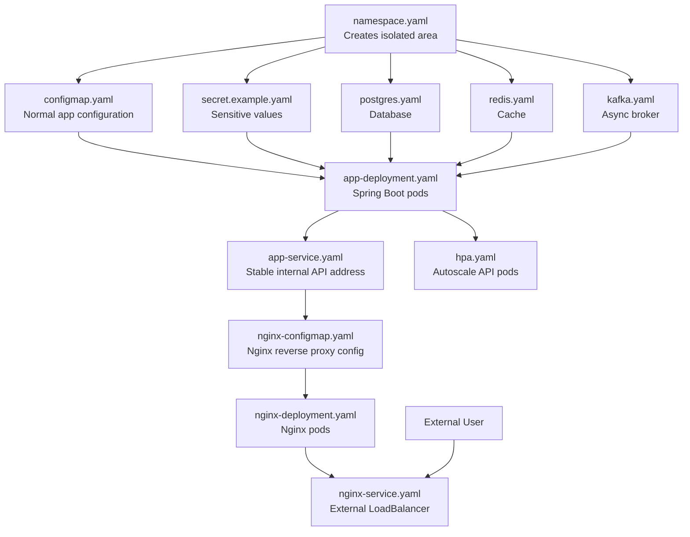
```mermaid
flowchart TD
    NS[namespace.yaml<br/>Creates isolated area] --> CM[configmap.yaml<br/>Normal app configuration]
    NS --> SEC[secret.example.yaml<br/>Sensitive values]
    NS --> PG[postgres.yaml<br/>Database]
    NS --> REDIS[redis.yaml<br/>Cache]
    NS --> KAFKA[kafka.yaml<br/>Async broker]
    CM --> APP[app-deployment.yaml<br/>Spring Boot pods]
    SEC --> APP
    PG --> APP
    REDIS --> APP
    KAFKA --> APP
    APP --> APPSVC[app-service.yaml<br/>Stable internal API address]
    APP --> HPA[hpa.yaml<br/>Autoscale API pods]
    APPSVC --> NGINXCM[nginx-configmap.yaml<br/>Nginx reverse proxy config]
    NGINXCM --> NGINXDEP[nginx-deployment.yaml<br/>Nginx pods]
    NGINXDEP --> NGINXSVC[nginx-service.yaml<br/>External LoadBalancer]
    USER[External User] --> NGINXSVC
```

---

## 16.1 Why These Kubernetes Files Are Created

| File | Kubernetes Object | Purpose | Why It Exists |
|---|---|---|---|
| `namespace.yaml` | Namespace | Creates isolated app environment | Keeps all resources grouped and easier to manage |
| `configmap.yaml` | ConfigMap | Stores non-secret app config | Lets you change config without rebuilding Docker image |
| `secret.example.yaml` | Secret | Stores sensitive values | Keeps passwords outside source code and Docker image |
| `postgres.yaml` | StatefulSet + Service | Runs demo PostgreSQL | Provides database for local/dev Kubernetes testing |
| `redis.yaml` | Deployment + Service | Runs demo Redis | Provides cache service for fast lookups |
| `kafka.yaml` | Deployment + Service | Runs demo Kafka | Provides async event processing |
| `app-deployment.yaml` | Deployment | Runs Spring Boot pods | Creates scalable stateless application instances |
| `app-service.yaml` | Service | Stable internal address for app pods | Other pods can call `spring-api:8080` |
| `hpa.yaml` | HorizontalPodAutoscaler | Autoscaling | Adds/removes API pods based on CPU load |
| `nginx-configmap.yaml` | ConfigMap | Stores Nginx config | Allows Nginx routing/load balancing rules to be externalized |
| `nginx-deployment.yaml` | Deployment | Runs Nginx pods | Reverse proxy in front of Spring Boot API |
| `nginx-service.yaml` | LoadBalancer Service | Public entrypoint | Lets external users reach the app |

---

## 16.2 File Relationship Flow

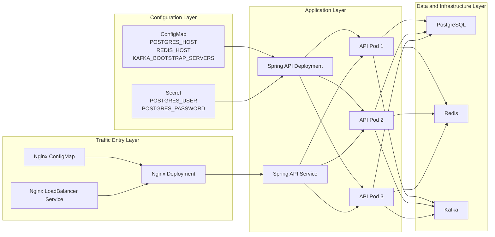
```mermaid
flowchart LR
    subgraph Config["Configuration Layer"]
        CM[ConfigMap<br/>POSTGRES_HOST<br/>REDIS_HOST<br/>KAFKA_BOOTSTRAP_SERVERS]
        SEC[Secret<br/>POSTGRES_USER<br/>POSTGRES_PASSWORD]
    end

    subgraph Data["Data and Infrastructure Layer"]
        PG[PostgreSQL]
        REDIS[Redis]
        KAFKA[Kafka]
    end

    subgraph App["Application Layer"]
        APPDEP[Spring API Deployment]
        POD1[API Pod 1]
        POD2[API Pod 2]
        POD3[API Pod 3]
        APPSVC[Spring API Service]
    end

    subgraph Edge["Traffic Entry Layer"]
        NGINXCM[Nginx ConfigMap]
        NGINXDEP[Nginx Deployment]
        NGINXSVC[Nginx LoadBalancer Service]
    end

    CM --> APPDEP
    SEC --> APPDEP

    APPDEP --> POD1
    APPDEP --> POD2
    APPDEP --> POD3

    POD1 --> PG
    POD1 --> REDIS
    POD1 --> KAFKA

    POD2 --> PG
    POD2 --> REDIS
    POD2 --> KAFKA

    POD3 --> PG
    POD3 --> REDIS
    POD3 --> KAFKA

    APPSVC --> POD1
    APPSVC --> POD2
    APPSVC --> POD3

    NGINXCM --> NGINXDEP
    NGINXDEP --> APPSVC
    NGINXSVC --> NGINXDEP
```

---

## 16.3 Deployment Order

Recommended order:

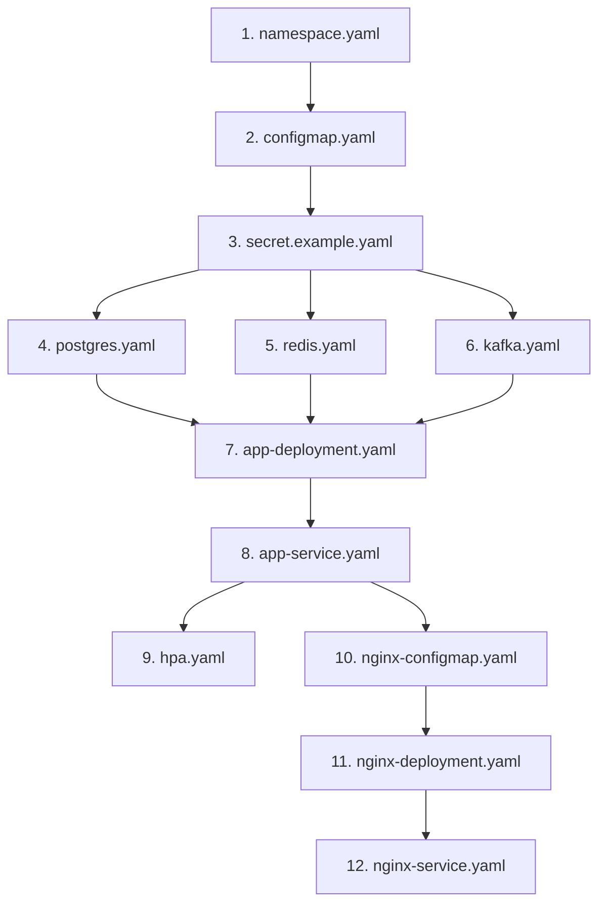
```mermaid
flowchart TD
    A[1. namespace.yaml] --> B[2. configmap.yaml]
    B --> C[3. secret.example.yaml]
    C --> D[4. postgres.yaml]
    C --> E[5. redis.yaml]
    C --> F[6. kafka.yaml]
    D --> G[7. app-deployment.yaml]
    E --> G
    F --> G
    G --> H[8. app-service.yaml]
    H --> I[9. hpa.yaml]
    H --> J[10. nginx-configmap.yaml]
    J --> K[11. nginx-deployment.yaml]
    K --> L[12. nginx-service.yaml]
```

### Why this order matters

| Step | Reason |
|---|---|
| Namespace first | Other objects are created inside it |
| ConfigMap and Secret before app | App needs environment variables |
| Postgres/Redis/Kafka before app | App depends on them |
| Deployment before Service | Service needs pods to route to |
| App Service before Nginx | Nginx proxies to `spring-api:8080` |
| Nginx Service last | External traffic should enter after app path is ready |

Important: Kubernetes does not guarantee that dependencies are fully ready just because files are applied first. The app must still handle retrying connections.

---

## 16.4 Runtime Traffic Flow

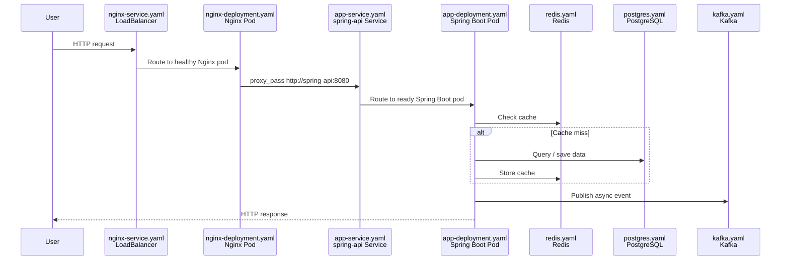
```mermaid
sequenceDiagram
    participant User
    participant NginxLB as nginx-service.yaml<br/>LoadBalancer
    participant NginxPod as nginx-deployment.yaml<br/>Nginx Pod
    participant AppSvc as app-service.yaml<br/>spring-api Service
    participant AppPod as app-deployment.yaml<br/>Spring Boot Pod
    participant Redis as redis.yaml<br/>Redis
    participant Postgres as postgres.yaml<br/>PostgreSQL
    participant Kafka as kafka.yaml<br/>Kafka

    User->>NginxLB: HTTP request
    NginxLB->>NginxPod: Route to healthy Nginx pod
    NginxPod->>AppSvc: proxy_pass http://spring-api:8080
    AppSvc->>AppPod: Route to ready Spring Boot pod
    AppPod->>Redis: Check cache
    alt Cache miss
        AppPod->>Postgres: Query / save data
        AppPod->>Redis: Store cache
    end
    AppPod->>Kafka: Publish async event
    AppPod-->>User: HTTP response
```

---

## 16.5 Configuration Flow

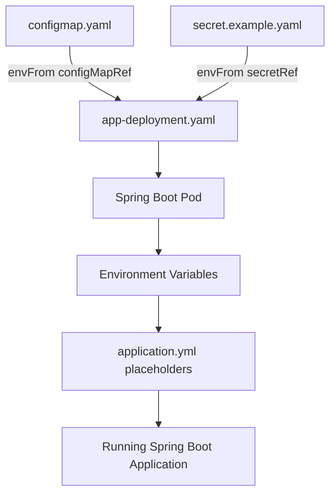
```mermaid
flowchart TD
    CM[configmap.yaml] -->|envFrom configMapRef| APPDEP[app-deployment.yaml]
    SEC[secret.example.yaml] -->|envFrom secretRef| APPDEP
    APPDEP --> POD[Spring Boot Pod]
    POD --> ENV[Environment Variables]
    ENV --> APPYML[application.yml placeholders]
    APPYML --> RUNNING[Running Spring Boot Application]
```

Example:

In `configmap.yaml`:

```yaml
POSTGRES_HOST: postgres
POSTGRES_DB: appdb
```

In `secret.example.yaml`:

```yaml
POSTGRES_USER: appuser
POSTGRES_PASSWORD: change-me
```

In `application.yml`:

```yaml
spring:
  datasource:
    url: jdbc:postgresql://${POSTGRES_HOST:localhost}:5432/${POSTGRES_DB:appdb}
    username: ${POSTGRES_USER:appuser}
    password: ${POSTGRES_PASSWORD:apppassword}
```

At runtime, Spring Boot sees:

```text
jdbc:postgresql://postgres:5432/appdb
```

---

## 16.6 Label and Selector Relationship

Labels are how Kubernetes connects Services to Pods.

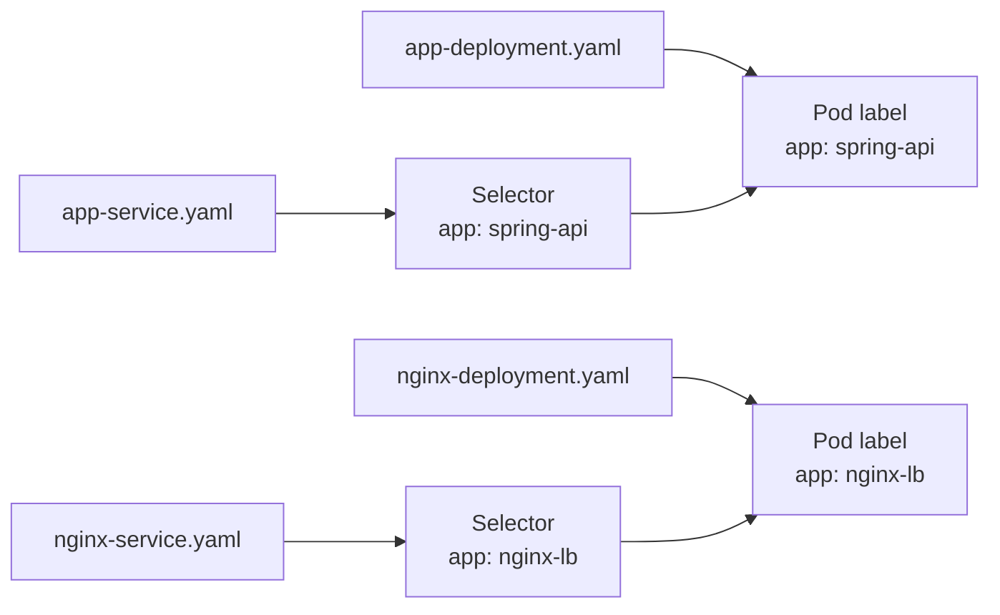
```mermaid
flowchart LR
    APPDEP[app-deployment.yaml] --> PODLABEL[Pod label<br/>app: spring-api]
    APPSVC[app-service.yaml] --> SELECTOR[Selector<br/>app: spring-api]
    SELECTOR --> PODLABEL
    NGINX[nginx-deployment.yaml] --> NGINXLABEL[Pod label<br/>app: nginx-lb]
    NGINXSVC[nginx-service.yaml] --> NGINXSELECTOR[Selector<br/>app: nginx-lb]
    NGINXSELECTOR --> NGINXLABEL
```

If selector and label do not match, the Service will not send traffic to the pods.

Correct example:

```yaml
# Pod label
labels:
  app: spring-api

# Service selector
selector:
  app: spring-api
```

Wrong example:

```yaml
# Pod label
labels:
  app: spring-api

# Service selector
selector:
  app: api
```

Result:

```text
Service has no endpoints.
Traffic fails.
```

---

## 16.7 Health Check Flow

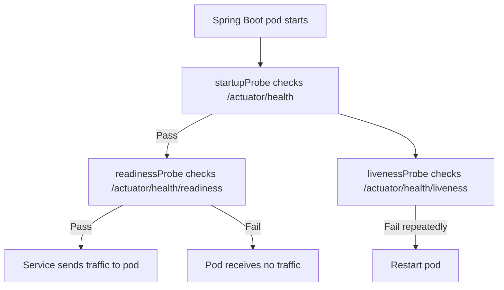
```mermaid
flowchart TD
    PodStarts[Spring Boot pod starts] --> Startup[startupProbe checks /actuator/health]
    Startup -->|Pass| Readiness[readinessProbe checks /actuator/health/readiness]
    Readiness -->|Pass| ServiceAddsPod[Service sends traffic to pod]
    Readiness -->|Fail| NoTraffic[Pod receives no traffic]
    Startup --> Liveness[livenessProbe checks /actuator/health/liveness]
    Liveness -->|Fail repeatedly| Restart[Restart pod]
```

### Why probes are added

| Probe | Purpose |
|---|---|
| Startup probe | Protects slow-starting apps from being killed too early |
| Readiness probe | Prevents traffic going to app before it is ready |
| Liveness probe | Restarts app if it becomes unhealthy |

---

## 16.8 Autoscaling Flow

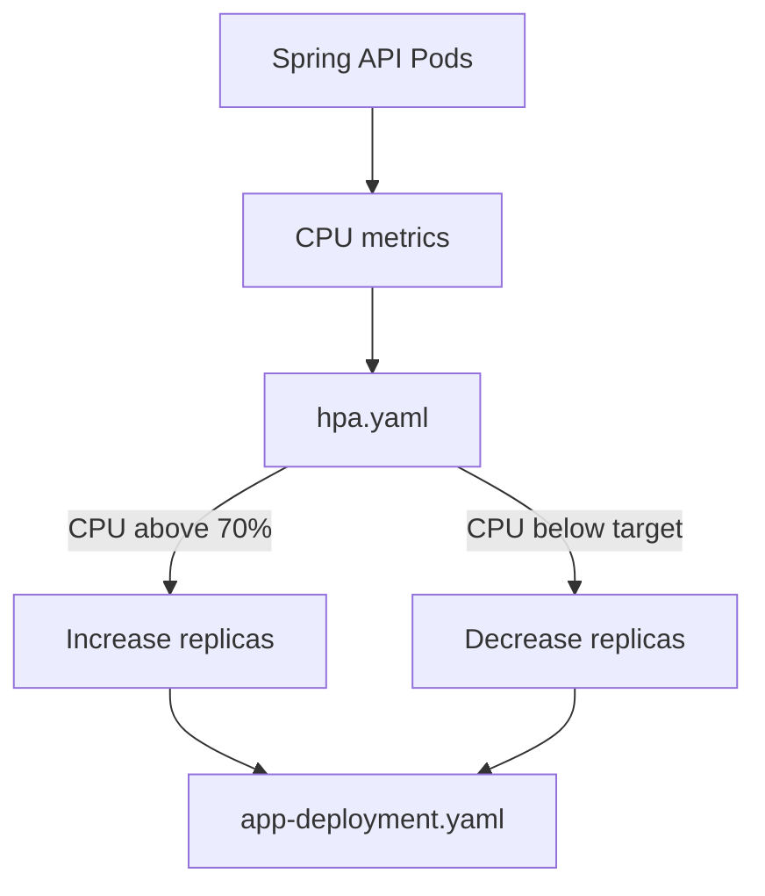
```mermaid
flowchart TD
    API[Spring API Pods] --> Metrics[CPU metrics]
    Metrics --> HPA[hpa.yaml]
    HPA -->|CPU above 70%| MorePods[Increase replicas]
    HPA -->|CPU below target| FewerPods[Decrease replicas]
    MorePods --> Deployment[app-deployment.yaml]
    FewerPods --> Deployment
```

### Why `hpa.yaml` is created

The app should handle high traffic by adding more pods automatically.

```yaml
minReplicas: 3
maxReplicas: 20
averageUtilization: 70
```

Meaning:

| Config | Meaning |
|---|---|
| `minReplicas: 3` | Always keep at least 3 pods |
| `maxReplicas: 20` | Never go above 20 pods |
| `averageUtilization: 70` | Try to keep average CPU around 70% |

---

## 16.9 External vs Internal Access

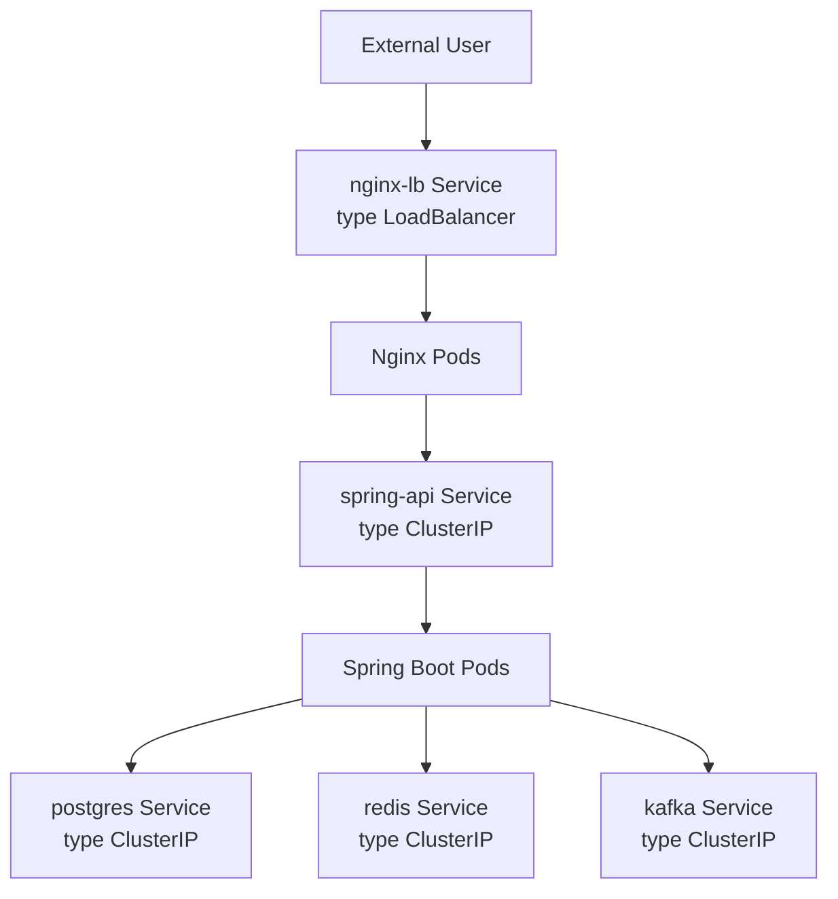
```mermaid
flowchart TD
    User[External User] --> NginxLB[nginx-lb Service<br/>type LoadBalancer]
    NginxLB --> NginxPods[Nginx Pods]
    NginxPods --> SpringService[spring-api Service<br/>type ClusterIP]
    SpringService --> SpringPods[Spring Boot Pods]
    SpringPods --> DBService[postgres Service<br/>type ClusterIP]
    SpringPods --> RedisService[redis Service<br/>type ClusterIP]
    SpringPods --> KafkaService[kafka Service<br/>type ClusterIP]
```

### Why only Nginx is public

| Component | Public? | Reason |
|---|---|---|
| Nginx | Yes | Main HTTP entrypoint |
| Spring API Service | No | Internal behind Nginx |
| PostgreSQL | No | Database must not be public |
| Redis | No | Cache must not be public |
| Kafka | No | Event broker must not be public |

---

## 16.10 Complete Kubernetes Deployment Files

Below are the deployment files used in this template.

---

## Kubernetes Runtime Flow

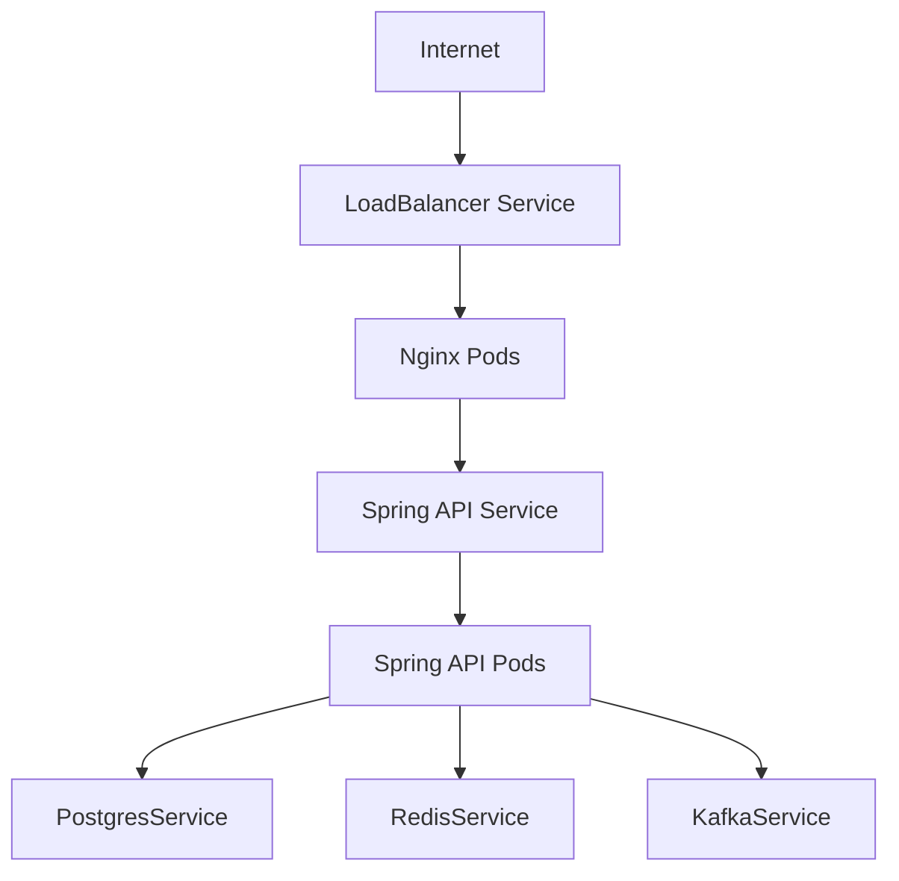
```mermaid
flowchart TD
    Internet --> LB[LoadBalancer Service]
    LB --> NginxPods[Nginx Pods]
    NginxPods --> AppService[Spring API Service]
    AppService --> AppPods[Spring API Pods]
    AppPods --> PostgresService
    AppPods --> RedisService
    AppPods --> KafkaService
```


# 17. Kubernetes Nginx

## `k8s/nginx-configmap.yaml`

```yaml
apiVersion: v1
kind: ConfigMap
metadata:
  name: nginx-config
  namespace: production-template
data:
  nginx.conf: |
    events {
        worker_connections 8192;
    }

    http {
        upstream spring_api {
            least_conn;
            server spring-api:8080;
        }

        server {
            listen 80;

            location / {
                proxy_pass http://spring_api;
                proxy_set_header Host $host;
                proxy_set_header X-Real-IP $remote_addr;
                proxy_set_header X-Forwarded-For $proxy_add_x_forwarded_for;
                proxy_set_header X-Forwarded-Proto $scheme;

                proxy_connect_timeout 3s;
                proxy_send_timeout 30s;
                proxy_read_timeout 30s;
            }
        }
    }
```

---

## `k8s/nginx-deployment.yaml`

```yaml
apiVersion: apps/v1
kind: Deployment
metadata:
  name: nginx-lb
  namespace: production-template
spec:
  replicas: 2
  selector:
    matchLabels:
      app: nginx-lb
  template:
    metadata:
      labels:
        app: nginx-lb
    spec:
      containers:
        - name: nginx
          image: nginx:1.27
          ports:
            - containerPort: 80
          volumeMounts:
            - name: nginx-config-volume
              mountPath: /etc/nginx/nginx.conf
              subPath: nginx.conf
          resources:
            requests:
              cpu: "100m"
              memory: "128Mi"
            limits:
              cpu: "500m"
              memory: "256Mi"
      volumes:
        - name: nginx-config-volume
          configMap:
            name: nginx-config
```

---

## `k8s/nginx-service.yaml`

```yaml
apiVersion: v1
kind: Service
metadata:
  name: nginx-lb
  namespace: production-template
spec:
  type: LoadBalancer
  selector:
    app: nginx-lb
  ports:
    - name: http
      port: 80
      targetPort: 80
```

---

# 18. Local Kubernetes Dependencies

> These are development/demo manifests. In production, use managed services or operators.

## `k8s/postgres.yaml`

```yaml
apiVersion: apps/v1
kind: StatefulSet
metadata:
  name: postgres
  namespace: production-template
spec:
  serviceName: postgres
  replicas: 1
  selector:
    matchLabels:
      app: postgres
  template:
    metadata:
      labels:
        app: postgres
    spec:
      containers:
        - name: postgres
          image: postgres:16
          ports:
            - containerPort: 5432
          env:
            - name: POSTGRES_DB
              valueFrom:
                configMapKeyRef:
                  name: app-config
                  key: POSTGRES_DB
            - name: POSTGRES_USER
              valueFrom:
                secretKeyRef:
                  name: app-secret
                  key: POSTGRES_USER
            - name: POSTGRES_PASSWORD
              valueFrom:
                secretKeyRef:
                  name: app-secret
                  key: POSTGRES_PASSWORD
          volumeMounts:
            - name: postgres-storage
              mountPath: /var/lib/postgresql/data
  volumeClaimTemplates:
    - metadata:
        name: postgres-storage
      spec:
        accessModes: ["ReadWriteOnce"]
        resources:
          requests:
            storage: 10Gi
---
apiVersion: v1
kind: Service
metadata:
  name: postgres
  namespace: production-template
spec:
  selector:
    app: postgres
  ports:
    - port: 5432
      targetPort: 5432
```

---

## `k8s/redis.yaml`

```yaml
apiVersion: apps/v1
kind: Deployment
metadata:
  name: redis
  namespace: production-template
spec:
  replicas: 1
  selector:
    matchLabels:
      app: redis
  template:
    metadata:
      labels:
        app: redis
    spec:
      containers:
        - name: redis
          image: redis:7
          ports:
            - containerPort: 6379
          command: ["redis-server"]
          args: ["--appendonly", "yes"]
---
apiVersion: v1
kind: Service
metadata:
  name: redis
  namespace: production-template
spec:
  selector:
    app: redis
  ports:
    - port: 6379
      targetPort: 6379
```

---

## `k8s/kafka.yaml`

```yaml
apiVersion: apps/v1
kind: Deployment
metadata:
  name: kafka
  namespace: production-template
spec:
  replicas: 1
  selector:
    matchLabels:
      app: kafka
  template:
    metadata:
      labels:
        app: kafka
    spec:
      containers:
        - name: kafka
          image: apache/kafka:3.8.0
          ports:
            - containerPort: 9092
            - containerPort: 9093
          env:
            - name: KAFKA_NODE_ID
              value: "1"
            - name: KAFKA_PROCESS_ROLES
              value: broker,controller
            - name: KAFKA_LISTENERS
              value: PLAINTEXT://:9092,CONTROLLER://:9093
            - name: KAFKA_ADVERTISED_LISTENERS
              value: PLAINTEXT://kafka:9092
            - name: KAFKA_CONTROLLER_QUORUM_VOTERS
              value: 1@kafka:9093
            - name: KAFKA_CONTROLLER_LISTENER_NAMES
              value: CONTROLLER
---
apiVersion: v1
kind: Service
metadata:
  name: kafka
  namespace: production-template
spec:
  selector:
    app: kafka
  ports:
    - name: broker
      port: 9092
      targetPort: 9092
```

---

# 19. Deploy to Kubernetes

```bash
kubectl apply -f k8s/namespace.yaml
kubectl apply -f k8s/configmap.yaml
kubectl apply -f k8s/secret.example.yaml

kubectl apply -f k8s/postgres.yaml
kubectl apply -f k8s/redis.yaml
kubectl apply -f k8s/kafka.yaml

kubectl apply -f k8s/app-deployment.yaml
kubectl apply -f k8s/app-service.yaml
kubectl apply -f k8s/hpa.yaml

kubectl apply -f k8s/nginx-configmap.yaml
kubectl apply -f k8s/nginx-deployment.yaml
kubectl apply -f k8s/nginx-service.yaml
```

Check:

```bash
kubectl get pods -n production-template
kubectl get svc -n production-template
kubectl logs -f deployment/spring-api -n production-template
```

---

# 20. CI/CD Pipeline

## `.github/workflows/ci.yml`

```yaml
name: CI

on:
  push:
    branches: [ main, develop ]
  pull_request:
    branches: [ main ]

jobs:
  build-test:
    runs-on: ubuntu-latest

    steps:
      - name: Checkout
        uses: actions/checkout@v4

      - name: Setup Java
        uses: actions/setup-java@v4
        with:
          distribution: temurin
          java-version: 21
          cache: maven

      - name: Run tests
        run: mvn clean test

      - name: Build package
        run: mvn clean package -DskipTests

  docker-build:
    runs-on: ubuntu-latest
    needs: build-test

    steps:
      - name: Checkout
        uses: actions/checkout@v4

      - name: Docker build
        run: docker build -t production-spring-template:${{ github.sha }} .
```

---

# 21. Load Testing

## `scripts/load-test-k6.js`

```javascript
import http from 'k6/http';
import { check, sleep } from 'k6';

export const options = {
  vus: 100,
  duration: '60s',
};

export default function () {
  const payload = JSON.stringify({
    name: `Product-${Math.random()}`,
    price: 99.99
  });

  const params = {
    headers: {
      'Content-Type': 'application/json',
    },
  };

  const res = http.post('http://localhost/api/v1/products', payload, params);

  check(res, {
    'status is 200': (r) => r.status === 200,
    'latency < 500ms': (r) => r.timings.duration < 500,
  });

  sleep(1);
}
```

Run:

```bash
k6 run scripts/load-test-k6.js
```

---

# 22. High Load Tuning Guide

## API Layer

| Setting | Recommendation |
|---|---|
| Stateless app | Required |
| Tomcat max threads | 200–500 depending on CPU |
| DB pool max | Usually 20–50 per pod |
| Pagination | Required |
| Request timeout | Required |
| Large payloads | Avoid |

## PostgreSQL

| Topic | Recommendation |
|---|---|
| Indexes | Add for every common filter/sort |
| Migrations | Flyway only |
| Pooling | HikariCP |
| Backups | Automated |
| Read scaling | Read replicas |
| Long transactions | Avoid |

## Redis

| Topic | Recommendation |
|---|---|
| TTL | Always set |
| Hot keys | Watch carefully |
| Large values | Avoid |
| Eviction policy | Configure intentionally |
| Production | Use Redis Cluster or managed Redis |

## Kafka

| Topic | Recommendation |
|---|---|
| Partitions | Match desired parallelism |
| Consumer group | One per worker type |
| Retries | Configure |
| DLQ | Required for production |
| Ordering | Only guaranteed inside partition |

---

# 23. Reliability Patterns

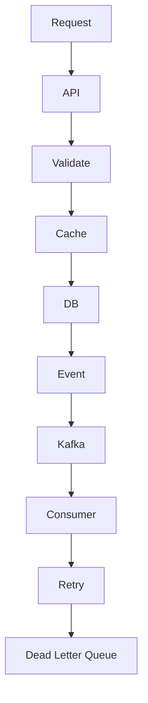
```mermaid
flowchart TD
    Request --> API
    API --> Validate
    Validate --> Cache
    Cache --> DB
    DB --> Event
    Event --> Kafka
    Kafka --> Consumer
    Consumer --> Retry
    Retry --> DLQ[Dead Letter Queue]
```

## Add Later

| Pattern | Tool |
|---|---|
| Circuit breaker | Resilience4j |
| Rate limiting | Bucket4j / Gateway / Nginx |
| Distributed tracing | OpenTelemetry |
| Log aggregation | Loki / ELK |
| Secret management | Vault / External Secrets |
| Blue-green deployment | Argo CD / Spinnaker |
| Canary deployment | Argo Rollouts |

---

# 24. Production Checklist

## Before First Production Deploy

- [ ] No hardcoded passwords
- [ ] Flyway migrations enabled
- [ ] `ddl-auto=validate`
- [ ] Health probes enabled
- [ ] Metrics endpoint enabled
- [ ] Logs are centralized
- [ ] Alerts configured
- [ ] HPA configured
- [ ] Resource requests/limits configured
- [ ] DB backups configured
- [ ] Kafka DLQ strategy configured
- [ ] Redis TTL configured
- [ ] API pagination enforced
- [ ] Load test completed
- [ ] Security scan completed
- [ ] Rollback strategy prepared

---

# 25. Environment Strategy

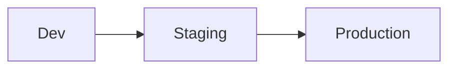
```mermaid
flowchart LR
    Dev --> Staging
    Staging --> Production
```

| Environment | Purpose |
|---|---|
| dev | Local and feature testing |
| staging | Production-like validation |
| production | Real users |

Use different:

- databases
- secrets
- Kafka topics
- Redis instances
- log levels
- resource limits

---

# 26. How to Create a New App From This Template

## Step 1: Copy repo

```bash
cp -r production-spring-template my-new-service
cd my-new-service
```

## Step 2: Rename package

```text
com.company.app
```

to:

```text
com.yourcompany.yourservice
```

## Step 3: Rename artifact

In `pom.xml`:

```xml
<artifactId>your-service-name</artifactId>
```

## Step 4: Replace domain module

Replace `product/` with your real business module:

```text
order/
payment/
user/
inventory/
notification/
```

## Step 5: Update DB migration

Create:

```text
V2__your_feature.sql
```

## Step 6: Run locally

```bash
docker compose up --build
```

## Step 7: Deploy

```bash
kubectl apply -f k8s/
```

---

# 27. Beginner to Expert Learning Map

| Level | Learn |
|---|---|
| Beginner | Controller, Service, Repository |
| Beginner+ | DTOs, validation, exception handling |
| Intermediate | PostgreSQL, Flyway, Redis |
| Intermediate+ | Kafka async processing |
| Advanced | Docker, Nginx, Kubernetes |
| Advanced+ | HPA, probes, rolling deploys |
| Expert | Observability, tracing, chaos testing |
| Expert+ | Multi-region, zero-downtime, SRE practices |

---

# 28. Final Mental Model

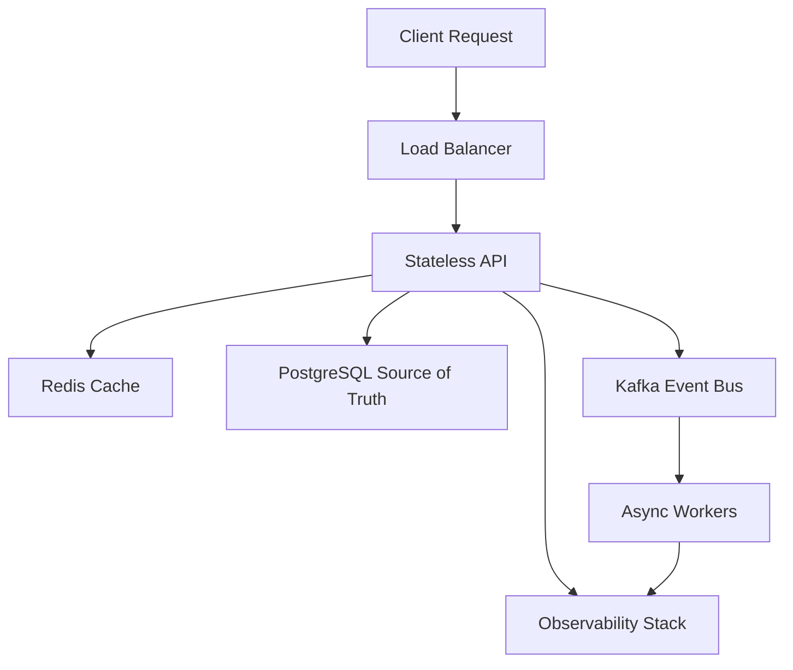
```mermaid
flowchart TD
    Client[Client Request]
    LB[Load Balancer]
    API[Stateless API]
    Cache[Redis Cache]
    DB[PostgreSQL Source of Truth]
    Queue[Kafka Event Bus]
    Worker[Async Workers]
    Metrics[Observability Stack]

    Client --> LB
    LB --> API
    API --> Cache
    API --> DB
    API --> Queue
    Queue --> Worker
    API --> Metrics
    Worker --> Metrics
```

The API should stay fast. Expensive work should move to Kafka. Frequently-read data should use Redis. Persistent truth belongs in PostgreSQL. Scaling should happen horizontally through Kubernetes.

---

# 29. Commands Cheat Sheet

```bash
# Build
mvn clean package

# Test
mvn test

# Run app only
mvn spring-boot:run

# Run full local stack
docker compose up --build

# Stop local stack
docker compose down

# Stop and remove DB volume
docker compose down -v

# Build image
docker build -t production-spring-template:1.0.0 .

# Deploy K8s
kubectl apply -f k8s/

# Check pods
kubectl get pods -n production-template

# Tail logs
kubectl logs -f deployment/spring-api -n production-template

# Scale manually
kubectl scale deployment spring-api --replicas=5 -n production-template
```

---

# 30. README Template

```md
# My Service

## Run locally

\```bash
docker compose up --build
\```

## API

### Create product

\```bash
curl -X POST http://localhost/api/v1/products \
  -H "Content-Type: application/json" \
  -d '{"name":"Laptop","price":1200.50}'
\```

### Health

\```bash
curl http://localhost/actuator/health
\```

## Deployment

\```bash
kubectl apply -f k8s/
\```
```

---

# 31. Final Production Advice

For a real enterprise production deployment, prefer:

| Component | Production Recommendation |
|---|---|
| PostgreSQL | Managed DB, backups, PITR |
| Redis | Managed Redis / Redis Cluster |
| Kafka | Managed Kafka / Strimzi |
| Secrets | Vault / cloud secret manager |
| Ingress | Nginx Ingress Controller / cloud LB |
| Deployments | Argo CD or Flux |
| Logs | Loki, ELK, or cloud logging |
| Metrics | Prometheus + Grafana |
| Traces | OpenTelemetry + Tempo / Jaeger |
| Security | OAuth2/JWT, WAF, network policies |

---

# ✅ You Now Have a Production-Grade Template

This guide can be used as your reusable foundation for creating new Spring Boot applications.

Use it as:

- a framework
- a starter repo
- a team standard
- a production checklist
- a learning guide from beginner to expert


---

# 32. Kubernetes From Scratch: Complete Deep-Dive Guide

This section explains **why each Kubernetes configuration exists**, what problem it solves, and how to build Kubernetes deployment files from zero.

---

## 32.1 Kubernetes Mental Model

Kubernetes is not just a server. It is a platform that keeps your application running in the desired state.

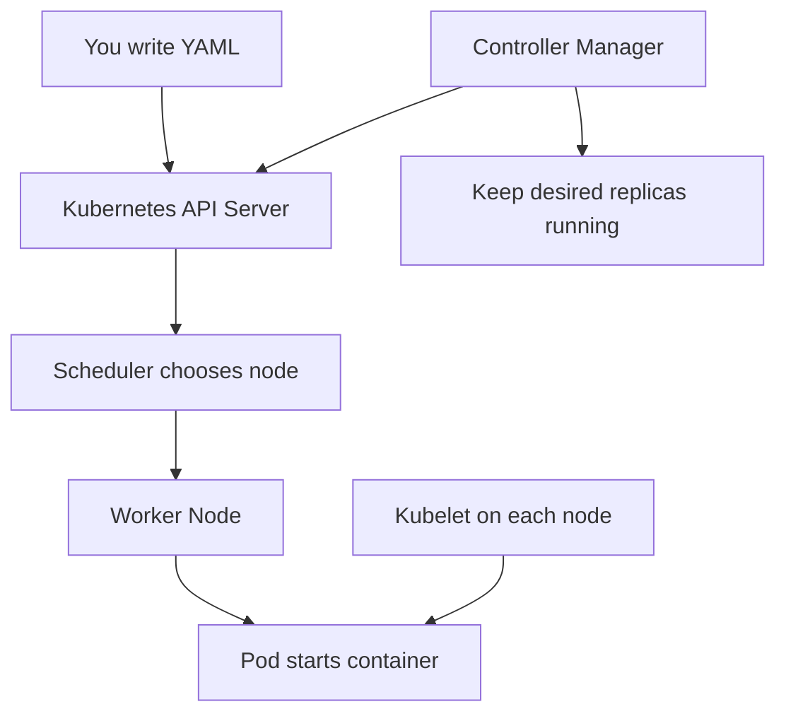
```mermaid
flowchart TD
    You[You write YAML] --> API[Kubernetes API Server]
    API --> Scheduler[Scheduler chooses node]
    Scheduler --> Node[Worker Node]
    Node --> Pod[Pod starts container]
    Controller[Controller Manager] --> API
    Controller --> DesiredState[Keep desired replicas running]
    Kubelet[Kubelet on each node] --> Pod
```

### Important idea

You do not usually say:

> Run this container once.

You say:

> I want 3 healthy replicas of this application always running.

Kubernetes then keeps trying to make reality match that desired state.

---

## 32.2 Core Kubernetes Objects Used in This Template

| Object | Purpose | Why We Use It |
|---|---|---|
| Namespace | Logical environment boundary | Keeps app resources grouped |
| ConfigMap | Non-secret config | Externalizes environment settings |
| Secret | Sensitive config | Stores passwords/tokens separately |
| Deployment | Runs stateless app pods | Handles replicas and rolling updates |
| StatefulSet | Runs stateful apps | Stable identity and storage |
| Service | Stable network name | Pods change IPs; Services do not |
| LoadBalancer Service | External access | Exposes Nginx/API outside cluster |
| HorizontalPodAutoscaler | Autoscaling | Adds/removes pods based on load |
| Probes | Health checks | Avoids sending traffic to broken pods |
| Resource requests/limits | CPU/memory control | Helps scheduling and prevents noisy neighbors |
| PersistentVolumeClaim | Storage request | Keeps DB data after pod restart |

---

## 32.3 Why Kubernetes Needs So Many Files

A Spring Boot app needs more than one Kubernetes object.

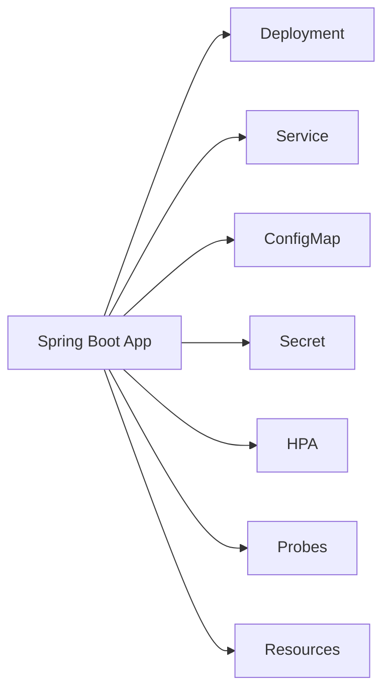
```mermaid
flowchart LR
    App[Spring Boot App] --> Deployment
    App --> Service
    App --> ConfigMap
    App --> Secret
    App --> HPA
    App --> Probes
    App --> Resources
```

Each object has one job:

| File | Job |
|---|---|
| `namespace.yaml` | Create isolated app area |
| `configmap.yaml` | Store normal environment variables |
| `secret.example.yaml` | Store sensitive environment variables |
| `app-deployment.yaml` | Run Spring Boot app pods |
| `app-service.yaml` | Give app a stable internal DNS name |
| `hpa.yaml` | Autoscale app replicas |
| `nginx-configmap.yaml` | Store Nginx config |
| `nginx-deployment.yaml` | Run Nginx pods |
| `nginx-service.yaml` | Expose Nginx to outside world |
| `postgres.yaml` | Run demo PostgreSQL with storage |
| `redis.yaml` | Run demo Redis |
| `kafka.yaml` | Run demo Kafka |

---

# 33. Kubernetes Networking Explained

## 33.1 Why Pods Are Not Enough

Pods are temporary. Their IP addresses can change when:

- a pod restarts
- deployment rolls out a new version
- autoscaling adds/removes pods
- Kubernetes moves pods to another node

So clients should not talk directly to Pod IPs.

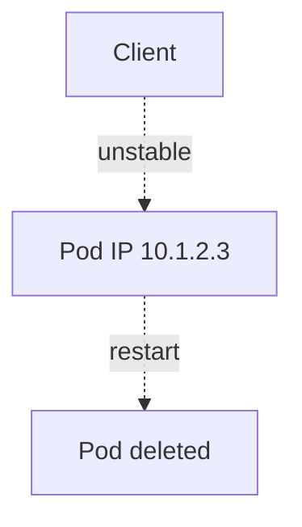
```mermaid
flowchart TD
    BadClient[Client] -. unstable .-> PodIP1[Pod IP 10.1.2.3]
    PodIP1 -. restart .-> Gone[Pod deleted]
```

Instead, clients talk to a **Service**.

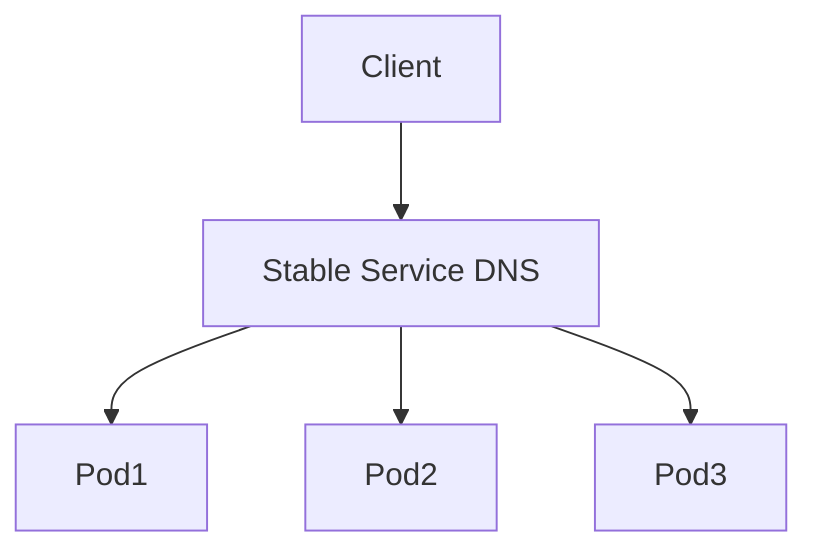
```mermaid
flowchart TD
    Client --> Service[Stable Service DNS]
    Service --> Pod1
    Service --> Pod2
    Service --> Pod3
```

---

## 33.2 Service Discovery

Inside the cluster, this app can call PostgreSQL using:

```text
postgres:5432
```

Redis:

```text
redis:6379
```

Kafka:

```text
kafka:9092
```

Spring API:

```text
spring-api:8080
```

Because Kubernetes creates DNS names for Services.

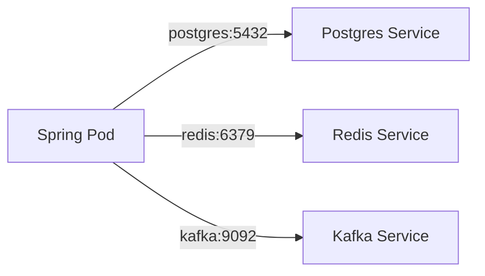
```mermaid
flowchart LR
    AppPod[Spring Pod] -->|postgres:5432| PostgresService[Postgres Service]
    AppPod -->|redis:6379| RedisService[Redis Service]
    AppPod -->|kafka:9092| KafkaService[Kafka Service]
```

---

# 34. Kubernetes Object-by-Object Explanation

---

## 34.1 Namespace

### File

```yaml
apiVersion: v1
kind: Namespace
metadata:
  name: production-template
```

### Purpose

A `Namespace` groups related resources.

Without namespace:

```text
default namespace
├── random app
├── test app
├── database
└── your app
```

With namespace:

```text
production-template namespace
├── spring-api
├── postgres
├── redis
├── kafka
└── nginx
```

### Why added

| Reason | Benefit |
|---|---|
| Isolation | Avoids mixing resources |
| Cleanup | Delete whole app namespace if needed |
| Security | Allows namespace-level RBAC |
| Organization | Easier to inspect app resources |

### Commands

```bash
kubectl create namespace production-template
kubectl get all -n production-template
```

---

## 34.2 ConfigMap

### File

```yaml
apiVersion: v1
kind: ConfigMap
metadata:
  name: app-config
  namespace: production-template
data:
  APP_NAME: production-spring-template
  SPRING_PROFILES_ACTIVE: prod
  SERVER_PORT: "8080"

  POSTGRES_HOST: postgres
  POSTGRES_PORT: "5432"
  POSTGRES_DB: appdb

  REDIS_HOST: redis
  REDIS_PORT: "6379"

  KAFKA_BOOTSTRAP_SERVERS: kafka:9092

  TOMCAT_MAX_THREADS: "300"
  DB_POOL_MAX: "30"
```

### Purpose

A `ConfigMap` stores **non-secret configuration** outside your Docker image.

### Why added

You should not rebuild your Docker image just because a DB host or thread count changed.

```mermaid
flowchart LR
    DockerImage[Same Docker Image] --> DevConfig[Dev ConfigMap]
    DockerImage --> StageConfig[Staging ConfigMap]
    DockerImage --> ProdConfig[Prod ConfigMap]
```

### What belongs in ConfigMap

| Good for ConfigMap | Not for ConfigMap |
|---|---|
| Hostnames | Passwords |
| Ports | API tokens |
| Feature flags | Private keys |
| App names | DB passwords |
| Thread counts | OAuth secrets |

### How Spring Boot reads it

The Deployment injects ConfigMap values as environment variables:

```yaml
envFrom:
  - configMapRef:
      name: app-config
```

Then Spring Boot uses:

```yaml
POSTGRES_HOST: ${POSTGRES_HOST:localhost}
```

Meaning:

> Use env variable `POSTGRES_HOST`, or fallback to `localhost`.

---

## 34.3 Secret

### File

```yaml
apiVersion: v1
kind: Secret
metadata:
  name: app-secret
  namespace: production-template
type: Opaque
stringData:
  POSTGRES_USER: appuser
  POSTGRES_PASSWORD: change-me
```

### Purpose

A `Secret` stores sensitive values separately from normal config.

### Why added

Passwords must not be hardcoded in:

- source code
- Dockerfile
- application.yml
- GitHub repo
- ConfigMap

### How it connects to the app

```yaml
envFrom:
  - secretRef:
      name: app-secret
```

Then Spring Boot receives:

```text
POSTGRES_USER
POSTGRES_PASSWORD
```

### Production warning

This example is okay for learning. In real production, use one of these:

| Tool | Purpose |
|---|---|
| External Secrets Operator | Sync cloud secrets into K8s |
| HashiCorp Vault | Central secret management |
| Sealed Secrets | Safe encrypted Git secrets |
| AWS Secrets Manager | AWS-native secrets |
| GCP Secret Manager | GCP-native secrets |
| Azure Key Vault | Azure-native secrets |

---

## 34.4 Deployment

### File

```yaml
apiVersion: apps/v1
kind: Deployment
metadata:
  name: spring-api
  namespace: production-template
spec:
  replicas: 3
  revisionHistoryLimit: 5
  strategy:
    type: RollingUpdate
    rollingUpdate:
      maxUnavailable: 0
      maxSurge: 1
  selector:
    matchLabels:
      app: spring-api
  template:
    metadata:
      labels:
        app: spring-api
    spec:
      terminationGracePeriodSeconds: 45
      containers:
        - name: spring-api
          image: your-docker-registry/production-spring-template:1.0.0
          ports:
            - containerPort: 8080
          envFrom:
            - configMapRef:
                name: app-config
            - secretRef:
                name: app-secret
```

### Purpose

A `Deployment` runs and manages stateless application pods.

### Why added

Your API should be horizontally scalable.

```mermaid
flowchart TD
    Deployment[Deployment: replicas=3] --> ReplicaSet
    ReplicaSet --> Pod1[Spring API Pod 1]
    ReplicaSet --> Pod2[Spring API Pod 2]
    ReplicaSet --> Pod3[Spring API Pod 3]
```

### Key fields explained

| Field | Meaning | Why important |
|---|---|---|
| `replicas: 3` | Run 3 pods | High availability |
| `selector.matchLabels` | Finds managed pods | Deployment knows which pods it owns |
| `template.metadata.labels` | Labels added to pods | Service uses labels to route traffic |
| `image` | Container image | What app version to run |
| `ports.containerPort` | App listens on 8080 | Documentation and probe target |
| `envFrom` | Load ConfigMap/Secret | External config |
| `terminationGracePeriodSeconds` | Time to shutdown | Graceful shutdown |

---

## 34.5 Labels and Selectors

Labels connect Kubernetes objects.

```mermaid
flowchart LR
    ServiceSelector[Service selector app=spring-api] --> PodLabel1[Pod label app=spring-api]
    ServiceSelector --> PodLabel2[Pod label app=spring-api]
    ServiceSelector --> PodLabel3[Pod label app=spring-api]
```

### Deployment label

```yaml
template:
  metadata:
    labels:
      app: spring-api
```

### Service selector

```yaml
selector:
  app: spring-api
```

### Meaning

The Service sends traffic to pods where:

```text
app = spring-api
```

If labels do not match, traffic will not reach pods.

---

## 34.6 Rolling Update Strategy

```yaml
strategy:
  type: RollingUpdate
  rollingUpdate:
    maxUnavailable: 0
    maxSurge: 1
```

### Purpose

Deploy new app versions without downtime.

```mermaid
sequenceDiagram
    participant K as Kubernetes
    participant Old as Old Pod
    participant New as New Pod
    participant S as Service

    K->>New: Start new pod
    New-->>K: Readiness OK
    S->>New: Send traffic
    K->>Old: Terminate old pod
```

### Why these values

| Setting | Meaning | Result |
|---|---|---|
| `maxUnavailable: 0` | Do not reduce available pods | Safer deploy |
| `maxSurge: 1` | Add 1 extra pod during rollout | New pod starts before old pod dies |

---

## 34.7 Readiness Probe

```yaml
readinessProbe:
  httpGet:
    path: /actuator/health/readiness
    port: 8080
  initialDelaySeconds: 20
  periodSeconds: 10
  timeoutSeconds: 3
  failureThreshold: 3
```

### Purpose

Readiness tells Kubernetes:

> Is this pod ready to receive traffic?

### Why added

Spring Boot may start slowly because it connects to:

- PostgreSQL
- Redis
- Kafka
- Flyway migrations
- internal initialization

Without readiness probes, Kubernetes may send traffic too early.

```mermaid
flowchart LR
    PodStarting[Pod starting] --> NotReady[Not Ready]
    NotReady --> NoTraffic[Service does not send traffic]
    NotReady --> Ready[Readiness passes]
    Ready --> Traffic[Service sends traffic]
```

### Fields

| Field | Purpose |
|---|---|
| `path` | Health endpoint |
| `initialDelaySeconds` | Wait before first check |
| `periodSeconds` | Check frequency |
| `timeoutSeconds` | Max wait for response |
| `failureThreshold` | Failed checks before marking unready |

---

## 34.8 Liveness Probe

```yaml
livenessProbe:
  httpGet:
    path: /actuator/health/liveness
    port: 8080
  initialDelaySeconds: 40
  periodSeconds: 20
  timeoutSeconds: 3
  failureThreshold: 3
```

### Purpose

Liveness tells Kubernetes:

> Is this pod alive, or should it be restarted?

### Why added

A process may still exist but be broken:

- deadlocked
- memory stuck
- app thread pool exhausted
- internal failure

```mermaid
flowchart TD
    Pod[Pod running] --> LivenessCheck
    LivenessCheck -->|Pass| KeepRunning
    LivenessCheck -->|Fail repeatedly| RestartPod
```

### Difference between readiness and liveness

| Probe | If it fails | Meaning |
|---|---|---|
| Readiness | Remove pod from traffic | App is not ready |
| Liveness | Restart pod | App is unhealthy |
| Startup | Wait longer during startup | App is still booting |

---

## 34.9 Startup Probe

```yaml
startupProbe:
  httpGet:
    path: /actuator/health
    port: 8080
  failureThreshold: 30
  periodSeconds: 5
```

### Purpose

Startup probe gives slow apps enough time to boot.

### Why added

If an app takes 90 seconds to start, liveness might kill it too early.

```mermaid
flowchart TD
    ContainerStart --> StartupProbe
    StartupProbe -->|Still booting| Wait
    StartupProbe -->|Pass| EnableLivenessReadiness
```

### Calculation

```text
failureThreshold × periodSeconds = max startup time
30 × 5 = 150 seconds
```

So the app has up to 150 seconds to start.

---

## 34.10 Resource Requests and Limits

```yaml
resources:
  requests:
    cpu: "500m"
    memory: "512Mi"
  limits:
    cpu: "2"
    memory: "1Gi"
```

### Purpose

Resources tell Kubernetes how much CPU and memory your pod needs and the maximum it can use.

### Why added

Without resources:

- scheduler makes poor placement decisions
- one pod may consume too much memory
- autoscaling may not work properly
- cluster becomes unstable

```mermaid
flowchart LR
    PodSpec[Pod resources] --> Scheduler
    Scheduler --> NodeA[Node with enough CPU/RAM]
```

### Meaning

| Field | Meaning |
|---|---|
| `requests.cpu: 500m` | Reserve half a CPU core |
| `requests.memory: 512Mi` | Reserve 512 MiB RAM |
| `limits.cpu: 2` | Pod can use max 2 CPU cores |
| `limits.memory: 1Gi` | Pod killed if it exceeds 1 GiB |

### CPU unit

```text
1000m = 1 CPU core
500m = 0.5 CPU core
250m = 0.25 CPU core
```

---

# 35. Service Configuration Deep Dive

## 35.1 App Service

```yaml
apiVersion: v1
kind: Service
metadata:
  name: spring-api
  namespace: production-template
spec:
  type: ClusterIP
  selector:
    app: spring-api
  ports:
    - name: http
      port: 8080
      targetPort: 8080
```

### Purpose

The Service gives your Spring Boot pods a stable internal address.

```text
http://spring-api:8080
```

### Why added

Pods are replaceable. Service is stable.

```mermaid
flowchart TD
    Nginx --> SpringService[spring-api Service]
    SpringService --> Pod1
    SpringService --> Pod2
    SpringService --> Pod3
```

### Fields

| Field | Purpose |
|---|---|
| `type: ClusterIP` | Internal-only service |
| `selector` | Finds target pods |
| `port` | Service port |
| `targetPort` | Container port |

---

## 35.2 Service Types

| Type | Scope | Use case |
|---|---|---|
| ClusterIP | Inside cluster only | App-to-app communication |
| NodePort | Exposes port on nodes | Simple testing |
| LoadBalancer | External cloud LB | Public traffic |
| ExternalName | DNS alias | External services |

### In this template

| Service | Type | Why |
|---|---|---|
| `spring-api` | ClusterIP | Only Nginx should call it |
| `postgres` | ClusterIP | Internal DB access |
| `redis` | ClusterIP | Internal cache access |
| `kafka` | ClusterIP | Internal event bus |
| `nginx-lb` | LoadBalancer | External users call Nginx |

---

# 36. Nginx on Kubernetes

## 36.1 Why Nginx ConfigMap Exists

```yaml
apiVersion: v1
kind: ConfigMap
metadata:
  name: nginx-config
data:
  nginx.conf: |
    events {
        worker_connections 8192;
    }

    http {
        upstream spring_api {
            least_conn;
            server spring-api:8080;
        }

        server {
            listen 80;

            location / {
                proxy_pass http://spring_api;
            }
        }
    }
```

### Purpose

The Nginx config is externalized so you can change load-balancing behavior without rebuilding the Nginx image.

```mermaid
flowchart LR
    NginxImage[nginx:1.27 image] --> ConfigMap[Nginx ConfigMap]
    ConfigMap --> NginxPod[Nginx Pod]
```

### Why `server spring-api:8080`

Nginx sends traffic to the Kubernetes Service, not directly to pods.

```mermaid
flowchart LR
    Internet --> Nginx
    Nginx -->|spring-api:8080| SpringService
    SpringService --> Pod1
    SpringService --> Pod2
```

---

## 36.2 Nginx Deployment

```yaml
apiVersion: apps/v1
kind: Deployment
metadata:
  name: nginx-lb
spec:
  replicas: 2
  selector:
    matchLabels:
      app: nginx-lb
  template:
    metadata:
      labels:
        app: nginx-lb
    spec:
      containers:
        - name: nginx
          image: nginx:1.27
          ports:
            - containerPort: 80
          volumeMounts:
            - name: nginx-config-volume
              mountPath: /etc/nginx/nginx.conf
              subPath: nginx.conf
      volumes:
        - name: nginx-config-volume
          configMap:
            name: nginx-config
```

### Why added

Nginx pods handle incoming traffic and route it to Spring Boot.

### Why `replicas: 2`

If one Nginx pod fails, the other can continue serving.

```mermaid
flowchart LR
    LoadBalancer --> Nginx1
    LoadBalancer --> Nginx2
    Nginx1 --> SpringService
    Nginx2 --> SpringService
```

### Why volume mount

This mounts the ConfigMap file into the container:

```text
ConfigMap nginx.conf → /etc/nginx/nginx.conf
```

---

## 36.3 Nginx LoadBalancer Service

```yaml
apiVersion: v1
kind: Service
metadata:
  name: nginx-lb
spec:
  type: LoadBalancer
  selector:
    app: nginx-lb
  ports:
    - name: http
      port: 80
      targetPort: 80
```

### Purpose

This exposes Nginx to the outside world.

```mermaid
flowchart LR
    User --> CloudLoadBalancer
    CloudLoadBalancer --> NginxService
    NginxService --> NginxPod1
    NginxService --> NginxPod2
```

### Why not expose Spring Boot directly?

You can, but Nginx allows:

- reverse proxy behavior
- request size control
- centralized routing
- rate limiting
- TLS termination option
- static routing rules
- custom load balancing

---

# 37. PostgreSQL Kubernetes Explanation

## 37.1 Why StatefulSet for PostgreSQL

PostgreSQL is stateful. It needs stable storage.

```mermaid
flowchart TD
    PostgresPod --> PVC[Persistent Volume Claim]
    PVC --> PV[Persistent Volume]
    PV --> Disk[Disk Storage]
```

### Deployment vs StatefulSet

| Workload | Best object | Reason |
|---|---|---|
| Spring Boot API | Deployment | Stateless |
| Nginx | Deployment | Stateless |
| PostgreSQL | StatefulSet | Needs stable storage |
| Kafka | StatefulSet in real production | Needs stable identity/storage |
| Redis | Deployment for demo, StatefulSet/managed for prod | Depends on persistence needs |

---

## 37.2 PostgreSQL StatefulSet

```yaml
apiVersion: apps/v1
kind: StatefulSet
metadata:
  name: postgres
spec:
  serviceName: postgres
  replicas: 1
  selector:
    matchLabels:
      app: postgres
  template:
    metadata:
      labels:
        app: postgres
    spec:
      containers:
        - name: postgres
          image: postgres:16
          ports:
            - containerPort: 5432
          env:
            - name: POSTGRES_DB
              valueFrom:
                configMapKeyRef:
                  name: app-config
                  key: POSTGRES_DB
            - name: POSTGRES_USER
              valueFrom:
                secretKeyRef:
                  name: app-secret
                  key: POSTGRES_USER
            - name: POSTGRES_PASSWORD
              valueFrom:
                secretKeyRef:
                  name: app-secret
                  key: POSTGRES_PASSWORD
          volumeMounts:
            - name: postgres-storage
              mountPath: /var/lib/postgresql/data
```

### Key purpose

| Field | Why |
|---|---|
| `StatefulSet` | Stable pod identity |
| `volumeMounts` | Store DB files |
| `secretKeyRef` | Password from Secret |
| `configMapKeyRef` | DB name from ConfigMap |
| `replicas: 1` | Simple demo DB |

---

## 37.3 PostgreSQL Storage

```yaml
volumeClaimTemplates:
  - metadata:
      name: postgres-storage
    spec:
      accessModes: ["ReadWriteOnce"]
      resources:
        requests:
          storage: 10Gi
```

### Purpose

Requests persistent disk storage.

### Why added

If a PostgreSQL pod restarts, database data must survive.

```mermaid
sequenceDiagram
    participant P as Postgres Pod
    participant D as Persistent Disk

    P->>D: Write data
    P--xP: Pod restarts
    P->>D: Reattach same data
```

### Production note

For real production, prefer managed PostgreSQL:

- AWS RDS
- Google Cloud SQL
- Azure Database for PostgreSQL
- CrunchyData Operator
- Zalando Postgres Operator

---

# 38. Redis Kubernetes Explanation

## 38.1 Redis Deployment

```yaml
apiVersion: apps/v1
kind: Deployment
metadata:
  name: redis
spec:
  replicas: 1
  selector:
    matchLabels:
      app: redis
  template:
    metadata:
      labels:
        app: redis
    spec:
      containers:
        - name: redis
          image: redis:7
          ports:
            - containerPort: 6379
```

### Purpose

Redis stores cached data for fast lookups.

```mermaid
flowchart LR
    SpringAPI --> RedisService
    RedisService --> RedisPod
```

### Why added

To reduce database load.

```mermaid
flowchart TD
    Request --> CheckRedis
    CheckRedis -->|Hit| ReturnFast
    CheckRedis -->|Miss| QueryPostgres
    QueryPostgres --> SaveToRedis
```

### Production note

For production, prefer:

- managed Redis
- Redis Cluster
- Redis Sentinel
- persistence configured if needed
- authentication enabled
- network policies

---

# 39. Kafka Kubernetes Explanation

## 39.1 Kafka Purpose

Kafka decouples slow work from fast API requests.

```mermaid
flowchart LR
    API[Spring API] --> Topic[Kafka Topic]
    Topic --> Consumer1
    Topic --> Consumer2
    Topic --> Consumer3
```

### Example

Instead of making the user wait for email sending:

```text
API request → save product → publish event → return response
Kafka consumer → send email later
```

---

## 39.2 Kafka Deployment

```yaml
apiVersion: apps/v1
kind: Deployment
metadata:
  name: kafka
spec:
  replicas: 1
  selector:
    matchLabels:
      app: kafka
  template:
    metadata:
      labels:
        app: kafka
    spec:
      containers:
        - name: kafka
          image: apache/kafka:3.8.0
          ports:
            - containerPort: 9092
            - containerPort: 9093
          env:
            - name: KAFKA_NODE_ID
              value: "1"
            - name: KAFKA_PROCESS_ROLES
              value: broker,controller
            - name: KAFKA_LISTENERS
              value: PLAINTEXT://:9092,CONTROLLER://:9093
            - name: KAFKA_ADVERTISED_LISTENERS
              value: PLAINTEXT://kafka:9092
```

### Why these Kafka env vars exist

| Variable | Purpose |
|---|---|
| `KAFKA_NODE_ID` | Unique broker ID |
| `KAFKA_PROCESS_ROLES` | Broker and controller mode |
| `KAFKA_LISTENERS` | Ports Kafka listens on |
| `KAFKA_ADVERTISED_LISTENERS` | Address clients should use |
| `KAFKA_CONTROLLER_QUORUM_VOTERS` | Controller quorum config |
| `KAFKA_CONTROLLER_LISTENER_NAMES` | Controller listener name |

### Production warning

This is a simple learning/demo Kafka.

For production, use:

- managed Kafka
- Confluent Cloud
- AWS MSK
- Strimzi Kafka Operator
- multi-broker cluster
- persistent volumes
- topic replication
- monitoring
- DLQ strategy

---

# 40. Horizontal Pod Autoscaler Deep Dive

## 40.1 HPA YAML

```yaml
apiVersion: autoscaling/v2
kind: HorizontalPodAutoscaler
metadata:
  name: spring-api-hpa
spec:
  scaleTargetRef:
    apiVersion: apps/v1
    kind: Deployment
    name: spring-api
  minReplicas: 3
  maxReplicas: 20
  metrics:
    - type: Resource
      resource:
        name: cpu
        target:
          type: Utilization
          averageUtilization: 70
```

### Purpose

HPA automatically changes the number of API pods based on load.

```mermaid
flowchart TD
    Metrics[CPU Metrics] --> HPA
    HPA -->|CPU high| ScaleOut[Add Pods]
    HPA -->|CPU low| ScaleIn[Remove Pods]
    ScaleOut --> Deployment
    ScaleIn --> Deployment
```

### Fields explained

| Field | Purpose |
|---|---|
| `scaleTargetRef` | What to scale |
| `minReplicas` | Minimum pods always running |
| `maxReplicas` | Safety limit |
| `averageUtilization: 70` | Target CPU usage |

### Example

If current pods average 90% CPU and target is 70%, HPA may add more pods.

---

# 41. Complete Kubernetes Traffic Flow

```mermaid
sequenceDiagram
    participant User
    participant CloudLB as Cloud LoadBalancer
    participant NginxSvc as nginx-lb Service
    participant NginxPod as Nginx Pod
    participant ApiSvc as spring-api Service
    participant ApiPod as Spring API Pod
    participant Redis
    participant Postgres
    participant Kafka

    User->>CloudLB: HTTP request
    CloudLB->>NginxSvc: Forward traffic
    NginxSvc->>NginxPod: Select healthy Nginx pod
    NginxPod->>ApiSvc: Proxy to spring-api:8080
    ApiSvc->>ApiPod: Select ready API pod
    ApiPod->>Redis: Check cache
    ApiPod->>Postgres: Read/write data if needed
    ApiPod->>Kafka: Publish async event
    ApiPod-->>User: Response through same path
```

---

# 42. Complete Kubernetes Config Flow

```mermaid
flowchart TD
    ConfigMap[app-config ConfigMap] --> Deployment
    Secret[app-secret Secret] --> Deployment
    Deployment --> Pod
    Pod --> EnvVars[Environment Variables]
    EnvVars --> SpringBoot[Spring Boot application.yml placeholders]
```

Example:

```yaml
POSTGRES_HOST: postgres
```

goes into pod environment.

Spring Boot reads:

```yaml
url: jdbc:postgresql://${POSTGRES_HOST:localhost}:5432/appdb
```

Result:

```text
jdbc:postgresql://postgres:5432/appdb
```

---

# 43. Kubernetes Startup Order

Kubernetes does not guarantee perfect startup order just because you apply files in order.

That is why apps need retries and health checks.

```mermaid
flowchart TD
    ApplyYAML[kubectl apply] --> CreateObjects
    CreateObjects --> PostgresStarting
    CreateObjects --> RedisStarting
    CreateObjects --> KafkaStarting
    CreateObjects --> AppStarting
    AppStarting --> RetryConnections
    AppStarting --> HealthChecks
```

### Important

Do not rely only on:

```text
Apply DB first, app second
```

Your app should handle dependencies not being ready yet.

---

# 44. How to Create Kubernetes From Scratch

## Step 1: Containerize your app

You need a Docker image first.

```bash
docker build -t your-app:1.0.0 .
```

## Step 2: Create namespace

```yaml
apiVersion: v1
kind: Namespace
metadata:
  name: your-app
```

## Step 3: Create ConfigMap

Put non-secret values:

```yaml
apiVersion: v1
kind: ConfigMap
metadata:
  name: your-app-config
  namespace: your-app
data:
  SPRING_PROFILES_ACTIVE: prod
  SERVER_PORT: "8080"
```

## Step 4: Create Secret

Put sensitive values:

```yaml
apiVersion: v1
kind: Secret
metadata:
  name: your-app-secret
  namespace: your-app
type: Opaque
stringData:
  DB_PASSWORD: change-me
```

## Step 5: Create Deployment

Run your app:

```yaml
apiVersion: apps/v1
kind: Deployment
metadata:
  name: your-app
  namespace: your-app
spec:
  replicas: 3
  selector:
    matchLabels:
      app: your-app
  template:
    metadata:
      labels:
        app: your-app
    spec:
      containers:
        - name: your-app
          image: your-app:1.0.0
          ports:
            - containerPort: 8080
          envFrom:
            - configMapRef:
                name: your-app-config
            - secretRef:
                name: your-app-secret
```

## Step 6: Create Service

Expose pods internally:

```yaml
apiVersion: v1
kind: Service
metadata:
  name: your-app
  namespace: your-app
spec:
  selector:
    app: your-app
  ports:
    - port: 8080
      targetPort: 8080
```

## Step 7: Add probes

```yaml
readinessProbe:
  httpGet:
    path: /actuator/health/readiness
    port: 8080
livenessProbe:
  httpGet:
    path: /actuator/health/liveness
    port: 8080
```

## Step 8: Add resources

```yaml
resources:
  requests:
    cpu: "500m"
    memory: "512Mi"
  limits:
    cpu: "2"
    memory: "1Gi"
```

## Step 9: Add autoscaling

```yaml
apiVersion: autoscaling/v2
kind: HorizontalPodAutoscaler
metadata:
  name: your-app-hpa
spec:
  scaleTargetRef:
    apiVersion: apps/v1
    kind: Deployment
    name: your-app
  minReplicas: 3
  maxReplicas: 20
  metrics:
    - type: Resource
      resource:
        name: cpu
        target:
          type: Utilization
          averageUtilization: 70
```

## Step 10: Expose externally

Use either:

- LoadBalancer Service
- Ingress
- API Gateway

Simple LoadBalancer:

```yaml
apiVersion: v1
kind: Service
metadata:
  name: your-app-public
spec:
  type: LoadBalancer
  selector:
    app: your-app
  ports:
    - port: 80
      targetPort: 8080
```

---

# 45. Kubernetes YAML Checklist

When creating any new Spring Boot app, ask:

| Question | Kubernetes object |
|---|---|
| Where should resources live? | Namespace |
| What config changes per environment? | ConfigMap |
| What values are secret? | Secret |
| How many app copies should run? | Deployment replicas |
| How do pods receive traffic? | Service |
| How does traffic enter cluster? | LoadBalancer / Ingress |
| How do we avoid broken pods? | Readiness probe |
| How do we restart dead pods? | Liveness probe |
| How much CPU/RAM needed? | Resources |
| How do we scale under load? | HPA |
| Does it need storage? | StatefulSet + PVC |
| How do we observe it? | Actuator + Prometheus |

---

# 46. Common Kubernetes Mistakes

| Mistake | Result | Fix |
|---|---|---|
| Service selector does not match pod label | No traffic reaches app | Match labels exactly |
| Missing readiness probe | Traffic sent too early | Add readiness |
| Missing resource requests | HPA/scheduling issues | Add requests/limits |
| Hardcoded secrets | Security risk | Use Secret/external secret manager |
| Using Deployment for production DB | Data risk | Use managed DB or StatefulSet/operator |
| No rolling update config | Downtime risk | Configure RollingUpdate |
| No namespace | Messy cluster | Use namespace |
| No persistent volume for DB | Data lost on restart | Use PVC |
| Exposing DB publicly | Security risk | Use ClusterIP only |
| Too many DB connections per pod | DB overload | Tune Hikari pool × pod count |

---

# 47. Sizing Example

Suppose:

```text
PostgreSQL max connections = 200
Spring app pods = 5
Reserved DB connections for admin/tools = 30
Available for app = 170
```

Safe Hikari pool per pod:

```text
170 / 5 = 34
```

So set:

```yaml
DB_POOL_MAX: "30"
```

Do not blindly set every pod to 100 DB connections.

```mermaid
flowchart LR
    Pod1[30 conns] --> DB[(Postgres max 200)]
    Pod2[30 conns] --> DB
    Pod3[30 conns] --> DB
    Pod4[30 conns] --> DB
    Pod5[30 conns] --> DB
```

---

# 48. Recommended Production Upgrade Path

```mermaid
flowchart TD
    Start[Basic K8s YAML] --> Helm[Convert to Helm Chart]
    Helm --> Ingress[Use Ingress Controller]
    Ingress --> TLS[Add TLS Certificates]
    TLS --> Secrets[External Secrets]
    Secrets --> GitOps[Argo CD / Flux]
    GitOps --> Observability[Prometheus + Grafana + Loki + Tracing]
    Observability --> Progressive[Canary / Blue-Green Deployments]
```

### Recommended next tools

| Need | Tool |
|---|---|
| Template YAML | Helm |
| Git-based deploy | Argo CD / Flux |
| TLS certificates | cert-manager |
| External traffic | Nginx Ingress Controller |
| Secrets | External Secrets Operator |
| Logs | Loki / ELK |
| Traces | OpenTelemetry + Tempo / Jaeger |
| Safer rollout | Argo Rollouts |

---

# 49. Kubernetes Beginner-to-Expert Learning Path

| Level | Learn |
|---|---|
| Beginner | Pod, Deployment, Service |
| Beginner+ | ConfigMap, Secret |
| Intermediate | Probes, resources, namespaces |
| Intermediate+ | HPA, rolling updates |
| Advanced | StatefulSet, PVC, Ingress |
| Advanced+ | Helm, cert-manager, external secrets |
| Expert | GitOps, service mesh, canary deploys |
| Expert+ | Multi-cluster, multi-region, SRE operations |

---

# 50. Final Kubernetes Mental Model

```mermaid
flowchart TD
    Desired[You define desired state in YAML]
    Desired --> K8s[Kubernetes Control Plane]
    K8s --> Create[Create Pods, Services, Config]
    K8s --> Watch[Continuously Watch]
    Watch --> Fix[Restart, Reschedule, Rescale]
    Fix --> Healthy[Keep App Healthy]
```

Kubernetes is not just deployment. It is a self-healing runtime that keeps your application close to the desired state you declare.

