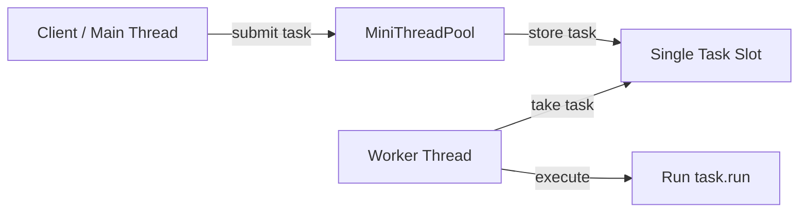
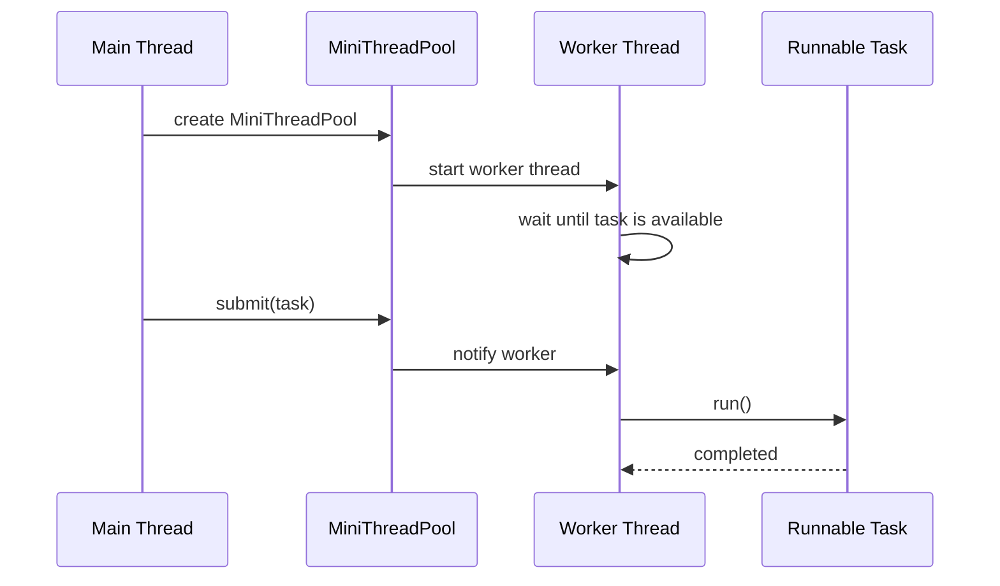
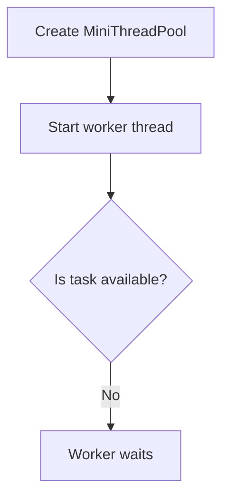
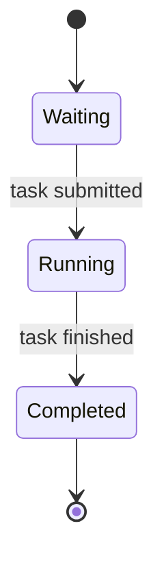
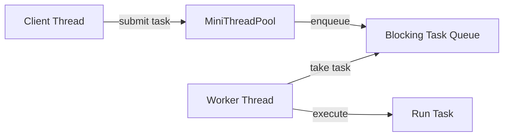

# 001_Single_Worker_Thread.md

# MiniThreadPool — Phase 1: Single Worker Thread

## Clickable Index

- [1. Goal](#1-goal)
- [2. What We Build In This Phase](#2-what-we-build-in-this-phase)
- [3. What Changes From Previous Phase](#3-what-changes-from-previous-phase)
- [4. Core Idea](#4-core-idea)
- [5. Architecture Diagram](#5-architecture-diagram)
- [6. Thread Lifecycle Diagram](#6-thread-lifecycle-diagram)
- [7. File Structure](#7-file-structure)
- [8. Complete Java Code](#8-complete-java-code)
  - [8.1 MiniTask.java](#81-minitaskjava)
  - [8.2 MiniThreadPool.java](#82-minithreadpooljava)
  - [8.3 SingleWorkerThreadDriver.java](#83-singleworkerthreaddriverjava)
- [9. Step-by-Step Dry Run](#9-step-by-step-dry-run)
- [10. Output Example](#10-output-example)
- [11. Real-World Use Case](#11-real-world-use-case)
- [12. DSA / CP Connection](#12-dsa--cp-connection)
- [13. Interview Notes](#13-interview-notes)
- [14. Limitations Of This Phase](#14-limitations-of-this-phase)
- [15. Next Phase Preview](#15-next-phase-preview)

---

# 1. Goal

In this phase, we build the simplest possible **MiniThreadPool**.

It has:

- one worker thread
- one task slot
- a `submit()` method
- task execution in background
- no blocking queue yet
- no multiple workers yet
- no shutdown yet

The purpose is to understand the heart of every thread pool:

```text
Client submits work → worker thread executes work asynchronously
```

---

# 2. What We Build In This Phase

We will build this flow:

```text
Main thread submits a task
MiniThreadPool stores the task
Worker thread picks the task
Worker thread runs the task
Main thread continues independently
```

This is the baby version of Java's `ExecutorService`.

---

# 3. What Changes From Previous Phase

This is **Phase 1**, so there is no previous phase.

We are starting from zero.

Current phase adds:

```text
Runnable task + background worker thread + submit method
```

---

# 4. Core Idea

Normally, if you call a method directly, the main thread executes it.

```java
sendEmail();
```

That means the main thread waits until `sendEmail()` is complete.

In a thread pool, the main thread gives the task to another worker thread.

```java
pool.submit(() -> sendEmail());
```

Now the main thread can continue doing other work.

---

# 5. Architecture Diagram



In this phase, we use only one task slot.

That means only one task can be submitted safely.

In the next phase, we replace this single task slot with a proper blocking queue.

---

# 6. Thread Lifecycle Diagram



---

# 7. File Structure

```text
mini-threadpool/
└── src/
    └── main/
        └── java/
            └── com/
                └── minithreadpool/
                    ├── MiniTask.java
                    ├── MiniThreadPool.java
                    └── SingleWorkerThreadDriver.java
```

---

# 8. Complete Java Code

## 8.1 MiniTask.java

```java
package com.minithreadpool;

@FunctionalInterface
public interface MiniTask {
    void execute();
}
```

### Why create `MiniTask`?

Java already has `Runnable`, but creating our own interface helps us understand the internals clearly.

Later, we can replace it with:

```java
Runnable
Callable<T>
Future<T>
```

---

## 8.2 MiniThreadPool.java

```java
package com.minithreadpool;

public class MiniThreadPool {

    private MiniTask task;
    private final Object lock = new Object();

    public MiniThreadPool() {
        Thread worker = new Thread(() -> {
            try {
                runWorkerLoop();
            } catch (InterruptedException e) {
                Thread.currentThread().interrupt();
                System.out.println("Worker interrupted");
            }
        });

        worker.setName("mini-worker-1");
        worker.start();
    }

    public void submit(MiniTask newTask) {
        synchronized (lock) {
            this.task = newTask;
            lock.notify();
        }
    }

    private void runWorkerLoop() throws InterruptedException {
        MiniTask taskToRun;

        synchronized (lock) {
            while (task == null) {
                lock.wait();
            }

            taskToRun = task;
            task = null;
        }

        System.out.println(Thread.currentThread().getName() + " picked task");
        taskToRun.execute();
        System.out.println(Thread.currentThread().getName() + " completed task");
    }
}
```

### Important parts

```java
private MiniTask task;
```

This is the single task slot.

---

```java
private final Object lock = new Object();
```

This lock protects shared data between the main thread and worker thread.

Shared data:

```java
task
```

---

```java
lock.wait();
```

Worker thread sleeps until a task is submitted.

---

```java
lock.notify();
```

Main thread wakes up the worker thread after submitting the task.

---

## 8.3 SingleWorkerThreadDriver.java

```java
package com.minithreadpool;

public class SingleWorkerThreadDriver {

    public static void main(String[] args) throws InterruptedException {
        MiniThreadPool pool = new MiniThreadPool();

        System.out.println("Main thread submitting task...");

        pool.submit(() -> {
            System.out.println("Task started by " + Thread.currentThread().getName());

            try {
                Thread.sleep(1000);
            } catch (InterruptedException e) {
                Thread.currentThread().interrupt();
            }

            System.out.println("Task finished by " + Thread.currentThread().getName());
        });

        System.out.println("Main thread is free to continue...");

        Thread.sleep(2000);
        System.out.println("Main method completed");
    }
}
```

---

# 9. Step-by-Step Dry Run

## Initial State

```text
task = null
worker thread = started
main thread = running
```

Worker starts and enters this code:

```java
while (task == null) {
    lock.wait();
}
```

So the worker sleeps.

---

## Step 1: Main Creates Pool

```java
MiniThreadPool pool = new MiniThreadPool();
```

Internally:

```text
worker thread starts
worker checks task
no task found
worker waits
```

Diagram:



---

## Step 2: Main Submits Task

```java
pool.submit(() -> {
    System.out.println("Task started");
});
```

Inside submit:

```java
synchronized (lock) {
    this.task = newTask;
    lock.notify();
}
```

Now:

```text
task = submitted task
worker = notified
```

---

## Step 3: Worker Wakes Up

Worker continues from:

```java
lock.wait();
```

Then it checks:

```java
while (task == null)
```

Now task is not null.

So worker copies the task:

```java
taskToRun = task;
task = null;
```

Why copy to local variable?

Because we do not want to run the task while holding the lock.

Bad idea:

```java
synchronized (lock) {
    task.execute();
}
```

Good idea:

```java
synchronized (lock) {
    taskToRun = task;
    task = null;
}

taskToRun.execute();
```

This keeps the synchronized section small.

---

## Step 4: Worker Executes Task

```java
taskToRun.execute();
```

The task runs on:

```text
mini-worker-1
```

Not on:

```text
main
```

This is the key learning.

---

# 10. Output Example

Possible output:

```text
Main thread submitting task...
Main thread is free to continue...
mini-worker-1 picked task
Task started by mini-worker-1
Task finished by mini-worker-1
mini-worker-1 completed task
Main method completed
```

The exact order may vary because threads are scheduled by the operating system.

---

# 11. Real-World Use Case

This simple idea appears everywhere.

## Web Server

```text
Request comes in
Worker thread handles request
Main acceptor thread continues accepting more connections
```

## Kafka Consumer

```text
Consumer reads message
Worker thread processes message
Consumer continues polling
```

## Payment System

```text
API receives payment request
Background worker performs fraud check / notification / settlement
API responds quickly
```

## Video Processing

```text
User uploads video
Background worker transcodes video
Main request thread returns upload success
```

---

# 12. DSA / CP Connection

This phase is related to these concepts:

## Queue Thinking

Even though we do not have a real queue yet, the idea is:

```text
producer produces work
consumer consumes work
```

This is the same mental model as BFS:

```text
push node into queue
pop node from queue
process node
```

## State Machine

Worker has states:

```text
WAITING → RUNNING → COMPLETED
```

Diagram:



## Synchronization Is Like Critical Section

Only one thread should modify shared task state at a time.

Shared state:

```java
task
```

Protected by:

```java
synchronized (lock)
```

---

# 13. Interview Notes

## Why do we need synchronized?

Because two threads access shared data:

```text
main thread writes task
worker thread reads task
```

Without synchronization:

- worker may not see latest task
- race condition can happen
- memory visibility issue can happen

---

## Why use wait and notify?

Without `wait()`, worker may do busy waiting:

```java
while (task == null) {
    // keep checking forever
}
```

This wastes CPU.

With `wait()`:

```java
while (task == null) {
    lock.wait();
}
```

Worker sleeps efficiently.

---

## Why check condition inside while, not if?

Use this:

```java
while (task == null) {
    lock.wait();
}
```

Not this:

```java
if (task == null) {
    lock.wait();
}
```

Reason:

- spurious wakeups can happen
- another thread may consume the task before this worker runs
- condition must always be rechecked

---

## Why not run task inside synchronized block?

Because task may take long time.

If worker holds lock while executing task:

```java
synchronized (lock) {
    task.execute();
}
```

Then other threads cannot submit new tasks during execution.

Better:

```java
synchronized (lock) {
    taskToRun = task;
    task = null;
}

taskToRun.execute();
```

---

# 14. Limitations Of This Phase

This version is intentionally simple.

Problems:

1. Only one task can be submitted safely.
2. If two tasks are submitted quickly, the second may overwrite the first.
3. Worker exits after one task.
4. No task queue.
5. No multiple workers.
6. No graceful shutdown.
7. No exception handling.
8. No metrics.
9. No rejection policy.

Example problem:

```java
pool.submit(task1);
pool.submit(task2);
```

Since we only have one task slot, `task2` may overwrite `task1` before worker picks it.

That is why real thread pools need queues.

---

# 15. Next Phase Preview

Next file:

```text
002_Blocking_Task_Queue.md
```

We will add:

- custom blocking queue
- multiple task storage
- worker loop
- producer-consumer pattern
- no task overwrite

Next architecture:



This is where MiniThreadPool starts becoming similar to real Java `ThreadPoolExecutor`.
