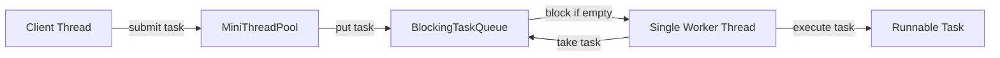
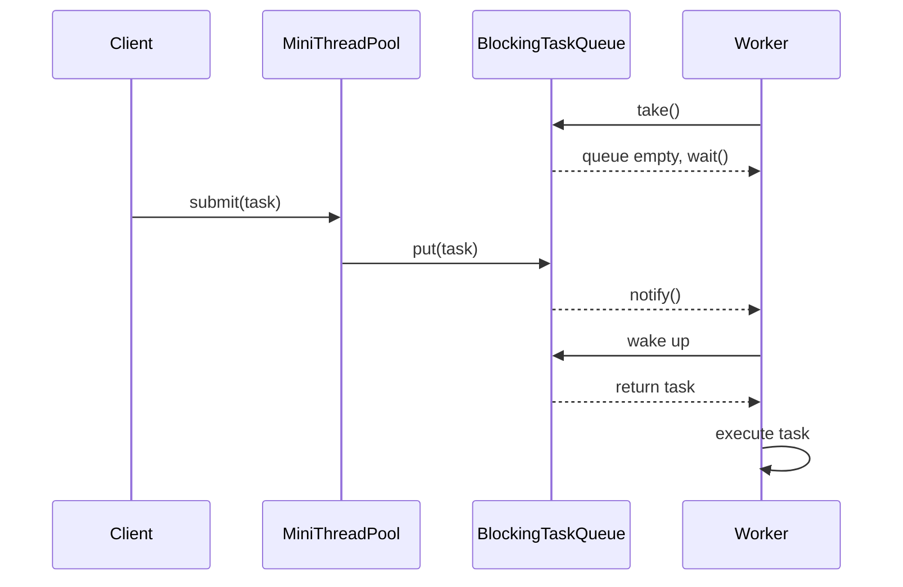
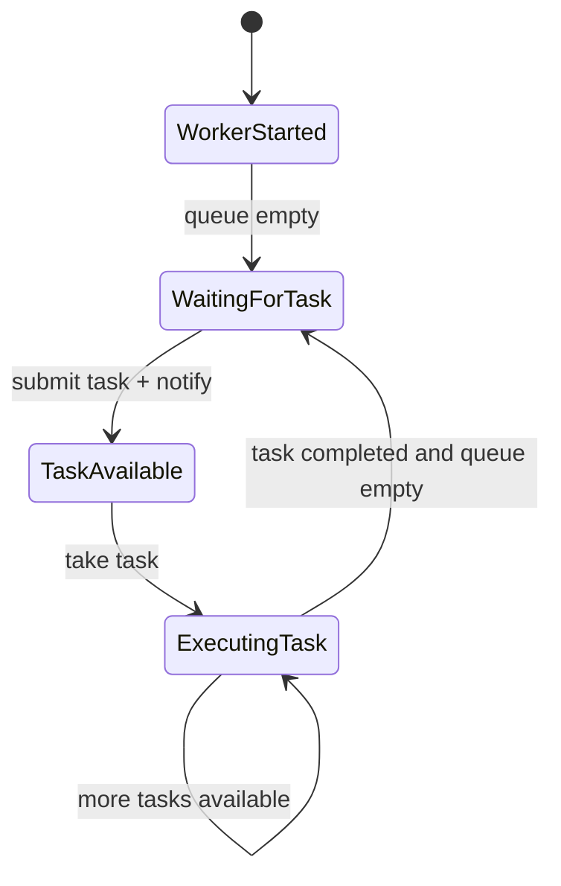
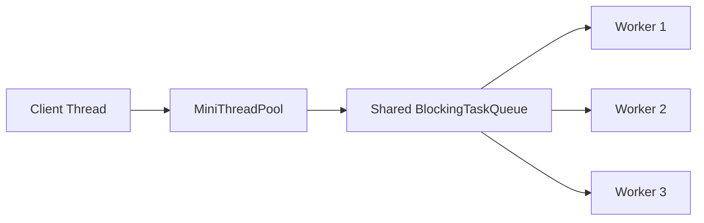

# 002_Blocking_Task_Queue.md

# MiniThreadPool — Phase 002: Blocking Task Queue

## 1. Goal

In Phase 001, we created a **single worker thread** that checks a task queue and executes tasks.

But there was one problem:

```text
Worker keeps checking queue again and again.
If no task exists, worker sleeps and checks again.
```

That is not production style.

In this phase, we build a **Blocking Task Queue**.

The worker thread should:

```text
Wait when queue is empty.
Wake up automatically when a new task is submitted.
Execute the task.
Again wait when queue is empty.
```

This is the core idea behind:

- Java `BlockingQueue`
- Thread pools
- Kafka consumer workers
- Async job executors
- Payment processing workers
- Notification workers
- Video processing workers

---

## 2. What Changes From Phase 001?

| Phase 001 | Phase 002 |
|---|---|
| Worker checks queue manually | Worker waits when queue is empty |
| Uses sleep/polling style | Uses `wait()` and `notify()` |
| Wastes CPU when no task exists | No CPU waste while idle |
| Queue logic inside pool | Separate `BlockingTaskQueue` class |
| Good for learning basics | Closer to real thread pool internals |

---

## 3. Core Idea

### Before

```text
while true:
    check queue
    if task exists:
        execute task
    else:
        sleep
```

### Now

```text
while true:
    task = queue.take()

    if queue is empty:
        worker waits

    when producer submits task:
        producer notifies worker

    worker wakes up and executes task
```

---

## 4. Architecture Diagram



---

## 5. Worker Waiting Flow



---

## 6. Why Blocking Queue Is Important

Without blocking queue:

```text
worker loop -> check queue -> sleep -> check again -> sleep
```

This wastes CPU and adds delay.

With blocking queue:

```text
worker sleeps inside wait()
worker wakes only when task is available
```

This gives:

- Better CPU usage
- Cleaner worker logic
- Faster response when task arrives
- Foundation for production thread pools

---

## 7. Java Concepts Used

| Concept | Meaning |
|---|---|
| `synchronized` | Allows only one thread to access critical section |
| `wait()` | Releases lock and waits |
| `notify()` | Wakes one waiting thread |
| `while(queue.isEmpty())` | Protects from spurious wakeups |
| `Runnable` | Represents a task |
| Worker thread | Background thread executing tasks |

---

## 8. Important Rule: Always Use `while`, Not `if`

Wrong:

```java
if (queue.isEmpty()) {
    wait();
}
```

Correct:

```java
while (queue.isEmpty()) {
    wait();
}
```

Why?

Because a thread can wake up even without a real task. This is called a **spurious wakeup**.

So after waking up, the worker must check the condition again.

---

## 9. File Structure

```text
mini-threadpool/
└── src/
    └── main/
        └── java/
            └── com/
                └── minithreadpool/
                    ├── BlockingTaskQueue.java
                    ├── MiniThreadPool.java
                    └── Phase2BlockingTaskQueueDriver.java
```

---

# 10. Complete Java Code

---

## 10.1 BlockingTaskQueue.java

```java
package com.minithreadpool;

import java.util.LinkedList;
import java.util.Queue;

public class BlockingTaskQueue {

    private final Queue<Runnable> queue = new LinkedList<>();

    public synchronized void put(Runnable task) {
        queue.offer(task);
        notify();
    }

    public synchronized Runnable take() throws InterruptedException {
        while (queue.isEmpty()) {
            wait();
        }

        return queue.poll();
    }

    public synchronized int size() {
        return queue.size();
    }
}
```

---

## 10.2 MiniThreadPool.java

```java
package com.minithreadpool;

public class MiniThreadPool {

    private final BlockingTaskQueue taskQueue;
    private final Thread worker;

    public MiniThreadPool() {
        this.taskQueue = new BlockingTaskQueue();

        this.worker = new Thread(() -> {
            while (true) {
                try {
                    Runnable task = taskQueue.take();
                    task.run();
                } catch (InterruptedException e) {
                    Thread.currentThread().interrupt();
                    System.out.println("Worker interrupted. Stopping worker.");
                    break;
                } catch (Exception e) {
                    System.out.println("Task failed: " + e.getMessage());
                }
            }
        });

        this.worker.setName("mini-threadpool-worker-1");
        this.worker.start();
    }

    public void submit(Runnable task) {
        taskQueue.put(task);
    }

    public int getQueueSize() {
        return taskQueue.size();
    }
}
```

---

## 10.3 Phase2BlockingTaskQueueDriver.java

```java
package com.minithreadpool;

public class Phase2BlockingTaskQueueDriver {

    public static void main(String[] args) throws InterruptedException {
        MiniThreadPool pool = new MiniThreadPool();

        System.out.println("Main thread started.");
        System.out.println("No task submitted yet.");
        System.out.println("Worker is waiting inside BlockingTaskQueue.take().");

        Thread.sleep(2000);

        pool.submit(() -> {
            System.out.println("Task 1 executed by " + Thread.currentThread().getName());
        });

        pool.submit(() -> {
            System.out.println("Task 2 executed by " + Thread.currentThread().getName());
        });

        pool.submit(() -> {
            System.out.println("Task 3 executed by " + Thread.currentThread().getName());
        });

        Thread.sleep(2000);

        System.out.println("Main thread completed.");
    }
}
```

---

# 11. Expected Output

Output order can slightly vary, but it will look like this:

```text
Main thread started.
No task submitted yet.
Worker is waiting inside BlockingTaskQueue.take().
Task 1 executed by mini-threadpool-worker-1
Task 2 executed by mini-threadpool-worker-1
Task 3 executed by mini-threadpool-worker-1
Main thread completed.
```

---

# 12. Step-by-Step Dry Run

## Initial State

```text
Queue = []
Worker = started
```

Worker calls:

```java
taskQueue.take();
```

Inside `take()`:

```java
while (queue.isEmpty()) {
    wait();
}
```

Because queue is empty:

```text
Worker releases lock.
Worker goes into waiting state.
CPU is not wasted.
```

---

## After 2 Seconds

Main thread submits task 1:

```java
pool.submit(task1);
```

Internally:

```java
taskQueue.put(task1);
```

Queue becomes:

```text
Queue = [task1]
```

Then:

```java
notify();
```

Worker wakes up.

---

## Worker Executes Task 1

Worker continues from `wait()`:

```java
return queue.poll();
```

Queue becomes:

```text
Queue = []
```

Worker executes:

```java
task.run();
```

Output:

```text
Task 1 executed by mini-threadpool-worker-1
```

---

## Task 2 And Task 3

Main thread submits:

```text
task2
task3
```

Queue temporarily becomes:

```text
Queue = [task2, task3]
```

Worker takes one by one:

```text
take task2 -> execute
take task3 -> execute
```

Final queue:

```text
Queue = []
```

Worker again waits.

---

# 13. Internal State Diagram



---

# 14. Thread State Mental Model

```text
NEW
 |
 | start()
 v
RUNNABLE
 |
 | queue empty + wait()
 v
WAITING
 |
 | notify()
 v
RUNNABLE
 |
 | task.run()
 v
RUNNABLE
```

---

# 15. Why `wait()` Releases Lock

This is very important.

When worker calls:

```java
wait();
```

It does two things:

```text
1. Worker releases the synchronized lock.
2. Worker goes to waiting state.
```

If `wait()` did not release the lock, producer would never be able to enter `put()`.

That would cause deadlock.

---

# 16. Why `notify()` Is Enough Here

In this phase, we have only one worker thread.

So this is enough:

```java
notify();
```

Because only one worker may be waiting.

Later, when we build fixed thread pool with multiple workers, we will use:

```java
notifyAll();
```

or a more advanced queue design.

---

# 17. Real-World Mapping

## ThreadPoolExecutor

Java's real thread pool internally uses a blocking queue:

```java
ExecutorService executor = Executors.newFixedThreadPool(4);
```

Internally:

```text
submit task
   |
   v
BlockingQueue
   |
   v
Worker threads
```

---

## Kafka Consumer Worker

```text
Kafka topic
   |
   v
consumer polls records
   |
   v
task queue
   |
   v
worker processes message
```

Blocking queues are commonly used to decouple:

```text
message fetching
from
message processing
```

---

## Payment System

```text
Payment request
   |
   v
queue
   |
   v
worker validates payment
   |
   v
worker calls payment gateway
   |
   v
worker updates DB
```

The worker should not burn CPU while waiting for payment jobs.

---

# 18. DSA / CP Connection

This phase connects to DSA in a simple way.

## Queue

We use FIFO queue:

```text
first submitted task -> first executed task
```

This is same as:

```text
BFS queue
level order traversal queue
producer-consumer queue
```

## Producer-Consumer Pattern

```text
Producer = submitter thread
Consumer = worker thread
Buffer = blocking task queue
```

## Important In CP/DSA Terms

| ThreadPool Concept | DSA/CP Concept |
|---|---|
| Task queue | FIFO queue |
| Worker takes task | Pop front |
| Submit task | Push back |
| Empty queue wait | Blocking condition |
| Multiple producers | Multiple insert operations |
| Consumer | Processing loop |

---

# 19. Interview Notes

## Common Question 1

### Why do we need blocking queue?

Because workers should not waste CPU by repeatedly checking an empty queue.

---

## Common Question 2

### Why use `while` around `wait()`?

Because of spurious wakeups. After waking, thread must re-check queue condition.

---

## Common Question 3

### Difference between `sleep()` and `wait()`?

| `sleep()` | `wait()` |
|---|---|
| Does not release lock | Releases lock |
| Used for time delay | Used for coordination |
| Static method of `Thread` | Method of `Object` |
| No notify needed | Needs notify/notifyAll |

---

## Common Question 4

### What happens when `notify()` is called?

One waiting thread wakes up and tries to reacquire the lock.

Important:

```text
notify() does not immediately run the waiting thread.
It only moves it from waiting state to runnable state.
```

---

# 20. Limitations Of This Phase

This phase is still not production ready.

Current limitations:

- Only one worker
- No bounded queue
- No rejection policy
- No graceful shutdown
- No future/result support
- No metrics
- No priority
- No scheduled execution

We will fix these in upcoming phases.

---

# 21. Next Phase Preview

Next file:

```text
003_Fixed_Thread_Pool.md
```

In that phase, we will upgrade from:

```text
one worker
```

to:

```text
multiple workers
```

Architecture will become:



This is the real beginning of a thread pool.

---

# 22. Phase 002 Summary

You now built:

```text
Client submits Runnable task
MiniThreadPool accepts task
BlockingTaskQueue stores task
Worker blocks when queue is empty
Worker wakes up when task arrives
Worker executes task
```

Core learning:

```text
Blocking queue = foundation of real thread pools.
```
