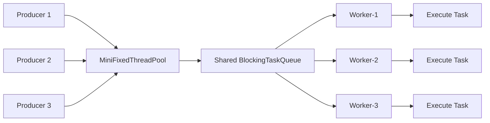
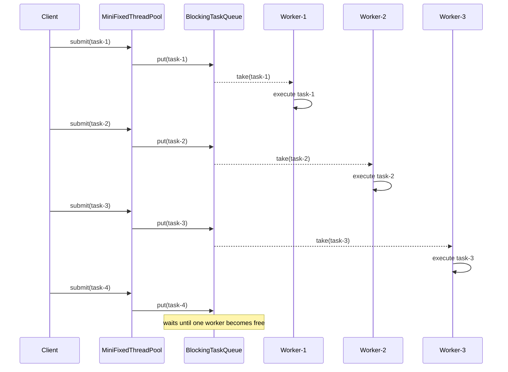
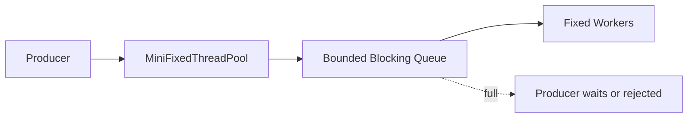

# 003_Fixed_Thread_Pool.md

# MiniThreadPool — Phase 003: Fixed Thread Pool

## Clickable Index

- [1. Goal](#1-goal)
- [2. What Changed From Previous Phase](#2-what-changed-from-previous-phase)
- [3. Mental Model](#3-mental-model)
- [4. Architecture Diagram](#4-architecture-diagram)
- [5. Execution Flow](#5-execution-flow)
- [6. File Structure](#6-file-structure)
- [7. Complete Java Code](#7-complete-java-code)
  - [7.1 Task.java](#71-taskjava)
  - [7.2 BlockingTaskQueue.java](#72-blockingtaskqueuejava)
  - [7.3 Worker.java](#73-workerjava)
  - [7.4 MiniFixedThreadPool.java](#74-minifixedthreadpooljava)
  - [7.5 Phase3FixedThreadPoolDriver.java](#75-phase3fixedthreadpooldriverjava)
- [8. Step-by-Step Dry Run](#8-step-by-step-dry-run)
- [9. Output Example](#9-output-example)
- [10. Why This Is Important](#10-why-this-is-important)
- [11. Real-World Mapping](#11-real-world-mapping)
- [12. DSA / CP Connection](#12-dsa--cp-connection)
- [13. Interview Notes](#13-interview-notes)
- [14. Current Limitations](#14-current-limitations)
- [15. Next Phase](#15-next-phase)

---

## 1. Goal

In Phase 003, we upgrade from:

```text
1 worker thread + 1 blocking queue
```

to:

```text
N worker threads + 1 shared blocking queue
```

This is the first real version of a **fixed-size thread pool**.

The number of worker threads is fixed at construction time.

Example:

```java
MiniFixedThreadPool pool = new MiniFixedThreadPool(3);
```

This means:

```text
Worker-1
Worker-2
Worker-3
```

All workers compete for tasks from the same queue.

---

## 2. What Changed From Previous Phase

### Phase 002

```text
Producer → Blocking Queue → Single Worker
```

Only one task could run at a time.

### Phase 003

```text
Producer → Blocking Queue → Multiple Workers
```

Multiple tasks can run in parallel.

| Feature | Phase 002 | Phase 003 |
|---|---:|---:|
| Blocking queue | Yes | Yes |
| Worker count | 1 | N |
| Parallel execution | No | Yes |
| Shared queue | Yes | Yes |
| Fixed-size pool | No | Yes |
| Shutdown | Basic stop flag | Basic stop flag |

---

## 3. Mental Model

A fixed thread pool is like a restaurant kitchen.

```text
Customers submit orders.
Orders wait in a queue.
Multiple chefs pick orders.
Each chef cooks one order at a time.
```

Mapping:

| Restaurant | Thread Pool |
|---|---|
| Customer | Client / Producer |
| Order | Task |
| Order queue | BlockingTaskQueue |
| Chef | Worker thread |
| Kitchen | MiniFixedThreadPool |

Key idea:

```text
Many producers can submit tasks.
Many workers can consume tasks.
Queue is the buffer between them.
```

---

## 4. Architecture Diagram



---

## 5. Execution Flow



---

## 6. File Structure

```text
mini-thread-pool/
└── src/
    └── main/
        └── java/
            └── com/
                └── minithreadpool/
                    └── phase003/
                        ├── Task.java
                        ├── BlockingTaskQueue.java
                        ├── Worker.java
                        ├── MiniFixedThreadPool.java
                        └── Phase3FixedThreadPoolDriver.java
```

Package name:

```java
package com.minithreadpool.phase003;
```

---

# 7. Complete Java Code

---

## 7.1 Task.java

```java
package com.minithreadpool.phase003;

@FunctionalInterface
public interface Task {
    void execute();
}
```

### Why create `Task`?

We use our own interface to understand the internals.

Later, we can map this to Java's built-in:

```java
Runnable
Callable<T>
Future<T>
ExecutorService
```

Current phase uses:

```text
Task = void job with no result
```

---

## 7.2 BlockingTaskQueue.java

```java
package com.minithreadpool.phase003;

import java.util.LinkedList;
import java.util.Queue;

public class BlockingTaskQueue {

    private final Queue<Task> queue = new LinkedList<>();

    public synchronized void put(Task task) {
        queue.offer(task);
        notifyAll();
    }

    public synchronized Task take() throws InterruptedException {
        while (queue.isEmpty()) {
            wait();
        }

        return queue.poll();
    }

    public synchronized int size() {
        return queue.size();
    }
}
```

### Important Points

```java
while (queue.isEmpty()) {
    wait();
}
```

Use `while`, not `if`.

Reason:

```text
A waiting thread can wake up even when no task is available.
This is called spurious wakeup.
```

So always re-check the condition.

---

## 7.3 Worker.java

```java
package com.minithreadpool.phase003;

public class Worker implements Runnable {

    private final String workerName;
    private final BlockingTaskQueue taskQueue;
    private volatile boolean running = true;

    public Worker(String workerName, BlockingTaskQueue taskQueue) {
        this.workerName = workerName;
        this.taskQueue = taskQueue;
    }

    @Override
    public void run() {
        System.out.println(workerName + " started");

        while (running) {
            try {
                Task task = taskQueue.take();

                System.out.println(workerName + " picked a task");

                task.execute();

                System.out.println(workerName + " completed a task");

            } catch (InterruptedException e) {
                Thread.currentThread().interrupt();
                System.out.println(workerName + " interrupted");
                break;
            } catch (Exception e) {
                System.out.println(workerName + " task failed: " + e.getMessage());
            }
        }

        System.out.println(workerName + " stopped");
    }

    public void stop() {
        running = false;
    }
}
```

### Why `volatile boolean running`?

Multiple threads access this variable.

One thread calls:

```java
worker.stop();
```

Another thread runs:

```java
while (running)
```

`volatile` guarantees the worker sees the latest value.

---

## 7.4 MiniFixedThreadPool.java

```java
package com.minithreadpool.phase003;

import java.util.ArrayList;
import java.util.List;

public class MiniFixedThreadPool {

    private final BlockingTaskQueue taskQueue;
    private final List<Worker> workers;
    private final List<Thread> workerThreads;

    public MiniFixedThreadPool(int poolSize) {
        if (poolSize <= 0) {
            throw new IllegalArgumentException("poolSize must be greater than 0");
        }

        this.taskQueue = new BlockingTaskQueue();
        this.workers = new ArrayList<>();
        this.workerThreads = new ArrayList<>();

        for (int i = 1; i <= poolSize; i++) {
            Worker worker = new Worker("worker-" + i, taskQueue);
            Thread thread = new Thread(worker, "worker-thread-" + i);

            workers.add(worker);
            workerThreads.add(thread);

            thread.start();
        }
    }

    public void submit(Task task) {
        if (task == null) {
            throw new IllegalArgumentException("task cannot be null");
        }

        taskQueue.put(task);
    }

    public int getQueueSize() {
        return taskQueue.size();
    }

    public void shutdownNow() {
        for (Worker worker : workers) {
            worker.stop();
        }

        for (Thread thread : workerThreads) {
            thread.interrupt();
        }
    }
}
```

### Why `shutdownNow()` interrupts threads?

A worker may be blocked inside:

```java
taskQueue.take()
```

If the queue is empty, the worker waits.

Calling only:

```java
worker.stop();
```

is not enough, because worker may not wake up.

So we interrupt the worker thread:

```java
thread.interrupt();
```

This wakes it from `wait()`.

---

## 7.5 Phase3FixedThreadPoolDriver.java

```java
package com.minithreadpool.phase003;

public class Phase3FixedThreadPoolDriver {

    public static void main(String[] args) throws InterruptedException {

        MiniFixedThreadPool pool = new MiniFixedThreadPool(3);

        for (int i = 1; i <= 8; i++) {
            int taskId = i;

            pool.submit(() -> {
                System.out.println(
                        "Task-" + taskId + " started by " +
                        Thread.currentThread().getName()
                );

                try {
                    Thread.sleep(1000);
                } catch (InterruptedException e) {
                    Thread.currentThread().interrupt();
                    System.out.println("Task-" + taskId + " interrupted");
                    return;
                }

                System.out.println(
                        "Task-" + taskId + " finished by " +
                        Thread.currentThread().getName()
                );
            });
        }

        Thread.sleep(4000);

        System.out.println("Queue size before shutdown: " + pool.getQueueSize());

        pool.shutdownNow();
    }
}
```

---

# 8. Step-by-Step Dry Run

Pool size:

```text
3 workers
```

Tasks submitted:

```text
Task-1 to Task-8
```

Each task takes:

```text
1 second
```

### Initial State

```text
Queue = []
Workers = worker-1, worker-2, worker-3
```

Workers start and wait:

```text
worker-1 waiting
worker-2 waiting
worker-3 waiting
```

---

### Step 1: Submit Task-1

```text
Queue = [Task-1]
```

One worker wakes up.

```text
worker-1 picks Task-1
Queue = []
```

---

### Step 2: Submit Task-2

```text
Queue = [Task-2]
```

Another worker wakes up.

```text
worker-2 picks Task-2
Queue = []
```

---

### Step 3: Submit Task-3

```text
Queue = [Task-3]
```

Third worker wakes up.

```text
worker-3 picks Task-3
Queue = []
```

---

### Step 4: Submit Task-4 to Task-8

All workers are busy.

So tasks wait in the queue:

```text
Queue = [Task-4, Task-5, Task-6, Task-7, Task-8]
```

Current execution:

```text
worker-1 → Task-1
worker-2 → Task-2
worker-3 → Task-3
```

---

### Step 5: First Batch Completes

After around 1 second:

```text
Task-1 done
Task-2 done
Task-3 done
```

Workers immediately take next tasks:

```text
worker-1 → Task-4
worker-2 → Task-5
worker-3 → Task-6
```

Queue becomes:

```text
Queue = [Task-7, Task-8]
```

---

### Step 6: Second Batch Completes

After another second:

```text
Task-4 done
Task-5 done
Task-6 done
```

Workers pick remaining tasks:

```text
worker-1 → Task-7
worker-2 → Task-8
worker-3 → waiting
```

Queue becomes:

```text
Queue = []
```

---

### Visual Dry Run

```text
Time 0s:
worker-1 -> Task-1
worker-2 -> Task-2
worker-3 -> Task-3
queue    -> Task-4, Task-5, Task-6, Task-7, Task-8

Time 1s:
worker-1 -> Task-4
worker-2 -> Task-5
worker-3 -> Task-6
queue    -> Task-7, Task-8

Time 2s:
worker-1 -> Task-7
worker-2 -> Task-8
worker-3 -> waiting
queue    -> empty

Time 3s:
all workers waiting
queue -> empty
```

---

# 9. Output Example

Output order can change because workers run in parallel.

Example:

```text
worker-1 started
worker-2 started
worker-3 started
worker-1 picked a task
worker-2 picked a task
worker-3 picked a task
Task-1 started by worker-thread-1
Task-2 started by worker-thread-2
Task-3 started by worker-thread-3
Task-1 finished by worker-thread-1
worker-1 completed a task
worker-1 picked a task
Task-4 started by worker-thread-1
...
Queue size before shutdown: 0
worker-1 interrupted
worker-1 stopped
worker-2 interrupted
worker-2 stopped
worker-3 interrupted
worker-3 stopped
```

Important:

```text
Exact output order is not deterministic.
```

Reason:

```text
Thread scheduling is controlled by the JVM and operating system.
```

---

# 10. Why This Is Important

This is the foundation of many production systems.

A thread pool solves this problem:

```text
Do not create a new thread for every request.
Reuse a fixed number of worker threads.
Put extra work in a queue.
```

Without a thread pool:

```text
1000 requests = 1000 new threads
```

This can crash the system.

With a fixed thread pool:

```text
1000 requests = fixed workers + queued tasks
```

Example:

```text
1000 requests
10 workers
990 tasks wait in queue
```

---

# 11. Real-World Mapping

| Real System | How Thread Pool Is Used |
|---|---|
| Web server | Request worker pool |
| Kafka consumer | Consume messages using worker threads |
| Payment system | Process payment events asynchronously |
| Notification system | Send email/SMS/push in background |
| Video processing | Process uploaded video chunks |
| Scheduler | Execute scheduled jobs |
| Search indexing | Index documents using worker threads |
| Log aggregator | Parse and push logs in batches |

---

# 12. DSA / CP Connection

This phase connects to these DSA concepts:

| Concept | ThreadPool Version |
|---|---|
| Queue | Task queue |
| Producer-consumer | Submitter and worker |
| BFS-style processing | Tasks processed level by level from queue |
| Simulation | Worker scheduling dry run |
| Concurrency control | synchronized, wait, notifyAll |
| Resource limit | Fixed number of workers |

### CP Mental Model

This is like having:

```text
N processors
M jobs
Each processor takes next available job
```

Common problem pattern:

```text
Minimum time to finish jobs with K workers
```

Here:

```text
K = pool size
jobs = tasks
queue = pending jobs
workers = processors
```

---

# 13. Interview Notes

### Q1. Why use fixed thread pool?

Because creating unlimited threads is dangerous.

A fixed thread pool controls:

```text
CPU usage
memory usage
concurrency level
```

---

### Q2. Why use shared queue?

Because workers need a common place to pull tasks from.

```text
Producer submits to queue.
Workers consume from queue.
```

This separates:

```text
task submission
```

from:

```text
task execution
```

---

### Q3. Why not create thread per task?

Because thread creation is expensive.

Too many threads cause:

```text
context switching
memory pressure
out-of-memory errors
poor latency
```

---

### Q4. Why `notifyAll()` instead of `notify()`?

Because multiple workers may be waiting.

```java
notifyAll();
```

wakes all waiting workers.

Only one will successfully take the task.

The others go back to waiting because of:

```java
while (queue.isEmpty()) {
    wait();
}
```

For production performance, Java's `BlockingQueue` handles this better internally.

---

### Q5. What is the main bottleneck now?

The task queue is synchronized.

At very high load, many producers and workers compete for the same lock.

Later improvements:

```text
bounded queue
lock splitting
java.util.concurrent.BlockingQueue
work stealing
metrics
backpressure
```

---

# 14. Current Limitations

This phase is still simple.

Limitations:

```text
No bounded queue
No rejection policy
No graceful shutdown
No task result
No Future
No priority
No metrics
No completed task counter
No active worker counter
No production-grade lifecycle
```

But this is enough to understand the core thread pool idea.

---

# 15. Next Phase

Next file:

```text
004_Bounded_Queue_Backpressure.md
```

In the next phase, we add queue capacity.

Current problem:

```text
Queue can grow forever.
```

Example:

```text
Workers can process 100 tasks/sec.
Producers submit 10,000 tasks/sec.
Queue keeps growing.
Memory can explode.
```

So we add:

```text
bounded queue
backpressure
submit waits when queue is full
```

Next architecture:


