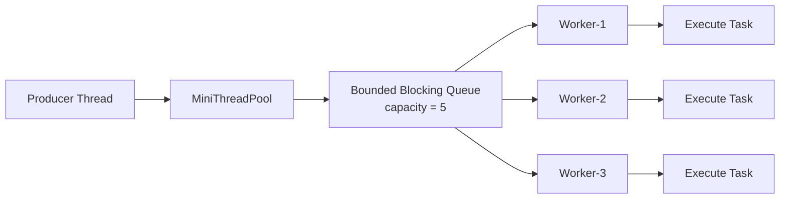
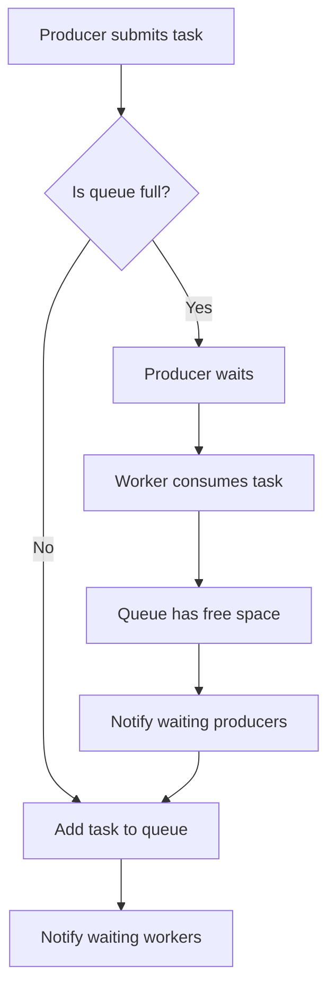
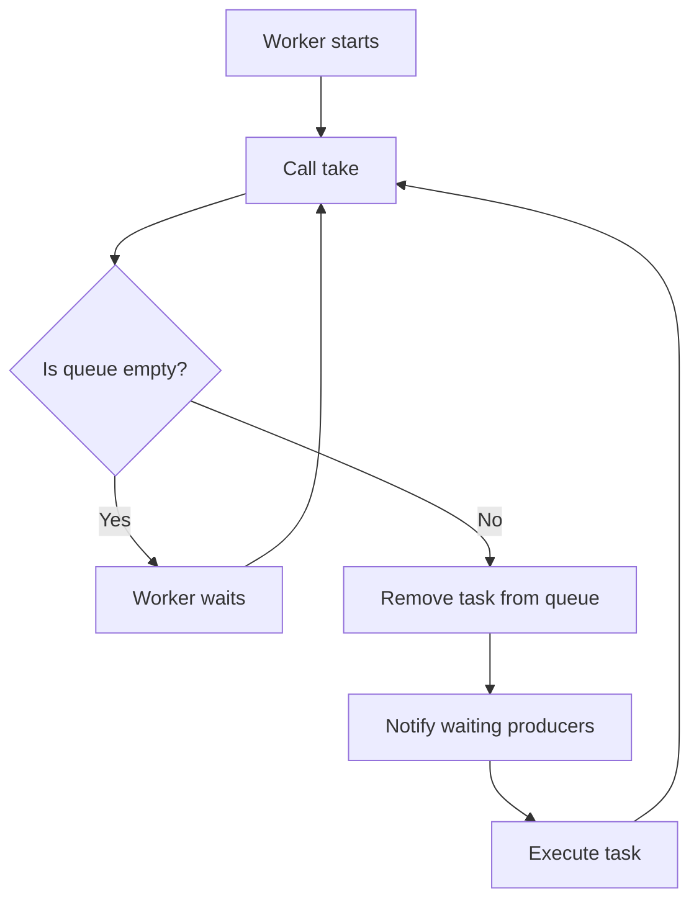

# 004_Bounded_Queue_Backpressure.md

# MiniThreadPool — Phase 004: Bounded Queue + Backpressure

## 1. Goal

In Phase 003, we built a **fixed thread pool**:

- Multiple worker threads
- One shared blocking queue
- Producers submit tasks
- Workers consume tasks

But the queue was effectively **unbounded**.

That means producers can keep submitting tasks forever.

If workers are slower than producers, memory keeps growing.

In real production systems, this can crash the JVM with:

```text
java.lang.OutOfMemoryError: Java heap space
```

So in this phase, we add a **bounded queue**.

The queue has a fixed capacity.

If the queue is full, the producer waits.

This waiting is called **backpressure**.

---

## 2. What Changes From Previous Phase?

| Phase | Feature |
|---|---|
| 003 | Fixed number of workers |
| 003 | Shared blocking queue |
| 003 | Queue grows without limit |
| 004 | Queue has max capacity |
| 004 | Producer waits when queue is full |
| 004 | Worker notifies producer after consuming |
| 004 | Prevents memory explosion |

---

## 3. Why Bounded Queue Is Needed

Imagine this:

```text
Producer speed  = 1000 tasks / second
Worker capacity = 100 tasks / second
```

Without bounded queue:

```text
900 extra tasks / second accumulate in memory
```

After some time:

```text
Queue size = millions of tasks
JVM memory = full
System crashes
```

With bounded queue:

```text
Queue capacity = 5
If queue is full, producer waits
System slows down safely instead of crashing
```

---

## 4. Architecture Diagram



---

## 5. Backpressure Flow



---

## 6. Worker Flow



---

## 7. File Structure

```text
mini-thread-pool/
└── src/
    └── main/
        └── java/
            └── com/
                └── minithreadpool/
                    ├── task/
                    │   └── MiniTask.java
                    ├── queue/
                    │   └── BoundedBlockingTaskQueue.java
                    ├── pool/
                    │   ├── MiniThreadPool.java
                    │   └── Worker.java
                    └── driver/
                        └── Phase004BoundedQueueDriver.java
```

---

## 8. Core Concept

A bounded blocking queue needs two blocking conditions.

### Producer condition

Producer waits when queue is full.

```java
while (queue.size() == capacity) {
    wait();
}
```

### Worker condition

Worker waits when queue is empty.

```java
while (queue.isEmpty()) {
    wait();
}
```

### Why `while` and not `if`?

Because Java threads can wake up even without a real notification.

This is called **spurious wakeup**.

So always re-check the condition using `while`.

---

# 9. Complete Java Code

---

## 9.1 MiniTask.java

```java
package com.minithreadpool.task;

@FunctionalInterface
public interface MiniTask {
    void execute();
}
```

---

## 9.2 BoundedBlockingTaskQueue.java

```java
package com.minithreadpool.queue;

import com.minithreadpool.task.MiniTask;

import java.util.LinkedList;
import java.util.Queue;

public class BoundedBlockingTaskQueue {

    private final Queue<MiniTask> queue;
    private final int capacity;

    public BoundedBlockingTaskQueue(int capacity) {
        if (capacity <= 0) {
            throw new IllegalArgumentException("Queue capacity must be greater than zero");
        }

        this.capacity = capacity;
        this.queue = new LinkedList<>();
    }

    public synchronized void put(MiniTask task) throws InterruptedException {
        if (task == null) {
            throw new IllegalArgumentException("Task cannot be null");
        }

        while (queue.size() == capacity) {
            System.out.println(Thread.currentThread().getName()
                    + " waiting because queue is full. queueSize=" + queue.size());

            wait();
        }

        queue.offer(task);

        System.out.println(Thread.currentThread().getName()
                + " submitted task. queueSize=" + queue.size());

        notifyAll();
    }

    public synchronized MiniTask take() throws InterruptedException {
        while (queue.isEmpty()) {
            wait();
        }

        MiniTask task = queue.poll();

        System.out.println(Thread.currentThread().getName()
                + " picked task. queueSize=" + queue.size());

        notifyAll();

        return task;
    }

    public synchronized int size() {
        return queue.size();
    }

    public int capacity() {
        return capacity;
    }
}
```

---

## 9.3 Worker.java

```java
package com.minithreadpool.pool;

import com.minithreadpool.queue.BoundedBlockingTaskQueue;
import com.minithreadpool.task.MiniTask;

public class Worker implements Runnable {

    private final BoundedBlockingTaskQueue taskQueue;

    public Worker(BoundedBlockingTaskQueue taskQueue) {
        this.taskQueue = taskQueue;
    }

    @Override
    public void run() {
        while (true) {
            try {
                MiniTask task = taskQueue.take();
                task.execute();
            } catch (InterruptedException e) {
                Thread.currentThread().interrupt();
                System.out.println(Thread.currentThread().getName() + " interrupted. Stopping worker.");
                break;
            } catch (Exception e) {
                System.out.println(Thread.currentThread().getName()
                        + " task failed: " + e.getMessage());
            }
        }
    }
}
```

---

## 9.4 MiniThreadPool.java

```java
package com.minithreadpool.pool;

import com.minithreadpool.queue.BoundedBlockingTaskQueue;
import com.minithreadpool.task.MiniTask;

import java.util.ArrayList;
import java.util.List;

public class MiniThreadPool {

    private final BoundedBlockingTaskQueue taskQueue;
    private final List<Thread> workers;

    public MiniThreadPool(int numberOfWorkers, int queueCapacity) {
        if (numberOfWorkers <= 0) {
            throw new IllegalArgumentException("Number of workers must be greater than zero");
        }

        this.taskQueue = new BoundedBlockingTaskQueue(queueCapacity);
        this.workers = new ArrayList<>();

        for (int i = 1; i <= numberOfWorkers; i++) {
            Thread workerThread = new Thread(
                    new Worker(taskQueue),
                    "mini-worker-" + i
            );

            workers.add(workerThread);
            workerThread.start();
        }
    }

    public void submit(MiniTask task) {
        try {
            taskQueue.put(task);
        } catch (InterruptedException e) {
            Thread.currentThread().interrupt();
            throw new RuntimeException("Task submission interrupted", e);
        }
    }

    public int getQueueSize() {
        return taskQueue.size();
    }

    public int getQueueCapacity() {
        return taskQueue.capacity();
    }
}
```

---

## 9.5 Phase004BoundedQueueDriver.java

```java
package com.minithreadpool.driver;

import com.minithreadpool.pool.MiniThreadPool;

public class Phase004BoundedQueueDriver {

    public static void main(String[] args) {

        int workers = 2;
        int queueCapacity = 3;

        MiniThreadPool threadPool = new MiniThreadPool(workers, queueCapacity);

        for (int i = 1; i <= 10; i++) {
            final int taskId = i;

            threadPool.submit(() -> {
                System.out.println(Thread.currentThread().getName()
                        + " executing task-" + taskId);

                sleep(2000);

                System.out.println(Thread.currentThread().getName()
                        + " completed task-" + taskId);
            });

            System.out.println("Main submitted task-" + taskId);
        }

        System.out.println("All submit calls completed.");
    }

    private static void sleep(long milliseconds) {
        try {
            Thread.sleep(milliseconds);
        } catch (InterruptedException e) {
            Thread.currentThread().interrupt();
        }
    }
}
```

---

# 10. Expected Output

Output order can change because threads run concurrently.

Example:

```text
main submitted task. queueSize=1
Main submitted task-1
main submitted task. queueSize=2
Main submitted task-2
main submitted task. queueSize=3
Main submitted task-3
main waiting because queue is full. queueSize=3
mini-worker-1 picked task. queueSize=2
mini-worker-1 executing task-1
main submitted task. queueSize=3
Main submitted task-4
main waiting because queue is full. queueSize=3
mini-worker-2 picked task. queueSize=2
mini-worker-2 executing task-2
main submitted task. queueSize=3
Main submitted task-5
```

Notice this important line:

```text
main waiting because queue is full
```

That is **backpressure**.

The producer cannot overload the system anymore.

---

# 11. Step-by-Step Dry Run

Assume:

```text
Workers = 2
Queue capacity = 3
Total tasks = 10
Each task takes 2 seconds
```

---

## Initial State

```text
Queue = []
Workers = waiting
```

---

## Submit Task 1

```text
main submits task-1
Queue = [task-1]
notifyAll()
worker-1 wakes up
```

---

## Worker 1 Takes Task 1

```text
worker-1 takes task-1
Queue = []
worker-1 executes task-1
```

---

## Submit Task 2, 3, 4

```text
main submits task-2
main submits task-3
main submits task-4

Queue = [task-2, task-3, task-4]
Queue is full
```

---

## Submit Task 5

```text
main tries to submit task-5
Queue is full
main waits
```

---

## Worker 2 Takes Task 2

```text
worker-2 takes task-2
Queue = [task-3, task-4]
worker-2 calls notifyAll()
main wakes up
```

---

## Main Adds Task 5

```text
main submits task-5
Queue = [task-3, task-4, task-5]
Queue is full again
```

---

## Final Behavior

The producer submits only when the queue has space.

The system becomes stable.

```text
Fast producer cannot destroy slow worker system.
```

---

# 12. Mental Model

```text
Unbounded Queue
---------------
Fast producer keeps pushing.
Slow workers cannot keep up.
Memory grows.
System crashes.

Bounded Queue
-------------
Fast producer pushes until queue is full.
Then producer waits.
Workers create space.
Producer continues.
System survives.
```

---

# 13. Real-World Mapping

| MiniThreadPool Concept | Real System Equivalent |
|---|---|
| Producer | API request thread |
| Task | Email send, payment process, video chunk process |
| Bounded queue | Kafka topic partition, SQS queue, internal worker queue |
| Worker | Consumer thread |
| Queue capacity | Buffer limit |
| Producer waiting | Backpressure |
| Worker consuming | Async processing |

---

## Real Examples

### Payment System

```text
Too many payment requests arrive.
Workers process payment slowly because bank API is slow.
Bounded queue prevents unlimited memory growth.
```

### Notification System

```text
Millions of emails/SMS events arrive.
Queue capacity controls how many tasks stay in memory.
Backpressure protects the system.
```

### Video Processing System

```text
Users upload many videos.
Encoding workers are expensive and slow.
Bounded queue prevents overload.
```

### Kafka Consumer

```text
Kafka consumer poll loop receives records.
Worker pool processes records.
Bounded queue prevents consumer from pulling too much work.
```

---

# 14. DSA/CP Connection

This phase is related to:

| DSA Concept | Connection |
|---|---|
| Queue | FIFO task execution |
| Producer-consumer | Classic synchronization problem |
| Semaphore idea | Capacity control |
| BFS queue | Similar waiting buffer idea |
| Sliding window | Fixed capacity window |
| Rate limiting | Reject or block when capacity is full |

---

## CP Mental Model

This is like a fixed-size window:

```text
Window capacity = 3

[task-1, task-2, task-3]  full
cannot add task-4 until one task leaves
```

Same pattern appears in:

- Sliding window
- Buffer management
- BFS frontier
- Stream processing
- Rate limiter buckets

---

# 15. Interview Notes

## Why not use unbounded queue?

Because if producers are faster than workers, memory grows forever.

---

## What is backpressure?

Backpressure means slowing down the producer when the consumer cannot keep up.

---

## Why is backpressure important?

It protects the system from overload.

Without backpressure:

```text
More traffic -> more queued tasks -> more memory -> JVM crash
```

With backpressure:

```text
More traffic -> producer waits -> system remains stable
```

---

## Why use `notifyAll()` instead of `notify()`?

Because both producers and workers may be waiting.

- Producers wait when queue is full.
- Workers wait when queue is empty.

`notifyAll()` wakes all waiting threads so the correct type of thread can proceed.

---

## Why use `while` around `wait()`?

Because of:

- Spurious wakeups
- Multiple threads waking together
- Race conditions after notification

Correct:

```java
while (queue.size() == capacity) {
    wait();
}
```

Risky:

```java
if (queue.size() == capacity) {
    wait();
}
```

---

# 16. Common Mistakes

## Mistake 1: Using `if` Instead of `while`

Wrong:

```java
if (queue.isEmpty()) {
    wait();
}
```

Correct:

```java
while (queue.isEmpty()) {
    wait();
}
```

---

## Mistake 2: Forgetting `notifyAll()` After `take()`

When a worker consumes a task, space becomes available.

A waiting producer must be notified.

```java
MiniTask task = queue.poll();
notifyAll();
return task;
```

---

## Mistake 3: Holding Lock During Task Execution

Wrong design:

```java
synchronized void takeAndExecute() {
    MiniTask task = queue.poll();
    task.execute();
}
```

This is bad because task execution may take seconds.

During that time, producers and other workers are blocked.

Correct design:

```java
MiniTask task = taskQueue.take();
task.execute();
```

The lock is held only while removing from queue.

---

## Mistake 4: No Capacity Validation

Wrong:

```java
new BoundedBlockingTaskQueue(0);
```

Correct:

```java
if (capacity <= 0) {
    throw new IllegalArgumentException("Queue capacity must be greater than zero");
}
```

---

# 17. Production Thinking

In production, bounded queues are usually combined with rejection policies.

Current Phase 004 behavior:

```text
Queue full -> producer blocks
```

Next Phase 005 behavior:

```text
Queue full -> apply rejection policy
```

Possible policies:

```text
Abort
CallerRuns
Discard
DiscardOldest
```

This is exactly how Java's real `ThreadPoolExecutor` works.

---

# 18. Real Java Executor Mapping

Java has:

```java
ThreadPoolExecutor
```

Equivalent production settings:

```java
new ThreadPoolExecutor(
        2,                          // corePoolSize
        2,                          // maximumPoolSize
        0L,
        TimeUnit.MILLISECONDS,
        new ArrayBlockingQueue<>(3)  // bounded queue
);
```

Our MiniThreadPool Phase 004 is building the same idea manually.

---

# 19. Current Limitations

This phase still does not support:

- Graceful shutdown
- Immediate shutdown
- Rejection policy
- Future result
- Callable task
- Metrics
- Worker lifecycle state
- Scheduled execution

We will add these step by step.

---

# 20. Final Summary

In this phase, we upgraded MiniThreadPool from:

```text
Fixed workers + unbounded queue
```

to:

```text
Fixed workers + bounded blocking queue + backpressure
```

This is a major production-level concept.

You now understand:

- Why unbounded queues are dangerous
- How bounded queues protect memory
- How producers wait when queue is full
- How workers notify producers after consuming
- Why `wait()` must be inside `while`
- Why task execution should happen outside synchronized queue logic

---

# 21. Next Phase

Next file:

```text
005_Rejection_Policies.md
```

In the next phase, instead of always blocking producer threads, we will add production-style rejection policies:

```text
AbortPolicy
CallerRunsPolicy
DiscardPolicy
DiscardOldestPolicy
```
