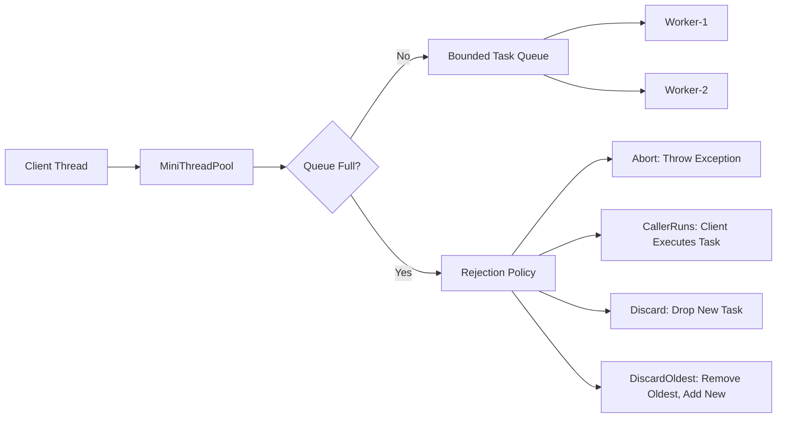
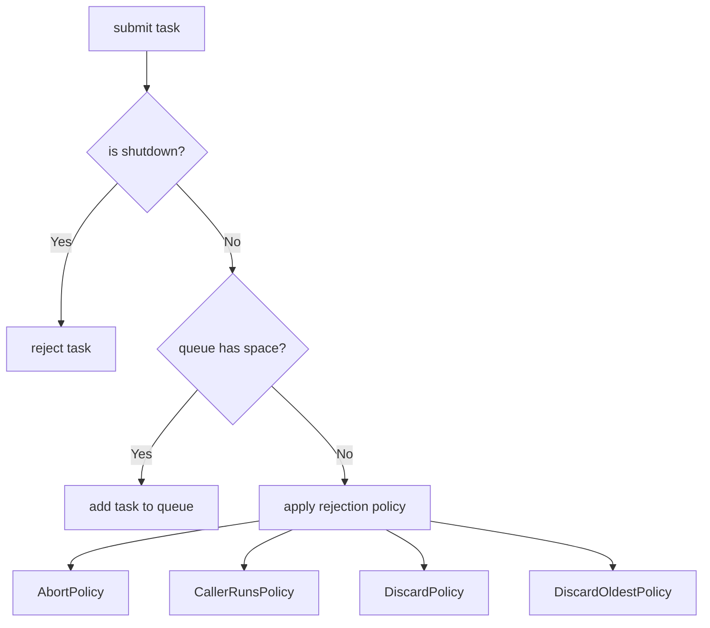
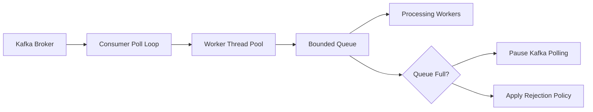

# 005_Rejection_Policies.md — MiniThreadPool Phase 5

## 1. Goal

In phase 004, we added a **bounded queue**. When the queue became full, producer threads waited.

In this phase, we upgrade the thread pool with **rejection policies**.

Instead of always blocking the producer, the thread pool can decide what to do when the queue is full.

This is how real Java `ThreadPoolExecutor` works.

---

## 2. What Changes From Previous Phase

| Phase 004 | Phase 005 |
|---|---|
| Queue has fixed capacity | Queue still has fixed capacity |
| Producer blocks when queue is full | Producer can reject, run, discard, or replace task |
| One behavior only | Multiple configurable rejection policies |
| Good for backpressure learning | Closer to production thread pool design |

---

## 3. Architecture Diagram



---

## 4. Rejection Policy Decision Flow



---

## 5. Concepts

### Why Rejection Policies Are Needed

A thread pool has limited resources:

- Limited worker threads
- Limited queue capacity
- Limited memory
- Limited CPU

If tasks arrive faster than workers can process them, the queue becomes full.

At that point, the system must choose one behavior:

1. Fail fast
2. Slow down caller
3. Drop task
4. Drop old task and accept new one

---

## 6. Rejection Policies

### 1. AbortPolicy

Throws exception when queue is full.

Use when task loss is not acceptable.

Example:

- Payment request
- Order creation
- Bank transaction

---

### 2. CallerRunsPolicy

The caller thread executes the task itself.

This slows down the producer naturally.

Use when you want backpressure without dropping tasks.

Example:

- Log processing
- Notification processing
- Safe async background work

---

### 3. DiscardPolicy

Silently drops the new task.

Use only when losing task is acceptable.

Example:

- Metrics sample
- Analytics event
- Debug log

---

### 4. DiscardOldestPolicy

Removes the oldest queued task and adds the new task.

Use when latest data is more important than old data.

Example:

- Live dashboard refresh
- Stock price refresh
- Location update
- Progress update

---

## 7. File Structure

```text
minithreadpool-phase-005/
└── src/
    └── main/
        └── java/
            └── com/
                └── minithreadpool/
                    ├── MiniTask.java
                    ├── RejectionPolicy.java
                    ├── AbortPolicy.java
                    ├── CallerRunsPolicy.java
                    ├── DiscardPolicy.java
                    ├── DiscardOldestPolicy.java
                    ├── BoundedBlockingTaskQueue.java
                    ├── Worker.java
                    ├── MiniThreadPool.java
                    └── Phase5RejectionPolicyDriver.java
```

---

## 8. Complete Java Code

### 8.1 MiniTask.java

```java
package com.minithreadpool;

@FunctionalInterface
public interface MiniTask {
    void execute();
}
```

---

### 8.2 RejectionPolicy.java

```java
package com.minithreadpool;

public interface RejectionPolicy {
    void reject(MiniTask task, MiniThreadPool threadPool);
}
```

---

### 8.3 AbortPolicy.java

```java
package com.minithreadpool;

public class AbortPolicy implements RejectionPolicy {

    @Override
    public void reject(MiniTask task, MiniThreadPool threadPool) {
        throw new RuntimeException("Task rejected because queue is full");
    }
}
```

---

### 8.4 CallerRunsPolicy.java

```java
package com.minithreadpool;

public class CallerRunsPolicy implements RejectionPolicy {

    @Override
    public void reject(MiniTask task, MiniThreadPool threadPool) {
        System.out.println(Thread.currentThread().getName()
                + " is running rejected task directly");
        task.execute();
    }
}
```

---

### 8.5 DiscardPolicy.java

```java
package com.minithreadpool;

public class DiscardPolicy implements RejectionPolicy {

    @Override
    public void reject(MiniTask task, MiniThreadPool threadPool) {
        System.out.println("Task discarded because queue is full");
    }
}
```

---

### 8.6 DiscardOldestPolicy.java

```java
package com.minithreadpool;

public class DiscardOldestPolicy implements RejectionPolicy {

    @Override
    public void reject(MiniTask task, MiniThreadPool threadPool) {
        System.out.println("Discarding oldest task and adding new task");
        threadPool.discardOldestTask();
        threadPool.execute(task);
    }
}
```

---

### 8.7 BoundedBlockingTaskQueue.java

```java
package com.minithreadpool;

import java.util.LinkedList;
import java.util.Queue;

public class BoundedBlockingTaskQueue {

    private final Queue<MiniTask> queue = new LinkedList<>();
    private final int capacity;

    public BoundedBlockingTaskQueue(int capacity) {
        if (capacity <= 0) {
            throw new IllegalArgumentException("Capacity must be greater than zero");
        }
        this.capacity = capacity;
    }

    public synchronized boolean offer(MiniTask task) {
        if (queue.size() >= capacity) {
            return false;
        }

        queue.offer(task);
        notifyAll();
        return true;
    }

    public synchronized MiniTask take() throws InterruptedException {
        while (queue.isEmpty()) {
            wait();
        }

        MiniTask task = queue.poll();
        notifyAll();
        return task;
    }

    public synchronized MiniTask pollOldest() {
        MiniTask task = queue.poll();
        notifyAll();
        return task;
    }

    public synchronized int size() {
        return queue.size();
    }

    public int capacity() {
        return capacity;
    }
}
```

---

### 8.8 Worker.java

```java
package com.minithreadpool;

public class Worker implements Runnable {

    private final BoundedBlockingTaskQueue taskQueue;
    private final String workerName;

    public Worker(BoundedBlockingTaskQueue taskQueue, String workerName) {
        this.taskQueue = taskQueue;
        this.workerName = workerName;
    }

    @Override
    public void run() {
        Thread.currentThread().setName(workerName);

        while (true) {
            try {
                MiniTask task = taskQueue.take();
                System.out.println(workerName + " picked a task");
                task.execute();
            } catch (InterruptedException e) {
                Thread.currentThread().interrupt();
                System.out.println(workerName + " interrupted and stopped");
                break;
            } catch (Exception e) {
                System.out.println(workerName + " task failed: " + e.getMessage());
            }
        }
    }
}
```

---

### 8.9 MiniThreadPool.java

```java
package com.minithreadpool;

import java.util.ArrayList;
import java.util.List;

public class MiniThreadPool {

    private final BoundedBlockingTaskQueue taskQueue;
    private final List<Thread> workers = new ArrayList<>();
    private final RejectionPolicy rejectionPolicy;

    public MiniThreadPool(int poolSize, int queueCapacity, RejectionPolicy rejectionPolicy) {
        if (poolSize <= 0) {
            throw new IllegalArgumentException("Pool size must be greater than zero");
        }
        if (rejectionPolicy == null) {
            throw new IllegalArgumentException("Rejection policy cannot be null");
        }

        this.taskQueue = new BoundedBlockingTaskQueue(queueCapacity);
        this.rejectionPolicy = rejectionPolicy;

        for (int i = 1; i <= poolSize; i++) {
            Thread workerThread = new Thread(new Worker(taskQueue, "mini-worker-" + i));
            workers.add(workerThread);
            workerThread.start();
        }
    }

    public void execute(MiniTask task) {
        if (task == null) {
            throw new IllegalArgumentException("Task cannot be null");
        }

        boolean accepted = taskQueue.offer(task);

        if (!accepted) {
            rejectionPolicy.reject(task, this);
        }
    }

    public void discardOldestTask() {
        MiniTask removedTask = taskQueue.pollOldest();

        if (removedTask != null) {
            System.out.println("Oldest task removed from queue");
        }
    }

    public int getQueueSize() {
        return taskQueue.size();
    }

    public int getQueueCapacity() {
        return taskQueue.capacity();
    }
}
```

---

### 8.10 Phase5RejectionPolicyDriver.java

```java
package com.minithreadpool;

public class Phase5RejectionPolicyDriver {

    public static void main(String[] args) throws InterruptedException {

        System.out.println("=== AbortPolicy Demo ===");
        runDemo(new AbortPolicy());

        Thread.sleep(3000);

        System.out.println("\n=== CallerRunsPolicy Demo ===");
        runDemo(new CallerRunsPolicy());

        Thread.sleep(3000);

        System.out.println("\n=== DiscardPolicy Demo ===");
        runDemo(new DiscardPolicy());

        Thread.sleep(3000);

        System.out.println("\n=== DiscardOldestPolicy Demo ===");
        runDemo(new DiscardOldestPolicy());
    }

    private static void runDemo(RejectionPolicy rejectionPolicy) {
        MiniThreadPool threadPool = new MiniThreadPool(
                2,      // worker threads
                2,      // queue capacity
                rejectionPolicy
        );

        for (int i = 1; i <= 8; i++) {
            final int taskId = i;

            try {
                threadPool.execute(() -> {
                    System.out.println(Thread.currentThread().getName()
                            + " executing task-" + taskId);

                    try {
                        Thread.sleep(1000);
                    } catch (InterruptedException e) {
                        Thread.currentThread().interrupt();
                    }

                    System.out.println(Thread.currentThread().getName()
                            + " completed task-" + taskId);
                });

                System.out.println("Submitted task-" + taskId
                        + ", queueSize=" + threadPool.getQueueSize());

            } catch (Exception e) {
                System.out.println("Failed to submit task-" + taskId
                        + ": " + e.getMessage());
            }
        }
    }
}
```

---

## 9. Step-by-Step Dry Run

Configuration:

```text
poolSize = 2
queueCapacity = 2
totalTasks = 8
```

Initial state:

```text
workers = 2
queue = []
```

Execution:

```text
Task-1 submitted
Worker-1 picks Task-1
Queue = []

Task-2 submitted
Worker-2 picks Task-2
Queue = []

Task-3 submitted
Queue = [Task-3]

Task-4 submitted
Queue = [Task-3, Task-4]

Task-5 submitted
Queue is full
Apply rejection policy
```

---

## 10. Policy Behavior Dry Run

### AbortPolicy

```text
Task-5 arrives
Queue full
AbortPolicy throws RuntimeException
Task-5 rejected
Caller receives failure
```

Best for critical flows where silent task loss is dangerous.

---

### CallerRunsPolicy

```text
Task-5 arrives
Queue full
main thread executes Task-5 directly
main thread becomes slower
producer naturally slows down
```

This is real backpressure.

---

### DiscardPolicy

```text
Task-5 arrives
Queue full
Task-5 dropped
No exception
No blocking
```

Fast, but task loss is possible.

---

### DiscardOldestPolicy

```text
Task-5 arrives
Queue full
Oldest queued task removed
Task-5 added
Latest work is preferred
```

Useful when old work becomes stale.

---

## 11. Real-World Mapping

| Rejection Policy | Real-World Use Case |
|---|---|
| AbortPolicy | Payment, order creation, bank transaction |
| CallerRunsPolicy | Notification worker, safe async processing |
| DiscardPolicy | Metrics, debug logs, analytics samples |
| DiscardOldestPolicy | Live dashboard, GPS location update, progress update |

---

## 12. Interview Notes

### Important Question

What happens when a thread pool queue is full?

Strong answer:

```text
A production thread pool should not grow memory forever.
It usually has bounded queue capacity.
When the queue is full, it applies a rejection policy.
The policy can throw an exception, run task in caller thread, discard the task, or discard the oldest queued task.
This gives controlled backpressure and protects the system from overload.
```

---

## 13. DSA / CP Connection

This phase connects to these DSA ideas:

| ThreadPool Concept | DSA/CP Concept |
|---|---|
| Bounded queue | Queue with capacity |
| Discard oldest | FIFO eviction |
| CallerRuns backpressure | Flow control |
| Abort policy | Fail-fast condition |
| Task scheduling | Producer-consumer model |

---

## 14. Why This Is Production Important

Without rejection policies:

```text
Too many tasks -> queue grows -> memory grows -> GC pressure -> latency spike -> service crash
```

With rejection policies:

```text
Too many tasks -> queue full -> policy applied -> system stays controlled
```

This is the foundation of resilient async systems.

---

## 15. MiniKafka Connection

Kafka consumers also need this idea.

Example:

```text
Kafka poll records
Submit records to worker pool
Worker queue becomes full
Consumer must slow down, pause partitions, or reject processing
```

That is the same backpressure problem.



---

## 16. What We Built In This Phase

You now have:

- Fixed thread pool
- Multiple workers
- Bounded blocking queue
- Rejection policy interface
- AbortPolicy
- CallerRunsPolicy
- DiscardPolicy
- DiscardOldestPolicy
- Complete driver class
- Production-style overload behavior

---

## 17. Next Phase

Next file:

```text
006_Future_Callable_Result.md
```

Next, we will upgrade the thread pool from fire-and-forget `Runnable` style tasks to result-returning `Callable` tasks using a custom `MiniFuture`.
