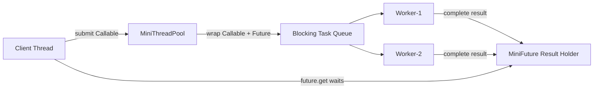
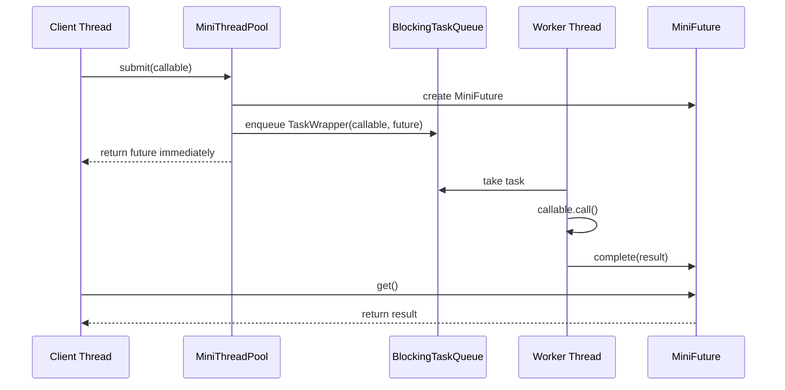

# 06_Future_Callable_Result.md

# MiniThreadPool — Phase 06: Future + Callable Result

## Clickable Index

1. [Goal](#1-goal)
2. [What Changes From Previous Phase](#2-what-changes-from-previous-phase)
3. [Why Future and Callable Are Needed](#3-why-future-and-callable-are-needed)
4. [Architecture Diagram](#4-architecture-diagram)
5. [Execution Flow Diagram](#5-execution-flow-diagram)
6. [Steps Before Code](#6-steps-before-code)
7. [Core Concepts](#7-core-concepts)
8. [File Structure](#8-file-structure)
9. [Complete Java Code](#9-complete-java-code)
    - [MiniCallable.java](#91-minicallablejava)
    - [MiniFuture.java](#92-minifuturejava)
    - [TaskWrapper.java](#93-taskwrapperjava)
    - [BlockingTaskQueue.java](#94-blockingtaskqueuejava)
    - [MiniThreadPool.java](#95-minithreadpooljava)
    - [Phase06FutureCallableDriver.java](#96-phase06futurecallabledriverjava)
10. [Step-by-Step Dry Run](#10-step-by-step-dry-run)
11. [Output Example](#11-output-example)
12. [Real-World Use Case](#12-real-world-use-case)
13. [DSA / CP Connection](#13-dsa--cp-connection)
14. [Interview Notes](#14-interview-notes)
15. [What We Built So Far](#15-what-we-built-so-far)
16. [Next Step](#16-next-step)

---

## 1. Goal

In previous phases, our `MiniThreadPool` accepted only `Runnable` tasks.

A `Runnable` can execute work, but it cannot directly return a result.

In this phase, we add:

- `MiniCallable<T>`
- `MiniFuture<T>`
- `submit()` method
- result storage
- blocking `get()`
- exception propagation from worker thread to caller thread

This is similar to Java's real:

```java
Callable<T>
Future<T>
ExecutorService.submit()
```

---

## 2. What Changes From Previous Phase

Previous phase:

```java
pool.execute(() -> {
    System.out.println("Task running");
});
```

This only runs work.

Now we want:

```java
MiniFuture<Integer> future = pool.submit(() -> {
    return 10 + 20;
});

Integer result = future.get();
```

Now the caller can submit work and collect the result later.

### Before

```text
Client -> Runnable -> Queue -> Worker -> Execute
```

### Now

```text
Client -> Callable -> TaskWrapper -> Queue -> Worker -> Result saved in Future -> Client calls get()
```

---

## 3. Why Future and Callable Are Needed

### Problem With Runnable

```java
Runnable task = () -> {
    int result = 10 + 20;
};
```

The result is trapped inside the task.

The caller cannot receive it directly.

### Solution

Use `Callable<T>` style task:

```java
MiniCallable<Integer> task = () -> 10 + 20;
```

But because the task runs on another thread, the result may not be ready immediately.

So we return a `MiniFuture<T>` immediately.

```java
MiniFuture<Integer> future = pool.submit(task);
```

Then caller waits only when needed:

```java
Integer result = future.get();
```

---

## 4. Architecture Diagram



---

## 5. Execution Flow Diagram



---

## 6. Steps Before Code

### Step 1: Create a Callable Interface

A callable is a task that returns a value.

```java
T call() throws Exception;
```

Why `throws Exception`?

Because real async tasks can fail:

- DB call failed
- API timeout
- file read failed
- payment failed
- Kafka publish failed

---

### Step 2: Create a Future Object

The future stores the eventual result.

It needs:

```text
result
exception
isDone
```

It also needs:

```java
get()
```

If result is not ready, `get()` waits.

---

### Step 3: Wrap Callable Inside a Runnable-like Task

Workers already know how to execute tasks from queue.

So we create `TaskWrapper<T>`.

It contains:

```text
MiniCallable<T> callable
MiniFuture<T> future
```

When worker runs wrapper:

```text
try:
    result = callable.call()
    future.complete(result)
catch exception:
    future.completeExceptionally(exception)
```

---

### Step 4: Add submit() Method

`execute()` is for fire-and-forget tasks.

`submit()` is for result-returning tasks.

```java
MiniFuture<T> submit(MiniCallable<T> callable)
```

It should:

1. create future
2. create task wrapper
3. put wrapper into queue
4. return future immediately

---

### Step 5: Caller Uses future.get()

The caller can continue doing other work.

Later:

```java
Integer answer = future.get();
```

If result is ready, it returns immediately.

If not ready, it waits.

---

## 7. Core Concepts

| Concept | Meaning |
|---|---|
| `Runnable` | Runs task but returns no result |
| `Callable<T>` | Runs task and returns result |
| `Future<T>` | Placeholder for result available later |
| `get()` | Waits until result is ready |
| `complete()` | Worker stores successful result |
| `completeExceptionally()` | Worker stores failure |
| `wait()` | Caller waits for result |
| `notifyAll()` | Worker wakes caller after result is ready |

---

## 8. File Structure

```text
minithreadpool-phase06/
└── src/
    └── main/
        └── java/
            └── com/
                └── minithreadpool/
                    ├── MiniCallable.java
                    ├── MiniFuture.java
                    ├── TaskWrapper.java
                    ├── BlockingTaskQueue.java
                    ├── MiniThreadPool.java
                    └── Phase06FutureCallableDriver.java
```

---

## 9. Complete Java Code

---

## 9.1 MiniCallable.java

```java
package com.minithreadpool;

@FunctionalInterface
public interface MiniCallable<T> {
    T call() throws Exception;
}
```

---

## 9.2 MiniFuture.java

```java
package com.minithreadpool;

public class MiniFuture<T> {

    private T result;
    private Exception exception;
    private boolean done = false;

    public synchronized T get() throws Exception {
        while (!done) {
            wait();
        }

        if (exception != null) {
            throw exception;
        }

        return result;
    }

    public synchronized boolean isDone() {
        return done;
    }

    public synchronized void complete(T result) {
        if (done) {
            return;
        }

        this.result = result;
        this.done = true;
        notifyAll();
    }

    public synchronized void completeExceptionally(Exception exception) {
        if (done) {
            return;
        }

        this.exception = exception;
        this.done = true;
        notifyAll();
    }
}
```

---

## 9.3 TaskWrapper.java

```java
package com.minithreadpool;

public class TaskWrapper<T> implements Runnable {

    private final MiniCallable<T> callable;
    private final MiniFuture<T> future;

    public TaskWrapper(MiniCallable<T> callable, MiniFuture<T> future) {
        this.callable = callable;
        this.future = future;
    }

    @Override
    public void run() {
        try {
            T result = callable.call();
            future.complete(result);
        } catch (Exception exception) {
            future.completeExceptionally(exception);
        }
    }
}
```

---

## 9.4 BlockingTaskQueue.java

```java
package com.minithreadpool;

import java.util.LinkedList;
import java.util.Queue;

public class BlockingTaskQueue {

    private final Queue<Runnable> queue = new LinkedList<>();
    private final int capacity;

    public BlockingTaskQueue(int capacity) {
        this.capacity = capacity;
    }

    public synchronized void put(Runnable task) throws InterruptedException {
        while (queue.size() == capacity) {
            wait();
        }

        queue.offer(task);
        notifyAll();
    }

    public synchronized Runnable take() throws InterruptedException {
        while (queue.isEmpty()) {
            wait();
        }

        Runnable task = queue.poll();
        notifyAll();
        return task;
    }

    public synchronized int size() {
        return queue.size();
    }
}
```

---

## 9.5 MiniThreadPool.java

```java
package com.minithreadpool;

import java.util.ArrayList;
import java.util.List;

public class MiniThreadPool {

    private final BlockingTaskQueue taskQueue;
    private final List<Thread> workers = new ArrayList<>();

    public MiniThreadPool(int numberOfWorkers, int queueCapacity) {
        this.taskQueue = new BlockingTaskQueue(queueCapacity);

        for (int i = 1; i <= numberOfWorkers; i++) {
            Thread worker = new Thread(new Worker(), "mini-worker-" + i);
            workers.add(worker);
            worker.start();
        }
    }

    public void execute(Runnable task) {
        try {
            taskQueue.put(task);
        } catch (InterruptedException exception) {
            Thread.currentThread().interrupt();
            throw new RuntimeException("Interrupted while submitting task", exception);
        }
    }

    public <T> MiniFuture<T> submit(MiniCallable<T> callable) {
        MiniFuture<T> future = new MiniFuture<>();
        TaskWrapper<T> wrapper = new TaskWrapper<>(callable, future);

        try {
            taskQueue.put(wrapper);
        } catch (InterruptedException exception) {
            Thread.currentThread().interrupt();
            future.completeExceptionally(exception);
        }

        return future;
    }

    private class Worker implements Runnable {

        @Override
        public void run() {
            while (true) {
                try {
                    Runnable task = taskQueue.take();
                    task.run();
                } catch (InterruptedException exception) {
                    Thread.currentThread().interrupt();
                    break;
                } catch (RuntimeException exception) {
                    System.out.println(Thread.currentThread().getName()
                            + " task failed: " + exception.getMessage());
                }
            }
        }
    }
}
```

---

## 9.6 Phase06FutureCallableDriver.java

```java
package com.minithreadpool;

public class Phase06FutureCallableDriver {

    public static void main(String[] args) throws Exception {
        MiniThreadPool pool = new MiniThreadPool(3, 5);

        MiniFuture<Integer> orderTotalFuture = pool.submit(() -> {
            System.out.println(Thread.currentThread().getName() + " calculating order total");
            Thread.sleep(1000);
            return 1200;
        });

        MiniFuture<String> paymentStatusFuture = pool.submit(() -> {
            System.out.println(Thread.currentThread().getName() + " checking payment status");
            Thread.sleep(1500);
            return "PAYMENT_SUCCESS";
        });

        MiniFuture<String> failingFuture = pool.submit(() -> {
            System.out.println(Thread.currentThread().getName() + " calling external service");
            Thread.sleep(500);
            throw new RuntimeException("External service timeout");
        });

        System.out.println("Main thread can continue doing other work...");

        Integer orderTotal = orderTotalFuture.get();
        String paymentStatus = paymentStatusFuture.get();

        System.out.println("Order total = " + orderTotal);
        System.out.println("Payment status = " + paymentStatus);

        try {
            String failedResult = failingFuture.get();
            System.out.println(failedResult);
        } catch (Exception exception) {
            System.out.println("Failure received in main thread: " + exception.getMessage());
        }
    }
}
```

---

## 10. Step-by-Step Dry Run

### Initial State

```text
Workers: 3
Queue capacity: 5
Queue: empty
```

---

### Step 1: Submit order total task

```java
MiniFuture<Integer> orderTotalFuture = pool.submit(...);
```

Internally:

```text
1. Create MiniFuture<Integer>
2. Create TaskWrapper<Integer>
3. Put wrapper into queue
4. Return future immediately
```

Queue:

```text
[order-total-task]
```

---

### Step 2: Worker picks order task

```text
mini-worker-1 takes order-total-task
```

Queue:

```text
[]
```

Worker executes:

```java
return 1200;
```

Then:

```java
future.complete(1200);
```

---

### Step 3: Submit payment task

Queue:

```text
[payment-status-task]
```

Worker executes:

```java
return "PAYMENT_SUCCESS";
```

Then:

```java
future.complete("PAYMENT_SUCCESS");
```

---

### Step 4: Submit failing task

Worker executes:

```java
throw new RuntimeException("External service timeout");
```

Wrapper catches it:

```java
future.completeExceptionally(exception);
```

---

### Step 5: Main thread calls get()

```java
Integer orderTotal = orderTotalFuture.get();
```

If worker already completed, return immediately.

If not completed:

```text
main thread waits
```

When worker completes:

```text
notifyAll wakes main thread
```

---

## 11. Output Example

Output order can change because threads run concurrently.

```text
Main thread can continue doing other work...
mini-worker-1 calculating order total
mini-worker-2 checking payment status
mini-worker-3 calling external service
Order total = 1200
Payment status = PAYMENT_SUCCESS
Failure received in main thread: External service timeout
```

---

## 12. Real-World Use Case

Future + Callable is used everywhere in backend systems.

### Payment System

```text
Submit fraud check
Submit balance check
Submit bank API call
Wait for results
Make final decision
```

---

### Video Processing

```text
Submit thumbnail generation
Submit audio extraction
Submit HLS segment generation
Wait for all results
Mark video READY
```

---

### Search System

```text
Submit product search
Submit inventory lookup
Submit personalization ranking
Merge results
Return response
```

---

### Kafka-Like System

```text
Submit message append
Submit replication task
Submit ack tracking
Return result to producer
```

---

## 13. DSA / CP Connection

This phase connects to classic concurrency and queue thinking.

| ThreadPool Concept | DSA / CP Concept |
|---|---|
| Task queue | Queue data structure |
| Blocking get | Waiting for state change |
| Future completion | State transition |
| Multiple workers | Parallel consumers |
| Exception propagation | Error state in DP / graph traversal |
| notifyAll | Wake all waiting states |

### Mental Model

```text
Future is like a DP state that is not computed yet.

get() waits until the state becomes computed.

complete(result) marks the state as solved.
```

---

## 14. Interview Notes

### Why Callable instead of Runnable?

Because `Callable<T>` returns a value and can throw checked exceptions.

---

### Why Future?

Because async result is not available immediately.

Future acts as a placeholder for a value that will be available later.

---

### Why get() blocks?

Because the caller may ask for the result before the worker finishes the task.

---

### Why use while loop with wait()?

Always use:

```java
while (!done) {
    wait();
}
```

Not:

```java
if (!done) {
    wait();
}
```

Reason:

- spurious wakeups can happen
- multiple waiting threads can wake
- condition must be rechecked

---

### Why notifyAll instead of notify?

Because multiple threads may be waiting for the same future.

`notifyAll()` wakes all waiters safely.

---

## 15. What We Built So Far

| Phase | Feature |
|---|---|
| 001 | Single worker thread |
| 002 | Blocking task queue |
| 003 | Fixed thread pool |
| 004 | Bounded queue + backpressure |
| 005 | Rejection policies |
| 006 | Future + Callable result |

Current capability:

```text
Client can submit tasks.
Pool can run tasks in worker threads.
Queue can block when empty/full.
Pool can reject tasks when overloaded.
Callable tasks can return results.
Future can wait for results.
Exceptions can move from worker thread to caller thread.
```

---

## 16. Next Step

Next file:

```text
007_Exception_Handling.md
```

In phase 006, we already introduced basic exception propagation for `Callable` tasks.

But the next phase will make exception handling more production-like:

- worker should not die when one task fails
- separate handling for `Runnable` exceptions
- separate handling for `Callable` exceptions
- uncaught exception protection
- task failure metrics
- failed task logging
- retry decision discussion
- real-world examples from payment, Kafka consumer, and async processing

### Next Phase Goal

```text
A bad task should fail safely, but the thread pool must continue running.
```

