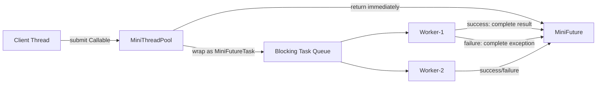
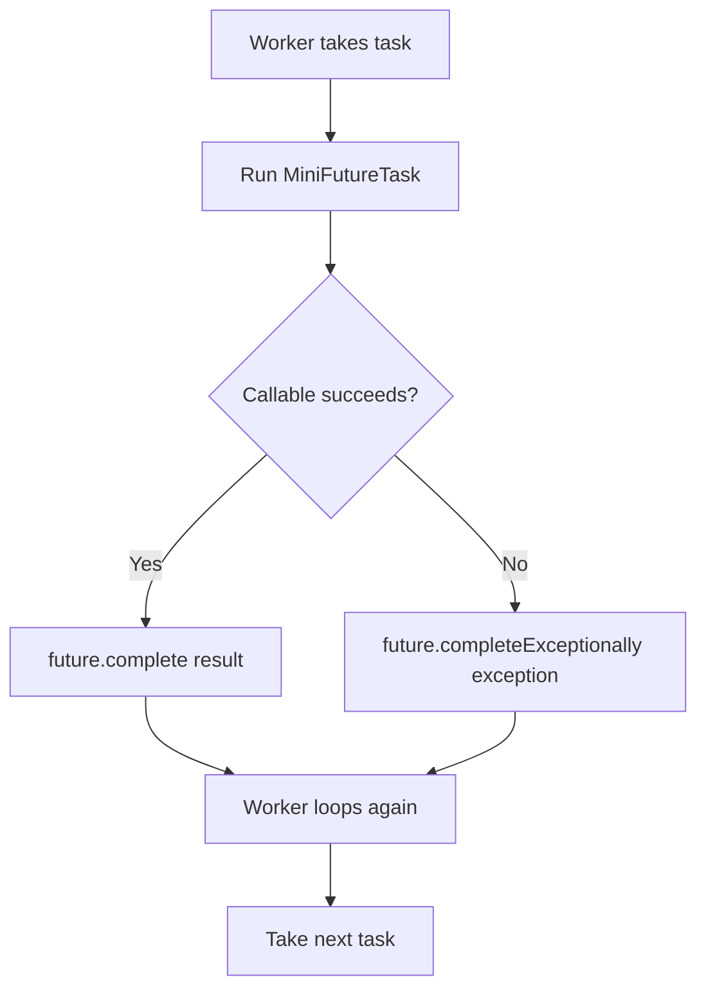

# 007_Exception_Handling.md — MiniThreadPool Phase 007

> **Goal:** Upgrade MiniThreadPool so task exceptions are captured safely and do not kill worker threads.

---

## Clickable Index

- [1. Phase Goal](#1-phase-goal)
- [2. What Changed From Phase 006](#2-what-changed-from-phase-006)
- [3. Why Exception Handling Is Needed](#3-why-exception-handling-is-needed)
- [4. High-Level Architecture](#4-high-level-architecture)
- [5. Worker Exception Flow](#5-worker-exception-flow)
- [6. Steps Before Code](#6-steps-before-code)
- [7. File Structure](#7-file-structure)
- [8. Complete Java Code](#8-complete-java-code)
  - [8.1 MiniCallable.java](#81-minicallablejava)
  - [8.2 MiniFuture.java](#82-minifuturejava)
  - [8.3 MiniFutureTask.java](#83-minifuturetaskjava)
  - [8.4 MiniBlockingQueue.java](#84-miniblockingqueuejava)
  - [8.5 MiniThreadPool.java](#85-minithreadpooljava)
  - [8.6 Phase7ExceptionHandlingDriver.java](#86-phase7exceptionhandlingdriverjava)
- [9. Step-by-Step Dry Run](#9-step-by-step-dry-run)
- [10. Expected Output](#10-expected-output)
- [11. Real-World Mapping](#11-real-world-mapping)
- [12. DSA/CP Connection](#12-dsacp-connection)
- [13. Interview Notes](#13-interview-notes)
- [14. Next Step](#14-next-step)

---

## 1. Phase Goal

In Phase 006, we added:

- `MiniCallable<T>`
- `MiniFuture<T>`
- `MiniFutureTask<T>`
- `submit()` returning a result later

In this phase, we improve failure handling.

If a task throws an exception:

1. The exception should be stored inside `MiniFuture`.
2. Calling `future.get()` should rethrow the exception to the caller.
3. The worker thread should continue processing the next task.
4. One bad task should not crash the whole thread pool.

---

## 2. What Changed From Phase 006

| Area | Phase 006 | Phase 007 |
|---|---|---|
| Task result | Stored in future | Stored in future |
| Task failure | Basic exception storage | Clear exception propagation |
| Worker safety | Could be unclear | Worker never dies because of task failure |
| Caller behavior | `get()` waits for result | `get()` returns result or throws failure |
| Production readiness | Basic async result | Safer async execution |

---

## 3. Why Exception Handling Is Needed

Without proper exception handling, this can happen:

```text
Task-1 works
Task-2 throws RuntimeException
Worker thread dies
Task-3 remains stuck in queue
Thread pool capacity reduces silently
System becomes unhealthy
```

In production systems, this is dangerous.

Examples:

- Kafka consumer task fails while processing one message.
- Payment task throws exception for one payment.
- Email notification fails for one user.
- Video encoding task fails for one file.

The system must record the failure and continue processing other tasks.

---

## 4. High-Level Architecture



---

## 5. Worker Exception Flow



Important idea:

```text
Exception belongs to the task result.
Exception should not kill the worker.
```

---

## 6. Steps Before Code

### Step 1 — Client submits a callable

```java
MiniFuture<Integer> future = pool.submit(() -> 10 / 0);
```

The client does not execute the task directly.

---

### Step 2 — Thread pool wraps callable inside `MiniFutureTask`

```text
Callable + Future = MiniFutureTask
```

The task queue stores `Runnable` objects, so `MiniFutureTask` implements `Runnable`.

---

### Step 3 — Worker executes `MiniFutureTask.run()`

```text
Worker thread calls task.run()
```

Inside `run()`:

```text
try {
    result = callable.call();
    future.complete(result);
} catch (Exception ex) {
    future.completeExceptionally(ex);
}
```

---

### Step 4 — If task succeeds

```text
result stored inside MiniFuture
waiting caller is notified
future.get() returns result
```

---

### Step 5 — If task fails

```text
exception stored inside MiniFuture
waiting caller is notified
future.get() throws RuntimeException
worker continues processing more tasks
```

---

### Step 6 — Worker stays alive

The worker catches interruption separately, but task exceptions are handled inside `MiniFutureTask`.

So this bad task:

```java
throw new RuntimeException("Database failed");
```

will not kill this loop:

```java
while (true) {
    Runnable task = taskQueue.take();
    task.run();
}
```

---

## 7. File Structure

```text
mini-thread-pool/
└── src/
    └── main/
        └── java/
            └── com/
                └── minithreadpool/
                    ├── MiniCallable.java
                    ├── MiniFuture.java
                    ├── MiniFutureTask.java
                    ├── MiniBlockingQueue.java
                    ├── MiniThreadPool.java
                    └── Phase7ExceptionHandlingDriver.java
```

---

## 8. Complete Java Code

---

### 8.1 MiniCallable.java

```java
package com.minithreadpool;

@FunctionalInterface
public interface MiniCallable<T> {
    T call() throws Exception;
}
```

---

### 8.2 MiniFuture.java

```java
package com.minithreadpool;

public class MiniFuture<T> {

    private T result;
    private Throwable error;
    private boolean done;

    public synchronized void complete(T result) {
        if (done) {
            return;
        }

        this.result = result;
        this.done = true;
        notifyAll();
    }

    public synchronized void completeExceptionally(Throwable error) {
        if (done) {
            return;
        }

        this.error = error;
        this.done = true;
        notifyAll();
    }

    public synchronized T get() throws InterruptedException {
        while (!done) {
            wait();
        }

        if (error != null) {
            throw new RuntimeException("Task execution failed", error);
        }

        return result;
    }

    public synchronized boolean isDone() {
        return done;
    }

    public synchronized boolean isFailed() {
        return done && error != null;
    }
}
```

---

### 8.3 MiniFutureTask.java

```java
package com.minithreadpool;

public class MiniFutureTask<T> implements Runnable {

    private final MiniCallable<T> callable;
    private final MiniFuture<T> future;

    public MiniFutureTask(MiniCallable<T> callable, MiniFuture<T> future) {
        this.callable = callable;
        this.future = future;
    }

    @Override
    public void run() {
        try {
            T result = callable.call();
            future.complete(result);
        } catch (Throwable ex) {
            future.completeExceptionally(ex);
        }
    }
}
```

---

### 8.4 MiniBlockingQueue.java

```java
package com.minithreadpool;

import java.util.LinkedList;
import java.util.Queue;

public class MiniBlockingQueue<T> {

    private final Queue<T> queue = new LinkedList<>();

    public synchronized void put(T item) {
        queue.offer(item);
        notifyAll();
    }

    public synchronized T take() throws InterruptedException {
        while (queue.isEmpty()) {
            wait();
        }

        return queue.poll();
    }

    public synchronized int size() {
        return queue.size();
    }
}
```

---

### 8.5 MiniThreadPool.java

```java
package com.minithreadpool;

import java.util.ArrayList;
import java.util.List;

public class MiniThreadPool {

    private final MiniBlockingQueue<Runnable> taskQueue;
    private final List<Thread> workers;

    public MiniThreadPool(int numberOfWorkers) {
        this.taskQueue = new MiniBlockingQueue<>();
        this.workers = new ArrayList<>();

        for (int i = 1; i <= numberOfWorkers; i++) {
            Thread worker = new Thread(new Worker(), "mini-worker-" + i);
            workers.add(worker);
            worker.start();
        }
    }

    public void execute(Runnable task) {
        taskQueue.put(task);
    }

    public <T> MiniFuture<T> submit(MiniCallable<T> callable) {
        MiniFuture<T> future = new MiniFuture<>();
        MiniFutureTask<T> futureTask = new MiniFutureTask<>(callable, future);
        taskQueue.put(futureTask);
        return future;
    }

    private class Worker implements Runnable {

        @Override
        public void run() {
            while (true) {
                try {
                    Runnable task = taskQueue.take();
                    task.run();
                } catch (InterruptedException ex) {
                    Thread.currentThread().interrupt();
                    break;
                } catch (Throwable ex) {
                    System.out.println(Thread.currentThread().getName()
                            + " caught unexpected worker-level exception: "
                            + ex.getMessage());
                }
            }
        }
    }
}
```

---

### 8.6 Phase7ExceptionHandlingDriver.java

```java
package com.minithreadpool;

public class Phase7ExceptionHandlingDriver {

    public static void main(String[] args) throws InterruptedException {
        MiniThreadPool pool = new MiniThreadPool(2);

        MiniFuture<Integer> successFuture = pool.submit(() -> {
            System.out.println(Thread.currentThread().getName() + " executing success task");
            return 100 + 50;
        });

        MiniFuture<Integer> failedFuture = pool.submit(() -> {
            System.out.println(Thread.currentThread().getName() + " executing failed task");
            int value = 10 / 0;
            return value;
        });

        MiniFuture<String> anotherSuccessFuture = pool.submit(() -> {
            System.out.println(Thread.currentThread().getName() + " executing another success task");
            return "worker still alive after failure";
        });

        System.out.println("successFuture result = " + successFuture.get());

        try {
            System.out.println("failedFuture result = " + failedFuture.get());
        } catch (RuntimeException ex) {
            System.out.println("failedFuture error = " + ex.getMessage());
            System.out.println("root cause = " + ex.getCause());
        }

        System.out.println("anotherSuccessFuture result = " + anotherSuccessFuture.get());
    }
}
```

---

## 9. Step-by-Step Dry Run

### Initial state

```text
Workers: mini-worker-1, mini-worker-2
Queue: empty
```

---

### Step 1 — Submit success task

```text
Queue:
[success task]
```

One worker takes it.

```text
mini-worker-1 -> executes success task
future.complete(150)
```

---

### Step 2 — Submit failed task

```text
Queue:
[failed task]
```

Worker executes:

```java
int value = 10 / 0;
```

This throws:

```text
ArithmeticException: / by zero
```

`MiniFutureTask.run()` catches it:

```text
future.completeExceptionally(exception)
```

Worker continues running.

---

### Step 3 — Submit another success task

```text
Queue:
[another success task]
```

A worker picks it and completes normally.

```text
future.complete("worker still alive after failure")
```

---

### Step 4 — Caller reads futures

```text
successFuture.get()          -> returns 150
failedFuture.get()           -> throws RuntimeException
anotherSuccessFuture.get()   -> returns string result
```

---

## 10. Expected Output

Output order may differ because workers run concurrently.

```text
mini-worker-1 executing success task
mini-worker-2 executing failed task
mini-worker-1 executing another success task
successFuture result = 150
failedFuture error = Task execution failed
root cause = java.lang.ArithmeticException: / by zero
anotherSuccessFuture result = worker still alive after failure
```

---

## 11. Real-World Mapping

| MiniThreadPool Concept | Real System Example |
|---|---|
| Callable task | Payment processing job |
| Future result | Async response/result handle |
| Exception stored in future | Failed payment result |
| Worker continues after failure | Kafka consumer keeps processing next message |
| `get()` throws error | Caller observes async failure |
| Failure isolation | One bad task does not kill the service |

---

## 12. DSA/CP Connection

This phase connects to these DSA/CP ideas:

| Concept | DSA/CP Connection |
|---|---|
| Queue | Producer-consumer pattern |
| State management | `PENDING`, `SUCCESS`, `FAILED` style states |
| Error propagation | Similar to returning special state from recursion |
| Isolation | One failed branch should not corrupt whole traversal |
| Synchronization | Like controlling access to shared data structure |

Mental model:

```text
Each async task is like a node in a graph.
Success and failure are both valid terminal states.
The system must record the state and continue traversal.
```

---

## 13. Interview Notes

### Why should worker threads not die when task throws exception?

Because thread pools are shared infrastructure. If one user task kills a worker, the pool silently loses capacity.

---

### Where should task exceptions go?

They should be captured in the returned `Future`.

The caller should observe the failure when calling:

```java
future.get();
```

---

### Why catch `Throwable` in `MiniFutureTask`?

For learning purposes, it ensures even serious task-level failures are captured.

In real production code, you must be careful with `Error` types like `OutOfMemoryError`. But for a mini implementation, this helps show failure isolation clearly.

---

### Why does `MiniFuture.get()` use `while (!done)`?

Because of spurious wakeups.

Correct pattern:

```java
while (!condition) {
    wait();
}
```

Not:

```java
if (!condition) {
    wait();
}
```

---

### Why use `notifyAll()`?

Multiple threads may be waiting on the same future. `notifyAll()` wakes all waiting callers.

---

## 14. Next Step

Next file:

```text
008_Graceful_Shutdown.md
```

Goal of next phase:

```text
Stop accepting new tasks.
Allow already submitted tasks to finish.
Stop worker threads cleanly.
```

This will introduce:

- `shutdown()`
- `isShutdown`
- `isTerminated`
- Reject task submission after shutdown
- Worker exit condition
- Clean lifecycle management

