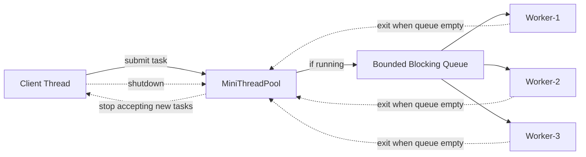
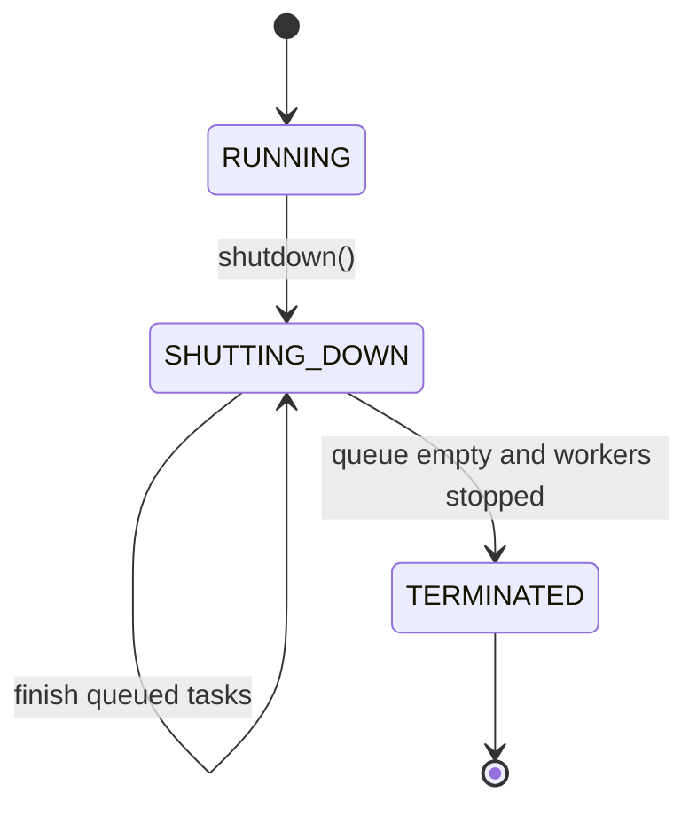
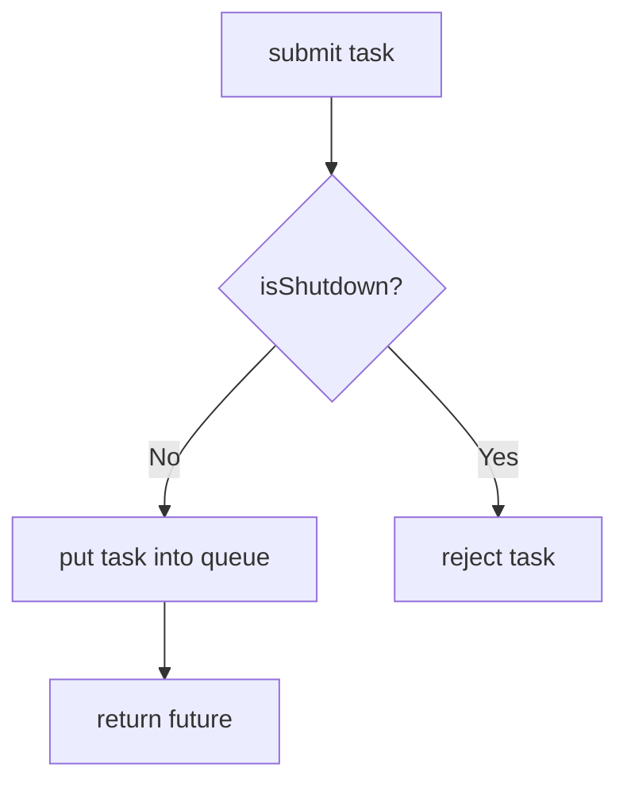
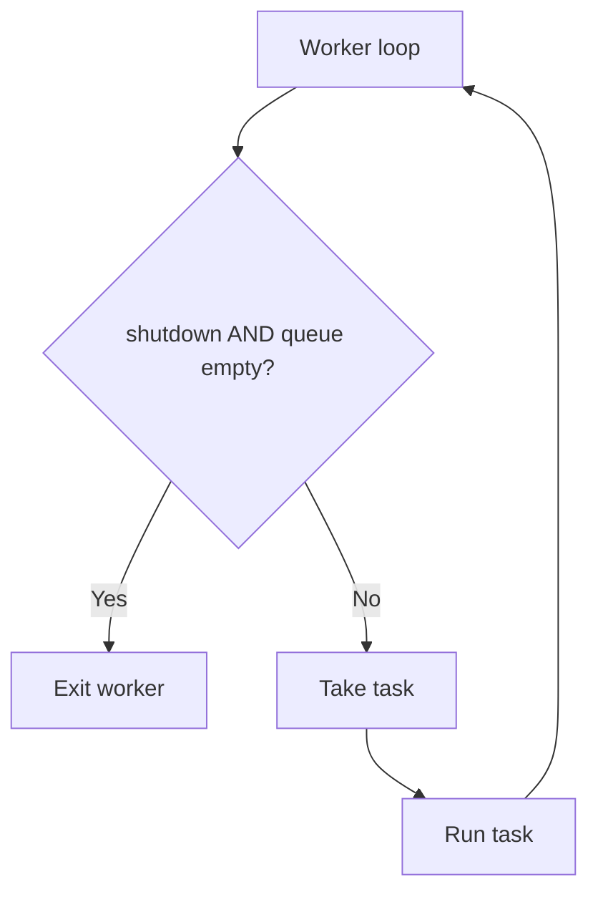

# 008 Graceful Shutdown — MiniThreadPool

## Clickable Index

- [1. Goal](#1-goal)
- [2. What Changes From Phase 007](#2-what-changes-from-phase-007)
- [3. Problem In Previous Phase](#3-problem-in-previous-phase)
- [4. New Concept: Graceful Shutdown](#4-new-concept-graceful-shutdown)
- [5. High-Level Architecture](#5-high-level-architecture)
- [6. Shutdown State Flow](#6-shutdown-state-flow)
- [7. Steps Before Code](#7-steps-before-code)
- [8. File Structure](#8-file-structure)
- [9. Complete Java Code](#9-complete-java-code)
  - [9.1 MiniCallable.java](#91-minicallablejava)
  - [9.2 MiniFuture.java](#92-minifuturejava)
  - [9.3 MiniFutureTask.java](#93-minifuturetaskjava)
  - [9.4 RejectionPolicy.java](#94-rejectionpolicyjava)
  - [9.5 AbortPolicy.java](#95-abortpolicyjava)
  - [9.6 MiniBlockingQueue.java](#96-miniblockingqueuejava)
  - [9.7 MiniThreadPool.java](#97-minithreadpooljava)
  - [9.8 GracefulShutdownDriver.java](#98-gracefulshutdowndriverjava)
- [10. Step-by-Step Dry Run](#10-step-by-step-dry-run)
- [11. Real-World Mapping](#11-real-world-mapping)
- [12. DSA/CP Connection](#12-dsacp-connection)
- [13. Interview Notes](#13-interview-notes)
- [14. Common Bugs](#14-common-bugs)
- [15. Next Step](#15-next-step)

---

## 1. Goal

In this phase, we add **graceful shutdown** to our MiniThreadPool.

Graceful shutdown means:

1. Stop accepting new tasks.
2. Finish already submitted tasks.
3. Let worker threads exit cleanly.
4. Allow the main thread to wait until all workers are stopped.

This is how production systems stop safely without losing already accepted work.

---

## 2. What Changes From Phase 007

In phase 007, we added exception handling so one bad task does not kill the worker.

Now we add lifecycle control.

| Feature | Phase 007 | Phase 008 |
|---|---|---|
| Multiple workers | Yes | Yes |
| Bounded queue | Yes | Yes |
| Rejection policy | Yes | Yes |
| Callable + Future | Yes | Yes |
| Exception handling | Yes | Yes |
| Stop accepting new tasks | No | Yes |
| Finish pending tasks before exit | No | Yes |
| Worker lifecycle | Infinite loop | Controlled loop |
| Await termination | No | Yes |

---

## 3. Problem In Previous Phase

Worker threads run forever.

```java
while (true) {
    Runnable task = taskQueue.take();
    task.run();
}
```

This creates problems:

- Application cannot stop cleanly.
- Worker threads stay alive forever.
- JVM may not exit.
- There is no way to say: “finish current work, then stop.”

Production services need controlled shutdown.

Examples:

- Spring Boot app receives SIGTERM from Kubernetes.
- Kafka consumer stops before deployment.
- Payment worker finishes accepted payment jobs before exit.
- Video processing workers finish current chunks before shutdown.

---

## 4. New Concept: Graceful Shutdown

Graceful shutdown has two important rules.

### Rule 1: Reject new tasks after shutdown starts

```text
shutdown = true
new submit() calls are rejected
```

### Rule 2: Existing queued tasks must complete

```text
queue has pending tasks
workers keep consuming them
when queue becomes empty, workers exit
```

---

## 5. High-Level Architecture



---

## 6. Shutdown State Flow



### Submit Flow



### Worker Flow



---

## 7. Steps Before Code

### Step 1: Add shutdown flag

The thread pool needs a flag.

```java
private volatile boolean shutdown;
```

Why `volatile`?

Because one thread calls `shutdown()`, but worker threads must see the updated value.

---

### Step 2: Reject new tasks after shutdown

Inside `submit()`:

```java
if (shutdown) {
    throw new IllegalStateException("ThreadPool is shutting down");
}
```

This protects the pool from accepting work after shutdown begins.

---

### Step 3: Wake up waiting workers

If workers are waiting on an empty queue, they must wake up after shutdown.

So we add:

```java
public synchronized void wakeAll() {
    notifyAll();
}
```

When `shutdown()` is called:

```java
taskQueue.wakeAll();
```

---

### Step 4: Worker exits only when shutdown is true and queue is empty

Worker should not exit immediately after shutdown.

Wrong:

```java
if (shutdown) break;
```

Correct:

```java
if (shutdown && taskQueue.isEmpty()) break;
```

Because existing queued tasks still need to finish.

---

### Step 5: Add awaitTermination()

Main thread may want to wait until all workers stop.

```java
pool.awaitTermination();
```

Internally:

```java
for (Thread worker : workers) {
    worker.join();
}
```

---

## 8. File Structure

```text
minithreadpool/
└── phase008/
    ├── MiniCallable.java
    ├── MiniFuture.java
    ├── MiniFutureTask.java
    ├── RejectionPolicy.java
    ├── AbortPolicy.java
    ├── MiniBlockingQueue.java
    ├── MiniThreadPool.java
    └── GracefulShutdownDriver.java
```

---

## 9. Complete Java Code

---

### 9.1 MiniCallable.java

```java
package minithreadpool.phase008;

@FunctionalInterface
public interface MiniCallable<T> {
    T call() throws Exception;
}
```

---

### 9.2 MiniFuture.java

```java
package minithreadpool.phase008;

public class MiniFuture<T> {

    private T result;
    private Throwable error;
    private boolean done;

    public synchronized T get() {
        while (!done) {
            try {
                wait();
            } catch (InterruptedException e) {
                Thread.currentThread().interrupt();
                throw new RuntimeException("Thread interrupted while waiting for result", e);
            }
        }

        if (error != null) {
            throw new RuntimeException("Task execution failed", error);
        }

        return result;
    }

    public synchronized boolean isDone() {
        return done;
    }

    public synchronized void complete(T result) {
        if (done) {
            return;
        }

        this.result = result;
        this.done = true;
        notifyAll();
    }

    public synchronized void completeExceptionally(Throwable error) {
        if (done) {
            return;
        }

        this.error = error;
        this.done = true;
        notifyAll();
    }
}
```

---

### 9.3 MiniFutureTask.java

```java
package minithreadpool.phase008;

public class MiniFutureTask<T> implements Runnable {

    private final MiniCallable<T> callable;
    private final MiniFuture<T> future;

    public MiniFutureTask(MiniCallable<T> callable, MiniFuture<T> future) {
        this.callable = callable;
        this.future = future;
    }

    @Override
    public void run() {
        try {
            T result = callable.call();
            future.complete(result);
        } catch (Throwable error) {
            future.completeExceptionally(error);
        }
    }
}
```

---

### 9.4 RejectionPolicy.java

```java
package minithreadpool.phase008;

@FunctionalInterface
public interface RejectionPolicy {
    void reject(Runnable task);
}
```

---

### 9.5 AbortPolicy.java

```java
package minithreadpool.phase008;

public class AbortPolicy implements RejectionPolicy {

    @Override
    public void reject(Runnable task) {
        throw new RuntimeException("Task rejected because queue is full");
    }
}
```

---

### 9.6 MiniBlockingQueue.java

```java
package minithreadpool.phase008;

import java.util.LinkedList;
import java.util.Queue;

public class MiniBlockingQueue {

    private final Queue<Runnable> queue = new LinkedList<>();
    private final int capacity;

    public MiniBlockingQueue(int capacity) {
        if (capacity <= 0) {
            throw new IllegalArgumentException("Capacity must be greater than zero");
        }
        this.capacity = capacity;
    }

    public synchronized boolean offer(Runnable task) {
        if (queue.size() >= capacity) {
            return false;
        }

        queue.offer(task);
        notifyAll();
        return true;
    }

    public synchronized Runnable takeOrNullWhenShutdown(MiniThreadPool pool) {
        while (queue.isEmpty()) {
            if (pool.isShutdown()) {
                return null;
            }

            try {
                wait();
            } catch (InterruptedException e) {
                Thread.currentThread().interrupt();
                return null;
            }
        }

        Runnable task = queue.poll();
        notifyAll();
        return task;
    }

    public synchronized boolean isEmpty() {
        return queue.isEmpty();
    }

    public synchronized int size() {
        return queue.size();
    }

    public synchronized void wakeAll() {
        notifyAll();
    }
}
```

---

### 9.7 MiniThreadPool.java

```java
package minithreadpool.phase008;

import java.util.ArrayList;
import java.util.List;

public class MiniThreadPool {

    private final MiniBlockingQueue taskQueue;
    private final List<Thread> workers = new ArrayList<>();
    private final RejectionPolicy rejectionPolicy;

    private volatile boolean shutdown;

    public MiniThreadPool(int workerCount, int queueCapacity, RejectionPolicy rejectionPolicy) {
        if (workerCount <= 0) {
            throw new IllegalArgumentException("Worker count must be greater than zero");
        }

        this.taskQueue = new MiniBlockingQueue(queueCapacity);
        this.rejectionPolicy = rejectionPolicy;

        for (int i = 1; i <= workerCount; i++) {
            Thread worker = new Thread(this::workerLoop, "mini-worker-" + i);
            workers.add(worker);
            worker.start();
        }
    }

    public <T> MiniFuture<T> submit(MiniCallable<T> callable) {
        if (callable == null) {
            throw new IllegalArgumentException("Callable task cannot be null");
        }

        if (shutdown) {
            throw new IllegalStateException("ThreadPool is shutting down. New tasks are not accepted.");
        }

        MiniFuture<T> future = new MiniFuture<>();
        MiniFutureTask<T> futureTask = new MiniFutureTask<>(callable, future);

        boolean accepted = taskQueue.offer(futureTask);

        if (!accepted) {
            rejectionPolicy.reject(futureTask);
        }

        return future;
    }

    public void execute(Runnable runnable) {
        submit(() -> {
            runnable.run();
            return null;
        });
    }

    public void shutdown() {
        shutdown = true;
        taskQueue.wakeAll();
    }

    public boolean isShutdown() {
        return shutdown;
    }

    public void awaitTermination() {
        for (Thread worker : workers) {
            try {
                worker.join();
            } catch (InterruptedException e) {
                Thread.currentThread().interrupt();
                throw new RuntimeException("Interrupted while waiting for workers to stop", e);
            }
        }
    }

    public int getQueueSize() {
        return taskQueue.size();
    }

    private void workerLoop() {
        while (true) {
            Runnable task = taskQueue.takeOrNullWhenShutdown(this);

            if (task == null) {
                break;
            }

            try {
                task.run();
            } catch (Throwable error) {
                System.out.println(Thread.currentThread().getName()
                        + " caught unexpected error: " + error.getMessage());
            }
        }

        System.out.println(Thread.currentThread().getName() + " stopped gracefully");
    }
}
```

---

### 9.8 GracefulShutdownDriver.java

```java
package minithreadpool.phase008;

public class GracefulShutdownDriver {

    public static void main(String[] args) {
        MiniThreadPool pool = new MiniThreadPool(
                2,
                10,
                new AbortPolicy()
        );

        MiniFuture<String> orderFuture = pool.submit(() -> {
            System.out.println(Thread.currentThread().getName() + " processing order");
            sleep(1000);
            return "order completed";
        });

        MiniFuture<String> paymentFuture = pool.submit(() -> {
            System.out.println(Thread.currentThread().getName() + " processing payment");
            sleep(1500);
            return "payment completed";
        });

        MiniFuture<String> notificationFuture = pool.submit(() -> {
            System.out.println(Thread.currentThread().getName() + " sending notification");
            sleep(500);
            return "notification sent";
        });

        System.out.println("Shutdown requested...");
        pool.shutdown();

        try {
            pool.submit(() -> "new task after shutdown");
        } catch (IllegalStateException e) {
            System.out.println("Rejected after shutdown: " + e.getMessage());
        }

        System.out.println(orderFuture.get());
        System.out.println(paymentFuture.get());
        System.out.println(notificationFuture.get());

        pool.awaitTermination();
        System.out.println("All workers stopped. Application exits safely.");
    }

    private static void sleep(long millis) {
        try {
            Thread.sleep(millis);
        } catch (InterruptedException e) {
            Thread.currentThread().interrupt();
            throw new RuntimeException(e);
        }
    }
}
```

---

## 10. Step-by-Step Dry Run

Assume:

```text
workers = 2
queue capacity = 10
submitted tasks = 3
```

### Initial State

```text
shutdown = false
queue = []
worker-1 = waiting
worker-2 = waiting
```

### Step 1: Submit order task

```text
queue = [orderTask]
worker-1 wakes up
worker-1 starts orderTask
```

### Step 2: Submit payment task

```text
queue = [paymentTask]
worker-2 wakes up
worker-2 starts paymentTask
```

### Step 3: Submit notification task

```text
queue = [notificationTask]
worker-1 and worker-2 are busy
notificationTask waits in queue
```

### Step 4: Call shutdown()

```text
shutdown = true
new tasks are rejected
existing queued tasks remain
```

Important:

```text
shutdown does not kill running tasks
shutdown does not delete queued tasks
```

### Step 5: Worker finishes current task

```text
worker-1 finishes orderTask
worker-1 sees queue has notificationTask
worker-1 runs notificationTask
```

### Step 6: Queue becomes empty

```text
worker-1 checks queue empty and shutdown true
worker-1 exits
worker-2 finishes paymentTask
worker-2 checks queue empty and shutdown true
worker-2 exits
```

### Step 7: awaitTermination()

```text
main thread waits until worker-1 and worker-2 join
then application exits
```

---

## 11. Real-World Mapping

| MiniThreadPool Concept | Real System Example |
|---|---|
| `shutdown()` | Kubernetes sends SIGTERM to service |
| Stop accepting tasks | API server stops accepting new requests |
| Finish queued tasks | Payment worker completes accepted payments |
| Worker exits after queue empty | Kafka consumer drains records before closing |
| `awaitTermination()` | Spring waits for executor shutdown |
| Reject after shutdown | Load balancer routes traffic away from stopping pod |

---

## 12. DSA/CP Connection

This phase connects to these DSA/CP ideas:

| Concept | DSA/CP Mapping |
|---|---|
| Queue draining | BFS queue processing |
| State flag | visited / completed state |
| Worker lifecycle | simulation problems |
| Pending tasks | event queue |
| Termination condition | loop invariant |
| `shutdown && queue empty` | safe stopping condition |

The key pattern:

```text
Do not stop only because shutdown is true.
Stop only when shutdown is true AND no work is left.
```

This is similar to graph/BFS processing:

```text
while queue is not empty:
    process next item
```

Here:

```text
while not shutdown OR queue is not empty:
    process next task
```

---

## 13. Interview Notes

### Why graceful shutdown is important?

Because production systems must not lose already accepted work during deployment or restart.

---

### Difference between shutdown and shutdownNow?

| Method | Meaning |
|---|---|
| `shutdown()` | Stop accepting new tasks, finish existing tasks |
| `shutdownNow()` | Try to stop immediately, interrupt workers, return pending tasks |

This phase implements only graceful `shutdown()`.

---

### Why not interrupt workers immediately?

Because graceful shutdown means tasks should complete if they were already accepted.

Interrupting immediately belongs to `shutdownNow()`, which comes in the next phase.

---

### Why do we need `wakeAll()`?

Workers may be waiting on an empty queue.

If shutdown happens while workers are waiting, they must wake up and check:

```text
shutdown == true
queue is empty
exit
```

Without `wakeAll()`, workers may sleep forever.

---

## 14. Common Bugs

### Bug 1: Worker exits immediately after shutdown

Wrong:

```java
if (shutdown) {
    break;
}
```

This can lose queued tasks.

Correct:

```java
if (shutdown && queue.isEmpty()) {
    break;
}
```

---

### Bug 2: Accepting tasks after shutdown

Wrong:

```java
public void submit(Runnable task) {
    queue.offer(task);
}
```

Correct:

```java
if (shutdown) {
    throw new IllegalStateException("ThreadPool is shutting down");
}
```

---

### Bug 3: Waiting workers never wake up

Wrong:

```java
public void shutdown() {
    shutdown = true;
}
```

Correct:

```java
public void shutdown() {
    shutdown = true;
    taskQueue.wakeAll();
}
```

---

### Bug 4: Forgetting awaitTermination

If the main thread exits without waiting, logs and result visibility become confusing.

Use:

```java
pool.shutdown();
pool.awaitTermination();
```

---

## 15. Next Step

Next file:

```text
009_Shutdown_Now.md
```

In the next phase, we will implement immediate shutdown:

1. Stop accepting new tasks.
2. Interrupt running workers.
3. Drain pending tasks from the queue.
4. Return tasks that were not executed.
5. Compare `shutdown()` vs `shutdownNow()` like Java ExecutorService.
