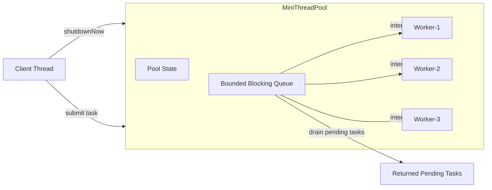
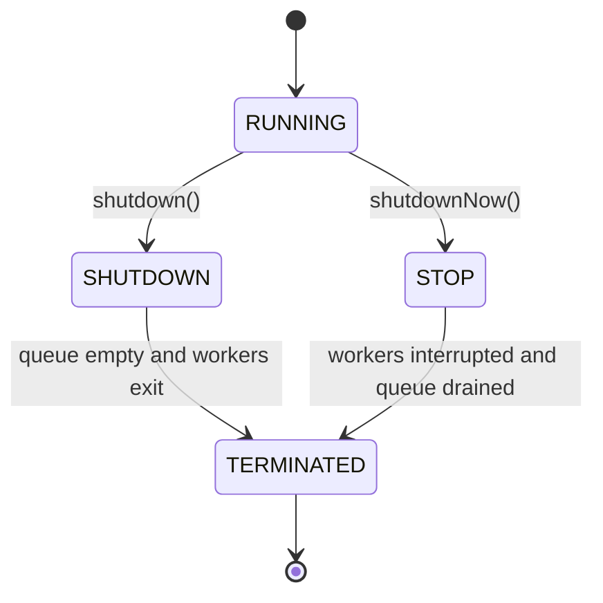

# 009_Shutdown_Now.md — MiniThreadPool Phase 9

## Clickable Index

- [1. Goal](#1-goal)
- [2. What Changed From Phase 008](#2-what-changed-from-phase-008)
- [3. Why Shutdown Now Is Needed](#3-why-shutdown-now-is-needed)
- [4. Architecture Diagram](#4-architecture-diagram)
- [5. Shutdown State Flow](#5-shutdown-state-flow)
- [6. Steps Before Code](#6-steps-before-code)
- [7. File Structure](#7-file-structure)
- [8. Complete Java Code](#8-complete-java-code)
  - [8.1 MiniFuture.java](#81-minifuturejava)
  - [8.2 MiniCallable.java](#82-minicallablejava)
  - [8.3 MiniRunnable.java](#83-minirunnablejava)
  - [8.4 MiniTask.java](#84-minitaskjava)
  - [8.5 RejectionPolicy.java](#85-rejectionpolicyjava)
  - [8.6 MiniBlockingQueue.java](#86-miniblockingqueuejava)
  - [8.7 MiniThreadPool.java](#87-minithreadpooljava)
  - [8.8 ShutdownNowDriver.java](#88-shutdownnowdriverjava)
- [9. Step-by-Step Dry Run](#9-step-by-step-dry-run)
- [10. Output Example](#10-output-example)
- [11. Real-World Use Case](#11-real-world-use-case)
- [12. DSA / CP Connection](#12-dsa--cp-connection)
- [13. Interview Notes](#13-interview-notes)
- [14. Common Mistakes](#14-common-mistakes)
- [15. Next Step](#15-next-step)

---

## 1. Goal

In phase 008, we implemented **graceful shutdown**.

Graceful shutdown means:

```text
Stop accepting new tasks.
Finish all already submitted tasks.
Exit workers only after the queue becomes empty.
```

In this phase, we implement **shutdownNow()**.

Immediate shutdown means:

```text
Stop accepting new tasks immediately.
Interrupt worker threads.
Drain/remove pending tasks from the queue.
Return pending tasks to the caller.
```

This is similar to Java's `ExecutorService.shutdownNow()`.

---

## 2. What Changed From Phase 008

| Phase 008 | Phase 009 |
|---|---|
| Graceful shutdown | Immediate shutdown |
| Existing queued tasks continue | Pending queued tasks are drained |
| Workers finish current work naturally | Workers are interrupted |
| `shutdown()` only | `shutdownNow()` added |
| Queue stays until empty | Queue can be force-drained |

---

## 3. Why Shutdown Now Is Needed

Graceful shutdown is safe, but sometimes too slow.

Example:

```text
Worker is processing long-running payment retry.
Application is stopping.
Deployment must finish.
System cannot wait 5 minutes.
```

In this case, we need:

```text
shutdownNow()
```

It gives stronger control:

1. Reject new submissions.
2. Interrupt workers.
3. Remove pending tasks.
4. Return pending tasks to caller.
5. Let application stop faster.

Important:

```text
shutdownNow() does not magically kill a thread.
It sends interrupt signal.
The running task must cooperate with interruption.
```

---

## 4. Architecture Diagram



---

## 5. Shutdown State Flow



State meanings:

| State | Meaning |
|---|---|
| `RUNNING` | Accept new tasks and execute tasks |
| `SHUTDOWN` | Do not accept new tasks, but finish queued tasks |
| `STOP` | Do not accept new tasks, interrupt workers, drain queue |
| `TERMINATED` | All workers stopped |

---

## 6. Steps Before Code

### Step 1: Add pool state

We introduce internal state:

```java
private volatile boolean isShutdown;
private volatile boolean isStopped;
```

Meaning:

```text
isShutdown = graceful shutdown started
isStopped  = immediate shutdown started
```

---

### Step 2: Reject new tasks after shutdown

Before accepting a task:

```java
if (isShutdown || isStopped) {
    reject task
}
```

---

### Step 3: Add `shutdownNow()`

`shutdownNow()` should:

```text
1. Set isShutdown = true
2. Set isStopped = true
3. Drain pending tasks from queue
4. Interrupt all workers
5. Return pending tasks
```

---

### Step 4: Add queue drain operation

The queue needs a method:

```java
drain()
```

It removes all pending tasks and returns them.

---

### Step 5: Interrupt workers

Each worker thread receives:

```java
thread.interrupt();
```

If worker is waiting inside `wait()`, it wakes up with `InterruptedException`.

If worker is sleeping inside task code, it can also wake up with `InterruptedException`.

---

### Step 6: Worker exits when stopped

Worker loop becomes:

```text
while not stopped:
    take task
    execute task
```

If interrupted and stopped:

```text
exit loop
```

---

## 7. File Structure

```text
mini-threadpool/
└── src/
    └── main/
        └── java/
            └── com/
                └── minithreadpool/
                    ├── MiniFuture.java
                    ├── MiniCallable.java
                    ├── MiniRunnable.java
                    ├── MiniTask.java
                    ├── RejectionPolicy.java
                    ├── MiniBlockingQueue.java
                    ├── MiniThreadPool.java
                    └── ShutdownNowDriver.java
```

---

## 8. Complete Java Code

---

## 8.1 MiniFuture.java

```java
package com.minithreadpool;

public class MiniFuture<T> {

    private T result;
    private Exception exception;
    private boolean completed = false;

    public synchronized void complete(T result) {
        if (completed) {
            return;
        }

        this.result = result;
        this.completed = true;
        notifyAll();
    }

    public synchronized void completeExceptionally(Exception exception) {
        if (completed) {
            return;
        }

        this.exception = exception;
        this.completed = true;
        notifyAll();
    }

    public synchronized T get() throws Exception {
        while (!completed) {
            wait();
        }

        if (exception != null) {
            throw exception;
        }

        return result;
    }

    public synchronized boolean isDone() {
        return completed;
    }
}
```

---

## 8.2 MiniCallable.java

```java
package com.minithreadpool;

@FunctionalInterface
public interface MiniCallable<T> {
    T call() throws Exception;
}
```

---

## 8.3 MiniRunnable.java

```java
package com.minithreadpool;

@FunctionalInterface
public interface MiniRunnable {
    void run() throws Exception;
}
```

---

## 8.4 MiniTask.java

```java
package com.minithreadpool;

public class MiniTask<T> implements Runnable {

    private final MiniCallable<T> callable;
    private final MiniFuture<T> future;
    private final String taskName;

    public MiniTask(String taskName, MiniCallable<T> callable, MiniFuture<T> future) {
        this.taskName = taskName;
        this.callable = callable;
        this.future = future;
    }

    @Override
    public void run() {
        try {
            T result = callable.call();
            future.complete(result);
        } catch (Exception exception) {
            future.completeExceptionally(exception);
        }
    }

    public MiniFuture<T> getFuture() {
        return future;
    }

    public String getTaskName() {
        return taskName;
    }

    @Override
    public String toString() {
        return "MiniTask{" +
                "taskName='" + taskName + '\'' +
                '}';
    }
}
```

---

## 8.5 RejectionPolicy.java

```java
package com.minithreadpool;

public enum RejectionPolicy {
    ABORT,
    CALLER_RUNS,
    DISCARD,
    DISCARD_OLDEST
}
```

---

## 8.6 MiniBlockingQueue.java

```java
package com.minithreadpool;

import java.util.ArrayList;
import java.util.LinkedList;
import java.util.List;
import java.util.Queue;

public class MiniBlockingQueue {

    private final Queue<Runnable> queue = new LinkedList<>();
    private final int capacity;

    public MiniBlockingQueue(int capacity) {
        this.capacity = capacity;
    }

    public synchronized boolean offer(Runnable task) {
        if (queue.size() >= capacity) {
            return false;
        }

        queue.offer(task);
        notifyAll();
        return true;
    }

    public synchronized Runnable take() throws InterruptedException {
        while (queue.isEmpty()) {
            wait();
        }

        Runnable task = queue.poll();
        notifyAll();
        return task;
    }

    public synchronized Runnable poll() {
        Runnable task = queue.poll();
        notifyAll();
        return task;
    }

    public synchronized List<Runnable> drain() {
        List<Runnable> pendingTasks = new ArrayList<>();

        while (!queue.isEmpty()) {
            pendingTasks.add(queue.poll());
        }

        notifyAll();
        return pendingTasks;
    }

    public synchronized boolean isEmpty() {
        return queue.isEmpty();
    }

    public synchronized int size() {
        return queue.size();
    }
}
```

---

## 8.7 MiniThreadPool.java

```java
package com.minithreadpool;

import java.util.ArrayList;
import java.util.List;

public class MiniThreadPool {

    private final MiniBlockingQueue taskQueue;
    private final List<Worker> workers = new ArrayList<>();
    private final RejectionPolicy rejectionPolicy;

    private volatile boolean isShutdown = false;
    private volatile boolean isStopped = false;

    public MiniThreadPool(int numberOfWorkers, int queueCapacity, RejectionPolicy rejectionPolicy) {
        this.taskQueue = new MiniBlockingQueue(queueCapacity);
        this.rejectionPolicy = rejectionPolicy;

        for (int i = 1; i <= numberOfWorkers; i++) {
            Worker worker = new Worker("mini-worker-" + i);
            workers.add(worker);
            worker.start();
        }
    }

    public MiniFuture<Void> submit(String taskName, MiniRunnable runnable) {
        return submit(taskName, () -> {
            runnable.run();
            return null;
        });
    }

    public <T> MiniFuture<T> submit(String taskName, MiniCallable<T> callable) {
        MiniFuture<T> future = new MiniFuture<>();
        MiniTask<T> task = new MiniTask<>(taskName, callable, future);

        if (isShutdown || isStopped) {
            future.completeExceptionally(
                    new IllegalStateException("ThreadPool is not accepting new tasks: " + taskName)
            );
            return future;
        }

        boolean accepted = taskQueue.offer(task);

        if (!accepted) {
            handleRejectedTask(task);
        }

        return future;
    }

    private void handleRejectedTask(Runnable task) {
        switch (rejectionPolicy) {
            case ABORT:
                throw new RuntimeException("Task rejected. Queue is full.");

            case CALLER_RUNS:
                task.run();
                break;

            case DISCARD:
                System.out.println("Task discarded: " + task);
                break;

            case DISCARD_OLDEST:
                Runnable oldestTask = taskQueue.poll();
                System.out.println("Discarded oldest task: " + oldestTask);
                boolean added = taskQueue.offer(task);

                if (!added) {
                    throw new RuntimeException("Task rejected after discarding oldest task.");
                }
                break;

            default:
                throw new IllegalStateException("Unknown rejection policy.");
        }
    }

    public void shutdown() {
        System.out.println("Graceful shutdown started.");
        isShutdown = true;
    }

    public List<Runnable> shutdownNow() {
        System.out.println("Immediate shutdown started.");

        isShutdown = true;
        isStopped = true;

        List<Runnable> pendingTasks = taskQueue.drain();

        for (Worker worker : workers) {
            worker.interruptWorker();
        }

        return pendingTasks;
    }

    public boolean isShutdown() {
        return isShutdown;
    }

    public boolean isStopped() {
        return isStopped;
    }

    public int getQueueSize() {
        return taskQueue.size();
    }

    private class Worker implements Runnable {

        private final Thread thread;
        private final String workerName;

        public Worker(String workerName) {
            this.workerName = workerName;
            this.thread = new Thread(this, workerName);
        }

        public void start() {
            thread.start();
        }

        public void interruptWorker() {
            thread.interrupt();
        }

        @Override
        public void run() {
            System.out.println(workerName + " started.");

            while (!isStopped) {
                try {
                    if (isShutdown && taskQueue.isEmpty()) {
                        break;
                    }

                    Runnable task = taskQueue.take();

                    if (isStopped) {
                        break;
                    }

                    System.out.println(workerName + " executing " + task);
                    task.run();

                } catch (InterruptedException exception) {
                    if (isStopped) {
                        System.out.println(workerName + " interrupted because shutdownNow was called.");
                        break;
                    }

                    Thread.currentThread().interrupt();
                    break;

                } catch (Exception exception) {
                    System.out.println(workerName + " task failed: " + exception.getMessage());
                }
            }

            System.out.println(workerName + " stopped.");
        }
    }
}
```

---

## 8.8 ShutdownNowDriver.java

```java
package com.minithreadpool;

import java.util.List;

public class ShutdownNowDriver {

    public static void main(String[] args) throws Exception {

        MiniThreadPool pool = new MiniThreadPool(
                2,
                10,
                RejectionPolicy.ABORT
        );

        pool.submit("long-task-1", () -> {
            System.out.println("long-task-1 started");
            Thread.sleep(5000);
            System.out.println("long-task-1 completed");
        });

        pool.submit("long-task-2", () -> {
            System.out.println("long-task-2 started");
            Thread.sleep(5000);
            System.out.println("long-task-2 completed");
        });

        pool.submit("pending-task-3", () -> {
            System.out.println("pending-task-3 should not run");
        });

        pool.submit("pending-task-4", () -> {
            System.out.println("pending-task-4 should not run");
        });

        Thread.sleep(1000);

        List<Runnable> pendingTasks = pool.shutdownNow();

        System.out.println("Pending tasks returned by shutdownNow:");
        for (Runnable task : pendingTasks) {
            System.out.println(task);
        }

        MiniFuture<Void> rejectedFuture = pool.submit("task-after-shutdown-now", () -> {
            System.out.println("This should not run");
        });

        try {
            rejectedFuture.get();
        } catch (Exception exception) {
            System.out.println("Rejected task failed as expected: " + exception.getMessage());
        }
    }
}
```

---

## 9. Step-by-Step Dry Run

Initial state:

```text
workers = 2
queue capacity = 10
state = RUNNING
```

Tasks submitted:

```text
long-task-1
long-task-2
pending-task-3
pending-task-4
```

Execution:

```text
mini-worker-1 takes long-task-1
mini-worker-2 takes long-task-2
pending-task-3 remains in queue
pending-task-4 remains in queue
```

After 1 second:

```java
shutdownNow();
```

What happens:

```text
1. isShutdown = true
2. isStopped = true
3. queue.drain() removes pending-task-3 and pending-task-4
4. worker-1 is interrupted
5. worker-2 is interrupted
6. long-task-1 sleep is interrupted
7. long-task-2 sleep is interrupted
8. workers exit
9. new task submission is rejected
```

---

## 10. Output Example

Possible output:

```text
mini-worker-1 started.
mini-worker-2 started.
mini-worker-1 executing MiniTask{taskName='long-task-1'}
mini-worker-2 executing MiniTask{taskName='long-task-2'}
long-task-1 started
long-task-2 started
Immediate shutdown started.
mini-worker-1 task failed: sleep interrupted
mini-worker-2 task failed: sleep interrupted
mini-worker-1 stopped.
mini-worker-2 stopped.
Pending tasks returned by shutdownNow:
MiniTask{taskName='pending-task-3'}
MiniTask{taskName='pending-task-4'}
Rejected task failed as expected: ThreadPool is not accepting new tasks: task-after-shutdown-now
```

Output order can vary because multiple threads run concurrently.

---

## 11. Real-World Use Case

### Kafka Consumer Shutdown

```text
Consumer app receives SIGTERM.
It should stop polling new messages.
It may need to interrupt long processing.
Unprocessed records should not be lost.
```

### Payment Retry Worker

```text
Retry workers are processing jobs.
Deployment starts.
shutdownNow interrupts long waits.
Pending jobs stay in DB/Kafka and can be retried later.
```

### Video Processing Worker

```text
Encoding jobs are long-running.
Application must stop.
Running job is interrupted.
Pending jobs are returned/requeued.
```

### Web Server Request Pool

```text
Server is draining traffic.
Graceful shutdown tries to finish requests.
Immediate shutdown is used when timeout expires.
```

---

## 12. DSA / CP Connection

This phase connects with:

| Concept | ThreadPool Mapping |
|---|---|
| Queue | Pending tasks |
| State machine | RUNNING / SHUTDOWN / STOP / TERMINATED |
| Interrupt handling | Breaking loops safely |
| BFS queue drain | Removing all pending nodes/tasks |
| Simulation | Step-by-step concurrent behavior |
| Producer-consumer | Client submits, workers consume |

The important DSA idea:

```text
A queue is not only a data structure.
In systems, a queue is also a control point for backpressure, draining, retry, and shutdown behavior.
```

---

## 13. Interview Notes

### What is the difference between shutdown and shutdownNow?

```text
shutdown():
- Stops accepting new tasks.
- Allows queued tasks to finish.
- Does not interrupt running workers immediately.

shutdownNow():
- Stops accepting new tasks.
- Attempts to interrupt running workers.
- Drains pending tasks.
- Returns tasks that never started.
```

---

### Does interrupt kill a thread?

No.

```text
interrupt() sets interrupted status.
If thread is blocked in wait/sleep/join, it gets InterruptedException.
The task must cooperate and stop.
```

Bad task:

```java
while (true) {
    // ignores interrupt
}
```

Good task:

```java
while (!Thread.currentThread().isInterrupted()) {
    // do work
}
```

---

### Why return pending tasks?

Because caller may want to:

```text
1. Retry them later
2. Save them to DB
3. Requeue them to Kafka
4. Log them for recovery
5. Move them to DLQ
```

---

## 14. Common Mistakes

### Mistake 1: Thinking shutdownNow kills tasks

Wrong:

```text
shutdownNow kills all tasks immediately.
```

Correct:

```text
shutdownNow interrupts workers.
Tasks must respond to interruption.
```

---

### Mistake 2: Not draining pending tasks

If pending tasks are not returned:

```text
They disappear silently.
This can cause data loss.
```

---

### Mistake 3: Accepting tasks after shutdownNow

After `shutdownNow()`:

```text
No new task should be accepted.
```

---

### Mistake 4: Swallowing InterruptedException

Bad:

```java
catch (InterruptedException e) {
    // ignore
}
```

Better:

```java
catch (InterruptedException e) {
    Thread.currentThread().interrupt();
}
```

In our worker, when `isStopped = true`, we exit.

---

## 15. Next Step

Next file:

```text
010_Scheduled_ThreadPool.md
```

In the next phase, we will add scheduled execution:

```text
1. Run task after delay
2. Run task periodically
3. Use priority queue ordered by execution time
4. Build mini ScheduledThreadPoolExecutor
```

This connects directly to:

```text
Schedulers
Cron jobs
Delayed retries
Kafka retry topics
Payment retry workers
Notification retry systems
```
