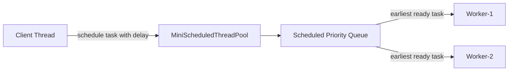
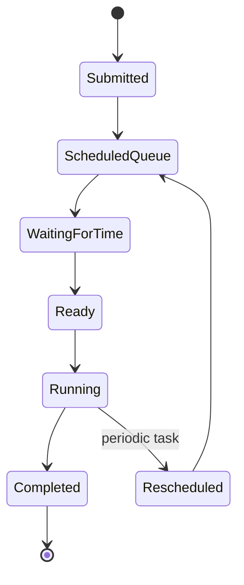
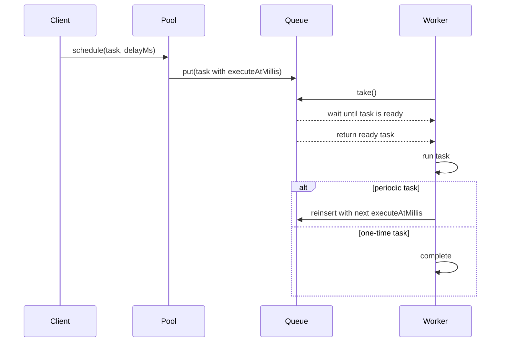

# 010_Scheduled_ThreadPool.md

## MiniThreadPool — Phase 010: Scheduled Thread Pool

> Goal: Upgrade MiniThreadPool from immediate task execution to **scheduled task execution**.
>
> In this phase, tasks can run:
>
> - after a delay
> - at a fixed interval
> - using worker threads that sleep efficiently until the task is ready

---

## Clickable Index

- [1. Goal](#1-goal)
- [2. What Changes From Phase 009](#2-what-changes-from-phase-009)
- [3. Big Picture](#3-big-picture)
- [4. Why Scheduled Thread Pool Is Needed](#4-why-scheduled-thread-pool-is-needed)
- [5. Core Idea](#5-core-idea)
- [6. Architecture Diagram](#6-architecture-diagram)
- [7. Task Lifecycle](#7-task-lifecycle)
- [8. Step-by-Step Design Before Code](#8-step-by-step-design-before-code)
- [9. File Structure](#9-file-structure)
- [10. Complete Java Code](#10-complete-java-code)
  - [10.1 ScheduledTask.java](#101-scheduledtaskjava)
  - [10.2 ScheduledTaskQueue.java](#102-scheduledtaskqueuejava)
  - [10.3 MiniScheduledThreadPool.java](#103-minischeduledthreadpooljava)
  - [10.4 Phase10ScheduledThreadPoolDriver.java](#104-phase10scheduledthreadpooldriverjava)
- [11. Step-by-Step Dry Run](#11-step-by-step-dry-run)
- [12. Mermaid Flow Diagram](#12-mermaid-flow-diagram)
- [13. Important Concepts](#13-important-concepts)
- [14. Real-World Use Cases](#14-real-world-use-cases)
- [15. DSA/CP Connection](#15-dsacp-connection)
- [16. Interview Notes](#16-interview-notes)
- [17. Common Bugs](#17-common-bugs)
- [18. Next Step](#18-next-step)

---

## 1. Goal

In previous phases, a submitted task was executed as soon as a worker was free.

In this phase, we add scheduling:

```java
pool.schedule(task, 3000);
```

This means:

```text
Do not run immediately.
Run this task after 3000 milliseconds.
```

We also add periodic execution:

```java
pool.scheduleAtFixedRate(task, 1000, 2000);
```

This means:

```text
Start after 1000 ms.
Then run every 2000 ms.
```

---

## 2. What Changes From Phase 009

Phase 009 had:

```text
Immediate task queue
shutdownNow()
interrupt workers
drain pending tasks
```

Phase 010 adds:

```text
Scheduled task queue
execution timestamp
priority by earliest execution time
worker waits only until task is ready
support for delayed tasks
support for periodic tasks
```

### Before

```text
submit(task) -> queue -> worker executes immediately
```

### Now

```text
schedule(task, delayMs) -> scheduled queue -> worker waits until execution time -> executes
```

---

## 3. Big Picture

A scheduled thread pool is used when work should not happen immediately.

Examples:

```text
Send email reminder after 10 minutes
Retry failed payment after 30 seconds
Run cleanup job every night
Poll external API every 5 seconds
Expire sessions periodically
Refresh cache every 1 minute
```

---

## 4. Why Scheduled Thread Pool Is Needed

Without scheduling, developers often do this:

```java
Thread.sleep(5000);
task.run();
```

But this is not scalable.

Problems:

```text
1. One thread is blocked per delayed task
2. Hard to manage thousands of scheduled tasks
3. No central queue
4. No cancellation support
5. No clean shutdown control
```

A scheduled pool solves this using:

```text
priority queue + worker wait + execution timestamp
```

---

## 5. Core Idea

Each task has an execution time:

```java
executeAtMillis = currentTimeMillis + delayMillis;
```

Tasks are stored in a priority queue ordered by earliest execution time.

```text
Smallest executeAtMillis comes first
```

Example:

```text
Task-A execute at 10:00:05
Task-B execute at 10:00:02
Task-C execute at 10:00:10
```

Priority queue order:

```text
Task-B -> Task-A -> Task-C
```

---

## 6. Architecture Diagram



---

## 7. Task Lifecycle



---

## 8. Step-by-Step Design Before Code

### Step 1: Wrap Runnable inside ScheduledTask

Instead of storing only `Runnable`, store metadata also:

```text
Runnable task
executeAtMillis
periodMillis
isPeriodic
sequenceNumber
```

Why sequence number?

If two tasks have the same execution time, sequence number keeps ordering stable.

---

### Step 2: Use PriorityQueue

Use this ordering:

```text
earlier executeAtMillis first
if same time, smaller sequence number first
```

---

### Step 3: Worker checks first task

Worker looks at the earliest task.

If queue is empty:

```text
wait()
```

If task is not ready yet:

```text
wait(remainingTime)
```

If task is ready:

```text
poll task and execute
```

---

### Step 4: Add delay scheduling API

```java
schedule(Runnable task, long delayMillis)
```

This computes:

```java
executeAtMillis = System.currentTimeMillis() + delayMillis;
```

---

### Step 5: Add periodic scheduling API

```java
scheduleAtFixedRate(Runnable task, long initialDelayMillis, long periodMillis)
```

After a periodic task runs, it is added again with new execution time.

---

### Step 6: Add shutdown

Graceful shutdown means:

```text
reject new tasks
allow already scheduled tasks to finish
stop workers when queue becomes empty
```

---

## 9. File Structure

```text
minithreadpool-phase10/
└── src/
    └── main/
        └── java/
            └── com/
                └── minithreadpool/
                    ├── ScheduledTask.java
                    ├── ScheduledTaskQueue.java
                    ├── MiniScheduledThreadPool.java
                    └── Phase10ScheduledThreadPoolDriver.java
```

---

## 10. Complete Java Code

---

## 10.1 ScheduledTask.java

```java
package com.minithreadpool;

public class ScheduledTask implements Comparable<ScheduledTask> {

    private final Runnable runnable;
    private long executeAtMillis;
    private final long periodMillis;
    private final boolean periodic;
    private final long sequenceNumber;

    public ScheduledTask(
            Runnable runnable,
            long executeAtMillis,
            long periodMillis,
            boolean periodic,
            long sequenceNumber
    ) {
        this.runnable = runnable;
        this.executeAtMillis = executeAtMillis;
        this.periodMillis = periodMillis;
        this.periodic = periodic;
        this.sequenceNumber = sequenceNumber;
    }

    public void run() {
        runnable.run();
    }

    public long getExecuteAtMillis() {
        return executeAtMillis;
    }

    public boolean isReady() {
        return System.currentTimeMillis() >= executeAtMillis;
    }

    public long getDelayMillis() {
        return executeAtMillis - System.currentTimeMillis();
    }

    public boolean isPeriodic() {
        return periodic;
    }

    public void updateNextExecutionTime() {
        this.executeAtMillis = System.currentTimeMillis() + periodMillis;
    }

    @Override
    public int compareTo(ScheduledTask other) {
        int timeCompare = Long.compare(this.executeAtMillis, other.executeAtMillis);

        if (timeCompare != 0) {
            return timeCompare;
        }

        return Long.compare(this.sequenceNumber, other.sequenceNumber);
    }
}
```

---

## 10.2 ScheduledTaskQueue.java

```java
package com.minithreadpool;

import java.util.PriorityQueue;

public class ScheduledTaskQueue {

    private final PriorityQueue<ScheduledTask> queue = new PriorityQueue<>();

    public synchronized void put(ScheduledTask task) {
        queue.offer(task);
        notifyAll();
    }

    public synchronized ScheduledTask take() throws InterruptedException {
        while (true) {
            while (queue.isEmpty()) {
                wait();
            }

            ScheduledTask task = queue.peek();
            long delayMillis = task.getDelayMillis();

            if (delayMillis <= 0) {
                return queue.poll();
            }

            wait(delayMillis);
        }
    }

    public synchronized boolean isEmpty() {
        return queue.isEmpty();
    }

    public synchronized int size() {
        return queue.size();
    }
}
```

---

## 10.3 MiniScheduledThreadPool.java

```java
package com.minithreadpool;

import java.util.ArrayList;
import java.util.List;
import java.util.concurrent.atomic.AtomicLong;

public class MiniScheduledThreadPool {

    private final ScheduledTaskQueue taskQueue = new ScheduledTaskQueue();
    private final List<Thread> workers = new ArrayList<>();
    private final AtomicLong sequence = new AtomicLong(0);
    private volatile boolean shutdown = false;

    public MiniScheduledThreadPool(int poolSize) {
        if (poolSize <= 0) {
            throw new IllegalArgumentException("poolSize must be greater than 0");
        }

        for (int i = 1; i <= poolSize; i++) {
            Thread worker = new Thread(this::workerLoop, "mini-scheduler-worker-" + i);
            workers.add(worker);
            worker.start();
        }
    }

    public void schedule(Runnable runnable, long delayMillis) {
        validateTask(runnable);
        validateDelay(delayMillis);
        ensureRunning();

        long executeAtMillis = System.currentTimeMillis() + delayMillis;

        ScheduledTask scheduledTask = new ScheduledTask(
                runnable,
                executeAtMillis,
                0,
                false,
                sequence.incrementAndGet()
        );

        taskQueue.put(scheduledTask);
    }

    public void scheduleAtFixedRate(
            Runnable runnable,
            long initialDelayMillis,
            long periodMillis
    ) {
        validateTask(runnable);
        validateDelay(initialDelayMillis);

        if (periodMillis <= 0) {
            throw new IllegalArgumentException("periodMillis must be greater than 0");
        }

        ensureRunning();

        long executeAtMillis = System.currentTimeMillis() + initialDelayMillis;

        ScheduledTask scheduledTask = new ScheduledTask(
                runnable,
                executeAtMillis,
                periodMillis,
                true,
                sequence.incrementAndGet()
        );

        taskQueue.put(scheduledTask);
    }

    private void workerLoop() {
        while (true) {
            try {
                if (shutdown && taskQueue.isEmpty()) {
                    break;
                }

                ScheduledTask task = taskQueue.take();

                try {
                    task.run();
                } catch (Exception ex) {
                    System.out.println(Thread.currentThread().getName()
                            + " task failed: " + ex.getMessage());
                }

                if (task.isPeriodic() && !shutdown) {
                    task.updateNextExecutionTime();
                    taskQueue.put(task);
                }

            } catch (InterruptedException ex) {
                if (shutdown) {
                    break;
                }
            }
        }

        System.out.println(Thread.currentThread().getName() + " stopped");
    }

    public void shutdown() {
        shutdown = true;

        for (Thread worker : workers) {
            worker.interrupt();
        }
    }

    public int getQueueSize() {
        return taskQueue.size();
    }

    private void validateTask(Runnable runnable) {
        if (runnable == null) {
            throw new IllegalArgumentException("runnable cannot be null");
        }
    }

    private void validateDelay(long delayMillis) {
        if (delayMillis < 0) {
            throw new IllegalArgumentException("delayMillis cannot be negative");
        }
    }

    private void ensureRunning() {
        if (shutdown) {
            throw new IllegalStateException("Thread pool is already shutdown");
        }
    }
}
```

---

## 10.4 Phase10ScheduledThreadPoolDriver.java

```java
package com.minithreadpool;

public class Phase10ScheduledThreadPoolDriver {

    public static void main(String[] args) throws InterruptedException {
        MiniScheduledThreadPool pool = new MiniScheduledThreadPool(2);

        System.out.println("Submitting scheduled tasks...");

        pool.schedule(() -> {
            System.out.println(Thread.currentThread().getName()
                    + " executed task after 1 second");
        }, 1000);

        pool.schedule(() -> {
            System.out.println(Thread.currentThread().getName()
                    + " executed task after 3 seconds");
        }, 3000);

        pool.scheduleAtFixedRate(() -> {
            System.out.println(Thread.currentThread().getName()
                    + " running periodic health check");
        }, 500, 1000);

        Thread.sleep(5000);

        System.out.println("Calling graceful shutdown...");
        pool.shutdown();
    }
}
```

---

## 11. Step-by-Step Dry Run

Assume current time is:

```text
T = 0 ms
```

We submit:

```text
Task-A delay = 1000 ms
Task-B delay = 3000 ms
HealthCheck initial delay = 500 ms, period = 1000 ms
```

Queue becomes:

```text
HealthCheck executeAt = 500
Task-A executeAt = 1000
Task-B executeAt = 3000
```

Worker checks queue:

```text
peek = HealthCheck
current time = 0
remaining = 500 ms
worker waits 500 ms
```

At 500 ms:

```text
HealthCheck runs
because it is periodic, reschedule to 1500 ms
```

Queue becomes:

```text
Task-A executeAt = 1000
HealthCheck executeAt = 1500
Task-B executeAt = 3000
```

At 1000 ms:

```text
Task-A runs once
Task-A is not periodic
Task-A is completed and removed
```

At 1500 ms:

```text
HealthCheck runs again
rescheduled to 2500 ms
```

At 3000 ms:

```text
Task-B runs
```

After 5000 ms:

```text
shutdown() is called
new tasks rejected
workers stop
```

---

## 12. Mermaid Flow Diagram



---

## 13. Important Concepts

### 13.1 Delay Queue Concept

A delayed task should not be removed until it is ready.

```text
Queue can contain task
But worker cannot execute it yet
```

---

### 13.2 Priority Queue

The queue must always expose the earliest task first.

```text
Earliest execution time = highest priority
```

---

### 13.3 Efficient Waiting

Bad design:

```java
while (!task.isReady()) {
    // busy wait
}
```

Good design:

```java
wait(delayMillis);
```

This avoids CPU waste.

---

### 13.4 Periodic Task Rescheduling

A periodic task is not permanently completed after one run.

```text
Run task
Compute next execution time
Put it back into queue
```

---

## 14. Real-World Use Cases

### Backend Systems

```text
session cleanup
cache refresh
retry failed jobs
send delayed notification
payment retry
order expiry
```

### Distributed Systems

```text
Kafka consumer heartbeat
leader election timeout
retry with delay
scheduled compaction
metrics scraping
```

### Startup/Product Systems

```text
subscription renewal check
email reminder
daily report generation
video processing retry
background reconciliation
```

---

## 15. DSA/CP Connection

This phase maps directly to DSA concepts.

| ThreadPool Concept | DSA/CP Concept |
|---|---|
| Scheduled task queue | Priority queue / heap |
| Earliest task first | Min-heap |
| Same time ordering | Stable ordering / tie-breaker |
| Worker waits for time | Event simulation |
| Periodic task | Reinsert into heap |
| Delayed retry | Shortest next event processing |

Classic CP pattern:

```text
Process events in increasing time order
```

This is the same pattern used in:

```text
Dijkstra-style event expansion
simulation problems
meeting room problems
task scheduler problems
time-based priority processing
```

---

## 16. Interview Notes

### Q1. Why use PriorityQueue?

Because scheduled tasks must execute by earliest execution time.

```text
PriorityQueue gives O(log n) insert and O(log n) remove-min
```

---

### Q2. Why not create one sleeping thread per delayed task?

Because thousands of scheduled tasks would create thousands of blocked threads.

Better:

```text
store all scheduled tasks in one priority queue
few worker threads execute them when ready
```

---

### Q3. Difference between fixed thread pool and scheduled thread pool?

Fixed thread pool:

```text
executes tasks as soon as possible
```

Scheduled thread pool:

```text
executes tasks at or after a planned time
```

---

### Q4. What happens if a periodic task throws exception?

In this mini implementation:

```text
exception is caught
worker survives
task can still be rescheduled if periodic
```

In production, policy may differ:

```text
stop failed periodic task
retry with backoff
send to dead-letter queue
record metrics
```

---

## 17. Common Bugs

### Bug 1: Worker removes task too early

Wrong:

```java
ScheduledTask task = queue.poll();
if (!task.isReady()) wait(...);
```

Problem:

```text
task is removed before it is ready
other workers cannot see it
```

Correct:

```java
ScheduledTask task = queue.peek();
if ready -> poll
else -> wait
```

---

### Bug 2: Busy waiting

Wrong:

```java
while (System.currentTimeMillis() < task.getExecuteAtMillis()) {
}
```

Problem:

```text
CPU will be wasted
```

Correct:

```java
wait(delayMillis);
```

---

### Bug 3: Forgetting notifyAll after adding a task

If a new earlier task is added, sleeping workers must wake up and re-check the queue.

Correct:

```java
queue.offer(task);
notifyAll();
```

---

### Bug 4: Periodic task keeps running after shutdown

Wrong:

```java
if (task.isPeriodic()) {
    taskQueue.put(task);
}
```

Correct:

```java
if (task.isPeriodic() && !shutdown) {
    taskQueue.put(task);
}
```

---

## 18. Next Step

Next file:

```text
011_Priority_Task_Queue.md
```

In the next phase, we will add:

```text
high-priority tasks
low-priority tasks
priority-based execution
fairness discussion
starvation problem
production priority queue design
```

This will connect thread pools with real-world task prioritization:

```text
payment task > email task
customer request > background cleanup
premium user task > free user task
```
