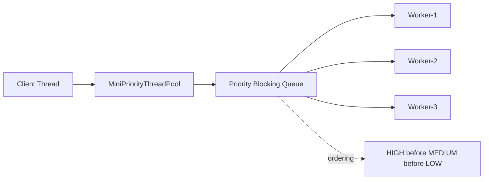
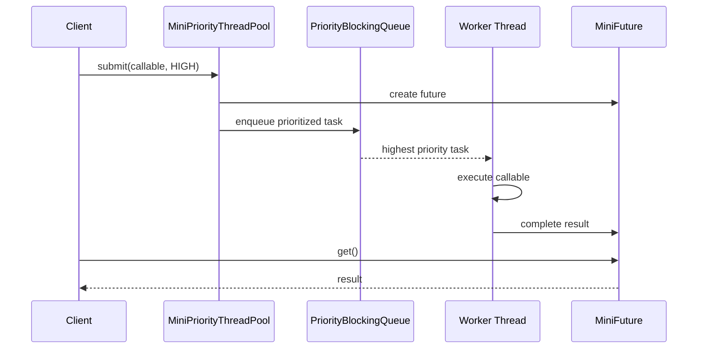

# 011_Priority_Task_Queue.md

# MiniThreadPool — Phase 011: Priority Task Queue

In the previous phase, we built a **Scheduled Thread Pool** where tasks run based on time.

In this phase, we upgrade the executor so that some tasks can run **before others** based on priority.

This is used in real systems where urgent work should not wait behind low-priority work.

Examples:

- payment retry task before email notification
- fraud detection before analytics event
- VIP user request before normal request
- system health check before batch cleanup
- Kafka control-plane command before normal background task

---

# Clickable Index

- [1. Goal](#1-goal)
- [2. What Changes From Previous Phase](#2-what-changes-from-previous-phase)
- [3. Why Priority Queue Is Needed](#3-why-priority-queue-is-needed)
- [4. High Level Architecture](#4-high-level-architecture)
- [5. Priority Execution Flow](#5-priority-execution-flow)
- [6. Design Steps Before Code](#6-design-steps-before-code)
- [7. File Structure](#7-file-structure)
- [8. Complete Java Code](#8-complete-java-code)
  - [8.1 TaskPriority.java](#81-taskpriorityjava)
  - [8.2 PrioritizedTask.java](#82-prioritizedtaskjava)
  - [8.3 MiniFuture.java](#83-minifuturejava)
  - [8.4 MiniPriorityBlockingQueue.java](#84-minipriorityblockingqueuejava)
  - [8.5 MiniPriorityThreadPool.java](#85-miniprioritythreadpooljava)
  - [8.6 Phase11PriorityTaskQueueDriver.java](#86-phase11prioritytaskqueuedriverjava)
- [9. Step By Step Dry Run](#9-step-by-step-dry-run)
- [10. Output Example](#10-output-example)
- [11. DSA CP Connection](#11-dsa-cp-connection)
- [12. Real World Use Cases](#12-real-world-use-cases)
- [13. Interview Notes](#13-interview-notes)
- [14. Common Bugs](#14-common-bugs)
- [15. Next Step](#15-next-step)

---

# 1. Goal

Build a thread pool where each task has a priority.

Higher priority tasks should run before lower priority tasks.

We will support:

- `HIGH`
- `MEDIUM`
- `LOW`

The worker threads will always pick the highest-priority task from the queue.

---

# 2. What Changes From Previous Phase

Previous phase:

```text
Scheduled task queue:
Task with earliest execution time runs first.
```

Current phase:

```text
Priority task queue:
Task with highest priority runs first.
```

Before:

```text
submit(task)
```

Now:

```text
submit(task, priority)
```

Before:

```text
Queue order = arrival order or scheduled time
```

Now:

```text
Queue order = priority first, then sequence number
```

We add sequence number to keep FIFO ordering among tasks with the same priority.

---

# 3. Why Priority Queue Is Needed

Without priority:

```text
Low priority task-1
Low priority task-2
Low priority task-3
High priority payment task
```

The high-priority task waits behind old low-priority tasks.

With priority:

```text
High priority payment task
Low priority task-1
Low priority task-2
Low priority task-3
```

This improves latency for important work.

---

# 4. High Level Architecture



---

# 5. Priority Execution Flow



---

# 6. Design Steps Before Code

## Step 1: Represent Priority

Create enum:

```java
public enum TaskPriority {
    HIGH,
    MEDIUM,
    LOW
}
```

We want `HIGH` to run first.

---

## Step 2: Wrap User Task

User gives us:

```java
Callable<T>
```

But queue needs metadata:

```text
task
priority
sequence number
future
```

So we create:

```java
PrioritizedTask<T>
```

---

## Step 3: Compare Tasks

Ordering rule:

```text
1. HIGH before MEDIUM before LOW
2. If same priority, older task first
```

This prevents same-priority tasks from randomly changing order.

---

## Step 4: Create Priority Blocking Queue

A normal queue gives FIFO.

A priority queue gives highest-priority task first.

But workers must wait when queue is empty.

So we create:

```java
MiniPriorityBlockingQueue
```

Internally:

```java
PriorityQueue<PrioritizedTask<?>>
```

With:

```java
synchronized
wait()
notifyAll()
```

---

## Step 5: Worker Takes Highest Priority Task

Worker loop:

```text
while running:
    task = queue.take()
    task.run()
```

The queue decides which task comes first.

---

## Step 6: Complete Future

When task succeeds:

```java
future.complete(result)
```

When task fails:

```java
future.completeExceptionally(error)
```

---

# 7. File Structure

```text
mini-threadpool/
└── src/
    └── main/
        └── java/
            └── com/
                └── minithreadpool/
                    └── phase011/
                        ├── TaskPriority.java
                        ├── PrioritizedTask.java
                        ├── MiniFuture.java
                        ├── MiniPriorityBlockingQueue.java
                        ├── MiniPriorityThreadPool.java
                        └── Phase11PriorityTaskQueueDriver.java
```

---

# 8. Complete Java Code

---

## 8.1 TaskPriority.java

```java
package com.minithreadpool.phase011;

public enum TaskPriority {
    HIGH(1),
    MEDIUM(2),
    LOW(3);

    private final int order;

    TaskPriority(int order) {
        this.order = order;
    }

    public int getOrder() {
        return order;
    }
}
```

---

## 8.2 PrioritizedTask.java

```java
package com.minithreadpool.phase011;

import java.util.concurrent.Callable;
import java.util.concurrent.atomic.AtomicLong;

public class PrioritizedTask<T> implements Comparable<PrioritizedTask<?>> {

    private static final AtomicLong SEQUENCE_GENERATOR = new AtomicLong(0);

    private final Callable<T> callable;
    private final TaskPriority priority;
    private final long sequenceNumber;
    private final MiniFuture<T> future;

    public PrioritizedTask(Callable<T> callable, TaskPriority priority, MiniFuture<T> future) {
        this.callable = callable;
        this.priority = priority;
        this.future = future;
        this.sequenceNumber = SEQUENCE_GENERATOR.incrementAndGet();
    }

    public void execute() {
        try {
            T result = callable.call();
            future.complete(result);
        } catch (Exception ex) {
            future.completeExceptionally(ex);
        }
    }

    public TaskPriority getPriority() {
        return priority;
    }

    public long getSequenceNumber() {
        return sequenceNumber;
    }

    @Override
    public int compareTo(PrioritizedTask<?> other) {
        int priorityCompare = Integer.compare(
                this.priority.getOrder(),
                other.priority.getOrder()
        );

        if (priorityCompare != 0) {
            return priorityCompare;
        }

        return Long.compare(this.sequenceNumber, other.sequenceNumber);
    }

    @Override
    public String toString() {
        return "PrioritizedTask{" +
                "priority=" + priority +
                ", sequenceNumber=" + sequenceNumber +
                '}';
    }
}
```

---

## 8.3 MiniFuture.java

```java
package com.minithreadpool.phase011;

public class MiniFuture<T> {

    private T result;
    private Exception exception;
    private boolean completed;

    public synchronized T get() {
        while (!completed) {
            try {
                wait();
            } catch (InterruptedException ex) {
                Thread.currentThread().interrupt();
                throw new RuntimeException("Thread interrupted while waiting for result", ex);
            }
        }

        if (exception != null) {
            throw new RuntimeException("Task failed", exception);
        }

        return result;
    }

    public synchronized boolean isDone() {
        return completed;
    }

    public synchronized void complete(T result) {
        if (completed) {
            return;
        }

        this.result = result;
        this.completed = true;
        notifyAll();
    }

    public synchronized void completeExceptionally(Exception exception) {
        if (completed) {
            return;
        }

        this.exception = exception;
        this.completed = true;
        notifyAll();
    }
}
```

---

## 8.4 MiniPriorityBlockingQueue.java

```java
package com.minithreadpool.phase011;

import java.util.PriorityQueue;

public class MiniPriorityBlockingQueue {

    private final PriorityQueue<PrioritizedTask<?>> queue = new PriorityQueue<>();

    public synchronized void put(PrioritizedTask<?> task) {
        queue.offer(task);
        System.out.println("[QUEUE] Added " + task + ", size=" + queue.size());
        notifyAll();
    }

    public synchronized PrioritizedTask<?> take() {
        while (queue.isEmpty()) {
            try {
                wait();
            } catch (InterruptedException ex) {
                Thread.currentThread().interrupt();
                throw new RuntimeException("Worker interrupted while waiting for task", ex);
            }
        }

        PrioritizedTask<?> task = queue.poll();
        System.out.println("[QUEUE] Picked " + task + ", size=" + queue.size());
        return task;
    }

    public synchronized int size() {
        return queue.size();
    }

    public synchronized boolean isEmpty() {
        return queue.isEmpty();
    }
}
```

---

## 8.5 MiniPriorityThreadPool.java

```java
package com.minithreadpool.phase011;

import java.util.ArrayList;
import java.util.List;
import java.util.concurrent.Callable;

public class MiniPriorityThreadPool {

    private final MiniPriorityBlockingQueue taskQueue;
    private final List<Thread> workers;
    private volatile boolean shutdown;

    public MiniPriorityThreadPool(int workerCount) {
        if (workerCount <= 0) {
            throw new IllegalArgumentException("workerCount must be greater than zero");
        }

        this.taskQueue = new MiniPriorityBlockingQueue();
        this.workers = new ArrayList<>();

        for (int i = 1; i <= workerCount; i++) {
            Thread worker = new Thread(new Worker(), "priority-worker-" + i);
            workers.add(worker);
            worker.start();
        }
    }

    public <T> MiniFuture<T> submit(Callable<T> callable, TaskPriority priority) {
        if (callable == null) {
            throw new IllegalArgumentException("callable cannot be null");
        }

        if (priority == null) {
            throw new IllegalArgumentException("priority cannot be null");
        }

        if (shutdown) {
            throw new IllegalStateException("Thread pool is already shutdown");
        }

        MiniFuture<T> future = new MiniFuture<>();
        PrioritizedTask<T> task = new PrioritizedTask<>(callable, priority, future);
        taskQueue.put(task);

        return future;
    }

    public MiniFuture<String> submit(Runnable runnable, TaskPriority priority) {
        if (runnable == null) {
            throw new IllegalArgumentException("runnable cannot be null");
        }

        return submit(() -> {
            runnable.run();
            return "DONE";
        }, priority);
    }

    public void shutdownNow() {
        shutdown = true;

        for (Thread worker : workers) {
            worker.interrupt();
        }

        System.out.println("[POOL] shutdownNow called");
    }

    private class Worker implements Runnable {

        @Override
        public void run() {
            while (!shutdown) {
                try {
                    PrioritizedTask<?> task = taskQueue.take();
                    System.out.println("[" + Thread.currentThread().getName() + "] executing " + task);
                    task.execute();
                } catch (RuntimeException ex) {
                    if (Thread.currentThread().isInterrupted()) {
                        System.out.println("[" + Thread.currentThread().getName() + "] interrupted, stopping");
                        break;
                    }

                    System.out.println("[" + Thread.currentThread().getName() + "] error: " + ex.getMessage());
                }
            }

            System.out.println("[" + Thread.currentThread().getName() + "] stopped");
        }
    }
}
```

---

## 8.6 Phase11PriorityTaskQueueDriver.java

```java
package com.minithreadpool.phase011;

public class Phase11PriorityTaskQueueDriver {

    public static void main(String[] args) throws InterruptedException {
        MiniPriorityThreadPool pool = new MiniPriorityThreadPool(2);

        MiniFuture<String> low1 = pool.submit(() -> {
            sleep(500);
            System.out.println("Executing LOW task 1");
            return "LOW-1 completed";
        }, TaskPriority.LOW);

        MiniFuture<String> medium1 = pool.submit(() -> {
            sleep(300);
            System.out.println("Executing MEDIUM task 1");
            return "MEDIUM-1 completed";
        }, TaskPriority.MEDIUM);

        MiniFuture<String> high1 = pool.submit(() -> {
            sleep(200);
            System.out.println("Executing HIGH task 1");
            return "HIGH-1 completed";
        }, TaskPriority.HIGH);

        MiniFuture<String> high2 = pool.submit(() -> {
            sleep(200);
            System.out.println("Executing HIGH task 2");
            return "HIGH-2 completed";
        }, TaskPriority.HIGH);

        MiniFuture<String> low2 = pool.submit(() -> {
            sleep(100);
            System.out.println("Executing LOW task 2");
            return "LOW-2 completed";
        }, TaskPriority.LOW);

        System.out.println("Result high1 = " + high1.get());
        System.out.println("Result high2 = " + high2.get());
        System.out.println("Result medium1 = " + medium1.get());
        System.out.println("Result low1 = " + low1.get());
        System.out.println("Result low2 = " + low2.get());

        pool.shutdownNow();
    }

    private static void sleep(long millis) {
        try {
            Thread.sleep(millis);
        } catch (InterruptedException ex) {
            Thread.currentThread().interrupt();
        }
    }
}
```

---

# 9. Step By Step Dry Run

Assume 2 workers.

Submitted tasks:

```text
LOW-1
MEDIUM-1
HIGH-1
HIGH-2
LOW-2
```

Priority queue internally orders them as:

```text
HIGH-1
HIGH-2
MEDIUM-1
LOW-1
LOW-2
```

Because:

```text
HIGH order = 1
MEDIUM order = 2
LOW order = 3
```

Execution:

```text
Worker-1 picks HIGH-1
Worker-2 picks HIGH-2

Worker-1 finishes HIGH-1
Worker-1 picks MEDIUM-1

Worker-2 finishes HIGH-2
Worker-2 picks LOW-1

Worker-1 finishes MEDIUM-1
Worker-1 picks LOW-2
```

Important point:

```text
Priority controls start order.
Task duration controls finish order.
```

A LOW task can finish before a HIGH task if it is very short and already running.

Priority does not stop currently running tasks.

---

# 10. Output Example

Output may vary because threads run concurrently.

```text
[QUEUE] Added PrioritizedTask{priority=LOW, sequenceNumber=1}, size=1
[QUEUE] Added PrioritizedTask{priority=MEDIUM, sequenceNumber=2}, size=2
[QUEUE] Added PrioritizedTask{priority=HIGH, sequenceNumber=3}, size=3
[QUEUE] Added PrioritizedTask{priority=HIGH, sequenceNumber=4}, size=4
[QUEUE] Added PrioritizedTask{priority=LOW, sequenceNumber=5}, size=5

[QUEUE] Picked PrioritizedTask{priority=HIGH, sequenceNumber=3}, size=4
[QUEUE] Picked PrioritizedTask{priority=HIGH, sequenceNumber=4}, size=3

[priority-worker-1] executing PrioritizedTask{priority=HIGH, sequenceNumber=3}
[priority-worker-2] executing PrioritizedTask{priority=HIGH, sequenceNumber=4}

Executing HIGH task 1
Executing HIGH task 2

Result high1 = HIGH-1 completed
Result high2 = HIGH-2 completed
```

---

# 11. DSA CP Connection

This phase directly maps to **heap / priority queue**.

## Core Data Structure

```text
PriorityQueue
```

## DSA Pattern

```text
Always process the most important item first.
```

## Similar CP Problems

```text
Dijkstra algorithm
CPU task scheduling
Meeting rooms
K closest points
Merge K sorted lists
Top K frequent elements
Process tasks by deadline/priority
```

## Mental Model

```text
Normal Queue:
first in, first out

Priority Queue:
best priority comes out first
```

## Complexity

For each task:

```text
insert = O(log N)
poll = O(log N)
peek = O(1)
```

Where `N` is number of pending tasks.

---

# 12. Real World Use Cases

## Web Server

```text
Admin request > user request > analytics request
```

## Payment System

```text
Payment confirmation > invoice email > analytics event
```

## Kafka-like System

```text
Controller command > replication task > normal fetch task
```

## Video Processing

```text
Premium user video > normal user video > background cleanup
```

## Notification System

```text
OTP notification > promotional email
```

---

# 13. Interview Notes

Important points to explain:

```text
1. Priority queue changes task selection order.
2. Worker threads do not know priority logic.
3. Queue owns ordering responsibility.
4. Same priority tasks need sequence number for FIFO fairness.
5. Priority does not interrupt already running tasks.
6. Too many high-priority tasks can starve low-priority tasks.
```

Possible follow-up question:

```text
Can low-priority tasks starve?
```

Answer:

```text
Yes. If high-priority tasks keep coming continuously, low-priority tasks may never execute.
To solve this, use aging: increase task priority as waiting time grows.
```

---

# 14. Common Bugs

## Bug 1: Wrong Priority Order

Wrong:

```java
HIGH(3), MEDIUM(2), LOW(1)
```

With natural ascending order, LOW may execute first.

Correct:

```java
HIGH(1), MEDIUM(2), LOW(3)
```

---

## Bug 2: No Sequence Number

Without sequence number:

```text
Two HIGH tasks may run in random order.
```

Fix:

```text
If priority same, compare sequence number.
```

---

## Bug 3: Forgetting notifyAll

If producer adds task but does not notify:

```text
Workers may keep sleeping forever.
```

Correct:

```java
notifyAll();
```

---

## Bug 4: Thinking Priority Cancels Running Task

Priority only affects queued tasks.

It does not stop a task that is already running.

---

# 15. Next Step

Next file:

```text
012_Metrics_And_Monitoring.md
```

In the next phase, we add production-style metrics:

```text
active worker count
queue size
completed task count
failed task count
rejected task count
average execution time
```

This makes the MiniThreadPool observable like real production systems.
