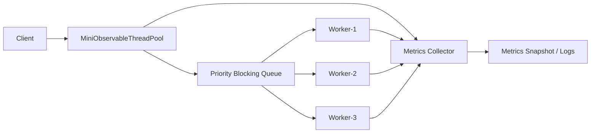
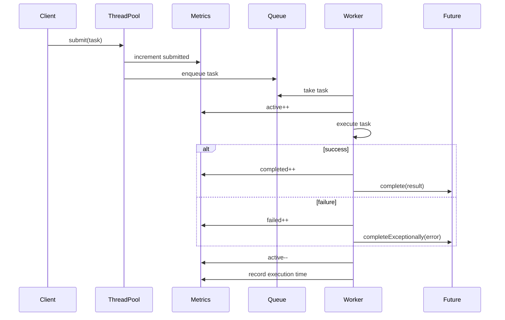

# 012_Metrics_And_Monitoring.md

# MiniThreadPool — Phase 012: Metrics And Monitoring

In the previous phase, we built a **Priority Task Queue**.

In this phase, we make the thread pool observable.

A production thread pool is not complete if we cannot answer:

```text
How many tasks are waiting?
How many workers are active?
How many tasks completed?
How many tasks failed?
How long does each task take?
```

This phase adds metrics like real production systems.

---

# Clickable Index

- [1. Goal](#1-goal)
- [2. What Changes From Previous Phase](#2-what-changes-from-previous-phase)
- [3. Why Metrics Are Needed](#3-why-metrics-are-needed)
- [4. High Level Architecture](#4-high-level-architecture)
- [5. Metrics Flow](#5-metrics-flow)
- [6. Design Steps Before Code](#6-design-steps-before-code)
- [7. Metrics We Track](#7-metrics-we-track)
- [8. File Structure](#8-file-structure)
- [9. Complete Java Code](#9-complete-java-code)
  - [9.1 TaskPriority.java](#91-taskpriorityjava)
  - [9.2 MiniThreadPoolMetrics.java](#92-minithreadpoolmetricsjava)
  - [9.3 MiniFuture.java](#93-minifuturejava)
  - [9.4 PrioritizedTask.java](#94-prioritizedtaskjava)
  - [9.5 MiniPriorityBlockingQueue.java](#95-minipriorityblockingqueuejava)
  - [9.6 MiniObservableThreadPool.java](#96-miniobservablethreadpooljava)
  - [9.7 Phase12MetricsAndMonitoringDriver.java](#97-phase12metricsandmonitoringdriverjava)
- [10. Step By Step Dry Run](#10-step-by-step-dry-run)
- [11. Output Example](#11-output-example)
- [12. DSA CP Connection](#12-dsa-cp-connection)
- [13. Real World Use Cases](#13-real-world-use-cases)
- [14. Interview Notes](#14-interview-notes)
- [15. Common Bugs](#15-common-bugs)
- [16. Next Step](#16-next-step)

---

# 1. Goal

Add monitoring support to MiniThreadPool.

We will track:

```text
submitted task count
completed task count
failed task count
active worker count
queue size
total execution time
average execution time
```

This helps us debug production problems.

---

# 2. What Changes From Previous Phase

Previous phase:

```text
Priority queue decides which task runs first.
```

Current phase:

```text
Thread pool also records runtime metrics.
```

Before:

```text
submit task -> execute task -> complete future
```

Now:

```text
submit task -> increment submitted count
worker starts -> increment active count
task finishes -> increment completed/failed count
worker finishes -> decrement active count
record execution time
```

---

# 3. Why Metrics Are Needed

Without metrics, you only know:

```text
Something is slow.
```

With metrics, you can know:

```text
Queue size is growing.
Workers are all busy.
Tasks are failing.
Average execution time increased.
Task submission rate is higher than processing rate.
```

This is how production debugging starts.

---

# 4. High Level Architecture



---

# 5. Metrics Flow



---

# 6. Design Steps Before Code

## Step 1: Create Metrics Class

We create:

```java
MiniThreadPoolMetrics
```

It stores counters using:

```java
AtomicLong
AtomicInteger
```

Why?

Because multiple workers update metrics concurrently.

---

## Step 2: Track Submit Count

When user submits task:

```java
metrics.incrementSubmittedTasks();
```

---

## Step 3: Track Active Workers

Before worker executes task:

```java
metrics.incrementActiveWorkers();
```

After task finishes:

```java
metrics.decrementActiveWorkers();
```

---

## Step 4: Track Success And Failure

If task succeeds:

```java
metrics.incrementCompletedTasks();
```

If task fails:

```java
metrics.incrementFailedTasks();
```

---

## Step 5: Track Execution Time

Before task:

```java
long startTime = System.nanoTime();
```

After task:

```java
long duration = System.nanoTime() - startTime;
metrics.recordExecutionTime(duration);
```

---

## Step 6: Print Snapshot

Expose method:

```java
pool.printMetrics();
```

It prints current metrics.

---

# 7. Metrics We Track

| Metric | Meaning |
|---|---|
| submittedTasks | Total tasks accepted by pool |
| completedTasks | Tasks finished successfully |
| failedTasks | Tasks finished with exception |
| activeWorkers | Workers currently executing tasks |
| queueSize | Tasks waiting in queue |
| totalExecutionTimeNanos | Sum of all task execution time |
| averageExecutionTimeMillis | Average task execution time |

---

# 8. File Structure

```text
mini-threadpool/
└── src/
    └── main/
        └── java/
            └── com/
                └── minithreadpool/
                    └── phase012/
                        ├── TaskPriority.java
                        ├── MiniThreadPoolMetrics.java
                        ├── MiniFuture.java
                        ├── PrioritizedTask.java
                        ├── MiniPriorityBlockingQueue.java
                        ├── MiniObservableThreadPool.java
                        └── Phase12MetricsAndMonitoringDriver.java
```

---

# 9. Complete Java Code

---

## 9.1 TaskPriority.java

```java
package com.minithreadpool.phase012;

public enum TaskPriority {
    HIGH(1),
    MEDIUM(2),
    LOW(3);

    private final int order;

    TaskPriority(int order) {
        this.order = order;
    }

    public int getOrder() {
        return order;
    }
}
```

---

## 9.2 MiniThreadPoolMetrics.java

```java
package com.minithreadpool.phase012;

import java.util.concurrent.atomic.AtomicInteger;
import java.util.concurrent.atomic.AtomicLong;

public class MiniThreadPoolMetrics {

    private final AtomicLong submittedTasks = new AtomicLong(0);
    private final AtomicLong completedTasks = new AtomicLong(0);
    private final AtomicLong failedTasks = new AtomicLong(0);
    private final AtomicInteger activeWorkers = new AtomicInteger(0);
    private final AtomicLong totalExecutionTimeNanos = new AtomicLong(0);

    public void incrementSubmittedTasks() {
        submittedTasks.incrementAndGet();
    }

    public void incrementCompletedTasks() {
        completedTasks.incrementAndGet();
    }

    public void incrementFailedTasks() {
        failedTasks.incrementAndGet();
    }

    public void incrementActiveWorkers() {
        activeWorkers.incrementAndGet();
    }

    public void decrementActiveWorkers() {
        activeWorkers.decrementAndGet();
    }

    public void recordExecutionTime(long durationNanos) {
        totalExecutionTimeNanos.addAndGet(durationNanos);
    }

    public long getSubmittedTasks() {
        return submittedTasks.get();
    }

    public long getCompletedTasks() {
        return completedTasks.get();
    }

    public long getFailedTasks() {
        return failedTasks.get();
    }

    public int getActiveWorkers() {
        return activeWorkers.get();
    }

    public long getTotalExecutionTimeNanos() {
        return totalExecutionTimeNanos.get();
    }

    public double getAverageExecutionTimeMillis() {
        long finishedTasks = completedTasks.get() + failedTasks.get();

        if (finishedTasks == 0) {
            return 0.0;
        }

        return (totalExecutionTimeNanos.get() / 1_000_000.0) / finishedTasks;
    }

    public String snapshot(int queueSize) {
        return String.format("""
                ===== MiniThreadPool Metrics =====
                submittedTasks=%d
                completedTasks=%d
                failedTasks=%d
                activeWorkers=%d
                queueSize=%d
                totalExecutionTimeMillis=%.2f
                averageExecutionTimeMillis=%.2f
                =================================
                """,
                getSubmittedTasks(),
                getCompletedTasks(),
                getFailedTasks(),
                getActiveWorkers(),
                queueSize,
                getTotalExecutionTimeNanos() / 1_000_000.0,
                getAverageExecutionTimeMillis()
        );
    }
}
```

---

## 9.3 MiniFuture.java

```java
package com.minithreadpool.phase012;

public class MiniFuture<T> {

    private T result;
    private Exception exception;
    private boolean completed;

    public synchronized T get() {
        while (!completed) {
            try {
                wait();
            } catch (InterruptedException ex) {
                Thread.currentThread().interrupt();
                throw new RuntimeException("Thread interrupted while waiting for result", ex);
            }
        }

        if (exception != null) {
            throw new RuntimeException("Task failed", exception);
        }

        return result;
    }

    public synchronized boolean isDone() {
        return completed;
    }

    public synchronized void complete(T result) {
        if (completed) {
            return;
        }

        this.result = result;
        this.completed = true;
        notifyAll();
    }

    public synchronized void completeExceptionally(Exception exception) {
        if (completed) {
            return;
        }

        this.exception = exception;
        this.completed = true;
        notifyAll();
    }
}
```

---

## 9.4 PrioritizedTask.java

```java
package com.minithreadpool.phase012;

import java.util.concurrent.Callable;
import java.util.concurrent.atomic.AtomicLong;

public class PrioritizedTask<T> implements Comparable<PrioritizedTask<?>> {

    private static final AtomicLong SEQUENCE_GENERATOR = new AtomicLong(0);

    private final Callable<T> callable;
    private final TaskPriority priority;
    private final long sequenceNumber;
    private final MiniFuture<T> future;

    public PrioritizedTask(Callable<T> callable, TaskPriority priority, MiniFuture<T> future) {
        this.callable = callable;
        this.priority = priority;
        this.future = future;
        this.sequenceNumber = SEQUENCE_GENERATOR.incrementAndGet();
    }

    public void execute() throws Exception {
        T result = callable.call();
        future.complete(result);
    }

    public void fail(Exception ex) {
        future.completeExceptionally(ex);
    }

    public TaskPriority getPriority() {
        return priority;
    }

    public long getSequenceNumber() {
        return sequenceNumber;
    }

    @Override
    public int compareTo(PrioritizedTask<?> other) {
        int priorityCompare = Integer.compare(
                this.priority.getOrder(),
                other.priority.getOrder()
        );

        if (priorityCompare != 0) {
            return priorityCompare;
        }

        return Long.compare(this.sequenceNumber, other.sequenceNumber);
    }

    @Override
    public String toString() {
        return "PrioritizedTask{" +
                "priority=" + priority +
                ", sequenceNumber=" + sequenceNumber +
                '}';
    }
}
```

---

## 9.5 MiniPriorityBlockingQueue.java

```java
package com.minithreadpool.phase012;

import java.util.PriorityQueue;

public class MiniPriorityBlockingQueue {

    private final PriorityQueue<PrioritizedTask<?>> queue = new PriorityQueue<>();

    public synchronized void put(PrioritizedTask<?> task) {
        queue.offer(task);
        System.out.println("[QUEUE] Added " + task + ", size=" + queue.size());
        notifyAll();
    }

    public synchronized PrioritizedTask<?> take() {
        while (queue.isEmpty()) {
            try {
                wait();
            } catch (InterruptedException ex) {
                Thread.currentThread().interrupt();
                throw new RuntimeException("Worker interrupted while waiting for task", ex);
            }
        }

        PrioritizedTask<?> task = queue.poll();
        System.out.println("[QUEUE] Picked " + task + ", size=" + queue.size());
        return task;
    }

    public synchronized int size() {
        return queue.size();
    }

    public synchronized boolean isEmpty() {
        return queue.isEmpty();
    }
}
```

---

## 9.6 MiniObservableThreadPool.java

```java
package com.minithreadpool.phase012;

import java.util.ArrayList;
import java.util.List;
import java.util.concurrent.Callable;

public class MiniObservableThreadPool {

    private final MiniPriorityBlockingQueue taskQueue;
    private final List<Thread> workers;
    private final MiniThreadPoolMetrics metrics;

    private volatile boolean shutdown;

    public MiniObservableThreadPool(int workerCount) {
        if (workerCount <= 0) {
            throw new IllegalArgumentException("workerCount must be greater than zero");
        }

        this.taskQueue = new MiniPriorityBlockingQueue();
        this.workers = new ArrayList<>();
        this.metrics = new MiniThreadPoolMetrics();

        for (int i = 1; i <= workerCount; i++) {
            Thread worker = new Thread(new Worker(), "observable-worker-" + i);
            workers.add(worker);
            worker.start();
        }
    }

    public <T> MiniFuture<T> submit(Callable<T> callable, TaskPriority priority) {
        if (callable == null) {
            throw new IllegalArgumentException("callable cannot be null");
        }

        if (priority == null) {
            throw new IllegalArgumentException("priority cannot be null");
        }

        if (shutdown) {
            throw new IllegalStateException("Thread pool is already shutdown");
        }

        MiniFuture<T> future = new MiniFuture<>();
        PrioritizedTask<T> task = new PrioritizedTask<>(callable, priority, future);

        metrics.incrementSubmittedTasks();
        taskQueue.put(task);

        return future;
    }

    public MiniFuture<String> submit(Runnable runnable, TaskPriority priority) {
        if (runnable == null) {
            throw new IllegalArgumentException("runnable cannot be null");
        }

        return submit(() -> {
            runnable.run();
            return "DONE";
        }, priority);
    }

    public void printMetrics() {
        System.out.println(metrics.snapshot(taskQueue.size()));
    }

    public MiniThreadPoolMetrics getMetrics() {
        return metrics;
    }

    public void shutdownNow() {
        shutdown = true;

        for (Thread worker : workers) {
            worker.interrupt();
        }

        System.out.println("[POOL] shutdownNow called");
    }

    private class Worker implements Runnable {

        @Override
        public void run() {
            while (!shutdown) {
                PrioritizedTask<?> task = null;
                long startTime = 0L;

                try {
                    task = taskQueue.take();

                    metrics.incrementActiveWorkers();
                    startTime = System.nanoTime();

                    System.out.println("[" + Thread.currentThread().getName() + "] executing " + task);

                    task.execute();

                    long duration = System.nanoTime() - startTime;
                    metrics.recordExecutionTime(duration);
                    metrics.incrementCompletedTasks();

                } catch (RuntimeException ex) {
                    if (Thread.currentThread().isInterrupted()) {
                        System.out.println("[" + Thread.currentThread().getName() + "] interrupted, stopping");
                        break;
                    }

                    long duration = startTime == 0L ? 0L : System.nanoTime() - startTime;
                    metrics.recordExecutionTime(duration);
                    metrics.incrementFailedTasks();

                    if (task != null) {
                        task.fail(ex);
                    }

                    System.out.println("[" + Thread.currentThread().getName() + "] runtime error: " + ex.getMessage());

                } catch (Exception ex) {
                    long duration = startTime == 0L ? 0L : System.nanoTime() - startTime;
                    metrics.recordExecutionTime(duration);
                    metrics.incrementFailedTasks();

                    if (task != null) {
                        task.fail(ex);
                    }

                    System.out.println("[" + Thread.currentThread().getName() + "] task failed: " + ex.getMessage());

                } finally {
                    if (startTime != 0L) {
                        metrics.decrementActiveWorkers();
                    }
                }
            }

            System.out.println("[" + Thread.currentThread().getName() + "] stopped");
        }
    }
}
```

---

## 9.7 Phase12MetricsAndMonitoringDriver.java

```java
package com.minithreadpool.phase012;

public class Phase12MetricsAndMonitoringDriver {

    public static void main(String[] args) {
        MiniObservableThreadPool pool = new MiniObservableThreadPool(2);

        MiniFuture<String> high = pool.submit(() -> {
            sleep(300);
            return "HIGH task completed";
        }, TaskPriority.HIGH);

        MiniFuture<String> medium = pool.submit(() -> {
            sleep(500);
            return "MEDIUM task completed";
        }, TaskPriority.MEDIUM);

        MiniFuture<String> failed = pool.submit(() -> {
            sleep(200);
            throw new RuntimeException("Simulated task failure");
        }, TaskPriority.HIGH);

        MiniFuture<String> low = pool.submit(() -> {
            sleep(100);
            return "LOW task completed";
        }, TaskPriority.LOW);

        pool.printMetrics();

        System.out.println("Result high = " + high.get());
        System.out.println("Result medium = " + medium.get());

        try {
            System.out.println("Result failed = " + failed.get());
        } catch (RuntimeException ex) {
            System.out.println("Failed task observed from future: " + ex.getMessage());
        }

        System.out.println("Result low = " + low.get());

        pool.printMetrics();

        pool.shutdownNow();
    }

    private static void sleep(long millis) {
        try {
            Thread.sleep(millis);
        } catch (InterruptedException ex) {
            Thread.currentThread().interrupt();
        }
    }
}
```

---

# 10. Step By Step Dry Run

Assume:

```text
workerCount = 2
submittedTasks = 4
```

Tasks:

```text
HIGH success
MEDIUM success
HIGH failure
LOW success
```

Initial metrics:

```text
submittedTasks = 0
completedTasks = 0
failedTasks = 0
activeWorkers = 0
queueSize = 0
```

After submitting 4 tasks:

```text
submittedTasks = 4
queueSize = 4
```

Worker-1 takes HIGH task:

```text
queueSize = 3
activeWorkers = 1
```

Worker-2 takes HIGH failed task:

```text
queueSize = 2
activeWorkers = 2
```

Failed task throws exception:

```text
failedTasks = 1
activeWorkers = 1
execution time recorded
future completed exceptionally
```

Successful task finishes:

```text
completedTasks = 1
activeWorkers = 0 or 1 depending on next task pickup
execution time recorded
future completed successfully
```

At the end:

```text
submittedTasks = 4
completedTasks = 3
failedTasks = 1
activeWorkers = 0
queueSize = 0
```

---

# 11. Output Example

Output will vary because threads run concurrently.

```text
[QUEUE] Added PrioritizedTask{priority=HIGH, sequenceNumber=1}, size=1
[QUEUE] Added PrioritizedTask{priority=MEDIUM, sequenceNumber=2}, size=2
[QUEUE] Added PrioritizedTask{priority=HIGH, sequenceNumber=3}, size=3
[QUEUE] Added PrioritizedTask{priority=LOW, sequenceNumber=4}, size=4

===== MiniThreadPool Metrics =====
submittedTasks=4
completedTasks=0
failedTasks=0
activeWorkers=2
queueSize=2
totalExecutionTimeMillis=0.00
averageExecutionTimeMillis=0.00
=================================

Result high = HIGH task completed
Result medium = MEDIUM task completed
Failed task observed from future: Task failed
Result low = LOW task completed

===== MiniThreadPool Metrics =====
submittedTasks=4
completedTasks=3
failedTasks=1
activeWorkers=0
queueSize=0
totalExecutionTimeMillis=1100.00
averageExecutionTimeMillis=275.00
=================================
```

---

# 12. DSA CP Connection

This phase connects to:

```text
counters
state tracking
prefix accumulation
average calculation
heap with metrics
```

## Important DSA Ideas

```text
Atomic counter = concurrent version of count variable
Total execution time = running sum
Average = total / count
Queue size = dynamic state
```

## Related CP Patterns

```text
running sum
frequency count
event simulation
priority queue simulation
```

Example:

```text
CPU scheduling problems often need:
- waiting tasks
- running tasks
- completed count
- total time
- average waiting time
```

---

# 13. Real World Use Cases

## Spring Boot / Web Server

Metrics tell:

```text
request executor queue size
active request threads
slow background jobs
```

## Kafka Consumer

Metrics tell:

```text
consumer lag
processing time
failed message count
retry count
```

## Payment System

Metrics tell:

```text
payment task failures
retry queue growth
average processing latency
```

## Video Processing

Metrics tell:

```text
transcoding queue size
active encoders
failed video jobs
average encoding time
```

## Production Alerting

You can alert when:

```text
queueSize > 1000
failedTasks increasing fast
averageExecutionTimeMillis > threshold
activeWorkers == maxWorkers for long time
```

---

# 14. Interview Notes

Important points:

```text
1. Metrics are required for production debugging.
2. Atomic counters are needed because multiple workers update them.
3. Queue size tells backlog.
4. Active workers tells saturation.
5. Average execution time tells task slowness.
6. Failed count tells reliability.
7. submittedTasks - completedTasks - failedTasks roughly shows pending/running work.
```

Useful formula:

```text
pendingOrRunning = submittedTasks - completedTasks - failedTasks
```

Then:

```text
waitingInQueue = queueSize
runningNow = activeWorkers
```

---

# 15. Common Bugs

## Bug 1: Using normal long in multi-threaded code

Wrong:

```java
private long completedTasks;
completedTasks++;
```

Multiple workers can update at the same time and lose increments.

Correct:

```java
private final AtomicLong completedTasks = new AtomicLong(0);
completedTasks.incrementAndGet();
```

---

## Bug 2: Forgetting to decrement active workers

If task throws exception, this may never run:

```java
activeWorkers--;
```

Correct:

```java
finally {
    metrics.decrementActiveWorkers();
}
```

---

## Bug 3: Recording success before task completes

Wrong:

```java
metrics.incrementCompletedTasks();
task.execute();
```

Correct:

```java
task.execute();
metrics.incrementCompletedTasks();
```

---

## Bug 4: Not recording failed task duration

Failed tasks also consume time.

Record duration in both success and failure paths.

---

# 16. Next Step

Next file:

```text
013_Production_ThreadPool.md
```

In the next phase, we combine everything into a production-style thread pool:

```text
bounded queue
priority support
future/callable
exception handling
graceful shutdown
shutdownNow
metrics
thread naming
configuration object
clean lifecycle
```

This will become the final MiniThreadPool version.
