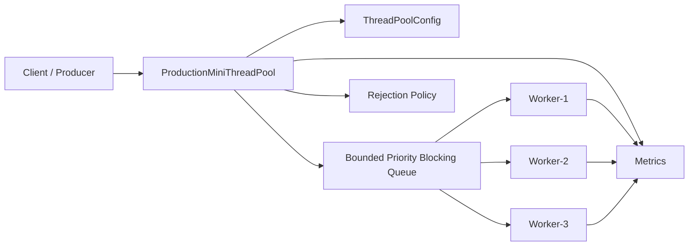
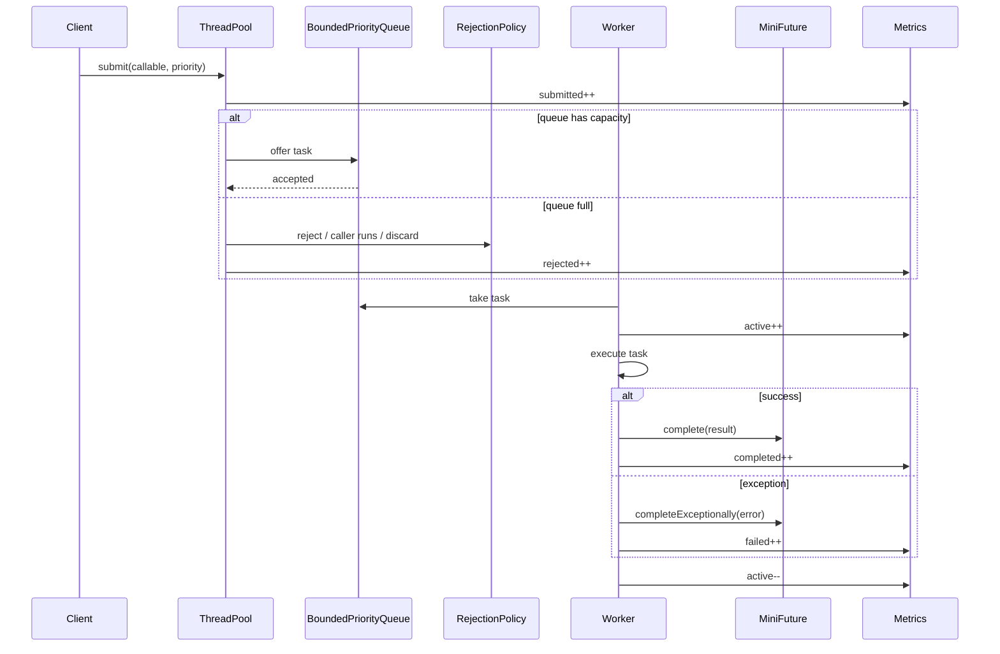
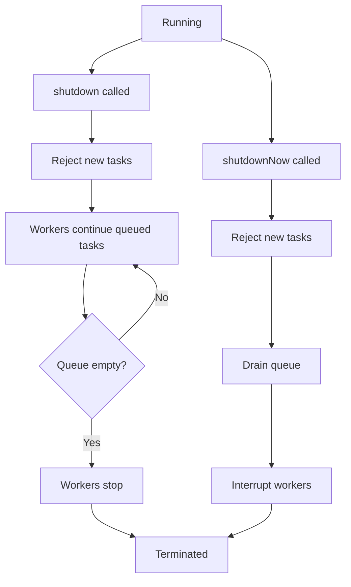

# 013_Production_ThreadPool.md

# MiniThreadPool — Phase 013: Production ThreadPool

This is the final MiniThreadPool phase.

In previous phases, we built each feature separately:

```text
single worker
blocking queue
fixed workers
bounded queue
rejection policies
future/callable
exception handling
graceful shutdown
shutdownNow
scheduled tasks
priority queue
metrics
```

In this phase, we combine the most important production features into one clean design.

---

# Clickable Index

- [1. Goal](#1-goal)
- [2. What Changes From Previous Phase](#2-what-changes-from-previous-phase)
- [3. Production Features Included](#3-production-features-included)
- [4. High Level Architecture](#4-high-level-architecture)
- [5. Task Lifecycle](#5-task-lifecycle)
- [6. Shutdown Lifecycle](#6-shutdown-lifecycle)
- [7. Design Steps Before Code](#7-design-steps-before-code)
- [8. File Structure](#8-file-structure)
- [9. Complete Java Code](#9-complete-java-code)
  - [9.1 TaskPriority.java](#91-taskpriorityjava)
  - [9.2 RejectionPolicy.java](#92-rejectionpolicyjava)
  - [9.3 ThreadPoolConfig.java](#93-threadpoolconfigjava)
  - [9.4 MiniFuture.java](#94-minifuturejava)
  - [9.5 MiniThreadPoolMetrics.java](#95-minithreadpoolmetricsjava)
  - [9.6 ProductionTask.java](#96-productiontaskjava)
  - [9.7 BoundedPriorityBlockingQueue.java](#97-boundedpriorityblockingqueuejava)
  - [9.8 ProductionMiniThreadPool.java](#98-productionminithreadpooljava)
  - [9.9 Phase13ProductionThreadPoolDriver.java](#99-phase13productionthreadpooldriverjava)
- [10. Step By Step Dry Run](#10-step-by-step-dry-run)
- [11. Output Example](#11-output-example)
- [12. DSA CP Connection](#12-dsa-cp-connection)
- [13. Real World Mapping](#13-real-world-mapping)
- [14. Interview Notes](#14-interview-notes)
- [15. Common Bugs](#15-common-bugs)
- [16. Final Summary](#16-final-summary)
- [17. Next Mini Project](#17-next-mini-project)

---

# 1. Goal

Build a production-style thread pool from scratch in Java.

This version supports:

```text
fixed worker count
bounded priority queue
future/callable result
exception handling
rejection policies
graceful shutdown
shutdownNow
metrics
thread naming
configuration object
```

---

# 2. What Changes From Previous Phase

Previous phase:

```text
Priority queue + metrics
```

Current phase:

```text
Production-ready thread pool skeleton
```

We now add:

```text
ThreadPoolConfig
queue capacity
rejection policy
graceful lifecycle
clean shutdownNow
pending task drain
thread naming
```

---

# 3. Production Features Included

| Feature | Meaning |
|---|---|
| Fixed workers | N worker threads execute tasks |
| Bounded queue | Queue has max capacity |
| Priority queue | HIGH tasks run before MEDIUM/LOW |
| FIFO within same priority | Sequence number preserves order |
| Future result | Caller can wait for result |
| Exception propagation | Future returns task failure |
| Rejection policy | Decide what happens when queue is full |
| Graceful shutdown | Stop new tasks, finish queued tasks |
| shutdownNow | Interrupt workers and drain queue |
| Metrics | Track submitted, completed, failed, rejected, active workers |
| Config object | Clean production-style constructor |

---

# 4. High Level Architecture



---

# 5. Task Lifecycle



---

# 6. Shutdown Lifecycle



---

# 7. Design Steps Before Code

## Step 1: Create Config Object

Instead of constructor with many parameters:

```java
new ThreadPool(4, 100, "worker", policy)
```

Use:

```java
ThreadPoolConfig config = new ThreadPoolConfig(...)
```

This is cleaner and closer to production design.

---

## Step 2: Create Bounded Priority Queue

Queue must support:

```text
capacity
priority ordering
blocking take
non-blocking offer
drain pending tasks
```

---

## Step 3: Create Production Task Wrapper

Each task stores:

```text
callable
future
priority
sequence number
createdAt
```

---

## Step 4: Add Rejection Policies

When queue is full:

```text
ABORT -> throw exception
CALLER_RUNS -> caller thread executes task
DISCARD -> silently drop task
DISCARD_OLDEST -> remove oldest/lowest selected task and add new one
```

For simplicity, this version implements:

```text
ABORT
CALLER_RUNS
DISCARD
```

---

## Step 5: Add Lifecycle State

Thread pool has state:

```text
running
shutdown
```

If shutdown is true:

```text
new tasks are rejected
workers finish remaining tasks
```

---

## Step 6: Add Metrics

Track:

```text
submitted
completed
failed
rejected
activeWorkers
queueSize
average execution time
```

---

# 8. File Structure

```text
mini-threadpool/
└── src/
    └── main/
        └── java/
            └── com/
                └── minithreadpool/
                    └── phase013/
                        ├── TaskPriority.java
                        ├── RejectionPolicy.java
                        ├── ThreadPoolConfig.java
                        ├── MiniFuture.java
                        ├── MiniThreadPoolMetrics.java
                        ├── ProductionTask.java
                        ├── BoundedPriorityBlockingQueue.java
                        ├── ProductionMiniThreadPool.java
                        └── Phase13ProductionThreadPoolDriver.java
```

---

# 9. Complete Java Code

---

## 9.1 TaskPriority.java

```java
package com.minithreadpool.phase013;

public enum TaskPriority {
    HIGH(1),
    MEDIUM(2),
    LOW(3);

    private final int order;

    TaskPriority(int order) {
        this.order = order;
    }

    public int getOrder() {
        return order;
    }
}
```

---

## 9.2 RejectionPolicy.java

```java
package com.minithreadpool.phase013;

public enum RejectionPolicy {
    ABORT,
    CALLER_RUNS,
    DISCARD
}
```

---

## 9.3 ThreadPoolConfig.java

```java
package com.minithreadpool.phase013;

public class ThreadPoolConfig {

    private final int workerCount;
    private final int queueCapacity;
    private final String threadNamePrefix;
    private final RejectionPolicy rejectionPolicy;

    public ThreadPoolConfig(
            int workerCount,
            int queueCapacity,
            String threadNamePrefix,
            RejectionPolicy rejectionPolicy
    ) {
        if (workerCount <= 0) {
            throw new IllegalArgumentException("workerCount must be greater than zero");
        }

        if (queueCapacity <= 0) {
            throw new IllegalArgumentException("queueCapacity must be greater than zero");
        }

        if (threadNamePrefix == null || threadNamePrefix.isBlank()) {
            throw new IllegalArgumentException("threadNamePrefix cannot be blank");
        }

        if (rejectionPolicy == null) {
            throw new IllegalArgumentException("rejectionPolicy cannot be null");
        }

        this.workerCount = workerCount;
        this.queueCapacity = queueCapacity;
        this.threadNamePrefix = threadNamePrefix;
        this.rejectionPolicy = rejectionPolicy;
    }

    public int getWorkerCount() {
        return workerCount;
    }

    public int getQueueCapacity() {
        return queueCapacity;
    }

    public String getThreadNamePrefix() {
        return threadNamePrefix;
    }

    public RejectionPolicy getRejectionPolicy() {
        return rejectionPolicy;
    }
}
```

---

## 9.4 MiniFuture.java

```java
package com.minithreadpool.phase013;

public class MiniFuture<T> {

    private T result;
    private Exception exception;
    private boolean completed;
    private boolean cancelled;

    public synchronized T get() {
        while (!completed && !cancelled) {
            try {
                wait();
            } catch (InterruptedException ex) {
                Thread.currentThread().interrupt();
                throw new RuntimeException("Thread interrupted while waiting for result", ex);
            }
        }

        if (cancelled) {
            throw new RuntimeException("Task was cancelled");
        }

        if (exception != null) {
            throw new RuntimeException("Task failed", exception);
        }

        return result;
    }

    public synchronized boolean isDone() {
        return completed;
    }

    public synchronized boolean isCancelled() {
        return cancelled;
    }

    public synchronized void complete(T result) {
        if (completed || cancelled) {
            return;
        }

        this.result = result;
        this.completed = true;
        notifyAll();
    }

    public synchronized void completeExceptionally(Exception exception) {
        if (completed || cancelled) {
            return;
        }

        this.exception = exception;
        this.completed = true;
        notifyAll();
    }

    public synchronized void cancel() {
        if (completed || cancelled) {
            return;
        }

        this.cancelled = true;
        notifyAll();
    }
}
```

---

## 9.5 MiniThreadPoolMetrics.java

```java
package com.minithreadpool.phase013;

import java.util.concurrent.atomic.AtomicInteger;
import java.util.concurrent.atomic.AtomicLong;

public class MiniThreadPoolMetrics {

    private final AtomicLong submittedTasks = new AtomicLong(0);
    private final AtomicLong completedTasks = new AtomicLong(0);
    private final AtomicLong failedTasks = new AtomicLong(0);
    private final AtomicLong rejectedTasks = new AtomicLong(0);
    private final AtomicInteger activeWorkers = new AtomicInteger(0);
    private final AtomicLong totalExecutionTimeNanos = new AtomicLong(0);

    public void incrementSubmittedTasks() {
        submittedTasks.incrementAndGet();
    }

    public void incrementCompletedTasks() {
        completedTasks.incrementAndGet();
    }

    public void incrementFailedTasks() {
        failedTasks.incrementAndGet();
    }

    public void incrementRejectedTasks() {
        rejectedTasks.incrementAndGet();
    }

    public void incrementActiveWorkers() {
        activeWorkers.incrementAndGet();
    }

    public void decrementActiveWorkers() {
        activeWorkers.decrementAndGet();
    }

    public void recordExecutionTime(long durationNanos) {
        totalExecutionTimeNanos.addAndGet(durationNanos);
    }

    public String snapshot(int queueSize, boolean shutdown) {
        long finishedTasks = completedTasks.get() + failedTasks.get();
        double avgMillis = finishedTasks == 0
                ? 0.0
                : (totalExecutionTimeNanos.get() / 1_000_000.0) / finishedTasks;

        return String.format("""
                ===== ProductionMiniThreadPool Metrics =====
                submittedTasks=%d
                completedTasks=%d
                failedTasks=%d
                rejectedTasks=%d
                activeWorkers=%d
                queueSize=%d
                shutdown=%s
                totalExecutionTimeMillis=%.2f
                averageExecutionTimeMillis=%.2f
                ============================================
                """,
                submittedTasks.get(),
                completedTasks.get(),
                failedTasks.get(),
                rejectedTasks.get(),
                activeWorkers.get(),
                queueSize,
                shutdown,
                totalExecutionTimeNanos.get() / 1_000_000.0,
                avgMillis
        );
    }
}
```

---

## 9.6 ProductionTask.java

```java
package com.minithreadpool.phase013;

import java.util.concurrent.Callable;
import java.util.concurrent.atomic.AtomicLong;

public class ProductionTask<T> implements Comparable<ProductionTask<?>> {

    private static final AtomicLong SEQUENCE_GENERATOR = new AtomicLong(0);

    private final Callable<T> callable;
    private final MiniFuture<T> future;
    private final TaskPriority priority;
    private final long sequenceNumber;
    private final long createdAtMillis;

    public ProductionTask(
            Callable<T> callable,
            MiniFuture<T> future,
            TaskPriority priority
    ) {
        this.callable = callable;
        this.future = future;
        this.priority = priority;
        this.sequenceNumber = SEQUENCE_GENERATOR.incrementAndGet();
        this.createdAtMillis = System.currentTimeMillis();
    }

    public void execute() throws Exception {
        T result = callable.call();
        future.complete(result);
    }

    public void fail(Exception ex) {
        future.completeExceptionally(ex);
    }

    public void cancel() {
        future.cancel();
    }

    public TaskPriority getPriority() {
        return priority;
    }

    public long getSequenceNumber() {
        return sequenceNumber;
    }

    public long getCreatedAtMillis() {
        return createdAtMillis;
    }

    @Override
    public int compareTo(ProductionTask<?> other) {
        int priorityCompare = Integer.compare(
                this.priority.getOrder(),
                other.priority.getOrder()
        );

        if (priorityCompare != 0) {
            return priorityCompare;
        }

        return Long.compare(this.sequenceNumber, other.sequenceNumber);
    }

    @Override
    public String toString() {
        return "ProductionTask{" +
                "priority=" + priority +
                ", sequenceNumber=" + sequenceNumber +
                ", createdAtMillis=" + createdAtMillis +
                '}';
    }
}
```

---

## 9.7 BoundedPriorityBlockingQueue.java

```java
package com.minithreadpool.phase013;

import java.util.ArrayList;
import java.util.List;
import java.util.PriorityQueue;

public class BoundedPriorityBlockingQueue {

    private final PriorityQueue<ProductionTask<?>> queue = new PriorityQueue<>();
    private final int capacity;

    public BoundedPriorityBlockingQueue(int capacity) {
        if (capacity <= 0) {
            throw new IllegalArgumentException("capacity must be greater than zero");
        }

        this.capacity = capacity;
    }

    public synchronized boolean offer(ProductionTask<?> task) {
        if (queue.size() >= capacity) {
            return false;
        }

        queue.offer(task);
        notifyAll();
        return true;
    }

    public synchronized ProductionTask<?> takeOrNullWhenShutdown(BooleanSupplier shutdownCondition) {
        while (queue.isEmpty() && !shutdownCondition.getAsBoolean()) {
            try {
                wait();
            } catch (InterruptedException ex) {
                Thread.currentThread().interrupt();
                return null;
            }
        }

        if (queue.isEmpty()) {
            return null;
        }

        return queue.poll();
    }

    public synchronized List<ProductionTask<?>> drainAll() {
        List<ProductionTask<?>> drained = new ArrayList<>();

        while (!queue.isEmpty()) {
            drained.add(queue.poll());
        }

        notifyAll();
        return drained;
    }

    public synchronized int size() {
        return queue.size();
    }

    public synchronized void signalAll() {
        notifyAll();
    }

    @FunctionalInterface
    public interface BooleanSupplier {
        boolean getAsBoolean();
    }
}
```

---

## 9.8 ProductionMiniThreadPool.java

```java
package com.minithreadpool.phase013;

import java.util.ArrayList;
import java.util.List;
import java.util.concurrent.Callable;

public class ProductionMiniThreadPool {

    private final ThreadPoolConfig config;
    private final BoundedPriorityBlockingQueue taskQueue;
    private final MiniThreadPoolMetrics metrics;
    private final List<Thread> workers;

    private volatile boolean shutdown;

    public ProductionMiniThreadPool(ThreadPoolConfig config) {
        if (config == null) {
            throw new IllegalArgumentException("config cannot be null");
        }

        this.config = config;
        this.taskQueue = new BoundedPriorityBlockingQueue(config.getQueueCapacity());
        this.metrics = new MiniThreadPoolMetrics();
        this.workers = new ArrayList<>();

        startWorkers();
    }

    private void startWorkers() {
        for (int i = 1; i <= config.getWorkerCount(); i++) {
            Thread worker = new Thread(new Worker(), config.getThreadNamePrefix() + "-" + i);
            workers.add(worker);
            worker.start();
        }
    }

    public <T> MiniFuture<T> submit(Callable<T> callable, TaskPriority priority) {
        if (callable == null) {
            throw new IllegalArgumentException("callable cannot be null");
        }

        if (priority == null) {
            throw new IllegalArgumentException("priority cannot be null");
        }

        if (shutdown) {
            throw new IllegalStateException("Thread pool is already shutdown");
        }

        metrics.incrementSubmittedTasks();

        MiniFuture<T> future = new MiniFuture<>();
        ProductionTask<T> task = new ProductionTask<>(callable, future, priority);

        boolean accepted = taskQueue.offer(task);

        if (!accepted) {
            handleRejectedTask(task);
        }

        return future;
    }

    public MiniFuture<String> submit(Runnable runnable, TaskPriority priority) {
        if (runnable == null) {
            throw new IllegalArgumentException("runnable cannot be null");
        }

        return submit(() -> {
            runnable.run();
            return "DONE";
        }, priority);
    }

    private void handleRejectedTask(ProductionTask<?> task) {
        metrics.incrementRejectedTasks();

        if (config.getRejectionPolicy() == RejectionPolicy.ABORT) {
            task.fail(new RuntimeException("Task rejected because queue is full"));
            throw new RuntimeException("Task rejected because queue is full");
        }

        if (config.getRejectionPolicy() == RejectionPolicy.CALLER_RUNS) {
            runTaskInCallerThread(task);
            return;
        }

        if (config.getRejectionPolicy() == RejectionPolicy.DISCARD) {
            task.cancel();
            System.out.println("[POOL] Task discarded: " + task);
        }
    }

    private void runTaskInCallerThread(ProductionTask<?> task) {
        long startTime = System.nanoTime();

        try {
            System.out.println("[POOL] CallerRuns executing: " + task);
            task.execute();
            metrics.incrementCompletedTasks();
        } catch (Exception ex) {
            task.fail(ex);
            metrics.incrementFailedTasks();
        } finally {
            metrics.recordExecutionTime(System.nanoTime() - startTime);
        }
    }

    public void shutdown() {
        shutdown = true;
        taskQueue.signalAll();
        System.out.println("[POOL] Graceful shutdown started");
    }

    public List<ProductionTask<?>> shutdownNow() {
        shutdown = true;

        List<ProductionTask<?>> pendingTasks = taskQueue.drainAll();

        for (ProductionTask<?> task : pendingTasks) {
            task.cancel();
        }

        for (Thread worker : workers) {
            worker.interrupt();
        }

        taskQueue.signalAll();

        System.out.println("[POOL] shutdownNow started, drainedTasks=" + pendingTasks.size());

        return pendingTasks;
    }

    public void awaitTermination() {
        for (Thread worker : workers) {
            try {
                worker.join();
            } catch (InterruptedException ex) {
                Thread.currentThread().interrupt();
                throw new RuntimeException("Interrupted while waiting for workers", ex);
            }
        }
    }

    public void printMetrics() {
        System.out.println(metrics.snapshot(taskQueue.size(), shutdown));
    }

    private class Worker implements Runnable {

        @Override
        public void run() {
            while (true) {
                ProductionTask<?> task = taskQueue.takeOrNullWhenShutdown(() -> shutdown);

                if (task == null) {
                    break;
                }

                long startTime = System.nanoTime();

                try {
                    metrics.incrementActiveWorkers();

                    System.out.println("[" + Thread.currentThread().getName() + "] executing " + task);

                    task.execute();

                    metrics.incrementCompletedTasks();

                } catch (Exception ex) {
                    task.fail(ex);
                    metrics.incrementFailedTasks();

                    System.out.println("[" + Thread.currentThread().getName() + "] task failed: " + ex.getMessage());

                } finally {
                    metrics.recordExecutionTime(System.nanoTime() - startTime);
                    metrics.decrementActiveWorkers();
                }
            }

            System.out.println("[" + Thread.currentThread().getName() + "] stopped");
        }
    }
}
```

---

## 9.9 Phase13ProductionThreadPoolDriver.java

```java
package com.minithreadpool.phase013;

import java.util.List;

public class Phase13ProductionThreadPoolDriver {

    public static void main(String[] args) {
        ThreadPoolConfig config = new ThreadPoolConfig(
                2,
                3,
                "production-worker",
                RejectionPolicy.CALLER_RUNS
        );

        ProductionMiniThreadPool pool = new ProductionMiniThreadPool(config);

        MiniFuture<String> high1 = pool.submit(() -> {
            sleep(300);
            return "HIGH-1 completed";
        }, TaskPriority.HIGH);

        MiniFuture<String> low1 = pool.submit(() -> {
            sleep(500);
            return "LOW-1 completed";
        }, TaskPriority.LOW);

        MiniFuture<String> high2 = pool.submit(() -> {
            sleep(200);
            return "HIGH-2 completed";
        }, TaskPriority.HIGH);

        MiniFuture<String> failed = pool.submit(() -> {
            sleep(100);
            throw new RuntimeException("Simulated production failure");
        }, TaskPriority.MEDIUM);

        MiniFuture<String> overflow = pool.submit(() -> {
            sleep(100);
            return "Overflow task handled by caller if queue full";
        }, TaskPriority.HIGH);

        pool.printMetrics();

        System.out.println("high1 = " + high1.get());
        System.out.println("high2 = " + high2.get());

        try {
            System.out.println("failed = " + failed.get());
        } catch (RuntimeException ex) {
            System.out.println("failed future observed: " + ex.getMessage());
        }

        System.out.println("low1 = " + low1.get());
        System.out.println("overflow = " + overflow.get());

        pool.shutdown();
        pool.awaitTermination();

        pool.printMetrics();

        demoShutdownNow();
    }

    private static void demoShutdownNow() {
        ThreadPoolConfig config = new ThreadPoolConfig(
                1,
                5,
                "shutdown-now-worker",
                RejectionPolicy.ABORT
        );

        ProductionMiniThreadPool pool = new ProductionMiniThreadPool(config);

        pool.submit(() -> {
            sleep(2_000);
            return "long task completed";
        }, TaskPriority.LOW);

        pool.submit(() -> {
            sleep(500);
            return "pending task 1";
        }, TaskPriority.HIGH);

        pool.submit(() -> {
            sleep(500);
            return "pending task 2";
        }, TaskPriority.HIGH);

        List<ProductionTask<?>> drained = pool.shutdownNow();

        System.out.println("Drained tasks from shutdownNow = " + drained.size());

        pool.printMetrics();
    }

    private static void sleep(long millis) {
        try {
            Thread.sleep(millis);
        } catch (InterruptedException ex) {
            Thread.currentThread().interrupt();
        }
    }
}
```

---

# 10. Step By Step Dry Run

Config:

```text
workerCount = 2
queueCapacity = 3
rejectionPolicy = CALLER_RUNS
```

Submit tasks:

```text
HIGH-1
LOW-1
HIGH-2
MEDIUM failed
HIGH overflow
```

Possible flow:

```text
1. Worker-1 starts HIGH-1
2. Worker-2 starts HIGH-2
3. LOW-1 waits in queue
4. MEDIUM failed waits in queue
5. HIGH overflow may enter queue or run in caller if queue full
```

Priority means:

```text
HIGH tasks are preferred before MEDIUM and LOW
```

But already running tasks are not interrupted.

When task throws exception:

```text
future completes exceptionally
failedTasks increments
worker continues with next task
```

When graceful shutdown is called:

```text
new tasks rejected
existing queued tasks finish
workers exit when queue becomes empty
```

When shutdownNow is called:

```text
queued tasks are drained
drained futures are cancelled
workers are interrupted
```

---

# 11. Output Example

Output varies because of thread scheduling.

```text
[production-worker-1] executing ProductionTask{priority=HIGH, sequenceNumber=1}
[production-worker-2] executing ProductionTask{priority=HIGH, sequenceNumber=3}

===== ProductionMiniThreadPool Metrics =====
submittedTasks=5
completedTasks=0
failedTasks=0
rejectedTasks=0
activeWorkers=2
queueSize=3
shutdown=false
totalExecutionTimeMillis=0.00
averageExecutionTimeMillis=0.00
============================================

high1 = HIGH-1 completed
high2 = HIGH-2 completed
failed future observed: Task failed
low1 = LOW-1 completed
overflow = Overflow task handled by caller if queue full

[POOL] Graceful shutdown started
[production-worker-1] stopped
[production-worker-2] stopped

===== ProductionMiniThreadPool Metrics =====
submittedTasks=5
completedTasks=4
failedTasks=1
rejectedTasks=0
activeWorkers=0
queueSize=0
shutdown=true
totalExecutionTimeMillis=1200.00
averageExecutionTimeMillis=240.00
============================================
```

---

# 12. DSA CP Connection

This final version combines many DSA ideas:

| ThreadPool Concept | DSA/CP Concept |
|---|---|
| Task queue | Queue |
| Priority execution | Heap / PriorityQueue |
| FIFO same priority | Stable ordering |
| Metrics counters | Frequency counting |
| Execution time sum | Prefix/running sum |
| Shutdown state | State machine |
| Rejection policy | Strategy pattern |
| Worker lifecycle | Event simulation |

Core complexity:

```text
submit = O(log N)
take = O(log N)
metrics update = O(1)
shutdownNow drain = O(N log N) or O(N)
```

Where:

```text
N = queued tasks
```

---

# 13. Real World Mapping

## Java ExecutorService

Your mini version maps to:

```text
ThreadPoolExecutor
Future
Callable
RejectedExecutionHandler
BlockingQueue
shutdown()
shutdownNow()
```

## Kafka

Kafka uses similar ideas for:

```text
background IO threads
network request handler threads
replica fetcher threads
consumer processing workers
```

## Spring Boot

Spring apps use thread pools for:

```text
web request handling
@Async methods
scheduled jobs
background workers
message consumers
```

## Payment System

Thread pools run:

```text
payment confirmation
retry workers
webhook delivery
fraud checks
ledger update jobs
```

## Video System

Thread pools run:

```text
thumbnail generation
transcoding
metadata extraction
subtitle processing
cleanup workers
```

---

# 14. Interview Notes

Strong explanation:

```text
A production thread pool has worker threads pulling tasks from a blocking queue.
The queue should often be bounded to prevent memory explosion.
When the queue is full, a rejection policy applies.
Tasks can return results through Future.
Worker exceptions should not kill the pool.
Metrics are required to observe saturation and failures.
Shutdown has two modes: graceful and immediate.
```

Common follow-up questions:

## Why bounded queue?

```text
Unbounded queue can grow until the JVM runs out of memory.
Bounded queue creates backpressure.
```

## Why rejection policy?

```text
When producers submit faster than workers consume, the pool needs a defined overload behavior.
```

## Why CallerRuns?

```text
CallerRuns slows down the producer by making it execute the task itself.
This creates natural backpressure.
```

## Why priority queue?

```text
Important work can be executed before less important work.
But it can cause starvation without aging.
```

## Why metrics?

```text
Without metrics, we cannot detect saturation, backlog, or failure rate.
```

---

# 15. Common Bugs

## Bug 1: Worker exits too early on graceful shutdown

Wrong:

```java
while (!shutdown) {
    task = queue.take();
    task.execute();
}
```

This stops immediately and leaves queued tasks unprocessed.

Correct:

```java
while (true) {
    task = queue.takeOrNullWhenShutdown(() -> shutdown);

    if (task == null) {
        break;
    }

    task.execute();
}
```

---

## Bug 2: Not waking workers during shutdown

If workers are waiting on empty queue and shutdown is called, they need wakeup.

Correct:

```java
taskQueue.signalAll();
```

---

## Bug 3: Queue full but future never completed

If task is rejected, the future must be completed exceptionally or cancelled.

Correct:

```java
task.fail(new RuntimeException("Task rejected"));
```

or:

```java
task.cancel();
```

---

## Bug 4: Task exception kills worker

Wrong:

```java
task.execute();
```

without catch.

Correct:

```java
try {
    task.execute();
} catch (Exception ex) {
    task.fail(ex);
}
```

---

## Bug 5: Active workers metric becomes negative

Only decrement active workers if increment happened.

In this version, increment/decrement are around task execution.

---

# 16. Final Summary

You now built a MiniThreadPool with:

```text
workers
blocking queue
bounded queue
backpressure
priority scheduling
future/callable
exception propagation
metrics
shutdown
shutdownNow
rejection policy
thread naming
configuration
```

This is not just a toy.

This teaches the foundation behind:

```text
ExecutorService
Kafka worker pools
Spring async execution
Schedulers
Message consumers
Batch processors
Payment workers
Video processing pipelines
```

---

# 17. Next Mini Project

Recommended next mini-project:

```text
MiniRateLimiter
```

Why?

Because now you understand:

```text
workers
queues
backpressure
concurrency
metrics
```

Rate limiter builds on this with:

```text
fixed window
sliding window log
sliding window counter
token bucket
leaky bucket
Redis-based distributed limiter
Lua script atomicity
API gateway integration
```

After MiniThreadPool, MiniRateLimiter will feel much easier.
