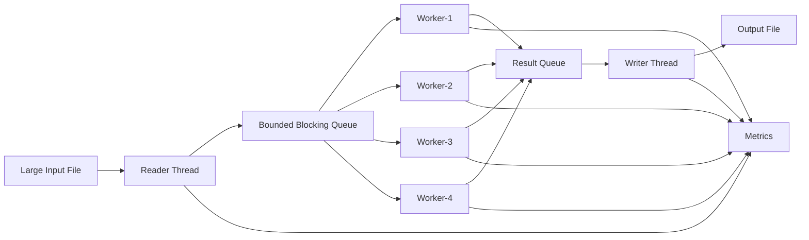
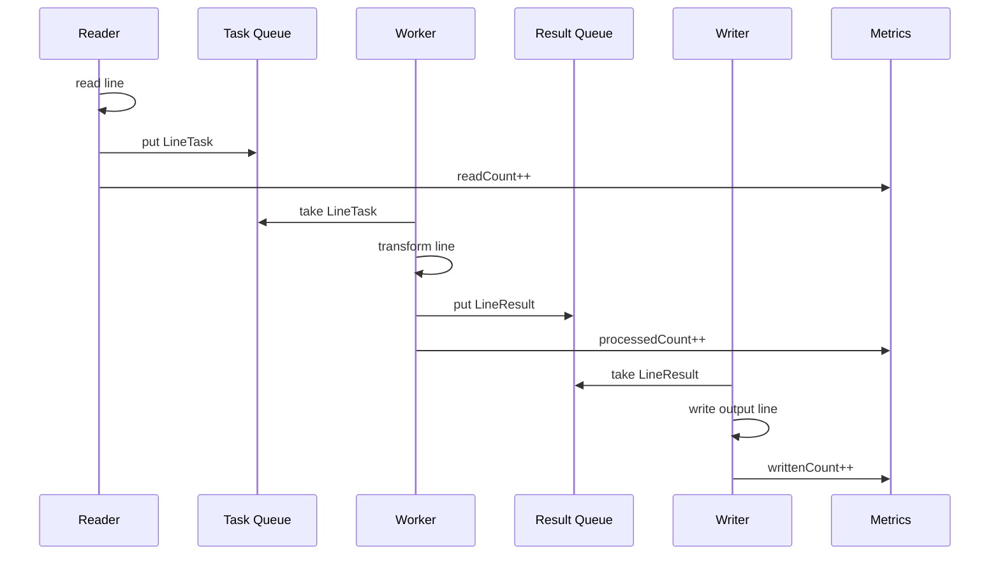
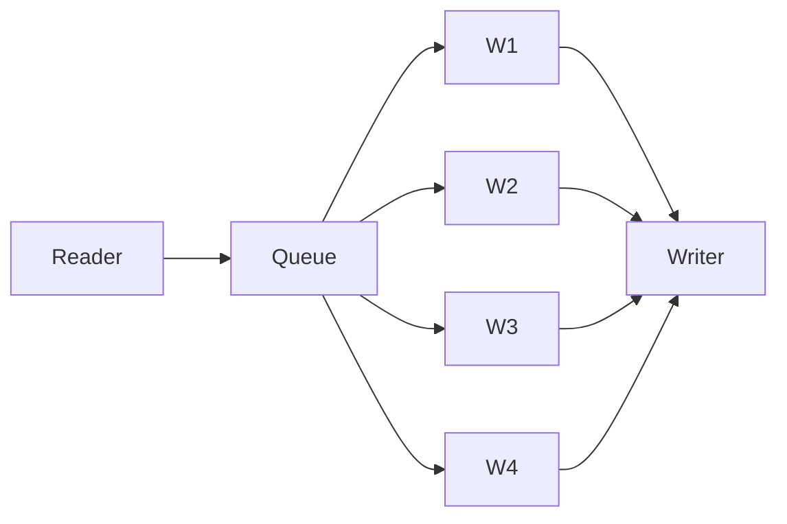

# MiniFileTransformer Project — Large File Line Processor

# Goal

Build a Java project that:

```text
reads a large input file
transforms each line
processes lines using MiniThreadPool concepts
writes transformed lines to an output file
handles backpressure
handles errors
prints metrics
shuts down cleanly
```

This project connects directly to what you learned from MiniThreadPool.

---

# Clickable Index

- [1. Real World Use Case](#1-real-world-use-case)
- [2. What You Will Build](#2-what-you-will-build)
- [3. Concepts Reused From MiniThreadPool](#3-concepts-reused-from-minithreadpool)
- [4. Architecture](#4-architecture)
- [5. Processing Flow](#5-processing-flow)
- [6. Phase Plan](#6-phase-plan)
- [7. Final Project Structure](#7-final-project-structure)
- [8. Phase 001 — Single Thread File Transformer](#8-phase-001--single-thread-file-transformer)
- [9. Phase 002 — Producer Consumer With Blocking Queue](#9-phase-002--producer-consumer-with-blocking-queue)
- [10. Phase 003 — Fixed Worker Pool](#10-phase-003--fixed-worker-pool)
- [11. Phase 004 — Bounded Queue Backpressure](#11-phase-004--bounded-queue-backpressure)
- [12. Phase 005 — Preserve Line Order](#12-phase-005--preserve-line-order)
- [13. Phase 006 — Error Handling](#13-phase-006--error-handling)
- [14. Phase 007 — Metrics](#14-phase-007--metrics)
- [15. Complete Java Code](#15-complete-java-code)
- [16. How To Run](#16-how-to-run)
- [17. Sample Input](#17-sample-input)
- [18. Sample Output](#18-sample-output)
- [19. Interview Explanation](#19-interview-explanation)
- [20. Next Upgrades](#20-next-upgrades)

---

# 1. Real World Use Case

This type of project appears in many systems:

```text
ETL pipeline
log file processing
CSV transformation
payment reconciliation
bank statement processing
data migration
large export/import jobs
Kafka batch replay
analytics preprocessing
```

Example:

```text
input file:
1,john,100
2,sara,200
3,alex,300

transform:
uppercase name and add processed timestamp

output file:
1,JOHN,100,PROCESSED
2,SARA,200,PROCESSED
3,ALEX,300,PROCESSED
```

---

# 2. What You Will Build

Final system:

```text
Reader Thread
    reads large file line by line

Task Queue
    stores line transformation jobs

Worker Threads
    transform lines concurrently

Result Queue / Ordered Writer
    writes transformed lines to output file

Metrics
    tracks processed, failed, queue size, throughput

Shutdown
    closes everything safely
```

---

# 3. Concepts Reused From MiniThreadPool

| MiniThreadPool Concept | File Transformer Usage |
|---|---|
| Worker threads | Transform lines in parallel |
| Blocking queue | Reader waits when queue is full |
| Bounded queue | Prevent memory explosion |
| Backpressure | Slow file reading when workers are busy |
| Future/result | Store transformed output |
| Exception handling | Bad lines should not kill workers |
| Graceful shutdown | Finish all lines before closing file |
| Metrics | Show processed count, failed count, speed |
| Priority queue | Optional: priority lines first |
| Rejection policy | Optional: reject or caller-runs when overloaded |

---

# 4. Architecture



---

# 5. Processing Flow



---

# 6. Phase Plan

## Phase 001

```text
Single-threaded file reader + transformer + writer
```

Purpose:

```text
Understand baseline logic first.
```

---

## Phase 002

```text
Reader thread + blocking task queue + one worker
```

Purpose:

```text
Separate reading from processing.
```

---

## Phase 003

```text
Fixed worker pool
```

Purpose:

```text
Process multiple lines concurrently.
```

---

## Phase 004

```text
Bounded queue
```

Purpose:

```text
Avoid loading entire file into memory.
```

---

## Phase 005

```text
Preserve line order
```

Purpose:

```text
Concurrent workers finish out of order, but output can still be ordered.
```

---

## Phase 006

```text
Error handling
```

Purpose:

```text
Bad line should go to error file, not crash the process.
```

---

## Phase 007

```text
Metrics and monitoring
```

Purpose:

```text
Know throughput, failures, queue size.
```

---

# 7. Final Project Structure

```text
mini-file-transformer/
└── src/
    └── main/
        └── java/
            └── com/
                └── minifiletransformer/
                    ├── App.java
                    ├── config/
                    │   └── TransformerConfig.java
                    ├── model/
                    │   ├── LineTask.java
                    │   └── LineResult.java
                    ├── queue/
                    │   └── MiniBlockingQueue.java
                    ├── transform/
                    │   ├── LineTransformer.java
                    │   └── UppercaseCsvTransformer.java
                    ├── metrics/
                    │   └── TransformerMetrics.java
                    └── pipeline/
                        └── FileTransformationPipeline.java
```

---

# 8. Phase 001 — Single Thread File Transformer

Start simple.

```text
read line
transform line
write line
```

No threads yet.

```java
try (
        BufferedReader reader = Files.newBufferedReader(inputPath);
        BufferedWriter writer = Files.newBufferedWriter(outputPath)
) {
    String line;

    while ((line = reader.readLine()) != null) {
        String transformed = transformer.transform(line);
        writer.write(transformed);
        writer.newLine();
    }
}
```

Limitation:

```text
Only one line is processed at a time.
If transformation is slow, reading and writing also wait.
```

---

# 9. Phase 002 — Producer Consumer With Blocking Queue

Split into:

```text
Reader = producer
Worker = consumer
```


Reader reads lines and puts tasks into queue.

Worker takes tasks and transforms them.

---

# 10. Phase 003 — Fixed Worker Pool

Now add multiple workers.



Benefit:

```text
If transformation is CPU-heavy, multiple cores can work.
If transformation calls API/DB, waiting time is hidden.
```

---

# 11. Phase 004 — Bounded Queue Backpressure

For large files, never do this:

```text
read all lines into memory
```

Bad:

```java
List<String> lines = Files.readAllLines(inputPath);
```

For huge files this can cause:

```text
OutOfMemoryError
```

Correct:

```text
read line by line
bounded queue capacity = 1000
reader blocks when queue is full
```

This is backpressure.

---

# 12. Phase 005 — Preserve Line Order

Problem:

```text
Line 10 may finish before line 2.
```

If output must preserve input order, store sequence number:

```text
LineTask:
lineNumber
lineContent
```

Result:

```text
LineResult:
lineNumber
transformedLine
```

Writer keeps a buffer:

```text
expectedLineNumber = 1
Map<Long, LineResult> pendingResults
```

Writer writes only when expected line is available.

---

# 13. Phase 006 — Error Handling

Bad line example:

```text
invalid csv row
```

Worker should not die.

Instead:

```text
catch exception
create failed LineResult
writer writes to error file
metrics.failed++
```

---

# 14. Phase 007 — Metrics

Track:

```text
linesRead
linesProcessed
linesWritten
linesFailed
activeWorkers
taskQueueSize
resultQueueSize
processingTime
```

---

# 15. Complete Java Code

---

## 15.1 TransformerConfig.java

```java
package com.minifiletransformer.config;

public class TransformerConfig {

    private final int workerCount;
    private final int taskQueueCapacity;
    private final int resultQueueCapacity;

    public TransformerConfig(int workerCount, int taskQueueCapacity, int resultQueueCapacity) {
        if (workerCount <= 0) {
            throw new IllegalArgumentException("workerCount must be greater than zero");
        }

        if (taskQueueCapacity <= 0) {
            throw new IllegalArgumentException("taskQueueCapacity must be greater than zero");
        }

        if (resultQueueCapacity <= 0) {
            throw new IllegalArgumentException("resultQueueCapacity must be greater than zero");
        }

        this.workerCount = workerCount;
        this.taskQueueCapacity = taskQueueCapacity;
        this.resultQueueCapacity = resultQueueCapacity;
    }

    public int getWorkerCount() {
        return workerCount;
    }

    public int getTaskQueueCapacity() {
        return taskQueueCapacity;
    }

    public int getResultQueueCapacity() {
        return resultQueueCapacity;
    }
}
```

---

## 15.2 LineTask.java

```java
package com.minifiletransformer.model;

public class LineTask {

    private final long lineNumber;
    private final String line;
    private final boolean poisonPill;

    private LineTask(long lineNumber, String line, boolean poisonPill) {
        this.lineNumber = lineNumber;
        this.line = line;
        this.poisonPill = poisonPill;
    }

    public static LineTask normal(long lineNumber, String line) {
        return new LineTask(lineNumber, line, false);
    }

    public static LineTask poisonPill() {
        return new LineTask(-1, "", true);
    }

    public long getLineNumber() {
        return lineNumber;
    }

    public String getLine() {
        return line;
    }

    public boolean isPoisonPill() {
        return poisonPill;
    }
}
```

---

## 15.3 LineResult.java

```java
package com.minifiletransformer.model;

public class LineResult {

    private final long lineNumber;
    private final String outputLine;
    private final String errorMessage;
    private final boolean poisonPill;

    private LineResult(long lineNumber, String outputLine, String errorMessage, boolean poisonPill) {
        this.lineNumber = lineNumber;
        this.outputLine = outputLine;
        this.errorMessage = errorMessage;
        this.poisonPill = poisonPill;
    }

    public static LineResult success(long lineNumber, String outputLine) {
        return new LineResult(lineNumber, outputLine, null, false);
    }

    public static LineResult failure(long lineNumber, String errorMessage) {
        return new LineResult(lineNumber, null, errorMessage, false);
    }

    public static LineResult poisonPill() {
        return new LineResult(-1, null, null, true);
    }

    public long getLineNumber() {
        return lineNumber;
    }

    public String getOutputLine() {
        return outputLine;
    }

    public String getErrorMessage() {
        return errorMessage;
    }

    public boolean isSuccess() {
        return errorMessage == null && !poisonPill;
    }

    public boolean isPoisonPill() {
        return poisonPill;
    }
}
```

---

## 15.4 MiniBlockingQueue.java

```java
package com.minifiletransformer.queue;

import java.util.LinkedList;
import java.util.Queue;

public class MiniBlockingQueue<T> {

    private final Queue<T> queue = new LinkedList<>();
    private final int capacity;

    public MiniBlockingQueue(int capacity) {
        if (capacity <= 0) {
            throw new IllegalArgumentException("capacity must be greater than zero");
        }

        this.capacity = capacity;
    }

    public synchronized void put(T item) {
        while (queue.size() == capacity) {
            try {
                wait();
            } catch (InterruptedException ex) {
                Thread.currentThread().interrupt();
                throw new RuntimeException("Interrupted while queue is full", ex);
            }
        }

        queue.offer(item);
        notifyAll();
    }

    public synchronized T take() {
        while (queue.isEmpty()) {
            try {
                wait();
            } catch (InterruptedException ex) {
                Thread.currentThread().interrupt();
                throw new RuntimeException("Interrupted while queue is empty", ex);
            }
        }

        T item = queue.poll();
        notifyAll();
        return item;
    }

    public synchronized int size() {
        return queue.size();
    }
}
```

---

## 15.5 LineTransformer.java

```java
package com.minifiletransformer.transform;

public interface LineTransformer {

    String transform(String line);
}
```

---

## 15.6 UppercaseCsvTransformer.java

```java
package com.minifiletransformer.transform;

public class UppercaseCsvTransformer implements LineTransformer {

    @Override
    public String transform(String line) {
        if (line == null || line.isBlank()) {
            throw new IllegalArgumentException("Blank line is not allowed");
        }

        String[] parts = line.split(",");

        if (parts.length < 3) {
            throw new IllegalArgumentException("Expected at least 3 CSV columns");
        }

        String id = parts[0].trim();
        String name = parts[1].trim().toUpperCase();
        String amount = parts[2].trim();

        return id + "," + name + "," + amount + ",PROCESSED";
    }
}
```

---

## 15.7 TransformerMetrics.java

```java
package com.minifiletransformer.metrics;

import java.util.concurrent.atomic.AtomicInteger;
import java.util.concurrent.atomic.AtomicLong;

public class TransformerMetrics {

    private final AtomicLong linesRead = new AtomicLong(0);
    private final AtomicLong linesProcessed = new AtomicLong(0);
    private final AtomicLong linesWritten = new AtomicLong(0);
    private final AtomicLong linesFailed = new AtomicLong(0);
    private final AtomicInteger activeWorkers = new AtomicInteger(0);
    private final AtomicLong totalProcessingTimeNanos = new AtomicLong(0);

    public void incrementLinesRead() {
        linesRead.incrementAndGet();
    }

    public void incrementLinesProcessed() {
        linesProcessed.incrementAndGet();
    }

    public void incrementLinesWritten() {
        linesWritten.incrementAndGet();
    }

    public void incrementLinesFailed() {
        linesFailed.incrementAndGet();
    }

    public void incrementActiveWorkers() {
        activeWorkers.incrementAndGet();
    }

    public void decrementActiveWorkers() {
        activeWorkers.decrementAndGet();
    }

    public void recordProcessingTime(long durationNanos) {
        totalProcessingTimeNanos.addAndGet(durationNanos);
    }

    public String snapshot(int taskQueueSize, int resultQueueSize) {
        long completed = linesProcessed.get() + linesFailed.get();

        double avgMillis = completed == 0
                ? 0.0
                : (totalProcessingTimeNanos.get() / 1_000_000.0) / completed;

        return String.format("""
                ===== File Transformer Metrics =====
                linesRead=%d
                linesProcessed=%d
                linesWritten=%d
                linesFailed=%d
                activeWorkers=%d
                taskQueueSize=%d
                resultQueueSize=%d
                averageProcessingMillis=%.2f
                ===================================
                """,
                linesRead.get(),
                linesProcessed.get(),
                linesWritten.get(),
                linesFailed.get(),
                activeWorkers.get(),
                taskQueueSize,
                resultQueueSize,
                avgMillis
        );
    }
}
```

---

## 15.8 FileTransformationPipeline.java

```java
package com.minifiletransformer.pipeline;

import com.minifiletransformer.config.TransformerConfig;
import com.minifiletransformer.metrics.TransformerMetrics;
import com.minifiletransformer.model.LineResult;
import com.minifiletransformer.model.LineTask;
import com.minifiletransformer.queue.MiniBlockingQueue;
import com.minifiletransformer.transform.LineTransformer;

import java.io.BufferedReader;
import java.io.BufferedWriter;
import java.io.IOException;
import java.nio.file.Files;
import java.nio.file.Path;
import java.util.HashMap;
import java.util.Map;

public class FileTransformationPipeline {

    private final TransformerConfig config;
    private final LineTransformer transformer;

    private final MiniBlockingQueue<LineTask> taskQueue;
    private final MiniBlockingQueue<LineResult> resultQueue;
    private final TransformerMetrics metrics;

    public FileTransformationPipeline(TransformerConfig config, LineTransformer transformer) {
        this.config = config;
        this.transformer = transformer;
        this.taskQueue = new MiniBlockingQueue<>(config.getTaskQueueCapacity());
        this.resultQueue = new MiniBlockingQueue<>(config.getResultQueueCapacity());
        this.metrics = new TransformerMetrics();
    }

    public void process(Path inputPath, Path outputPath, Path errorPath) {
        Thread readerThread = new Thread(
                () -> readFile(inputPath),
                "file-reader"
        );

        Thread[] workers = new Thread[config.getWorkerCount()];

        for (int i = 0; i < workers.length; i++) {
            workers[i] = new Thread(
                    this::runWorker,
                    "line-worker-" + (i + 1)
            );
        }

        Thread writerThread = new Thread(
                () -> writeFile(outputPath, errorPath),
                "file-writer"
        );

        writerThread.start();

        for (Thread worker : workers) {
            worker.start();
        }

        readerThread.start();

        join(readerThread);

        for (int i = 0; i < config.getWorkerCount(); i++) {
            taskQueue.put(LineTask.poisonPill());
        }

        for (Thread worker : workers) {
            join(worker);
        }

        resultQueue.put(LineResult.poisonPill());

        join(writerThread);

        printMetrics();
    }

    private void readFile(Path inputPath) {
        try (BufferedReader reader = Files.newBufferedReader(inputPath)) {
            String line;
            long lineNumber = 1;

            while ((line = reader.readLine()) != null) {
                taskQueue.put(LineTask.normal(lineNumber, line));
                metrics.incrementLinesRead();
                lineNumber++;
            }

        } catch (IOException ex) {
            throw new RuntimeException("Failed to read input file", ex);
        }
    }

    private void runWorker() {
        while (true) {
            LineTask task = taskQueue.take();

            if (task.isPoisonPill()) {
                break;
            }

            long startTime = System.nanoTime();
            metrics.incrementActiveWorkers();

            try {
                String outputLine = transformer.transform(task.getLine());

                resultQueue.put(LineResult.success(
                        task.getLineNumber(),
                        outputLine
                ));

                metrics.incrementLinesProcessed();

            } catch (Exception ex) {
                resultQueue.put(LineResult.failure(
                        task.getLineNumber(),
                        ex.getMessage()
                ));

                metrics.incrementLinesFailed();

            } finally {
                metrics.recordProcessingTime(System.nanoTime() - startTime);
                metrics.decrementActiveWorkers();
            }
        }
    }

    private void writeFile(Path outputPath, Path errorPath) {
        try (
                BufferedWriter outputWriter = Files.newBufferedWriter(outputPath);
                BufferedWriter errorWriter = Files.newBufferedWriter(errorPath)
        ) {
            long expectedLineNumber = 1;
            Map<Long, LineResult> pending = new HashMap<>();

            while (true) {
                LineResult result = resultQueue.take();

                if (result.isPoisonPill()) {
                    break;
                }

                pending.put(result.getLineNumber(), result);

                while (pending.containsKey(expectedLineNumber)) {
                    LineResult next = pending.remove(expectedLineNumber);

                    if (next.isSuccess()) {
                        outputWriter.write(next.getOutputLine());
                        outputWriter.newLine();
                        metrics.incrementLinesWritten();
                    } else {
                        errorWriter.write("line=" + next.getLineNumber() +
                                ", error=" + next.getErrorMessage());
                        errorWriter.newLine();
                    }

                    expectedLineNumber++;
                }
            }

            /*
             * Flush remaining results.
             * Normally pending should be empty here if every line produced a result.
             */
            while (pending.containsKey(expectedLineNumber)) {
                LineResult next = pending.remove(expectedLineNumber);

                if (next.isSuccess()) {
                    outputWriter.write(next.getOutputLine());
                    outputWriter.newLine();
                    metrics.incrementLinesWritten();
                } else {
                    errorWriter.write("line=" + next.getLineNumber() +
                            ", error=" + next.getErrorMessage());
                    errorWriter.newLine();
                }

                expectedLineNumber++;
            }

        } catch (IOException ex) {
            throw new RuntimeException("Failed to write output file", ex);
        }
    }

    public void printMetrics() {
        System.out.println(metrics.snapshot(
                taskQueue.size(),
                resultQueue.size()
        ));
    }

    private void join(Thread thread) {
        try {
            thread.join();
        } catch (InterruptedException ex) {
            Thread.currentThread().interrupt();
            throw new RuntimeException("Interrupted while waiting for thread", ex);
        }
    }
}
```

---

## 15.9 App.java

```java
package com.minifiletransformer;

import com.minifiletransformer.config.TransformerConfig;
import com.minifiletransformer.pipeline.FileTransformationPipeline;
import com.minifiletransformer.transform.UppercaseCsvTransformer;

import java.nio.file.Path;

public class App {

    public static void main(String[] args) {
        Path inputPath = Path.of("data/input.csv");
        Path outputPath = Path.of("data/output.csv");
        Path errorPath = Path.of("data/errors.txt");

        TransformerConfig config = new TransformerConfig(
                4,
                1000,
                1000
        );

        FileTransformationPipeline pipeline = new FileTransformationPipeline(
                config,
                new UppercaseCsvTransformer()
        );

        pipeline.process(inputPath, outputPath, errorPath);
    }
}
```

---

# 16. How To Run

Create this folder:

```text
data/
```

Create input file:

```text
data/input.csv
```

Run:

```bash
javac -d out $(find src/main/java -name "*.java")
java -cp out com.minifiletransformer.App
```

On Windows PowerShell:

```powershell
Get-ChildItem -Recurse src/main/java -Filter *.java | ForEach-Object { $_.FullName } > sources.txt
javac -d out @sources.txt
java -cp out com.minifiletransformer.App
```

Output files:

```text
data/output.csv
data/errors.txt
```

---

# 17. Sample Input

```csv
1,john,100
2,sara,200
bad-line
3,alex,300
4,maria,400
```

---

# 18. Sample Output

## data/output.csv

```csv
1,JOHN,100,PROCESSED
2,SARA,200,PROCESSED
3,ALEX,300,PROCESSED
4,MARIA,400,PROCESSED
```

## data/errors.txt

```text
line=3, error=Expected at least 3 CSV columns
```

---

# 19. Interview Explanation

You can explain this project like this:

```text
I built a concurrent file transformation pipeline.
The reader reads a large file line by line instead of loading it fully into memory.
Each line becomes a task and is pushed into a bounded blocking queue.
Multiple worker threads consume tasks and transform lines concurrently.
A writer thread writes transformed results to an output file.
To preserve input order, every line has a sequence number and the writer buffers out-of-order results until the next expected line arrives.
Bad lines are written to an error file.
The bounded queue provides backpressure so the reader cannot overwhelm memory.
Metrics show processed lines, failed lines, active workers, and queue sizes.
The pipeline uses poison pills for graceful shutdown.
```

---

# 20. Next Upgrades

Add these one by one:

```text
1. Progress logging every 10,000 lines
2. Config from command line args
3. CSV parser instead of split(",")
4. Batch writing for faster IO
5. Retry failed lines
6. Dead letter file
7. Checkpointing/resume from line number
8. GZIP input/output support
9. Priority tasks
10. Spring Batch version
11. Kafka input instead of file input
12. S3 input/output
13. Metrics export to Prometheus
14. Dockerfile
15. k6/JMH benchmark
```

Best next file:

```text
001_Single_Thread_File_Transformer.md
```

Then build phase by phase like MiniKafka and MiniThreadPool.
