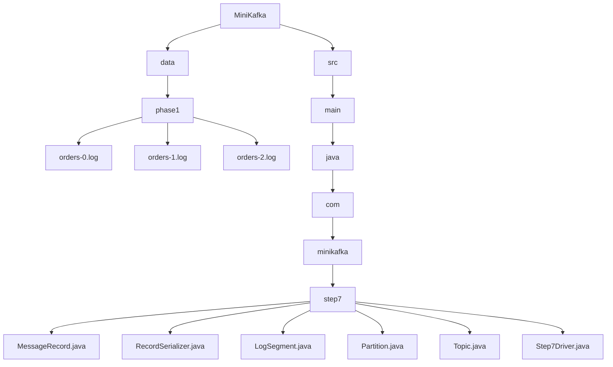
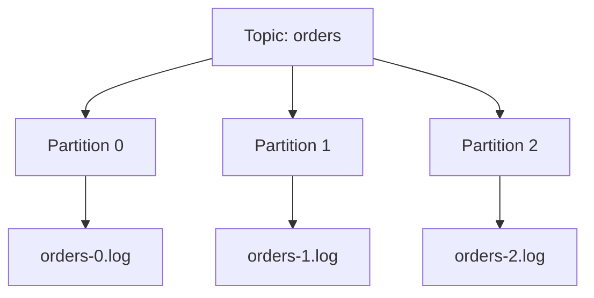
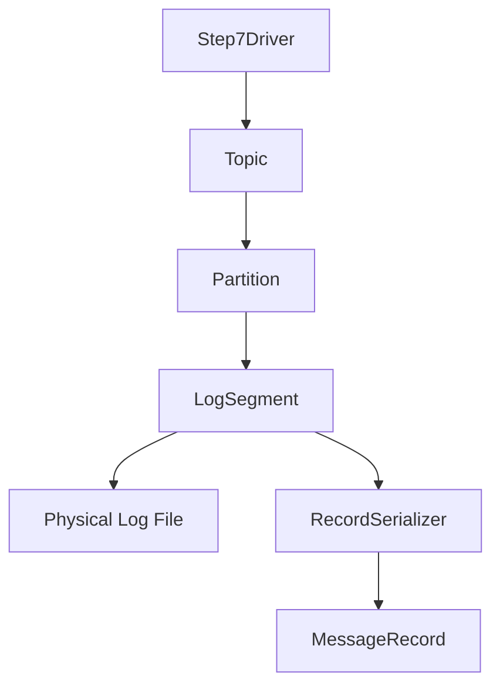
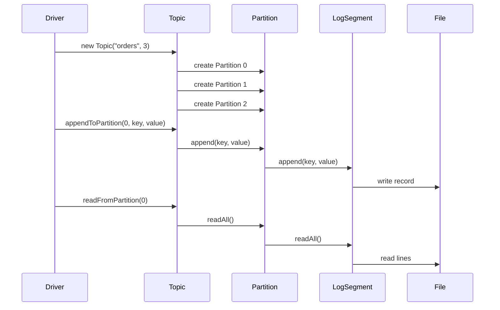
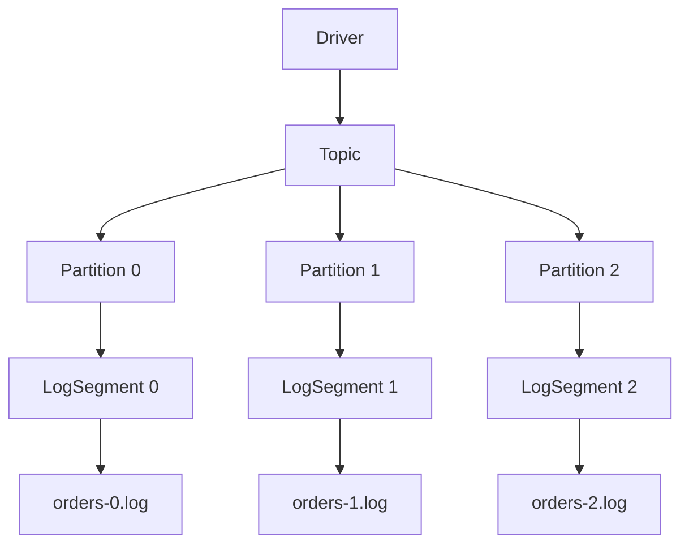

# 007_Topic_Abstraction

# MiniKafka Step 7 — Topic Abstraction

## Goal

In Step 6, we created the `Partition` abstraction.

Now we move one level higher and create:

```java
Topic
```

A Kafka topic is a logical stream of records.

A topic contains one or more partitions.

```text
Topic: orders
   |
   +--> Partition 0
   +--> Partition 1
   +--> Partition 2
```

This step makes MiniKafka much closer to real Kafka.

---

# Big Picture

Before:

```text
Driver
   |
   v
Partition
   |
   v
LogSegment
   |
   v
Log File
```

After:

```text
Driver
   |
   v
Topic
   |
   +--> Partition 0
   +--> Partition 1
   +--> Partition 2
```

Now the driver does not need to manually create partitions one by one.

The `Topic` will manage partitions.

---

# Why Topic Abstraction Exists

A topic gives a name to an event stream.

Examples:

```text
orders
payments
notifications
user-events
shipment-events
```

Each topic can have multiple partitions.

```text
orders topic
   |
   +--> orders-0.log
   +--> orders-1.log
   +--> orders-2.log
```

---

# Step 7.1 — Folder Structure

```text
MiniKafka/
├── data/
│   └── phase1/
│       ├── orders-0.log
│       ├── orders-1.log
│       └── orders-2.log
└── src/
    └── main/
        └── java/
            └── com/
                └── minikafka/
                    └── step7/
                        ├── MessageRecord.java
                        ├── RecordSerializer.java
                        ├── LogSegment.java
                        ├── Partition.java
                        ├── Topic.java
                        └── Step7Driver.java
```

## Folder Structure Mermaid Diagram



---

# Step 7.2 — Topic Architecture Diagram



---

# Step 7.3 — Classes In This Step

We now have this object hierarchy:



Meaning:

```text
Topic owns many partitions.
Partition owns one LogSegment.
LogSegment owns one physical file.
```

---

# Step 7.4 — Reuse Previous Classes

Reuse these from Step 6:

```text
MessageRecord.java
RecordSerializer.java
LogSegment.java
Partition.java
```

Then add:

```text
Topic.java
Step7Driver.java
```

---

# Step 7.5 — Topic Responsibilities

The `Topic` class should manage:

```text
[yes] topic name
[yes] list of partitions
[yes] partition count
[yes] append to a selected partition
[yes] read from a selected partition
[yes] expose partition metadata
```

In this step, we manually choose partition id.

In the next step, we will add automatic routing.

---

# Step 7.6 — Topic.java

File:

```text
Topic.java
```

Code:

```java
package com.minikafka.step7;

import java.io.IOException;
import java.util.ArrayList;
import java.util.List;

public class Topic {

    private final String name;

    private final List<Partition> partitions;

    public Topic(String name,
                 int partitionCount)
            throws IOException {

        this.name = name;

        this.partitions = new ArrayList<>();

        for (int partitionId = 0;
             partitionId < partitionCount;
             partitionId++) {

            Partition partition =
                    new Partition(name, partitionId);

            partitions.add(partition);
        }
    }

    public long appendToPartition(int partitionId,
                                  String key,
                                  String value)
            throws IOException {

        Partition partition =
                getPartition(partitionId);

        return partition.append(key, value);
    }

    public List<MessageRecord> readFromPartition(
            int partitionId)
            throws IOException {

        Partition partition =
                getPartition(partitionId);

        return partition.readAll();
    }

    public List<MessageRecord> readFromPartitionOffset(
            int partitionId,
            long offset)
            throws IOException {

        Partition partition =
                getPartition(partitionId);

        return partition.readFromOffset(offset);
    }

    public Partition getPartition(int partitionId) {

        if (partitionId < 0
                || partitionId >= partitions.size()) {

            throw new IllegalArgumentException(
                    "Invalid partition id: "
                            + partitionId
            );
        }

        return partitions.get(partitionId);
    }

    public String getName() {
        return name;
    }

    public int getPartitionCount() {
        return partitions.size();
    }
}
```

---

# Step 7.7 — What Happens Internally?

When you create:

```java
Topic ordersTopic =
        new Topic("orders", 3);
```

Internally:

```text
Topic name = orders
partitionCount = 3
```

It creates:

```text
Partition 0 -> data/phase1/orders-0.log
Partition 1 -> data/phase1/orders-1.log
Partition 2 -> data/phase1/orders-2.log
```

Visual:

```text
new Topic("orders", 3)
        |
        v
create partition 0
        |
        v
create partition 1
        |
        v
create partition 2
```

---

# Step 7.8 — Step7Driver.java

File:

```text
Step7Driver.java
```

Code:

```java
package com.minikafka.step7;

import java.util.List;

public class Step7Driver {

    public static void main(String[] args)
            throws Exception {

        Topic ordersTopic =
                new Topic("orders", 3);

        System.out.println(
                "Topic created: "
                        + ordersTopic.getName()
        );

        System.out.println(
                "Partition count: "
                        + ordersTopic.getPartitionCount()
        );

        ordersTopic.appendToPartition(
                0,
                "order-1",
                "created"
        );

        ordersTopic.appendToPartition(
                0,
                "order-2",
                "paid"
        );

        ordersTopic.appendToPartition(
                1,
                "order-3",
                "shipped"
        );

        ordersTopic.appendToPartition(
                2,
                "order-4",
                "delivered"
        );

        printPartition(ordersTopic, 0);

        printPartition(ordersTopic, 1);

        printPartition(ordersTopic, 2);
    }

    private static void printPartition(Topic topic,
                                       int partitionId)
            throws Exception {

        System.out.println();
        System.out.println(
                "---- "
                        + topic.getName()
                        + " PARTITION "
                        + partitionId
                        + " ----"
        );

        List<MessageRecord> records =
                topic.readFromPartition(partitionId);

        for (MessageRecord record : records) {
            System.out.println(record);
        }
    }
}
```

---

# Step 7.9 — Execution Flow



---

# Step 7.10 — Run Command

```bash
javac -d out src/main/java/com/minikafka/step7/*.java

java -cp out com.minikafka.step7.Step7Driver
```

---

# Step 7.11 — Expected Output

```text
Topic created: orders
Partition count: 3

---- orders PARTITION 0 ----
MessageRecord{offset=0, key='order-1', value='created'}
MessageRecord{offset=1, key='order-2', value='paid'}

---- orders PARTITION 1 ----
MessageRecord{offset=0, key='order-3', value='shipped'}

---- orders PARTITION 2 ----
MessageRecord{offset=0, key='order-4', value='delivered'}
```

---

# Step 7.12 — Important Observation

Each partition has its own offset sequence.

```text
Partition 0:
0
1

Partition 1:
0

Partition 2:
0
```

Kafka offsets are not topic-global.

Kafka offsets are partition-local.

This is one of the most important Kafka concepts.

---

# Step 7.13 — Why This Is Kafka-Like

Real Kafka topic:

```text
orders
   |
   +--> partition 0
   +--> partition 1
   +--> partition 2
```

MiniKafka topic:

```java
Topic ordersTopic = new Topic("orders", 3);
```

Real Kafka stores partition logs on disk.

MiniKafka stores:

```text
orders-0.log
orders-1.log
orders-2.log
```

---

# Step 7.14 — Current MiniKafka Architecture



---

# Step 7.15 — Concepts Learned

```text
topic abstraction
partition registry
topic metadata
partition-local offsets
topic-level append/read operations
```

---

# Step 7.16 — Current MiniKafka State

```text
Supported:
[yes] append-only storage
[yes] offsets
[yes] serialization
[yes] deserialization
[yes] LogSegment abstraction
[yes] Partition abstraction
[yes] Topic abstraction
[yes] multiple partitions inside topic

Not yet:
[no] automatic partition routing
[no] Broker API
[no] Producer API
[no] Consumer API
[no] consumer groups
```

---

# Step 7 Completion Checklist

```text
[ ] You created Topic class
[ ] You understand topic owns partitions
[ ] You understand partition-local offsets
[ ] You understand topic-level read/write
[ ] You understand Kafka topic hierarchy
```

---

# Step 7 Final Mental Model

```text
Producer sends message to topic
             |
             v
Topic selects partition
             |
             v
Partition appends record
             |
             v
LogSegment writes to file
             |
             v
Consumer reads from partition offset
```

In this step, partition is selected manually.

Next we automate partition selection.

---

# Next Step

Next we build:

```text
008_Multiple_Partitions
```

We will focus deeper on:

```text
multiple partitions
parallel logs
partition-level ordering
why Kafka scales using partitions
```
