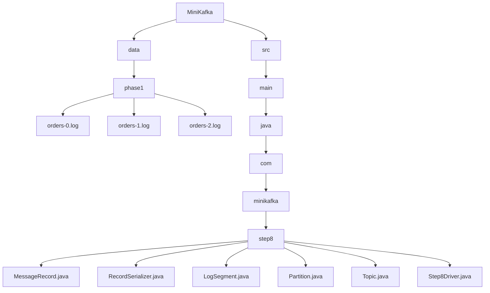
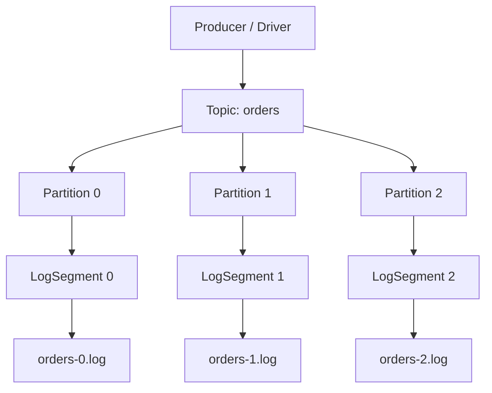
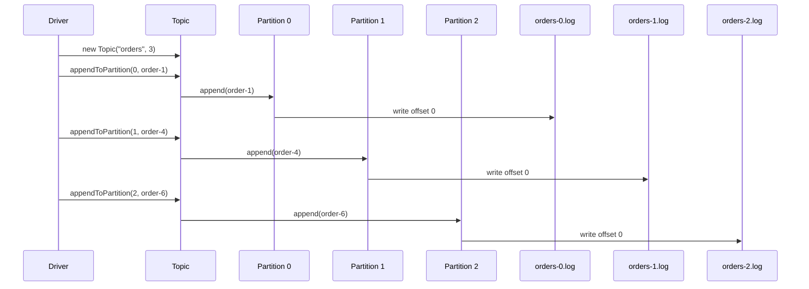

# 008_Multiple_Partitions

# MiniKafka Step 8 — Multiple Partitions

## Goal

In Step 7, we created the `Topic` abstraction.

A topic can contain many partitions.

In this step, we deeply understand and test:

```text
multiple partitions
parallel logs
partition-level ordering
partition-local offsets
```

This is one of the most important Kafka scaling concepts.

---

# Big Picture

Kafka scales because one topic is split into many partitions.

```text
Topic: orders
   |
   +--> Partition 0
   +--> Partition 1
   +--> Partition 2
```

Each partition has its own append-only log.

```text
orders-0.log
orders-1.log
orders-2.log
```

---

# Why Multiple Partitions Matter

Without partitions:

```text
one topic
one log file
one consumer can process at a time
limited throughput
```

With partitions:

```text
one topic
many partition logs
many consumers can process in parallel
higher throughput
```

This is how Kafka supports high-scale event streaming.

---

# Step 8.1 — Folder Structure

```text
MiniKafka/
├── data/
│   └── phase1/
│       ├── orders-0.log
│       ├── orders-1.log
│       └── orders-2.log
└── src/
    └── main/
        └── java/
            └── com/
                └── minikafka/
                    └── step8/
                        ├── MessageRecord.java
                        ├── RecordSerializer.java
                        ├── LogSegment.java
                        ├── Partition.java
                        ├── Topic.java
                        └── Step8Driver.java
```

## Folder Structure Mermaid Diagram



---

# Step 8.2 — Architecture Mermaid Diagram



---

# Step 8.3 — Key Kafka Concept

Offsets are not global across a topic.

Offsets are local to each partition.

Example:

```text
Partition 0:
0
1
2

Partition 1:
0
1

Partition 2:
0
1
2
3
```

So this is valid:

```text
orders-0.log has offset 0
orders-1.log also has offset 0
orders-2.log also has offset 0
```

Kafka identifies a record using:

```text
topic + partition + offset
```

Example:

```text
orders, partition 1, offset 0
```

---

# Step 8.4 — Reuse Previous Classes

Reuse these classes from Step 7:

```text
MessageRecord.java
RecordSerializer.java
LogSegment.java
Partition.java
Topic.java
```

In this step, the main focus is the driver and the behavior.

---

# Step 8.5 — MessageRecord.java

```java
package com.minikafka.step8;

public class MessageRecord {

    private final long offset;

    private final String key;

    private final String value;

    public MessageRecord(long offset,
                         String key,
                         String value) {

        this.offset = offset;
        this.key = key;
        this.value = value;
    }

    public long getOffset() {
        return offset;
    }

    public String getKey() {
        return key;
    }

    public String getValue() {
        return value;
    }

    @Override
    public String toString() {
        return "MessageRecord{" +
                "offset=" + offset +
                ", key='" + key + '\'' +
                ", value='" + value + '\'' +
                '}';
    }
}
```

---

# Step 8.6 — RecordSerializer.java

```java
package com.minikafka.step8;

public class RecordSerializer {

    public static String serialize(MessageRecord record) {

        return record.getOffset()
                + "|"
                + record.getKey()
                + "|"
                + record.getValue();
    }

    public static MessageRecord deserialize(String line) {

        String[] parts = line.split("\\|", 3);

        long offset = Long.parseLong(parts[0]);

        String key = parts[1];

        String value = parts[2];

        return new MessageRecord(offset, key, value);
    }
}
```

---

# Step 8.7 — LogSegment.java

```java
package com.minikafka.step8;

import java.io.IOException;
import java.nio.file.Files;
import java.nio.file.Path;
import java.nio.file.StandardOpenOption;
import java.util.ArrayList;
import java.util.List;
import java.util.stream.Stream;

public class LogSegment {

    private final Path logPath;

    public LogSegment(String filePath)
            throws IOException {

        this.logPath = Path.of(filePath);

        Files.createDirectories(logPath.getParent());

        if (!Files.exists(logPath)) {
            Files.createFile(logPath);
        }
    }

    public long append(String key,
                       String value)
            throws IOException {

        long offset = countLines();

        MessageRecord record =
                new MessageRecord(offset, key, value);

        String line =
                RecordSerializer.serialize(record);

        Files.writeString(
                logPath,
                line + System.lineSeparator(),
                StandardOpenOption.APPEND
        );

        return offset;
    }

    public List<MessageRecord> readAll()
            throws IOException {

        List<MessageRecord> result =
                new ArrayList<>();

        List<String> lines =
                Files.readAllLines(logPath);

        for (String line : lines) {

            if (line.isBlank()) {
                continue;
            }

            MessageRecord record =
                    RecordSerializer.deserialize(line);

            result.add(record);
        }

        return result;
    }

    public List<MessageRecord> readFromOffset(long startOffset)
            throws IOException {

        List<MessageRecord> result =
                new ArrayList<>();

        List<String> lines =
                Files.readAllLines(logPath);

        for (String line : lines) {

            if (line.isBlank()) {
                continue;
            }

            MessageRecord record =
                    RecordSerializer.deserialize(line);

            if (record.getOffset() >= startOffset) {
                result.add(record);
            }
        }

        return result;
    }

    private long countLines()
            throws IOException {

        try (Stream<String> lines =
                     Files.lines(logPath)) {

            return lines
                    .filter(line -> !line.isBlank())
                    .count();
        }
    }
}
```

---

# Step 8.8 — Partition.java

```java
package com.minikafka.step8;

import java.io.IOException;
import java.util.List;

public class Partition {

    private final int partitionId;

    private final LogSegment segment;

    public Partition(String topicName,
                     int partitionId)
            throws IOException {

        this.partitionId = partitionId;

        String filePath =
                "data/phase1/"
                        + topicName
                        + "-"
                        + partitionId
                        + ".log";

        this.segment =
                new LogSegment(filePath);
    }

    public long append(String key,
                       String value)
            throws IOException {

        return segment.append(key, value);
    }

    public List<MessageRecord> readAll()
            throws IOException {

        return segment.readAll();
    }

    public List<MessageRecord> readFromOffset(long offset)
            throws IOException {

        return segment.readFromOffset(offset);
    }

    public int getPartitionId() {
        return partitionId;
    }
}
```

---

# Step 8.9 — Topic.java

```java
package com.minikafka.step8;

import java.io.IOException;
import java.util.ArrayList;
import java.util.List;

public class Topic {

    private final String name;

    private final List<Partition> partitions;

    public Topic(String name,
                 int partitionCount)
            throws IOException {

        this.name = name;

        this.partitions = new ArrayList<>();

        for (int partitionId = 0;
             partitionId < partitionCount;
             partitionId++) {

            Partition partition =
                    new Partition(name, partitionId);

            partitions.add(partition);
        }
    }

    public long appendToPartition(int partitionId,
                                  String key,
                                  String value)
            throws IOException {

        Partition partition =
                getPartition(partitionId);

        return partition.append(key, value);
    }

    public List<MessageRecord> readFromPartition(int partitionId)
            throws IOException {

        Partition partition =
                getPartition(partitionId);

        return partition.readAll();
    }

    public List<MessageRecord> readFromPartitionOffset(
            int partitionId,
            long offset)
            throws IOException {

        Partition partition =
                getPartition(partitionId);

        return partition.readFromOffset(offset);
    }

    public Partition getPartition(int partitionId) {

        if (partitionId < 0
                || partitionId >= partitions.size()) {

            throw new IllegalArgumentException(
                    "Invalid partition id: "
                            + partitionId
            );
        }

        return partitions.get(partitionId);
    }

    public String getName() {
        return name;
    }

    public int getPartitionCount() {
        return partitions.size();
    }
}
```

---

# Step 8.10 — Step8Driver.java

This driver writes different messages to different partitions.

```java
package com.minikafka.step8;

import java.util.List;

public class Step8Driver {

    public static void main(String[] args)
            throws Exception {

        Topic ordersTopic =
                new Topic("orders", 3);

        System.out.println(
                "Created topic: "
                        + ordersTopic.getName()
        );

        System.out.println(
                "Partitions: "
                        + ordersTopic.getPartitionCount()
        );

        ordersTopic.appendToPartition(
                0,
                "order-1",
                "created"
        );

        ordersTopic.appendToPartition(
                0,
                "order-2",
                "paid"
        );

        ordersTopic.appendToPartition(
                0,
                "order-3",
                "packed"
        );

        ordersTopic.appendToPartition(
                1,
                "order-4",
                "created"
        );

        ordersTopic.appendToPartition(
                1,
                "order-5",
                "cancelled"
        );

        ordersTopic.appendToPartition(
                2,
                "order-6",
                "created"
        );

        ordersTopic.appendToPartition(
                2,
                "order-7",
                "shipped"
        );

        ordersTopic.appendToPartition(
                2,
                "order-8",
                "delivered"
        );

        printPartition(ordersTopic, 0);
        printPartition(ordersTopic, 1);
        printPartition(ordersTopic, 2);
    }

    private static void printPartition(Topic topic,
                                       int partitionId)
            throws Exception {

        System.out.println();
        System.out.println(
                "---- "
                        + topic.getName()
                        + " PARTITION "
                        + partitionId
                        + " ----"
        );

        List<MessageRecord> records =
                topic.readFromPartition(partitionId);

        for (MessageRecord record : records) {
            System.out.println(record);
        }
    }
}
```

---

# Step 8.11 — Execution Flow Mermaid Diagram



---

# Step 8.12 — Expected File Contents

## orders-0.log

```text
0|order-1|created
1|order-2|paid
2|order-3|packed
```

## orders-1.log

```text
0|order-4|created
1|order-5|cancelled
```

## orders-2.log

```text
0|order-6|created
1|order-7|shipped
2|order-8|delivered
```

---

# Step 8.13 — Run Command

```bash
javac -d out src/main/java/com/minikafka/step8/*.java

java -cp out com.minikafka.step8.Step8Driver
```

---

# Step 8.14 — Expected Output

```text
Created topic: orders
Partitions: 3

---- orders PARTITION 0 ----
MessageRecord{offset=0, key='order-1', value='created'}
MessageRecord{offset=1, key='order-2', value='paid'}
MessageRecord{offset=2, key='order-3', value='packed'}

---- orders PARTITION 1 ----
MessageRecord{offset=0, key='order-4', value='created'}
MessageRecord{offset=1, key='order-5', value='cancelled'}

---- orders PARTITION 2 ----
MessageRecord{offset=0, key='order-6', value='created'}
MessageRecord{offset=1, key='order-7', value='shipped'}
MessageRecord{offset=2, key='order-8', value='delivered'}
```

---

# Step 8.15 — Partition Ordering

Inside a partition, order is preserved.

```text
Partition 0:
0 -> order-1 created
1 -> order-2 paid
2 -> order-3 packed
```

This order is guaranteed.

But across partitions, there is no global ordering.

Example:

```text
Partition 0 offset 2
Partition 1 offset 0
Partition 2 offset 1
```

There is no single global order between them.

---

# Step 8.16 — Why Kafka Uses This Design

Multiple partitions allow:

```text
more write throughput
more read throughput
parallel consumers
distributed storage
scalable topics
```

Tradeoff:

```text
global ordering is lost
```

Kafka chooses scalability over global ordering.

For ordering-sensitive workloads, use the same key so related messages go to the same partition.

---

# Step 8.17 — Current MiniKafka State

```text
Supported:
[yes] append-only storage
[yes] offsets
[yes] serialization
[yes] LogSegment abstraction
[yes] Partition abstraction
[yes] Topic abstraction
[yes] multiple partitions
[yes] partition-local ordering

Not yet:
[no] key-based automatic partition routing
[no] Broker API
[no] Producer API
[no] Consumer API
[no] consumer groups
```

---

# Step 8 Completion Checklist

```text
[ ] You created multiple partitions
[ ] You wrote messages to different partitions
[ ] You understand partition-local offsets
[ ] You understand partition-local ordering
[ ] You understand why Kafka scales using partitions
[ ] You understand global ordering tradeoff
```

---

# Step 8 Final Mental Model

```text
Topic is not one log.
Topic is a collection of partition logs.

Topic: orders
   |
   +--> orders-0.log
   +--> orders-1.log
   +--> orders-2.log
```

Each partition behaves like an independent append-only log.

---

# Next Step

Next we build:

```text
009_Key_Based_Partition_Routing
```

Currently we manually choose partition:

```java
appendToPartition(0, key, value)
```

Next we will let MiniKafka decide partition automatically:

```java
append(key, value)
```

using:

```text
hash(key) % partitionCount
```

This gives us real Kafka-like partition routing.
