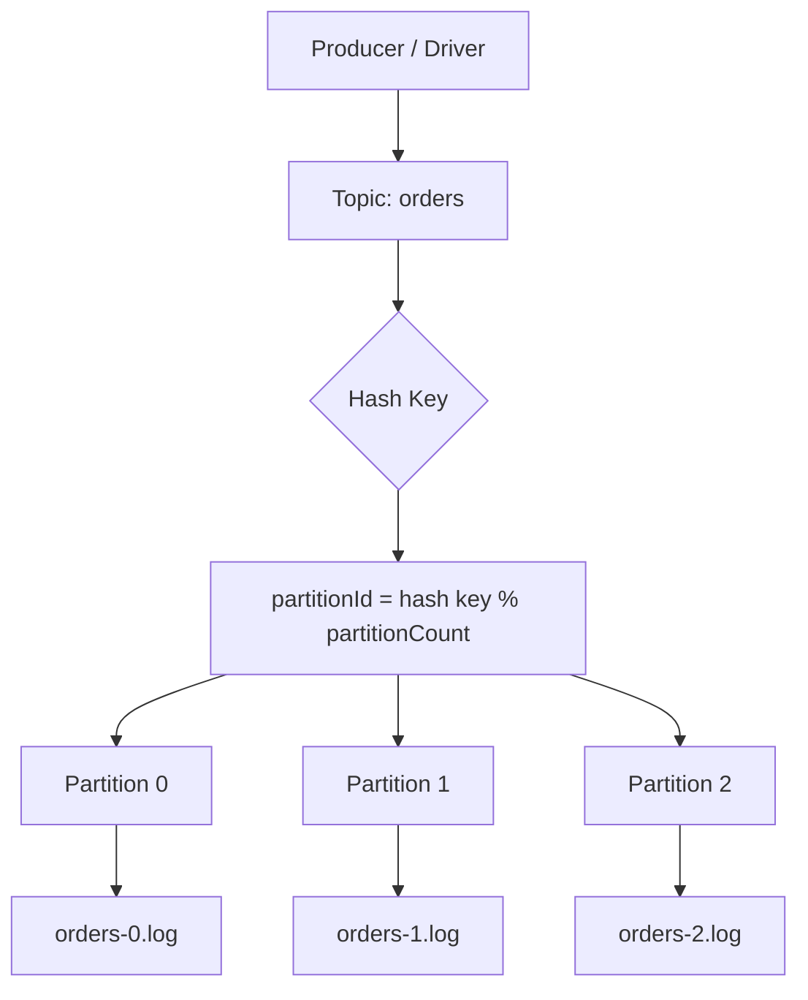
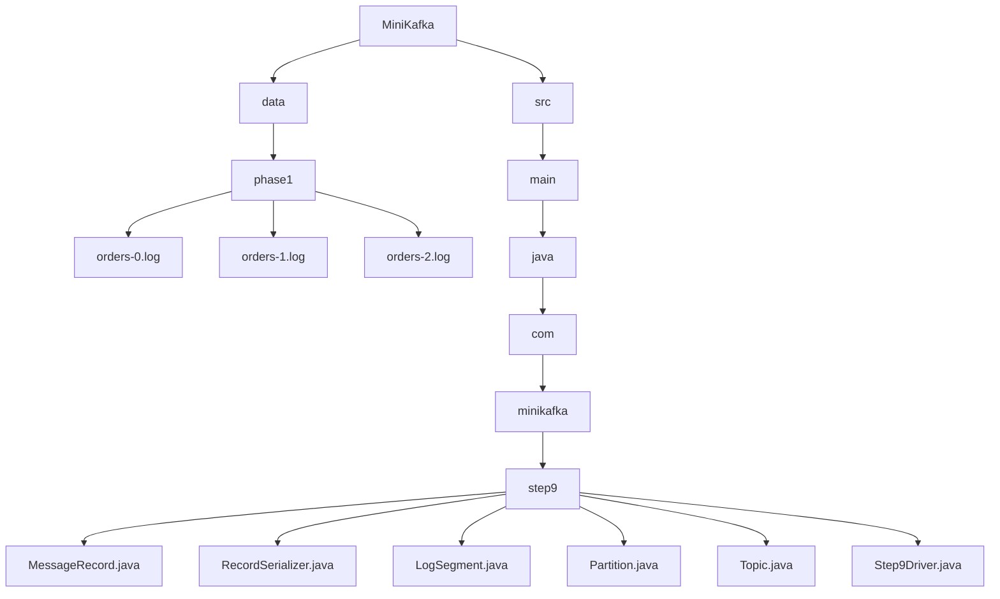
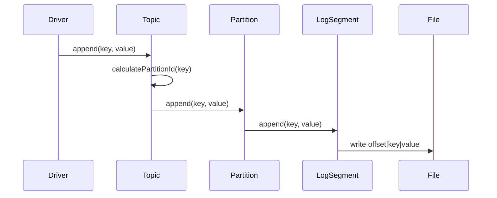
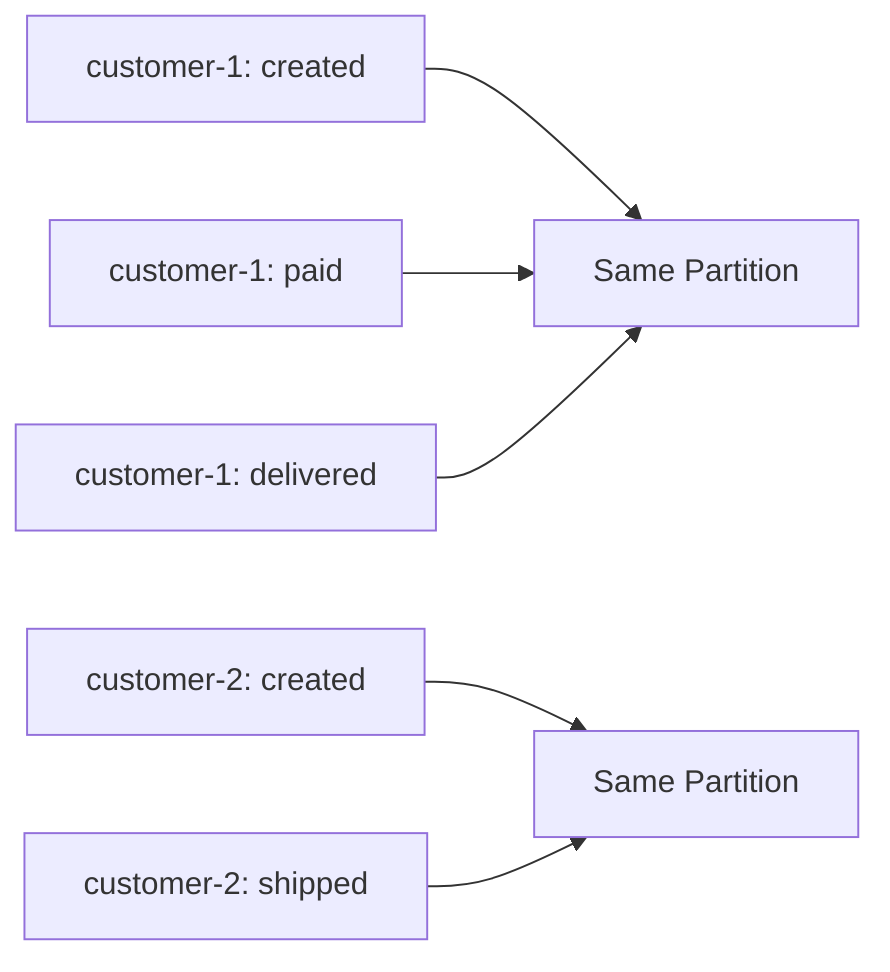

# 009_Key_Based_Partition_Routing

# MiniKafka Step 9 — Key-Based Partition Routing

## Goal

In Step 8, we manually selected the partition:

```java
ordersTopic.appendToPartition(0, "order-1", "created");
ordersTopic.appendToPartition(1, "order-2", "paid");
```

In real Kafka, producer usually sends:

```java
producer.send("orders", key, value);
```

Kafka decides the partition from the key.

Core idea:

```text
partitionId = hash(key) % partitionCount
```

---

# Why Key-Based Routing Exists

Same key should go to the same partition.

```text
same key -> same hash -> same partition
```

Example:

```text
customer-1 -> partition 2
customer-1 -> partition 2
customer-1 -> partition 2
```

This preserves ordering for one customer/order/payment/user.

Kafka gives ordering only inside one partition, not globally across the whole topic.

---

# Architecture Mermaid Diagram



---

# Folder Structure

```text
MiniKafka/
├── data/
│   └── phase1/
│       ├── orders-0.log
│       ├── orders-1.log
│       └── orders-2.log
└── src/
    └── main/
        └── java/
            └── com/
                └── minikafka/
                    └── step9/
                        ├── MessageRecord.java
                        ├── RecordSerializer.java
                        ├── LogSegment.java
                        ├── Partition.java
                        ├── Topic.java
                        └── Step9Driver.java
```

## Folder Mermaid Diagram



---

# Execution Flow



---

# MessageRecord.java

```java
package com.minikafka.step9;

public class MessageRecord {

    private final long offset;
    private final String key;
    private final String value;

    public MessageRecord(long offset, String key, String value) {
        this.offset = offset;
        this.key = key;
        this.value = value;
    }

    public long getOffset() {
        return offset;
    }

    public String getKey() {
        return key;
    }

    public String getValue() {
        return value;
    }

    @Override
    public String toString() {
        return "MessageRecord{" +
                "offset=" + offset +
                ", key='" + key + '\'' +
                ", value='" + value + '\'' +
                '}';
    }
}
```

---

# RecordSerializer.java

```java
package com.minikafka.step9;

public class RecordSerializer {

    public static String serialize(MessageRecord record) {
        return record.getOffset()
                + "|"
                + record.getKey()
                + "|"
                + record.getValue();
    }

    public static MessageRecord deserialize(String line) {
        String[] parts = line.split("\\|", 3);

        long offset = Long.parseLong(parts[0]);
        String key = parts[1];
        String value = parts[2];

        return new MessageRecord(offset, key, value);
    }
}
```

---

# LogSegment.java

```java
package com.minikafka.step9;

import java.io.IOException;
import java.nio.file.Files;
import java.nio.file.Path;
import java.nio.file.StandardOpenOption;
import java.util.ArrayList;
import java.util.List;
import java.util.stream.Stream;

public class LogSegment {

    private final Path logPath;

    public LogSegment(String filePath) throws IOException {
        this.logPath = Path.of(filePath);

        Files.createDirectories(logPath.getParent());

        if (!Files.exists(logPath)) {
            Files.createFile(logPath);
        }
    }

    public long append(String key, String value) throws IOException {
        long offset = countLines();

        MessageRecord record = new MessageRecord(offset, key, value);
        String line = RecordSerializer.serialize(record);

        Files.writeString(
                logPath,
                line + System.lineSeparator(),
                StandardOpenOption.APPEND
        );

        return offset;
    }

    public List<MessageRecord> readAll() throws IOException {
        List<MessageRecord> result = new ArrayList<>();
        List<String> lines = Files.readAllLines(logPath);

        for (String line : lines) {
            if (line.isBlank()) {
                continue;
            }

            result.add(RecordSerializer.deserialize(line));
        }

        return result;
    }

    public List<MessageRecord> readFromOffset(long startOffset)
            throws IOException {

        List<MessageRecord> result = new ArrayList<>();
        List<String> lines = Files.readAllLines(logPath);

        for (String line : lines) {
            if (line.isBlank()) {
                continue;
            }

            MessageRecord record =
                    RecordSerializer.deserialize(line);

            if (record.getOffset() >= startOffset) {
                result.add(record);
            }
        }

        return result;
    }

    private long countLines() throws IOException {
        try (Stream<String> lines = Files.lines(logPath)) {
            return lines
                    .filter(line -> !line.isBlank())
                    .count();
        }
    }
}
```

---

# Partition.java

```java
package com.minikafka.step9;

import java.io.IOException;
import java.util.List;

public class Partition {

    private final int partitionId;
    private final LogSegment segment;

    public Partition(String topicName, int partitionId)
            throws IOException {

        this.partitionId = partitionId;

        String filePath =
                "data/phase1/"
                        + topicName
                        + "-"
                        + partitionId
                        + ".log";

        this.segment = new LogSegment(filePath);
    }

    public long append(String key, String value)
            throws IOException {

        return segment.append(key, value);
    }

    public List<MessageRecord> readAll()
            throws IOException {

        return segment.readAll();
    }

    public List<MessageRecord> readFromOffset(long offset)
            throws IOException {

        return segment.readFromOffset(offset);
    }

    public int getPartitionId() {
        return partitionId;
    }
}
```

---

# Topic.java

This is the main class changed in this step.

We add:

```java
append(String key, String value)
```

It automatically routes the record.

```java
package com.minikafka.step9;

import java.io.IOException;
import java.util.ArrayList;
import java.util.List;

public class Topic {

    private final String name;
    private final List<Partition> partitions;

    public Topic(String name, int partitionCount)
            throws IOException {

        if (partitionCount <= 0) {
            throw new IllegalArgumentException(
                    "partitionCount must be > 0"
            );
        }

        this.name = name;
        this.partitions = new ArrayList<>();

        for (int partitionId = 0;
             partitionId < partitionCount;
             partitionId++) {

            partitions.add(
                    new Partition(name, partitionId)
            );
        }
    }

    public long append(String key, String value)
            throws IOException {

        int partitionId = calculatePartitionId(key);

        System.out.println(
                "Routing key='"
                        + key
                        + "' to partition "
                        + partitionId
        );

        return appendToPartition(
                partitionId,
                key,
                value
        );
    }

    public long appendToPartition(int partitionId,
                                  String key,
                                  String value)
            throws IOException {

        Partition partition = getPartition(partitionId);
        return partition.append(key, value);
    }

    public List<MessageRecord> readFromPartition(int partitionId)
            throws IOException {

        return getPartition(partitionId).readAll();
    }

    public List<MessageRecord> readFromPartitionOffset(
            int partitionId,
            long offset)
            throws IOException {

        return getPartition(partitionId).readFromOffset(offset);
    }

    private int calculatePartitionId(String key) {
        int hash = Math.abs(key.hashCode());
        return hash % partitions.size();
    }

    public Partition getPartition(int partitionId) {
        if (partitionId < 0
                || partitionId >= partitions.size()) {

            throw new IllegalArgumentException(
                    "Invalid partition id: "
                            + partitionId
            );
        }

        return partitions.get(partitionId);
    }

    public String getName() {
        return name;
    }

    public int getPartitionCount() {
        return partitions.size();
    }
}
```

---

# Step9Driver.java

```java
package com.minikafka.step9;

import java.util.List;

public class Step9Driver {

    public static void main(String[] args)
            throws Exception {

        Topic ordersTopic = new Topic("orders", 3);

        System.out.println(
                "Created topic: "
                        + ordersTopic.getName()
        );

        System.out.println(
                "Partition count: "
                        + ordersTopic.getPartitionCount()
        );

        System.out.println();

        ordersTopic.append(
                "customer-1",
                "order-1-created"
        );

        ordersTopic.append(
                "customer-2",
                "order-2-created"
        );

        ordersTopic.append(
                "customer-1",
                "order-1-paid"
        );

        ordersTopic.append(
                "customer-3",
                "order-3-created"
        );

        ordersTopic.append(
                "customer-2",
                "order-2-shipped"
        );

        ordersTopic.append(
                "customer-1",
                "order-1-delivered"
        );

        printPartition(ordersTopic, 0);
        printPartition(ordersTopic, 1);
        printPartition(ordersTopic, 2);
    }

    private static void printPartition(Topic topic,
                                       int partitionId)
            throws Exception {

        System.out.println();
        System.out.println(
                "---- "
                        + topic.getName()
                        + " PARTITION "
                        + partitionId
                        + " ----"
        );

        List<MessageRecord> records =
                topic.readFromPartition(partitionId);

        for (MessageRecord record : records) {
            System.out.println(record);
        }
    }
}
```

---

# Dry Run

Input messages:

```text
customer-1 -> order-1-created
customer-2 -> order-2-created
customer-1 -> order-1-paid
customer-3 -> order-3-created
customer-2 -> order-2-shipped
customer-1 -> order-1-delivered
```

Routing:

```text
partitionId = Math.abs(key.hashCode()) % 3
```

Important expected behavior:

```text
customer-1 always goes to same partition
customer-2 always goes to same partition
customer-3 always goes to same partition
```

---

# Key Ordering Mermaid Diagram



---

# Run Command

```bash
javac -d out src/main/java/com/minikafka/step9/*.java

java -cp out com.minikafka.step9.Step9Driver
```

---

# Expected Output Pattern

Exact partition numbers can depend on Java hash result.

But the pattern must be:

```text
Routing key='customer-1' to partition X
Routing key='customer-2' to partition Y
Routing key='customer-1' to partition X
Routing key='customer-3' to partition Z
Routing key='customer-2' to partition Y
Routing key='customer-1' to partition X
```

Important:

```text
customer-1 always routes to same partition
customer-2 always routes to same partition
```

---

# Interview Explanation

Kafka does not guarantee global ordering across a topic.

Kafka guarantees ordering only within a partition.

To preserve order for related events:

```text
use the same key
```

Kafka sends same key to same partition.

---

# Current MiniKafka State

```text
Supported:
[yes] append-only storage
[yes] offsets
[yes] serialization
[yes] LogSegment abstraction
[yes] Partition abstraction
[yes] Topic abstraction
[yes] multiple partitions
[yes] key-based partition routing
[yes] per-key ordering

Not yet:
[no] Broker API
[no] Producer API
[no] Consumer API
[no] offset commits
[no] consumer groups
```

---

# Step 9 Completion Checklist

```text
[ ] You understand hash-based partition routing
[ ] You understand same key goes to same partition
[ ] You understand per-key ordering
[ ] You understand no global ordering across partitions
[ ] You can explain partitionId = hash(key) % partitionCount
```

---

# Final Mental Model

```text
Producer sends key + value
          |
          v
Topic hashes key
          |
          v
Topic selects partition
          |
          v
Partition appends record
          |
          v
LogSegment writes to disk
```

---

# Next Step

Next we build:

```text
010_Broker_API
```

Currently the driver talks directly to topic.

Next we introduce a broker:

```text
Producer
   |
   v
Broker
   |
   v
Topic
   |
   v
Partition
```
