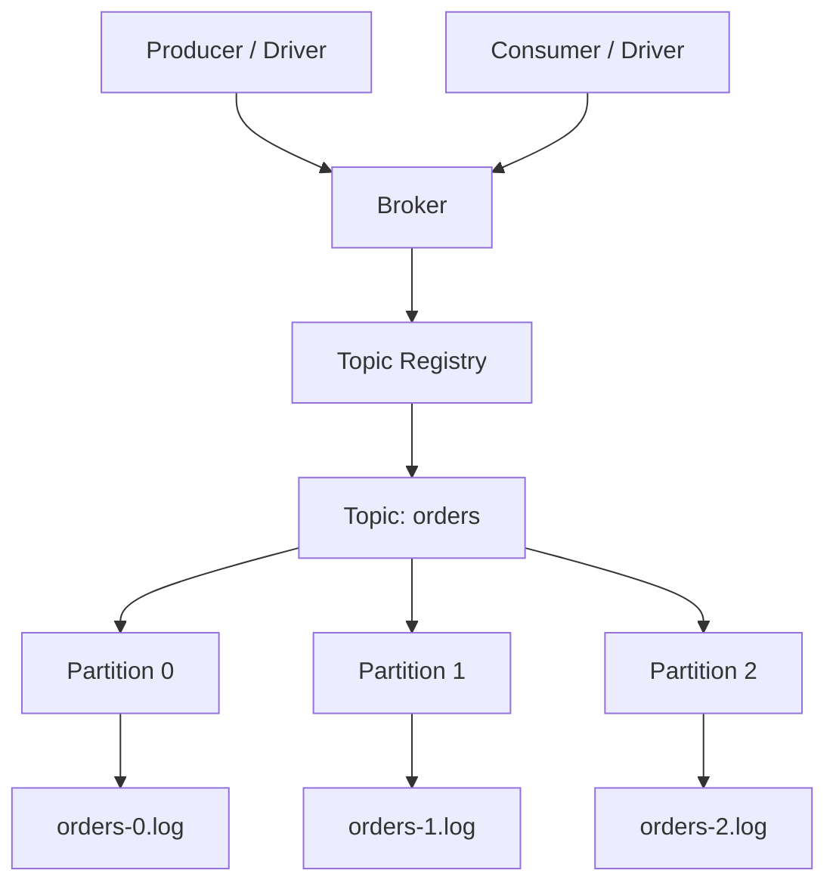
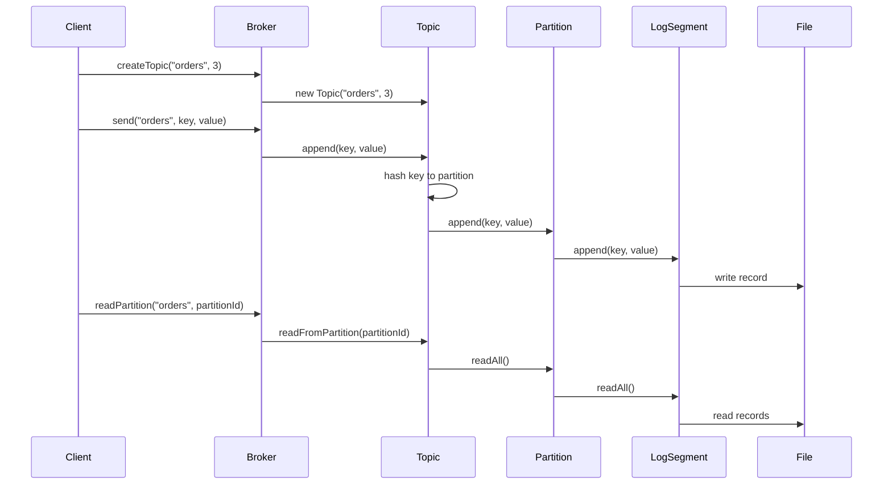
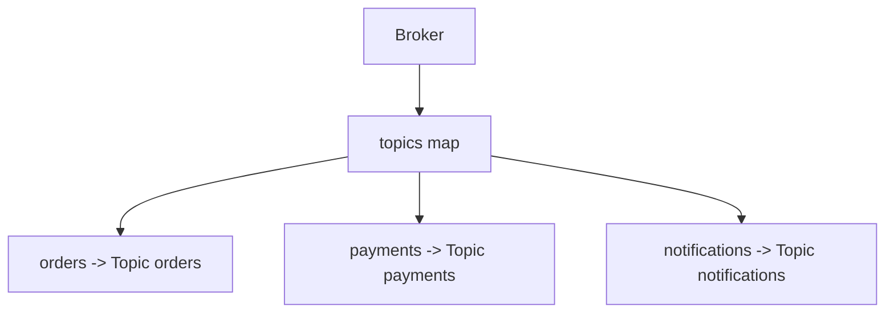

# 010_Broker_API

# MiniKafka Step 10 — Broker API

## Goal

Until now, the driver talks directly to the `Topic`.

```java
Topic ordersTopic = new Topic("orders", 3);
ordersTopic.append("customer-1", "order-created");
```

But real Kafka clients talk to a broker.

In this step, we introduce:

```java
Broker
```

The broker manages:

```text
topics
partitions
produce requests
consume/read requests
```

---

# Big Picture

Before:

```text
Driver
   |
   v
Topic
   |
   v
Partition
   |
   v
LogSegment
```

After:

```text
Driver
   |
   v
Broker
   |
   v
Topic
   |
   v
Partition
   |
   v
LogSegment
```

---

# Architecture Mermaid Diagram



---

# Request Flow Mermaid Diagram



---

# Folder Structure

```text
MiniKafka/
├── data/
│   └── phase1/
│       ├── orders-0.log
│       ├── orders-1.log
│       └── orders-2.log
└── src/
    └── main/
        └── java/
            └── com/
                └── minikafka/
                    └── step10/
                        ├── MessageRecord.java
                        ├── RecordSerializer.java
                        ├── LogSegment.java
                        ├── Partition.java
                        ├── Topic.java
                        ├── Broker.java
                        └── Step10Driver.java
```

---

# Broker Responsibilities

```text
[yes] create topic
[yes] store topics in memory
[yes] send message to topic
[yes] read all records from partition
[yes] read records from partition offset
[yes] validate topic existence
```

---

# MessageRecord.java

```java
package com.minikafka.step10;

public class MessageRecord {

    private final long offset;
    private final String key;
    private final String value;

    public MessageRecord(long offset, String key, String value) {
        this.offset = offset;
        this.key = key;
        this.value = value;
    }

    public long getOffset() {
        return offset;
    }

    public String getKey() {
        return key;
    }

    public String getValue() {
        return value;
    }

    @Override
    public String toString() {
        return "MessageRecord{" +
                "offset=" + offset +
                ", key='" + key + '\'' +
                ", value='" + value + '\'' +
                '}';
    }
}
```

---

# RecordSerializer.java

```java
package com.minikafka.step10;

public class RecordSerializer {

    public static String serialize(MessageRecord record) {
        return record.getOffset() + "|" + record.getKey() + "|" + record.getValue();
    }

    public static MessageRecord deserialize(String line) {
        String[] parts = line.split("\\|", 3);

        long offset = Long.parseLong(parts[0]);
        String key = parts[1];
        String value = parts[2];

        return new MessageRecord(offset, key, value);
    }
}
```

---

# LogSegment.java

```java
package com.minikafka.step10;

import java.io.IOException;
import java.nio.file.Files;
import java.nio.file.Path;
import java.nio.file.StandardOpenOption;
import java.util.ArrayList;
import java.util.List;
import java.util.stream.Stream;

public class LogSegment {

    private final Path logPath;

    public LogSegment(String filePath) throws IOException {
        this.logPath = Path.of(filePath);

        Files.createDirectories(logPath.getParent());

        if (!Files.exists(logPath)) {
            Files.createFile(logPath);
        }
    }

    public long append(String key, String value) throws IOException {
        long offset = countLines();

        MessageRecord record = new MessageRecord(offset, key, value);
        String line = RecordSerializer.serialize(record);

        Files.writeString(logPath, line + System.lineSeparator(), StandardOpenOption.APPEND);

        return offset;
    }

    public List<MessageRecord> readAll() throws IOException {
        List<MessageRecord> result = new ArrayList<>();
        List<String> lines = Files.readAllLines(logPath);

        for (String line : lines) {
            if (line.isBlank()) {
                continue;
            }

            result.add(RecordSerializer.deserialize(line));
        }

        return result;
    }

    public List<MessageRecord> readFromOffset(long startOffset) throws IOException {
        List<MessageRecord> result = new ArrayList<>();
        List<String> lines = Files.readAllLines(logPath);

        for (String line : lines) {
            if (line.isBlank()) {
                continue;
            }

            MessageRecord record = RecordSerializer.deserialize(line);

            if (record.getOffset() >= startOffset) {
                result.add(record);
            }
        }

        return result;
    }

    private long countLines() throws IOException {
        try (Stream<String> lines = Files.lines(logPath)) {
            return lines.filter(line -> !line.isBlank()).count();
        }
    }
}
```

---

# Partition.java

```java
package com.minikafka.step10;

import java.io.IOException;
import java.util.List;

public class Partition {

    private final int partitionId;
    private final LogSegment segment;

    public Partition(String topicName, int partitionId) throws IOException {
        this.partitionId = partitionId;

        String filePath = "data/phase1/" + topicName + "-" + partitionId + ".log";
        this.segment = new LogSegment(filePath);
    }

    public long append(String key, String value) throws IOException {
        return segment.append(key, value);
    }

    public List<MessageRecord> readAll() throws IOException {
        return segment.readAll();
    }

    public List<MessageRecord> readFromOffset(long offset) throws IOException {
        return segment.readFromOffset(offset);
    }

    public int getPartitionId() {
        return partitionId;
    }
}
```

---

# Topic.java

```java
package com.minikafka.step10;

import java.io.IOException;
import java.util.ArrayList;
import java.util.List;

public class Topic {

    private final String name;
    private final List<Partition> partitions;

    public Topic(String name, int partitionCount) throws IOException {
        if (partitionCount <= 0) {
            throw new IllegalArgumentException("partitionCount must be > 0");
        }

        this.name = name;
        this.partitions = new ArrayList<>();

        for (int partitionId = 0; partitionId < partitionCount; partitionId++) {
            partitions.add(new Partition(name, partitionId));
        }
    }

    public long append(String key, String value) throws IOException {
        int partitionId = calculatePartitionId(key);

        System.out.println(
                "Topic '" + name + "' routed key='" + key + "' to partition " + partitionId
        );

        return appendToPartition(partitionId, key, value);
    }

    public long appendToPartition(int partitionId, String key, String value) throws IOException {
        return getPartition(partitionId).append(key, value);
    }

    public List<MessageRecord> readFromPartition(int partitionId) throws IOException {
        return getPartition(partitionId).readAll();
    }

    public List<MessageRecord> readFromPartitionOffset(int partitionId, long offset) throws IOException {
        return getPartition(partitionId).readFromOffset(offset);
    }

    private int calculatePartitionId(String key) {
        int hash = Math.abs(key.hashCode());
        return hash % partitions.size();
    }

    public Partition getPartition(int partitionId) {
        if (partitionId < 0 || partitionId >= partitions.size()) {
            throw new IllegalArgumentException("Invalid partition id: " + partitionId);
        }

        return partitions.get(partitionId);
    }

    public String getName() {
        return name;
    }

    public int getPartitionCount() {
        return partitions.size();
    }
}
```

---

# Broker.java

```java
package com.minikafka.step10;

import java.io.IOException;
import java.util.HashMap;
import java.util.List;
import java.util.Map;

public class Broker {

    private final Map<String, Topic> topics;

    public Broker() {
        this.topics = new HashMap<>();
    }

    public void createTopic(String topicName, int partitionCount) throws IOException {
        if (topics.containsKey(topicName)) {
            throw new IllegalArgumentException("Topic already exists: " + topicName);
        }

        Topic topic = new Topic(topicName, partitionCount);
        topics.put(topicName, topic);

        System.out.println(
                "Broker created topic: " + topicName + " with partitions: " + partitionCount
        );
    }

    public long send(String topicName, String key, String value) throws IOException {
        Topic topic = getTopic(topicName);
        return topic.append(key, value);
    }

    public List<MessageRecord> readPartition(String topicName, int partitionId) throws IOException {
        Topic topic = getTopic(topicName);
        return topic.readFromPartition(partitionId);
    }

    public List<MessageRecord> readPartitionFromOffset(
            String topicName,
            int partitionId,
            long offset
    ) throws IOException {
        Topic topic = getTopic(topicName);
        return topic.readFromPartitionOffset(partitionId, offset);
    }

    public Topic getTopic(String topicName) {
        Topic topic = topics.get(topicName);

        if (topic == null) {
            throw new IllegalArgumentException("Topic not found: " + topicName);
        }

        return topic;
    }

    public boolean topicExists(String topicName) {
        return topics.containsKey(topicName);
    }

    public int topicCount() {
        return topics.size();
    }
}
```

---

# Step10Driver.java

```java
package com.minikafka.step10;

import java.util.List;

public class Step10Driver {

    public static void main(String[] args) throws Exception {
        Broker broker = new Broker();

        broker.createTopic("orders", 3);

        System.out.println();

        broker.send("orders", "customer-1", "order-1-created");
        broker.send("orders", "customer-2", "order-2-created");
        broker.send("orders", "customer-1", "order-1-paid");
        broker.send("orders", "customer-3", "order-3-created");
        broker.send("orders", "customer-2", "order-2-shipped");

        printPartition(broker, "orders", 0);
        printPartition(broker, "orders", 1);
        printPartition(broker, "orders", 2);

        System.out.println();
        System.out.println("---- READ PARTITION 0 FROM OFFSET 1 ----");

        List<MessageRecord> records = broker.readPartitionFromOffset("orders", 0, 1);

        for (MessageRecord record : records) {
            System.out.println(record);
        }
    }

    private static void printPartition(Broker broker, String topicName, int partitionId)
            throws Exception {

        System.out.println();
        System.out.println("---- " + topicName + " PARTITION " + partitionId + " ----");

        List<MessageRecord> records = broker.readPartition(topicName, partitionId);

        for (MessageRecord record : records) {
            System.out.println(record);
        }
    }
}
```

---

# Broker Registry Mental Model



---

# Run Command

```bash
javac -d out src/main/java/com/minikafka/step10/*.java

java -cp out com.minikafka.step10.Step10Driver
```

---

# Expected Output Pattern

Exact partition numbers can vary because of Java hash values.

```text
Broker created topic: orders with partitions: 3

Topic 'orders' routed key='customer-1' to partition X
Topic 'orders' routed key='customer-2' to partition Y
Topic 'orders' routed key='customer-1' to partition X
Topic 'orders' routed key='customer-3' to partition Z
Topic 'orders' routed key='customer-2' to partition Y
```

Important:

```text
same key routes to same partition
broker hides topic internals from client
```

---

# Current MiniKafka State

```text
Supported:
[yes] append-only storage
[yes] offsets
[yes] serialization
[yes] LogSegment abstraction
[yes] Partition abstraction
[yes] Topic abstraction
[yes] multiple partitions
[yes] key-based routing
[yes] Broker API
[yes] topic registry

Not yet:
[no] Producer API
[no] Consumer API
[no] offset commit
[no] consumer groups
[no] replication
```

---

# Step 10 Completion Checklist

```text
[ ] You created Broker class
[ ] You understand broker as central entry point
[ ] You understand topic registry
[ ] You can create topics through broker
[ ] You can send messages through broker
[ ] You can read partitions through broker
```

---

# Final Mental Model

```text
Client sends request to broker
          |
          v
Broker finds topic
          |
          v
Topic selects partition
          |
          v
Partition appends to LogSegment
          |
          v
LogSegment writes to disk
```

---

# Next Step

Next we build:

```text
011_Producer_API
```
