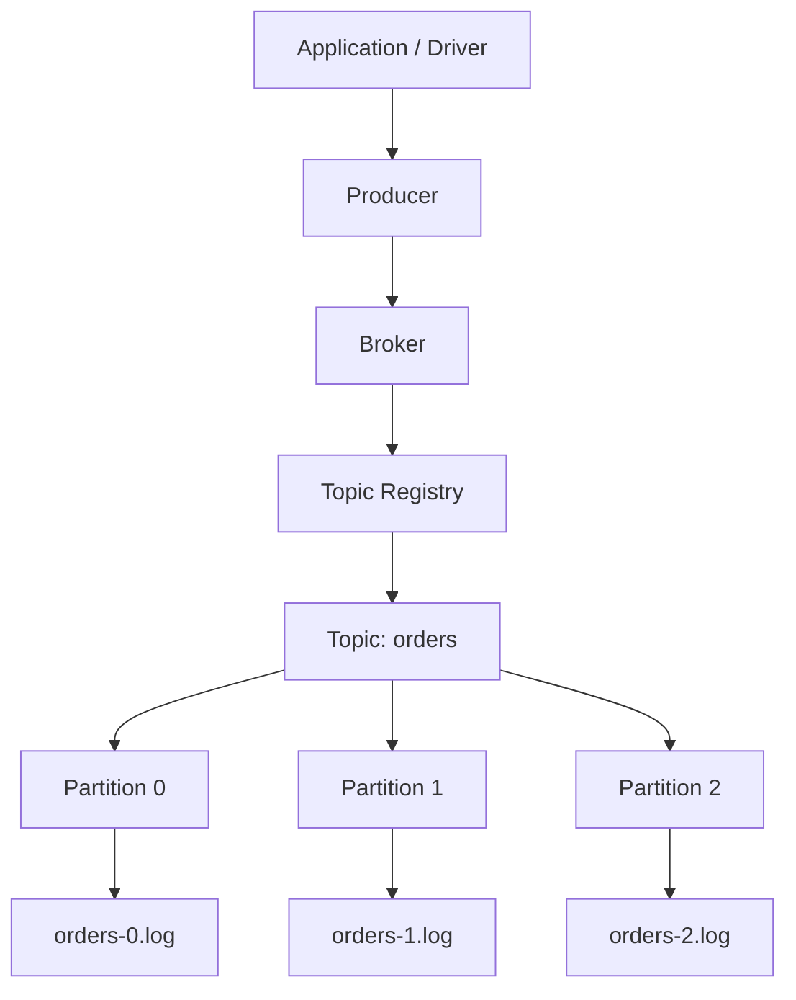
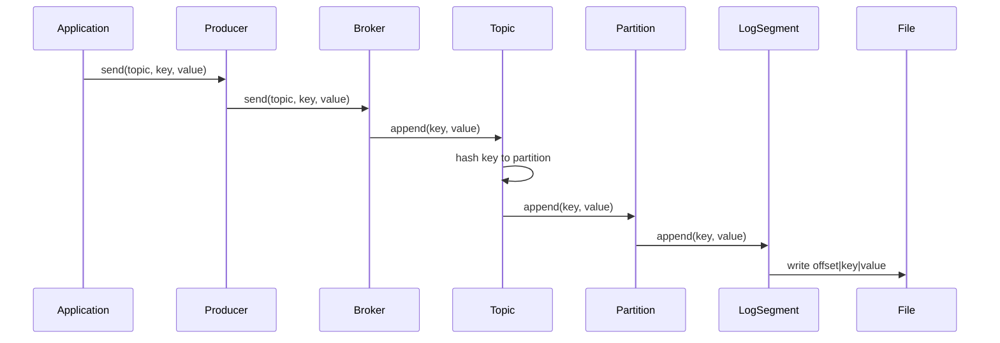

# 011_Producer_API

# MiniKafka Step 11 — Producer API

## Goal

In Step 10, the driver directly called the broker:

```java
broker.send("orders", "customer-1", "order-1-created");
```

But in real Kafka, client code usually talks through a producer API:

```java
producer.send("orders", key, value);
```

In this step, we add:

```java
Producer
```

---

# Big Picture

```text
Application
    |
    v
Producer
    |
    v
Broker
    |
    v
Topic
    |
    v
Partition
    |
    v
LogSegment
    |
    v
Disk
```

---

# Architecture Mermaid Diagram



---

# Request Flow Mermaid Diagram



---

# Folder Structure

```text
MiniKafka/
├── data/
│   └── phase1/
│       ├── orders-0.log
│       ├── orders-1.log
│       └── orders-2.log
└── src/
    └── main/
        └── java/
            └── com/
                └── minikafka/
                    └── step11/
                        ├── MessageRecord.java
                        ├── RecordSerializer.java
                        ├── LogSegment.java
                        ├── Partition.java
                        ├── Topic.java
                        ├── Broker.java
                        ├── Producer.java
                        └── Step11Driver.java
```

---

# CP/DSA Concepts Used

## 1. Hashing

Used for partition routing:

```java
private int calculatePartitionId(String key) {
    int hash = Math.abs(key.hashCode());
    return hash % partitions.size();
}
```

Concept:

```text
same key -> same hash -> same partition
```

This is like hash map bucket selection:

```text
bucket = hash(key) % bucketCount
```

## 2. HashMap

Used in broker:

```java
private final Map<String, Topic> topics;
```

Purpose:

```text
topicName -> Topic object
```

Average lookup:

```text
O(1)
```

## 3. ArrayList

Used in topic:

```java
private final List<Partition> partitions;
```

Purpose:

```text
partitionId -> Partition object
```

Access:

```text
O(1)
```

## 4. Modulo

Used for fixed-range mapping:

```text
partitionId = hash % partitionCount
```

---

# MessageRecord.java

```java
package com.minikafka.step11;

public class MessageRecord {

    private final long offset;
    private final String key;
    private final String value;

    public MessageRecord(long offset, String key, String value) {
        this.offset = offset;
        this.key = key;
        this.value = value;
    }

    public long getOffset() {
        return offset;
    }

    public String getKey() {
        return key;
    }

    public String getValue() {
        return value;
    }

    @Override
    public String toString() {
        return "MessageRecord{" +
                "offset=" + offset +
                ", key='" + key + '\'' +
                ", value='" + value + '\'' +
                '}';
    }
}
```

---

# RecordSerializer.java

```java
package com.minikafka.step11;

public class RecordSerializer {

    public static String serialize(MessageRecord record) {
        return record.getOffset() + "|" + record.getKey() + "|" + record.getValue();
    }

    public static MessageRecord deserialize(String line) {
        String[] parts = line.split("\\|", 3);

        long offset = Long.parseLong(parts[0]);
        String key = parts[1];
        String value = parts[2];

        return new MessageRecord(offset, key, value);
    }
}
```

---

# LogSegment.java

```java
package com.minikafka.step11;

import java.io.IOException;
import java.nio.file.Files;
import java.nio.file.Path;
import java.nio.file.StandardOpenOption;
import java.util.ArrayList;
import java.util.List;
import java.util.stream.Stream;

public class LogSegment {

    private final Path logPath;

    public LogSegment(String filePath) throws IOException {
        this.logPath = Path.of(filePath);

        Files.createDirectories(logPath.getParent());

        if (!Files.exists(logPath)) {
            Files.createFile(logPath);
        }
    }

    public long append(String key, String value) throws IOException {
        long offset = countLines();

        MessageRecord record = new MessageRecord(offset, key, value);
        String line = RecordSerializer.serialize(record);

        Files.writeString(logPath, line + System.lineSeparator(), StandardOpenOption.APPEND);

        return offset;
    }

    public List<MessageRecord> readAll() throws IOException {
        List<MessageRecord> result = new ArrayList<>();
        List<String> lines = Files.readAllLines(logPath);

        for (String line : lines) {
            if (line.isBlank()) {
                continue;
            }

            result.add(RecordSerializer.deserialize(line));
        }

        return result;
    }

    public List<MessageRecord> readFromOffset(long startOffset) throws IOException {
        List<MessageRecord> result = new ArrayList<>();
        List<String> lines = Files.readAllLines(logPath);

        for (String line : lines) {
            if (line.isBlank()) {
                continue;
            }

            MessageRecord record = RecordSerializer.deserialize(line);

            if (record.getOffset() >= startOffset) {
                result.add(record);
            }
        }

        return result;
    }

    private long countLines() throws IOException {
        try (Stream<String> lines = Files.lines(logPath)) {
            return lines.filter(line -> !line.isBlank()).count();
        }
    }
}
```

---

# Partition.java

```java
package com.minikafka.step11;

import java.io.IOException;
import java.util.List;

public class Partition {

    private final int partitionId;
    private final LogSegment segment;

    public Partition(String topicName, int partitionId) throws IOException {
        this.partitionId = partitionId;

        String filePath = "data/phase1/" + topicName + "-" + partitionId + ".log";
        this.segment = new LogSegment(filePath);
    }

    public long append(String key, String value) throws IOException {
        return segment.append(key, value);
    }

    public List<MessageRecord> readAll() throws IOException {
        return segment.readAll();
    }

    public List<MessageRecord> readFromOffset(long offset) throws IOException {
        return segment.readFromOffset(offset);
    }

    public int getPartitionId() {
        return partitionId;
    }
}
```

---

# Topic.java

```java
package com.minikafka.step11;

import java.io.IOException;
import java.util.ArrayList;
import java.util.List;

public class Topic {

    private final String name;
    private final List<Partition> partitions;

    public Topic(String name, int partitionCount) throws IOException {
        if (partitionCount <= 0) {
            throw new IllegalArgumentException("partitionCount must be > 0");
        }

        this.name = name;
        this.partitions = new ArrayList<>();

        for (int partitionId = 0; partitionId < partitionCount; partitionId++) {
            partitions.add(new Partition(name, partitionId));
        }
    }

    public long append(String key, String value) throws IOException {
        int partitionId = calculatePartitionId(key);

        System.out.println(
                "Topic '" + name + "' routed key='" + key + "' to partition " + partitionId
        );

        return appendToPartition(partitionId, key, value);
    }

    public long appendToPartition(int partitionId, String key, String value) throws IOException {
        return getPartition(partitionId).append(key, value);
    }

    public List<MessageRecord> readFromPartition(int partitionId) throws IOException {
        return getPartition(partitionId).readAll();
    }

    public List<MessageRecord> readFromPartitionOffset(int partitionId, long offset)
            throws IOException {

        return getPartition(partitionId).readFromOffset(offset);
    }

    private int calculatePartitionId(String key) {
        int hash = Math.abs(key.hashCode());
        return hash % partitions.size();
    }

    public Partition getPartition(int partitionId) {
        if (partitionId < 0 || partitionId >= partitions.size()) {
            throw new IllegalArgumentException("Invalid partition id: " + partitionId);
        }

        return partitions.get(partitionId);
    }

    public String getName() {
        return name;
    }

    public int getPartitionCount() {
        return partitions.size();
    }
}
```

---

# Broker.java

```java
package com.minikafka.step11;

import java.io.IOException;
import java.util.HashMap;
import java.util.List;
import java.util.Map;

public class Broker {

    private final Map<String, Topic> topics;

    public Broker() {
        this.topics = new HashMap<>();
    }

    public void createTopic(String topicName, int partitionCount) throws IOException {
        if (topics.containsKey(topicName)) {
            throw new IllegalArgumentException("Topic already exists: " + topicName);
        }

        Topic topic = new Topic(topicName, partitionCount);
        topics.put(topicName, topic);

        System.out.println(
                "Broker created topic: " + topicName + " with partitions: " + partitionCount
        );
    }

    public long send(String topicName, String key, String value) throws IOException {
        Topic topic = getTopic(topicName);
        return topic.append(key, value);
    }

    public List<MessageRecord> readPartition(String topicName, int partitionId)
            throws IOException {

        Topic topic = getTopic(topicName);
        return topic.readFromPartition(partitionId);
    }

    public List<MessageRecord> readPartitionFromOffset(
            String topicName,
            int partitionId,
            long offset
    ) throws IOException {

        Topic topic = getTopic(topicName);
        return topic.readFromPartitionOffset(partitionId, offset);
    }

    public Topic getTopic(String topicName) {
        Topic topic = topics.get(topicName);

        if (topic == null) {
            throw new IllegalArgumentException("Topic not found: " + topicName);
        }

        return topic;
    }
}
```

---

# Producer.java

This is the new class in Step 11.

```java
package com.minikafka.step11;

import java.io.IOException;

public class Producer {

    private final Broker broker;

    public Producer(Broker broker) {
        this.broker = broker;
    }

    public long send(String topicName, String key, String value) throws IOException {
        System.out.println(
                "Producer sending message: topic=" + topicName +
                        ", key=" + key +
                        ", value=" + value
        );

        long offset = broker.send(topicName, key, value);

        System.out.println("Producer send success. offset=" + offset);

        return offset;
    }
}
```

---

# Step11Driver.java

```java
package com.minikafka.step11;

import java.util.List;

public class Step11Driver {

    public static void main(String[] args) throws Exception {
        Broker broker = new Broker();

        broker.createTopic("orders", 3);

        Producer producer = new Producer(broker);

        System.out.println();

        producer.send("orders", "customer-1", "order-1-created");
        producer.send("orders", "customer-2", "order-2-created");
        producer.send("orders", "customer-1", "order-1-paid");
        producer.send("orders", "customer-3", "order-3-created");
        producer.send("orders", "customer-2", "order-2-shipped");
        producer.send("orders", "customer-1", "order-1-delivered");

        printPartition(broker, "orders", 0);
        printPartition(broker, "orders", 1);
        printPartition(broker, "orders", 2);
    }

    private static void printPartition(Broker broker, String topicName, int partitionId)
            throws Exception {

        System.out.println();
        System.out.println("---- " + topicName + " PARTITION " + partitionId + " ----");

        List<MessageRecord> records = broker.readPartition(topicName, partitionId);

        for (MessageRecord record : records) {
            System.out.println(record);
        }
    }
}
```

---

# What Happens Internally?

```text
producer.send(topic, key, value)
        |
        v
Producer forwards to Broker
        |
        v
Broker finds Topic using HashMap
        |
        v
Topic hashes key
        |
        v
Partition is selected
        |
        v
LogSegment appends to disk
```

---

# Run Command

```bash
javac -d out src/main/java/com/minikafka/step11/*.java

java -cp out com.minikafka.step11.Step11Driver
```

---

# Expected Output Pattern

Exact partition numbers can vary.

```text
Broker created topic: orders with partitions: 3

Producer sending message: topic=orders, key=customer-1, value=order-1-created
Topic 'orders' routed key='customer-1' to partition X
Producer send success. offset=0
```

Important:

```text
same key goes to same partition
offset is local to that partition
producer hides broker internals
```

---

# Current MiniKafka State

```text
Supported:
[yes] append-only storage
[yes] offsets
[yes] serialization
[yes] LogSegment abstraction
[yes] Partition abstraction
[yes] Topic abstraction
[yes] multiple partitions
[yes] key-based routing
[yes] Broker API
[yes] Producer API

Not yet:
[no] Consumer API
[no] offset commit
[no] consumer groups
[no] batching
[no] retries
[no] replication
```

---

# Step 11 Completion Checklist

```text
[ ] You created Producer class
[ ] You understand producer as client abstraction
[ ] You can send message through producer
[ ] You understand producer -> broker -> topic -> partition
[ ] You understand hash-based partitioning
[ ] You understand HashMap topic registry
```

---

# Next Step

Next we build:

```text
012_Consumer_API
```
