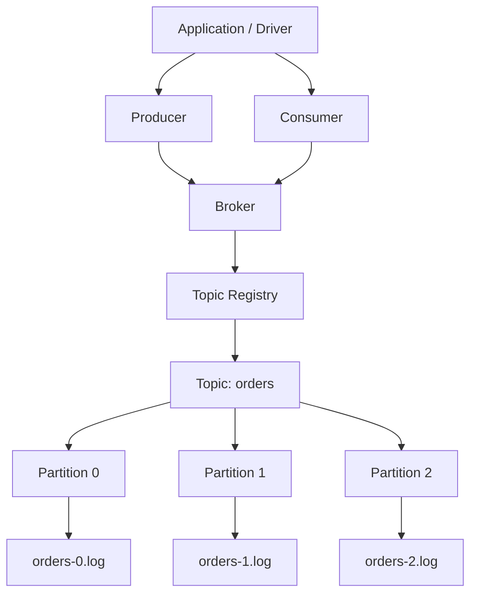
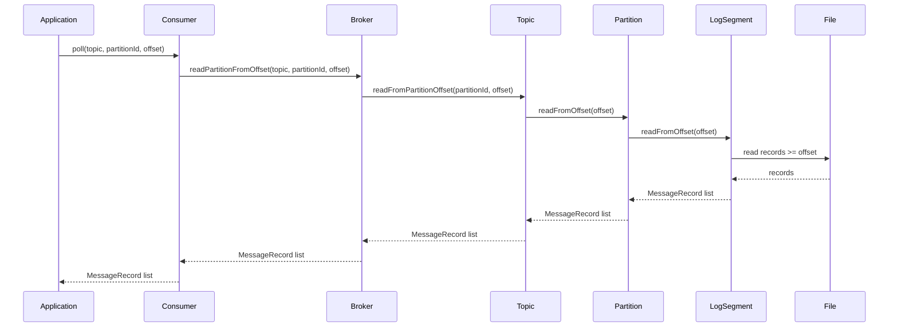
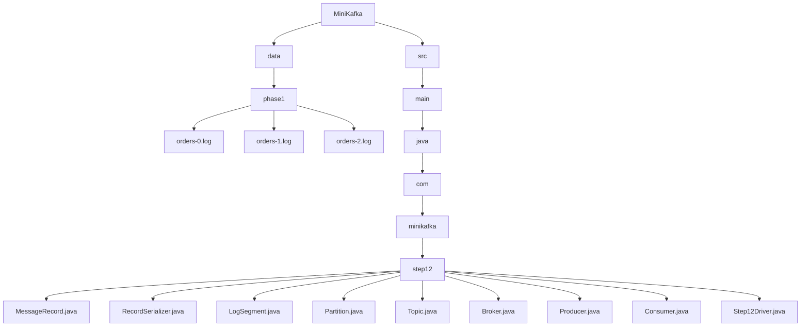

# 012_Consumer_API

# MiniKafka Step 12 — Consumer API

## Goal

In Step 11, we added a clean producer API:

```java
producer.send("orders", key, value);
```

Now we add the matching consumer API:

```java
consumer.poll("orders", partitionId, offset);
```

This step introduces the core Kafka consumer behavior:

```text
read records from a topic partition starting at a given offset
```

---

# Big Picture

```text
Application
    |
    +--> Producer
    |       |
    |       v
    |     Broker
    |
    +--> Consumer
            |
            v
          Broker
            |
            v
          Topic
            |
            v
        Partition
            |
            v
       LogSegment
            |
            v
          Disk
```

---

# Consumer Read Model

Kafka consumers do not read “the whole topic.”

A consumer reads:

```text
topic + partition + offset
```

Example:

```text
topic = orders
partition = 1
offset = 3
```

Meaning:

```text
Read records from orders partition 1 starting at offset 3
```

---

# Architecture Mermaid Diagram



---

# Consumer Poll Flow Mermaid Diagram



---

# Folder Structure

```text
MiniKafka/
├── data/
│   └── phase1/
│       ├── orders-0.log
│       ├── orders-1.log
│       └── orders-2.log
└── src/
    └── main/
        └── java/
            └── com/
                └── minikafka/
                    └── step12/
                        ├── MessageRecord.java
                        ├── RecordSerializer.java
                        ├── LogSegment.java
                        ├── Partition.java
                        ├── Topic.java
                        ├── Broker.java
                        ├── Producer.java
                        ├── Consumer.java
                        └── Step12Driver.java
```

## Folder Mermaid Diagram



---

# CP/DSA Concepts Used

## 1. Sequential Scan

Used in:

```java
public List<MessageRecord> readFromOffset(long startOffset)
```

The log file is scanned line by line.

Complexity:

```text
O(n)
```

where `n` is number of records in the partition log.

Later, we will optimize this with an index file.

---

## 2. Filtering

Used here:

```java
if (record.getOffset() >= startOffset) {
    result.add(record);
}
```

This is the same idea as filtering an array/list by condition.

---

## 3. ArrayList Result Collection

Used here:

```java
List<MessageRecord> result = new ArrayList<>();
```

We collect matching records into a dynamic array.

Append complexity:

```text
Amortized O(1)
```

---

## 4. HashMap Lookup

Broker uses:

```java
private final Map<String, Topic> topics;
```

To find topic:

```java
Topic topic = topics.get(topicName);
```

Average complexity:

```text
O(1)
```

---

## 5. Offset As Pointer

Consumer offset behaves like an array pointer/index.

Example:

```text
offset = 3
```

means:

```text
start reading from logical index 3
```

This is similar to CP two-pointer/index-based scanning patterns.

---

# MessageRecord.java

```java
package com.minikafka.step12;

public class MessageRecord {

    private final long offset;
    private final String key;
    private final String value;

    public MessageRecord(long offset, String key, String value) {
        this.offset = offset;
        this.key = key;
        this.value = value;
    }

    public long getOffset() {
        return offset;
    }

    public String getKey() {
        return key;
    }

    public String getValue() {
        return value;
    }

    @Override
    public String toString() {
        return "MessageRecord{" +
                "offset=" + offset +
                ", key='" + key + '\'' +
                ", value='" + value + '\'' +
                '}';
    }
}
```

---

# RecordSerializer.java

```java
package com.minikafka.step12;

public class RecordSerializer {

    public static String serialize(MessageRecord record) {
        return record.getOffset() + "|" + record.getKey() + "|" + record.getValue();
    }

    public static MessageRecord deserialize(String line) {
        String[] parts = line.split("\\|", 3);

        long offset = Long.parseLong(parts[0]);
        String key = parts[1];
        String value = parts[2];

        return new MessageRecord(offset, key, value);
    }
}
```

---

# LogSegment.java

```java
package com.minikafka.step12;

import java.io.IOException;
import java.nio.file.Files;
import java.nio.file.Path;
import java.nio.file.StandardOpenOption;
import java.util.ArrayList;
import java.util.List;
import java.util.stream.Stream;

public class LogSegment {

    private final Path logPath;

    public LogSegment(String filePath) throws IOException {
        this.logPath = Path.of(filePath);

        Files.createDirectories(logPath.getParent());

        if (!Files.exists(logPath)) {
            Files.createFile(logPath);
        }
    }

    public long append(String key, String value) throws IOException {
        long offset = countLines();

        MessageRecord record = new MessageRecord(offset, key, value);
        String line = RecordSerializer.serialize(record);

        Files.writeString(logPath, line + System.lineSeparator(), StandardOpenOption.APPEND);

        return offset;
    }

    public List<MessageRecord> readAll() throws IOException {
        List<MessageRecord> result = new ArrayList<>();
        List<String> lines = Files.readAllLines(logPath);

        for (String line : lines) {
            if (line.isBlank()) {
                continue;
            }

            result.add(RecordSerializer.deserialize(line));
        }

        return result;
    }

    public List<MessageRecord> readFromOffset(long startOffset) throws IOException {
        List<MessageRecord> result = new ArrayList<>();
        List<String> lines = Files.readAllLines(logPath);

        for (String line : lines) {
            if (line.isBlank()) {
                continue;
            }

            MessageRecord record = RecordSerializer.deserialize(line);

            if (record.getOffset() >= startOffset) {
                result.add(record);
            }
        }

        return result;
    }

    private long countLines() throws IOException {
        try (Stream<String> lines = Files.lines(logPath)) {
            return lines.filter(line -> !line.isBlank()).count();
        }
    }
}
```

---

# Partition.java

```java
package com.minikafka.step12;

import java.io.IOException;
import java.util.List;

public class Partition {

    private final int partitionId;
    private final LogSegment segment;

    public Partition(String topicName, int partitionId) throws IOException {
        this.partitionId = partitionId;

        String filePath = "data/phase1/" + topicName + "-" + partitionId + ".log";
        this.segment = new LogSegment(filePath);
    }

    public long append(String key, String value) throws IOException {
        return segment.append(key, value);
    }

    public List<MessageRecord> readAll() throws IOException {
        return segment.readAll();
    }

    public List<MessageRecord> readFromOffset(long offset) throws IOException {
        return segment.readFromOffset(offset);
    }

    public int getPartitionId() {
        return partitionId;
    }
}
```

---

# Topic.java

```java
package com.minikafka.step12;

import java.io.IOException;
import java.util.ArrayList;
import java.util.List;

public class Topic {

    private final String name;
    private final List<Partition> partitions;

    public Topic(String name, int partitionCount) throws IOException {
        if (partitionCount <= 0) {
            throw new IllegalArgumentException("partitionCount must be > 0");
        }

        this.name = name;
        this.partitions = new ArrayList<>();

        for (int partitionId = 0; partitionId < partitionCount; partitionId++) {
            partitions.add(new Partition(name, partitionId));
        }
    }

    public long append(String key, String value) throws IOException {
        int partitionId = calculatePartitionId(key);

        System.out.println(
                "Topic '" + name + "' routed key='" + key + "' to partition " + partitionId
        );

        return appendToPartition(partitionId, key, value);
    }

    public long appendToPartition(int partitionId, String key, String value) throws IOException {
        return getPartition(partitionId).append(key, value);
    }

    public List<MessageRecord> readFromPartition(int partitionId) throws IOException {
        return getPartition(partitionId).readAll();
    }

    public List<MessageRecord> readFromPartitionOffset(int partitionId, long offset)
            throws IOException {

        return getPartition(partitionId).readFromOffset(offset);
    }

    private int calculatePartitionId(String key) {
        int hash = Math.abs(key.hashCode());
        return hash % partitions.size();
    }

    public Partition getPartition(int partitionId) {
        if (partitionId < 0 || partitionId >= partitions.size()) {
            throw new IllegalArgumentException("Invalid partition id: " + partitionId);
        }

        return partitions.get(partitionId);
    }

    public String getName() {
        return name;
    }

    public int getPartitionCount() {
        return partitions.size();
    }
}
```

---

# Broker.java

```java
package com.minikafka.step12;

import java.io.IOException;
import java.util.HashMap;
import java.util.List;
import java.util.Map;

public class Broker {

    private final Map<String, Topic> topics;

    public Broker() {
        this.topics = new HashMap<>();
    }

    public void createTopic(String topicName, int partitionCount) throws IOException {
        if (topics.containsKey(topicName)) {
            throw new IllegalArgumentException("Topic already exists: " + topicName);
        }

        Topic topic = new Topic(topicName, partitionCount);
        topics.put(topicName, topic);

        System.out.println(
                "Broker created topic: " + topicName + " with partitions: " + partitionCount
        );
    }

    public long send(String topicName, String key, String value) throws IOException {
        Topic topic = getTopic(topicName);
        return topic.append(key, value);
    }

    public List<MessageRecord> readPartition(String topicName, int partitionId)
            throws IOException {

        Topic topic = getTopic(topicName);
        return topic.readFromPartition(partitionId);
    }

    public List<MessageRecord> readPartitionFromOffset(
            String topicName,
            int partitionId,
            long offset
    ) throws IOException {

        Topic topic = getTopic(topicName);
        return topic.readFromPartitionOffset(partitionId, offset);
    }

    public Topic getTopic(String topicName) {
        Topic topic = topics.get(topicName);

        if (topic == null) {
            throw new IllegalArgumentException("Topic not found: " + topicName);
        }

        return topic;
    }
}
```

---

# Producer.java

```java
package com.minikafka.step12;

import java.io.IOException;

public class Producer {

    private final Broker broker;

    public Producer(Broker broker) {
        this.broker = broker;
    }

    public long send(String topicName, String key, String value) throws IOException {
        System.out.println(
                "Producer sending message: topic=" + topicName +
                        ", key=" + key +
                        ", value=" + value
        );

        long offset = broker.send(topicName, key, value);

        System.out.println("Producer send success. offset=" + offset);

        return offset;
    }
}
```

---

# Consumer.java

This is the new class in Step 12.

```java
package com.minikafka.step12;

import java.io.IOException;
import java.util.List;

public class Consumer {

    private final Broker broker;

    public Consumer(Broker broker) {
        this.broker = broker;
    }

    public List<MessageRecord> poll(String topicName, int partitionId, long offset)
            throws IOException {

        System.out.println(
                "Consumer polling: topic=" + topicName +
                        ", partition=" + partitionId +
                        ", offset=" + offset
        );

        List<MessageRecord> records =
                broker.readPartitionFromOffset(topicName, partitionId, offset);

        System.out.println("Consumer received records: " + records.size());

        return records;
    }
}
```

---

# Step12Driver.java

```java
package com.minikafka.step12;

import java.util.List;

public class Step12Driver {

    public static void main(String[] args) throws Exception {
        Broker broker = new Broker();

        broker.createTopic("orders", 3);

        Producer producer = new Producer(broker);
        Consumer consumer = new Consumer(broker);

        System.out.println();

        producer.send("orders", "customer-1", "order-1-created");
        producer.send("orders", "customer-2", "order-2-created");
        producer.send("orders", "customer-1", "order-1-paid");
        producer.send("orders", "customer-3", "order-3-created");
        producer.send("orders", "customer-2", "order-2-shipped");
        producer.send("orders", "customer-1", "order-1-delivered");

        System.out.println();
        System.out.println("---- CONSUMER POLL PARTITION 0 FROM OFFSET 0 ----");

        List<MessageRecord> firstPoll = consumer.poll("orders", 0, 0);

        for (MessageRecord record : firstPoll) {
            System.out.println(record);
        }

        System.out.println();
        System.out.println("---- CONSUMER POLL PARTITION 0 FROM OFFSET 1 ----");

        List<MessageRecord> secondPoll = consumer.poll("orders", 0, 1);

        for (MessageRecord record : secondPoll) {
            System.out.println(record);
        }

        System.out.println();
        System.out.println("---- CONSUMER POLL PARTITION 1 FROM OFFSET 0 ----");

        List<MessageRecord> thirdPoll = consumer.poll("orders", 1, 0);

        for (MessageRecord record : thirdPoll) {
            System.out.println(record);
        }
    }
}
```

---

# What Happens Internally?

When this runs:

```java
consumer.poll("orders", 0, 1);
```

Flow:

```text
Consumer receives poll request
        |
        v
Consumer asks Broker
        |
        v
Broker finds Topic
        |
        v
Topic finds Partition 0
        |
        v
Partition asks LogSegment
        |
        v
LogSegment scans records
        |
        v
returns records with offset >= 1
```

---

# Consumer Offset Mental Model

Consumer offset is not stored yet.

In this step, the caller passes offset manually:

```java
consumer.poll("orders", 0, 1);
```

Later, we will store committed offsets:

```text
consumer group -> topic -> partition -> committed offset
```

---

# Run Command

```bash
javac -d out src/main/java/com/minikafka/step12/*.java

java -cp out com.minikafka.step12.Step12Driver
```

---

# Expected Output Pattern

Exact partition numbers depend on Java hash result.

Example pattern:

```text
Broker created topic: orders with partitions: 3

Producer sending message...
Topic 'orders' routed key='customer-1' to partition X
Producer send success. offset=0

---- CONSUMER POLL PARTITION 0 FROM OFFSET 0 ----
Consumer polling: topic=orders, partition=0, offset=0
Consumer received records: N
```

Important:

```text
consumer reads from topic + partition + offset
offset controls where reading begins
```

---

# Current MiniKafka State

```text
Supported:
[yes] append-only storage
[yes] offsets
[yes] serialization
[yes] LogSegment abstraction
[yes] Partition abstraction
[yes] Topic abstraction
[yes] multiple partitions
[yes] key-based routing
[yes] Broker API
[yes] Producer API
[yes] Consumer API
[yes] poll from offset

Not yet:
[no] automatic offset commit
[no] consumer groups
[no] partition assignment
[no] rebalancing
[no] batching
[no] replication
```

---

# Step 12 Completion Checklist

```text
[ ] You created Consumer class
[ ] You understand poll(topic, partition, offset)
[ ] You understand consumer offset as pointer
[ ] You understand offset-based reads
[ ] You understand why current read is O(n)
[ ] You understand future index optimization
```

---

# Final Mental Model

```text
Consumer does not read topic directly.

Consumer reads:
topic + partition + offset
```

---

# Next Step

Next we build:

```text
013_Consumer_Offset_Commit
```

Then the consumer will remember progress instead of manually passing offset every time.
