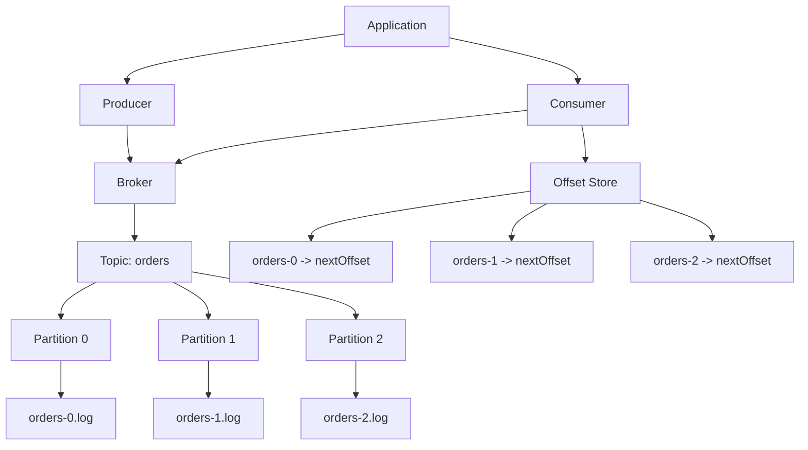
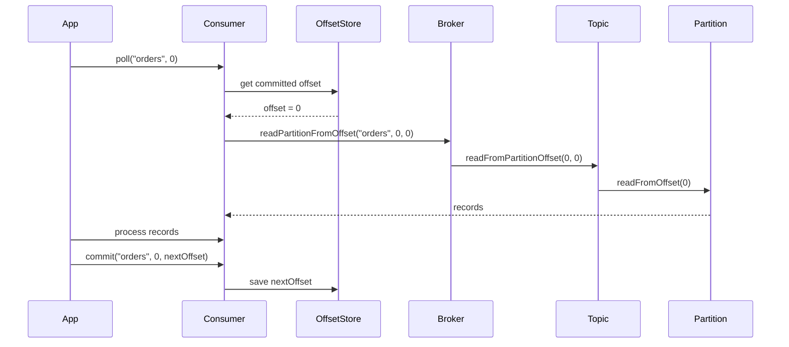
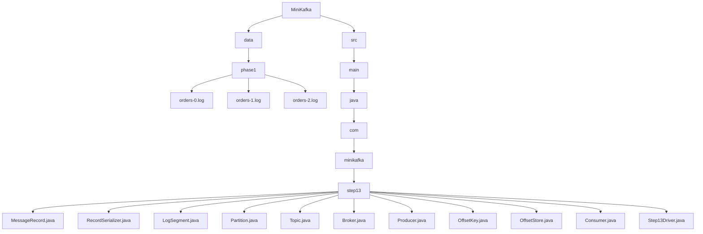

# 013_Consumer_Offset_Commit

# MiniKafka Step 13 — Consumer Offset Commit

## Goal

In Step 12, the consumer had to manually pass the offset:

```java
consumer.poll("orders", 0, 0);
consumer.poll("orders", 0, 1);
```

But real Kafka consumers remember their progress by committing offsets.

In this step, we add:

```java
commit(topic, partitionId, nextOffset)
```

and:

```java
poll(topic, partitionId)
```

Now the consumer can automatically resume from the last committed offset.

---

# Big Picture

Before:

```text
Consumer must manually provide offset
```

After:

```text
Consumer stores committed offset
Consumer polls from committed offset
Consumer commits next offset after processing
```

---

# Kafka Offset Rule

Important:

```text
Committed offset = next record to read
```

Example:

```text
Processed offset 0
Commit offset 1
```

Meaning:

```text
Next poll starts from offset 1
```

If processed:

```text
0, 1, 2
```

commit:

```text
3
```

---

# Architecture Mermaid Diagram



---

# Offset Commit Flow Mermaid Diagram



---

# Folder Structure

```text
MiniKafka/
├── data/
│   └── phase1/
│       ├── orders-0.log
│       ├── orders-1.log
│       └── orders-2.log
└── src/
    └── main/
        └── java/
            └── com/
                └── minikafka/
                    └── step13/
                        ├── MessageRecord.java
                        ├── RecordSerializer.java
                        ├── LogSegment.java
                        ├── Partition.java
                        ├── Topic.java
                        ├── Broker.java
                        ├── Producer.java
                        ├── OffsetKey.java
                        ├── OffsetStore.java
                        ├── Consumer.java
                        └── Step13Driver.java
```

## Folder Mermaid Diagram



---

# CP/DSA Concepts Used

## 1. HashMap As Offset Store

Used in:

```java
private final Map<OffsetKey, Long> committedOffsets;
```

Purpose:

```text
(topic, partitionId) -> committed offset
```

Average complexity:

```text
get offset: O(1)
commit offset: O(1)
```

This is like CP memoization/cache map.

---

## 2. Composite Key

We need key made from:

```text
topicName + partitionId
```

So we create:

```java
OffsetKey
```

This is similar to CP problems where key is:

```text
(row, col)
(node, state)
(index, mask)
```

---

## 3. Pointer / Index Tracking

Committed offset acts like an array pointer.

```text
offset = next index to read
```

This is similar to two-pointer or index simulation.

---

## 4. Sequential Scan

Current log read is still:

```text
O(n)
```

because we scan lines and filter by offset.

Later, with an index file, we will improve lookup.

---

# MessageRecord.java

```java
package com.minikafka.step13;

public class MessageRecord {

    private final long offset;
    private final String key;
    private final String value;

    public MessageRecord(long offset, String key, String value) {
        this.offset = offset;
        this.key = key;
        this.value = value;
    }

    public long getOffset() {
        return offset;
    }

    public String getKey() {
        return key;
    }

    public String getValue() {
        return value;
    }

    @Override
    public String toString() {
        return "MessageRecord{" +
                "offset=" + offset +
                ", key='" + key + '\'' +
                ", value='" + value + '\'' +
                '}';
    }
}
```

---

# RecordSerializer.java

```java
package com.minikafka.step13;

public class RecordSerializer {

    public static String serialize(MessageRecord record) {
        return record.getOffset() + "|" + record.getKey() + "|" + record.getValue();
    }

    public static MessageRecord deserialize(String line) {
        String[] parts = line.split("\\|", 3);

        long offset = Long.parseLong(parts[0]);
        String key = parts[1];
        String value = parts[2];

        return new MessageRecord(offset, key, value);
    }
}
```

---

# LogSegment.java

```java
package com.minikafka.step13;

import java.io.IOException;
import java.nio.file.Files;
import java.nio.file.Path;
import java.nio.file.StandardOpenOption;
import java.util.ArrayList;
import java.util.List;
import java.util.stream.Stream;

public class LogSegment {

    private final Path logPath;

    public LogSegment(String filePath) throws IOException {
        this.logPath = Path.of(filePath);

        Files.createDirectories(logPath.getParent());

        if (!Files.exists(logPath)) {
            Files.createFile(logPath);
        }
    }

    public long append(String key, String value) throws IOException {
        long offset = countLines();

        MessageRecord record = new MessageRecord(offset, key, value);
        String line = RecordSerializer.serialize(record);

        Files.writeString(logPath, line + System.lineSeparator(), StandardOpenOption.APPEND);

        return offset;
    }

    public List<MessageRecord> readFromOffset(long startOffset) throws IOException {
        List<MessageRecord> result = new ArrayList<>();
        List<String> lines = Files.readAllLines(logPath);

        for (String line : lines) {
            if (line.isBlank()) {
                continue;
            }

            MessageRecord record = RecordSerializer.deserialize(line);

            if (record.getOffset() >= startOffset) {
                result.add(record);
            }
        }

        return result;
    }

    private long countLines() throws IOException {
        try (Stream<String> lines = Files.lines(logPath)) {
            return lines.filter(line -> !line.isBlank()).count();
        }
    }
}
```

---

# Partition.java

```java
package com.minikafka.step13;

import java.io.IOException;
import java.util.List;

public class Partition {

    private final int partitionId;
    private final LogSegment segment;

    public Partition(String topicName, int partitionId) throws IOException {
        this.partitionId = partitionId;

        String filePath = "data/phase1/" + topicName + "-" + partitionId + ".log";
        this.segment = new LogSegment(filePath);
    }

    public long append(String key, String value) throws IOException {
        return segment.append(key, value);
    }

    public List<MessageRecord> readFromOffset(long offset) throws IOException {
        return segment.readFromOffset(offset);
    }

    public int getPartitionId() {
        return partitionId;
    }
}
```

---

# Topic.java

```java
package com.minikafka.step13;

import java.io.IOException;
import java.util.ArrayList;
import java.util.List;

public class Topic {

    private final String name;
    private final List<Partition> partitions;

    public Topic(String name, int partitionCount) throws IOException {
        if (partitionCount <= 0) {
            throw new IllegalArgumentException("partitionCount must be > 0");
        }

        this.name = name;
        this.partitions = new ArrayList<>();

        for (int partitionId = 0; partitionId < partitionCount; partitionId++) {
            partitions.add(new Partition(name, partitionId));
        }
    }

    public long append(String key, String value) throws IOException {
        int partitionId = calculatePartitionId(key);

        System.out.println(
                "Topic '" + name + "' routed key='" + key + "' to partition " + partitionId
        );

        return appendToPartition(partitionId, key, value);
    }

    public long appendToPartition(int partitionId, String key, String value) throws IOException {
        return getPartition(partitionId).append(key, value);
    }

    public List<MessageRecord> readFromPartitionOffset(int partitionId, long offset)
            throws IOException {

        return getPartition(partitionId).readFromOffset(offset);
    }

    private int calculatePartitionId(String key) {
        int hash = Math.abs(key.hashCode());
        return hash % partitions.size();
    }

    public Partition getPartition(int partitionId) {
        if (partitionId < 0 || partitionId >= partitions.size()) {
            throw new IllegalArgumentException("Invalid partition id: " + partitionId);
        }

        return partitions.get(partitionId);
    }
}
```

---

# Broker.java

```java
package com.minikafka.step13;

import java.io.IOException;
import java.util.HashMap;
import java.util.List;
import java.util.Map;

public class Broker {

    private final Map<String, Topic> topics;

    public Broker() {
        this.topics = new HashMap<>();
    }

    public void createTopic(String topicName, int partitionCount) throws IOException {
        if (topics.containsKey(topicName)) {
            throw new IllegalArgumentException("Topic already exists: " + topicName);
        }

        Topic topic = new Topic(topicName, partitionCount);
        topics.put(topicName, topic);

        System.out.println(
                "Broker created topic: " + topicName + " with partitions: " + partitionCount
        );
    }

    public long send(String topicName, String key, String value) throws IOException {
        Topic topic = getTopic(topicName);
        return topic.append(key, value);
    }

    public List<MessageRecord> readPartitionFromOffset(
            String topicName,
            int partitionId,
            long offset
    ) throws IOException {

        Topic topic = getTopic(topicName);
        return topic.readFromPartitionOffset(partitionId, offset);
    }

    private Topic getTopic(String topicName) {
        Topic topic = topics.get(topicName);

        if (topic == null) {
            throw new IllegalArgumentException("Topic not found: " + topicName);
        }

        return topic;
    }
}
```

---

# Producer.java

```java
package com.minikafka.step13;

import java.io.IOException;

public class Producer {

    private final Broker broker;

    public Producer(Broker broker) {
        this.broker = broker;
    }

    public long send(String topicName, String key, String value) throws IOException {
        System.out.println(
                "Producer sending: topic=" + topicName +
                        ", key=" + key +
                        ", value=" + value
        );

        return broker.send(topicName, key, value);
    }
}
```

---

# OffsetKey.java

This class represents:

```text
topic + partitionId
```

It is used as the key inside the offset store map.

```java
package com.minikafka.step13;

import java.util.Objects;

public class OffsetKey {

    private final String topicName;
    private final int partitionId;

    public OffsetKey(String topicName, int partitionId) {
        this.topicName = topicName;
        this.partitionId = partitionId;
    }

    @Override
    public boolean equals(Object other) {
        if (this == other) {
            return true;
        }

        if (!(other instanceof OffsetKey)) {
            return false;
        }

        OffsetKey that = (OffsetKey) other;

        return partitionId == that.partitionId
                && Objects.equals(topicName, that.topicName);
    }

    @Override
    public int hashCode() {
        return Objects.hash(topicName, partitionId);
    }

    @Override
    public String toString() {
        return topicName + "-" + partitionId;
    }
}
```

---

# OffsetStore.java

This stores committed offsets in memory.

```java
package com.minikafka.step13;

import java.util.HashMap;
import java.util.Map;

public class OffsetStore {

    private final Map<OffsetKey, Long> committedOffsets;

    public OffsetStore() {
        this.committedOffsets = new HashMap<>();
    }

    public long getCommittedOffset(String topicName, int partitionId) {
        OffsetKey key = new OffsetKey(topicName, partitionId);

        return committedOffsets.getOrDefault(key, 0L);
    }

    public void commit(String topicName, int partitionId, long nextOffset) {
        OffsetKey key = new OffsetKey(topicName, partitionId);

        committedOffsets.put(key, nextOffset);

        System.out.println(
                "Committed offset: " + key + " -> " + nextOffset
        );
    }
}
```

---

# Consumer.java

Now consumer can poll from committed offset automatically.

```java
package com.minikafka.step13;

import java.io.IOException;
import java.util.List;

public class Consumer {

    private final Broker broker;
    private final OffsetStore offsetStore;

    public Consumer(Broker broker, OffsetStore offsetStore) {
        this.broker = broker;
        this.offsetStore = offsetStore;
    }

    public List<MessageRecord> poll(String topicName, int partitionId)
            throws IOException {

        long committedOffset =
                offsetStore.getCommittedOffset(topicName, partitionId);

        System.out.println(
                "Consumer polling: topic=" + topicName +
                        ", partition=" + partitionId +
                        ", committedOffset=" + committedOffset
        );

        return broker.readPartitionFromOffset(topicName, partitionId, committedOffset);
    }

    public void commit(String topicName, int partitionId, long nextOffset) {
        offsetStore.commit(topicName, partitionId, nextOffset);
    }
}
```

---

# Step13Driver.java

```java
package com.minikafka.step13;

import java.util.List;

public class Step13Driver {

    public static void main(String[] args) throws Exception {
        Broker broker = new Broker();

        broker.createTopic("orders", 3);

        Producer producer = new Producer(broker);

        OffsetStore offsetStore = new OffsetStore();
        Consumer consumer = new Consumer(broker, offsetStore);

        System.out.println();

        producer.send("orders", "customer-1", "order-1-created");
        producer.send("orders", "customer-1", "order-1-paid");
        producer.send("orders", "customer-1", "order-1-shipped");

        System.out.println();
        System.out.println("---- FIRST POLL PARTITION 0 ----");

        List<MessageRecord> firstPoll = consumer.poll("orders", 0);
        long nextOffset = processRecords(firstPoll);

        consumer.commit("orders", 0, nextOffset);

        System.out.println();
        System.out.println("---- PRODUCE MORE MESSAGES ----");

        producer.send("orders", "customer-1", "order-1-delivered");
        producer.send("orders", "customer-1", "order-1-reviewed");

        System.out.println();
        System.out.println("---- SECOND POLL PARTITION 0 ----");

        List<MessageRecord> secondPoll = consumer.poll("orders", 0);
        long finalOffset = processRecords(secondPoll);

        consumer.commit("orders", 0, finalOffset);
    }

    private static long processRecords(List<MessageRecord> records) {
        long nextOffset = 0;

        for (MessageRecord record : records) {
            System.out.println("Processing: " + record);
            nextOffset = record.getOffset() + 1;
        }

        return nextOffset;
    }
}
```

---

# Important Driver Note

Because partition routing depends on Java hash, `customer-1` may not route to partition 0 on your machine/run.

If `FIRST POLL PARTITION 0` returns no records, check the producer output:

```text
Topic 'orders' routed key='customer-1' to partition X
```

Then poll that partition:

```java
consumer.poll("orders", X);
consumer.commit("orders", X, nextOffset);
```

In later steps, we will expose routing metadata more cleanly.

---

# What Happens Internally?

First poll:

```text
OffsetStore has no offset
default committed offset = 0
consumer reads from offset 0
consumer processes records
consumer commits next offset
```

Second poll:

```text
OffsetStore has committed offset
consumer resumes from committed offset
old records are not reprocessed
```

---

# Run Command

```bash
javac -d out src/main/java/com/minikafka/step13/*.java

java -cp out com.minikafka.step13.Step13Driver
```

---

# Expected Output Pattern

```text
Consumer polling: topic=orders, partition=0, committedOffset=0
Processing: MessageRecord{offset=0, ...}
Processing: MessageRecord{offset=1, ...}
Committed offset: orders-0 -> 2

Consumer polling: topic=orders, partition=0, committedOffset=2
Processing: MessageRecord{offset=2, ...}
Committed offset: orders-0 -> 3
```

Actual partition may differ based on hash routing.

---

# Current MiniKafka State

```text
Supported:
[yes] append-only storage
[yes] offsets
[yes] serialization
[yes] LogSegment abstraction
[yes] Partition abstraction
[yes] Topic abstraction
[yes] multiple partitions
[yes] key-based routing
[yes] Broker API
[yes] Producer API
[yes] Consumer API
[yes] offset commit

Not yet:
[no] consumer groups
[no] partition assignment
[no] rebalancing
[no] persistent offset storage
[no] replication
```

---

# Step 13 Completion Checklist

```text
[ ] You created OffsetKey
[ ] You created OffsetStore
[ ] You understand committed offset = next offset to read
[ ] You understand HashMap-based offset tracking
[ ] You understand manual commit
[ ] You understand resume consumption
```

---

# Final Mental Model

```text
Consumer polls from committed offset
          |
          v
Processes records
          |
          v
Commits next offset
          |
          v
Next poll resumes from committed offset
```

---

# Next Step

Next we build:

```text
014_Consumer_Groups
```

Then offsets will become:

```text
consumerGroupId + topic + partition -> committed offset
```
