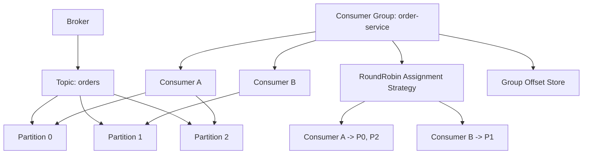
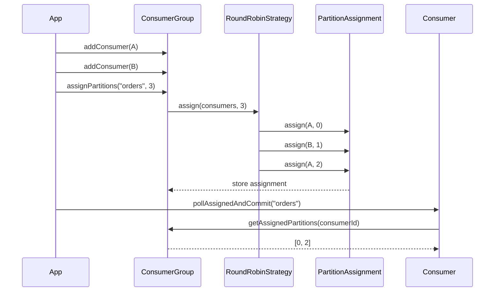

# 015_Partition_Assignment

# MiniKafka Step 15 — Partition Assignment

## Goal

In Step 14, consumer group offsets worked, but partition polling was still manual:

```java
pollProcessCommit(consumerA, "orders", 0);
pollProcessCommit(consumerB, "orders", 1);
pollProcessCommit(consumerA, "orders", 2);
```

In real Kafka, consumers inside a consumer group do not manually choose partitions. Kafka assigns partitions to consumers.

In this step, we build automatic partition assignment.

---

# Delta From Step 14

```text
Step 14:
Consumer group existed.
Consumers shared group offsets.
Driver manually decided which consumer reads which partition.

Step 15:
ConsumerGroup stores consumers.
ConsumerGroup assigns partitions automatically.
Consumer polls only assigned partitions.
```

New classes:

```text
PartitionAssignment
PartitionAssignmentStrategy
RoundRobinPartitionAssignmentStrategy
```

Modified classes:

```text
ConsumerGroup
Consumer
Step15Driver
```

---

# What We Are Building

We use simple round-robin partition assignment.

Example:

```text
Partitions: 0, 1, 2, 3
Consumers: consumer-A, consumer-B
```

Assignment:

```text
consumer-A -> 0, 2
consumer-B -> 1, 3
```

Formula:

```text
consumerIndex = partitionId % consumerCount
```

---

# Detailed Steps Before Code

## Step 1 — Keep existing storage layers

These classes remain complete and runnable:

```text
MessageRecord
RecordSerializer
LogSegment
Partition
Topic
Broker
Producer
```

## Step 2 — Keep group offset tracking

Offset identity remains:

```text
groupId + topic + partition -> committed offset
```

Handled by:

```text
GroupOffsetKey
GroupOffsetStore
```

## Step 3 — Add consumer membership

Consumer group now stores consumers:

```java
List<Consumer> consumers;
```

## Step 4 — Add assignment result

We create:

```java
PartitionAssignment
```

It stores:

```text
consumerId -> list of partition ids
```

## Step 5 — Add assignment strategy

We create:

```java
PartitionAssignmentStrategy
```

Then implement:

```java
RoundRobinPartitionAssignmentStrategy
```

## Step 6 — Assign partitions

Consumer group calls:

```java
assignPartitions("orders", partitionCount);
```

## Step 7 — Consumer polls assigned partitions

Consumer calls:

```java
pollAssignedAndCommit("orders");
```

It polls only partitions assigned to that consumer.

---

# Architecture Mermaid Diagram



---

# Assignment Flow Mermaid Diagram



---

# Folder Structure

```text
MiniKafka/
└── src/main/java/com/minikafka/step15/
    ├── MessageRecord.java
    ├── RecordSerializer.java
    ├── LogSegment.java
    ├── Partition.java
    ├── Topic.java
    ├── Broker.java
    ├── Producer.java
    ├── GroupOffsetKey.java
    ├── GroupOffsetStore.java
    ├── PartitionAssignment.java
    ├── PartitionAssignmentStrategy.java
    ├── RoundRobinPartitionAssignmentStrategy.java
    ├── ConsumerGroup.java
    ├── Consumer.java
    └── Step15Driver.java
```

---

# CP/DSA Concepts Used

## 1. Round-Robin Distribution

Used here:

```java
int consumerIndex = partitionId % consumers.size();
```

This is cyclic assignment.

Complexity:

```text
O(P)
```

where `P = partitionCount`.

## 2. HashMap of Lists

Used here:

```java
Map<String, List<Integer>> assignment;
```

This is like graph adjacency list:

```text
consumer -> assigned partitions
node -> neighbors
```

## 3. Composite HashMap Key

Used for offsets:

```java
Map<GroupOffsetKey, Long> committedOffsets;
```

This is like CP state mapping:

```text
(group, topic, partition) -> offset
```

## 4. Work Distribution

Partitions are independent work units. This is like splitting tasks among workers.

---

# Complete Java Code

---

# MessageRecord.java

```java
package com.minikafka.step15;

public class MessageRecord {

    private final long offset;
    private final String key;
    private final String value;

    public MessageRecord(long offset, String key, String value) {
        this.offset = offset;
        this.key = key;
        this.value = value;
    }

    public long getOffset() {
        return offset;
    }

    public String getKey() {
        return key;
    }

    public String getValue() {
        return value;
    }

    @Override
    public String toString() {
        return "MessageRecord{" +
                "offset=" + offset +
                ", key='" + key + '\'' +
                ", value='" + value + '\'' +
                '}';
    }
}
```

---

# RecordSerializer.java

```java
package com.minikafka.step15;

public class RecordSerializer {

    public static String serialize(MessageRecord record) {
        return record.getOffset() + "|" + record.getKey() + "|" + record.getValue();
    }

    public static MessageRecord deserialize(String line) {
        String[] parts = line.split("\\|", 3);

        long offset = Long.parseLong(parts[0]);
        String key = parts[1];
        String value = parts[2];

        return new MessageRecord(offset, key, value);
    }
}
```

---

# LogSegment.java

```java
package com.minikafka.step15;

import java.io.IOException;
import java.nio.file.Files;
import java.nio.file.Path;
import java.nio.file.StandardOpenOption;
import java.util.ArrayList;
import java.util.List;
import java.util.stream.Stream;

public class LogSegment {

    private final Path logPath;

    public LogSegment(String filePath) throws IOException {
        this.logPath = Path.of(filePath);
        Files.createDirectories(logPath.getParent());

        if (!Files.exists(logPath)) {
            Files.createFile(logPath);
        }
    }

    public long append(String key, String value) throws IOException {
        long offset = countLines();

        MessageRecord record = new MessageRecord(offset, key, value);
        String line = RecordSerializer.serialize(record);

        Files.writeString(logPath, line + System.lineSeparator(), StandardOpenOption.APPEND);

        return offset;
    }

    public List<MessageRecord> readFromOffset(long startOffset) throws IOException {
        List<MessageRecord> result = new ArrayList<>();
        List<String> lines = Files.readAllLines(logPath);

        for (String line : lines) {
            if (line.isBlank()) {
                continue;
            }

            MessageRecord record = RecordSerializer.deserialize(line);

            if (record.getOffset() >= startOffset) {
                result.add(record);
            }
        }

        return result;
    }

    private long countLines() throws IOException {
        try (Stream<String> lines = Files.lines(logPath)) {
            return lines.filter(line -> !line.isBlank()).count();
        }
    }
}
```

---

# Partition.java

```java
package com.minikafka.step15;

import java.io.IOException;
import java.util.List;

public class Partition {

    private final int partitionId;
    private final LogSegment segment;

    public Partition(String topicName, int partitionId) throws IOException {
        this.partitionId = partitionId;

        String filePath = "data/phase1/" + topicName + "-" + partitionId + ".log";
        this.segment = new LogSegment(filePath);
    }

    public long append(String key, String value) throws IOException {
        return segment.append(key, value);
    }

    public List<MessageRecord> readFromOffset(long offset) throws IOException {
        return segment.readFromOffset(offset);
    }

    public int getPartitionId() {
        return partitionId;
    }
}
```

---

# Topic.java

```java
package com.minikafka.step15;

import java.io.IOException;
import java.util.ArrayList;
import java.util.List;

public class Topic {

    private final String name;
    private final List<Partition> partitions;

    public Topic(String name, int partitionCount) throws IOException {
        if (partitionCount <= 0) {
            throw new IllegalArgumentException("partitionCount must be > 0");
        }

        this.name = name;
        this.partitions = new ArrayList<>();

        for (int partitionId = 0; partitionId < partitionCount; partitionId++) {
            partitions.add(new Partition(name, partitionId));
        }
    }

    public long append(String key, String value) throws IOException {
        int partitionId = calculatePartitionId(key);

        System.out.println(
                "Topic '" + name + "' routed key='" + key + "' to partition " + partitionId
        );

        return getPartition(partitionId).append(key, value);
    }

    public List<MessageRecord> readFromPartitionOffset(int partitionId, long offset)
            throws IOException {

        return getPartition(partitionId).readFromOffset(offset);
    }

    private int calculatePartitionId(String key) {
        int hash = Math.abs(key.hashCode());
        return hash % partitions.size();
    }

    public Partition getPartition(int partitionId) {
        if (partitionId < 0 || partitionId >= partitions.size()) {
            throw new IllegalArgumentException("Invalid partition id: " + partitionId);
        }

        return partitions.get(partitionId);
    }

    public int getPartitionCount() {
        return partitions.size();
    }
}
```

---

# Broker.java

```java
package com.minikafka.step15;

import java.io.IOException;
import java.util.HashMap;
import java.util.List;
import java.util.Map;

public class Broker {

    private final Map<String, Topic> topics;

    public Broker() {
        this.topics = new HashMap<>();
    }

    public void createTopic(String topicName, int partitionCount) throws IOException {
        if (topics.containsKey(topicName)) {
            throw new IllegalArgumentException("Topic already exists: " + topicName);
        }

        Topic topic = new Topic(topicName, partitionCount);
        topics.put(topicName, topic);

        System.out.println(
                "Broker created topic: " + topicName + " with partitions: " + partitionCount
        );
    }

    public long send(String topicName, String key, String value) throws IOException {
        return getTopic(topicName).append(key, value);
    }

    public List<MessageRecord> readPartitionFromOffset(
            String topicName,
            int partitionId,
            long offset
    ) throws IOException {

        return getTopic(topicName).readFromPartitionOffset(partitionId, offset);
    }

    public int getPartitionCount(String topicName) {
        return getTopic(topicName).getPartitionCount();
    }

    private Topic getTopic(String topicName) {
        Topic topic = topics.get(topicName);

        if (topic == null) {
            throw new IllegalArgumentException("Topic not found: " + topicName);
        }

        return topic;
    }
}
```

---

# Producer.java

```java
package com.minikafka.step15;

import java.io.IOException;

public class Producer {

    private final Broker broker;

    public Producer(Broker broker) {
        this.broker = broker;
    }

    public long send(String topicName, String key, String value) throws IOException {
        System.out.println(
                "Producer sending: topic=" + topicName +
                        ", key=" + key +
                        ", value=" + value
        );

        return broker.send(topicName, key, value);
    }
}
```

---

# GroupOffsetKey.java

```java
package com.minikafka.step15;

import java.util.Objects;

public class GroupOffsetKey {

    private final String groupId;
    private final String topicName;
    private final int partitionId;

    public GroupOffsetKey(String groupId, String topicName, int partitionId) {
        this.groupId = groupId;
        this.topicName = topicName;
        this.partitionId = partitionId;
    }

    @Override
    public boolean equals(Object other) {
        if (this == other) {
            return true;
        }

        if (!(other instanceof GroupOffsetKey)) {
            return false;
        }

        GroupOffsetKey that = (GroupOffsetKey) other;

        return partitionId == that.partitionId
                && Objects.equals(groupId, that.groupId)
                && Objects.equals(topicName, that.topicName);
    }

    @Override
    public int hashCode() {
        return Objects.hash(groupId, topicName, partitionId);
    }

    @Override
    public String toString() {
        return groupId + "-" + topicName + "-" + partitionId;
    }
}
```

---

# GroupOffsetStore.java

```java
package com.minikafka.step15;

import java.util.HashMap;
import java.util.Map;

public class GroupOffsetStore {

    private final Map<GroupOffsetKey, Long> committedOffsets;

    public GroupOffsetStore() {
        this.committedOffsets = new HashMap<>();
    }

    public long getCommittedOffset(String groupId, String topicName, int partitionId) {
        GroupOffsetKey key = new GroupOffsetKey(groupId, topicName, partitionId);

        return committedOffsets.getOrDefault(key, 0L);
    }

    public void commit(String groupId, String topicName, int partitionId, long nextOffset) {
        GroupOffsetKey key = new GroupOffsetKey(groupId, topicName, partitionId);

        committedOffsets.put(key, nextOffset);

        System.out.println("Committed offset: " + key + " -> " + nextOffset);
    }
}
```

---

# PartitionAssignment.java

```java
package com.minikafka.step15;

import java.util.ArrayList;
import java.util.HashMap;
import java.util.List;
import java.util.Map;

// DELTA from Step 14:
// New class.
// It stores the assignment result:
// consumerId -> list of partitionIds.
public class PartitionAssignment {

    private final Map<String, List<Integer>> assignment;

    public PartitionAssignment() {
        this.assignment = new HashMap<>();
    }

    public void assign(String consumerId, int partitionId) {
        // CP/DSA concept:
        // This is like graph adjacency list:
        // node -> neighbors
        // consumerId -> assigned partitions.
        assignment
                .computeIfAbsent(consumerId, key -> new ArrayList<>())
                .add(partitionId);
    }

    public List<Integer> getPartitions(String consumerId) {
        return assignment.getOrDefault(consumerId, List.of());
    }

    public void printAssignment() {
        System.out.println("---- PARTITION ASSIGNMENT ----");

        for (Map.Entry<String, List<Integer>> entry : assignment.entrySet()) {
            System.out.println(entry.getKey() + " -> " + entry.getValue());
        }
    }
}
```

---

# PartitionAssignmentStrategy.java

```java
package com.minikafka.step15;

import java.util.List;

// DELTA from Step 14:
// New interface.
// This allows us to plug in different assignment algorithms later.
public interface PartitionAssignmentStrategy {

    PartitionAssignment assign(List<Consumer> consumers, int partitionCount);
}
```

---

# RoundRobinPartitionAssignmentStrategy.java

```java
package com.minikafka.step15;

import java.util.List;

// DELTA from Step 14:
// New strategy.
// Assigns partitions cyclically using modulo.
public class RoundRobinPartitionAssignmentStrategy implements PartitionAssignmentStrategy {

    @Override
    public PartitionAssignment assign(List<Consumer> consumers, int partitionCount) {
        if (consumers.isEmpty()) {
            throw new IllegalArgumentException("No consumers available for assignment");
        }

        PartitionAssignment assignment = new PartitionAssignment();

        for (int partitionId = 0; partitionId < partitionCount; partitionId++) {
            // CP/DSA concept:
            // Round-robin using modulo.
            // P0 -> C0, P1 -> C1, P2 -> C0 when there are 2 consumers.
            int consumerIndex = partitionId % consumers.size();

            Consumer selectedConsumer = consumers.get(consumerIndex);

            assignment.assign(selectedConsumer.getConsumerId(), partitionId);
        }

        return assignment;
    }
}
```

---

# ConsumerGroup.java

```java
package com.minikafka.step15;

import java.util.ArrayList;
import java.util.List;

// DELTA from Step 14:
// ConsumerGroup now stores consumers and partition assignment.
// Step 14: group only stored groupId + offsetStore.
// Step 15: group acts like a small group coordinator.
public class ConsumerGroup {

    private final String groupId;
    private final GroupOffsetStore offsetStore;
    private final List<Consumer> consumers;
    private final PartitionAssignmentStrategy assignmentStrategy;

    private PartitionAssignment partitionAssignment;

    public ConsumerGroup(
            String groupId,
            GroupOffsetStore offsetStore,
            PartitionAssignmentStrategy assignmentStrategy
    ) {
        this.groupId = groupId;
        this.offsetStore = offsetStore;
        this.assignmentStrategy = assignmentStrategy;
        this.consumers = new ArrayList<>();
    }

    public void addConsumer(Consumer consumer) {
        // DELTA from Step 14:
        // Group now tracks members.
        consumers.add(consumer);
    }

    public void assignPartitions(String topicName, int partitionCount) {
        // DELTA from Step 14:
        // Group now assigns partitions automatically.
        this.partitionAssignment = assignmentStrategy.assign(consumers, partitionCount);

        System.out.println(
                "Consumer group '" + groupId +
                        "' assigned partitions for topic '" + topicName + "'"
        );

        partitionAssignment.printAssignment();
    }

    public List<Integer> getAssignedPartitions(String consumerId) {
        if (partitionAssignment == null) {
            throw new IllegalStateException("Partitions are not assigned yet");
        }

        return partitionAssignment.getPartitions(consumerId);
    }

    public String getGroupId() {
        return groupId;
    }

    public GroupOffsetStore getOffsetStore() {
        return offsetStore;
    }
}
```

---

# Consumer.java

```java
package com.minikafka.step15;

import java.io.IOException;
import java.util.List;

public class Consumer {

    private final String consumerId;
    private final Broker broker;
    private final ConsumerGroup consumerGroup;

    public Consumer(String consumerId, Broker broker, ConsumerGroup consumerGroup) {
        this.consumerId = consumerId;
        this.broker = broker;
        this.consumerGroup = consumerGroup;
    }

    public List<MessageRecord> poll(String topicName, int partitionId) throws IOException {
        String groupId = consumerGroup.getGroupId();

        long committedOffset =
                consumerGroup.getOffsetStore()
                        .getCommittedOffset(groupId, topicName, partitionId);

        System.out.println(
                consumerId + " polling: group=" + groupId +
                        ", topic=" + topicName +
                        ", partition=" + partitionId +
                        ", committedOffset=" + committedOffset
        );

        return broker.readPartitionFromOffset(topicName, partitionId, committedOffset);
    }

    public void pollAssignedAndCommit(String topicName) throws IOException {
        // DELTA from Step 14:
        // The driver no longer manually passes partition ids.
        // Consumer asks group which partitions belong to it.
        List<Integer> assignedPartitions = consumerGroup.getAssignedPartitions(consumerId);

        for (int partitionId : assignedPartitions) {
            List<MessageRecord> records = poll(topicName, partitionId);

            long nextOffset = processRecords(records);

            commit(topicName, partitionId, nextOffset);
        }
    }

    private long processRecords(List<MessageRecord> records) {
        long nextOffset = 0;

        for (MessageRecord record : records) {
            System.out.println(consumerId + " processing: " + record);

            // Kafka convention:
            // commit the next offset to read.
            nextOffset = record.getOffset() + 1;
        }

        return nextOffset;
    }

    public void commit(String topicName, int partitionId, long nextOffset) {
        String groupId = consumerGroup.getGroupId();

        consumerGroup.getOffsetStore()
                .commit(groupId, topicName, partitionId, nextOffset);
    }

    public String getConsumerId() {
        return consumerId;
    }
}
```

---

# Step15Driver.java

```java
package com.minikafka.step15;

public class Step15Driver {

    public static void main(String[] args) throws Exception {
        Broker broker = new Broker();
        broker.createTopic("orders", 3);

        Producer producer = new Producer(broker);

        GroupOffsetStore offsetStore = new GroupOffsetStore();

        PartitionAssignmentStrategy assignmentStrategy =
                new RoundRobinPartitionAssignmentStrategy();

        ConsumerGroup orderServiceGroup =
                new ConsumerGroup("order-service", offsetStore, assignmentStrategy);

        Consumer consumerA =
                new Consumer("consumer-A", broker, orderServiceGroup);

        Consumer consumerB =
                new Consumer("consumer-B", broker, orderServiceGroup);

        // DELTA from Step 14:
        // Consumers are added to group membership.
        orderServiceGroup.addConsumer(consumerA);
        orderServiceGroup.addConsumer(consumerB);

        // DELTA from Step 14:
        // Partitions are assigned automatically.
        int partitionCount = broker.getPartitionCount("orders");
        orderServiceGroup.assignPartitions("orders", partitionCount);

        System.out.println();

        producer.send("orders", "customer-1", "order-1-created");
        producer.send("orders", "customer-2", "order-2-created");
        producer.send("orders", "customer-3", "order-3-created");
        producer.send("orders", "customer-1", "order-1-paid");
        producer.send("orders", "customer-2", "order-2-shipped");
        producer.send("orders", "customer-3", "order-3-delivered");

        System.out.println();
        System.out.println("---- FIRST POLL ASSIGNED PARTITIONS ----");

        consumerA.pollAssignedAndCommit("orders");
        consumerB.pollAssignedAndCommit("orders");

        System.out.println();
        System.out.println("---- PRODUCE MORE MESSAGES ----");

        producer.send("orders", "customer-1", "order-1-reviewed");
        producer.send("orders", "customer-2", "order-2-reviewed");
        producer.send("orders", "customer-3", "order-3-reviewed");

        System.out.println();
        System.out.println("---- SECOND POLL AFTER COMMIT ----");

        consumerA.pollAssignedAndCommit("orders");
        consumerB.pollAssignedAndCommit("orders");
    }
}
```

---

# What Happens Internally?

## First assignment

```text
Partitions = 3
Consumers = 2
```

Round-robin:

```text
Partition 0 -> consumer-A
Partition 1 -> consumer-B
Partition 2 -> consumer-A
```

## First poll

```text
consumer-A polls P0 and P2
consumer-B polls P1
```

## Commit

Each consumer commits:

```text
groupId + topic + partition -> next offset
```

## Second poll

Consumers resume from committed offsets.

---

# Run Command

```bash
javac -d out src/main/java/com/minikafka/step15/*.java

java -cp out com.minikafka.step15.Step15Driver
```

---

# Expected Output Pattern

```text
---- PARTITION ASSIGNMENT ----
consumer-A -> [0, 2]
consumer-B -> [1]

---- FIRST POLL ASSIGNED PARTITIONS ----
consumer-A polling: group=order-service, topic=orders, partition=0, committedOffset=0
consumer-A polling: group=order-service, topic=orders, partition=2, committedOffset=0
consumer-B polling: group=order-service, topic=orders, partition=1, committedOffset=0

---- SECOND POLL AFTER COMMIT ----
consumer-A polling: group=order-service, topic=orders, partition=0, committedOffset=<saved>
consumer-B polling: group=order-service, topic=orders, partition=1, committedOffset=<saved>
```

---

# Current MiniKafka State

```text
Supported:
[yes] append-only storage
[yes] offsets
[yes] LogSegment abstraction
[yes] Partition abstraction
[yes] Topic abstraction
[yes] Broker API
[yes] Producer API
[yes] Consumer API
[yes] offset commit
[yes] consumer group offset identity
[yes] partition assignment
[yes] round-robin assignment strategy

Not yet:
[no] rebalancing
[no] consumer join/leave reassignment
[no] persistent offset storage
[no] replication
```

---

# Step 15 Completion Checklist

```text
[ ] You created PartitionAssignment
[ ] You created PartitionAssignmentStrategy
[ ] You created RoundRobinPartitionAssignmentStrategy
[ ] You updated ConsumerGroup to track consumers
[ ] You assigned partitions automatically
[ ] You understand partitionId % consumerCount
[ ] You understand consumer -> partitions mapping
```

---

# Final Mental Model

```text
Consumer group owns:
1. consumers
2. offsets
3. partition assignment

Consumer polls:
only assigned partitions
```

---

# Next Step

Next we build:

```text
016_Rebalancing_Basics
```

Then we will simulate:

```text
consumer joins
consumer leaves
partitions are reassigned
```
