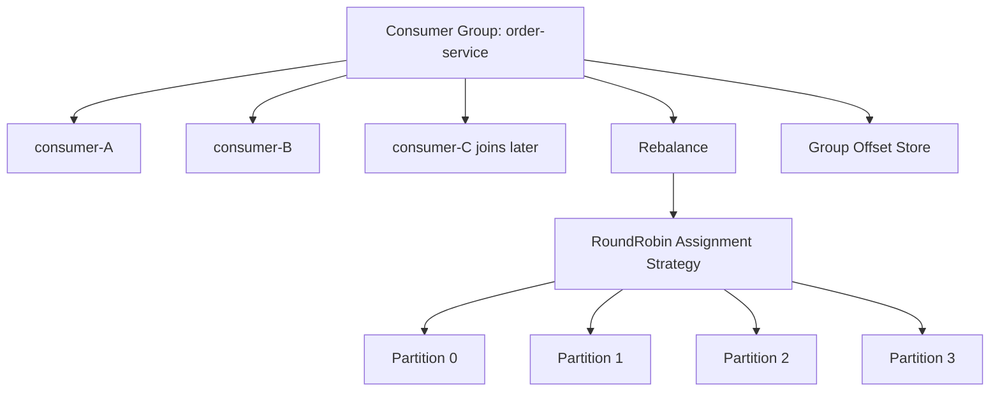
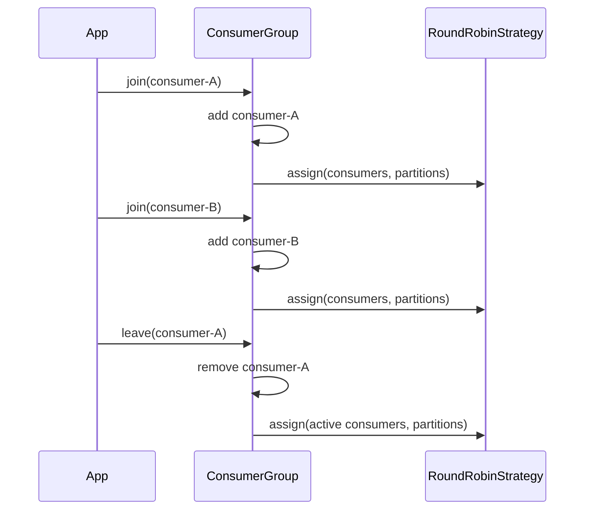

# 016_Rebalancing_Basics

# MiniKafka Step 16 — Rebalancing Basics

## Goal

In Step 15, partition assignment worked, but assignment happened only once. Real Kafka consumer groups are dynamic: consumers can join, leave, crash, restart, scale up, or scale down. When membership changes, Kafka recalculates partition ownership. This is called **rebalance**.

---

# Delta From Step 15

```text
Step 15:
Consumers were added once.
Partitions were assigned once.

Step 16:
Consumers can join.
Consumers can leave.
ConsumerGroup can rebalance.
Partition assignment is recalculated.
```

Modified classes:

```text
ConsumerGroup
Consumer
Step16Driver
```

New behavior:

```text
consumer joins -> rebalance
consumer leaves -> rebalance
```

---

# Detailed Steps Before Code

1. Keep storage classes unchanged: `MessageRecord`, `RecordSerializer`, `LogSegment`, `Partition`, `Topic`, `Broker`, `Producer`.
2. Keep group offset tracking unchanged: `groupId + topic + partition -> committed offset`.
3. Keep round-robin assignment strategy from Step 15.
4. Modify `ConsumerGroup` to support `join`, `leave`, and `rebalance`.
5. When a consumer joins, add it to active consumers and recompute assignment.
6. When a consumer leaves, remove it and recompute assignment.
7. Consumers poll only currently assigned partitions.

---

# Rebalancing Example

```text
Partitions = 4
Consumers = A, B

Before:
A -> [0, 2]
B -> [1, 3]

Consumer C joins:

After:
A -> [0, 3]
B -> [1]
C -> [2]
```

---

# Architecture Mermaid Diagram



---

# Rebalance Flow Mermaid Diagram



---

# Folder Structure

```text
MiniKafka/
└── src/main/java/com/minikafka/step16/
    ├── MessageRecord.java
    ├── RecordSerializer.java
    ├── LogSegment.java
    ├── Partition.java
    ├── Topic.java
    ├── Broker.java
    ├── Producer.java
    ├── GroupOffsetKey.java
    ├── GroupOffsetStore.java
    ├── PartitionAssignment.java
    ├── PartitionAssignmentStrategy.java
    ├── RoundRobinPartitionAssignmentStrategy.java
    ├── ConsumerGroup.java
    ├── Consumer.java
    └── Step16Driver.java
```

---

# CP/DSA Concepts Used

## 1. Dynamic List Membership

```java
List<Consumer> consumers;
```

Join is append-like. Leave uses linear search/removal.

```text
join: O(1)
leave: O(C)
```

## 2. Round-Robin Assignment

```java
consumerIndex = partitionId % consumers.size();
```

Complexity:

```text
O(P)
```

## 3. HashMap of Lists

```java
Map<String, List<Integer>>
```

This is like adjacency list:

```text
consumer -> assigned partitions
```

## 4. Recompute From Scratch

On every rebalance, old assignment is discarded and rebuilt.

```text
simple
predictable
O(P)
```

## 5. Stable Offset Store

Offsets stay under:

```text
groupId + topic + partition
```

So when partition ownership changes, the new owner resumes from the group offset.

---

# Complete Java Code

---

# MessageRecord.java

```java
package com.minikafka.step16;

public class MessageRecord {

    private final long offset;
    private final String key;
    private final String value;

    public MessageRecord(long offset, String key, String value) {
        this.offset = offset;
        this.key = key;
        this.value = value;
    }

    public long getOffset() {
        return offset;
    }

    public String getKey() {
        return key;
    }

    public String getValue() {
        return value;
    }

    @Override
    public String toString() {
        return "MessageRecord{" +
                "offset=" + offset +
                ", key='" + key + '\'' +
                ", value='" + value + '\'' +
                '}';
    }
}
```

---

# RecordSerializer.java

```java
package com.minikafka.step16;

public class RecordSerializer {

    public static String serialize(MessageRecord record) {
        return record.getOffset() + "|" + record.getKey() + "|" + record.getValue();
    }

    public static MessageRecord deserialize(String line) {
        String[] parts = line.split("\\|", 3);
        long offset = Long.parseLong(parts[0]);
        String key = parts[1];
        String value = parts[2];
        return new MessageRecord(offset, key, value);
    }
}
```

---

# LogSegment.java

```java
package com.minikafka.step16;

import java.io.IOException;
import java.nio.file.Files;
import java.nio.file.Path;
import java.nio.file.StandardOpenOption;
import java.util.ArrayList;
import java.util.List;
import java.util.stream.Stream;

public class LogSegment {

    private final Path logPath;

    public LogSegment(String filePath) throws IOException {
        this.logPath = Path.of(filePath);
        Files.createDirectories(logPath.getParent());

        if (!Files.exists(logPath)) {
            Files.createFile(logPath);
        }
    }

    public long append(String key, String value) throws IOException {
        long offset = countLines();
        MessageRecord record = new MessageRecord(offset, key, value);
        String line = RecordSerializer.serialize(record);
        Files.writeString(logPath, line + System.lineSeparator(), StandardOpenOption.APPEND);
        return offset;
    }

    public List<MessageRecord> readFromOffset(long startOffset) throws IOException {
        List<MessageRecord> result = new ArrayList<>();
        List<String> lines = Files.readAllLines(logPath);

        for (String line : lines) {
            if (line.isBlank()) {
                continue;
            }

            MessageRecord record = RecordSerializer.deserialize(line);

            if (record.getOffset() >= startOffset) {
                result.add(record);
            }
        }

        return result;
    }

    private long countLines() throws IOException {
        try (Stream<String> lines = Files.lines(logPath)) {
            return lines.filter(line -> !line.isBlank()).count();
        }
    }
}
```

---

# Partition.java

```java
package com.minikafka.step16;

import java.io.IOException;
import java.util.List;

public class Partition {

    private final int partitionId;
    private final LogSegment segment;

    public Partition(String topicName, int partitionId) throws IOException {
        this.partitionId = partitionId;
        String filePath = "data/phase1/" + topicName + "-" + partitionId + ".log";
        this.segment = new LogSegment(filePath);
    }

    public long append(String key, String value) throws IOException {
        return segment.append(key, value);
    }

    public List<MessageRecord> readFromOffset(long offset) throws IOException {
        return segment.readFromOffset(offset);
    }

    public int getPartitionId() {
        return partitionId;
    }
}
```

---

# Topic.java

```java
package com.minikafka.step16;

import java.io.IOException;
import java.util.ArrayList;
import java.util.List;

public class Topic {

    private final String name;
    private final List<Partition> partitions;

    public Topic(String name, int partitionCount) throws IOException {
        if (partitionCount <= 0) {
            throw new IllegalArgumentException("partitionCount must be > 0");
        }

        this.name = name;
        this.partitions = new ArrayList<>();

        for (int partitionId = 0; partitionId < partitionCount; partitionId++) {
            partitions.add(new Partition(name, partitionId));
        }
    }

    public long append(String key, String value) throws IOException {
        int partitionId = calculatePartitionId(key);

        System.out.println(
                "Topic '" + name + "' routed key='" + key + "' to partition " + partitionId
        );

        return getPartition(partitionId).append(key, value);
    }

    public List<MessageRecord> readFromPartitionOffset(int partitionId, long offset)
            throws IOException {

        return getPartition(partitionId).readFromOffset(offset);
    }

    private int calculatePartitionId(String key) {
        int hash = Math.abs(key.hashCode());
        return hash % partitions.size();
    }

    public Partition getPartition(int partitionId) {
        if (partitionId < 0 || partitionId >= partitions.size()) {
            throw new IllegalArgumentException("Invalid partition id: " + partitionId);
        }

        return partitions.get(partitionId);
    }

    public int getPartitionCount() {
        return partitions.size();
    }
}
```

---

# Broker.java

```java
package com.minikafka.step16;

import java.io.IOException;
import java.util.HashMap;
import java.util.List;
import java.util.Map;

public class Broker {

    private final Map<String, Topic> topics;

    public Broker() {
        this.topics = new HashMap<>();
    }

    public void createTopic(String topicName, int partitionCount) throws IOException {
        if (topics.containsKey(topicName)) {
            throw new IllegalArgumentException("Topic already exists: " + topicName);
        }

        Topic topic = new Topic(topicName, partitionCount);
        topics.put(topicName, topic);

        System.out.println(
                "Broker created topic: " + topicName + " with partitions: " + partitionCount
        );
    }

    public long send(String topicName, String key, String value) throws IOException {
        return getTopic(topicName).append(key, value);
    }

    public List<MessageRecord> readPartitionFromOffset(
            String topicName,
            int partitionId,
            long offset
    ) throws IOException {

        return getTopic(topicName).readFromPartitionOffset(partitionId, offset);
    }

    public int getPartitionCount(String topicName) {
        return getTopic(topicName).getPartitionCount();
    }

    private Topic getTopic(String topicName) {
        Topic topic = topics.get(topicName);

        if (topic == null) {
            throw new IllegalArgumentException("Topic not found: " + topicName);
        }

        return topic;
    }
}
```

---

# Producer.java

```java
package com.minikafka.step16;

import java.io.IOException;

public class Producer {

    private final Broker broker;

    public Producer(Broker broker) {
        this.broker = broker;
    }

    public long send(String topicName, String key, String value) throws IOException {
        System.out.println(
                "Producer sending: topic=" + topicName +
                        ", key=" + key +
                        ", value=" + value
        );

        return broker.send(topicName, key, value);
    }
}
```

---

# GroupOffsetKey.java

```java
package com.minikafka.step16;

import java.util.Objects;

public class GroupOffsetKey {

    private final String groupId;
    private final String topicName;
    private final int partitionId;

    public GroupOffsetKey(String groupId, String topicName, int partitionId) {
        this.groupId = groupId;
        this.topicName = topicName;
        this.partitionId = partitionId;
    }

    @Override
    public boolean equals(Object other) {
        if (this == other) {
            return true;
        }

        if (!(other instanceof GroupOffsetKey)) {
            return false;
        }

        GroupOffsetKey that = (GroupOffsetKey) other;

        return partitionId == that.partitionId
                && Objects.equals(groupId, that.groupId)
                && Objects.equals(topicName, that.topicName);
    }

    @Override
    public int hashCode() {
        return Objects.hash(groupId, topicName, partitionId);
    }

    @Override
    public String toString() {
        return groupId + "-" + topicName + "-" + partitionId;
    }
}
```

---

# GroupOffsetStore.java

```java
package com.minikafka.step16;

import java.util.HashMap;
import java.util.Map;

public class GroupOffsetStore {

    private final Map<GroupOffsetKey, Long> committedOffsets;

    public GroupOffsetStore() {
        this.committedOffsets = new HashMap<>();
    }

    public long getCommittedOffset(String groupId, String topicName, int partitionId) {
        GroupOffsetKey key = new GroupOffsetKey(groupId, topicName, partitionId);
        return committedOffsets.getOrDefault(key, 0L);
    }

    public void commit(String groupId, String topicName, int partitionId, long nextOffset) {
        GroupOffsetKey key = new GroupOffsetKey(groupId, topicName, partitionId);
        committedOffsets.put(key, nextOffset);
        System.out.println("Committed offset: " + key + " -> " + nextOffset);
    }
}
```

---

# PartitionAssignment.java

```java
package com.minikafka.step16;

import java.util.ArrayList;
import java.util.HashMap;
import java.util.List;
import java.util.Map;

public class PartitionAssignment {

    private final Map<String, List<Integer>> assignment;

    public PartitionAssignment() {
        this.assignment = new HashMap<>();
    }

    public void assign(String consumerId, int partitionId) {
        assignment
                .computeIfAbsent(consumerId, key -> new ArrayList<>())
                .add(partitionId);
    }

    public List<Integer> getPartitions(String consumerId) {
        return assignment.getOrDefault(consumerId, List.of());
    }

    public void printAssignment() {
        System.out.println("---- PARTITION ASSIGNMENT ----");

        for (Map.Entry<String, List<Integer>> entry : assignment.entrySet()) {
            System.out.println(entry.getKey() + " -> " + entry.getValue());
        }
    }
}
```

---

# PartitionAssignmentStrategy.java

```java
package com.minikafka.step16;

import java.util.List;

public interface PartitionAssignmentStrategy {

    PartitionAssignment assign(List<Consumer> consumers, int partitionCount);
}
```

---

# RoundRobinPartitionAssignmentStrategy.java

```java
package com.minikafka.step16;

import java.util.List;

public class RoundRobinPartitionAssignmentStrategy implements PartitionAssignmentStrategy {

    @Override
    public PartitionAssignment assign(List<Consumer> consumers, int partitionCount) {
        if (consumers.isEmpty()) {
            throw new IllegalArgumentException("No consumers available for assignment");
        }

        PartitionAssignment assignment = new PartitionAssignment();

        for (int partitionId = 0; partitionId < partitionCount; partitionId++) {
            int consumerIndex = partitionId % consumers.size();

            Consumer selectedConsumer = consumers.get(consumerIndex);

            assignment.assign(selectedConsumer.getConsumerId(), partitionId);
        }

        return assignment;
    }
}
```

---

# ConsumerGroup.java

```java
package com.minikafka.step16;

import java.util.ArrayList;
import java.util.List;

// DELTA from Step 15:
// ConsumerGroup now supports join, leave, and rebalance.
public class ConsumerGroup {

    private final String groupId;
    private final GroupOffsetStore offsetStore;
    private final List<Consumer> consumers;
    private final PartitionAssignmentStrategy assignmentStrategy;

    private PartitionAssignment partitionAssignment;

    public ConsumerGroup(
            String groupId,
            GroupOffsetStore offsetStore,
            PartitionAssignmentStrategy assignmentStrategy
    ) {
        this.groupId = groupId;
        this.offsetStore = offsetStore;
        this.assignmentStrategy = assignmentStrategy;
        this.consumers = new ArrayList<>();
    }

    public void join(Consumer consumer, String topicName, int partitionCount) {
        // DELTA from Step 15:
        // Previously we called addConsumer() and assignPartitions() manually.
        // Now join automatically triggers rebalance.
        consumers.add(consumer);

        System.out.println(consumer.getConsumerId() + " joined group " + groupId);

        rebalance(topicName, partitionCount);
    }

    public void leave(String consumerId, String topicName, int partitionCount) {
        // DELTA from Step 15:
        // New behavior: remove consumer and rebalance.
        consumers.removeIf(consumer -> consumer.getConsumerId().equals(consumerId));

        System.out.println(consumerId + " left group " + groupId);

        if (consumers.isEmpty()) {
            partitionAssignment = new PartitionAssignment();
            System.out.println("No consumers left. Assignment is empty.");
            return;
        }

        rebalance(topicName, partitionCount);
    }

    public void rebalance(String topicName, int partitionCount) {
        // DELTA from Step 15:
        // Rebalance means recompute assignment from scratch.
        this.partitionAssignment =
                assignmentStrategy.assign(consumers, partitionCount);

        System.out.println(
                "Rebalanced group '" + groupId +
                        "' for topic '" + topicName + "'"
        );

        partitionAssignment.printAssignment();
    }

    public List<Integer> getAssignedPartitions(String consumerId) {
        if (partitionAssignment == null) {
            throw new IllegalStateException("Partitions are not assigned yet");
        }

        return partitionAssignment.getPartitions(consumerId);
    }

    public String getGroupId() {
        return groupId;
    }

    public GroupOffsetStore getOffsetStore() {
        return offsetStore;
    }
}
```

---

# Consumer.java

```java
package com.minikafka.step16;

import java.io.IOException;
import java.util.List;

public class Consumer {

    private final String consumerId;
    private final Broker broker;
    private final ConsumerGroup consumerGroup;

    public Consumer(String consumerId, Broker broker, ConsumerGroup consumerGroup) {
        this.consumerId = consumerId;
        this.broker = broker;
        this.consumerGroup = consumerGroup;
    }

    public List<MessageRecord> poll(String topicName, int partitionId) throws IOException {
        String groupId = consumerGroup.getGroupId();

        long committedOffset =
                consumerGroup.getOffsetStore()
                        .getCommittedOffset(groupId, topicName, partitionId);

        System.out.println(
                consumerId + " polling: group=" + groupId +
                        ", topic=" + topicName +
                        ", partition=" + partitionId +
                        ", committedOffset=" + committedOffset
        );

        return broker.readPartitionFromOffset(topicName, partitionId, committedOffset);
    }

    public void pollAssignedAndCommit(String topicName) throws IOException {
        List<Integer> assignedPartitions =
                consumerGroup.getAssignedPartitions(consumerId);

        if (assignedPartitions.isEmpty()) {
            System.out.println(consumerId + " has no assigned partitions");
            return;
        }

        for (int partitionId : assignedPartitions) {
            List<MessageRecord> records = poll(topicName, partitionId);
            long nextOffset = processRecords(records);
            commit(topicName, partitionId, nextOffset);
        }
    }

    private long processRecords(List<MessageRecord> records) {
        long nextOffset = 0;

        for (MessageRecord record : records) {
            System.out.println(consumerId + " processing: " + record);
            nextOffset = record.getOffset() + 1;
        }

        return nextOffset;
    }

    public void commit(String topicName, int partitionId, long nextOffset) {
        String groupId = consumerGroup.getGroupId();

        consumerGroup.getOffsetStore()
                .commit(groupId, topicName, partitionId, nextOffset);
    }

    public String getConsumerId() {
        return consumerId;
    }
}
```

---

# Step16Driver.java

```java
package com.minikafka.step16;

public class Step16Driver {

    public static void main(String[] args) throws Exception {
        Broker broker = new Broker();
        broker.createTopic("orders", 4);

        Producer producer = new Producer(broker);

        GroupOffsetStore offsetStore = new GroupOffsetStore();

        PartitionAssignmentStrategy strategy =
                new RoundRobinPartitionAssignmentStrategy();

        ConsumerGroup group =
                new ConsumerGroup("order-service", offsetStore, strategy);

        Consumer consumerA = new Consumer("consumer-A", broker, group);
        Consumer consumerB = new Consumer("consumer-B", broker, group);
        Consumer consumerC = new Consumer("consumer-C", broker, group);

        int partitionCount = broker.getPartitionCount("orders");

        System.out.println();
        System.out.println("---- CONSUMERS JOIN ----");

        group.join(consumerA, "orders", partitionCount);
        group.join(consumerB, "orders", partitionCount);

        System.out.println();
        System.out.println("---- PRODUCE MESSAGES ----");

        producer.send("orders", "customer-1", "order-1-created");
        producer.send("orders", "customer-2", "order-2-created");
        producer.send("orders", "customer-3", "order-3-created");
        producer.send("orders", "customer-4", "order-4-created");
        producer.send("orders", "customer-1", "order-1-paid");

        System.out.println();
        System.out.println("---- FIRST POLL ----");

        consumerA.pollAssignedAndCommit("orders");
        consumerB.pollAssignedAndCommit("orders");

        System.out.println();
        System.out.println("---- CONSUMER C JOINS -> REBALANCE ----");

        group.join(consumerC, "orders", partitionCount);

        System.out.println();
        System.out.println("---- PRODUCE MORE MESSAGES ----");

        producer.send("orders", "customer-2", "order-2-paid");
        producer.send("orders", "customer-3", "order-3-paid");
        producer.send("orders", "customer-4", "order-4-paid");

        System.out.println();
        System.out.println("---- SECOND POLL AFTER REBALANCE ----");

        consumerA.pollAssignedAndCommit("orders");
        consumerB.pollAssignedAndCommit("orders");
        consumerC.pollAssignedAndCommit("orders");

        System.out.println();
        System.out.println("---- CONSUMER B LEAVES -> REBALANCE ----");

        group.leave("consumer-B", "orders", partitionCount);

        System.out.println();
        System.out.println("---- PRODUCE FINAL MESSAGES ----");

        producer.send("orders", "customer-1", "order-1-shipped");
        producer.send("orders", "customer-2", "order-2-shipped");

        System.out.println();
        System.out.println("---- THIRD POLL AFTER REBALANCE ----");

        consumerA.pollAssignedAndCommit("orders");
        consumerB.pollAssignedAndCommit("orders");
        consumerC.pollAssignedAndCommit("orders");
    }
}
```

---

# What Happens Internally?

## With 4 partitions and 2 consumers

```text
consumer-A -> [0, 2]
consumer-B -> [1, 3]
```

## Consumer C joins

```text
consumer-A -> [0, 3]
consumer-B -> [1]
consumer-C -> [2]
```

## Consumer B leaves

```text
consumer-A -> [0, 2]
consumer-C -> [1, 3]
```

Offsets remain group-level, so new partition owners resume from committed offsets.

---

# Run Command

```bash
javac -d out src/main/java/com/minikafka/step16/*.java

java -cp out com.minikafka.step16.Step16Driver
```

---

# Expected Output Pattern

```text
consumer-A joined group order-service
Rebalanced group 'order-service'
consumer-A -> [0, 1, 2, 3]

consumer-B joined group order-service
Rebalanced group 'order-service'
consumer-A -> [0, 2]
consumer-B -> [1, 3]

consumer-C joined group order-service
Rebalanced group 'order-service'
consumer-A -> [0, 3]
consumer-B -> [1]
consumer-C -> [2]
```

After consumer B leaves:

```text
consumer-B left group order-service
Rebalanced group 'order-service'
consumer-A -> [0, 2]
consumer-C -> [1, 3]
```

---

# Current MiniKafka State

```text
Supported:
[yes] append-only storage
[yes] offsets
[yes] LogSegment abstraction
[yes] Partition abstraction
[yes] Topic abstraction
[yes] Broker API
[yes] Producer API
[yes] Consumer API
[yes] offset commit
[yes] consumer groups
[yes] partition assignment
[yes] rebalancing basics

Not yet:
[no] heartbeat/session timeout
[no] persistent offset storage
[no] segment rolling
[no] index file
[no] retention cleanup
[no] replication
```

---

# Step 16 Completion Checklist

```text
[ ] You understand why rebalancing happens
[ ] You added join()
[ ] You added leave()
[ ] You added rebalance()
[ ] You understand recompute assignment from scratch
[ ] You understand offsets survive partition reassignment
[ ] You understand partition ownership changes
```

---

# Final Mental Model

```text
Consumer group membership changes
          |
          v
Rebalance triggered
          |
          v
Partition assignment recalculated
          |
          v
Consumers poll new assigned partitions
          |
          v
Offsets resume from group offset store
```

---

# Next Step

Next we build:

```text
017_Segment_Rolling
```
