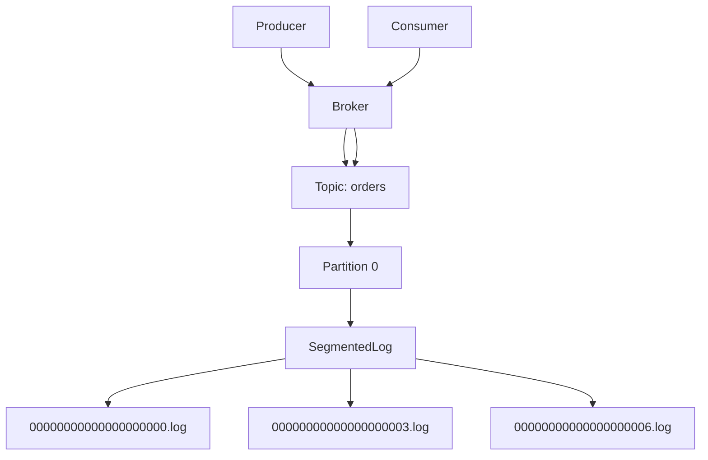
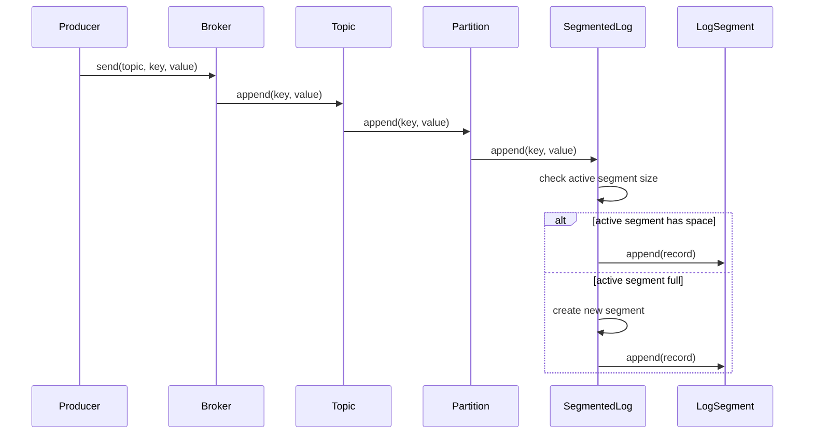

# 017_Segment_Rolling

# MiniKafka Step 17 — Segment Rolling

## Goal

Until now, each partition writes to one ever-growing file:

```text
orders-0.log
orders-1.log
orders-2.log
```

Real Kafka does not keep one huge file forever.

Kafka splits a partition log into multiple smaller files called **segments**.

In this step, we implement:

```text
segment rolling
```

When the current segment reaches a max number of records, MiniKafka creates a new segment file.

---

# Delta From Step 16

```text
Step 16:
Each partition had one LogSegment file:
orders-0.log

Step 17:
Each partition has a directory with multiple segment files:
orders-0/
    00000000000000000000.log
    00000000000000000003.log
    00000000000000000006.log
```

Modified classes:

```text
LogSegment
Partition
Topic
Broker
```

New classes:

```text
SegmentedLog
```

Main learning:

```text
large logs are split into smaller segment files
```

---

# Why Segment Rolling Exists

One huge log file causes problems:

```text
hard to delete old data
hard to search
hard to compact
hard to manage disk
slow startup
```

Segment files solve this:

```text
delete old segment easily
build index per segment
load only needed segment
manage retention better
```

---

# Segment Naming

Real Kafka names segment files by their base offset.

Example:

```text
00000000000000000000.log
00000000000000000003.log
00000000000000000006.log
```

Meaning:

```text
segment 0 starts at offset 0
segment 1 starts at offset 3
segment 2 starts at offset 6
```

In this step, we use:

```text
maxRecordsPerSegment = 3
```

So after every 3 records, we roll to a new segment.

---

# Detailed Steps Before Code

## Step 1 — Replace single log file with partition directory

Before:

```text
data/phase1/orders-0.log
```

After:

```text
data/phase1/orders-0/
    00000000000000000000.log
```

## Step 2 — Track active segment

`SegmentedLog` owns many `LogSegment` objects and knows which segment is active.

## Step 3 — Append to active segment

Each append goes to current active segment.

## Step 4 — Roll segment when full

If current segment has `maxRecordsPerSegment` records:

```text
create new segment with baseOffset = nextOffset
```

## Step 5 — Read across all segments

Consumer read from offset must scan all relevant segment files.

## Step 6 — Keep previous features working

Producer, broker, consumer group, assignment, and rebalance still work.

---

# Architecture Mermaid Diagram



---

# Segment Rolling Flow



---

# Folder Structure

```text
MiniKafka/
└── src/main/java/com/minikafka/step17/
    ├── MessageRecord.java
    ├── RecordSerializer.java
    ├── LogSegment.java
    ├── SegmentedLog.java
    ├── Partition.java
    ├── Topic.java
    ├── Broker.java
    ├── Producer.java
    ├── GroupOffsetKey.java
    ├── GroupOffsetStore.java
    ├── PartitionAssignment.java
    ├── PartitionAssignmentStrategy.java
    ├── RoundRobinPartitionAssignmentStrategy.java
    ├── ConsumerGroup.java
    ├── Consumer.java
    └── Step17Driver.java
```

Expected data folder:

```text
data/phase1/orders-0/
    00000000000000000000.log
    00000000000000000003.log

data/phase1/orders-1/
    00000000000000000000.log

data/phase1/orders-2/
    00000000000000000000.log
```

---

# CP/DSA Concepts Used

## 1. List of Segments

```java
List<LogSegment> segments;
```

This is like storing intervals:

```text
segment 0 covers offsets [0..2]
segment 3 covers offsets [3..5]
segment 6 covers offsets [6..8]
```

## 2. Range Filtering

When reading from offset:

```java
if (segment.getLastOffset() >= startOffset)
```

Only relevant segments are scanned.

## 3. Rolling Threshold

This is a classic threshold condition:

```java
if (activeSegment.size() >= maxRecordsPerSegment) {
    roll();
}
```

## 4. Sequential Scan Across Chunks

Read complexity:

```text
O(number of segments + matching records)
```

Without index, we still scan segment files.

## 5. Base Offset as Interval Start

Each segment is identified by base offset.

This is similar to interval decomposition in CP.

---

# Complete Java Code

---

# MessageRecord.java

```java
package com.minikafka.step17;

public class MessageRecord {

    private final long offset;
    private final String key;
    private final String value;

    public MessageRecord(long offset, String key, String value) {
        this.offset = offset;
        this.key = key;
        this.value = value;
    }

    public long getOffset() {
        return offset;
    }

    public String getKey() {
        return key;
    }

    public String getValue() {
        return value;
    }

    @Override
    public String toString() {
        return "MessageRecord{" +
                "offset=" + offset +
                ", key='" + key + '\'' +
                ", value='" + value + '\'' +
                '}';
    }
}
```

---

# RecordSerializer.java

```java
package com.minikafka.step17;

public class RecordSerializer {

    public static String serialize(MessageRecord record) {
        return record.getOffset() + "|" + record.getKey() + "|" + record.getValue();
    }

    public static MessageRecord deserialize(String line) {
        String[] parts = line.split("\\|", 3);

        long offset = Long.parseLong(parts[0]);
        String key = parts[1];
        String value = parts[2];

        return new MessageRecord(offset, key, value);
    }
}
```

---

# LogSegment.java

```java
package com.minikafka.step17;

import java.io.IOException;
import java.nio.file.Files;
import java.nio.file.Path;
import java.nio.file.StandardOpenOption;
import java.util.ArrayList;
import java.util.List;
import java.util.stream.Stream;

// DELTA from Step 16:
// LogSegment now has a baseOffset and stores only a slice of partition log.
public class LogSegment {

    private final Path logPath;
    private final long baseOffset;

    public LogSegment(Path logPath, long baseOffset) throws IOException {
        this.logPath = logPath;
        this.baseOffset = baseOffset;

        Files.createDirectories(logPath.getParent());

        if (!Files.exists(logPath)) {
            Files.createFile(logPath);
        }
    }

    public void append(MessageRecord record) throws IOException {
        String line = RecordSerializer.serialize(record);

        Files.writeString(logPath, line + System.lineSeparator(), StandardOpenOption.APPEND);
    }

    public List<MessageRecord> readFromOffset(long startOffset) throws IOException {
        List<MessageRecord> result = new ArrayList<>();
        List<String> lines = Files.readAllLines(logPath);

        for (String line : lines) {
            if (line.isBlank()) {
                continue;
            }

            MessageRecord record = RecordSerializer.deserialize(line);

            if (record.getOffset() >= startOffset) {
                result.add(record);
            }
        }

        return result;
    }

    public long size() throws IOException {
        try (Stream<String> lines = Files.lines(logPath)) {
            return lines.filter(line -> !line.isBlank()).count();
        }
    }

    public boolean isFull(int maxRecordsPerSegment) throws IOException {
        return size() >= maxRecordsPerSegment;
    }

    public long getBaseOffset() {
        return baseOffset;
    }

    public long getLastOffset() throws IOException {
        long size = size();

        if (size == 0) {
            return baseOffset - 1;
        }

        return baseOffset + size - 1;
    }

    public Path getLogPath() {
        return logPath;
    }
}
```

---

# SegmentedLog.java

```java
package com.minikafka.step17;

import java.io.IOException;
import java.nio.file.Files;
import java.nio.file.Path;
import java.util.ArrayList;
import java.util.Comparator;
import java.util.List;

// DELTA from Step 16:
// New class.
// Step 16 had one LogSegment per partition.
// Step 17 has SegmentedLog per partition, which owns many LogSegment files.
public class SegmentedLog {

    private final Path partitionDirectory;
    private final int maxRecordsPerSegment;
    private final List<LogSegment> segments;

    private long nextOffset;

    public SegmentedLog(String topicName, int partitionId, int maxRecordsPerSegment)
            throws IOException {

        this.partitionDirectory =
                Path.of("data/phase1/" + topicName + "-" + partitionId);

        this.maxRecordsPerSegment = maxRecordsPerSegment;
        this.segments = new ArrayList<>();

        Files.createDirectories(partitionDirectory);

        loadExistingSegments();

        if (segments.isEmpty()) {
            rollToNewSegment(0);
            this.nextOffset = 0;
        } else {
            LogSegment lastSegment = segments.get(segments.size() - 1);
            this.nextOffset = lastSegment.getLastOffset() + 1;
        }
    }

    public long append(String key, String value) throws IOException {
        LogSegment activeSegment = getActiveSegment();

        if (activeSegment.isFull(maxRecordsPerSegment)) {
            // DELTA from Step 16:
            // Instead of writing forever into one file,
            // create a new segment when active segment is full.
            activeSegment = rollToNewSegment(nextOffset);
        }

        MessageRecord record = new MessageRecord(nextOffset, key, value);

        activeSegment.append(record);

        long writtenOffset = nextOffset;
        nextOffset++;

        return writtenOffset;
    }

    public List<MessageRecord> readFromOffset(long startOffset) throws IOException {
        List<MessageRecord> result = new ArrayList<>();

        for (LogSegment segment : segments) {
            if (segment.getLastOffset() < startOffset) {
                continue;
            }

            result.addAll(segment.readFromOffset(startOffset));
        }

        return result;
    }

    private void loadExistingSegments() throws IOException {
        if (!Files.exists(partitionDirectory)) {
            return;
        }

        try (var paths = Files.list(partitionDirectory)) {
            List<Path> segmentFiles =
                    paths
                            .filter(path -> path.toString().endsWith(".log"))
                            .sorted(Comparator.comparing(Path::toString))
                            .toList();

            for (Path file : segmentFiles) {
                long baseOffset = parseBaseOffset(file);
                segments.add(new LogSegment(file, baseOffset));
            }
        }
    }

    private LogSegment rollToNewSegment(long baseOffset) throws IOException {
        String fileName = String.format("%020d.log", baseOffset);
        Path segmentPath = partitionDirectory.resolve(fileName);

        LogSegment segment = new LogSegment(segmentPath, baseOffset);
        segments.add(segment);

        System.out.println(
                "Rolled new segment: " + segmentPath
        );

        return segment;
    }

    private LogSegment getActiveSegment() {
        return segments.get(segments.size() - 1);
    }

    private long parseBaseOffset(Path file) {
        String fileName = file.getFileName().toString();
        String numberPart = fileName.replace(".log", "");

        return Long.parseLong(numberPart);
    }
}
```

---

# Partition.java

```java
package com.minikafka.step17;

import java.io.IOException;
import java.util.List;

// DELTA from Step 16:
// Partition now owns SegmentedLog instead of one LogSegment.
public class Partition {

    private final int partitionId;
    private final SegmentedLog segmentedLog;

    public Partition(String topicName, int partitionId, int maxRecordsPerSegment)
            throws IOException {

        this.partitionId = partitionId;
        this.segmentedLog =
                new SegmentedLog(topicName, partitionId, maxRecordsPerSegment);
    }

    public long append(String key, String value) throws IOException {
        return segmentedLog.append(key, value);
    }

    public List<MessageRecord> readFromOffset(long offset) throws IOException {
        return segmentedLog.readFromOffset(offset);
    }

    public int getPartitionId() {
        return partitionId;
    }
}
```

---

# Topic.java

```java
package com.minikafka.step17;

import java.io.IOException;
import java.util.ArrayList;
import java.util.List;

// DELTA from Step 16:
// Topic passes maxRecordsPerSegment down to each Partition.
public class Topic {

    private final String name;
    private final List<Partition> partitions;

    public Topic(String name, int partitionCount, int maxRecordsPerSegment)
            throws IOException {

        if (partitionCount <= 0) {
            throw new IllegalArgumentException("partitionCount must be > 0");
        }

        this.name = name;
        this.partitions = new ArrayList<>();

        for (int partitionId = 0; partitionId < partitionCount; partitionId++) {
            partitions.add(new Partition(name, partitionId, maxRecordsPerSegment));
        }
    }

    public long append(String key, String value) throws IOException {
        int partitionId = calculatePartitionId(key);

        System.out.println(
                "Topic '" + name + "' routed key='" + key + "' to partition " + partitionId
        );

        return getPartition(partitionId).append(key, value);
    }

    public List<MessageRecord> readFromPartitionOffset(int partitionId, long offset)
            throws IOException {

        return getPartition(partitionId).readFromOffset(offset);
    }

    private int calculatePartitionId(String key) {
        int hash = Math.abs(key.hashCode());
        return hash % partitions.size();
    }

    public Partition getPartition(int partitionId) {
        if (partitionId < 0 || partitionId >= partitions.size()) {
            throw new IllegalArgumentException("Invalid partition id: " + partitionId);
        }

        return partitions.get(partitionId);
    }

    public int getPartitionCount() {
        return partitions.size();
    }
}
```

---

# Broker.java

```java
package com.minikafka.step17;

import java.io.IOException;
import java.util.HashMap;
import java.util.List;
import java.util.Map;

// DELTA from Step 16:
// Broker now accepts maxRecordsPerSegment during topic creation.
public class Broker {

    private final Map<String, Topic> topics;

    public Broker() {
        this.topics = new HashMap<>();
    }

    public void createTopic(String topicName, int partitionCount, int maxRecordsPerSegment)
            throws IOException {

        if (topics.containsKey(topicName)) {
            throw new IllegalArgumentException("Topic already exists: " + topicName);
        }

        Topic topic = new Topic(topicName, partitionCount, maxRecordsPerSegment);
        topics.put(topicName, topic);

        System.out.println(
                "Broker created topic: " + topicName +
                        ", partitions=" + partitionCount +
                        ", maxRecordsPerSegment=" + maxRecordsPerSegment
        );
    }

    public long send(String topicName, String key, String value) throws IOException {
        return getTopic(topicName).append(key, value);
    }

    public List<MessageRecord> readPartitionFromOffset(
            String topicName,
            int partitionId,
            long offset
    ) throws IOException {

        return getTopic(topicName).readFromPartitionOffset(partitionId, offset);
    }

    public int getPartitionCount(String topicName) {
        return getTopic(topicName).getPartitionCount();
    }

    private Topic getTopic(String topicName) {
        Topic topic = topics.get(topicName);

        if (topic == null) {
            throw new IllegalArgumentException("Topic not found: " + topicName);
        }

        return topic;
    }
}
```

---

# Producer.java

```java
package com.minikafka.step17;

import java.io.IOException;

public class Producer {

    private final Broker broker;

    public Producer(Broker broker) {
        this.broker = broker;
    }

    public long send(String topicName, String key, String value) throws IOException {
        System.out.println(
                "Producer sending: topic=" + topicName +
                        ", key=" + key +
                        ", value=" + value
        );

        return broker.send(topicName, key, value);
    }
}
```

---

# GroupOffsetKey.java

```java
package com.minikafka.step17;

import java.util.Objects;

public class GroupOffsetKey {

    private final String groupId;
    private final String topicName;
    private final int partitionId;

    public GroupOffsetKey(String groupId, String topicName, int partitionId) {
        this.groupId = groupId;
        this.topicName = topicName;
        this.partitionId = partitionId;
    }

    @Override
    public boolean equals(Object other) {
        if (this == other) {
            return true;
        }

        if (!(other instanceof GroupOffsetKey)) {
            return false;
        }

        GroupOffsetKey that = (GroupOffsetKey) other;

        return partitionId == that.partitionId
                && Objects.equals(groupId, that.groupId)
                && Objects.equals(topicName, that.topicName);
    }

    @Override
    public int hashCode() {
        return Objects.hash(groupId, topicName, partitionId);
    }

    @Override
    public String toString() {
        return groupId + "-" + topicName + "-" + partitionId;
    }
}
```

---

# GroupOffsetStore.java

```java
package com.minikafka.step17;

import java.util.HashMap;
import java.util.Map;

public class GroupOffsetStore {

    private final Map<GroupOffsetKey, Long> committedOffsets;

    public GroupOffsetStore() {
        this.committedOffsets = new HashMap<>();
    }

    public long getCommittedOffset(String groupId, String topicName, int partitionId) {
        GroupOffsetKey key = new GroupOffsetKey(groupId, topicName, partitionId);

        return committedOffsets.getOrDefault(key, 0L);
    }

    public void commit(String groupId, String topicName, int partitionId, long nextOffset) {
        GroupOffsetKey key = new GroupOffsetKey(groupId, topicName, partitionId);

        committedOffsets.put(key, nextOffset);

        System.out.println("Committed offset: " + key + " -> " + nextOffset);
    }
}
```

---

# PartitionAssignment.java

```java
package com.minikafka.step17;

import java.util.ArrayList;
import java.util.HashMap;
import java.util.List;
import java.util.Map;

public class PartitionAssignment {

    private final Map<String, List<Integer>> assignment;

    public PartitionAssignment() {
        this.assignment = new HashMap<>();
    }

    public void assign(String consumerId, int partitionId) {
        assignment
                .computeIfAbsent(consumerId, key -> new ArrayList<>())
                .add(partitionId);
    }

    public List<Integer> getPartitions(String consumerId) {
        return assignment.getOrDefault(consumerId, List.of());
    }

    public void printAssignment() {
        System.out.println("---- PARTITION ASSIGNMENT ----");

        for (Map.Entry<String, List<Integer>> entry : assignment.entrySet()) {
            System.out.println(entry.getKey() + " -> " + entry.getValue());
        }
    }
}
```

---

# PartitionAssignmentStrategy.java

```java
package com.minikafka.step17;

import java.util.List;

public interface PartitionAssignmentStrategy {

    PartitionAssignment assign(List<Consumer> consumers, int partitionCount);
}
```

---

# RoundRobinPartitionAssignmentStrategy.java

```java
package com.minikafka.step17;

import java.util.List;

public class RoundRobinPartitionAssignmentStrategy implements PartitionAssignmentStrategy {

    @Override
    public PartitionAssignment assign(List<Consumer> consumers, int partitionCount) {
        if (consumers.isEmpty()) {
            throw new IllegalArgumentException("No consumers available for assignment");
        }

        PartitionAssignment assignment = new PartitionAssignment();

        for (int partitionId = 0; partitionId < partitionCount; partitionId++) {
            int consumerIndex = partitionId % consumers.size();
            Consumer selectedConsumer = consumers.get(consumerIndex);
            assignment.assign(selectedConsumer.getConsumerId(), partitionId);
        }

        return assignment;
    }
}
```

---

# ConsumerGroup.java

```java
package com.minikafka.step17;

import java.util.ArrayList;
import java.util.List;

public class ConsumerGroup {

    private final String groupId;
    private final GroupOffsetStore offsetStore;
    private final List<Consumer> consumers;
    private final PartitionAssignmentStrategy assignmentStrategy;

    private PartitionAssignment partitionAssignment;

    public ConsumerGroup(
            String groupId,
            GroupOffsetStore offsetStore,
            PartitionAssignmentStrategy assignmentStrategy
    ) {
        this.groupId = groupId;
        this.offsetStore = offsetStore;
        this.assignmentStrategy = assignmentStrategy;
        this.consumers = new ArrayList<>();
    }

    public void join(Consumer consumer, String topicName, int partitionCount) {
        consumers.add(consumer);
        System.out.println(consumer.getConsumerId() + " joined group " + groupId);
        rebalance(topicName, partitionCount);
    }

    public void leave(String consumerId, String topicName, int partitionCount) {
        consumers.removeIf(consumer -> consumer.getConsumerId().equals(consumerId));
        System.out.println(consumerId + " left group " + groupId);

        if (consumers.isEmpty()) {
            partitionAssignment = new PartitionAssignment();
            System.out.println("No consumers left. Assignment is empty.");
            return;
        }

        rebalance(topicName, partitionCount);
    }

    public void rebalance(String topicName, int partitionCount) {
        this.partitionAssignment =
                assignmentStrategy.assign(consumers, partitionCount);

        System.out.println(
                "Rebalanced group '" + groupId +
                        "' for topic '" + topicName + "'"
        );

        partitionAssignment.printAssignment();
    }

    public List<Integer> getAssignedPartitions(String consumerId) {
        if (partitionAssignment == null) {
            throw new IllegalStateException("Partitions are not assigned yet");
        }

        return partitionAssignment.getPartitions(consumerId);
    }

    public String getGroupId() {
        return groupId;
    }

    public GroupOffsetStore getOffsetStore() {
        return offsetStore;
    }
}
```

---

# Consumer.java

```java
package com.minikafka.step17;

import java.io.IOException;
import java.util.List;

public class Consumer {

    private final String consumerId;
    private final Broker broker;
    private final ConsumerGroup consumerGroup;

    public Consumer(String consumerId, Broker broker, ConsumerGroup consumerGroup) {
        this.consumerId = consumerId;
        this.broker = broker;
        this.consumerGroup = consumerGroup;
    }

    public List<MessageRecord> poll(String topicName, int partitionId) throws IOException {
        String groupId = consumerGroup.getGroupId();

        long committedOffset =
                consumerGroup.getOffsetStore()
                        .getCommittedOffset(groupId, topicName, partitionId);

        System.out.println(
                consumerId + " polling: group=" + groupId +
                        ", topic=" + topicName +
                        ", partition=" + partitionId +
                        ", committedOffset=" + committedOffset
        );

        return broker.readPartitionFromOffset(topicName, partitionId, committedOffset);
    }

    public void pollAssignedAndCommit(String topicName) throws IOException {
        List<Integer> assignedPartitions =
                consumerGroup.getAssignedPartitions(consumerId);

        if (assignedPartitions.isEmpty()) {
            System.out.println(consumerId + " has no assigned partitions");
            return;
        }

        for (int partitionId : assignedPartitions) {
            List<MessageRecord> records = poll(topicName, partitionId);

            long nextOffset = processRecords(records);

            commit(topicName, partitionId, nextOffset);
        }
    }

    private long processRecords(List<MessageRecord> records) {
        long nextOffset = 0;

        for (MessageRecord record : records) {
            System.out.println(consumerId + " processing: " + record);

            nextOffset = record.getOffset() + 1;
        }

        return nextOffset;
    }

    public void commit(String topicName, int partitionId, long nextOffset) {
        String groupId = consumerGroup.getGroupId();

        consumerGroup.getOffsetStore()
                .commit(groupId, topicName, partitionId, nextOffset);
    }

    public String getConsumerId() {
        return consumerId;
    }
}
```

---

# Step17Driver.java

```java
package com.minikafka.step17;

public class Step17Driver {

    public static void main(String[] args) throws Exception {
        Broker broker = new Broker();

        int partitionCount = 2;
        int maxRecordsPerSegment = 3;

        broker.createTopic("orders", partitionCount, maxRecordsPerSegment);

        Producer producer = new Producer(broker);

        GroupOffsetStore offsetStore = new GroupOffsetStore();

        PartitionAssignmentStrategy strategy =
                new RoundRobinPartitionAssignmentStrategy();

        ConsumerGroup group =
                new ConsumerGroup("order-service", offsetStore, strategy);

        Consumer consumerA = new Consumer("consumer-A", broker, group);
        Consumer consumerB = new Consumer("consumer-B", broker, group);

        group.join(consumerA, "orders", broker.getPartitionCount("orders"));
        group.join(consumerB, "orders", broker.getPartitionCount("orders"));

        System.out.println();
        System.out.println("---- PRODUCE MANY MESSAGES TO FORCE SEGMENT ROLLING ----");

        for (int i = 1; i <= 10; i++) {
            producer.send("orders", "customer-1", "order-" + i);
        }

        System.out.println();
        System.out.println("---- CONSUME ASSIGNED PARTITIONS ----");

        consumerA.pollAssignedAndCommit("orders");
        consumerB.pollAssignedAndCommit("orders");

        System.out.println();
        System.out.println("Check data/phase1/orders-*/ folders to see rolled segment files.");
    }
}
```

---

# What Happens Internally?

With:

```text
maxRecordsPerSegment = 3
```

Messages in one partition roll like this:

```text
00000000000000000000.log -> offsets 0,1,2
00000000000000000003.log -> offsets 3,4,5
00000000000000000006.log -> offsets 6,7,8
00000000000000000009.log -> offset 9
```

This is the core Kafka segment architecture.

---

# Run Command

```bash
javac -d out src/main/java/com/minikafka/step17/*.java

java -cp out com.minikafka.step17.Step17Driver
```

---

# Expected Output Pattern

```text
Rolled new segment: data/phase1/orders-0/00000000000000000000.log
Rolled new segment: data/phase1/orders-0/00000000000000000003.log
Rolled new segment: data/phase1/orders-0/00000000000000000006.log
```

Exact partition folder depends on hash routing.

---

# Current MiniKafka State

```text
Supported:
[yes] append-only storage
[yes] offsets
[yes] partitions
[yes] topics
[yes] broker
[yes] producer
[yes] consumer
[yes] consumer groups
[yes] partition assignment
[yes] rebalancing basics
[yes] segment rolling

Not yet:
[no] index file
[no] retention cleanup
[no] replication
[no] leader/follower
```

---

# Step 17 Completion Checklist

```text
[ ] You understand why one huge log file is bad
[ ] You created SegmentedLog
[ ] You understand baseOffset
[ ] You understand segment rolling
[ ] You understand maxRecordsPerSegment
[ ] You can read across multiple segments
```

---

# Final Mental Model

```text
Partition is not one file forever.

Partition:
    Segment 0
    Segment 3
    Segment 6

Each segment stores a range of offsets.
```

---

# Next Step

Next we build:

```text
018_Index_File
```

Then we will avoid scanning every segment linearly.
