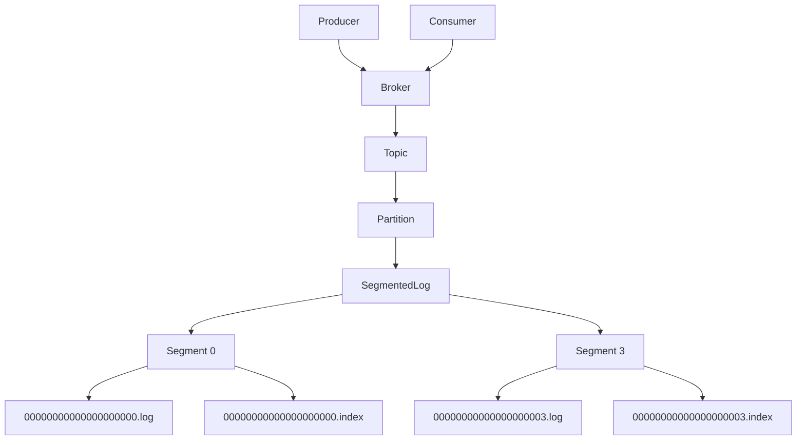
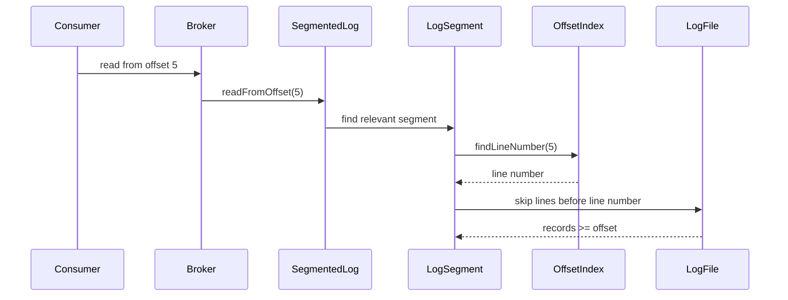

# 018_Index_File

# MiniKafka Step 18 — Index File

## Goal

In Step 17, we added segment rolling.

Now each partition can have many segment files:

```text
orders-0/
    00000000000000000000.log
    00000000000000000003.log
    00000000000000000006.log
```

But reading from an offset still scans log files line by line.

In this step, we add a simple index file beside every log segment.

```text
00000000000000000000.log
00000000000000000000.index
```

The index maps:

```text
offset -> line number
```

This helps MiniKafka jump closer to the target offset.

---

# Delta From Step 17

```text
Step 17:
SegmentedLog had multiple .log files.
Reading still scanned every line in relevant segments.

Step 18:
Each segment has .log + .index.
Index stores offset -> line number.
Read can skip lines before target offset.
```

Modified classes:

```text
LogSegment
SegmentedLog
```

New class:

```text
OffsetIndex
```

Main learning:

```text
large append-only logs need index files for faster offset lookup
```

---

# What Is An Index File?

For a log file:

```text
00000000000000000000.log

0|customer-1|order-1
1|customer-1|order-2
2|customer-1|order-3
```

Index file:

```text
00000000000000000000.index

0|0
1|1
2|2
```

Meaning:

```text
offset 0 is at line 0
offset 1 is at line 1
offset 2 is at line 2
```

In real Kafka, index maps offset to byte position.

In MiniKafka, we use line number to keep it simple.

---

# Detailed Steps Before Code

## Step 1 — Add index file per segment

Before:

```text
00000000000000000000.log
```

After:

```text
00000000000000000000.log
00000000000000000000.index
```

## Step 2 — Append to index during write

When appending record:

```text
write record to .log
write offset|lineNumber to .index
```

## Step 3 — Use index during read

When reading from offset:

```text
find line number from index
skip lines before that line
read from there
```

## Step 4 — Keep segment rolling

When a new segment is created, create both:

```text
segment.log
segment.index
```

## Step 5 — Keep all previous features

Producer, broker, consumer groups, partition assignment, rebalancing, and segment rolling continue to work.

---

# Architecture Mermaid Diagram



---

# Indexed Read Flow



---

# Folder Structure

```text
MiniKafka/
└── src/main/java/com/minikafka/step18/
    ├── MessageRecord.java
    ├── RecordSerializer.java
    ├── OffsetIndex.java
    ├── LogSegment.java
    ├── SegmentedLog.java
    ├── Partition.java
    ├── Topic.java
    ├── Broker.java
    ├── Producer.java
    ├── GroupOffsetKey.java
    ├── GroupOffsetStore.java
    ├── PartitionAssignment.java
    ├── PartitionAssignmentStrategy.java
    ├── RoundRobinPartitionAssignmentStrategy.java
    ├── ConsumerGroup.java
    ├── Consumer.java
    └── Step18Driver.java
```

Expected data folder:

```text
data/phase1/orders-0/
    00000000000000000000.log
    00000000000000000000.index
    00000000000000000003.log
    00000000000000000003.index
```

---

# CP/DSA Concepts Used

## 1. HashMap-Like Lookup Concept

The index gives direct mapping:

```text
offset -> line number
```

In memory terms, this is like:

```java
Map<Long, Integer>
```

But we persist it in a file.

## 2. Lower Bound / Floor Search Idea

If exact offset exists in the index, use it.

If exact offset does not exist, we can start from nearest smaller offset.

In this simple version, offsets are continuous, so exact lookup usually exists.

## 3. Skipping Prefix

Instead of scanning from line 0:

```text
skip lines [0..lineNumber-1]
read from lineNumber
```

This is similar to array index jump.

## 4. Segment Range Filtering

Before reading a segment:

```java
if (segment.getLastOffset() < startOffset) continue;
```

This avoids irrelevant segments.

## 5. Time Complexity

Without index:

```text
O(total lines in relevant segments)
```

With simple line index:

```text
O(index lookup + lines after target offset)
```

---

# Complete Java Code

---

# MessageRecord.java

```java
package com.minikafka.step18;

public class MessageRecord {

    private final long offset;
    private final String key;
    private final String value;

    public MessageRecord(long offset, String key, String value) {
        this.offset = offset;
        this.key = key;
        this.value = value;
    }

    public long getOffset() {
        return offset;
    }

    public String getKey() {
        return key;
    }

    public String getValue() {
        return value;
    }

    @Override
    public String toString() {
        return "MessageRecord{" +
                "offset=" + offset +
                ", key='" + key + '\'' +
                ", value='" + value + '\'' +
                '}';
    }
}
```

---

# RecordSerializer.java

```java
package com.minikafka.step18;

public class RecordSerializer {

    public static String serialize(MessageRecord record) {
        return record.getOffset() + "|" + record.getKey() + "|" + record.getValue();
    }

    public static MessageRecord deserialize(String line) {
        String[] parts = line.split("\\|", 3);

        long offset = Long.parseLong(parts[0]);
        String key = parts[1];
        String value = parts[2];

        return new MessageRecord(offset, key, value);
    }
}
```

---

# OffsetIndex.java

```java
package com.minikafka.step18;

import java.io.IOException;
import java.nio.file.Files;
import java.nio.file.Path;
import java.nio.file.StandardOpenOption;
import java.util.List;

// DELTA from Step 17:
// New class.
// Each log segment now has an index file.
// This maps offset -> line number.
public class OffsetIndex {

    private final Path indexPath;

    public OffsetIndex(Path indexPath) throws IOException {
        this.indexPath = indexPath;

        Files.createDirectories(indexPath.getParent());

        if (!Files.exists(indexPath)) {
            Files.createFile(indexPath);
        }
    }

    public void append(long offset, long lineNumber) throws IOException {
        String line = offset + "|" + lineNumber;

        Files.writeString(
                indexPath,
                line + System.lineSeparator(),
                StandardOpenOption.APPEND
        );
    }

    public long findLineNumber(long targetOffset) throws IOException {
        List<String> lines = Files.readAllLines(indexPath);

        long bestLineNumber = 0;

        for (String line : lines) {
            if (line.isBlank()) {
                continue;
            }

            String[] parts = line.split("\\|", 2);

            long offset = Long.parseLong(parts[0]);
            long lineNumber = Long.parseLong(parts[1]);

            if (offset <= targetOffset) {
                bestLineNumber = lineNumber;
            } else {
                break;
            }
        }

        return bestLineNumber;
    }

    public Path getIndexPath() {
        return indexPath;
    }
}
```

---

# LogSegment.java

```java
package com.minikafka.step18;

import java.io.IOException;
import java.nio.file.Files;
import java.nio.file.Path;
import java.nio.file.StandardOpenOption;
import java.util.ArrayList;
import java.util.List;
import java.util.stream.Stream;

// DELTA from Step 17:
// LogSegment now owns an OffsetIndex.
public class LogSegment {

    private final Path logPath;
    private final long baseOffset;
    private final OffsetIndex offsetIndex;

    public LogSegment(Path logPath, long baseOffset) throws IOException {
        this.logPath = logPath;
        this.baseOffset = baseOffset;

        Files.createDirectories(logPath.getParent());

        if (!Files.exists(logPath)) {
            Files.createFile(logPath);
        }

        Path indexPath = buildIndexPath(logPath);
        this.offsetIndex = new OffsetIndex(indexPath);
    }

    public void append(MessageRecord record) throws IOException {
        long lineNumber = size();

        String line = RecordSerializer.serialize(record);

        Files.writeString(
                logPath,
                line + System.lineSeparator(),
                StandardOpenOption.APPEND
        );

        // DELTA from Step 17:
        // Every append also writes to index.
        // offset -> line number
        offsetIndex.append(record.getOffset(), lineNumber);
    }

    public List<MessageRecord> readFromOffset(long startOffset) throws IOException {
        List<MessageRecord> result = new ArrayList<>();

        long lineToStart = offsetIndex.findLineNumber(startOffset);

        List<String> lines = Files.readAllLines(logPath);

        for (int i = (int) lineToStart; i < lines.size(); i++) {
            String line = lines.get(i);

            if (line.isBlank()) {
                continue;
            }

            MessageRecord record = RecordSerializer.deserialize(line);

            if (record.getOffset() >= startOffset) {
                result.add(record);
            }
        }

        return result;
    }

    public long size() throws IOException {
        try (Stream<String> lines = Files.lines(logPath)) {
            return lines.filter(line -> !line.isBlank()).count();
        }
    }

    public boolean isFull(int maxRecordsPerSegment) throws IOException {
        return size() >= maxRecordsPerSegment;
    }

    public long getBaseOffset() {
        return baseOffset;
    }

    public long getLastOffset() throws IOException {
        long size = size();

        if (size == 0) {
            return baseOffset - 1;
        }

        return baseOffset + size - 1;
    }

    private Path buildIndexPath(Path logPath) {
        String fileName = logPath.getFileName().toString();
        String indexFileName = fileName.replace(".log", ".index");

        return logPath.getParent().resolve(indexFileName);
    }

    public Path getLogPath() {
        return logPath;
    }
}
```

---

# SegmentedLog.java

```java
package com.minikafka.step18;

import java.io.IOException;
import java.nio.file.Files;
import java.nio.file.Path;
import java.util.ArrayList;
import java.util.Comparator;
import java.util.List;

public class SegmentedLog {

    private final Path partitionDirectory;
    private final int maxRecordsPerSegment;
    private final List<LogSegment> segments;

    private long nextOffset;

    public SegmentedLog(String topicName, int partitionId, int maxRecordsPerSegment)
            throws IOException {

        this.partitionDirectory =
                Path.of("data/phase1/" + topicName + "-" + partitionId);

        this.maxRecordsPerSegment = maxRecordsPerSegment;
        this.segments = new ArrayList<>();

        Files.createDirectories(partitionDirectory);

        loadExistingSegments();

        if (segments.isEmpty()) {
            rollToNewSegment(0);
            this.nextOffset = 0;
        } else {
            LogSegment lastSegment = segments.get(segments.size() - 1);
            this.nextOffset = lastSegment.getLastOffset() + 1;
        }
    }

    public long append(String key, String value) throws IOException {
        LogSegment activeSegment = getActiveSegment();

        if (activeSegment.isFull(maxRecordsPerSegment)) {
            activeSegment = rollToNewSegment(nextOffset);
        }

        MessageRecord record = new MessageRecord(nextOffset, key, value);

        activeSegment.append(record);

        long writtenOffset = nextOffset;
        nextOffset++;

        return writtenOffset;
    }

    public List<MessageRecord> readFromOffset(long startOffset) throws IOException {
        List<MessageRecord> result = new ArrayList<>();

        for (LogSegment segment : segments) {
            if (segment.getLastOffset() < startOffset) {
                continue;
            }

            result.addAll(segment.readFromOffset(startOffset));
        }

        return result;
    }

    private void loadExistingSegments() throws IOException {
        if (!Files.exists(partitionDirectory)) {
            return;
        }

        try (var paths = Files.list(partitionDirectory)) {
            List<Path> segmentFiles =
                    paths
                            .filter(path -> path.toString().endsWith(".log"))
                            .sorted(Comparator.comparing(Path::toString))
                            .toList();

            for (Path file : segmentFiles) {
                long baseOffset = parseBaseOffset(file);
                segments.add(new LogSegment(file, baseOffset));
            }
        }
    }

    private LogSegment rollToNewSegment(long baseOffset) throws IOException {
        String fileName = String.format("%020d.log", baseOffset);
        Path segmentPath = partitionDirectory.resolve(fileName);

        LogSegment segment = new LogSegment(segmentPath, baseOffset);
        segments.add(segment);

        System.out.println("Rolled new segment: " + segmentPath);

        return segment;
    }

    private LogSegment getActiveSegment() {
        return segments.get(segments.size() - 1);
    }

    private long parseBaseOffset(Path file) {
        String fileName = file.getFileName().toString();
        String numberPart = fileName.replace(".log", "");

        return Long.parseLong(numberPart);
    }
}
```

---

# Partition.java

```java
package com.minikafka.step18;

import java.io.IOException;
import java.util.List;

public class Partition {

    private final int partitionId;
    private final SegmentedLog segmentedLog;

    public Partition(String topicName, int partitionId, int maxRecordsPerSegment)
            throws IOException {

        this.partitionId = partitionId;
        this.segmentedLog =
                new SegmentedLog(topicName, partitionId, maxRecordsPerSegment);
    }

    public long append(String key, String value) throws IOException {
        return segmentedLog.append(key, value);
    }

    public List<MessageRecord> readFromOffset(long offset) throws IOException {
        return segmentedLog.readFromOffset(offset);
    }

    public int getPartitionId() {
        return partitionId;
    }
}
```

---

# Topic.java

```java
package com.minikafka.step18;

import java.io.IOException;
import java.util.ArrayList;
import java.util.List;

public class Topic {

    private final String name;
    private final List<Partition> partitions;

    public Topic(String name, int partitionCount, int maxRecordsPerSegment)
            throws IOException {

        if (partitionCount <= 0) {
            throw new IllegalArgumentException("partitionCount must be > 0");
        }

        this.name = name;
        this.partitions = new ArrayList<>();

        for (int partitionId = 0; partitionId < partitionCount; partitionId++) {
            partitions.add(new Partition(name, partitionId, maxRecordsPerSegment));
        }
    }

    public long append(String key, String value) throws IOException {
        int partitionId = calculatePartitionId(key);

        System.out.println(
                "Topic '" + name + "' routed key='" + key + "' to partition " + partitionId
        );

        return getPartition(partitionId).append(key, value);
    }

    public List<MessageRecord> readFromPartitionOffset(int partitionId, long offset)
            throws IOException {

        return getPartition(partitionId).readFromOffset(offset);
    }

    private int calculatePartitionId(String key) {
        int hash = Math.abs(key.hashCode());
        return hash % partitions.size();
    }

    public Partition getPartition(int partitionId) {
        if (partitionId < 0 || partitionId >= partitions.size()) {
            throw new IllegalArgumentException("Invalid partition id: " + partitionId);
        }

        return partitions.get(partitionId);
    }

    public int getPartitionCount() {
        return partitions.size();
    }
}
```

---

# Broker.java

```java
package com.minikafka.step18;

import java.io.IOException;
import java.util.HashMap;
import java.util.List;
import java.util.Map;

public class Broker {

    private final Map<String, Topic> topics;

    public Broker() {
        this.topics = new HashMap<>();
    }

    public void createTopic(String topicName, int partitionCount, int maxRecordsPerSegment)
            throws IOException {

        if (topics.containsKey(topicName)) {
            throw new IllegalArgumentException("Topic already exists: " + topicName);
        }

        Topic topic = new Topic(topicName, partitionCount, maxRecordsPerSegment);
        topics.put(topicName, topic);

        System.out.println(
                "Broker created topic: " + topicName +
                        ", partitions=" + partitionCount +
                        ", maxRecordsPerSegment=" + maxRecordsPerSegment
        );
    }

    public long send(String topicName, String key, String value) throws IOException {
        return getTopic(topicName).append(key, value);
    }

    public List<MessageRecord> readPartitionFromOffset(
            String topicName,
            int partitionId,
            long offset
    ) throws IOException {

        return getTopic(topicName).readFromPartitionOffset(partitionId, offset);
    }

    public int getPartitionCount(String topicName) {
        return getTopic(topicName).getPartitionCount();
    }

    private Topic getTopic(String topicName) {
        Topic topic = topics.get(topicName);

        if (topic == null) {
            throw new IllegalArgumentException("Topic not found: " + topicName);
        }

        return topic;
    }
}
```

---

# Producer.java

```java
package com.minikafka.step18;

import java.io.IOException;

public class Producer {

    private final Broker broker;

    public Producer(Broker broker) {
        this.broker = broker;
    }

    public long send(String topicName, String key, String value) throws IOException {
        System.out.println(
                "Producer sending: topic=" + topicName +
                        ", key=" + key +
                        ", value=" + value
        );

        return broker.send(topicName, key, value);
    }
}
```

---

# GroupOffsetKey.java

```java
package com.minikafka.step18;

import java.util.Objects;

public class GroupOffsetKey {

    private final String groupId;
    private final String topicName;
    private final int partitionId;

    public GroupOffsetKey(String groupId, String topicName, int partitionId) {
        this.groupId = groupId;
        this.topicName = topicName;
        this.partitionId = partitionId;
    }

    @Override
    public boolean equals(Object other) {
        if (this == other) {
            return true;
        }

        if (!(other instanceof GroupOffsetKey)) {
            return false;
        }

        GroupOffsetKey that = (GroupOffsetKey) other;

        return partitionId == that.partitionId
                && Objects.equals(groupId, that.groupId)
                && Objects.equals(topicName, that.topicName);
    }

    @Override
    public int hashCode() {
        return Objects.hash(groupId, topicName, partitionId);
    }

    @Override
    public String toString() {
        return groupId + "-" + topicName + "-" + partitionId;
    }
}
```

---

# GroupOffsetStore.java

```java
package com.minikafka.step18;

import java.util.HashMap;
import java.util.Map;

public class GroupOffsetStore {

    private final Map<GroupOffsetKey, Long> committedOffsets;

    public GroupOffsetStore() {
        this.committedOffsets = new HashMap<>();
    }

    public long getCommittedOffset(String groupId, String topicName, int partitionId) {
        GroupOffsetKey key = new GroupOffsetKey(groupId, topicName, partitionId);

        return committedOffsets.getOrDefault(key, 0L);
    }

    public void commit(String groupId, String topicName, int partitionId, long nextOffset) {
        GroupOffsetKey key = new GroupOffsetKey(groupId, topicName, partitionId);

        committedOffsets.put(key, nextOffset);

        System.out.println("Committed offset: " + key + " -> " + nextOffset);
    }
}
```

---

# PartitionAssignment.java

```java
package com.minikafka.step18;

import java.util.ArrayList;
import java.util.HashMap;
import java.util.List;
import java.util.Map;

public class PartitionAssignment {

    private final Map<String, List<Integer>> assignment;

    public PartitionAssignment() {
        this.assignment = new HashMap<>();
    }

    public void assign(String consumerId, int partitionId) {
        assignment
                .computeIfAbsent(consumerId, key -> new ArrayList<>())
                .add(partitionId);
    }

    public List<Integer> getPartitions(String consumerId) {
        return assignment.getOrDefault(consumerId, List.of());
    }

    public void printAssignment() {
        System.out.println("---- PARTITION ASSIGNMENT ----");

        for (Map.Entry<String, List<Integer>> entry : assignment.entrySet()) {
            System.out.println(entry.getKey() + " -> " + entry.getValue());
        }
    }
}
```

---

# PartitionAssignmentStrategy.java

```java
package com.minikafka.step18;

import java.util.List;

public interface PartitionAssignmentStrategy {

    PartitionAssignment assign(List<Consumer> consumers, int partitionCount);
}
```

---

# RoundRobinPartitionAssignmentStrategy.java

```java
package com.minikafka.step18;

import java.util.List;

public class RoundRobinPartitionAssignmentStrategy implements PartitionAssignmentStrategy {

    @Override
    public PartitionAssignment assign(List<Consumer> consumers, int partitionCount) {
        if (consumers.isEmpty()) {
            throw new IllegalArgumentException("No consumers available for assignment");
        }

        PartitionAssignment assignment = new PartitionAssignment();

        for (int partitionId = 0; partitionId < partitionCount; partitionId++) {
            int consumerIndex = partitionId % consumers.size();
            Consumer selectedConsumer = consumers.get(consumerIndex);
            assignment.assign(selectedConsumer.getConsumerId(), partitionId);
        }

        return assignment;
    }
}
```

---

# ConsumerGroup.java

```java
package com.minikafka.step18;

import java.util.ArrayList;
import java.util.List;

public class ConsumerGroup {

    private final String groupId;
    private final GroupOffsetStore offsetStore;
    private final List<Consumer> consumers;
    private final PartitionAssignmentStrategy assignmentStrategy;

    private PartitionAssignment partitionAssignment;

    public ConsumerGroup(
            String groupId,
            GroupOffsetStore offsetStore,
            PartitionAssignmentStrategy assignmentStrategy
    ) {
        this.groupId = groupId;
        this.offsetStore = offsetStore;
        this.assignmentStrategy = assignmentStrategy;
        this.consumers = new ArrayList<>();
    }

    public void join(Consumer consumer, String topicName, int partitionCount) {
        consumers.add(consumer);
        System.out.println(consumer.getConsumerId() + " joined group " + groupId);
        rebalance(topicName, partitionCount);
    }

    public void rebalance(String topicName, int partitionCount) {
        this.partitionAssignment =
                assignmentStrategy.assign(consumers, partitionCount);

        System.out.println(
                "Rebalanced group '" + groupId +
                        "' for topic '" + topicName + "'"
        );

        partitionAssignment.printAssignment();
    }

    public List<Integer> getAssignedPartitions(String consumerId) {
        if (partitionAssignment == null) {
            throw new IllegalStateException("Partitions are not assigned yet");
        }

        return partitionAssignment.getPartitions(consumerId);
    }

    public String getGroupId() {
        return groupId;
    }

    public GroupOffsetStore getOffsetStore() {
        return offsetStore;
    }
}
```

---

# Consumer.java

```java
package com.minikafka.step18;

import java.io.IOException;
import java.util.List;

public class Consumer {

    private final String consumerId;
    private final Broker broker;
    private final ConsumerGroup consumerGroup;

    public Consumer(String consumerId, Broker broker, ConsumerGroup consumerGroup) {
        this.consumerId = consumerId;
        this.broker = broker;
        this.consumerGroup = consumerGroup;
    }

    public List<MessageRecord> poll(String topicName, int partitionId) throws IOException {
        String groupId = consumerGroup.getGroupId();

        long committedOffset =
                consumerGroup.getOffsetStore()
                        .getCommittedOffset(groupId, topicName, partitionId);

        System.out.println(
                consumerId + " polling: group=" + groupId +
                        ", topic=" + topicName +
                        ", partition=" + partitionId +
                        ", committedOffset=" + committedOffset
        );

        return broker.readPartitionFromOffset(topicName, partitionId, committedOffset);
    }

    public void pollAssignedAndCommit(String topicName) throws IOException {
        List<Integer> assignedPartitions =
                consumerGroup.getAssignedPartitions(consumerId);

        if (assignedPartitions.isEmpty()) {
            System.out.println(consumerId + " has no assigned partitions");
            return;
        }

        for (int partitionId : assignedPartitions) {
            List<MessageRecord> records = poll(topicName, partitionId);

            long nextOffset = processRecords(records);

            commit(topicName, partitionId, nextOffset);
        }
    }

    private long processRecords(List<MessageRecord> records) {
        long nextOffset = 0;

        for (MessageRecord record : records) {
            System.out.println(consumerId + " processing: " + record);

            nextOffset = record.getOffset() + 1;
        }

        return nextOffset;
    }

    public void commit(String topicName, int partitionId, long nextOffset) {
        String groupId = consumerGroup.getGroupId();

        consumerGroup.getOffsetStore()
                .commit(groupId, topicName, partitionId, nextOffset);
    }

    public String getConsumerId() {
        return consumerId;
    }
}
```

---

# Step18Driver.java

```java
package com.minikafka.step18;

public class Step18Driver {

    public static void main(String[] args) throws Exception {
        Broker broker = new Broker();

        int partitionCount = 1;
        int maxRecordsPerSegment = 3;

        broker.createTopic("orders", partitionCount, maxRecordsPerSegment);

        Producer producer = new Producer(broker);

        GroupOffsetStore offsetStore = new GroupOffsetStore();

        PartitionAssignmentStrategy strategy =
                new RoundRobinPartitionAssignmentStrategy();

        ConsumerGroup group =
                new ConsumerGroup("order-service", offsetStore, strategy);

        Consumer consumerA = new Consumer("consumer-A", broker, group);

        group.join(consumerA, "orders", broker.getPartitionCount("orders"));

        System.out.println();
        System.out.println("---- PRODUCE MANY MESSAGES ----");

        for (int i = 1; i <= 10; i++) {
            producer.send("orders", "customer-1", "order-" + i);
        }

        System.out.println();
        System.out.println("---- READ FROM OFFSET 5 USING INDEX ----");

        consumerA.pollAssignedAndCommit("orders");

        System.out.println();
        System.out.println("Check data/phase1/orders-0/ for .log and .index files.");
    }
}
```

---

# What Happens Internally?

With:

```text
maxRecordsPerSegment = 3
```

Files look like:

```text
orders-0/
    00000000000000000000.log
    00000000000000000000.index
    00000000000000000003.log
    00000000000000000003.index
    00000000000000000006.log
    00000000000000000006.index
```

Each index file contains:

```text
offset|lineNumber
```

Example:

```text
3|0
4|1
5|2
```

---

# Run Command

```bash
javac -d out src/main/java/com/minikafka/step18/*.java

java -cp out com.minikafka.step18.Step18Driver
```

---

# Expected Output Pattern

```text
Rolled new segment: data/phase1/orders-0/00000000000000000000.log
Rolled new segment: data/phase1/orders-0/00000000000000000003.log
Rolled new segment: data/phase1/orders-0/00000000000000000006.log
```

You should also see `.index` files beside `.log` files.

---

# Current MiniKafka State

```text
Supported:
[yes] append-only storage
[yes] offsets
[yes] partitions
[yes] topics
[yes] broker
[yes] producer
[yes] consumer
[yes] consumer groups
[yes] partition assignment
[yes] rebalancing basics
[yes] segment rolling
[yes] index file

Not yet:
[no] retention cleanup
[no] replication
[no] leader/follower
```

---

# Step 18 Completion Checklist

```text
[ ] You created OffsetIndex
[ ] You write offset -> line number during append
[ ] You create .index file per .log segment
[ ] You understand why Kafka uses indexes
[ ] You understand read from offset can skip prefix lines
```

---

# Final Mental Model

```text
Segment file stores records.
Index file helps locate offsets.

.log   = data
.index = lookup map
```

---

# Next Step

Next we build:

```text
019_Retention_Cleanup
```

Then old segment files can be deleted safely.
