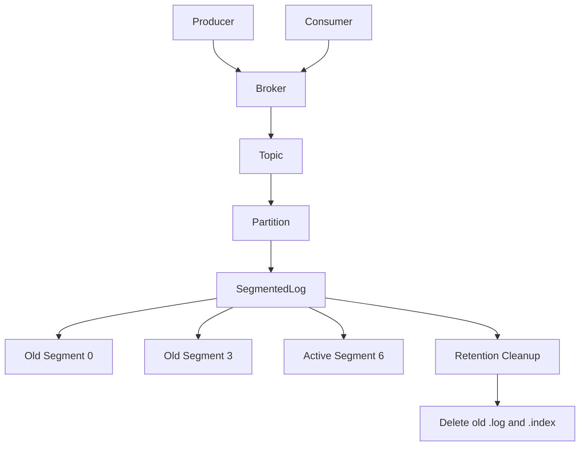
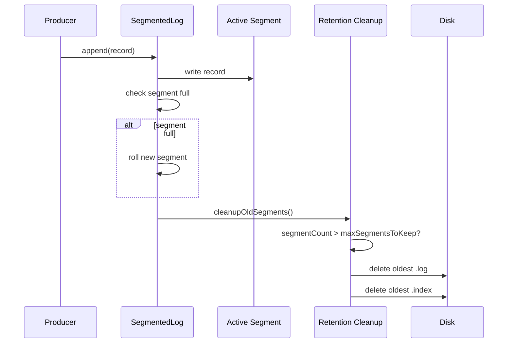

# 019_Retention_Cleanup

# MiniKafka Step 19 — Retention Cleanup

## Goal

In Step 18, we added index files:

```text
00000000000000000000.log
00000000000000000000.index
00000000000000000003.log
00000000000000000003.index
```

Now we add **retention cleanup**.

Kafka cannot keep all old log data forever.

So Kafka deletes old segment files based on rules like:

```text
delete old segments by size
delete old segments by time
delete old segments by offset
```

In this MiniKafka step, we implement simple retention by number of segments:

```text
keep only latest N segments
delete older segments
```

---

# Delta From Step 18

```text
Step 18:
SegmentedLog creates .log and .index files.
Old segments stay forever.

Step 19:
SegmentedLog deletes old .log and .index files.
Retention policy keeps only latest N segments.
```

Modified classes:

```text
SegmentedLog
Partition
Topic
Broker
```

New behavior:

```text
cleanupOldSegments()
```

Main learning:

```text
Kafka retention deletes old segment files, not individual records.
```

---

# Why Retention Cleanup Exists

Without retention:

```text
logs grow forever
disk fills up
broker crashes
startup becomes slow
```

With retention:

```text
old segment files are deleted
disk usage is bounded
broker remains stable
```

Kafka usually deletes whole segments because it is cheap:

```text
delete file = fast
delete records inside file = expensive
```

---

# Important Rule

Retention should not delete active segment.

```text
active segment = latest segment being written
```

We only delete old inactive segments.

Example:

```text
keepLatestSegments = 2

Before:
00000000000000000000.log
00000000000000000003.log
00000000000000000006.log
00000000000000000009.log

After cleanup:
00000000000000000006.log
00000000000000000009.log
```

Same cleanup applies to `.index` files.

---

# Detailed Steps Before Code

## Step 1 — Keep segment rolling

Segment rolling still creates:

```text
baseOffset.log
baseOffset.index
```

## Step 2 — Add retention config

Add:

```java
int maxSegmentsToKeep
```

## Step 3 — Call cleanup after rolling/appending

After append, run:

```java
cleanupOldSegments();
```

## Step 4 — Delete oldest segments

If segment count exceeds max:

```text
delete oldest segment.log
delete oldest segment.index
remove from memory list
```

## Step 5 — Never delete active segment

Keep at least the newest segment.

## Step 6 — Keep consumer behavior

If consumer asks for an offset older than retained data, it will not find deleted records.

Later, real Kafka handles this with:

```text
OffsetOutOfRange
auto.offset.reset
```

For MiniKafka, missing old data simply returns from available segments.

---

# Architecture Mermaid Diagram



---

# Retention Flow Mermaid Diagram



---

# Folder Structure

```text
MiniKafka/
└── src/main/java/com/minikafka/step19/
    ├── MessageRecord.java
    ├── RecordSerializer.java
    ├── OffsetIndex.java
    ├── LogSegment.java
    ├── SegmentedLog.java
    ├── Partition.java
    ├── Topic.java
    ├── Broker.java
    ├── Producer.java
    ├── GroupOffsetKey.java
    ├── GroupOffsetStore.java
    ├── PartitionAssignment.java
    ├── PartitionAssignmentStrategy.java
    ├── RoundRobinPartitionAssignmentStrategy.java
    ├── ConsumerGroup.java
    ├── Consumer.java
    └── Step19Driver.java
```

---

# CP/DSA Concepts Used

## 1. Queue-Like Deletion

Oldest segment is at index 0:

```java
LogSegment oldest = segments.remove(0);
```

This behaves like queue front deletion.

For `ArrayList`, removing from front costs:

```text
O(n)
```

For production, `Deque` would be better.

## 2. Sliding Window

Retention keeps the latest N segments.

This is like sliding window over segment list:

```text
[old old keep keep]
```

After cleanup:

```text
[keep keep]
```

## 3. List Sorted By Base Offset

Segments are sorted by base offset.

```text
0, 3, 6, 9
```

Oldest is first, newest is last.

## 4. Paired File Cleanup

Each segment has two files:

```text
.log
.index
```

Cleanup must delete both.

## 5. Tradeoff

Deleting old data saves disk, but consumers with very old offsets may lose data.

---

# Complete Java Code

---

# MessageRecord.java

```java
package com.minikafka.step19;

public class MessageRecord {

    private final long offset;
    private final String key;
    private final String value;

    public MessageRecord(long offset, String key, String value) {
        this.offset = offset;
        this.key = key;
        this.value = value;
    }

    public long getOffset() {
        return offset;
    }

    public String getKey() {
        return key;
    }

    public String getValue() {
        return value;
    }

    @Override
    public String toString() {
        return "MessageRecord{" +
                "offset=" + offset +
                ", key='" + key + '\'' +
                ", value='" + value + '\'' +
                '}';
    }
}
```

---

# RecordSerializer.java

```java
package com.minikafka.step19;

public class RecordSerializer {

    public static String serialize(MessageRecord record) {
        return record.getOffset() + "|" + record.getKey() + "|" + record.getValue();
    }

    public static MessageRecord deserialize(String line) {
        String[] parts = line.split("\\|", 3);

        long offset = Long.parseLong(parts[0]);
        String key = parts[1];
        String value = parts[2];

        return new MessageRecord(offset, key, value);
    }
}
```

---

# OffsetIndex.java

```java
package com.minikafka.step19;

import java.io.IOException;
import java.nio.file.Files;
import java.nio.file.Path;
import java.nio.file.StandardOpenOption;
import java.util.List;

public class OffsetIndex {

    private final Path indexPath;

    public OffsetIndex(Path indexPath) throws IOException {
        this.indexPath = indexPath;

        Files.createDirectories(indexPath.getParent());

        if (!Files.exists(indexPath)) {
            Files.createFile(indexPath);
        }
    }

    public void append(long offset, long lineNumber) throws IOException {
        String line = offset + "|" + lineNumber;

        Files.writeString(
                indexPath,
                line + System.lineSeparator(),
                StandardOpenOption.APPEND
        );
    }

    public long findLineNumber(long targetOffset) throws IOException {
        List<String> lines = Files.readAllLines(indexPath);

        long bestLineNumber = 0;

        for (String line : lines) {
            if (line.isBlank()) {
                continue;
            }

            String[] parts = line.split("\\|", 2);

            long offset = Long.parseLong(parts[0]);
            long lineNumber = Long.parseLong(parts[1]);

            if (offset <= targetOffset) {
                bestLineNumber = lineNumber;
            } else {
                break;
            }
        }

        return bestLineNumber;
    }

    public Path getIndexPath() {
        return indexPath;
    }
}
```

---

# LogSegment.java

```java
package com.minikafka.step19;

import java.io.IOException;
import java.nio.file.Files;
import java.nio.file.Path;
import java.nio.file.StandardOpenOption;
import java.util.ArrayList;
import java.util.List;
import java.util.stream.Stream;

public class LogSegment {

    private final Path logPath;
    private final long baseOffset;
    private final OffsetIndex offsetIndex;

    public LogSegment(Path logPath, long baseOffset) throws IOException {
        this.logPath = logPath;
        this.baseOffset = baseOffset;

        Files.createDirectories(logPath.getParent());

        if (!Files.exists(logPath)) {
            Files.createFile(logPath);
        }

        Path indexPath = buildIndexPath(logPath);
        this.offsetIndex = new OffsetIndex(indexPath);
    }

    public void append(MessageRecord record) throws IOException {
        long lineNumber = size();

        String line = RecordSerializer.serialize(record);

        Files.writeString(
                logPath,
                line + System.lineSeparator(),
                StandardOpenOption.APPEND
        );

        offsetIndex.append(record.getOffset(), lineNumber);
    }

    public List<MessageRecord> readFromOffset(long startOffset) throws IOException {
        List<MessageRecord> result = new ArrayList<>();

        long lineToStart = offsetIndex.findLineNumber(startOffset);

        List<String> lines = Files.readAllLines(logPath);

        for (int i = (int) lineToStart; i < lines.size(); i++) {
            String line = lines.get(i);

            if (line.isBlank()) {
                continue;
            }

            MessageRecord record = RecordSerializer.deserialize(line);

            if (record.getOffset() >= startOffset) {
                result.add(record);
            }
        }

        return result;
    }

    public long size() throws IOException {
        try (Stream<String> lines = Files.lines(logPath)) {
            return lines.filter(line -> !line.isBlank()).count();
        }
    }

    public boolean isFull(int maxRecordsPerSegment) throws IOException {
        return size() >= maxRecordsPerSegment;
    }

    public long getBaseOffset() {
        return baseOffset;
    }

    public long getLastOffset() throws IOException {
        long size = size();

        if (size == 0) {
            return baseOffset - 1;
        }

        return baseOffset + size - 1;
    }

    private Path buildIndexPath(Path logPath) {
        String fileName = logPath.getFileName().toString();
        String indexFileName = fileName.replace(".log", ".index");

        return logPath.getParent().resolve(indexFileName);
    }

    public Path getLogPath() {
        return logPath;
    }

    public Path getIndexPath() {
        return offsetIndex.getIndexPath();
    }
}
```

---

# SegmentedLog.java

```java
package com.minikafka.step19;

import java.io.IOException;
import java.nio.file.Files;
import java.nio.file.Path;
import java.util.ArrayList;
import java.util.Comparator;
import java.util.List;

// DELTA from Step 18:
// SegmentedLog now has maxSegmentsToKeep and cleanupOldSegments().
public class SegmentedLog {

    private final Path partitionDirectory;
    private final int maxRecordsPerSegment;
    private final int maxSegmentsToKeep;
    private final List<LogSegment> segments;

    private long nextOffset;

    public SegmentedLog(
            String topicName,
            int partitionId,
            int maxRecordsPerSegment,
            int maxSegmentsToKeep
    ) throws IOException {

        this.partitionDirectory =
                Path.of("data/phase1/" + topicName + "-" + partitionId);

        this.maxRecordsPerSegment = maxRecordsPerSegment;
        this.maxSegmentsToKeep = maxSegmentsToKeep;
        this.segments = new ArrayList<>();

        Files.createDirectories(partitionDirectory);

        loadExistingSegments();

        if (segments.isEmpty()) {
            rollToNewSegment(0);
            this.nextOffset = 0;
        } else {
            LogSegment lastSegment = segments.get(segments.size() - 1);
            this.nextOffset = lastSegment.getLastOffset() + 1;
        }

        cleanupOldSegments();
    }

    public long append(String key, String value) throws IOException {
        LogSegment activeSegment = getActiveSegment();

        if (activeSegment.isFull(maxRecordsPerSegment)) {
            activeSegment = rollToNewSegment(nextOffset);
        }

        MessageRecord record = new MessageRecord(nextOffset, key, value);

        activeSegment.append(record);

        long writtenOffset = nextOffset;
        nextOffset++;

        // DELTA from Step 18:
        // After append, apply retention.
        cleanupOldSegments();

        return writtenOffset;
    }

    public List<MessageRecord> readFromOffset(long startOffset) throws IOException {
        List<MessageRecord> result = new ArrayList<>();

        for (LogSegment segment : segments) {
            if (segment.getLastOffset() < startOffset) {
                continue;
            }

            result.addAll(segment.readFromOffset(startOffset));
        }

        return result;
    }

    private void cleanupOldSegments() throws IOException {
        // DELTA from Step 18:
        // Delete oldest segments while count exceeds retention limit.
        // Always keep latest maxSegmentsToKeep segments.
        while (segments.size() > maxSegmentsToKeep) {
            LogSegment oldest = segments.remove(0);

            Files.deleteIfExists(oldest.getLogPath());
            Files.deleteIfExists(oldest.getIndexPath());

            System.out.println(
                    "Retention cleanup deleted segment: " +
                            oldest.getLogPath().getFileName()
            );
        }
    }

    private void loadExistingSegments() throws IOException {
        if (!Files.exists(partitionDirectory)) {
            return;
        }

        try (var paths = Files.list(partitionDirectory)) {
            List<Path> segmentFiles =
                    paths
                            .filter(path -> path.toString().endsWith(".log"))
                            .sorted(Comparator.comparing(Path::toString))
                            .toList();

            for (Path file : segmentFiles) {
                long baseOffset = parseBaseOffset(file);
                segments.add(new LogSegment(file, baseOffset));
            }
        }
    }

    private LogSegment rollToNewSegment(long baseOffset) throws IOException {
        String fileName = String.format("%020d.log", baseOffset);
        Path segmentPath = partitionDirectory.resolve(fileName);

        LogSegment segment = new LogSegment(segmentPath, baseOffset);
        segments.add(segment);

        System.out.println("Rolled new segment: " + segmentPath);

        return segment;
    }

    private LogSegment getActiveSegment() {
        return segments.get(segments.size() - 1);
    }

    private long parseBaseOffset(Path file) {
        String fileName = file.getFileName().toString();
        String numberPart = fileName.replace(".log", "");

        return Long.parseLong(numberPart);
    }
}
```

---

# Partition.java

```java
package com.minikafka.step19;

import java.io.IOException;
import java.util.List;

public class Partition {

    private final int partitionId;
    private final SegmentedLog segmentedLog;

    public Partition(
            String topicName,
            int partitionId,
            int maxRecordsPerSegment,
            int maxSegmentsToKeep
    ) throws IOException {

        this.partitionId = partitionId;
        this.segmentedLog =
                new SegmentedLog(
                        topicName,
                        partitionId,
                        maxRecordsPerSegment,
                        maxSegmentsToKeep
                );
    }

    public long append(String key, String value) throws IOException {
        return segmentedLog.append(key, value);
    }

    public List<MessageRecord> readFromOffset(long offset) throws IOException {
        return segmentedLog.readFromOffset(offset);
    }

    public int getPartitionId() {
        return partitionId;
    }
}
```

---

# Topic.java

```java
package com.minikafka.step19;

import java.io.IOException;
import java.util.ArrayList;
import java.util.List;

public class Topic {

    private final String name;
    private final List<Partition> partitions;

    public Topic(
            String name,
            int partitionCount,
            int maxRecordsPerSegment,
            int maxSegmentsToKeep
    ) throws IOException {

        if (partitionCount <= 0) {
            throw new IllegalArgumentException("partitionCount must be > 0");
        }

        this.name = name;
        this.partitions = new ArrayList<>();

        for (int partitionId = 0; partitionId < partitionCount; partitionId++) {
            partitions.add(
                    new Partition(
                            name,
                            partitionId,
                            maxRecordsPerSegment,
                            maxSegmentsToKeep
                    )
            );
        }
    }

    public long append(String key, String value) throws IOException {
        int partitionId = calculatePartitionId(key);

        System.out.println(
                "Topic '" + name + "' routed key='" + key + "' to partition " + partitionId
        );

        return getPartition(partitionId).append(key, value);
    }

    public List<MessageRecord> readFromPartitionOffset(int partitionId, long offset)
            throws IOException {

        return getPartition(partitionId).readFromOffset(offset);
    }

    private int calculatePartitionId(String key) {
        int hash = Math.abs(key.hashCode());
        return hash % partitions.size();
    }

    public Partition getPartition(int partitionId) {
        if (partitionId < 0 || partitionId >= partitions.size()) {
            throw new IllegalArgumentException("Invalid partition id: " + partitionId);
        }

        return partitions.get(partitionId);
    }

    public int getPartitionCount() {
        return partitions.size();
    }
}
```

---

# Broker.java

```java
package com.minikafka.step19;

import java.io.IOException;
import java.util.HashMap;
import java.util.List;
import java.util.Map;

public class Broker {

    private final Map<String, Topic> topics;

    public Broker() {
        this.topics = new HashMap<>();
    }

    public void createTopic(
            String topicName,
            int partitionCount,
            int maxRecordsPerSegment,
            int maxSegmentsToKeep
    ) throws IOException {

        if (topics.containsKey(topicName)) {
            throw new IllegalArgumentException("Topic already exists: " + topicName);
        }

        Topic topic =
                new Topic(
                        topicName,
                        partitionCount,
                        maxRecordsPerSegment,
                        maxSegmentsToKeep
                );

        topics.put(topicName, topic);

        System.out.println(
                "Broker created topic: " + topicName +
                        ", partitions=" + partitionCount +
                        ", maxRecordsPerSegment=" + maxRecordsPerSegment +
                        ", maxSegmentsToKeep=" + maxSegmentsToKeep
        );
    }

    public long send(String topicName, String key, String value) throws IOException {
        return getTopic(topicName).append(key, value);
    }

    public List<MessageRecord> readPartitionFromOffset(
            String topicName,
            int partitionId,
            long offset
    ) throws IOException {

        return getTopic(topicName).readFromPartitionOffset(partitionId, offset);
    }

    public int getPartitionCount(String topicName) {
        return getTopic(topicName).getPartitionCount();
    }

    private Topic getTopic(String topicName) {
        Topic topic = topics.get(topicName);

        if (topic == null) {
            throw new IllegalArgumentException("Topic not found: " + topicName);
        }

        return topic;
    }
}
```

---

# Producer.java

```java
package com.minikafka.step19;

import java.io.IOException;

public class Producer {

    private final Broker broker;

    public Producer(Broker broker) {
        this.broker = broker;
    }

    public long send(String topicName, String key, String value) throws IOException {
        System.out.println(
                "Producer sending: topic=" + topicName +
                        ", key=" + key +
                        ", value=" + value
        );

        return broker.send(topicName, key, value);
    }
}
```

---

# GroupOffsetKey.java

```java
package com.minikafka.step19;

import java.util.Objects;

public class GroupOffsetKey {

    private final String groupId;
    private final String topicName;
    private final int partitionId;

    public GroupOffsetKey(String groupId, String topicName, int partitionId) {
        this.groupId = groupId;
        this.topicName = topicName;
        this.partitionId = partitionId;
    }

    @Override
    public boolean equals(Object other) {
        if (this == other) {
            return true;
        }

        if (!(other instanceof GroupOffsetKey)) {
            return false;
        }

        GroupOffsetKey that = (GroupOffsetKey) other;

        return partitionId == that.partitionId
                && Objects.equals(groupId, that.groupId)
                && Objects.equals(topicName, that.topicName);
    }

    @Override
    public int hashCode() {
        return Objects.hash(groupId, topicName, partitionId);
    }

    @Override
    public String toString() {
        return groupId + "-" + topicName + "-" + partitionId;
    }
}
```

---

# GroupOffsetStore.java

```java
package com.minikafka.step19;

import java.util.HashMap;
import java.util.Map;

public class GroupOffsetStore {

    private final Map<GroupOffsetKey, Long> committedOffsets;

    public GroupOffsetStore() {
        this.committedOffsets = new HashMap<>();
    }

    public long getCommittedOffset(String groupId, String topicName, int partitionId) {
        GroupOffsetKey key = new GroupOffsetKey(groupId, topicName, partitionId);

        return committedOffsets.getOrDefault(key, 0L);
    }

    public void commit(String groupId, String topicName, int partitionId, long nextOffset) {
        GroupOffsetKey key = new GroupOffsetKey(groupId, topicName, partitionId);

        committedOffsets.put(key, nextOffset);

        System.out.println("Committed offset: " + key + " -> " + nextOffset);
    }
}
```

---

# PartitionAssignment.java

```java
package com.minikafka.step19;

import java.util.ArrayList;
import java.util.HashMap;
import java.util.List;
import java.util.Map;

public class PartitionAssignment {

    private final Map<String, List<Integer>> assignment;

    public PartitionAssignment() {
        this.assignment = new HashMap<>();
    }

    public void assign(String consumerId, int partitionId) {
        assignment
                .computeIfAbsent(consumerId, key -> new ArrayList<>())
                .add(partitionId);
    }

    public List<Integer> getPartitions(String consumerId) {
        return assignment.getOrDefault(consumerId, List.of());
    }

    public void printAssignment() {
        System.out.println("---- PARTITION ASSIGNMENT ----");

        for (Map.Entry<String, List<Integer>> entry : assignment.entrySet()) {
            System.out.println(entry.getKey() + " -> " + entry.getValue());
        }
    }
}
```

---

# PartitionAssignmentStrategy.java

```java
package com.minikafka.step19;

import java.util.List;

public interface PartitionAssignmentStrategy {

    PartitionAssignment assign(List<Consumer> consumers, int partitionCount);
}
```

---

# RoundRobinPartitionAssignmentStrategy.java

```java
package com.minikafka.step19;

import java.util.List;

public class RoundRobinPartitionAssignmentStrategy implements PartitionAssignmentStrategy {

    @Override
    public PartitionAssignment assign(List<Consumer> consumers, int partitionCount) {
        if (consumers.isEmpty()) {
            throw new IllegalArgumentException("No consumers available for assignment");
        }

        PartitionAssignment assignment = new PartitionAssignment();

        for (int partitionId = 0; partitionId < partitionCount; partitionId++) {
            int consumerIndex = partitionId % consumers.size();
            Consumer selectedConsumer = consumers.get(consumerIndex);
            assignment.assign(selectedConsumer.getConsumerId(), partitionId);
        }

        return assignment;
    }
}
```

---

# ConsumerGroup.java

```java
package com.minikafka.step19;

import java.util.ArrayList;
import java.util.List;

public class ConsumerGroup {

    private final String groupId;
    private final GroupOffsetStore offsetStore;
    private final List<Consumer> consumers;
    private final PartitionAssignmentStrategy assignmentStrategy;

    private PartitionAssignment partitionAssignment;

    public ConsumerGroup(
            String groupId,
            GroupOffsetStore offsetStore,
            PartitionAssignmentStrategy assignmentStrategy
    ) {
        this.groupId = groupId;
        this.offsetStore = offsetStore;
        this.assignmentStrategy = assignmentStrategy;
        this.consumers = new ArrayList<>();
    }

    public void join(Consumer consumer, String topicName, int partitionCount) {
        consumers.add(consumer);
        System.out.println(consumer.getConsumerId() + " joined group " + groupId);
        rebalance(topicName, partitionCount);
    }

    public void rebalance(String topicName, int partitionCount) {
        this.partitionAssignment =
                assignmentStrategy.assign(consumers, partitionCount);

        System.out.println(
                "Rebalanced group '" + groupId +
                        "' for topic '" + topicName + "'"
        );

        partitionAssignment.printAssignment();
    }

    public List<Integer> getAssignedPartitions(String consumerId) {
        if (partitionAssignment == null) {
            throw new IllegalStateException("Partitions are not assigned yet");
        }

        return partitionAssignment.getPartitions(consumerId);
    }

    public String getGroupId() {
        return groupId;
    }

    public GroupOffsetStore getOffsetStore() {
        return offsetStore;
    }
}
```

---

# Consumer.java

```java
package com.minikafka.step19;

import java.io.IOException;
import java.util.List;

public class Consumer {

    private final String consumerId;
    private final Broker broker;
    private final ConsumerGroup consumerGroup;

    public Consumer(String consumerId, Broker broker, ConsumerGroup consumerGroup) {
        this.consumerId = consumerId;
        this.broker = broker;
        this.consumerGroup = consumerGroup;
    }

    public List<MessageRecord> poll(String topicName, int partitionId) throws IOException {
        String groupId = consumerGroup.getGroupId();

        long committedOffset =
                consumerGroup.getOffsetStore()
                        .getCommittedOffset(groupId, topicName, partitionId);

        System.out.println(
                consumerId + " polling: group=" + groupId +
                        ", topic=" + topicName +
                        ", partition=" + partitionId +
                        ", committedOffset=" + committedOffset
        );

        return broker.readPartitionFromOffset(topicName, partitionId, committedOffset);
    }

    public void pollAssignedAndCommit(String topicName) throws IOException {
        List<Integer> assignedPartitions =
                consumerGroup.getAssignedPartitions(consumerId);

        if (assignedPartitions.isEmpty()) {
            System.out.println(consumerId + " has no assigned partitions");
            return;
        }

        for (int partitionId : assignedPartitions) {
            List<MessageRecord> records = poll(topicName, partitionId);

            long nextOffset = processRecords(records);

            commit(topicName, partitionId, nextOffset);
        }
    }

    private long processRecords(List<MessageRecord> records) {
        long nextOffset = 0;

        for (MessageRecord record : records) {
            System.out.println(consumerId + " processing: " + record);

            nextOffset = record.getOffset() + 1;
        }

        return nextOffset;
    }

    public void commit(String topicName, int partitionId, long nextOffset) {
        String groupId = consumerGroup.getGroupId();

        consumerGroup.getOffsetStore()
                .commit(groupId, topicName, partitionId, nextOffset);
    }

    public String getConsumerId() {
        return consumerId;
    }
}
```

---

# Step19Driver.java

```java
package com.minikafka.step19;

public class Step19Driver {

    public static void main(String[] args) throws Exception {
        Broker broker = new Broker();

        int partitionCount = 1;
        int maxRecordsPerSegment = 3;
        int maxSegmentsToKeep = 2;

        broker.createTopic(
                "orders",
                partitionCount,
                maxRecordsPerSegment,
                maxSegmentsToKeep
        );

        Producer producer = new Producer(broker);

        GroupOffsetStore offsetStore = new GroupOffsetStore();

        PartitionAssignmentStrategy strategy =
                new RoundRobinPartitionAssignmentStrategy();

        ConsumerGroup group =
                new ConsumerGroup("order-service", offsetStore, strategy);

        Consumer consumerA = new Consumer("consumer-A", broker, group);

        group.join(consumerA, "orders", broker.getPartitionCount("orders"));

        System.out.println();
        System.out.println("---- PRODUCE MANY MESSAGES ----");

        for (int i = 1; i <= 12; i++) {
            producer.send("orders", "customer-1", "order-" + i);
        }

        System.out.println();
        System.out.println("---- CONSUME AFTER RETENTION ----");

        consumerA.pollAssignedAndCommit("orders");

        System.out.println();
        System.out.println("Check data/phase1/orders-0/ folder.");
        System.out.println("Only latest 2 segment pairs should remain.");
    }
}
```

---

# What Happens Internally?

With:

```text
maxRecordsPerSegment = 3
maxSegmentsToKeep = 2
```

Generated segments:

```text
0.log
3.log
6.log
9.log
```

After cleanup, keep only latest 2:

```text
6.log
6.index
9.log
9.index
```

Old files deleted:

```text
0.log
0.index
3.log
3.index
```

---

# Run Command

```bash
javac -d out src/main/java/com/minikafka/step19/*.java

java -cp out com.minikafka.step19.Step19Driver
```

---

# Expected Output Pattern

```text
Rolled new segment: 00000000000000000000.log
Rolled new segment: 00000000000000000003.log
Rolled new segment: 00000000000000000006.log
Retention cleanup deleted segment: 00000000000000000000.log
Rolled new segment: 00000000000000000009.log
Retention cleanup deleted segment: 00000000000000000003.log
```

---

# Current MiniKafka State

```text
Supported:
[yes] append-only storage
[yes] offsets
[yes] partitions
[yes] topics
[yes] broker
[yes] producer
[yes] consumer
[yes] consumer groups
[yes] partition assignment
[yes] rebalancing basics
[yes] segment rolling
[yes] index file
[yes] retention cleanup

Not yet:
[no] replication
[no] leader/follower
[no] ISR
```

---

# Step 19 Completion Checklist

```text
[ ] You understand why retention is needed
[ ] You added maxSegmentsToKeep
[ ] You delete old .log files
[ ] You delete old .index files
[ ] You understand Kafka deletes whole segments
[ ] You understand old offsets may become unavailable
```

---

# Final Mental Model

```text
Kafka retention deletes old segment files.

Segment = unit of deletion
Record = not individually deleted
```

---

# Next Step

Next we build:

```text
020_Replication_Basics
```

Then MiniKafka gets leader/follower replicas.
