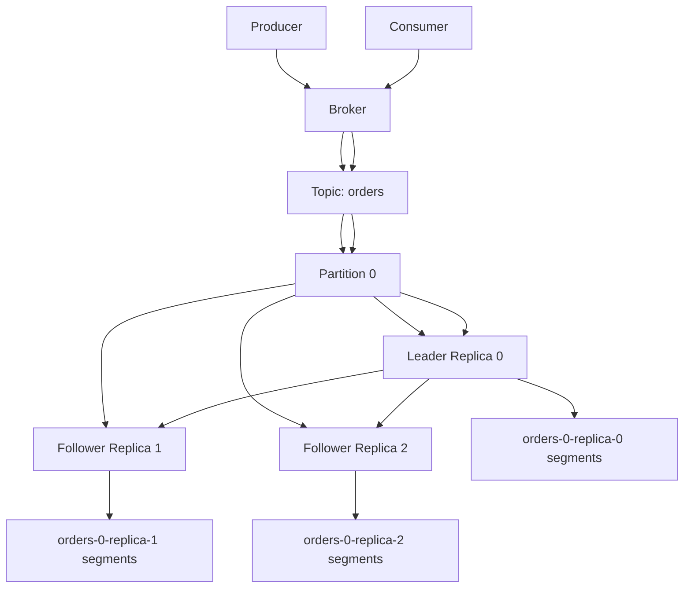
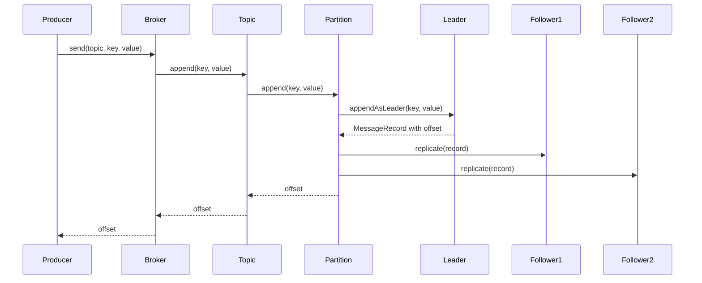

# 020_Replication_Basics

# MiniKafka Step 20 — Replication Basics

## Goal

In Step 19, we added retention cleanup.

Now we add the most important distributed Kafka concept:

```text
replication
```

Replication means:

```text
copy partition data from leader replica to follower replicas
```

In real Kafka, each partition has:

```text
one leader
multiple followers
```

Producer writes to leader.

Followers copy from leader.

Consumers usually read from leader.

---

# Delta From Step 19

```text
Step 19:
Each partition had one local SegmentedLog.

Step 20:
Each partition has multiple replicas:
- one leader replica
- one or more follower replicas
```

Modified classes:

```text
Partition
Topic
Broker
```

New classes:

```text
Replica
ReplicaRole
```

Main learning:

```text
replication gives fault tolerance
```

---

# What We Are Building

For each partition:

```text
Partition 0
   |
   +--> Leader Replica
   |       data/phase1/orders-0-replica-0/
   |
   +--> Follower Replica
   |       data/phase1/orders-0-replica-1/
   |
   +--> Follower Replica
           data/phase1/orders-0-replica-2/
```

Producer write flow:

```text
Producer -> Broker -> Topic -> Partition Leader -> Followers
```

---

# Important Kafka Concepts

## Leader

Leader handles writes.

```text
producer writes to leader
consumer reads from leader
```

## Follower

Follower copies leader data.

```text
follower replica receives replicated record
```

## Replication Factor

Number of copies.

```text
replicationFactor = 3
```

Means:

```text
1 leader + 2 followers
```

## Fault Tolerance

If leader dies, one follower can become new leader.

In this step, we only simulate replication.

Leader election comes later.

---

# Detailed Steps Before Code

## Step 1 — Keep segmented log

Each replica stores data using `SegmentedLog`.

## Step 2 — Add ReplicaRole enum

```text
LEADER
FOLLOWER
```

## Step 3 — Add Replica class

Replica owns:

```text
replicaId
role
SegmentedLog
```

## Step 4 — Modify Partition

Partition now owns:

```text
leaderReplica
followerReplicas
```

## Step 5 — Append to leader first

Producer writes to leader.

## Step 6 — Replicate to followers

After leader append succeeds, copy same record to all followers.

## Step 7 — Read from leader

Consumers read from leader replica.

---

# Architecture Mermaid Diagram



---

# Replication Flow Mermaid Diagram



---

# Folder Structure

```text
MiniKafka/
└── src/main/java/com/minikafka/step20/
    ├── MessageRecord.java
    ├── RecordSerializer.java
    ├── OffsetIndex.java
    ├── LogSegment.java
    ├── SegmentedLog.java
    ├── ReplicaRole.java
    ├── Replica.java
    ├── Partition.java
    ├── Topic.java
    ├── Broker.java
    ├── Producer.java
    ├── GroupOffsetKey.java
    ├── GroupOffsetStore.java
    ├── PartitionAssignment.java
    ├── PartitionAssignmentStrategy.java
    ├── RoundRobinPartitionAssignmentStrategy.java
    ├── ConsumerGroup.java
    ├── Consumer.java
    └── Step20Driver.java
```

Expected data folder:

```text
data/phase1/orders-0-replica-0/
data/phase1/orders-0-replica-1/
data/phase1/orders-0-replica-2/
```

---

# CP/DSA Concepts Used

## 1. Leader-Follower Graph

Replication is like directed graph edges:

```text
leader -> follower1
leader -> follower2
```

## 2. List Traversal

Followers are stored in:

```java
List<Replica> followerReplicas;
```

Replication loops through all followers:

```java
for (Replica follower : followerReplicas)
```

Complexity:

```text
O(replicationFactor)
```

## 3. Same Offset In All Replicas

All replicas store same offset sequence.

This is like keeping arrays synchronized.

## 4. State Machine Replication Idea

Leader applies operation first.

Followers apply same operation in same order.

This is foundational distributed systems.

## 5. Tradeoff

Higher replication factor:

```text
more durability
more write cost
more disk usage
```

---

# Complete Java Code

---

# MessageRecord.java

```java
package com.minikafka.step20;

public class MessageRecord {

    private final long offset;
    private final String key;
    private final String value;

    public MessageRecord(long offset, String key, String value) {
        this.offset = offset;
        this.key = key;
        this.value = value;
    }

    public long getOffset() {
        return offset;
    }

    public String getKey() {
        return key;
    }

    public String getValue() {
        return value;
    }

    @Override
    public String toString() {
        return "MessageRecord{" +
                "offset=" + offset +
                ", key='" + key + '\'' +
                ", value='" + value + '\'' +
                '}';
    }
}
```

---

# RecordSerializer.java

```java
package com.minikafka.step20;

public class RecordSerializer {

    public static String serialize(MessageRecord record) {
        return record.getOffset() + "|" + record.getKey() + "|" + record.getValue();
    }

    public static MessageRecord deserialize(String line) {
        String[] parts = line.split("\\|", 3);

        long offset = Long.parseLong(parts[0]);
        String key = parts[1];
        String value = parts[2];

        return new MessageRecord(offset, key, value);
    }
}
```

---

# OffsetIndex.java

```java
package com.minikafka.step20;

import java.io.IOException;
import java.nio.file.Files;
import java.nio.file.Path;
import java.nio.file.StandardOpenOption;
import java.util.List;

public class OffsetIndex {

    private final Path indexPath;

    public OffsetIndex(Path indexPath) throws IOException {
        this.indexPath = indexPath;

        Files.createDirectories(indexPath.getParent());

        if (!Files.exists(indexPath)) {
            Files.createFile(indexPath);
        }
    }

    public void append(long offset, long lineNumber) throws IOException {
        String line = offset + "|" + lineNumber;

        Files.writeString(
                indexPath,
                line + System.lineSeparator(),
                StandardOpenOption.APPEND
        );
    }

    public long findLineNumber(long targetOffset) throws IOException {
        List<String> lines = Files.readAllLines(indexPath);

        long bestLineNumber = 0;

        for (String line : lines) {
            if (line.isBlank()) {
                continue;
            }

            String[] parts = line.split("\\|", 2);

            long offset = Long.parseLong(parts[0]);
            long lineNumber = Long.parseLong(parts[1]);

            if (offset <= targetOffset) {
                bestLineNumber = lineNumber;
            } else {
                break;
            }
        }

        return bestLineNumber;
    }

    public Path getIndexPath() {
        return indexPath;
    }
}
```

---

# LogSegment.java

```java
package com.minikafka.step20;

import java.io.IOException;
import java.nio.file.Files;
import java.nio.file.Path;
import java.nio.file.StandardOpenOption;
import java.util.ArrayList;
import java.util.List;
import java.util.stream.Stream;

public class LogSegment {

    private final Path logPath;
    private final long baseOffset;
    private final OffsetIndex offsetIndex;

    public LogSegment(Path logPath, long baseOffset) throws IOException {
        this.logPath = logPath;
        this.baseOffset = baseOffset;

        Files.createDirectories(logPath.getParent());

        if (!Files.exists(logPath)) {
            Files.createFile(logPath);
        }

        Path indexPath = buildIndexPath(logPath);
        this.offsetIndex = new OffsetIndex(indexPath);
    }

    public void append(MessageRecord record) throws IOException {
        long lineNumber = size();

        String line = RecordSerializer.serialize(record);

        Files.writeString(
                logPath,
                line + System.lineSeparator(),
                StandardOpenOption.APPEND
        );

        offsetIndex.append(record.getOffset(), lineNumber);
    }

    public List<MessageRecord> readFromOffset(long startOffset) throws IOException {
        List<MessageRecord> result = new ArrayList<>();

        long lineToStart = offsetIndex.findLineNumber(startOffset);

        List<String> lines = Files.readAllLines(logPath);

        for (int i = (int) lineToStart; i < lines.size(); i++) {
            String line = lines.get(i);

            if (line.isBlank()) {
                continue;
            }

            MessageRecord record = RecordSerializer.deserialize(line);

            if (record.getOffset() >= startOffset) {
                result.add(record);
            }
        }

        return result;
    }

    public long size() throws IOException {
        try (Stream<String> lines = Files.lines(logPath)) {
            return lines.filter(line -> !line.isBlank()).count();
        }
    }

    public boolean isFull(int maxRecordsPerSegment) throws IOException {
        return size() >= maxRecordsPerSegment;
    }

    public long getBaseOffset() {
        return baseOffset;
    }

    public long getLastOffset() throws IOException {
        long size = size();

        if (size == 0) {
            return baseOffset - 1;
        }

        return baseOffset + size - 1;
    }

    private Path buildIndexPath(Path logPath) {
        String fileName = logPath.getFileName().toString();
        String indexFileName = fileName.replace(".log", ".index");

        return logPath.getParent().resolve(indexFileName);
    }

    public Path getLogPath() {
        return logPath;
    }

    public Path getIndexPath() {
        return offsetIndex.getIndexPath();
    }
}
```

---

# SegmentedLog.java

```java
package com.minikafka.step20;

import java.io.IOException;
import java.nio.file.Files;
import java.nio.file.Path;
import java.util.ArrayList;
import java.util.Comparator;
import java.util.List;

public class SegmentedLog {

    private final Path replicaDirectory;
    private final int maxRecordsPerSegment;
    private final int maxSegmentsToKeep;
    private final List<LogSegment> segments;

    private long nextOffset;

    public SegmentedLog(
            String logDirectoryName,
            int maxRecordsPerSegment,
            int maxSegmentsToKeep
    ) throws IOException {

        this.replicaDirectory = Path.of("data/phase1/" + logDirectoryName);
        this.maxRecordsPerSegment = maxRecordsPerSegment;
        this.maxSegmentsToKeep = maxSegmentsToKeep;
        this.segments = new ArrayList<>();

        Files.createDirectories(replicaDirectory);

        loadExistingSegments();

        if (segments.isEmpty()) {
            rollToNewSegment(0);
            this.nextOffset = 0;
        } else {
            LogSegment lastSegment = segments.get(segments.size() - 1);
            this.nextOffset = lastSegment.getLastOffset() + 1;
        }

        cleanupOldSegments();
    }

    public MessageRecord appendNewRecord(String key, String value) throws IOException {
        LogSegment activeSegment = getActiveSegment();

        if (activeSegment.isFull(maxRecordsPerSegment)) {
            activeSegment = rollToNewSegment(nextOffset);
        }

        MessageRecord record = new MessageRecord(nextOffset, key, value);

        activeSegment.append(record);

        nextOffset++;

        cleanupOldSegments();

        return record;
    }

    public void appendReplicatedRecord(MessageRecord record) throws IOException {
        LogSegment activeSegment = getActiveSegment();

        if (activeSegment.isFull(maxRecordsPerSegment)) {
            activeSegment = rollToNewSegment(record.getOffset());
        }

        activeSegment.append(record);

        nextOffset = Math.max(nextOffset, record.getOffset() + 1);

        cleanupOldSegments();
    }

    public List<MessageRecord> readFromOffset(long startOffset) throws IOException {
        List<MessageRecord> result = new ArrayList<>();

        for (LogSegment segment : segments) {
            if (segment.getLastOffset() < startOffset) {
                continue;
            }

            result.addAll(segment.readFromOffset(startOffset));
        }

        return result;
    }

    private void cleanupOldSegments() throws IOException {
        while (segments.size() > maxSegmentsToKeep) {
            LogSegment oldest = segments.remove(0);

            Files.deleteIfExists(oldest.getLogPath());
            Files.deleteIfExists(oldest.getIndexPath());

            System.out.println(
                    "Retention cleanup deleted segment: " +
                            oldest.getLogPath().getFileName()
            );
        }
    }

    private void loadExistingSegments() throws IOException {
        if (!Files.exists(replicaDirectory)) {
            return;
        }

        try (var paths = Files.list(replicaDirectory)) {
            List<Path> segmentFiles =
                    paths
                            .filter(path -> path.toString().endsWith(".log"))
                            .sorted(Comparator.comparing(Path::toString))
                            .toList();

            for (Path file : segmentFiles) {
                long baseOffset = parseBaseOffset(file);
                segments.add(new LogSegment(file, baseOffset));
            }
        }
    }

    private LogSegment rollToNewSegment(long baseOffset) throws IOException {
        String fileName = String.format("%020d.log", baseOffset);
        Path segmentPath = replicaDirectory.resolve(fileName);

        LogSegment segment = new LogSegment(segmentPath, baseOffset);
        segments.add(segment);

        System.out.println("Rolled new segment: " + segmentPath);

        return segment;
    }

    private LogSegment getActiveSegment() {
        return segments.get(segments.size() - 1);
    }

    private long parseBaseOffset(Path file) {
        String fileName = file.getFileName().toString();
        String numberPart = fileName.replace(".log", "");

        return Long.parseLong(numberPart);
    }
}
```

---

# ReplicaRole.java

```java
package com.minikafka.step20;

// DELTA from Step 19:
// New enum to distinguish leader and follower replicas.
public enum ReplicaRole {
    LEADER,
    FOLLOWER
}
```

---

# Replica.java

```java
package com.minikafka.step20;

import java.io.IOException;
import java.util.List;

// DELTA from Step 19:
// New class.
// A replica owns its own SegmentedLog.
// Leader accepts new writes.
// Followers receive replicated records.
public class Replica {

    private final int replicaId;
    private final ReplicaRole role;
    private final SegmentedLog segmentedLog;

    public Replica(
            String topicName,
            int partitionId,
            int replicaId,
            ReplicaRole role,
            int maxRecordsPerSegment,
            int maxSegmentsToKeep
    ) throws IOException {

        this.replicaId = replicaId;
        this.role = role;

        String logDirectoryName =
                topicName + "-" + partitionId + "-replica-" + replicaId;

        this.segmentedLog =
                new SegmentedLog(
                        logDirectoryName,
                        maxRecordsPerSegment,
                        maxSegmentsToKeep
                );
    }

    public MessageRecord appendAsLeader(String key, String value) throws IOException {
        if (role != ReplicaRole.LEADER) {
            throw new IllegalStateException("Only leader can accept producer writes");
        }

        return segmentedLog.appendNewRecord(key, value);
    }

    public void replicate(MessageRecord record) throws IOException {
        if (role != ReplicaRole.FOLLOWER) {
            throw new IllegalStateException("Only follower can receive replication");
        }

        segmentedLog.appendReplicatedRecord(record);

        System.out.println(
                "Follower replica " + replicaId +
                        " replicated offset " + record.getOffset()
        );
    }

    public List<MessageRecord> readFromOffset(long offset) throws IOException {
        return segmentedLog.readFromOffset(offset);
    }

    public int getReplicaId() {
        return replicaId;
    }

    public ReplicaRole getRole() {
        return role;
    }
}
```

---

# Partition.java

```java
package com.minikafka.step20;

import java.io.IOException;
import java.util.ArrayList;
import java.util.List;

// DELTA from Step 19:
// Partition now owns leader + follower replicas.
public class Partition {

    private final int partitionId;
    private final Replica leaderReplica;
    private final List<Replica> followerReplicas;

    public Partition(
            String topicName,
            int partitionId,
            int replicationFactor,
            int maxRecordsPerSegment,
            int maxSegmentsToKeep
    ) throws IOException {

        if (replicationFactor <= 0) {
            throw new IllegalArgumentException("replicationFactor must be > 0");
        }

        this.partitionId = partitionId;
        this.followerReplicas = new ArrayList<>();

        this.leaderReplica =
                new Replica(
                        topicName,
                        partitionId,
                        0,
                        ReplicaRole.LEADER,
                        maxRecordsPerSegment,
                        maxSegmentsToKeep
                );

        for (int replicaId = 1; replicaId < replicationFactor; replicaId++) {
            followerReplicas.add(
                    new Replica(
                            topicName,
                            partitionId,
                            replicaId,
                            ReplicaRole.FOLLOWER,
                            maxRecordsPerSegment,
                            maxSegmentsToKeep
                    )
            );
        }
    }

    public long append(String key, String value) throws IOException {
        MessageRecord record = leaderReplica.appendAsLeader(key, value);

        for (Replica follower : followerReplicas) {
            follower.replicate(record);
        }

        return record.getOffset();
    }

    public List<MessageRecord> readFromOffset(long offset) throws IOException {
        return leaderReplica.readFromOffset(offset);
    }

    public int getPartitionId() {
        return partitionId;
    }
}
```

---

# Topic.java

```java
package com.minikafka.step20;

import java.io.IOException;
import java.util.ArrayList;
import java.util.List;

public class Topic {

    private final String name;
    private final List<Partition> partitions;

    public Topic(
            String name,
            int partitionCount,
            int replicationFactor,
            int maxRecordsPerSegment,
            int maxSegmentsToKeep
    ) throws IOException {

        if (partitionCount <= 0) {
            throw new IllegalArgumentException("partitionCount must be > 0");
        }

        this.name = name;
        this.partitions = new ArrayList<>();

        for (int partitionId = 0; partitionId < partitionCount; partitionId++) {
            partitions.add(
                    new Partition(
                            name,
                            partitionId,
                            replicationFactor,
                            maxRecordsPerSegment,
                            maxSegmentsToKeep
                    )
            );
        }
    }

    public long append(String key, String value) throws IOException {
        int partitionId = calculatePartitionId(key);

        System.out.println(
                "Topic '" + name + "' routed key='" + key + "' to partition " + partitionId
        );

        return getPartition(partitionId).append(key, value);
    }

    public List<MessageRecord> readFromPartitionOffset(int partitionId, long offset)
            throws IOException {

        return getPartition(partitionId).readFromOffset(offset);
    }

    private int calculatePartitionId(String key) {
        int hash = Math.abs(key.hashCode());
        return hash % partitions.size();
    }

    public Partition getPartition(int partitionId) {
        if (partitionId < 0 || partitionId >= partitions.size()) {
            throw new IllegalArgumentException("Invalid partition id: " + partitionId);
        }

        return partitions.get(partitionId);
    }

    public int getPartitionCount() {
        return partitions.size();
    }
}
```

---

# Broker.java

```java
package com.minikafka.step20;

import java.io.IOException;
import java.util.HashMap;
import java.util.List;
import java.util.Map;

public class Broker {

    private final Map<String, Topic> topics;

    public Broker() {
        this.topics = new HashMap<>();
    }

    public void createTopic(
            String topicName,
            int partitionCount,
            int replicationFactor,
            int maxRecordsPerSegment,
            int maxSegmentsToKeep
    ) throws IOException {

        if (topics.containsKey(topicName)) {
            throw new IllegalArgumentException("Topic already exists: " + topicName);
        }

        Topic topic =
                new Topic(
                        topicName,
                        partitionCount,
                        replicationFactor,
                        maxRecordsPerSegment,
                        maxSegmentsToKeep
                );

        topics.put(topicName, topic);

        System.out.println(
                "Broker created topic: " + topicName +
                        ", partitions=" + partitionCount +
                        ", replicationFactor=" + replicationFactor
        );
    }

    public long send(String topicName, String key, String value) throws IOException {
        return getTopic(topicName).append(key, value);
    }

    public List<MessageRecord> readPartitionFromOffset(
            String topicName,
            int partitionId,
            long offset
    ) throws IOException {

        return getTopic(topicName).readFromPartitionOffset(partitionId, offset);
    }

    public int getPartitionCount(String topicName) {
        return getTopic(topicName).getPartitionCount();
    }

    private Topic getTopic(String topicName) {
        Topic topic = topics.get(topicName);

        if (topic == null) {
            throw new IllegalArgumentException("Topic not found: " + topicName);
        }

        return topic;
    }
}
```

---

# Producer.java

```java
package com.minikafka.step20;

import java.io.IOException;

public class Producer {

    private final Broker broker;

    public Producer(Broker broker) {
        this.broker = broker;
    }

    public long send(String topicName, String key, String value) throws IOException {
        System.out.println(
                "Producer sending: topic=" + topicName +
                        ", key=" + key +
                        ", value=" + value
        );

        return broker.send(topicName, key, value);
    }
}
```

---

# GroupOffsetKey.java

```java
package com.minikafka.step20;

import java.util.Objects;

public class GroupOffsetKey {

    private final String groupId;
    private final String topicName;
    private final int partitionId;

    public GroupOffsetKey(String groupId, String topicName, int partitionId) {
        this.groupId = groupId;
        this.topicName = topicName;
        this.partitionId = partitionId;
    }

    @Override
    public boolean equals(Object other) {
        if (this == other) {
            return true;
        }

        if (!(other instanceof GroupOffsetKey)) {
            return false;
        }

        GroupOffsetKey that = (GroupOffsetKey) other;

        return partitionId == that.partitionId
                && Objects.equals(groupId, that.groupId)
                && Objects.equals(topicName, that.topicName);
    }

    @Override
    public int hashCode() {
        return Objects.hash(groupId, topicName, partitionId);
    }

    @Override
    public String toString() {
        return groupId + "-" + topicName + "-" + partitionId;
    }
}
```

---

# GroupOffsetStore.java

```java
package com.minikafka.step20;

import java.util.HashMap;
import java.util.Map;

public class GroupOffsetStore {

    private final Map<GroupOffsetKey, Long> committedOffsets;

    public GroupOffsetStore() {
        this.committedOffsets = new HashMap<>();
    }

    public long getCommittedOffset(String groupId, String topicName, int partitionId) {
        GroupOffsetKey key = new GroupOffsetKey(groupId, topicName, partitionId);

        return committedOffsets.getOrDefault(key, 0L);
    }

    public void commit(String groupId, String topicName, int partitionId, long nextOffset) {
        GroupOffsetKey key = new GroupOffsetKey(groupId, topicName, partitionId);

        committedOffsets.put(key, nextOffset);

        System.out.println("Committed offset: " + key + " -> " + nextOffset);
    }
}
```

---

# PartitionAssignment.java

```java
package com.minikafka.step20;

import java.util.ArrayList;
import java.util.HashMap;
import java.util.List;
import java.util.Map;

public class PartitionAssignment {

    private final Map<String, List<Integer>> assignment;

    public PartitionAssignment() {
        this.assignment = new HashMap<>();
    }

    public void assign(String consumerId, int partitionId) {
        assignment
                .computeIfAbsent(consumerId, key -> new ArrayList<>())
                .add(partitionId);
    }

    public List<Integer> getPartitions(String consumerId) {
        return assignment.getOrDefault(consumerId, List.of());
    }

    public void printAssignment() {
        System.out.println("---- PARTITION ASSIGNMENT ----");

        for (Map.Entry<String, List<Integer>> entry : assignment.entrySet()) {
            System.out.println(entry.getKey() + " -> " + entry.getValue());
        }
    }
}
```

---

# PartitionAssignmentStrategy.java

```java
package com.minikafka.step20;

import java.util.List;

public interface PartitionAssignmentStrategy {

    PartitionAssignment assign(List<Consumer> consumers, int partitionCount);
}
```

---

# RoundRobinPartitionAssignmentStrategy.java

```java
package com.minikafka.step20;

import java.util.List;

public class RoundRobinPartitionAssignmentStrategy implements PartitionAssignmentStrategy {

    @Override
    public PartitionAssignment assign(List<Consumer> consumers, int partitionCount) {
        if (consumers.isEmpty()) {
            throw new IllegalArgumentException("No consumers available for assignment");
        }

        PartitionAssignment assignment = new PartitionAssignment();

        for (int partitionId = 0; partitionId < partitionCount; partitionId++) {
            int consumerIndex = partitionId % consumers.size();
            Consumer selectedConsumer = consumers.get(consumerIndex);
            assignment.assign(selectedConsumer.getConsumerId(), partitionId);
        }

        return assignment;
    }
}
```

---

# ConsumerGroup.java

```java
package com.minikafka.step20;

import java.util.ArrayList;
import java.util.List;

public class ConsumerGroup {

    private final String groupId;
    private final GroupOffsetStore offsetStore;
    private final List<Consumer> consumers;
    private final PartitionAssignmentStrategy assignmentStrategy;

    private PartitionAssignment partitionAssignment;

    public ConsumerGroup(
            String groupId,
            GroupOffsetStore offsetStore,
            PartitionAssignmentStrategy assignmentStrategy
    ) {
        this.groupId = groupId;
        this.offsetStore = offsetStore;
        this.assignmentStrategy = assignmentStrategy;
        this.consumers = new ArrayList<>();
    }

    public void join(Consumer consumer, String topicName, int partitionCount) {
        consumers.add(consumer);
        System.out.println(consumer.getConsumerId() + " joined group " + groupId);
        rebalance(topicName, partitionCount);
    }

    public void rebalance(String topicName, int partitionCount) {
        this.partitionAssignment =
                assignmentStrategy.assign(consumers, partitionCount);

        System.out.println(
                "Rebalanced group '" + groupId +
                        "' for topic '" + topicName + "'"
        );

        partitionAssignment.printAssignment();
    }

    public List<Integer> getAssignedPartitions(String consumerId) {
        if (partitionAssignment == null) {
            throw new IllegalStateException("Partitions are not assigned yet");
        }

        return partitionAssignment.getPartitions(consumerId);
    }

    public String getGroupId() {
        return groupId;
    }

    public GroupOffsetStore getOffsetStore() {
        return offsetStore;
    }
}
```

---

# Consumer.java

```java
package com.minikafka.step20;

import java.io.IOException;
import java.util.List;

public class Consumer {

    private final String consumerId;
    private final Broker broker;
    private final ConsumerGroup consumerGroup;

    public Consumer(String consumerId, Broker broker, ConsumerGroup consumerGroup) {
        this.consumerId = consumerId;
        this.broker = broker;
        this.consumerGroup = consumerGroup;
    }

    public List<MessageRecord> poll(String topicName, int partitionId) throws IOException {
        String groupId = consumerGroup.getGroupId();

        long committedOffset =
                consumerGroup.getOffsetStore()
                        .getCommittedOffset(groupId, topicName, partitionId);

        System.out.println(
                consumerId + " polling: group=" + groupId +
                        ", topic=" + topicName +
                        ", partition=" + partitionId +
                        ", committedOffset=" + committedOffset
        );

        return broker.readPartitionFromOffset(topicName, partitionId, committedOffset);
    }

    public void pollAssignedAndCommit(String topicName) throws IOException {
        List<Integer> assignedPartitions =
                consumerGroup.getAssignedPartitions(consumerId);

        if (assignedPartitions.isEmpty()) {
            System.out.println(consumerId + " has no assigned partitions");
            return;
        }

        for (int partitionId : assignedPartitions) {
            List<MessageRecord> records = poll(topicName, partitionId);

            long nextOffset = processRecords(records);

            commit(topicName, partitionId, nextOffset);
        }
    }

    private long processRecords(List<MessageRecord> records) {
        long nextOffset = 0;

        for (MessageRecord record : records) {
            System.out.println(consumerId + " processing: " + record);

            nextOffset = record.getOffset() + 1;
        }

        return nextOffset;
    }

    public void commit(String topicName, int partitionId, long nextOffset) {
        String groupId = consumerGroup.getGroupId();

        consumerGroup.getOffsetStore()
                .commit(groupId, topicName, partitionId, nextOffset);
    }

    public String getConsumerId() {
        return consumerId;
    }
}
```

---

# Step20Driver.java

```java
package com.minikafka.step20;

public class Step20Driver {

    public static void main(String[] args) throws Exception {
        Broker broker = new Broker();

        int partitionCount = 2;
        int replicationFactor = 3;
        int maxRecordsPerSegment = 3;
        int maxSegmentsToKeep = 3;

        broker.createTopic(
                "orders",
                partitionCount,
                replicationFactor,
                maxRecordsPerSegment,
                maxSegmentsToKeep
        );

        Producer producer = new Producer(broker);

        GroupOffsetStore offsetStore = new GroupOffsetStore();

        PartitionAssignmentStrategy strategy =
                new RoundRobinPartitionAssignmentStrategy();

        ConsumerGroup group =
                new ConsumerGroup("order-service", offsetStore, strategy);

        Consumer consumerA = new Consumer("consumer-A", broker, group);
        Consumer consumerB = new Consumer("consumer-B", broker, group);

        group.join(consumerA, "orders", broker.getPartitionCount("orders"));
        group.join(consumerB, "orders", broker.getPartitionCount("orders"));

        System.out.println();
        System.out.println("---- PRODUCE MESSAGES WITH REPLICATION ----");

        for (int i = 1; i <= 8; i++) {
            producer.send("orders", "customer-1", "order-" + i);
        }

        System.out.println();
        System.out.println("---- CONSUME FROM LEADER REPLICA ----");

        consumerA.pollAssignedAndCommit("orders");
        consumerB.pollAssignedAndCommit("orders");

        System.out.println();
        System.out.println("Check data/phase1/ folders:");
        System.out.println("orders-0-replica-0");
        System.out.println("orders-0-replica-1");
        System.out.println("orders-0-replica-2");
    }
}
```

---

# What Happens Internally?

With:

```text
replicationFactor = 3
```

Each partition has:

```text
replica 0 = leader
replica 1 = follower
replica 2 = follower
```

When producer sends:

```text
order-1
```

MiniKafka writes:

```text
leader replica
follower replica 1
follower replica 2
```

All replicas should contain the same records for that partition.

---

# Run Command

```bash
javac -d out src/main/java/com/minikafka/step20/*.java

java -cp out com.minikafka.step20.Step20Driver
```

---

# Expected Output Pattern

```text
Broker created topic: orders, partitions=2, replicationFactor=3

Producer sending: topic=orders, key=customer-1, value=order-1
Topic 'orders' routed key='customer-1' to partition X
Follower replica 1 replicated offset 0
Follower replica 2 replicated offset 0
```

---

# Current MiniKafka State

```text
Supported:
[yes] append-only storage
[yes] offsets
[yes] partitions
[yes] topics
[yes] broker
[yes] producer
[yes] consumer
[yes] consumer groups
[yes] partition assignment
[yes] rebalancing basics
[yes] segment rolling
[yes] index file
[yes] retention cleanup
[yes] replication basics

Not yet:
[no] leader election
[no] ISR tracking
[no] follower lag detection
[no] network broker
[no] disk recovery metadata
```

---

# Step 20 Completion Checklist

```text
[ ] You created ReplicaRole
[ ] You created Replica
[ ] You understand leader replica
[ ] You understand follower replicas
[ ] You understand replication factor
[ ] You understand leader writes first
[ ] You understand followers copy leader records
```

---

# Final Mental Model

```text
Partition is replicated.

Producer writes to leader.
Leader appends record.
Followers replicate same record.
Consumer reads from leader.
```

---

# What You Completed In 20 Steps

You built a MiniKafka with:

```text
append-only log
offsets
records
segments
indexes
retention
topics
partitions
broker
producer
consumer
consumer groups
partition assignment
rebalancing
replication basics
```

---

# Future Extensions

```text
021 Leader Election
022 ISR Tracking
023 Follower Lag Detection
024 Network Broker
025 Producer Batching
026 Retry + DLQ
027 Compression
028 Persistent Metadata
029 Docker Compose
030 Metrics + Observability
```
