# 008_BTree_vs_LSMTree.md

# MiniDatabase — 008 BTree vs LSMTree

## 0. Why This File Exists

This is one of the MOST IMPORTANT database-internals files.

Most real databases are built around one of these storage/indexing ideas:

```text
BTree / B+Tree
LSM Tree
```

Examples:

```text
Postgres      → BTree indexes
MySQL InnoDB  → B+Tree clustered index
Oracle        → BTree-like indexes
Cassandra     → LSM Tree
RocksDB       → LSM Tree
LevelDB       → LSM Tree
ScyllaDB      → LSM Tree
HBase         → LSM Tree family
```

This file teaches:

```text
why BTree exists
why LSM Tree exists
how reads work
how writes work
why SQL databases prefer BTree
why write-heavy NoSQL systems prefer LSM Tree
page split
memtable
SSTable
compaction
read amplification
write amplification
production tradeoffs
```

Big goal:

```text
Understand why different databases choose different storage engines.
```

---

# 1. One-Line Definitions

## BTree / B+Tree

```text
A disk-friendly sorted tree index optimized for reads, range queries, and ordered scans.
```

## LSM Tree

```text
A write-optimized storage structure that writes to memory first,
flushes sorted files to disk, and merges them later using compaction.
```

---

# 2. Biggest Mental Model

```text
BTree
=
read-optimized
ordered
page-based
in-place-ish updates
excellent range queries
```

```text
LSM Tree
=
write-optimized
append-heavy
memory first
sorted files later
background compaction
excellent high write throughput
```

Remember:

```text
BTree = reads + range
LSM   = writes + ingestion
```

---

# 3. Why Hash Index Was Not Enough

Hash index is excellent for:

```sql
WHERE id = 10
```

But bad for:

```sql
WHERE id BETWEEN 10 AND 100
ORDER BY id
WHERE created_at > now() - interval '1 day'
```

Why?

```text
hashing destroys ordering
```

Need a sorted index.

This is why BTree exists.

---

# 4. Why Disk Changes Everything

In memory, binary search trees are fine.

On disk, random pointer chasing is expensive.

Bad disk structure:

```text
Node
 ↓ random disk read
Node
 ↓ random disk read
Node
 ↓ random disk read
```

Too slow.

Database indexes are designed around:

```text
pages / blocks
```

---

# 5. Disk Page Mental Model

Database reads disk in pages.

Example:

```text
Page size = 8 KB / 16 KB
```

A page can hold many keys.

So database wants:

```text
few page reads
```

not many tiny pointer reads.

---

# 6. Binary Tree Problem On Disk

A normal binary tree node has:

```text
1 key
2 pointers
```

For millions of keys:

```text
tree height large
many disk reads
```

Bad.

---

# 7. BTree Solution

A BTree node stores:

```text
many keys
many child pointers
```

This creates:

```text
large branching factor
small tree height
few disk reads
```

---

# 8. BTree Node Mental Model

```text
+------------------------------------+
| 10 | 20 | 30 | 40 | 50 | 60       |
+------------------------------------+
 /    /    /    /    /    /    /
```

One page contains many keys.

That is the key idea.

---

# 9. BTree Height Mental Model

Because each node has many children:

```text
millions of rows
still only 3-4 levels deep
```

Example:

```text
Root Page
   ↓
Internal Page
   ↓
Leaf Page
   ↓
Record
```

Few disk reads.

---

# 10. BTree High-Level Structure

```text
             [30 | 60]
            /    |    \
           /     |     \
 [1..29 leaf] [31..59] [61..99]
```

Keys sorted.

Traversal follows ranges.

---

# 11. B+Tree Mental Model

Most databases use B+Tree-style indexes.

Important idea:

```text
internal nodes store routing keys
leaf nodes store actual entries
leaf nodes linked in sorted order
```

---

# 12. B+Tree Diagram

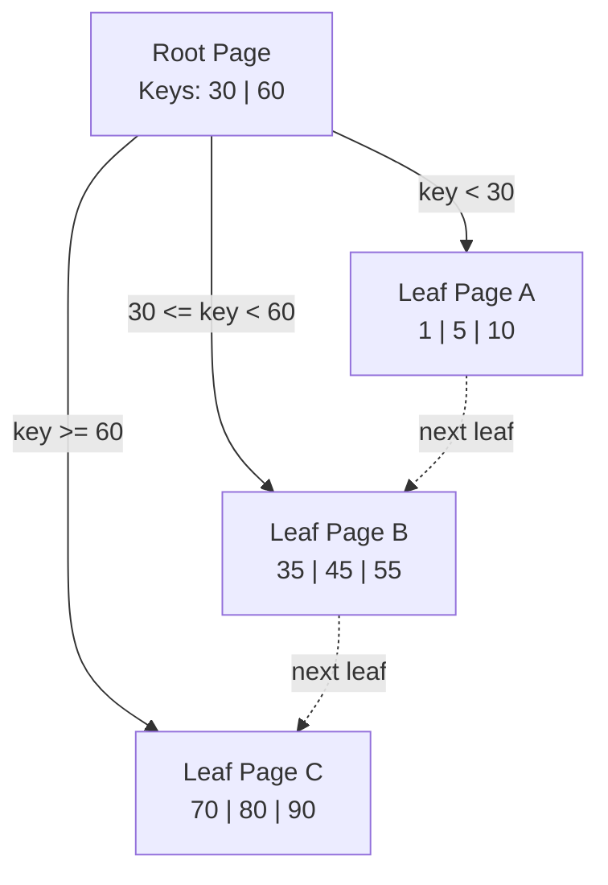

Leaf links make range scans efficient.

Tree mental model:

```text
Internal pages = routing keys
Leaf pages     = actual index entries
Leaf links     = fast range scan
```

---

# 13. BTree Lookup Flow

Query:

```sql
SELECT * FROM users WHERE id = 45;
```

Flow:

```text
start root page
    ↓
compare keys
    ↓
choose child pointer
    ↓
load child page
    ↓
repeat
    ↓
reach leaf
    ↓
find key
    ↓
get RID / row pointer
```

---

# 14. BTree Lookup Tree Flow

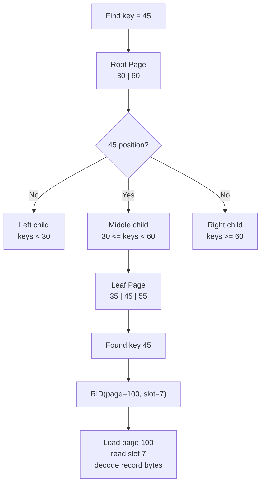

Mental flow:

```text
Root page
  ↓
Choose child
  ↓
Leaf page
  ↓
RID
  ↓
Record bytes
```

---

# 15. BTree Range Query Flow

Query:

```sql
SELECT * FROM users
WHERE id BETWEEN 40 AND 80;
```

Flow:

```text
find first key >= 40
      ↓
scan linked leaf pages
      ↓
stop after 80
```

This is why BTree is excellent for ranges.

---

# 16. BTree Range Scan Diagram

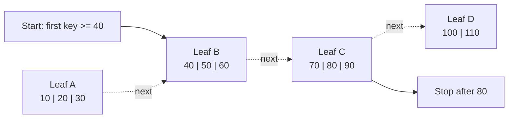

Very efficient.

Range scan mental model:

```text
Find first leaf once
then sequentially follow leaf links
```

---

# 17. BTree Insert Flow

Insert key:

```text
45
```

Flow:

```text
find correct leaf
      ↓
has space?
      ├── yes → insert sorted
      └── no  → split page
```

---

# 18. BTree Insert Without Split

Before:

```text
Leaf: [10 | 20 | 40]
```

Insert:

```text
30
```

After:

```text
Leaf: [10 | 20 | 30 | 40]
```

Simple.

---

# 19. BTree Page Split

If leaf full:

```text
Leaf: [10 | 20 | 30 | 40]
```

Insert:

```text
25
```

Need split:

```text
Left Leaf:  [10 | 20]
Right Leaf: [25 | 30 | 40]
```

Parent updated with separator key.

---

# 20. Page Split Diagram

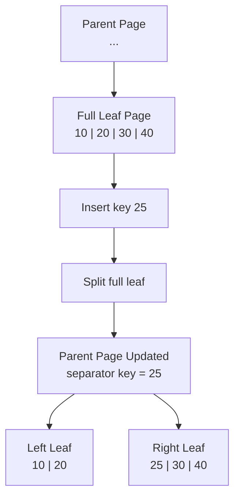

Tree update mental model:

```text
Leaf split can bubble up to parent.
If parent is also full, parent may split too.
```

---

# 21. Why BTree Writes Can Be Costly

BTree write may require:

```text
find page
modify page
split page
update parent
write WAL
dirty multiple pages
```

This causes:

```text
random writes
write amplification
page splits
```

---

# 22. BTree Strengths

```text
fast point lookup
excellent range query
ordered traversal
mature
works well for OLTP
good for primary/secondary indexes
```

---

# 23. BTree Weaknesses

```text
random writes
page splits
less ideal for massive write ingestion
write amplification
more costly under heavy write load
```

---

# 24. Where BTree Is Used

```text
Postgres indexes
MySQL InnoDB indexes
Oracle indexes
SQL Server indexes
```

Best for:

```text
OLTP systems
financial apps
inventory
orders
user accounts
range queries
```

---

# 25. Why LSM Tree Exists

Some workloads are extremely write-heavy:

```text
logs
metrics
IoT
clickstream
events
time-series
large-scale ingestion
```

BTree random writes become expensive.

LSM solves this by making writes mostly:

```text
sequential and append-like
```

---

# 26. LSM Full Form

```text
Log-Structured Merge Tree
```

Important words:

```text
Log-Structured = append-like writes
Merge = background compaction
Tree = organized sorted levels
```

---

# 27. LSM Biggest Mental Model

```text
Write to memory first
      ↓
append to WAL for durability
      ↓
flush sorted file to disk
      ↓
merge files later
```

---

# 28. LSM Write Path

```text
Write request
    ↓
Append WAL
    ↓
Write to MemTable
    ↓
Return success
    ↓
Later flush MemTable to SSTable
    ↓
Later compact SSTables
```

---

# 29. LSM Write Path Diagram

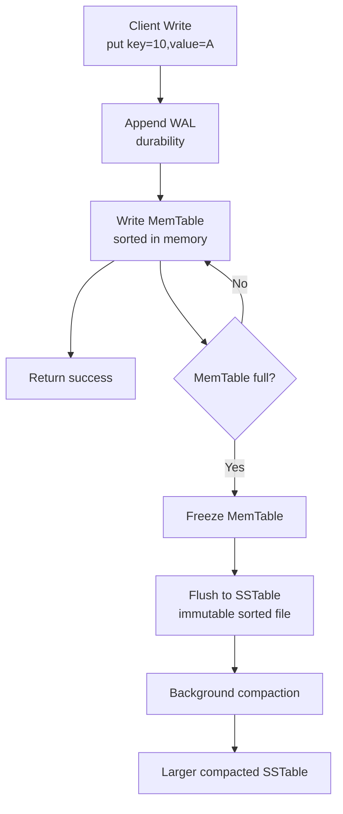

LSM write mental model:

```text
foreground write = WAL append + memory write
disk organization = later background work
```

---

# 30. MemTable

MemTable is:

```text
in-memory sorted table
```

Usually implemented using:

```text
skip list
tree map
balanced tree
```

It holds recent writes.

---

# 31. Why MemTable Is Sorted

Because when flushed to disk, it creates:

```text
sorted SSTable
```

Sorted files allow:

```text
binary search
range scans
merge compaction
```

---

# 32. WAL In LSM

Before writing to MemTable:

```text
append write to WAL
```

Why?

```text
if crash happens before flush,
replay WAL to rebuild MemTable
```

---

# 33. LSM Crash Recovery

Crash happens.

Recovery:

```text
read WAL
    ↓
replay writes
    ↓
rebuild MemTable
```

This gives durability.

---

# 34. SSTable

SSTable means:

```text
Sorted String Table
```

It is:

```text
immutable sorted file on disk
```

Once written:

```text
never modified
```

This is very important.

---


---

# 34A. LSM Level Structure Diagram

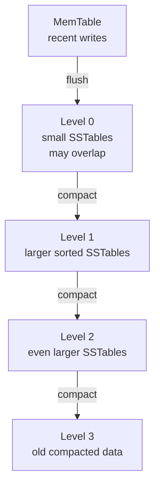

Mental model:

```text
fresh data starts in memory
then moves down levels through compaction
```

# 35. SSTable Diagram

```text
SSTable-1

+-------------------+
| key=1   value=A   |
| key=5   value=B   |
| key=9   value=C   |
| key=20  value=D   |
+-------------------+
```

Sorted by key.

---

# 36. Why Immutable SSTables Are Powerful

Immutable files are easy to:

```text
write sequentially
cache
replicate
compact
recover
```

No random in-place updates.

---

# 37. LSM Read Problem

If data may exist in:

```text
MemTable
SSTable-1
SSTable-2
SSTable-3
...
```

Read may need to check multiple places.

This is read amplification.

---

# 38. LSM Read Flow

Query:

```text
get key=10
```

Flow:

```text
check MemTable
    ↓ not found
check recent SSTable
    ↓ not found
check older SSTable
    ↓ found
return value
```

---

# 39. LSM Read Diagram

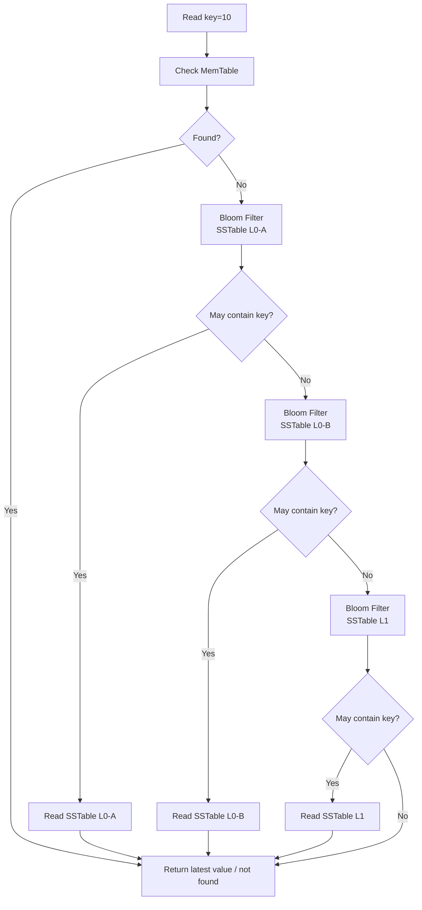

Need optimization.

That optimization is usually:

```text
Bloom filters
block cache
compaction
SSTable indexes
```

---

# 40. Bloom Filters

LSM systems often use:

```text
Bloom filters
```

to avoid checking SSTables that definitely do not contain key.

Bloom filter says:

```text
key definitely not here
or
key may be here
```

---

# 41. Bloom Filter Mental Model

```text
Before reading SSTable:
ask Bloom Filter
```

If answer:

```text
definitely not present
```

skip disk read.

This improves reads.

---

# 42. Compaction

Over time many SSTables accumulate.

Need merge cleanup:

```text
compaction
```

Compaction:

```text
merges sorted files
removes old versions
removes tombstones
reduces read amplification
```

---

# 43. Compaction Diagram

Before compaction:

```text
SSTable-A: 1=A1, 3=C1, 5=E1
SSTable-B: 1=A2, 4=D1, 6=F1
```

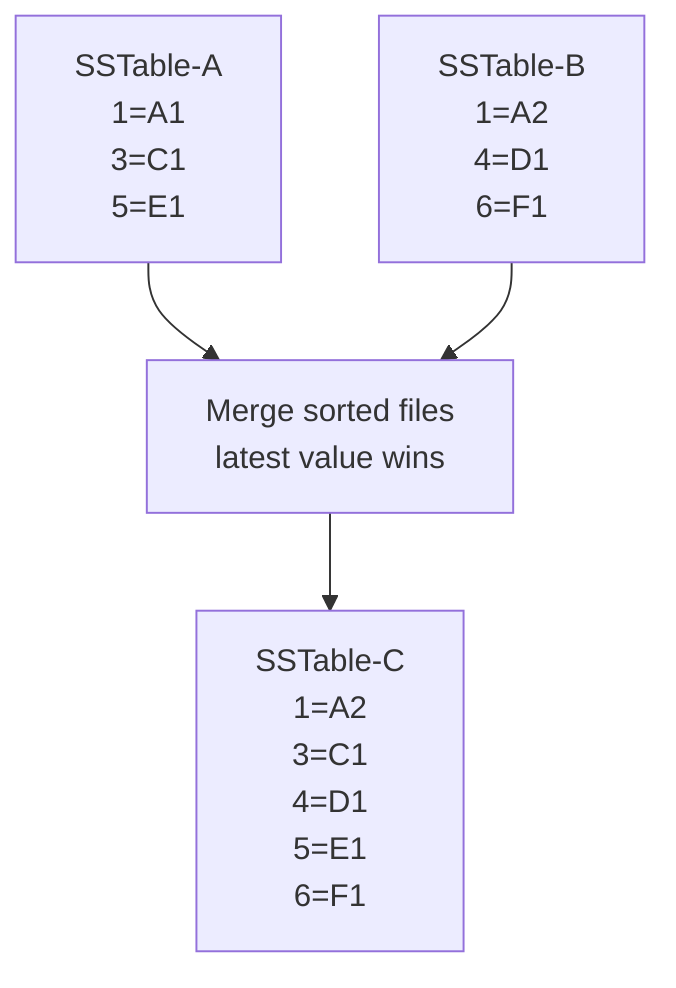

After compaction:

```text
SSTable-C: 1=A2, 3=C1, 4=D1, 5=E1, 6=F1
```

Latest value wins.

---

# 44. Tombstones In LSM

Delete in LSM does not remove immediately.

It writes:

```text
tombstone marker
```

Example:

```text
key=5 deleted
```

Compaction later removes old value and tombstone.

---

# 45. Tombstone Diagram

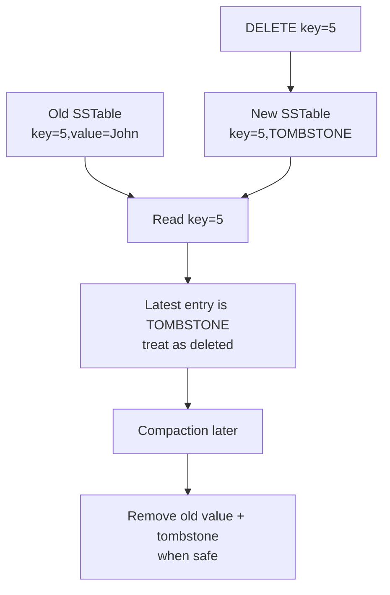

Tombstone mental model:

```text
delete now = write delete marker
physical cleanup = later compaction
```

---

# 46. LSM Strengths

```text
very fast writes
sequential disk IO
great ingestion throughput
good compression
immutable files
good for distributed databases
```

---

# 47. LSM Weaknesses

```text
read amplification
write amplification due to compaction
space amplification
tombstone buildup
compaction pressure
range queries can be more complex
```

---

# 48. LSM Amplifications

## Read Amplification

```text
read checks many files
```

## Write Amplification

```text
same data rewritten during compaction
```

## Space Amplification

```text
old versions/tombstones occupy disk
```

---

# 49. BTree vs LSM Big Table

| Feature | BTree / B+Tree | LSM Tree |
|---|---|---|
| Best For | Reads + ranges | Heavy writes |
| Writes | Random page updates | Sequential append-like |
| Reads | Very fast | Needs bloom/cache/compaction |
| Range Query | Excellent | Good but depends |
| Updates | In-place/new page changes | New version written |
| Deletes | mark/remove | tombstone |
| Background Work | Less | Compaction |
| Write Amplification | Page splits/WAL | Compaction |
| Read Amplification | Low | Higher |
| Used By | Postgres/MySQL | Cassandra/RocksDB |

---

# 50. Read Path Comparison

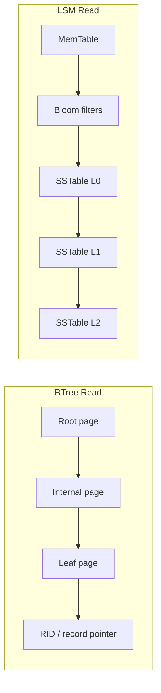

BTree:

```text
Root
 ↓
Internal Page
 ↓
Leaf Page
 ↓
Record pointer
```

Few page reads.

LSM:

```text
MemTable
 ↓
SSTable-1
 ↓
SSTable-2
 ↓
SSTable-3
```

May check multiple structures.

---

# 51. Write Path Comparison

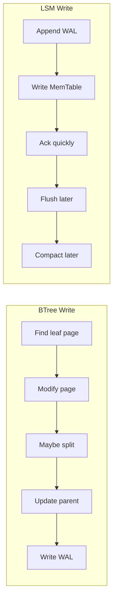

BTree:

```text
Find leaf page
    ↓
modify page
    ↓
maybe split
    ↓
write WAL
```

LSM:

```text
append WAL
    ↓
write MemTable
    ↓
flush later
    ↓
compact later
```

---

# 52. Why Postgres Uses BTree

Postgres is excellent for:

```text
OLTP
transactions
range queries
SQL queries
joins
strong consistency
```

BTree fits this workload.

---

# 53. Why Cassandra Uses LSM

Cassandra is designed for:

```text
massive writes
distributed ingestion
high availability
horizontal scaling
```

LSM fits this workload.

---

# 54. Why RocksDB Uses LSM

RocksDB is embedded storage engine optimized for:

```text
high write throughput
SSD-friendly writes
key-value workloads
```

LSM is ideal.

---

# 55. System Design Mapping

## Payment System

Use:

```text
Postgres / MySQL
```

Because:

```text
transactions
consistency
range queries
strong correctness
```

BTree-oriented systems fit well.

---

## Metrics System

Use:

```text
Cassandra / Scylla / ClickHouse / LSM-like ingestion
```

Because:

```text
huge write volume
time-series ingestion
distributed scale
```

---

# 56. Backend Example — User Lookup

Query:

```text
GET /users/123
```

BTree primary key index:

```text
fast lookup
```

Hash index also good for exact lookup.

---

# 57. Backend Example — Time-Series Writes

```text
millions of events per second
```

LSM write path:

```text
append WAL
write MemTable
flush SSTables
compact later
```

High throughput.

---

# 58. Why BTree Is Not Bad For Writes

BTree is not bad generally.

It is very good for normal OLTP.

But under extreme ingestion:

```text
random page updates
page splits
index maintenance
```

become costly.

---

# 59. Why LSM Is Not Bad For Reads

LSM can be good for reads with:

```text
Bloom filters
block cache
compaction
indexes inside SSTables
```

But read path is more complex than BTree.

---

# 60. Production Tuning Concepts

## BTree Tuning

```text
fill factor
index bloat
vacuum
page splits
buffer cache
```

## LSM Tuning

```text
compaction strategy
memtable size
SSTable size
Bloom filters
tombstone cleanup
```

---

# 61. Common Production Problems

## BTree Problems

```text
index bloat
page splits
random IO
slow updates with many indexes
```

## LSM Problems

```text
compaction storms
tombstone buildup
read amplification
disk space amplification
```

---

# 62. Interview Explanation

If interviewer asks:

```text
Difference between BTree and LSM Tree?
```

Strong answer:

```text
BTree stores sorted keys in page-based tree nodes and is excellent for
point lookups, range queries, and OLTP workloads. LSM Tree writes first
to memory and WAL, flushes immutable sorted files to disk, and merges
them later through compaction, making it excellent for high write throughput.
```

Senior addition:

```text
BTree usually has lower read amplification, while LSM trades read and
compaction complexity for much faster sequential write ingestion.
```

---

# 63. Common Mistakes

## Mistake 1

```text
Thinking LSM is always better
```

Wrong.

It depends on workload.

---

## Mistake 2

```text
Thinking BTree cannot handle writes
```

Wrong.

BTree handles OLTP writes well.

---

## Mistake 3

```text
Ignoring compaction cost
```

LSM compaction can be expensive.

---

## Mistake 4

```text
Ignoring range queries
```

BTree is excellent for ranges.

---

## Mistake 5

```text
Choosing database without workload understanding
```

Bad architecture.

---


---

# 63A. Mermaid Decision Tree — Which One To Choose?

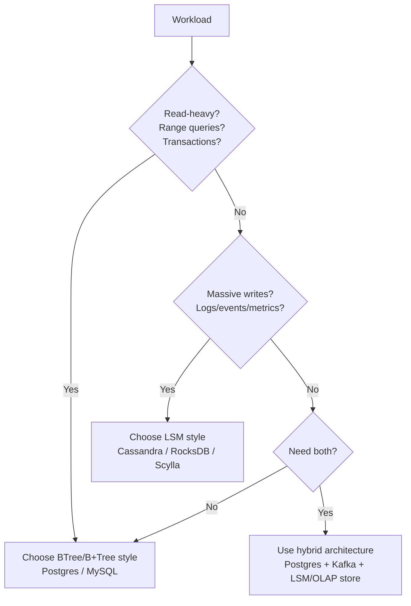

Decision mental model:

```text
transactions + ranges + correctness → BTree database
huge ingestion + distributed writes → LSM database
mixed high-scale platform → combine systems
```

# 64. Final Mental Model

```text
BTree
    =
sorted page-based tree
    =
fast reads + range queries

LSM Tree
    =
WAL + MemTable + SSTables + Compaction
    =
fast writes + distributed ingestion
```

---

# 65. What To Remember

```text
BTree is read/range optimized.

LSM Tree is write-optimized.

BTree updates pages.

LSM appends new data and compacts later.

SQL OLTP databases commonly use BTree.

Write-heavy NoSQL/storage engines commonly use LSM.
```

---

# 66. Next File

```text
009_Query_Execution_Pipeline.md
```

Next you learn:

```text
SQL parsing
query planning
optimizer basics
execution engine
index scan
table scan
how SELECT actually runs
```
