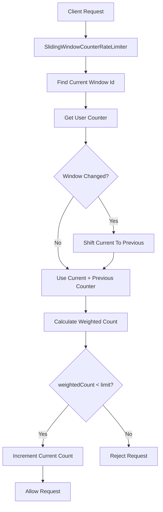
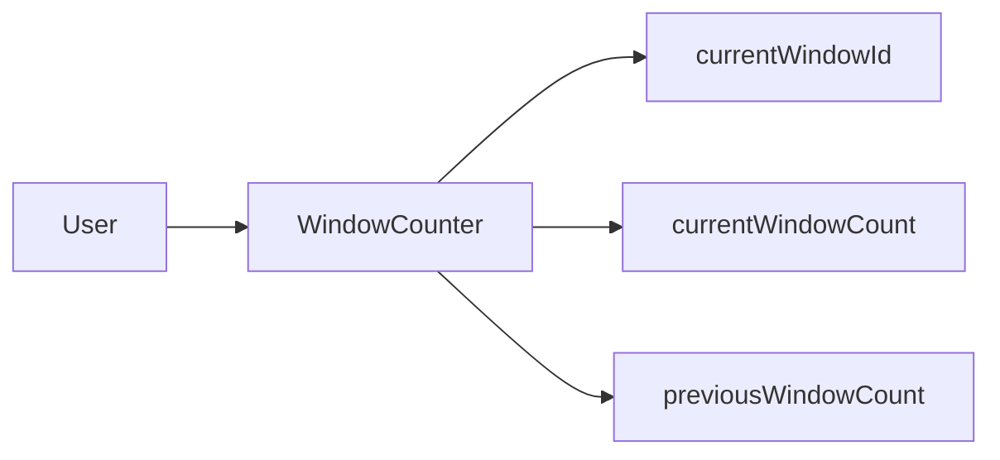

# 003_Sliding_Window_Counter

# MiniRateLimiter Step 3 — Sliding Window Counter

---

# Clickable Index

1. Goal  
2. Delta From Step 2  
3. Why Sliding Window Counter?  
4. Core Formula  
5. Example  
6. Architecture Mermaid Diagram  
7. Counter State Mermaid Diagram  
8. Detailed Steps Before Code  
9. CP/DSA Concepts Used  
10. Time Complexity  
11. Space Complexity  
12. Fixed Window vs Sliding Window Log vs Sliding Window Counter  
13. Folder Structure  
14. Complete Java Code  
15. CP/DSA Pattern Code  
16. Dry Run  
17. Run Command  
18. Expected Output Pattern  
19. Important Observation  
20. Current MiniRateLimiter State  
21. Step 3 Completion Checklist  
22. Final Mental Model  
23. Next Step  

---

## Goal

In Step 2, we built Sliding Window Log.

It is accurate, but it stores every request timestamp:

```text
userId -> queue of timestamps
```

Problem:

```text
High memory usage for high traffic users
```

In this step, we build:

```text
Sliding Window Counter
```

Instead of storing every timestamp, we store only:

```text
current window count
previous window count
```

Then we estimate the real sliding-window count using weighted overlap.

---

# Delta From Step 2

```text
Step 2:
userId -> Deque<timestamp>

Step 3:
userId -> WindowCounter
```

Step 2 stores every request timestamp.

Step 3 stores only two counters:

```text
currentWindowCount
previousWindowCount
```

---

# Why Sliding Window Counter?

Sliding Window Log is accurate but memory-heavy.

Example:

```text
1 million requests from one user
```

Sliding Window Log may store:

```text
1 million timestamps
```

Sliding Window Counter stores:

```text
2 counters per user
```

This is much cheaper.

---

# Core Formula

```text
estimatedCount =
currentWindowCount + previousWindowCount * overlapRatio
```

Where:

```text
overlapRatio = remaining time in current window / window size
```

---

# Example

Window size:

```text
60 seconds
```

Previous window count:

```text
80
```

Current window count:

```text
20
```

Current window elapsed:

```text
15 seconds
```

Remaining part of current window:

```text
45 seconds
```

Overlap ratio:

```text
45 / 60 = 0.75
```

Estimated count:

```text
20 + 80 * 0.75 = 80
```

---

# Architecture Mermaid Diagram



---

# Counter State Mermaid Diagram



---

# Detailed Steps Before Code

## Step 1 — Create WindowCounter

For each user, store:

```text
currentWindowId
currentWindowCount
previousWindowCount
```

## Step 2 — Calculate current window id

```java
windowId = currentTimeMillis / windowSizeMillis;
```

## Step 3 — Detect window movement

If request is in next window:

```text
previousWindowCount = currentWindowCount
currentWindowCount = 0
currentWindowId = newWindowId
```

If request jumped many windows:

```text
previousWindowCount = 0
currentWindowCount = 0
currentWindowId = newWindowId
```

## Step 4 — Calculate overlap ratio

```text
elapsedInCurrentWindow = currentTimeMillis % windowSizeMillis
remainingInCurrentWindow = windowSizeMillis - elapsedInCurrentWindow
overlapRatio = remainingInCurrentWindow / windowSizeMillis
```

## Step 5 — Calculate estimated count

```text
estimatedCount =
currentWindowCount + previousWindowCount * overlapRatio
```

## Step 6 — Allow or reject

If:

```text
estimatedCount < limit
```

allow and increment current count.

Else reject.

---

# CP/DSA Concepts Used

## 1. Bucketization

```java
long windowId = currentTimeMillis / windowSizeMillis;
```

Same as grouping values into buckets.

## 2. Rolling State

We maintain only:

```text
previous
current
```

This is like DP space optimization:

```text
dp[i - 1]
dp[i]
```

## 3. Weighted Contribution

Previous window contributes partially:

```text
previousCount * overlapRatio
```

## 4. HashMap State Store

```java
Map<String, WindowCounter> counters;
```

This maps:

```text
userId -> rolling counter state
```

## 5. O(1) Per Request

No queue cleanup. No timestamp list. Only constant-time math.

---

# Time Complexity

```text
O(1) per request
```

# Space Complexity

```text
O(number of active users)
```

---

# Fixed Window vs Sliding Window Log vs Sliding Window Counter

| Algorithm | Accuracy | Memory | Complexity |
|---|---:|---:|---:|
| Fixed Window Counter | Low | Low | Easy |
| Sliding Window Log | Exact | High | Medium |
| Sliding Window Counter | Approximate | Low | Medium |

---

# Folder Structure

```text
MiniRateLimiter/
└── src/main/java/com/miniratelimiter/step3/
    ├── RateLimitResult.java
    ├── WindowCounter.java
    ├── SlidingWindowCounterRateLimiter.java
    └── Step3Driver.java
```

---

# Complete Java Code

---

# RateLimitResult.java

```java
package com.miniratelimiter.step3;

public class RateLimitResult {

    // True if request is allowed.
    private final boolean allowed;

    // Maximum allowed requests.
    private final int limit;

    // Estimated active request count.
    private final double currentCount;

    // Remaining allowed requests.
    private final int remaining;

    public RateLimitResult(boolean allowed, int limit, double currentCount, int remaining) {
        this.allowed = allowed;
        this.limit = limit;
        this.currentCount = currentCount;
        this.remaining = remaining;
    }

    public boolean isAllowed() {
        return allowed;
    }

    public int getLimit() {
        return limit;
    }

    public double getCurrentCount() {
        return currentCount;
    }

    public int getRemaining() {
        return remaining;
    }

    @Override
    public String toString() {
        return "RateLimitResult{" +
                "allowed=" + allowed +
                ", limit=" + limit +
                ", currentCount=" + currentCount +
                ", remaining=" + remaining +
                '}';
    }
}
```

---

# WindowCounter.java

```java
package com.miniratelimiter.step3;

/*
 * Logic:
 *
 * 1. Store current window request count.
 * 2. Store previous window request count.
 * 3. Shift counters when window changes.
 * 4. Support rolling sliding-window calculation.
 *
 * Time Complexity:
 * O(1)
 *
 * Space Complexity:
 * O(1)
 */
public class WindowCounter {

    // Current fixed window id.
    private long currentWindowId;

    // Request count in current window.
    private int currentWindowCount;

    // Request count in previous window.
    private int previousWindowCount;

    public WindowCounter(long currentWindowId) {
        this.currentWindowId = currentWindowId;
        this.currentWindowCount = 0;
        this.previousWindowCount = 0;
    }

    public long getCurrentWindowId() {
        return currentWindowId;
    }

    public int getCurrentWindowCount() {
        return currentWindowCount;
    }

    public int getPreviousWindowCount() {
        return previousWindowCount;
    }

    public void incrementCurrentWindowCount() {
        currentWindowCount++;
    }

    public void moveToWindow(long newWindowId) {
        long windowDiff = newWindowId - currentWindowId;

        if (windowDiff == 1) {
            previousWindowCount = currentWindowCount;
        } else {
            previousWindowCount = 0;
        }

        currentWindowCount = 0;
        currentWindowId = newWindowId;
    }

    @Override
    public String toString() {
        return "WindowCounter{" +
                "currentWindowId=" + currentWindowId +
                ", currentWindowCount=" + currentWindowCount +
                ", previousWindowCount=" + previousWindowCount +
                '}';
    }
}
```

---

# SlidingWindowCounterRateLimiter.java

```java
package com.miniratelimiter.step3;

import java.util.HashMap;
import java.util.Map;

/*
 * Logic:
 *
 * 1. Calculate current window id.
 * 2. Get user counter state from HashMap.
 * 3. Detect window movement.
 * 4. Shift current count -> previous count.
 * 5. Calculate overlap ratio.
 * 6. Estimate active request count.
 * 7. Reject if estimated count exceeds limit.
 * 8. Otherwise increment current counter.
 *
 * Core Formula:
 *
 * estimatedCount =
 * currentCount + previousCount * overlapRatio
 *
 * Time Complexity:
 * O(1)
 *
 * Space Complexity:
 * O(active users)
 */
public class SlidingWindowCounterRateLimiter {

    // Maximum allowed requests in sliding window.
    private final int limit;

    // Window size in milliseconds.
    private final long windowSizeMillis;

    // userId -> rolling counter state
    private final Map<String, WindowCounter> counters;

    public SlidingWindowCounterRateLimiter(int limit, long windowSizeMillis) {
        if (limit <= 0) {
            throw new IllegalArgumentException("Limit value should be positive");
        }

        if (windowSizeMillis <= 0) {
            throw new IllegalArgumentException("Window size should be positive");
        }

        this.limit = limit;
        this.windowSizeMillis = windowSizeMillis;
        this.counters = new HashMap<>();
    }

    public RateLimitResult allowRequest(String userId, long currentTimeMillis) {
        long currentWindowId = getWindowId(currentTimeMillis);

        WindowCounter counter =
                counters.computeIfAbsent(userId, key -> new WindowCounter(currentWindowId));

        if (counter.getCurrentWindowId() != currentWindowId) {
            counter.moveToWindow(currentWindowId);
        }

        double estimatedCount = calculateEstimatedCount(counter, currentTimeMillis);

        if (estimatedCount >= limit) {
            return new RateLimitResult(false, limit, estimatedCount, 0);
        }

        counter.incrementCurrentWindowCount();

        double newEstimatedCount = calculateEstimatedCount(counter, currentTimeMillis);

        int remaining = Math.max(0, limit - (int) Math.ceil(newEstimatedCount));

        return new RateLimitResult(true, limit, newEstimatedCount, remaining);
    }

    private long getWindowId(long currentTimeMillis) {
        return currentTimeMillis / windowSizeMillis;
    }

    private double calculateEstimatedCount(WindowCounter counter, long currentTimeMillis) {
        long elapsedInCurrentWindow = currentTimeMillis % windowSizeMillis;

        long remainingInCurrentWindow = windowSizeMillis - elapsedInCurrentWindow;

        double overlapRatio = (double) remainingInCurrentWindow / windowSizeMillis;

        return counter.getCurrentWindowCount() +
                counter.getPreviousWindowCount() * overlapRatio;
    }

    public Map<String, WindowCounter> getCountersSnapshot() {
        return new HashMap<>(counters);
    }
}
```

---

# Step3Driver.java

```java
package com.miniratelimiter.step3;

public class Step3Driver {

    public static void main(String[] args) {
        int limit = 5;
        long windowSizeMillis = 60_000;

        SlidingWindowCounterRateLimiter rateLimiter =
                new SlidingWindowCounterRateLimiter(limit, windowSizeMillis);

        String userId = "user-1";

        System.out.println("---- REQUESTS IN FIRST WINDOW ----");

        long[] firstWindowRequests = {
                1_000,
                5_000,
                10_000,
                20_000,
                30_000
        };

        for (int i = 0; i < firstWindowRequests.length; i++) {
            long timestamp = firstWindowRequests[i];

            RateLimitResult result = rateLimiter.allowRequest(userId, timestamp);

            System.out.println("request=" + (i + 1) + ", time=" + timestamp + ", result=" + result);
        }

        System.out.println();
        System.out.println("---- REQUEST IN NEXT WINDOW WITH PREVIOUS WINDOW WEIGHT ----");

        long nextWindowTime = 70_000;

        RateLimitResult nextResult = rateLimiter.allowRequest(userId, nextWindowTime);

        System.out.println("time=" + nextWindowTime + ", result=" + nextResult);

        System.out.println();
        System.out.println("---- COUNTER SNAPSHOT ----");
        System.out.println(rateLimiter.getCountersSnapshot());
    }
}
```

---

# CP/DSA Pattern Code

```java
public class SlidingWindowCounterCP {

    public static void main(String[] args) {
        int previousCount = 80;
        int currentCount = 20;

        long windowSize = 60;
        long elapsedInCurrentWindow = 15;

        long remainingInCurrentWindow = windowSize - elapsedInCurrentWindow;

        double overlapRatio = (double) remainingInCurrentWindow / windowSize;

        double estimatedCount = currentCount + previousCount * overlapRatio;

        System.out.println("overlapRatio=" + overlapRatio);
        System.out.println("estimatedCount=" + estimatedCount);
    }
}
```

---

# Dry Run

Policy:

```text
limit = 5
window = 60 seconds
```

First window:

```text
1s, 5s, 10s, 20s, 30s
```

Current count becomes:

```text
5
```

At time:

```text
70s
```

Previous count:

```text
5
```

Elapsed in current window:

```text
10s
```

Remaining:

```text
50s
```

Overlap ratio:

```text
50 / 60 = 0.833
```

Estimated count:

```text
0 + 5 * 0.833 = 4.166
```

---

# Run Command

```bash
javac -d out src/main/java/com/miniratelimiter/step3/*.java

java -cp out com.miniratelimiter.step3.Step3Driver
```

---

# Expected Output Pattern

```text
---- REQUESTS IN FIRST WINDOW ----
request=1, time=1000, result=RateLimitResult{allowed=true, limit=5, currentCount=1.0, remaining=4}
...
request=5, time=30000, result=RateLimitResult{allowed=true, limit=5, currentCount=5.0, remaining=0}

---- REQUEST IN NEXT WINDOW WITH PREVIOUS WINDOW WEIGHT ----
time=70000, result=RateLimitResult{allowed=false or true depending estimate}
```

---

# Important Observation

Sliding Window Counter is approximate.

It does not know exact timestamps.

It estimates how much of the previous window still overlaps with the current sliding window.

Tradeoff:

```text
less memory
slightly less accuracy
```

---

# Current MiniRateLimiter State

```text
Supported:
[yes] fixed window counter
[yes] sliding window log
[yes] sliding window counter
[yes] approximate rolling count
[yes] O(1) memory per user

Not yet:
[no] token bucket
[no] leaky bucket
[no] concurrency safety
[no] distributed Redis store
[no] Spring Boot integration
```

---

# Step 3 Completion Checklist

```text
[ ] You understand current window counter
[ ] You understand previous window counter
[ ] You understand overlap ratio
[ ] You understand weighted count
[ ] You understand memory improvement over sliding log
[ ] You understand approximation tradeoff
```

---

# Final Mental Model

```text
Sliding Window Counter =
current bucket + weighted previous bucket
```

```text
estimatedCount =
currentCount + previousCount * overlapRatio
```

---

# Next Step

Next we build:

```text
004_Token_Bucket
```

Token Bucket supports controlled burst traffic.
