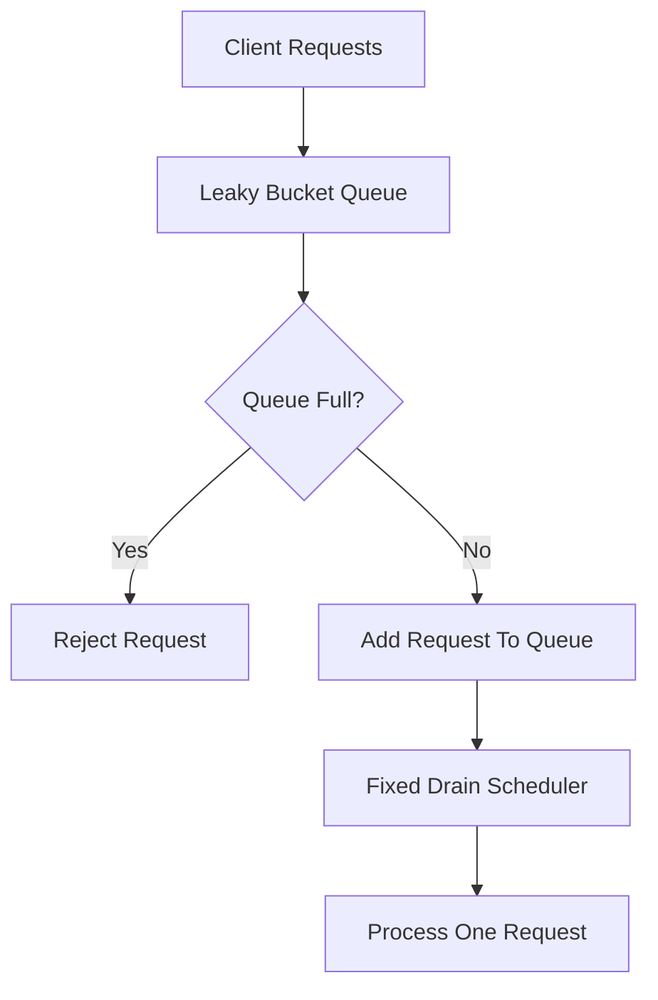
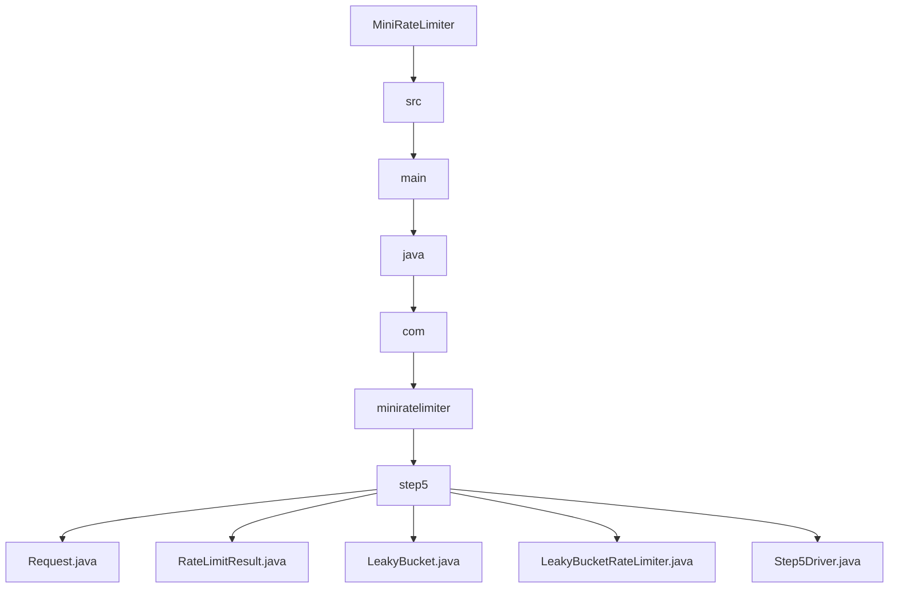

# 005_Leaky_Bucket

# MiniRateLimiter Step 5 — Leaky Bucket

---

# Clickable Index

1. Goal  
2. Delta From Step 4  
3. Why Leaky Bucket?  
4. Core Idea  
5. Architecture Mermaid Diagram  
6. Queue Flow Visualization  
7. Detailed Steps Before Code  
8. CP/DSA Concepts Used  
9. Time Complexity  
10. Space Complexity  
11. Token Bucket vs Leaky Bucket  
12. Folder Structure  
13. Folder Mermaid Diagram  
14. Complete Java Code  
15. CP/DSA Pattern Code  
16. Dry Run  
17. Run Command  
18. Expected Output Pattern  
19. Important Observation  
20. Current MiniRateLimiter State  
21. Step 5 Completion Checklist  
22. Final Mental Model  
23. Next Step  

---

# Goal

In Step 4, we built:

```text
Token Bucket
```

Token Bucket allows burst traffic.

Now we build:

```text
Leaky Bucket
```

Leaky Bucket smooths traffic into a fixed output rate.

Example:

```text
incoming:
100 requests instantly

outgoing:
1 request every 100ms
```

This prevents sudden spikes from overwhelming downstream systems.

---

# Delta From Step 4

```text
Step 4:
Token-based burst control.

Step 5:
Queue-based traffic smoothing.
```

Token Bucket:

```text
allow if token exists
```

Leaky Bucket:

```text
enqueue requests
drain requests at fixed speed
```

---

# Why Leaky Bucket?

Leaky Bucket is useful when downstream systems require stable throughput.

Examples:

```text
database writes
message queues
email sending
payment gateways
log ingestion
```

Instead of sudden bursts:

```text
1000 requests instantly
```

we smooth output:

```text
50 requests/sec continuously
```

---

# Core Idea

Think of a bucket with a hole.

Water enters quickly:

```text
incoming requests
```

Water leaves slowly:

```text
fixed drain rate
```

If bucket becomes full:

```text
reject new requests
```

---

# Architecture Mermaid Diagram



---

# Queue Flow Visualization

```text
Incoming:
R1 R2 R3 R4 R5 R6

Queue:
[R1 R2 R3 R4 R5]

Drain Rate:
1 request / second

Output:
R1 -> 1 sec
R2 -> 2 sec
R3 -> 3 sec
```

---

# Detailed Steps Before Code

## Step 1 — Create bucket queue

Store requests in queue:

```java
Queue<Request>
```

---

## Step 2 — Define capacity

Maximum queue size:

```text
capacity = max waiting requests
```

If queue full:

```text
reject request
```

---

## Step 3 — Define drain rate

Example:

```text
2 requests/sec
```

Meaning:

```text
1 request every 500ms
```

---

## Step 4 — Drain periodically

Scheduler continuously processes queue.

Example:

```java
ScheduledExecutorService
```

---

## Step 5 — Process requests

Drain logic:

```text
poll one request
execute request
```

---

# CP/DSA Concepts Used

## 1. Queue / FIFO

Leaky bucket is classic FIFO queue.

```java
Queue<Request>
```

First request processed first.

---

## 2. Producer Consumer Pattern

Incoming requests:

```text
producer
```

Drain worker:

```text
consumer
```

This is very common in distributed systems.

---

## 3. Backpressure

Queue full means:

```text
system overloaded
```

Rejecting requests protects downstream systems.

---

## 4. Fixed Rate Scheduling

Drain happens at fixed intervals.

This introduces rate smoothing.

---

## 5. Bounded Queue

Queue has maximum capacity.

Common DSA pattern:

```text
bounded buffer
```

---

# Time Complexity

Enqueue:

```text
O(1)
```

Dequeue:

```text
O(1)
```

---

# Space Complexity

```text
O(capacity)
```

---

# Token Bucket vs Leaky Bucket

| Feature | Token Bucket | Leaky Bucket |
|---|---:|---:|
| Burst Support | Strong | Weak |
| Output Smoothing | Medium | Excellent |
| Queue Required | No | Yes |
| Traffic Shape | Bursty | Constant |
| Common Use | APIs | Stable pipelines |

---

# Folder Structure

```text
MiniRateLimiter/
└── src/main/java/com/miniratelimiter/step5/
    ├── Request.java
    ├── RateLimitResult.java
    ├── LeakyBucket.java
    ├── LeakyBucketRateLimiter.java
    └── Step5Driver.java
```

---

# Folder Mermaid Diagram



---

# Complete Java Code

---

# Request.java

```java
package com.miniratelimiter.step5;

public class Request {

    // Request id.
    private final String requestId;

    // Request arrival time.
    private final long timestampMillis;

    public Request(String requestId, long timestampMillis) {
        this.requestId = requestId;
        this.timestampMillis = timestampMillis;
    }

    public String getRequestId() {
        return requestId;
    }

    public long getTimestampMillis() {
        return timestampMillis;
    }

    @Override
    public String toString() {
        return "Request{" +
                "requestId='" + requestId + '\'' +
                ", timestampMillis=" + timestampMillis +
                '}';
    }
}
```

---

# RateLimitResult.java

```java
package com.miniratelimiter.step5;

public class RateLimitResult {

    // True if request accepted into queue.
    private final boolean allowed;

    // Current queue size.
    private final int queueSize;

    // Maximum queue capacity.
    private final int capacity;

    public RateLimitResult(boolean allowed, int queueSize, int capacity) {
        this.allowed = allowed;
        this.queueSize = queueSize;
        this.capacity = capacity;
    }

    public boolean isAllowed() {
        return allowed;
    }

    public int getQueueSize() {
        return queueSize;
    }

    public int getCapacity() {
        return capacity;
    }

    @Override
    public String toString() {
        return "RateLimitResult{" +
                "allowed=" + allowed +
                ", queueSize=" + queueSize +
                ", capacity=" + capacity +
                '}';
    }
}
```

---

# LeakyBucket.java

```java
package com.miniratelimiter.step5;

import java.util.LinkedList;
import java.util.Queue;

public class LeakyBucket {

    // Maximum queue size.
    private final int capacity;

    // FIFO request queue.
    private final Queue<Request> queue;

    public LeakyBucket(int capacity) {
        this.capacity = capacity;
        this.queue = new LinkedList<>();
    }

    public boolean tryAdd(Request request) {
        if (queue.size() >= capacity) {
            return false;
        }

        queue.offer(request);

        return true;
    }

    public Request drainOneRequest() {
        return queue.poll();
    }

    public int size() {
        return queue.size();
    }

    public int getCapacity() {
        return capacity;
    }

    public Queue<Request> snapshot() {
        return new LinkedList<>(queue);
    }
}
```

---

# LeakyBucketRateLimiter.java

```java
package com.miniratelimiter.step5;

import java.util.concurrent.Executors;
import java.util.concurrent.ScheduledExecutorService;
import java.util.concurrent.TimeUnit;

public class LeakyBucketRateLimiter {

    // Core leaky bucket queue.
    private final LeakyBucket bucket;

    // Fixed drain scheduler.
    private final ScheduledExecutorService scheduler;

    // Drain interval in milliseconds.
    private final long drainIntervalMillis;

    public LeakyBucketRateLimiter(int capacity, long drainIntervalMillis) {
        if (capacity <= 0) {
            throw new IllegalArgumentException("Capacity should be positive");
        }

        if (drainIntervalMillis <= 0) {
            throw new IllegalArgumentException("Drain interval should be positive");
        }

        this.bucket = new LeakyBucket(capacity);
        this.scheduler = Executors.newSingleThreadScheduledExecutor();
        this.drainIntervalMillis = drainIntervalMillis;

        startDrainWorker();
    }

    public RateLimitResult allowRequest(Request request) {
        boolean added = bucket.tryAdd(request);

        return new RateLimitResult(
                added,
                bucket.size(),
                bucket.getCapacity()
        );
    }

    private void startDrainWorker() {
        scheduler.scheduleAtFixedRate(
                this::drainOneRequest,
                0,
                drainIntervalMillis,
                TimeUnit.MILLISECONDS
        );
    }

    private void drainOneRequest() {
        Request request = bucket.drainOneRequest();

        if (request == null) {
            return;
        }

        System.out.println(
                "[DRAINED] requestId=" +
                request.getRequestId() +
                ", queueSize=" +
                bucket.size()
        );
    }

    public void shutdown() {
        scheduler.shutdown();
    }

    public LeakyBucket getBucket() {
        return bucket;
    }
}
```

---

# Step5Driver.java

```java
package com.miniratelimiter.step5;

public class Step5Driver {

    public static void main(String[] args) throws Exception {

        int capacity = 5;

        // Drain 1 request every second.
        long drainIntervalMillis = 1_000;

        LeakyBucketRateLimiter rateLimiter =
                new LeakyBucketRateLimiter(capacity, drainIntervalMillis);

        System.out.println("---- BURST REQUESTS ----");

        // Simulate sudden burst traffic.
        for (int i = 1; i <= 8; i++) {

            Request request =
                    new Request(
                            "req-" + i,
                            System.currentTimeMillis()
                    );

            RateLimitResult result =
                    rateLimiter.allowRequest(request);

            System.out.println(
                    "request=" + request.getRequestId() +
                    ", result=" + result
            );
        }

        System.out.println();
        System.out.println("---- WAITING FOR DRAIN ----");

        // Wait to observe queue draining.
        Thread.sleep(7_000);

        System.out.println();
        System.out.println("---- FINAL QUEUE STATE ----");

        System.out.println(rateLimiter.getBucket().snapshot());

        rateLimiter.shutdown();
    }
}
```

---

# CP/DSA Pattern Code

## Problem

Simulate bounded queue with fixed drain speed.

---

## DSA/CP Java Code

```java
import java.util.LinkedList;
import java.util.Queue;

public class LeakyBucketCP {

    public static void main(String[] args) {

        int capacity = 5;

        Queue<Integer> queue = new LinkedList<>();

        for (int request = 1; request <= 8; request++) {

            if (queue.size() >= capacity) {

                System.out.println(
                        "request=" + request +
                        " rejected"
                );

                continue;
            }

            queue.offer(request);

            System.out.println(
                    "request=" + request +
                    " added, queue=" + queue
            );
        }

        System.out.println();

        System.out.println("Draining queue");

        while (!queue.isEmpty()) {

            int processed = queue.poll();

            System.out.println(
                    "processed=" + processed +
                    ", remaining=" + queue
            );
        }
    }
}
```

---

# Dry Run

Configuration:

```text
capacity = 5
drain = 1 request/sec
```

Requests:

```text
req-1
req-2
req-3
req-4
req-5
req-6
req-7
```

Queue becomes:

```text
[req-1 req-2 req-3 req-4 req-5]
```

Requests:

```text
req-6
req-7
```

Rejected because queue full.

Drain worker processes:

```text
req-1
req-2
req-3
```

at fixed intervals.

---

# Run Command

```bash
javac -d out src/main/java/com/miniratelimiter/step5/*.java

java -cp out com.miniratelimiter.step5.Step5Driver
```

---

# Expected Output Pattern

```text
---- BURST REQUESTS ----
request=req-1, result=allowed=true
...
request=req-6, result=allowed=false

[DRAINED] requestId=req-1
[DRAINED] requestId=req-2
```

---

# Important Observation

Leaky Bucket smooths output traffic.

This protects systems like:

```text
databases
message brokers
payment processors
```

from sudden spikes.

---

# Current MiniRateLimiter State

```text
Supported:
[yes] fixed window counter
[yes] sliding window log
[yes] sliding window counter
[yes] token bucket
[yes] leaky bucket
[yes] queue smoothing
[yes] scheduled draining

Not yet:
[no] thread safety
[no] distributed Redis store
[no] Spring Boot integration
```

---

# Step 5 Completion Checklist

```text
[ ] You understand queue smoothing
[ ] You understand producer-consumer
[ ] You understand bounded queue
[ ] You understand drain scheduling
[ ] You understand FIFO processing
[ ] You understand backpressure
```

---

# Final Mental Model

```text
Leaky Bucket =
bounded queue + fixed drain speed
```

```text
incoming traffic becomes smooth output traffic
```

---

# Next Step

Next we build:

```text
006_Thread_Safe_RateLimiter
```

We will make all algorithms safe for concurrent multi-threaded access.
