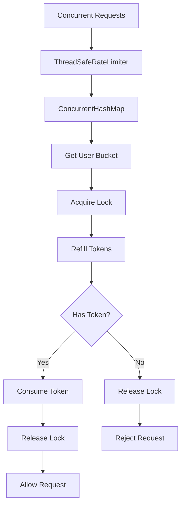
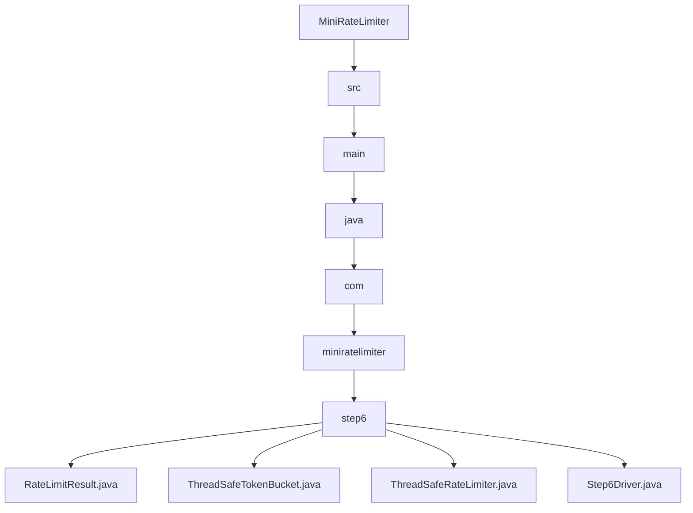

# 006_Thread_Safe_RateLimiter

# MiniRateLimiter Step 6 — Thread Safe Rate Limiter

---

# Clickable Index

1. [Goal](#goal)  
2. [Why Thread Safety?](#why-thread-safety)  
3. [Problem Without Thread Safety](#problem-without-thread-safety)  
4. [Race Condition Example](#race-condition-example)  
5. [Core Idea](#core-idea)  
6. [Architecture Mermaid Diagram](#architecture-mermaid-diagram)  
7. [Detailed Steps Before Code](#detailed-steps-before-code)  
8. [CP/DSA Concepts Used](#cpdsa-concepts-used)  
9. [Time Complexity](#time-complexity)  
10. [Space Complexity](#space-complexity)  
11. [ConcurrentHashMap vs HashMap](#concurrenthashmap-vs-hashmap)  
12. [synchronized vs Lock](#synchronized-vs-lock)  
13. [Folder Structure](#folder-structure)  
14. [Folder Mermaid Diagram](#folder-mermaid-diagram)  
15. [Complete Java Code](#complete-java-code)  
16. [CP/DSA Pattern Code](#cpdsa-pattern-code)  
17. [Dry Run](#dry-run)  
18. [Run Command](#run-command)  
19. [Expected Output Pattern](#expected-output-pattern)  
20. [Important Observation](#important-observation)  
21. [Current MiniRateLimiter State](#current-miniratelimiter-state)  
22. [Step 6 Completion Checklist](#step-6-completion-checklist)  
23. [Final Mental Model](#final-mental-model)  
24. [Next Step](#next-step)  

---

# Goal

Until now our rate limiters were:

```text
single-threaded
```

But real systems are multi-threaded.

Example:

```text
1000 requests arriving simultaneously
```

Without synchronization:

```text
multiple threads modify same state incorrectly
```

This causes:

```text
incorrect request counts
negative tokens
lost updates
race conditions
```

Now we make our rate limiter:

```text
thread-safe
```

---

# Why Thread Safety?

Real APIs run on:

```text
Tomcat worker threads
Netty event loops
thread pools
multiple CPU cores
```

Many threads can call:

```java
allowRequest()
```

at same time.

Without thread safety:

```text
2 requests may consume same token
```

---

# Problem Without Thread Safety

Suppose:

```text
availableTokens = 1
```

Two threads arrive simultaneously.

Both execute:

```java
if (availableTokens >= 1)
```

Both see:

```text
1 token exists
```

Both consume token.

Final state:

```text
availableTokens = -1
```

This is race condition.

---

# Race Condition Example

```text
Thread A reads tokens = 1
Thread B reads tokens = 1

Thread A consumes token
tokens = 0

Thread B consumes token
tokens = -1
```

Incorrect state.

---

# Core Idea

We protect shared mutable state.

Shared state:

```text
availableTokens
lastRefillTime
HashMap state
```

We use:

```text
ConcurrentHashMap
ReentrantLock
```

to ensure safe concurrent updates.

---

# Architecture Mermaid Diagram



---

# Detailed Steps Before Code

## Step 1 — Replace HashMap

Instead of:

```java
HashMap
```

use:

```java
ConcurrentHashMap
```

This supports concurrent reads/writes safely.

---

## Step 2 — Add lock per bucket

Each bucket has:

```java
ReentrantLock
```

Only one thread can modify bucket at a time.

---

## Step 3 — Lock critical section

Critical section:

```text
refill
check token
consume token
```

Must happen atomically.

---

## Step 4 — Release lock safely

Always use:

```java
try-finally
```

to release lock.

---

# CP/DSA Concepts Used

## 1. Critical Section

Shared mutable state requires synchronization.

---

## 2. Mutual Exclusion

Only one thread modifies bucket at a time.

---

## 3. Concurrent Data Structures

```java
ConcurrentHashMap
```

supports safe concurrent access.

---

## 4. Lock Granularity

We use:

```text
per-user bucket lock
```

instead of global lock.

This improves scalability.

---

## 5. Atomic State Transition

These operations must behave like single unit:

```text
refill
check
consume
```

---

# Time Complexity

```text
O(1) per request
```

---

# Space Complexity

```text
O(active users)
```

---

# ConcurrentHashMap vs HashMap

| Feature | HashMap | ConcurrentHashMap |
|---|---:|---:|
| Thread Safe | No | Yes |
| Concurrent Reads | Unsafe | Safe |
| Concurrent Writes | Unsafe | Safe |
| Real Backend Usage | No | Very common |

---

# synchronized vs Lock

| Feature | synchronized | ReentrantLock |
|---|---:|---:|
| Manual unlock | No | Yes |
| tryLock support | No | Yes |
| Advanced control | Limited | Strong |
| Production systems | Medium | Common |

---

# Folder Structure

```text
MiniRateLimiter/
└── src/main/java/com/miniratelimiter/step6/
    ├── RateLimitResult.java
    ├── ThreadSafeTokenBucket.java
    ├── ThreadSafeRateLimiter.java
    └── Step6Driver.java
```

---

# Folder Mermaid Diagram



---

# Complete Java Code

---

# RateLimitResult.java

```java
package com.miniratelimiter.step6;

/*
 * Logic:
 *
 * 1. Store request decision.
 * 2. Store available tokens.
 * 3. Store retry-after information.
 *
 * Time Complexity:
 * O(1)
 */
public class RateLimitResult {

    private final boolean allowed;

    private final double availableTokens;

    private final long retryAfterMillis;

    public RateLimitResult(boolean allowed, double availableTokens, long retryAfterMillis) {
        this.allowed = allowed;
        this.availableTokens = availableTokens;
        this.retryAfterMillis = retryAfterMillis;
    }

    public boolean isAllowed() {
        return allowed;
    }

    public double getAvailableTokens() {
        return availableTokens;
    }

    public long getRetryAfterMillis() {
        return retryAfterMillis;
    }

    @Override
    public String toString() {
        return "RateLimitResult{" +
                "allowed=" + allowed +
                ", availableTokens=" + availableTokens +
                ", retryAfterMillis=" + retryAfterMillis +
                '}';
    }
}
```

---

# ThreadSafeTokenBucket.java

```java
package com.miniratelimiter.step6;

import java.util.concurrent.locks.ReentrantLock;

/*
 * Logic:
 *
 * 1. Store bucket state.
 * 2. Protect bucket using ReentrantLock.
 * 3. Refill tokens safely.
 * 4. Consume tokens safely.
 *
 * Time Complexity:
 * O(1)
 *
 * Space Complexity:
 * O(1)
 */
public class ThreadSafeTokenBucket {

    // Maximum bucket capacity.
    private final int capacity;

    // Tokens generated per millisecond.
    private final double refillRatePerMillis;

    // Current available tokens.
    private double availableTokens;

    // Last refill timestamp.
    private long lastRefillTimeMillis;

    // Per-bucket lock.
    private final ReentrantLock lock;

    public ThreadSafeTokenBucket(
            int capacity,
            double refillRatePerMillis,
            long createdAtMillis
    ) {

        this.capacity = capacity;
        this.refillRatePerMillis = refillRatePerMillis;
        this.availableTokens = capacity;
        this.lastRefillTimeMillis = createdAtMillis;
        this.lock = new ReentrantLock();
    }

    public RateLimitResult allowRequest(long currentTimeMillis) {

        lock.lock();

        try {

            refill(currentTimeMillis);

            if (availableTokens < 1.0) {

                double missingTokens =
                        1.0 - availableTokens;

                long retryAfterMillis =
                        (long) Math.ceil(
                                missingTokens /
                                refillRatePerMillis
                        );

                return new RateLimitResult(
                        false,
                        availableTokens,
                        retryAfterMillis
                );
            }

            availableTokens = availableTokens - 1.0;

            return new RateLimitResult(
                    true,
                    availableTokens,
                    0
            );

        } finally {

            lock.unlock();
        }
    }

    private void refill(long currentTimeMillis) {

        long elapsedMillis =
                currentTimeMillis - lastRefillTimeMillis;

        if (elapsedMillis <= 0) {
            return;
        }

        double tokensToAdd =
                elapsedMillis * refillRatePerMillis;

        availableTokens =
                Math.min(
                        capacity,
                        availableTokens + tokensToAdd
                );

        lastRefillTimeMillis = currentTimeMillis;
    }
}
```

---

# ThreadSafeRateLimiter.java

```java
package com.miniratelimiter.step6;

import java.util.Map;
import java.util.concurrent.ConcurrentHashMap;

/*
 * Logic:
 *
 * 1. Store user buckets in ConcurrentHashMap.
 * 2. Create bucket lazily.
 * 3. Delegate request to bucket.
 * 4. Bucket handles synchronization internally.
 *
 * Time Complexity:
 * O(1)
 *
 * Space Complexity:
 * O(active users)
 */
public class ThreadSafeRateLimiter {

    // Maximum burst capacity.
    private final int capacity;

    // Refill tokens per millisecond.
    private final double refillRatePerMillis;

    // Thread-safe user bucket store.
    private final Map<String, ThreadSafeTokenBucket> buckets;

    public ThreadSafeRateLimiter(int capacity, double refillTokensPerSecond) {

        if (capacity <= 0) {
            throw new IllegalArgumentException("Capacity should be positive");
        }

        if (refillTokensPerSecond <= 0) {
            throw new IllegalArgumentException("Refill rate should be positive");
        }

        this.capacity = capacity;

        this.refillRatePerMillis =
                refillTokensPerSecond / 1000.0;

        this.buckets = new ConcurrentHashMap<>();
    }

    public RateLimitResult allowRequest(
            String userId,
            long currentTimeMillis
    ) {

        ThreadSafeTokenBucket bucket =
                buckets.computeIfAbsent(
                        userId,
                        key -> new ThreadSafeTokenBucket(
                                capacity,
                                refillRatePerMillis,
                                currentTimeMillis
                        )
                );

        return bucket.allowRequest(currentTimeMillis);
    }
}
```

---

# Step6Driver.java

```java
package com.miniratelimiter.step6;

import java.util.concurrent.ExecutorService;
import java.util.concurrent.Executors;
import java.util.concurrent.TimeUnit;

/*
 * Logic:
 *
 * 1. Create thread-safe limiter.
 * 2. Spawn multiple concurrent threads.
 * 3. Simulate simultaneous requests.
 * 4. Verify state remains correct.
 */
public class Step6Driver {

    public static void main(String[] args) throws Exception {

        int capacity = 5;

        double refillPerSecond = 1.0;

        ThreadSafeRateLimiter rateLimiter =
                new ThreadSafeRateLimiter(
                        capacity,
                        refillPerSecond
                );

        ExecutorService executorService =
                Executors.newFixedThreadPool(10);

        String userId = "user-1";

        System.out.println("---- CONCURRENT REQUESTS ----");

        for (int i = 1; i <= 20; i++) {

            int requestId = i;

            executorService.submit(() -> {

                RateLimitResult result =
                        rateLimiter.allowRequest(
                                userId,
                                System.currentTimeMillis()
                        );

                System.out.println(
                        Thread.currentThread().getName() +
                        " request=" + requestId +
                        ", result=" + result
                );
            });
        }

        executorService.shutdown();

        executorService.awaitTermination(
                10,
                TimeUnit.SECONDS
        );

        System.out.println();
        System.out.println("All requests completed.");
    }
}
```

---

# CP/DSA Pattern Code

## Problem

Multiple threads decrement shared counter safely.

---

## DSA/CP Java Code

```java
import java.util.concurrent.locks.ReentrantLock;

public class LockExample {

    private static int counter = 5;

    private static final ReentrantLock lock =
            new ReentrantLock();

    public static void main(String[] args) throws Exception {

        Runnable task = () -> {

            lock.lock();

            try {

                if (counter > 0) {

                    counter--;

                    System.out.println(
                            Thread.currentThread().getName() +
                            " consumed token, remaining=" +
                            counter
                    );
                }

            } finally {

                lock.unlock();
            }
        };

        Thread t1 = new Thread(task);
        Thread t2 = new Thread(task);

        t1.start();
        t2.start();

        t1.join();
        t2.join();
    }
}
```

---

# Dry Run

Configuration:

```text
capacity = 5
```

20 concurrent requests arrive.

Without locking:

```text
race conditions
negative tokens
incorrect counts
```

With locking:

```text
only one thread updates bucket at a time
```

Final state remains correct.

---

# Run Command

```bash
javac -d out src/main/java/com/miniratelimiter/step6/*.java

java -cp out com.miniratelimiter.step6.Step6Driver
```

---

# Expected Output Pattern

```text
---- CONCURRENT REQUESTS ----

pool-1-thread-1 request=1, result=allowed=true
pool-1-thread-2 request=2, result=allowed=true
...
pool-1-thread-8 request=8, result=allowed=false
```

Only first few requests succeed depending on available tokens.

---

# Important Observation

Real production systems MUST be thread-safe.

Otherwise:

```text
rate limiting becomes unreliable
```

This is especially important in:

```text
API gateways
high concurrency systems
Netty/Tomcat servers
microservices
```

---

# Current MiniRateLimiter State

```text
Supported:
[yes] fixed window counter
[yes] sliding window log
[yes] sliding window counter
[yes] token bucket
[yes] leaky bucket
[yes] thread-safe limiter
[yes] concurrent requests
[yes] per-user locking

Not yet:
[no] Redis distributed limiter
[no] Spring Boot integration
[no] multi-node coordination
```

---

# Step 6 Completion Checklist

```text
[ ] You understand race conditions
[ ] You understand critical section
[ ] You understand ConcurrentHashMap
[ ] You understand ReentrantLock
[ ] You understand per-user locking
[ ] You understand thread-safe state updates
```

---

# Final Mental Model

```text
Thread Safety =
protect shared mutable state
```

```text
lock critical sections
avoid race conditions
```

---

# Next Step

Next we build:

```text
007_Redis_Distributed_RateLimiter
```

We will make the limiter work across multiple application instances.
