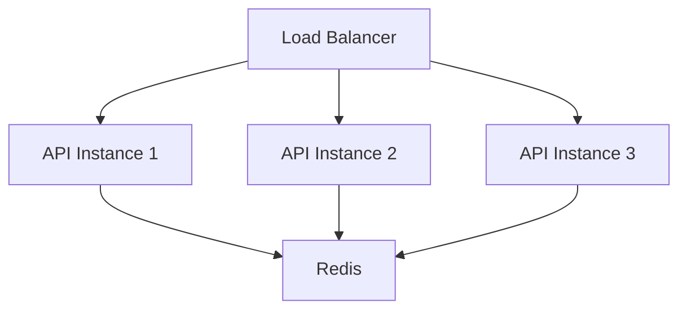
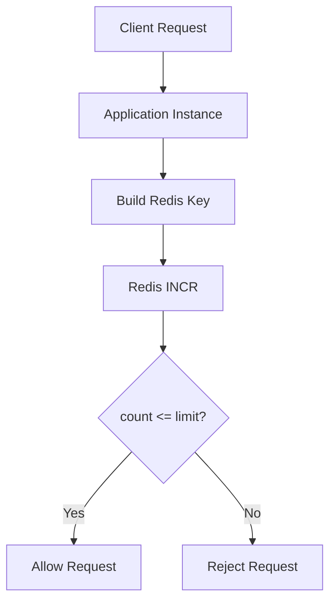
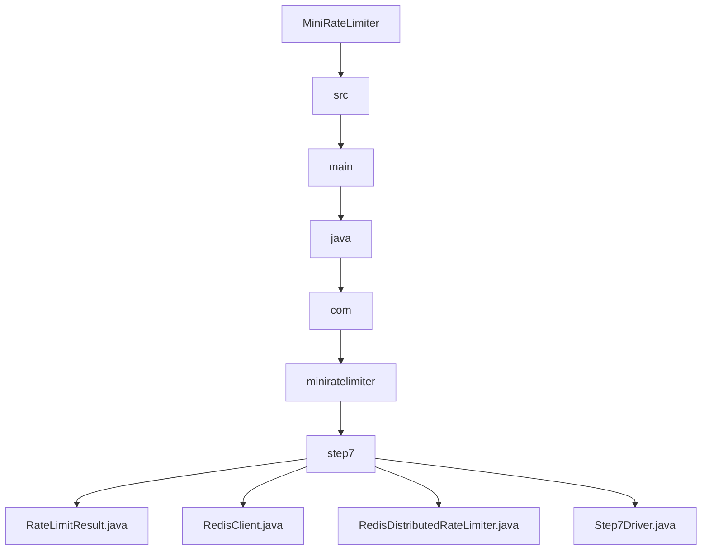

# 007_Redis_Distributed_RateLimiter

# MiniRateLimiter Step 7 — Redis Distributed Rate Limiter

---

# Clickable Index

1. [Goal](#goal)  
2. [Why Distributed Rate Limiter?](#why-distributed-rate-limiter)  
3. [Problem With Local Memory Limiters](#problem-with-local-memory-limiters)  
4. [Real World Example](#real-world-example)  
5. [Core Idea](#core-idea)  
6. [Redis Architecture Mermaid Diagram](#redis-architecture-mermaid-diagram)  
7. [Distributed Flow Mermaid Diagram](#distributed-flow-mermaid-diagram)  
8. [Detailed Steps Before Code](#detailed-steps-before-code)  
9. [CP/DSA Concepts Used](#cpdsa-concepts-used)  
10. [Time Complexity](#time-complexity)  
11. [Space Complexity](#space-complexity)  
12. [Local Limiter vs Distributed Limiter](#local-limiter-vs-distributed-limiter)  
13. [Folder Structure](#folder-structure)  
14. [Folder Mermaid Diagram](#folder-mermaid-diagram)  
15. [Complete Java Code](#complete-java-code)  
16. [CP/DSA Pattern Code](#cpdsa-pattern-code)  
17. [Dry Run](#dry-run)  
18. [Run Command](#run-command)  
19. [Expected Output Pattern](#expected-output-pattern)  
20. [Important Observation](#important-observation)  
21. [Current MiniRateLimiter State](#current-miniratelimiter-state)  
22. [Step 7 Completion Checklist](#step-7-completion-checklist)  
23. [Final Mental Model](#final-mental-model)  
24. [Next Step](#next-step)  

---

# Goal

Until now, our rate limiters worked inside one JVM process.

Problem:

```text
multiple application instances
```

Example:

```text
instance-1
instance-2
instance-3
```

Each instance has separate memory.

This breaks rate limiting consistency.

Now we build:

```text
Redis Distributed Rate Limiter
```

All instances share same global state using Redis.

---

# Why Distributed Rate Limiter?

Suppose:

```text
limit = 5 requests/minute
```

User sends:

```text
5 requests to instance-1
5 requests to instance-2
```

If limiters use local memory:

```text
user gets 10 requests
```

This violates global limit.

---

# Problem With Local Memory Limiters

Architecture:

```text
Load Balancer
     |
 -------------------
 |        |        |
API-1   API-2   API-3
```

Each instance stores:

```text
local HashMap
```

No shared state.

This causes inconsistent limits.

---

# Real World Example

Real production systems:

```text
Nginx
Cloudflare
Kong
Envoy
AWS API Gateway
```

often use:

```text
Redis
```

because Redis provides:

```text
fast atomic counters
shared distributed state
TTL expiration
```

---

# Core Idea

Instead of:

```java
HashMap<String, Integer>
```

use:

```text
Redis key-value store
```

Example:

```text
rate_limit:user-1:window-123 -> 4
```

Redis becomes:

```text
central source of truth
```

---

# Redis Architecture Mermaid Diagram



---

# Distributed Flow Mermaid Diagram



---

# Detailed Steps Before Code

## Step 1 — Build Redis key

Key format:

```text
rate_limit:userId:windowId
```

Example:

```text
rate_limit:user-1:12345
```

---

## Step 2 — Increment counter atomically

Redis command:

```text
INCR key
```

Redis guarantees atomic increment.

---

## Step 3 — Set expiration

Redis key must expire automatically.

Otherwise memory leaks occur.

Use:

```text
EXPIRE key 60
```

---

## Step 4 — Compare with limit

If:

```text
count <= limit
```

allow request.

Else reject.

---

## Step 5 — Return distributed result

All app instances now share same Redis counter.

---

# CP/DSA Concepts Used

## 1. Distributed Shared State

Redis acts as global shared memory.

---

## 2. Atomic Counter

Redis INCR is atomic.

This avoids race conditions across servers.

---

## 3. Key Design

Composite key:

```text
userId + windowId
```

Very common distributed-system pattern.

---

## 4. TTL Expiration

Redis automatically cleans expired windows.

This prevents memory leaks.

---

## 5. O(1) Distributed Counter

Redis INCR:

```text
O(1)
```

---

# Time Complexity

```text
O(1) Redis operations
```

---

# Space Complexity

```text
O(active users * active windows)
```

---

# Local Limiter vs Distributed Limiter

| Feature | Local Limiter | Redis Distributed |
|---|---:|---:|
| Shared Across Servers | No | Yes |
| Multi-Instance Safe | No | Yes |
| Fast | Very Fast | Fast |
| Distributed Consistency | No | Yes |
| Real Production Usage | Limited | Very common |

---

# Folder Structure

```text
MiniRateLimiter/
└── src/main/java/com/miniratelimiter/step7/
    ├── RateLimitResult.java
    ├── RedisClient.java
    ├── RedisDistributedRateLimiter.java
    └── Step7Driver.java
```

---

# Folder Mermaid Diagram



---

# Complete Java Code

---

# RateLimitResult.java

```java
package com.miniratelimiter.step7;

/*
 * Logic:
 *
 * 1. Store allow/reject decision.
 * 2. Store current distributed count.
 * 3. Store configured limit.
 *
 * Time Complexity:
 * O(1)
 */
public class RateLimitResult {

    private final boolean allowed;

    private final long currentCount;

    private final int limit;

    public RateLimitResult(boolean allowed, long currentCount, int limit) {
        this.allowed = allowed;
        this.currentCount = currentCount;
        this.limit = limit;
    }

    public boolean isAllowed() {
        return allowed;
    }

    public long getCurrentCount() {
        return currentCount;
    }

    public int getLimit() {
        return limit;
    }

    @Override
    public String toString() {
        return "RateLimitResult{" +
                "allowed=" + allowed +
                ", currentCount=" + currentCount +
                ", limit=" + limit +
                '}';
    }
}
```

---

# RedisClient.java

```java
package com.miniratelimiter.step7;

import java.util.HashMap;
import java.util.Map;

/*
 * Logic:
 *
 * 1. Simulate Redis key-value store.
 * 2. Support atomic increment.
 * 3. Support expiration timestamps.
 * 4. Cleanup expired keys lazily.
 *
 * NOTE:
 * Real systems use actual Redis server.
 *
 * Time Complexity:
 * O(1)
 */
public class RedisClient {

    // Redis key -> count
    private final Map<String, Long> store;

    // Redis key -> expiration timestamp
    private final Map<String, Long> expirations;

    public RedisClient() {
        this.store = new HashMap<>();
        this.expirations = new HashMap<>();
    }

    public synchronized long incr(String key) {

        cleanupIfExpired(key);

        long newValue =
                store.getOrDefault(key, 0L) + 1;

        store.put(key, newValue);

        return newValue;
    }

    public synchronized void expire(
            String key,
            long ttlMillis,
            long currentTimeMillis
    ) {

        long expirationTime =
                currentTimeMillis + ttlMillis;

        expirations.put(key, expirationTime);
    }

    private void cleanupIfExpired(String key) {

        Long expirationTime =
                expirations.get(key);

        if (expirationTime == null) {
            return;
        }

        long now = System.currentTimeMillis();

        if (now >= expirationTime) {

            store.remove(key);

            expirations.remove(key);
        }
    }

    public synchronized Map<String, Long> snapshot() {
        return new HashMap<>(store);
    }
}
```

---

# RedisDistributedRateLimiter.java

```java
package com.miniratelimiter.step7;

/*
 * Logic:
 *
 * 1. Build Redis key using userId + windowId.
 * 2. Increment distributed Redis counter.
 * 3. Set expiration on first request.
 * 4. Compare counter against limit.
 * 5. Return allow/reject decision.
 *
 * Core Idea:
 *
 * Redis acts as shared global state.
 *
 * Time Complexity:
 * O(1)
 *
 * Space Complexity:
 * O(active users * windows)
 */
public class RedisDistributedRateLimiter {

    // Maximum requests allowed.
    private final int limit;

    // Window size.
    private final long windowSizeMillis;

    // Shared Redis store.
    private final RedisClient redisClient;

    public RedisDistributedRateLimiter(
            int limit,
            long windowSizeMillis,
            RedisClient redisClient
    ) {

        if (limit <= 0) {
            throw new IllegalArgumentException("Limit should be positive");
        }

        if (windowSizeMillis <= 0) {
            throw new IllegalArgumentException("Window should be positive");
        }

        this.limit = limit;
        this.windowSizeMillis = windowSizeMillis;
        this.redisClient = redisClient;
    }

    public RateLimitResult allowRequest(
            String userId,
            long currentTimeMillis
    ) {

        long windowId =
                currentTimeMillis / windowSizeMillis;

        String redisKey =
                buildRedisKey(userId, windowId);

        long currentCount =
                redisClient.incr(redisKey);

        // First request creates expiration.
        if (currentCount == 1) {

            redisClient.expire(
                    redisKey,
                    windowSizeMillis,
                    currentTimeMillis
            );
        }

        boolean allowed =
                currentCount <= limit;

        return new RateLimitResult(
                allowed,
                currentCount,
                limit
        );
    }

    private String buildRedisKey(
            String userId,
            long windowId
    ) {

        return "rate_limit:" +
                userId +
                ":" +
                windowId;
    }
}
```

---

# Step7Driver.java

```java
package com.miniratelimiter.step7;

/*
 * Logic:
 *
 * 1. Create shared Redis client.
 * 2. Create multiple API instances.
 * 3. All instances share same Redis state.
 * 4. Verify global distributed limit works.
 */
public class Step7Driver {

    public static void main(String[] args) {

        RedisClient redisClient =
                new RedisClient();

        RedisDistributedRateLimiter apiInstance1 =
                new RedisDistributedRateLimiter(
                        5,
                        60_000,
                        redisClient
                );

        RedisDistributedRateLimiter apiInstance2 =
                new RedisDistributedRateLimiter(
                        5,
                        60_000,
                        redisClient
                );

        long currentTime = 0;

        String userId = "user-1";

        System.out.println("---- DISTRIBUTED REQUESTS ----");

        for (int i = 1; i <= 3; i++) {

            RateLimitResult result =
                    apiInstance1.allowRequest(
                            userId,
                            currentTime
                    );

            System.out.println(
                    "[API-1] request=" +
                    i +
                    ", result=" +
                    result
            );
        }

        for (int i = 4; i <= 7; i++) {

            RateLimitResult result =
                    apiInstance2.allowRequest(
                            userId,
                            currentTime
                    );

            System.out.println(
                    "[API-2] request=" +
                    i +
                    ", result=" +
                    result
            );
        }

        System.out.println();
        System.out.println("---- REDIS SNAPSHOT ----");

        System.out.println(redisClient.snapshot());
    }
}
```

---

# CP/DSA Pattern Code

## Problem

Simulate distributed shared counter.

---

## DSA/CP Java Code

```java
import java.util.HashMap;
import java.util.Map;

public class DistributedCounterCP {

    public static void main(String[] args) {

        Map<String, Integer> redis =
                new HashMap<>();

        String key = "user-1:window-1";

        for (int i = 1; i <= 7; i++) {

            int count =
                    redis.getOrDefault(key, 0) + 1;

            redis.put(key, count);

            boolean allowed = count <= 5;

            System.out.println(
                    "request=" +
                    i +
                    ", count=" +
                    count +
                    ", allowed=" +
                    allowed
            );
        }
    }
}
```

---

# Dry Run

Configuration:

```text
limit = 5
window = 60 seconds
```

Requests:

```text
3 requests -> API-1
4 requests -> API-2
```

All share same Redis key:

```text
rate_limit:user-1:0
```

Counts:

```text
1
2
3
4
5
6
7
```

Requests:

```text
6
7
```

rejected globally.

---

# Run Command

```bash
javac -d out src/main/java/com/miniratelimiter/step7/*.java

java -cp out com.miniratelimiter.step7.Step7Driver
```

---

# Expected Output Pattern

```text
[API-1] request=1, result=allowed=true
[API-1] request=2, result=allowed=true
...
[API-2] request=6, result=allowed=false
```

---

# Important Observation

Distributed systems need:

```text
shared distributed state
```

Otherwise:

```text
limits break across servers
```

Redis is commonly used because:

```text
fast
atomic
simple
TTL support
```

---

# Current MiniRateLimiter State

```text
Supported:
[yes] fixed window counter
[yes] sliding window log
[yes] sliding window counter
[yes] token bucket
[yes] leaky bucket
[yes] thread-safe limiter
[yes] Redis distributed limiter
[yes] global distributed counters

Not yet:
[no] Redis Lua scripts
[no] sliding window Redis limiter
[no] multi-region coordination
[no] Spring Boot integration
```

---

# Step 7 Completion Checklist

```text
[ ] You understand distributed rate limiting
[ ] You understand Redis shared state
[ ] You understand atomic counters
[ ] You understand Redis TTL
[ ] You understand global consistency
[ ] You understand distributed key design
```

---

# Final Mental Model

```text
Distributed Rate Limiter =
shared global counter in Redis
```

```text
all servers share same state
```

---

# Next Step

Next we build:

```text
008_Redis_Lua_Atomic_RateLimiter
```

We will combine:

```text
INCR + EXPIRE
```

into one atomic Redis Lua script.
