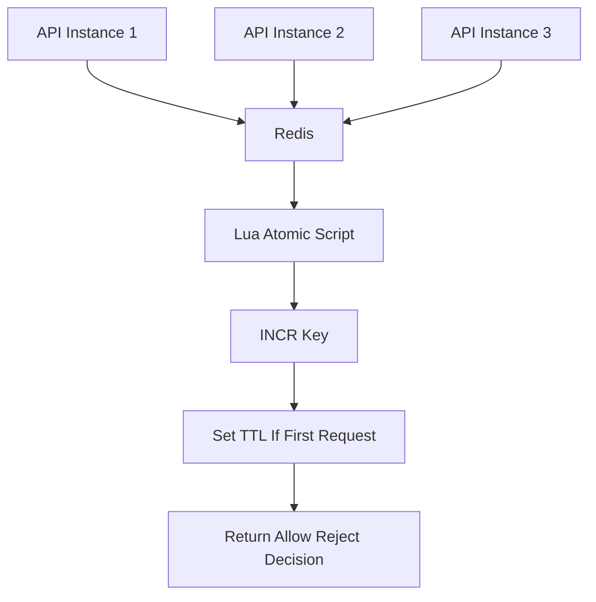
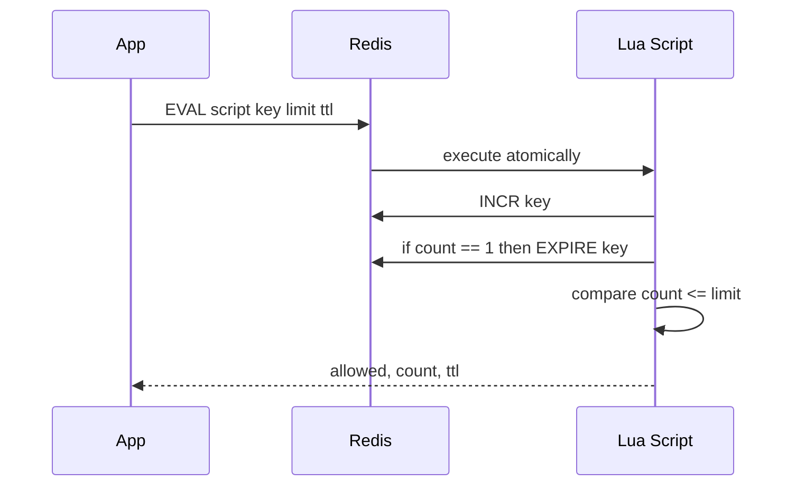
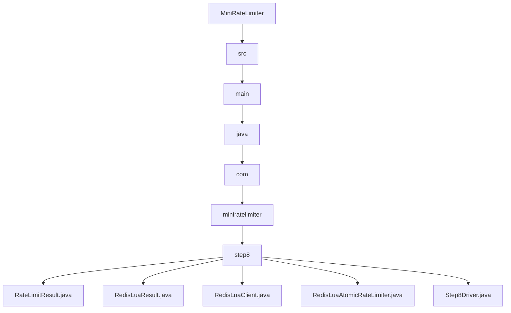

# 008_Redis_Lua_Atomic_RateLimiter

# MiniRateLimiter Step 8 — Redis Lua Atomic Rate Limiter

---

# Clickable Index

1. [Goal](#goal)  
2. [Delta From Step 7](#delta-from-step-7)  
3. [Why Lua Atomic Script?](#why-lua-atomic-script)  
4. [Problem With INCR + EXPIRE Separately](#problem-with-incr--expire-separately)  
5. [Core Idea](#core-idea)  
6. [Architecture Mermaid Diagram](#architecture-mermaid-diagram)  
7. [Lua Script Flow Mermaid Diagram](#lua-script-flow-mermaid-diagram)  
8. [Detailed Steps Before Code](#detailed-steps-before-code)  
9. [CP/DSA Concepts Used](#cpdsa-concepts-used)  
10. [Time Complexity](#time-complexity)  
11. [Space Complexity](#space-complexity)  
12. [Normal Redis vs Lua Atomic Redis](#normal-redis-vs-lua-atomic-redis)  
13. [Folder Structure](#folder-structure)  
14. [Folder Mermaid Diagram](#folder-mermaid-diagram)  
15. [Complete Java Code](#complete-java-code)  
16. [CP/DSA Pattern Code](#cpdsa-pattern-code)  
17. [Dry Run](#dry-run)  
18. [Run Command](#run-command)  
19. [Expected Output Pattern](#expected-output-pattern)  
20. [Important Observation](#important-observation)  
21. [Current MiniRateLimiter State](#current-miniratelimiter-state)  
22. [Step 8 Completion Checklist](#step-8-completion-checklist)  
23. [Final Mental Model](#final-mental-model)  
24. [Next Step](#next-step)  

---

# Goal

In Step 7, we built:

```text
Redis Distributed Rate Limiter
```

It used:

```text
INCR key
EXPIRE key
```

But these were separate operations.

In real Redis rate limiters, we often use:

```text
Lua script
```

to make multiple Redis operations execute atomically.

In this step, we simulate:

```text
Redis Lua Atomic Rate Limiter
```

---

# Delta From Step 7

```text
Step 7:
INCR and EXPIRE were separate method calls.

Step 8:
INCR + EXPIRE + decision happen inside one atomic script.
```

Step 7:

```java
count = redis.incr(key);

if (count == 1) {
    redis.expire(key, ttl);
}
```

Step 8:

```java
result = redis.executeRateLimitScript(key, limit, ttl);
```

---

# Why Lua Atomic Script?

Redis commands are individually atomic.

But a sequence of commands is not automatically atomic.

Example:

```text
INCR key
EXPIRE key
```

Between these two commands, something bad can happen:

```text
application crashes
network failure
timeout
```

Then key may never expire.

That causes memory leak.

Lua script solves this by making the whole logic atomic.

---

# Problem With INCR + EXPIRE Separately

Bad case:

```text
1. App sends INCR key
2. Redis increments key to 1
3. App crashes before EXPIRE
4. Key stays forever
```

Result:

```text
memory leak
wrong future rate limits
```

---

# Core Idea

Lua script logic:

```text
count = INCR key

if count == 1:
    EXPIRE key ttl

if count <= limit:
    allow
else:
    reject
```

All happens as one atomic unit.

---

# Architecture Mermaid Diagram



---

# Lua Script Flow Mermaid Diagram



---

# Detailed Steps Before Code

## Step 1 — Build rate limit key

```text
rate_limit:userId:windowId
```

---

## Step 2 — Execute atomic script

Instead of exposing separate Redis operations:

```java
incr()
expire()
```

we expose:

```java
executeRateLimitScript()
```

---

## Step 3 — Increment counter inside script

```text
count = count + 1
```

---

## Step 4 — Set TTL only when count becomes 1

```text
if count == 1:
    expire key
```

---

## Step 5 — Return result

Script returns:

```text
allowed
currentCount
limit
ttlMillis
```

---

# CP/DSA Concepts Used

## 1. Atomic Critical Section

Multiple operations behave as one indivisible operation.

---

## 2. Compare And Decide

Script increments, then compares:

```text
count <= limit
```

---

## 3. Composite Key

Same key design:

```text
userId + windowId
```

---

## 4. TTL State

Keys disappear automatically after window expires.

---

## 5. Distributed Race Prevention

Lua avoids race conditions across multiple API servers.

---

# Time Complexity

```text
O(1)
```

Per request.

---

# Space Complexity

```text
O(active users * active windows)
```

---

# Normal Redis vs Lua Atomic Redis

| Feature | Separate Redis Commands | Lua Atomic Script |
|---|---:|---:|
| INCR atomic | Yes | Yes |
| INCR + EXPIRE atomic together | No | Yes |
| Memory leak risk | Yes | Low |
| Production usage | Medium | High |
| Multi-command safety | Weak | Strong |

---

# Folder Structure

```text
MiniRateLimiter/
└── src/main/java/com/miniratelimiter/step8/
    ├── RateLimitResult.java
    ├── RedisLuaResult.java
    ├── RedisLuaClient.java
    ├── RedisLuaAtomicRateLimiter.java
    └── Step8Driver.java
```

---

# Folder Mermaid Diagram



---

# Complete Java Code

---

# RateLimitResult.java

```java
package com.miniratelimiter.step8;

/*
 * Logic:
 *
 * 1. Store allow/reject decision.
 * 2. Store current Redis counter value.
 * 3. Store configured limit.
 * 4. Store TTL for visibility/debugging.
 *
 * Time Complexity:
 * O(1)
 */
public class RateLimitResult {

    private final boolean allowed;
    private final long currentCount;
    private final int limit;
    private final long ttlMillis;

    public RateLimitResult(boolean allowed, long currentCount, int limit, long ttlMillis) {
        this.allowed = allowed;
        this.currentCount = currentCount;
        this.limit = limit;
        this.ttlMillis = ttlMillis;
    }

    public boolean isAllowed() {
        return allowed;
    }

    public long getCurrentCount() {
        return currentCount;
    }

    public int getLimit() {
        return limit;
    }

    public long getTtlMillis() {
        return ttlMillis;
    }

    @Override
    public String toString() {
        return "RateLimitResult{" +
                "allowed=" + allowed +
                ", currentCount=" + currentCount +
                ", limit=" + limit +
                ", ttlMillis=" + ttlMillis +
                '}';
    }
}
```

---

# RedisLuaResult.java

```java
package com.miniratelimiter.step8;

/*
 * Logic:
 *
 * 1. Represent output of simulated Redis Lua script.
 * 2. Keep count returned by script.
 * 3. Keep whether request is allowed.
 *
 * Time Complexity:
 * O(1)
 */
public class RedisLuaResult {

    private final boolean allowed;
    private final long count;

    public RedisLuaResult(boolean allowed, long count) {
        this.allowed = allowed;
        this.count = count;
    }

    public boolean isAllowed() {
        return allowed;
    }

    public long getCount() {
        return count;
    }
}
```

---

# RedisLuaClient.java

```java
package com.miniratelimiter.step8;

import java.util.HashMap;
import java.util.Map;

/*
 * Logic:
 *
 * 1. Simulate Redis key-value store.
 * 2. Simulate Redis TTL map.
 * 3. Execute INCR + EXPIRE + decision atomically.
 * 4. Use synchronized to simulate Lua atomic execution.
 *
 * Real Redis:
 *
 * EVAL script runs atomically on Redis server.
 *
 * Time Complexity:
 * O(1)
 *
 * Space Complexity:
 * O(active keys)
 */
public class RedisLuaClient {

    private final Map<String, Long> store;
    private final Map<String, Long> expirations;

    public RedisLuaClient() {
        this.store = new HashMap<>();
        this.expirations = new HashMap<>();
    }

    public synchronized RedisLuaResult executeRateLimitScript(
            String key,
            int limit,
            long ttlMillis,
            long currentTimeMillis
    ) {

        cleanupIfExpired(key, currentTimeMillis);

        long count = store.getOrDefault(key, 0L) + 1;

        store.put(key, count);

        if (count == 1) {
            expirations.put(key, currentTimeMillis + ttlMillis);
        }

        boolean allowed = count <= limit;

        return new RedisLuaResult(allowed, count);
    }

    private void cleanupIfExpired(String key, long currentTimeMillis) {
        Long expirationTime = expirations.get(key);

        if (expirationTime == null) {
            return;
        }

        if (currentTimeMillis >= expirationTime) {
            store.remove(key);
            expirations.remove(key);
        }
    }

    public synchronized Map<String, Long> snapshot() {
        return new HashMap<>(store);
    }
}
```

---

# RedisLuaAtomicRateLimiter.java

```java
package com.miniratelimiter.step8;

/*
 * Logic:
 *
 * 1. Calculate fixed window id.
 * 2. Build Redis key.
 * 3. Call atomic Redis Lua script.
 * 4. Convert script result into RateLimitResult.
 *
 * Core Idea:
 *
 * App does not call INCR and EXPIRE separately.
 * App calls one atomic Redis script.
 *
 * Time Complexity:
 * O(1)
 *
 * Space Complexity:
 * O(active users * windows)
 */
public class RedisLuaAtomicRateLimiter {

    private final int limit;
    private final long windowSizeMillis;
    private final RedisLuaClient redisLuaClient;

    public RedisLuaAtomicRateLimiter(int limit, long windowSizeMillis, RedisLuaClient redisLuaClient) {
        if (limit <= 0) {
            throw new IllegalArgumentException("Limit should be positive");
        }

        if (windowSizeMillis <= 0) {
            throw new IllegalArgumentException("Window should be positive");
        }

        this.limit = limit;
        this.windowSizeMillis = windowSizeMillis;
        this.redisLuaClient = redisLuaClient;
    }

    public RateLimitResult allowRequest(String userId, long currentTimeMillis) {
        long windowId = currentTimeMillis / windowSizeMillis;

        String redisKey = buildRedisKey(userId, windowId);

        RedisLuaResult scriptResult =
                redisLuaClient.executeRateLimitScript(redisKey, limit, windowSizeMillis, currentTimeMillis);

        return new RateLimitResult(
                scriptResult.isAllowed(),
                scriptResult.getCount(),
                limit,
                windowSizeMillis
        );
    }

    private String buildRedisKey(String userId, long windowId) {
        return "rate_limit:" + userId + ":" + windowId;
    }
}
```

---

# Step8Driver.java

```java
package com.miniratelimiter.step8;

/*
 * Logic:
 *
 * 1. Create shared RedisLuaClient.
 * 2. Create two API instances.
 * 3. Send requests from both instances.
 * 4. Observe shared atomic global count.
 * 5. Move to next window and observe TTL behavior.
 */
public class Step8Driver {

    public static void main(String[] args) {
        RedisLuaClient redisLuaClient = new RedisLuaClient();

        RedisLuaAtomicRateLimiter apiInstance1 =
                new RedisLuaAtomicRateLimiter(5, 60_000, redisLuaClient);

        RedisLuaAtomicRateLimiter apiInstance2 =
                new RedisLuaAtomicRateLimiter(5, 60_000, redisLuaClient);

        String userId = "user-1";

        long currentTime = 0;

        System.out.println("---- ATOMIC DISTRIBUTED REQUESTS ----");

        for (int i = 1; i <= 3; i++) {
            RateLimitResult result = apiInstance1.allowRequest(userId, currentTime);

            System.out.println("[API-1] request=" + i + ", result=" + result);
        }

        for (int i = 4; i <= 7; i++) {
            RateLimitResult result = apiInstance2.allowRequest(userId, currentTime);

            System.out.println("[API-2] request=" + i + ", result=" + result);
        }

        System.out.println();
        System.out.println("---- REDIS SNAPSHOT ----");
        System.out.println(redisLuaClient.snapshot());

        System.out.println();
        System.out.println("---- NEXT WINDOW AFTER TTL ----");

        long nextWindowTime = 60_000;

        RateLimitResult result = apiInstance1.allowRequest(userId, nextWindowTime);

        System.out.println("nextWindowResult=" + result);

        System.out.println();
        System.out.println("---- REDIS SNAPSHOT AFTER NEXT WINDOW ----");
        System.out.println(redisLuaClient.snapshot());
    }
}
```

---

# CP/DSA Pattern Code

## Problem

Make multiple operations behave atomically.

---

## DSA/CP Java Code

```java
public class AtomicScriptCP {

    private static int count = 0;

    public static synchronized boolean script(int limit) {
        count++;

        return count <= limit;
    }

    public static void main(String[] args) {
        int limit = 5;

        for (int i = 1; i <= 7; i++) {
            boolean allowed = script(limit);

            System.out.println("request=" + i + ", count=" + count + ", allowed=" + allowed);
        }
    }
}
```

---

# Dry Run

Configuration:

```text
limit = 5
window = 60 seconds
```

Requests from two API instances:

```text
API-1 -> 3 requests
API-2 -> 4 requests
```

Redis Lua script sees one shared key:

```text
rate_limit:user-1:0
```

Counts:

```text
1 allow
2 allow
3 allow
4 allow
5 allow
6 reject
7 reject
```

---

# Run Command

```bash
javac -d out src/main/java/com/miniratelimiter/step8/*.java

java -cp out com.miniratelimiter.step8.Step8Driver
```

---

# Expected Output Pattern

```text
[API-1] request=1, result=RateLimitResult{allowed=true, currentCount=1, limit=5, ttlMillis=60000}
...
[API-2] request=6, result=RateLimitResult{allowed=false, currentCount=6, limit=5, ttlMillis=60000}
```

---

# Important Observation

This is closer to real production Redis rate limiting.

In real Redis, script usually looks like:

```lua
local current = redis.call("INCR", KEYS[1])
if current == 1 then
  redis.call("PEXPIRE", KEYS[1], ARGV[2])
end
return current
```

The important concept:

```text
multiple Redis commands become one atomic operation
```

---

# Current MiniRateLimiter State

```text
Supported:
[yes] fixed window counter
[yes] sliding window log
[yes] sliding window counter
[yes] token bucket
[yes] leaky bucket
[yes] thread-safe limiter
[yes] Redis distributed limiter
[yes] Redis Lua atomic limiter

Not yet:
[no] per-user policy model
[no] per-route limits
[no] HTTP headers
[no] Spring Boot filter
```

---

# Step 8 Completion Checklist

```text
[ ] You understand why INCR + EXPIRE separately can fail
[ ] You understand Lua atomic script
[ ] You understand Redis EVAL concept
[ ] You understand atomic distributed counter
[ ] You understand TTL safety
[ ] You understand production Redis rate limiter flow
```

---

# Final Mental Model

```text
Redis Lua Rate Limiter =
INCR + EXPIRE + decision in one atomic operation
```

---

# Next Step

Next we build:

```text
009_Rate_Limit_Policy_Model
```

We will define reusable policies:

```text
limit
window
algorithm
scope
```
