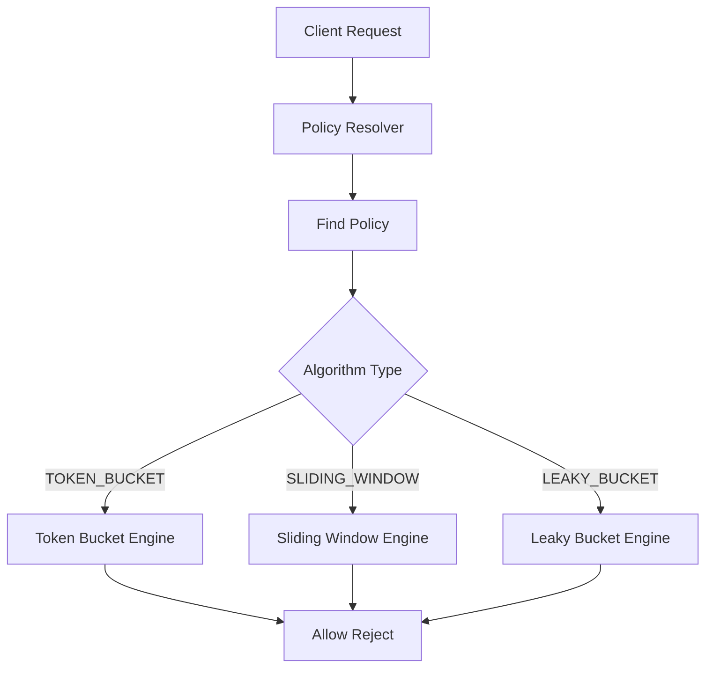
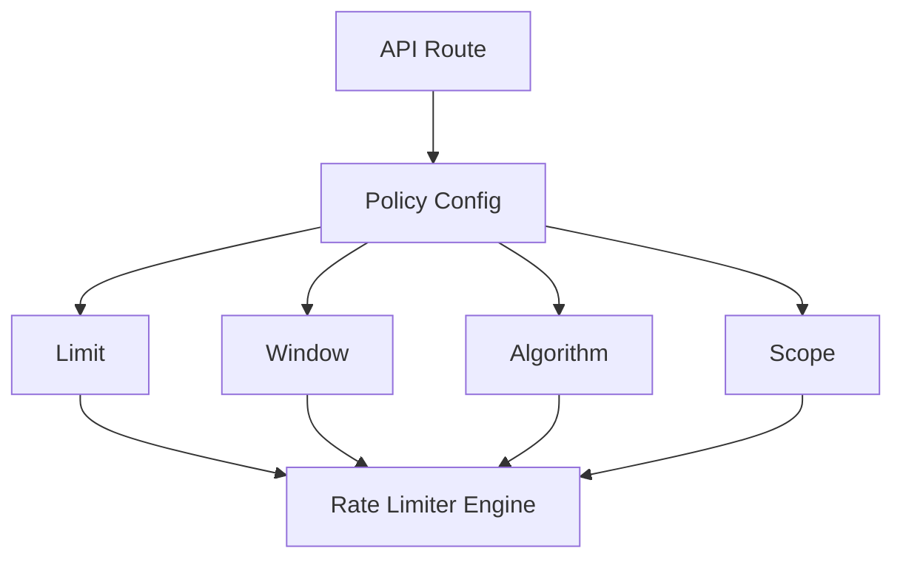
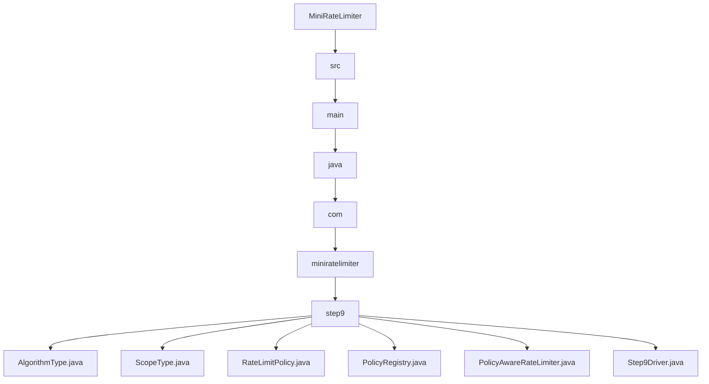

# 009_Rate_Limit_Policy_Model

# MiniRateLimiter Step 9 — Rate Limit Policy Model

---

# Clickable Index

1. [Goal](#goal)  
2. [Why Policy Model?](#why-policy-model)  
3. [Problem Without Policy Model](#problem-without-policy-model)  
4. [Real World Example](#real-world-example)  
5. [Core Idea](#core-idea)  
6. [Architecture Mermaid Diagram](#architecture-mermaid-diagram)  
7. [Policy Flow Mermaid Diagram](#policy-flow-mermaid-diagram)  
8. [Detailed Steps Before Code](#detailed-steps-before-code)  
9. [CP/DSA Concepts Used](#cpdsa-concepts-used)  
10. [Time Complexity](#time-complexity)  
11. [Space Complexity](#space-complexity)  
12. [Static Limiter vs Policy Driven Limiter](#static-limiter-vs-policy-driven-limiter)  
13. [Folder Structure](#folder-structure)  
14. [Folder Mermaid Diagram](#folder-mermaid-diagram)  
15. [Complete Java Code](#complete-java-code)  
16. [CP/DSA Pattern Code](#cpdsa-pattern-code)  
17. [Dry Run](#dry-run)  
18. [Run Command](#run-command)  
19. [Expected Output Pattern](#expected-output-pattern)  
20. [Important Observation](#important-observation)  
21. [Current MiniRateLimiter State](#current-miniratelimiter-state)  
22. [Step 9 Completion Checklist](#step-9-completion-checklist)  
23. [Final Mental Model](#final-mental-model)  
24. [Next Step](#next-step)  

---

# Goal

Until now, our rate limiters had:

```text
hardcoded limit
hardcoded window
hardcoded algorithm
```

Real systems need dynamic configurable policies.

Example:

```text
free user -> 10 req/min
premium user -> 1000 req/min
admin -> unlimited
```

Now we build:

```text
Rate Limit Policy Model
```

This separates:

```text
policy definition
```

from:

```text
rate limiter engine
```

---

# Why Policy Model?

Without policy model:

```java
new TokenBucketRateLimiter(10, 60_000);
```

Everything is hardcoded.

Real systems require:

```text
different users
different APIs
different plans
different algorithms
```

---

# Problem Without Policy Model

Suppose:

```text
/login -> strict limit
/search -> medium limit
/payment -> very strict
/public-feed -> relaxed
```

Without policy abstraction:

```text
many hardcoded limiters
duplicate logic
difficult maintenance
```

---

# Real World Example

Real API gateways support policy configuration:

```text
Kong
Envoy
Nginx
AWS API Gateway
Cloudflare
```

Policies often define:

```text
algorithm
limit
window
scope
burst
headers
```

---

# Core Idea

Create reusable policy objects.

Example:

```text
Policy:
- algorithm = TOKEN_BUCKET
- limit = 100
- window = 60 sec
- scope = USER
```

Then engine chooses correct limiter dynamically.

---

# Architecture Mermaid Diagram



---

# Policy Flow Mermaid Diagram



---

# Detailed Steps Before Code

## Step 1 — Define algorithm enum

Supported algorithms:

```text
TOKEN_BUCKET
SLIDING_WINDOW
LEAKY_BUCKET
```

---

## Step 2 — Define scope enum

Policy can apply to:

```text
USER
IP
API_KEY
ROUTE
```

---

## Step 3 — Create policy object

Policy stores:

```text
limit
window
algorithm
scope
burst
```

---

## Step 4 — Create policy registry

Registry maps:

```text
route -> policy
```

---

## Step 5 — Build policy-aware limiter

Limiter reads policy dynamically.

---

# CP/DSA Concepts Used

## 1. Strategy Pattern

Algorithm chosen dynamically.

---

## 2. Enum Based Dispatch

Different algorithms selected using enum.

---

## 3. HashMap Registry

```java
Map<String, RateLimitPolicy>
```

Maps:

```text
route -> policy
```

---

## 4. Config Driven Design

Behavior controlled by configuration instead of hardcoded logic.

---

## 5. Separation Of Concerns

Policy definition separated from limiter implementation.

---

# Time Complexity

Policy lookup:

```text
O(1)
```

---

# Space Complexity

```text
O(number of policies)
```

---

# Static Limiter vs Policy Driven Limiter

| Feature | Static Limiter | Policy Model |
|---|---:|---:|
| Dynamic Config | No | Yes |
| Per Route Policies | Hard | Easy |
| Multiple Algorithms | Hardcoded | Flexible |
| Real Production Usage | Low | Very common |

---

# Folder Structure

```text
MiniRateLimiter/
└── src/main/java/com/miniratelimiter/step9/
    ├── AlgorithmType.java
    ├── ScopeType.java
    ├── RateLimitPolicy.java
    ├── PolicyRegistry.java
    ├── PolicyAwareRateLimiter.java
    └── Step9Driver.java
```

---

# Folder Mermaid Diagram



---

# Complete Java Code

---

# AlgorithmType.java

```java
package com.miniratelimiter.step9;

/*
 * Logic:
 *
 * 1. Define supported rate limit algorithms.
 * 2. Used for dynamic strategy selection.
 */
public enum AlgorithmType {

    TOKEN_BUCKET,

    SLIDING_WINDOW,

    LEAKY_BUCKET
}
```

---

# ScopeType.java

```java
package com.miniratelimiter.step9;

/*
 * Logic:
 *
 * 1. Define policy application scope.
 * 2. Determines identity key for rate limiting.
 */
public enum ScopeType {

    USER,

    IP,

    API_KEY,

    ROUTE
}
```

---

# RateLimitPolicy.java

```java
package com.miniratelimiter.step9;

/*
 * Logic:
 *
 * 1. Store reusable rate limit configuration.
 * 2. Define algorithm, limit, window and scope.
 * 3. Separate policy from limiter implementation.
 *
 * Time Complexity:
 * O(1)
 */
public class RateLimitPolicy {

    // Policy name.
    private final String policyName;

    // Maximum allowed requests.
    private final int limit;

    // Window size in milliseconds.
    private final long windowSizeMillis;

    // Which algorithm to use.
    private final AlgorithmType algorithmType;

    // Policy application scope.
    private final ScopeType scopeType;

    // Optional burst size.
    private final int burstCapacity;

    public RateLimitPolicy(
            String policyName,
            int limit,
            long windowSizeMillis,
            AlgorithmType algorithmType,
            ScopeType scopeType,
            int burstCapacity
    ) {

        this.policyName = policyName;
        this.limit = limit;
        this.windowSizeMillis = windowSizeMillis;
        this.algorithmType = algorithmType;
        this.scopeType = scopeType;
        this.burstCapacity = burstCapacity;
    }

    public String getPolicyName() {
        return policyName;
    }

    public int getLimit() {
        return limit;
    }

    public long getWindowSizeMillis() {
        return windowSizeMillis;
    }

    public AlgorithmType getAlgorithmType() {
        return algorithmType;
    }

    public ScopeType getScopeType() {
        return scopeType;
    }

    public int getBurstCapacity() {
        return burstCapacity;
    }

    @Override
    public String toString() {
        return "RateLimitPolicy{" +
                "policyName='" + policyName + '\'' +
                ", limit=" + limit +
                ", windowSizeMillis=" + windowSizeMillis +
                ", algorithmType=" + algorithmType +
                ", scopeType=" + scopeType +
                ", burstCapacity=" + burstCapacity +
                '}';
    }
}
```

---

# PolicyRegistry.java

```java
package com.miniratelimiter.step9;

import java.util.HashMap;
import java.util.Map;

/*
 * Logic:
 *
 * 1. Store route -> policy mapping.
 * 2. Support dynamic policy lookup.
 * 3. Simulate production policy registry.
 *
 * Time Complexity:
 * O(1)
 */
public class PolicyRegistry {

    // route -> policy
    private final Map<String, RateLimitPolicy> policies;

    public PolicyRegistry() {
        this.policies = new HashMap<>();
    }

    public void registerPolicy(
            String route,
            RateLimitPolicy policy
    ) {

        policies.put(route, policy);
    }

    public RateLimitPolicy getPolicy(String route) {
        return policies.get(route);
    }
}
```

---

# PolicyAwareRateLimiter.java

```java
package com.miniratelimiter.step9;

/*
 * Logic:
 *
 * 1. Resolve route policy dynamically.
 * 2. Choose algorithm using enum.
 * 3. Simulate algorithm execution.
 * 4. Return allow/reject result.
 *
 * Real systems:
 *
 * Policy engine routes request
 * to correct limiter implementation.
 *
 * Time Complexity:
 * O(1)
 */
public class PolicyAwareRateLimiter {

    private final PolicyRegistry policyRegistry;

    public PolicyAwareRateLimiter(
            PolicyRegistry policyRegistry
    ) {

        this.policyRegistry = policyRegistry;
    }

    public boolean allowRequest(
            String route,
            String identity
    ) {

        RateLimitPolicy policy =
                policyRegistry.getPolicy(route);

        if (policy == null) {

            System.out.println(
                    "No policy found for route=" + route
            );

            return false;
        }

        System.out.println(
                "Applying policy=" +
                policy.getPolicyName()
        );

        switch (policy.getAlgorithmType()) {

            case TOKEN_BUCKET:

                System.out.println(
                        "Executing TOKEN_BUCKET logic for identity=" +
                        identity
                );

                break;

            case SLIDING_WINDOW:

                System.out.println(
                        "Executing SLIDING_WINDOW logic for identity=" +
                        identity
                );

                break;

            case LEAKY_BUCKET:

                System.out.println(
                        "Executing LEAKY_BUCKET logic for identity=" +
                        identity
                );

                break;
        }

        return true;
    }
}
```

---

# Step9Driver.java

```java
package com.miniratelimiter.step9;

/*
 * Logic:
 *
 * 1. Create reusable policies.
 * 2. Register policies for routes.
 * 3. Resolve policy dynamically.
 * 4. Execute algorithm based on policy.
 */
public class Step9Driver {

    public static void main(String[] args) {

        PolicyRegistry registry =
                new PolicyRegistry();

        RateLimitPolicy loginPolicy =
                new RateLimitPolicy(
                        "login-policy",
                        5,
                        60_000,
                        AlgorithmType.TOKEN_BUCKET,
                        ScopeType.IP,
                        10
                );

        RateLimitPolicy paymentPolicy =
                new RateLimitPolicy(
                        "payment-policy",
                        2,
                        60_000,
                        AlgorithmType.SLIDING_WINDOW,
                        ScopeType.USER,
                        2
                );

        registry.registerPolicy(
                "/login",
                loginPolicy
        );

        registry.registerPolicy(
                "/payment",
                paymentPolicy
        );

        PolicyAwareRateLimiter rateLimiter =
                new PolicyAwareRateLimiter(registry);

        System.out.println("---- LOGIN REQUEST ----");

        rateLimiter.allowRequest(
                "/login",
                "192.168.1.10"
        );

        System.out.println();

        System.out.println("---- PAYMENT REQUEST ----");

        rateLimiter.allowRequest(
                "/payment",
                "user-123"
        );
    }
}
```

---

# CP/DSA Pattern Code

## Problem

Select strategy dynamically using enum.

---

## DSA/CP Java Code

```java
enum Algorithm {

    TOKEN_BUCKET,

    SLIDING_WINDOW
}

public class StrategyCP {

    public static void main(String[] args) {

        Algorithm algorithm =
                Algorithm.TOKEN_BUCKET;

        switch (algorithm) {

            case TOKEN_BUCKET:

                System.out.println(
                        "Execute token bucket"
                );

                break;

            case SLIDING_WINDOW:

                System.out.println(
                        "Execute sliding window"
                );

                break;
        }
    }
}
```

---

# Dry Run

Policies:

```text
/login -> TOKEN_BUCKET
/payment -> SLIDING_WINDOW
```

Request:

```text
/login
```

Engine resolves:

```text
login-policy
```

Then selects:

```text
TOKEN_BUCKET
```

Request:

```text
/payment
```

Engine resolves:

```text
payment-policy
```

Then selects:

```text
SLIDING_WINDOW
```

---

# Run Command

```bash
javac -d out src/main/java/com/miniratelimiter/step9/*.java

java -cp out com.miniratelimiter.step9.Step9Driver
```

---

# Expected Output Pattern

```text
---- LOGIN REQUEST ----
Applying policy=login-policy
Executing TOKEN_BUCKET logic

---- PAYMENT REQUEST ----
Applying policy=payment-policy
Executing SLIDING_WINDOW logic
```

---

# Important Observation

Real systems are:

```text
policy driven
```

not:

```text
hardcoded
```

Policies usually come from:

```text
database
yaml
config server
admin UI
```

---

# Current MiniRateLimiter State

```text
Supported:
[yes] fixed window counter
[yes] sliding window log
[yes] sliding window counter
[yes] token bucket
[yes] leaky bucket
[yes] thread-safe limiter
[yes] Redis distributed limiter
[yes] Redis Lua atomic limiter
[yes] dynamic policy model

Not yet:
[no] per-user overrides
[no] HTTP middleware
[no] distributed config
[no] metrics dashboard
```

---

# Step 9 Completion Checklist

```text
[ ] You understand policy abstraction
[ ] You understand strategy pattern
[ ] You understand route-based policies
[ ] You understand dynamic limiter selection
[ ] You understand scope-based limiting
[ ] You understand config-driven systems
```

---

# Final Mental Model

```text
Policy Model =
configuration that controls limiter behavior
```

```text
policy -> choose algorithm dynamically
```

---

# Next Step

Next we build:

```text
010_HTTP_Rate_Limit_Headers
```

We will add standard HTTP headers:

```text
X-RateLimit-Limit
X-RateLimit-Remaining
Retry-After
```
