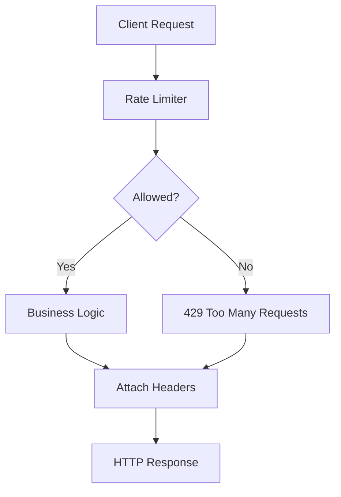
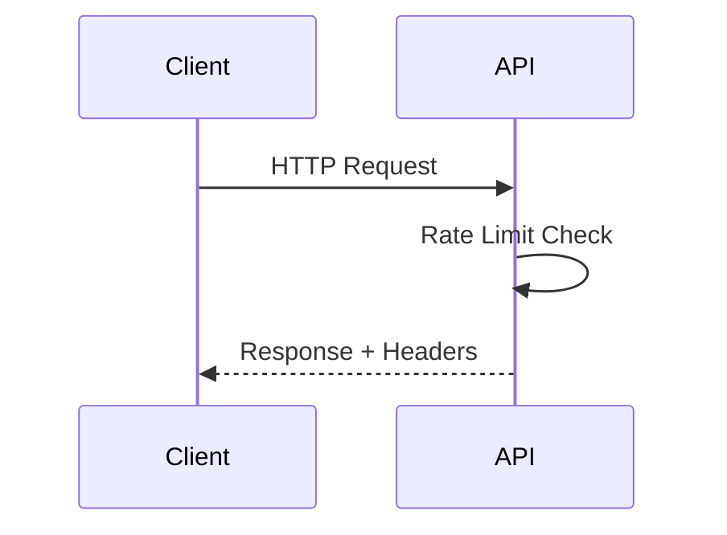
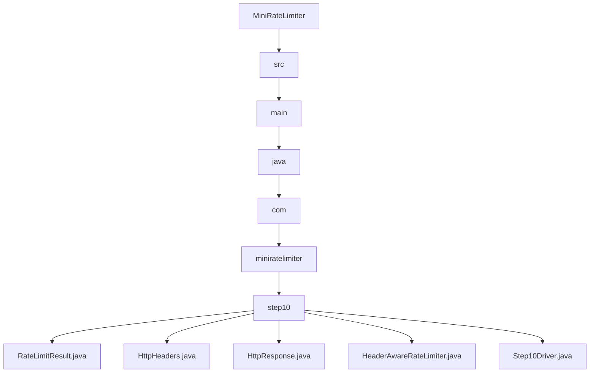

# 010_HTTP_Rate_Limit_Headers

# MiniRateLimiter Step 10 — HTTP Rate Limit Headers

---

# Clickable Index

1. [Goal](#goal)  
2. [Why HTTP Headers?](#why-http-headers)  
3. [Real World Example](#real-world-example)  
4. [Core Idea](#core-idea)  
5. [HTTP Flow Mermaid Diagram](#http-flow-mermaid-diagram)  
6. [Header Response Mermaid Diagram](#header-response-mermaid-diagram)  
7. [Detailed Steps Before Code](#detailed-steps-before-code)  
8. [CP/DSA Concepts Used](#cpdsa-concepts-used)  
9. [Time Complexity](#time-complexity)  
10. [Space Complexity](#space-complexity)  
11. [Common HTTP Headers](#common-http-headers)  
12. [Folder Structure](#folder-structure)  
13. [Folder Mermaid Diagram](#folder-mermaid-diagram)  
14. [Complete Java Code](#complete-java-code)  
15. [CP/DSA Pattern Code](#cpdsa-pattern-code)  
16. [Dry Run](#dry-run)  
17. [Run Command](#run-command)  
18. [Expected Output Pattern](#expected-output-pattern)  
19. [Important Observation](#important-observation)  
20. [Current MiniRateLimiter State](#current-miniratelimiter-state)  
21. [Step 10 Completion Checklist](#step-10-completion-checklist)  
22. [Final Mental Model](#final-mental-model)  
23. [Next Step](#next-step)  

---

# Goal

Until now our limiter only returned:

```text
allow / reject
```

Real APIs also return metadata headers.

Examples:

```text
X-RateLimit-Limit
X-RateLimit-Remaining
Retry-After
```

These help clients understand:

```text
remaining quota
retry timing
current limits
```

Now we build:

```text
HTTP Rate Limit Headers
```

---

# Why HTTP Headers?

Without headers:

```text
client does not know:
- remaining quota
- retry wait time
- configured limit
```

With headers:

```text
client can self-throttle intelligently
```

---

# Real World Example

Real systems:

```text
GitHub API
Twitter API
Stripe API
AWS APIs
Cloudflare
```

return headers like:

```http
X-RateLimit-Limit: 100
X-RateLimit-Remaining: 24
Retry-After: 60
```

---

# Core Idea

Limiter result becomes:

```text
allow/reject + metadata
```

Metadata converted into:

```text
HTTP response headers
```

---

# HTTP Flow Mermaid Diagram



---

# Header Response Mermaid Diagram



---

# Detailed Steps Before Code

## Step 1 — Extend limiter result

Store:

```text
limit
remaining
retryAfter
```

---

## Step 2 — Create HTTP headers object

Represent:

```text
headerName -> value
```

---

## Step 3 — Build standard headers

Example:

```text
X-RateLimit-Limit
X-RateLimit-Remaining
Retry-After
```

---

## Step 4 — Return 429 on reject

HTTP standard:

```text
429 Too Many Requests
```

---

## Step 5 — Attach headers to response

Client receives metadata.

---

# CP/DSA Concepts Used

## 1. Key Value Mapping

Headers internally are:

```java
Map<String, String>
```

---

## 2. Metadata Propagation

System propagates state through response metadata.

---

## 3. Encapsulation

Rate limit details wrapped into reusable response object.

---

## 4. Immutable Response Object

Response metadata should not change after creation.

---

## 5. O(1) Header Lookup

Headers map supports constant-time access.

---

# Time Complexity

```text
O(1)
```

---

# Space Complexity

```text
O(number of headers)
```

---

# Common HTTP Headers

| Header | Meaning |
|---|---|
| X-RateLimit-Limit | Maximum allowed requests |
| X-RateLimit-Remaining | Remaining quota |
| Retry-After | Seconds until retry |
| X-RateLimit-Reset | Window reset timestamp |

---

# Folder Structure

```text
MiniRateLimiter/
└── src/main/java/com/miniratelimiter/step10/
    ├── RateLimitResult.java
    ├── HttpHeaders.java
    ├── HttpResponse.java
    ├── HeaderAwareRateLimiter.java
    └── Step10Driver.java
```

---

# Folder Mermaid Diagram



---

# Complete Java Code

---

# RateLimitResult.java

```java
package com.miniratelimiter.step10;

/*
 * Logic:
 *
 * 1. Store rate limit decision.
 * 2. Store limit metadata.
 * 3. Store retry-after timing.
 *
 * Time Complexity:
 * O(1)
 */
public class RateLimitResult {

    private final boolean allowed;

    private final int limit;

    private final int remaining;

    private final long retryAfterSeconds;

    public RateLimitResult(
            boolean allowed,
            int limit,
            int remaining,
            long retryAfterSeconds
    ) {

        this.allowed = allowed;
        this.limit = limit;
        this.remaining = remaining;
        this.retryAfterSeconds = retryAfterSeconds;
    }

    public boolean isAllowed() {
        return allowed;
    }

    public int getLimit() {
        return limit;
    }

    public int getRemaining() {
        return remaining;
    }

    public long getRetryAfterSeconds() {
        return retryAfterSeconds;
    }
}
```

---

# HttpHeaders.java

```java
package com.miniratelimiter.step10;

import java.util.HashMap;
import java.util.Map;

/*
 * Logic:
 *
 * 1. Store HTTP headers.
 * 2. Support add/get operations.
 * 3. Represent response metadata.
 *
 * Time Complexity:
 * O(1)
 */
public class HttpHeaders {

    private final Map<String, String> headers;

    public HttpHeaders() {
        this.headers = new HashMap<>();
    }

    public void addHeader(
            String name,
            String value
    ) {

        headers.put(name, value);
    }

    public String getHeader(String name) {
        return headers.get(name);
    }

    public Map<String, String> snapshot() {
        return new HashMap<>(headers);
    }

    @Override
    public String toString() {
        return headers.toString();
    }
}
```

---

# HttpResponse.java

```java
package com.miniratelimiter.step10;

/*
 * Logic:
 *
 * 1. Represent HTTP response.
 * 2. Store status code.
 * 3. Store response body.
 * 4. Store response headers.
 *
 * Time Complexity:
 * O(1)
 */
public class HttpResponse {

    private final int statusCode;

    private final String body;

    private final HttpHeaders headers;

    public HttpResponse(
            int statusCode,
            String body,
            HttpHeaders headers
    ) {

        this.statusCode = statusCode;
        this.body = body;
        this.headers = headers;
    }

    public int getStatusCode() {
        return statusCode;
    }

    public String getBody() {
        return body;
    }

    public HttpHeaders getHeaders() {
        return headers;
    }

    @Override
    public String toString() {
        return "HttpResponse{" +
                "statusCode=" + statusCode +
                ", body='" + body + '\'' +
                ", headers=" + headers +
                '}';
    }
}
```

---

# HeaderAwareRateLimiter.java

```java
package com.miniratelimiter.step10;

/*
 * Logic:
 *
 * 1. Simulate simple fixed-window limiter.
 * 2. Build standard HTTP rate-limit headers.
 * 3. Return HTTP-style response object.
 * 4. Return 429 when limit exceeded.
 *
 * Time Complexity:
 * O(1)
 */
public class HeaderAwareRateLimiter {

    private final int limit;

    private int currentCount;

    public HeaderAwareRateLimiter(int limit) {

        if (limit <= 0) {
            throw new IllegalArgumentException("Limit should be positive");
        }

        this.limit = limit;
        this.currentCount = 0;
    }

    public HttpResponse handleRequest() {

        currentCount++;

        boolean allowed = currentCount <= limit;

        int remaining =
                Math.max(0, limit - currentCount);

        long retryAfter =
                allowed ? 0 : 60;

        RateLimitResult result =
                new RateLimitResult(
                        allowed,
                        limit,
                        remaining,
                        retryAfter
                );

        HttpHeaders headers =
                buildHeaders(result);

        if (!allowed) {

            return new HttpResponse(
                    429,
                    "Too Many Requests",
                    headers
            );
        }

        return new HttpResponse(
                200,
                "Success",
                headers
        );
    }

    private HttpHeaders buildHeaders(
            RateLimitResult result
    ) {

        HttpHeaders headers =
                new HttpHeaders();

        headers.addHeader(
                "X-RateLimit-Limit",
                String.valueOf(result.getLimit())
        );

        headers.addHeader(
                "X-RateLimit-Remaining",
                String.valueOf(result.getRemaining())
        );

        headers.addHeader(
                "Retry-After",
                String.valueOf(result.getRetryAfterSeconds())
        );

        return headers;
    }
}
```

---

# Step10Driver.java

```java
package com.miniratelimiter.step10;

/*
 * Logic:
 *
 * 1. Create header-aware limiter.
 * 2. Send multiple requests.
 * 3. Observe HTTP headers.
 * 4. Observe 429 responses.
 */
public class Step10Driver {

    public static void main(String[] args) {

        HeaderAwareRateLimiter limiter =
                new HeaderAwareRateLimiter(5);

        for (int i = 1; i <= 7; i++) {

            HttpResponse response =
                    limiter.handleRequest();

            System.out.println();
            System.out.println(
                    "request=" + i
            );

            System.out.println(
                    "status=" +
                    response.getStatusCode()
            );

            System.out.println(
                    "body=" +
                    response.getBody()
            );

            System.out.println(
                    "headers=" +
                    response.getHeaders()
            );
        }
    }
}
```

---

# CP/DSA Pattern Code

## Problem

Store metadata using key-value map.

---

## DSA/CP Java Code

```java
import java.util.HashMap;
import java.util.Map;

public class HeaderMapCP {

    public static void main(String[] args) {

        Map<String, String> headers =
                new HashMap<>();

        headers.put(
                "X-RateLimit-Limit",
                "100"
        );

        headers.put(
                "Retry-After",
                "60"
        );

        System.out.println(headers);
    }
}
```

---

# Dry Run

Configuration:

```text
limit = 5
```

Requests:

```text
1 -> remaining 4
2 -> remaining 3
3 -> remaining 2
4 -> remaining 1
5 -> remaining 0
6 -> rejected
7 -> rejected
```

Rejected responses:

```http
HTTP 429
Retry-After: 60
```

---

# Run Command

```bash
javac -d out src/main/java/com/miniratelimiter/step10/*.java

java -cp out com.miniratelimiter.step10.Step10Driver
```

---

# Expected Output Pattern

```text
request=1
status=200
headers={
 X-RateLimit-Limit=5,
 X-RateLimit-Remaining=4,
 Retry-After=0
}

request=6
status=429
headers={
 Retry-After=60
}
```

---

# Important Observation

Rate limiting is not only:

```text
allow/reject
```

Production systems also communicate:

```text
remaining quota
retry timing
window information
```

through HTTP headers.

---

# Current MiniRateLimiter State

```text
Supported:
[yes] fixed window counter
[yes] sliding window log
[yes] sliding window counter
[yes] token bucket
[yes] leaky bucket
[yes] thread-safe limiter
[yes] Redis distributed limiter
[yes] Redis Lua atomic limiter
[yes] policy model
[yes] HTTP rate-limit headers

Not yet:
[no] Spring Boot middleware
[no] API gateway integration
[no] metrics dashboard
[no] production deployment
```

---

# Step 10 Completion Checklist

```text
[ ] You understand HTTP rate-limit headers
[ ] You understand Retry-After
[ ] You understand HTTP 429
[ ] You understand metadata propagation
[ ] You understand response encapsulation
[ ] You understand API client communication
```

---

# Final Mental Model

```text
HTTP Rate Limiting =
allow/reject + metadata headers
```

---

# Next Step

Next we build:

```text
011_Spring_Boot_Filter_Integration
```

We will integrate limiter into:

```text
real HTTP request pipeline
```
