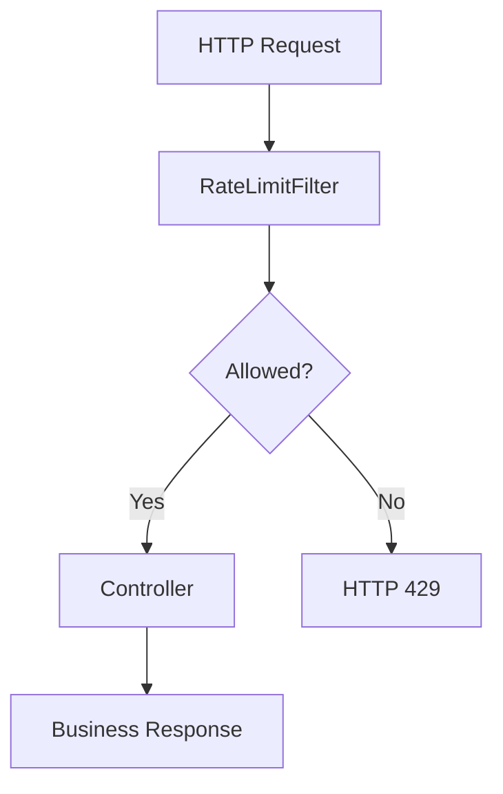
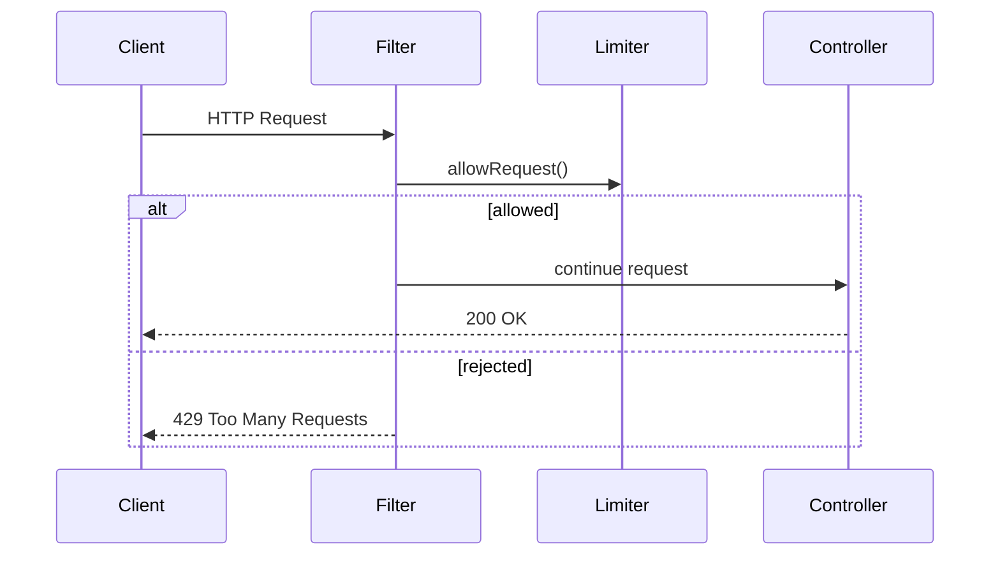
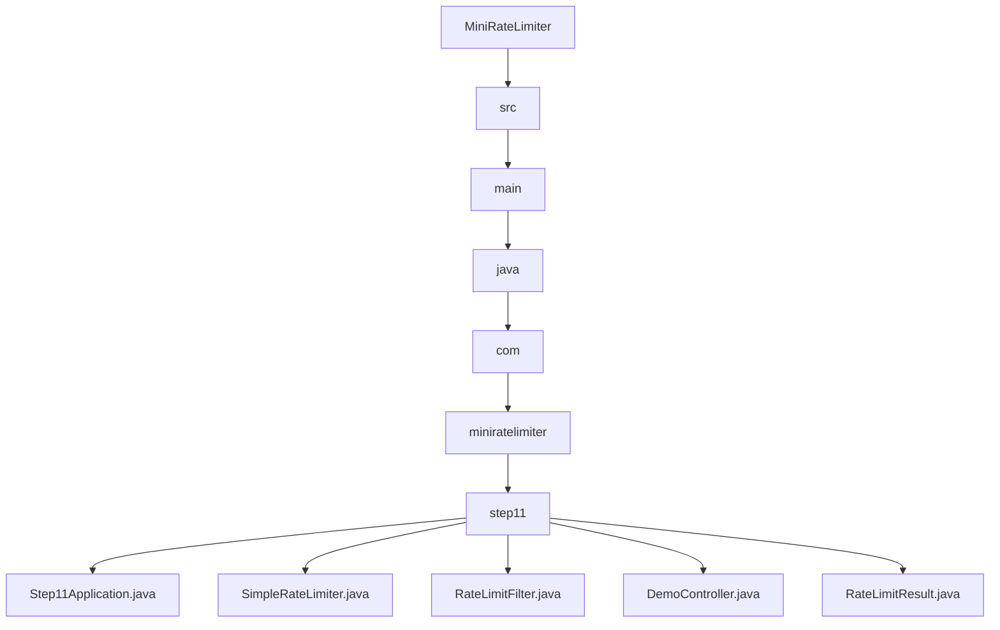

# 011_Spring_Boot_Filter_Integration

# MiniRateLimiter Step 11 — Spring Boot Filter Integration

---

# Clickable Index

1. [Goal](#goal)  
2. [Why Spring Filter Integration?](#why-spring-filter-integration)  
3. [What Is A Servlet Filter?](#what-is-a-servlet-filter)  
4. [Real World Example](#real-world-example)  
5. [Core Idea](#core-idea)  
6. [Request Flow Mermaid Diagram](#request-flow-mermaid-diagram)  
7. [Filter Execution Mermaid Diagram](#filter-execution-mermaid-diagram)  
8. [Detailed Steps Before Code](#detailed-steps-before-code)  
9. [CP/DSA Concepts Used](#cpdsa-concepts-used)  
10. [Time Complexity](#time-complexity)  
11. [Space Complexity](#space-complexity)  
12. [Why Filters Are Powerful](#why-filters-are-powerful)  
13. [Folder Structure](#folder-structure)  
14. [Folder Mermaid Diagram](#folder-mermaid-diagram)  
15. [Complete Java Code](#complete-java-code)  
16. [CP/DSA Pattern Code](#cpdsa-pattern-code)  
17. [Dry Run](#dry-run)  
18. [Run Command](#run-command)  
19. [Expected Output Pattern](#expected-output-pattern)  
20. [Important Observation](#important-observation)  
21. [Current MiniRateLimiter State](#current-miniratelimiter-state)  
22. [Step 11 Completion Checklist](#step-11-completion-checklist)  
23. [Final Mental Model](#final-mental-model)  
24. [Next Step](#next-step)  

---

# Goal

Until now our limiter was:

```text
standalone Java logic
```

Now we integrate it into:

```text
real HTTP request pipeline
```

using:

```text
Spring Boot Servlet Filter
```

This is how real APIs apply:

```text
authentication
logging
rate limiting
security
```

before request reaches controller.

---

# Why Spring Filter Integration?

Without filter:

```text
every controller manually calls limiter
```

Bad:

```text
duplicate code
hard maintenance
easy to forget
```

With filter:

```text
all requests pass through one centralized middleware
```

---

# What Is A Servlet Filter?

Servlet filter intercepts requests:

```text
before controller
after controller
```

Example:

```text
Client Request
    ->
Filter
    ->
Controller
```

Filter can:

```text
allow request
block request
modify headers
log request
```

---

# Real World Example

Real production systems use filters for:

```text
JWT authentication
API logging
CORS
compression
rate limiting
security
```

Spring Boot internally uses many filters.

---

# Core Idea

Flow:

```text
incoming HTTP request
    ->
RateLimitFilter
    ->
RateLimiter check
    ->
allow or reject
```

Rejected requests return:

```http
429 Too Many Requests
```

before reaching controller.

---

# Request Flow Mermaid Diagram



---

# Filter Execution Mermaid Diagram



---

# Detailed Steps Before Code

## Step 1 — Create Spring Boot app

Add:

```text
@SpringBootApplication
```

---

## Step 2 — Create rate limiter service

Central limiter logic.

---

## Step 3 — Create servlet filter

Implement:

```java
javax.servlet.Filter
```

or:

```java
OncePerRequestFilter
```

---

## Step 4 — Intercept every request

Filter executes before controller.

---

## Step 5 — Reject over-limit requests

Return:

```http
429 Too Many Requests
```

---

## Step 6 — Add headers

Attach:

```text
X-RateLimit-Limit
X-RateLimit-Remaining
Retry-After
```

---

# CP/DSA Concepts Used

## 1. Middleware Pipeline

Request flows through chain of handlers.

---

## 2. Interceptor Pattern

Filter intercepts request before execution.

---

## 3. Centralized Validation

Single place handles all requests.

---

## 4. HashMap Request Tracking

Limiter internally still uses:

```java
Map<String, Integer>
```

---

## 5. Early Exit Optimization

Rejected requests stop pipeline early.

---

# Time Complexity

```text
O(1) limiter lookup
```

per request.

---

# Space Complexity

```text
O(active users)
```

---

# Why Filters Are Powerful

Without filters:

```text
duplicate logic in every API
```

With filters:

```text
centralized cross-cutting concerns
```

Examples:

```text
authentication
logging
security
rate limiting
```

---

# Folder Structure

```text
MiniRateLimiter/
└── src/main/java/com/miniratelimiter/step11/
    ├── Step11Application.java
    ├── SimpleRateLimiter.java
    ├── RateLimitFilter.java
    ├── DemoController.java
    └── RateLimitResult.java
```

---

# Folder Mermaid Diagram



---

# Complete Java Code

---

# Step11Application.java

```java
package com.miniratelimiter.step11;

import org.springframework.boot.SpringApplication;
import org.springframework.boot.autoconfigure.SpringBootApplication;

/*
 * Logic:
 *
 * 1. Start Spring Boot application.
 * 2. Enable embedded Tomcat server.
 * 3. Register Spring components automatically.
 */
@SpringBootApplication
public class Step11Application {

    public static void main(String[] args) {

        SpringApplication.run(
                Step11Application.class,
                args
        );
    }
}
```

---

# RateLimitResult.java

```java
package com.miniratelimiter.step11;

/*
 * Logic:
 *
 * 1. Store allow/reject decision.
 * 2. Store remaining requests.
 * 3. Store retry-after metadata.
 *
 * Time Complexity:
 * O(1)
 */
public class RateLimitResult {

    private final boolean allowed;

    private final int remaining;

    private final long retryAfterSeconds;

    public RateLimitResult(
            boolean allowed,
            int remaining,
            long retryAfterSeconds
    ) {

        this.allowed = allowed;
        this.remaining = remaining;
        this.retryAfterSeconds = retryAfterSeconds;
    }

    public boolean isAllowed() {
        return allowed;
    }

    public int getRemaining() {
        return remaining;
    }

    public long getRetryAfterSeconds() {
        return retryAfterSeconds;
    }
}
```

---

# SimpleRateLimiter.java

```java
package com.miniratelimiter.step11;

import org.springframework.stereotype.Component;

import java.util.HashMap;
import java.util.Map;

/*
 * Logic:
 *
 * 1. Track request counts per IP.
 * 2. Apply simple fixed-window limit.
 * 3. Return allow/reject metadata.
 *
 * NOTE:
 *
 * Real systems use Redis/distributed limiters.
 *
 * Time Complexity:
 * O(1)
 */
@Component
public class SimpleRateLimiter {

    // IP -> request count
    private final Map<String, Integer> counters;

    // Fixed request limit
    private final int limit;

    public SimpleRateLimiter() {
        this.counters = new HashMap<>();
        this.limit = 5;
    }

    public synchronized RateLimitResult allowRequest(
            String clientIp
    ) {

        int currentCount =
                counters.getOrDefault(clientIp, 0);

        currentCount++;

        counters.put(clientIp, currentCount);

        boolean allowed =
                currentCount <= limit;

        int remaining =
                Math.max(0, limit - currentCount);

        long retryAfter =
                allowed ? 0 : 60;

        return new RateLimitResult(
                allowed,
                remaining,
                retryAfter
        );
    }
}
```

---

# RateLimitFilter.java

```java
package com.miniratelimiter.step11;

import jakarta.servlet.FilterChain;
import jakarta.servlet.ServletException;
import jakarta.servlet.http.HttpServletRequest;
import jakarta.servlet.http.HttpServletResponse;

import org.springframework.stereotype.Component;
import org.springframework.web.filter.OncePerRequestFilter;

import java.io.IOException;

/*
 * Logic:
 *
 * 1. Intercept every HTTP request.
 * 2. Extract client IP.
 * 3. Call rate limiter.
 * 4. Add HTTP rate-limit headers.
 * 5. Reject request if limit exceeded.
 * 6. Otherwise continue filter chain.
 *
 * Time Complexity:
 * O(1)
 */
@Component
public class RateLimitFilter extends OncePerRequestFilter {

    private final SimpleRateLimiter rateLimiter;

    public RateLimitFilter(
            SimpleRateLimiter rateLimiter
    ) {

        this.rateLimiter = rateLimiter;
    }

    @Override
    protected void doFilterInternal(
            HttpServletRequest request,
            HttpServletResponse response,
            FilterChain filterChain
    ) throws ServletException, IOException {

        String clientIp =
                request.getRemoteAddr();

        RateLimitResult result =
                rateLimiter.allowRequest(clientIp);

        response.setHeader(
                "X-RateLimit-Remaining",
                String.valueOf(result.getRemaining())
        );

        response.setHeader(
                "Retry-After",
                String.valueOf(result.getRetryAfterSeconds())
        );

        if (!result.isAllowed()) {

            response.setStatus(429);

            response.getWriter().write(
                    "Too Many Requests"
            );

            return;
        }

        filterChain.doFilter(
                request,
                response
        );
    }
}
```

---

# DemoController.java

```java
package com.miniratelimiter.step11;

import org.springframework.web.bind.annotation.GetMapping;
import org.springframework.web.bind.annotation.RestController;

/*
 * Logic:
 *
 * 1. Simple test API endpoint.
 * 2. Requests reach here only if filter allows.
 */
@RestController
public class DemoController {

    @GetMapping("/hello")
    public String hello() {

        return "Hello from controller";
    }
}
```

---

# CP/DSA Pattern Code

## Problem

Process requests through middleware pipeline.

---

## DSA/CP Java Code

```java
public class MiddlewarePipelineCP {

    public static void main(String[] args) {

        boolean authenticated = true;
        boolean rateLimited = false;

        if (!authenticated) {

            System.out.println("Reject request");

            return;
        }

        if (rateLimited) {

            System.out.println("429 Too Many Requests");

            return;
        }

        System.out.println("Execute business logic");
    }
}
```

---

# Dry Run

Request:

```http
GET /hello
```

Flow:

```text
Request
    ->
RateLimitFilter
    ->
SimpleRateLimiter
    ->
Controller
```

First 5 requests:

```text
allowed
```

Next requests:

```http
HTTP 429
Too Many Requests
```

---

# Run Command

## Maven Run

```bash
mvn spring-boot:run
```

---

# Test API

```bash
curl http://localhost:8080/hello
```

---

# Expected Output Pattern

```http
HTTP/1.1 200 OK

X-RateLimit-Remaining: 4
Retry-After: 0
```

After limit exceeded:

```http
HTTP/1.1 429 Too Many Requests

Retry-After: 60
```

---

# Important Observation

This is the first step where limiter becomes:

```text
real HTTP middleware
```

This is exactly how:

```text
Spring Cloud Gateway
Kong
Nginx
API gateways
```

intercept requests.

---

# Current MiniRateLimiter State

```text
Supported:
[yes] fixed window counter
[yes] sliding window log
[yes] sliding window counter
[yes] token bucket
[yes] leaky bucket
[yes] thread-safe limiter
[yes] Redis distributed limiter
[yes] Redis Lua atomic limiter
[yes] policy model
[yes] HTTP headers
[yes] Spring Boot filter integration

Not yet:
[no] API gateway integration
[no] metrics dashboard
[no] distributed tracing
[no] production deployment
```

---

# Step 11 Completion Checklist

```text
[ ] You understand servlet filters
[ ] You understand middleware pipeline
[ ] You understand request interception
[ ] You understand HTTP 429 flow
[ ] You understand centralized rate limiting
[ ] You understand Spring Boot filter integration
```

---

# Final Mental Model

```text
Spring Filter =
middleware layer before controller
```

```text
all requests pass through centralized limiter
```

---

# Next Step

Next we build:

```text
012_API_Gateway_Rate_Limiter
```

We will move limiter to:

```text
gateway layer
```

to protect all downstream services centrally.
