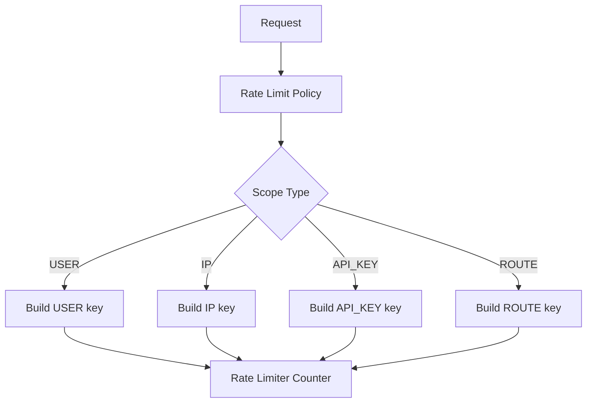
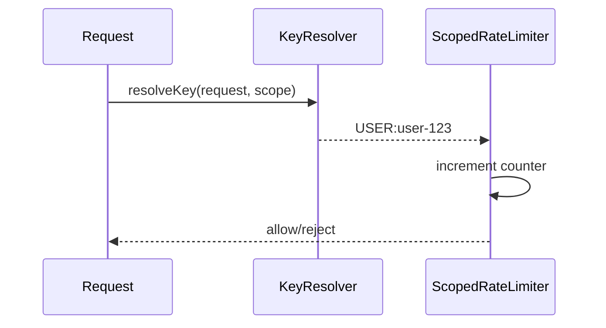
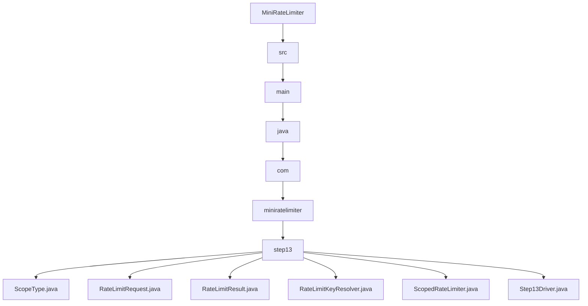

# 013_Per_User_And_Per_IP_Limits

# MiniRateLimiter Step 13 — Per User And Per IP Limits

---

# Clickable Index

1. [Goal](#goal)  
2. [Why Multiple Limit Scopes?](#why-multiple-limit-scopes)  
3. [Real World Example](#real-world-example)  
4. [Core Idea](#core-idea)  
5. [Scope Architecture Mermaid Diagram](#scope-architecture-mermaid-diagram)  
6. [Request Key Flow Mermaid Diagram](#request-key-flow-mermaid-diagram)  
7. [Detailed Steps Before Code](#detailed-steps-before-code)  
8. [CP/DSA Concepts Used](#cpdsa-concepts-used)  
9. [Time Complexity](#time-complexity)  
10. [Space Complexity](#space-complexity)  
11. [User Limit vs IP Limit](#user-limit-vs-ip-limit)  
12. [Folder Structure](#folder-structure)  
13. [Folder Mermaid Diagram](#folder-mermaid-diagram)  
14. [Complete Java Code](#complete-java-code)  
15. [CP/DSA Pattern Code](#cpdsa-pattern-code)  
16. [Dry Run](#dry-run)  
17. [Run Command](#run-command)  
18. [Expected Output Pattern](#expected-output-pattern)  
19. [Important Observation](#important-observation)  
20. [Current MiniRateLimiter State](#current-miniratelimiter-state)  
21. [Step 13 Completion Checklist](#step-13-completion-checklist)  
22. [Final Mental Model](#final-mental-model)  
23. [Next Step](#next-step)  

---

# Goal

In Step 12, we built gateway-level rate limiting.

Now we support different rate limit scopes:

```text
per user
per IP
per API key
per route
```

In this step we implement:

```text
Per User And Per IP Limits
```

This is very common in real API gateways.

---

# Why Multiple Limit Scopes?

Different users need different identities.

Authenticated request:

```text
limit by userId
```

Anonymous request:

```text
limit by IP address
```

API client request:

```text
limit by apiKey
```

Route-specific abuse:

```text
limit by route
```

---

# Real World Example

Login API:

```text
per IP limit
```

because attacker may not be logged in.

Payment API:

```text
per user limit
```

because authenticated user identity exists.

Public API:

```text
per API key limit
```

because third-party clients use API keys.

---

# Core Idea

Create a key resolver.

Input:

```text
request
policy scope
```

Output:

```text
rate limit key
```

Examples:

```text
USER:user-123
IP:192.168.1.10
ROUTE:/login
API_KEY:key-abc
```

---

# Scope Architecture Mermaid Diagram



---

# Request Key Flow Mermaid Diagram



---

# Detailed Steps Before Code

## Step 1 — Create request model

Request stores:

```text
userId
clientIp
apiKey
route
```

---

## Step 2 — Create scope enum

Supported scopes:

```text
USER
IP
API_KEY
ROUTE
```

---

## Step 3 — Create key resolver

Key resolver converts request + scope into limiter key.

---

## Step 4 — Create scoped limiter

Scoped limiter uses key resolver before counting.

---

## Step 5 — Test user and IP limits

Same request can be limited differently depending on scope.

---

# CP/DSA Concepts Used

## 1. Composite Key

```text
scope + identity
```

Example:

```text
USER:user-123
```

---

## 2. HashMap Frequency Counter

```java
Map<String, Integer>
```

counts requests per resolved key.

---

## 3. Strategy / Dispatch

Scope enum decides which identity field to use.

---

## 4. Identity Modeling

Correct key design is crucial in distributed systems.

---

## 5. O(1) Lookup

Resolve key and update counter in constant time.

---

# Time Complexity

```text
O(1) per request
```

---

# Space Complexity

```text
O(active identities)
```

---

# User Limit vs IP Limit

| Scope | Best For | Weakness |
|---|---|---|
| USER | Authenticated users | Not useful before login |
| IP | Anonymous traffic | NAT/proxy can share IP |
| API_KEY | Third-party clients | Key leakage risk |
| ROUTE | Endpoint protection | Not user-specific |

---

# Folder Structure

```text
MiniRateLimiter/
└── src/main/java/com/miniratelimiter/step13/
    ├── ScopeType.java
    ├── RateLimitRequest.java
    ├── RateLimitResult.java
    ├── RateLimitKeyResolver.java
    ├── ScopedRateLimiter.java
    └── Step13Driver.java
```

---

# Folder Mermaid Diagram



---

# Complete Java Code

---

# ScopeType.java

```java
package com.miniratelimiter.step13;

/*
 * Logic:
 *
 * 1. Defines available rate limit scopes.
 * 2. Scope decides which request field becomes limiter key.
 */
public enum ScopeType {

    USER,

    IP,

    API_KEY,

    ROUTE
}
```

---

# RateLimitRequest.java

```java
package com.miniratelimiter.step13;

/*
 * Logic:
 *
 * 1. Represents incoming request metadata.
 * 2. Stores identities used for scoped limiting.
 *
 * Time Complexity:
 * O(1)
 */
public class RateLimitRequest {

    private final String userId;
    private final String clientIp;
    private final String apiKey;
    private final String route;

    public RateLimitRequest(String userId, String clientIp, String apiKey, String route) {
        this.userId = userId;
        this.clientIp = clientIp;
        this.apiKey = apiKey;
        this.route = route;
    }

    public String getUserId() {
        return userId;
    }

    public String getClientIp() {
        return clientIp;
    }

    public String getApiKey() {
        return apiKey;
    }

    public String getRoute() {
        return route;
    }
}
```

---

# RateLimitResult.java

```java
package com.miniratelimiter.step13;

/*
 * Logic:
 *
 * 1. Stores allow/reject decision.
 * 2. Stores generated limiter key.
 * 3. Stores current count and limit.
 *
 * Time Complexity:
 * O(1)
 */
public class RateLimitResult {

    private final boolean allowed;
    private final String key;
    private final int currentCount;
    private final int limit;

    public RateLimitResult(boolean allowed, String key, int currentCount, int limit) {
        this.allowed = allowed;
        this.key = key;
        this.currentCount = currentCount;
        this.limit = limit;
    }

    public boolean isAllowed() {
        return allowed;
    }

    public String getKey() {
        return key;
    }

    public int getCurrentCount() {
        return currentCount;
    }

    public int getLimit() {
        return limit;
    }

    @Override
    public String toString() {
        return "RateLimitResult{" +
                "allowed=" + allowed +
                ", key='" + key + '\'' +
                ", currentCount=" + currentCount +
                ", limit=" + limit +
                '}';
    }
}
```

---

# RateLimitKeyResolver.java

```java
package com.miniratelimiter.step13;

/*
 * Logic:
 *
 * 1. Resolve request identity based on scope.
 * 2. Build stable composite limiter key.
 * 3. Keep key design centralized.
 *
 * Time Complexity:
 * O(1)
 */
public class RateLimitKeyResolver {

    public String resolveKey(RateLimitRequest request, ScopeType scopeType) {
        switch (scopeType) {

            case USER:
                return "USER:" + request.getUserId();

            case IP:
                return "IP:" + request.getClientIp();

            case API_KEY:
                return "API_KEY:" + request.getApiKey();

            case ROUTE:
                return "ROUTE:" + request.getRoute();

            default:
                throw new IllegalArgumentException("Unsupported scope=" + scopeType);
        }
    }
}
```

---

# ScopedRateLimiter.java

```java
package com.miniratelimiter.step13;

import java.util.HashMap;
import java.util.Map;

/*
 * Logic:
 *
 * 1. Resolve limiter key using scope.
 * 2. Increment count for resolved key.
 * 3. Compare count with limit.
 * 4. Return scoped rate limit result.
 *
 * Time Complexity:
 * O(1)
 *
 * Space Complexity:
 * O(active identities)
 */
public class ScopedRateLimiter {

    private final int limit;
    private final ScopeType scopeType;
    private final RateLimitKeyResolver keyResolver;
    private final Map<String, Integer> counters;

    public ScopedRateLimiter(int limit, ScopeType scopeType) {
        if (limit <= 0) {
            throw new IllegalArgumentException("Limit should be positive");
        }

        this.limit = limit;
        this.scopeType = scopeType;
        this.keyResolver = new RateLimitKeyResolver();
        this.counters = new HashMap<>();
    }

    public RateLimitResult allowRequest(RateLimitRequest request) {
        String key = keyResolver.resolveKey(request, scopeType);

        int count = counters.getOrDefault(key, 0) + 1;

        counters.put(key, count);

        boolean allowed = count <= limit;

        return new RateLimitResult(allowed, key, count, limit);
    }

    public Map<String, Integer> getCountersSnapshot() {
        return new HashMap<>(counters);
    }
}
```

---

# Step13Driver.java

```java
package com.miniratelimiter.step13;

/*
 * Logic:
 *
 * 1. Create same request metadata.
 * 2. Apply USER scoped limiter.
 * 3. Apply IP scoped limiter.
 * 4. Observe different limiter keys.
 */
public class Step13Driver {

    public static void main(String[] args) {
        ScopedRateLimiter userLimiter = new ScopedRateLimiter(3, ScopeType.USER);
        ScopedRateLimiter ipLimiter = new ScopedRateLimiter(5, ScopeType.IP);

        RateLimitRequest request = new RateLimitRequest(
                "user-123",
                "192.168.1.10",
                "api-key-abc",
                "/payments"
        );

        System.out.println("---- USER LIMIT ----");

        for (int i = 1; i <= 5; i++) {
            RateLimitResult result = userLimiter.allowRequest(request);

            System.out.println("request=" + i + ", result=" + result);
        }

        System.out.println();
        System.out.println("---- IP LIMIT ----");

        for (int i = 1; i <= 7; i++) {
            RateLimitResult result = ipLimiter.allowRequest(request);

            System.out.println("request=" + i + ", result=" + result);
        }

        System.out.println();
        System.out.println("---- SNAPSHOTS ----");
        System.out.println("userLimiter=" + userLimiter.getCountersSnapshot());
        System.out.println("ipLimiter=" + ipLimiter.getCountersSnapshot());
    }
}
```

---

# CP/DSA Pattern Code

## Problem

Build frequency counter with different key types.

---

## DSA/CP Java Code

```java
import java.util.HashMap;
import java.util.Map;

public class ScopedCounterCP {

    public static void main(String[] args) {
        Map<String, Integer> freq = new HashMap<>();

        String userKey = "USER:user-123";
        String ipKey = "IP:192.168.1.10";

        freq.put(userKey, freq.getOrDefault(userKey, 0) + 1);
        freq.put(ipKey, freq.getOrDefault(ipKey, 0) + 1);

        System.out.println(freq);
    }
}
```

---

# Dry Run

USER scoped limiter:

```text
limit = 3
key = USER:user-123
```

Requests:

```text
1 allow
2 allow
3 allow
4 reject
5 reject
```

IP scoped limiter:

```text
limit = 5
key = IP:192.168.1.10
```

Requests:

```text
1..5 allow
6 reject
7 reject
```

Same request metadata, different scope, different key.

---

# Run Command

```bash
javac -d out src/main/java/com/miniratelimiter/step13/*.java

java -cp out com.miniratelimiter.step13.Step13Driver
```

---

# Expected Output Pattern

```text
---- USER LIMIT ----
request=1, result=RateLimitResult{allowed=true, key='USER:user-123', currentCount=1, limit=3}
...
request=4, result=RateLimitResult{allowed=false, key='USER:user-123', currentCount=4, limit=3}

---- IP LIMIT ----
request=1, result=RateLimitResult{allowed=true, key='IP:192.168.1.10', currentCount=1, limit=5}
...
request=6, result=RateLimitResult{allowed=false, key='IP:192.168.1.10', currentCount=6, limit=5}
```

---

# Important Observation

Rate limiter correctness depends heavily on:

```text
key design
```

Bad key design causes:

```text
wrong users throttled
attackers bypass limits
shared IP unfairness
```

---

# Current MiniRateLimiter State

```text
Supported:
[yes] fixed window counter
[yes] sliding window log
[yes] sliding window counter
[yes] token bucket
[yes] leaky bucket
[yes] thread-safe limiter
[yes] Redis distributed limiter
[yes] Redis Lua atomic limiter
[yes] policy model
[yes] HTTP headers
[yes] Spring Boot filter
[yes] API gateway rate limiting
[yes] per-user and per-IP limits

Not yet:
[no] Redis sliding window
[no] Redis token bucket
[no] metrics dashboard
[no] production deployment
```

---

# Step 13 Completion Checklist

```text
[ ] You understand scope-based limiting
[ ] You understand user key
[ ] You understand IP key
[ ] You understand API key scope
[ ] You understand route scope
[ ] You understand why key design matters
```

---

# Final Mental Model

```text
Scope decides key.
Key decides counter.
Counter decides allow/reject.
```

---

# Next Step

Next we build:

```text
014_Redis_Sliding_Window
```

We will implement distributed sliding window using Redis sorted-set style logic.
