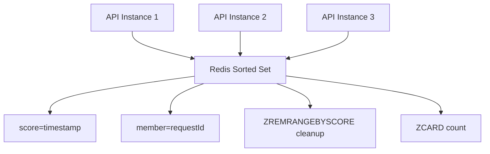
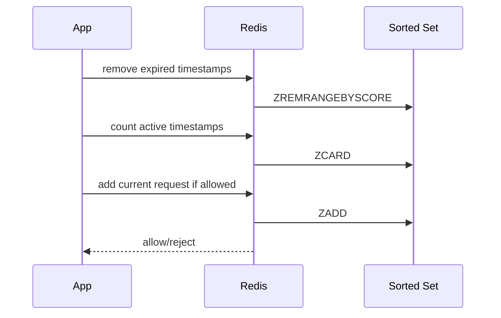
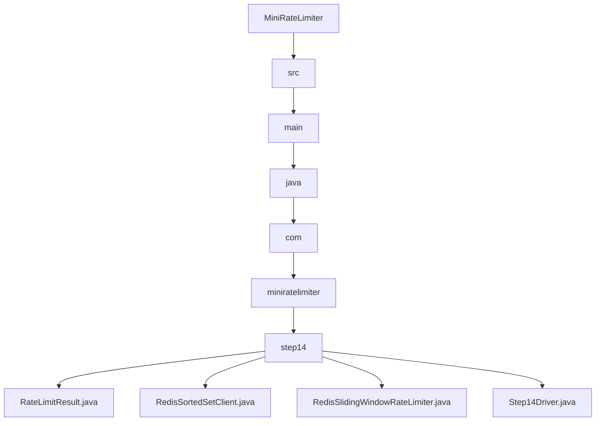

# 014_Redis_Sliding_Window

# MiniRateLimiter Step 14 — Redis Sliding Window

---

# Clickable Index

1. [Goal](#goal)  
2. [Why Redis Sliding Window?](#why-redis-sliding-window)  
3. [Problem With Fixed Window Redis](#problem-with-fixed-window-redis)  
4. [Real World Example](#real-world-example)  
5. [Core Idea](#core-idea)  
6. [Redis Sorted Set Architecture Mermaid Diagram](#redis-sorted-set-architecture-mermaid-diagram)  
7. [Request Flow Mermaid Diagram](#request-flow-mermaid-diagram)  
8. [Detailed Steps Before Code](#detailed-steps-before-code)  
9. [CP/DSA Concepts Used](#cpdsa-concepts-used)  
10. [Time Complexity](#time-complexity)  
11. [Space Complexity](#space-complexity)  
12. [Fixed Window Redis vs Redis Sliding Window](#fixed-window-redis-vs-redis-sliding-window)  
13. [Folder Structure](#folder-structure)  
14. [Folder Mermaid Diagram](#folder-mermaid-diagram)  
15. [Complete Java Code](#complete-java-code)  
16. [CP/DSA Pattern Code](#cpdsa-pattern-code)  
17. [Dry Run](#dry-run)  
18. [Run Command](#run-command)  
19. [Expected Output Pattern](#expected-output-pattern)  
20. [Important Observation](#important-observation)  
21. [Current MiniRateLimiter State](#current-miniratelimiter-state)  
22. [Step 14 Completion Checklist](#step-14-completion-checklist)  
23. [Final Mental Model](#final-mental-model)  
24. [Next Step](#next-step)  

---

# Goal

In Step 8, we built Redis Lua fixed-window limiter.

Now we build a more accurate distributed algorithm:

```text
Redis Sliding Window
```

It uses Redis sorted-set style logic.

Instead of storing one counter per window:

```text
rate_limit:user-1:window-123 -> count
```

we store request timestamps:

```text
rate_limit:user-1 -> sorted timestamps
```

This gives accurate sliding-window behavior across multiple app instances.

---

# Why Redis Sliding Window?

Fixed window has boundary burst problem.

Example:

```text
5 requests at 00:59
5 requests at 01:00
```

Allowed total:

```text
10 requests in 2 seconds
```

Redis Sliding Window avoids this by checking exact timestamps in last N seconds.

---

# Problem With Fixed Window Redis

Fixed window Redis key:

```text
rate_limit:user-1:12345 -> count
```

Problem:

```text
window changes abruptly
```

At boundary, counter resets.

So attackers can burst around boundary.

---

# Real World Example

Redis sliding window is used when accuracy matters:

```text
login protection
payment APIs
OTP APIs
password reset APIs
sensitive endpoints
```

Because it tracks exact request times.

---

# Core Idea

For each identity, store timestamps in sorted order.

Redis command idea:

```text
ZADD key score member
ZREMRANGEBYSCORE key 0 expiredTime
ZCARD key
```

Meaning:

```text
1. add current timestamp
2. remove timestamps outside window
3. count remaining timestamps
4. allow/reject
```

---

# Redis Sorted Set Architecture Mermaid Diagram



---

# Request Flow Mermaid Diagram



---

# Detailed Steps Before Code

## Step 1 — Build Redis key

```text
rate_limit:user-1
```

Unlike fixed window, key does not include window id.

---

## Step 2 — Remove expired timestamps

If current time is:

```text
70 seconds
```

and window is:

```text
60 seconds
```

remove timestamps:

```text
<= 10 seconds
```

---

## Step 3 — Count active timestamps

Remaining timestamps are requests inside sliding window.

---

## Step 4 — Compare with limit

If active count is less than limit:

```text
allow
```

else:

```text
reject
```

---

## Step 5 — Add current timestamp

When allowed:

```text
add timestamp to sorted set
```

---

# CP/DSA Concepts Used

## 1. Sliding Window

Remove old values, keep active range.

---

## 2. Ordered Set / TreeSet

Redis sorted set behaves like ordered structure.

In Java simulation:

```java
TreeSet<Long>
```

---

## 3. Range Deletion

Remove values less than threshold.

---

## 4. Cardinality Count

Count active elements.

---

## 5. Distributed Shared State

Multiple app instances share same Redis sorted set.

---

# Time Complexity

In real Redis sorted set:

```text
ZADD: O(log n)
ZREMRANGEBYSCORE: O(log n + removed)
ZCARD: O(1)
```

---

# Space Complexity

```text
O(active requests per key)
```

---

# Fixed Window Redis vs Redis Sliding Window

| Feature | Fixed Window Redis | Redis Sliding Window |
|---|---:|---:|
| Accuracy | Medium | High |
| Boundary Burst | Yes | No |
| Memory | Low | Higher |
| Redis Structure | Counter | Sorted Set |
| Sensitive APIs | Less ideal | Better |

---

# Folder Structure

```text
MiniRateLimiter/
└── src/main/java/com/miniratelimiter/step14/
    ├── RateLimitResult.java
    ├── RedisSortedSetClient.java
    ├── RedisSlidingWindowRateLimiter.java
    └── Step14Driver.java
```

---

# Folder Mermaid Diagram



---

# Complete Java Code

---

# RateLimitResult.java

```java
package com.miniratelimiter.step14;

/*
 * Logic:
 *
 * 1. Store allow/reject decision.
 * 2. Store active request count.
 * 3. Store configured limit.
 * 4. Store resolved Redis key.
 *
 * Time Complexity:
 * O(1)
 */
public class RateLimitResult {

    private final boolean allowed;
    private final String key;
    private final int activeCount;
    private final int limit;

    public RateLimitResult(boolean allowed, String key, int activeCount, int limit) {
        this.allowed = allowed;
        this.key = key;
        this.activeCount = activeCount;
        this.limit = limit;
    }

    public boolean isAllowed() {
        return allowed;
    }

    public String getKey() {
        return key;
    }

    public int getActiveCount() {
        return activeCount;
    }

    public int getLimit() {
        return limit;
    }

    @Override
    public String toString() {
        return "RateLimitResult{" +
                "allowed=" + allowed +
                ", key='" + key + '\'' +
                ", activeCount=" + activeCount +
                ", limit=" + limit +
                '}';
    }
}
```

---

# RedisSortedSetClient.java

```java
package com.miniratelimiter.step14;

import java.util.HashMap;
import java.util.Map;
import java.util.TreeSet;

/*
 * Logic:
 *
 * 1. Simulate Redis sorted set.
 * 2. Store timestamps in sorted order.
 * 3. Remove expired timestamps by range.
 * 4. Count active timestamps.
 * 5. Add current request timestamp.
 *
 * Real Redis commands:
 *
 * ZADD
 * ZREMRANGEBYSCORE
 * ZCARD
 *
 * Time Complexity:
 * add: O(log n)
 * remove expired: O(k log n)
 * count: O(1)
 */
public class RedisSortedSetClient {

    // key -> sorted request timestamps
    private final Map<String, TreeSet<Long>> sortedSets;

    public RedisSortedSetClient() {
        this.sortedSets = new HashMap<>();
    }

    public synchronized void zAdd(String key, long timestampMillis) {
        TreeSet<Long> set = sortedSets.computeIfAbsent(key, ignored -> new TreeSet<>());

        // Use timestamp as score and member in this simplified simulation.
        set.add(timestampMillis);
    }

    public synchronized void zRemoveRangeByScore(String key, long maxScoreInclusive) {
        TreeSet<Long> set = sortedSets.get(key);

        if (set == null) {
            return;
        }

        while (!set.isEmpty() && set.first() <= maxScoreInclusive) {
            set.pollFirst();
        }
    }

    public synchronized int zCard(String key) {
        TreeSet<Long> set = sortedSets.get(key);

        if (set == null) {
            return 0;
        }

        return set.size();
    }

    public synchronized Map<String, TreeSet<Long>> snapshot() {
        Map<String, TreeSet<Long>> copy = new HashMap<>();

        for (Map.Entry<String, TreeSet<Long>> entry : sortedSets.entrySet()) {
            copy.put(entry.getKey(), new TreeSet<>(entry.getValue()));
        }

        return copy;
    }
}
```

---

# RedisSlidingWindowRateLimiter.java

```java
package com.miniratelimiter.step14;

/*
 * Logic:
 *
 * 1. Build Redis sorted-set key.
 * 2. Remove expired timestamps outside sliding window.
 * 3. Count active timestamps.
 * 4. Reject if active count reaches limit.
 * 5. Add current timestamp if allowed.
 *
 * Core Idea:
 *
 * Store exact timestamps in Redis sorted set.
 *
 * Time Complexity:
 * O(log n + expired)
 *
 * Space Complexity:
 * O(active requests)
 */
public class RedisSlidingWindowRateLimiter {

    private final int limit;
    private final long windowSizeMillis;
    private final RedisSortedSetClient redisClient;

    public RedisSlidingWindowRateLimiter(int limit, long windowSizeMillis, RedisSortedSetClient redisClient) {
        if (limit <= 0) {
            throw new IllegalArgumentException("Limit should be positive");
        }

        if (windowSizeMillis <= 0) {
            throw new IllegalArgumentException("Window should be positive");
        }

        this.limit = limit;
        this.windowSizeMillis = windowSizeMillis;
        this.redisClient = redisClient;
    }

    public RateLimitResult allowRequest(String identity, long currentTimeMillis) {
        String key = buildKey(identity);

        long windowStartTime = currentTimeMillis - windowSizeMillis;

        redisClient.zRemoveRangeByScore(key, windowStartTime);

        int activeCount = redisClient.zCard(key);

        if (activeCount >= limit) {
            return new RateLimitResult(false, key, activeCount, limit);
        }

        redisClient.zAdd(key, currentTimeMillis);

        int newActiveCount = activeCount + 1;

        return new RateLimitResult(true, key, newActiveCount, limit);
    }

    private String buildKey(String identity) {
        return "rate_limit:sliding:" + identity;
    }
}
```

---

# Step14Driver.java

```java
package com.miniratelimiter.step14;

/*
 * Logic:
 *
 * 1. Create shared Redis sorted-set client.
 * 2. Create two API instances.
 * 3. Send distributed requests using same identity.
 * 4. Observe exact sliding-window behavior.
 */
public class Step14Driver {

    public static void main(String[] args) {
        RedisSortedSetClient redisClient = new RedisSortedSetClient();

        RedisSlidingWindowRateLimiter apiInstance1 =
                new RedisSlidingWindowRateLimiter(5, 60_000, redisClient);

        RedisSlidingWindowRateLimiter apiInstance2 =
                new RedisSlidingWindowRateLimiter(5, 60_000, redisClient);

        String identity = "user-1";

        long[] timestamps = {
                1_000,
                5_000,
                10_000,
                20_000,
                30_000,
                40_000,
                70_000
        };

        System.out.println("---- REDIS SLIDING WINDOW REQUESTS ----");

        for (int i = 0; i < timestamps.length; i++) {
            RedisSlidingWindowRateLimiter limiter =
                    (i % 2 == 0) ? apiInstance1 : apiInstance2;

            RateLimitResult result = limiter.allowRequest(identity, timestamps[i]);

            System.out.println(
                    "request=" + (i + 1) +
                    ", time=" + timestamps[i] +
                    ", result=" + result
            );
        }

        System.out.println();
        System.out.println("---- REDIS SORTED SET SNAPSHOT ----");
        System.out.println(redisClient.snapshot());
    }
}
```

---

# CP/DSA Pattern Code

## Problem

Maintain active timestamps inside sliding window using ordered set.

---

## DSA/CP Java Code

```java
import java.util.TreeSet;

public class RedisSlidingWindowCP {

    public static void main(String[] args) {
        int limit = 3;
        long window = 60;

        long[] requests = {
                1,
                5,
                10,
                20,
                70
        };

        TreeSet<Long> timestamps = new TreeSet<>();

        for (long currentTime : requests) {
            long windowStart = currentTime - window;

            while (!timestamps.isEmpty() && timestamps.first() <= windowStart) {
                timestamps.pollFirst();
            }

            boolean allowed = timestamps.size() < limit;

            if (allowed) {
                timestamps.add(currentTime);
            }

            System.out.println(
                    "time=" + currentTime +
                    ", active=" + timestamps +
                    ", allowed=" + allowed
            );
        }
    }
}
```

---

# Dry Run

Limit:

```text
5 requests / 60 seconds
```

Requests:

```text
1s, 5s, 10s, 20s, 30s
```

Active set:

```text
[1, 5, 10, 20, 30]
```

Request at:

```text
40s
```

Still within 60 seconds.

Active count:

```text
5
```

Rejected.

Request at:

```text
70s
```

Window start:

```text
10s
```

Remove:

```text
1s, 5s, 10s
```

Active set:

```text
[20, 30]
```

Request allowed.

---

# Run Command

```bash
javac -d out src/main/java/com/miniratelimiter/step14/*.java

java -cp out com.miniratelimiter.step14.Step14Driver
```

---

# Expected Output Pattern

```text
request=1, time=1000, result=allowed=true
request=2, time=5000, result=allowed=true
request=3, time=10000, result=allowed=true
request=4, time=20000, result=allowed=true
request=5, time=30000, result=allowed=true
request=6, time=40000, result=allowed=false
request=7, time=70000, result=allowed=true
```

---

# Important Observation

Redis Sliding Window is accurate but stores every active timestamp.

Tradeoff:

```text
better accuracy
higher memory
higher Redis cost
```

Use it for sensitive APIs where correctness matters more than memory.

---

# Current MiniRateLimiter State

```text
Supported:
[yes] fixed window counter
[yes] sliding window log
[yes] sliding window counter
[yes] token bucket
[yes] leaky bucket
[yes] thread-safe limiter
[yes] Redis distributed limiter
[yes] Redis Lua atomic limiter
[yes] policy model
[yes] HTTP headers
[yes] Spring Boot filter
[yes] API gateway rate limiting
[yes] per-user and per-IP limits
[yes] Redis sliding window

Not yet:
[no] Redis token bucket
[no] consistency tradeoffs
[no] metrics dashboard
[no] production deployment
```

---

# Step 14 Completion Checklist

```text
[ ] You understand Redis sorted set
[ ] You understand ZADD
[ ] You understand ZREMRANGEBYSCORE
[ ] You understand ZCARD
[ ] You understand distributed sliding window
[ ] You understand accuracy vs memory tradeoff
```

---

# Final Mental Model

```text
Redis Sliding Window =
distributed sorted timestamp log
```

```text
remove expired -> count active -> add current
```

---

# Next Step

Next we build:

```text
015_Redis_Token_Bucket
```

We will implement distributed token bucket using shared Redis state.
